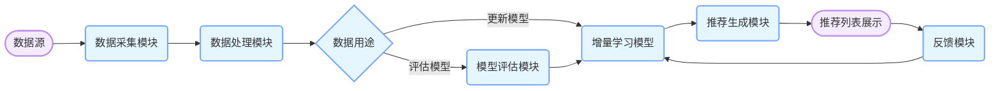

# 增量学习策略在动态推荐系统中的应用研究

> 关键词：增量学习、动态推荐系统、机器学习、数据更新、推荐算法

> 摘要：本文围绕增量学习策略在动态推荐系统中的应用展开研究。首先介绍了研究的背景、目的和范围，明确预期读者和文档结构。接着阐述了增量学习和动态推荐系统的核心概念及它们之间的联系，通过文本示意图和 Mermaid 流程图进行清晰展示。详细讲解了增量学习的核心算法原理，结合 Python 源代码进行具体操作步骤的说明。深入分析了相关的数学模型和公式，并举例说明其应用。通过项目实战，展示了在动态推荐系统中应用增量学习的具体实现，包括开发环境搭建、源代码详细实现与解读。探讨了增量学习在动态推荐系统中的实际应用场景，推荐了相关的学习资源、开发工具框架以及论文著作。最后总结了未来发展趋势与挑战，提供了常见问题的解答和扩展阅读参考资料。

## 1. 背景介绍 
### 1.1 目的和范围
随着互联网技术的飞速发展，推荐系统在各个领域得到了广泛应用，如电商、社交媒体、新闻资讯等。然而，传统的推荐系统往往基于静态数据集进行训练，难以适应数据的动态变化。在实际应用中，用户的行为、兴趣和偏好会随着时间不断变化，新的物品和用户也会不断加入系统。因此，需要一种能够实时更新模型以适应动态数据的方法，增量学习策略应运而生。

本研究的目的是深入探讨增量学习策略在动态推荐系统中的应用，分析其优势和挑战，提供具体的实现方法和技术方案。研究范围涵盖了增量学习的基本概念、核心算法、数学模型，以及在不同类型推荐系统中的应用案例。

### 1.2 预期读者
本文预期读者包括从事推荐系统开发、机器学习研究的专业人员，对人工智能和数据挖掘感兴趣的学生和研究人员，以及希望了解动态推荐系统技术的企业管理人员和决策者。

### 1.3 文档结构概述
本文共分为十个部分。第一部分为背景介绍，阐述研究的目的、范围、预期读者和文档结构。第二部分介绍增量学习和动态推荐系统的核心概念及它们之间的联系。第三部分详细讲解增量学习的核心算法原理，并给出具体操作步骤的 Python 源代码。第四部分分析相关的数学模型和公式，并举例说明其应用。第五部分通过项目实战，展示增量学习在动态推荐系统中的具体实现。第六部分探讨增量学习在动态推荐系统中的实际应用场景。第七部分推荐相关的学习资源、开发工具框架和论文著作。第八部分总结未来发展趋势与挑战。第九部分提供常见问题的解答。第十部分为扩展阅读和参考资料。

### 1.4 术语表
#### 1.4.1 核心术语定义
- **增量学习（Incremental Learning）**：指在模型训练过程中，当有新的数据到来时，能够在原有模型的基础上进行更新和调整，而不需要重新训练整个模型。
- **动态推荐系统（Dynamic Recommendation System）**：能够根据用户行为和数据的动态变化实时调整推荐结果的系统。
- **机器学习（Machine Learning）**：一门多领域交叉学科，涉及概率论、统计学、逼近论、凸分析、算法复杂度理论等多门学科。它专门研究计算机怎样模拟或实现人类的学习行为，以获取新的知识或技能，重新组织已有的知识结构使之不断改善自身的性能。
- **数据更新（Data Update）**：指对系统中的数据进行添加、修改或删除操作，以反映现实世界的变化。
- **推荐算法（Recommendation Algorithm）**：用于根据用户的历史行为和偏好，为用户推荐可能感兴趣的物品或内容的算法。

#### 1.4.2 相关概念解释
- **在线学习（Online Learning）**：一种特殊的增量学习方式，模型在每次接收到一个新的数据样本后就立即进行更新。
- **批量学习（Batch Learning）**：传统的机器学习方法，在训练模型时需要使用全部的数据集进行一次性训练。
- **遗忘机制（Forgetting Mechanism）**：在增量学习中，为了避免模型过拟合旧数据，需要对旧数据的影响进行一定程度的削弱，这种机制称为遗忘机制。

#### 1.4.3 缩略词列表
- **ML（Machine Learning）**：机器学习
- **RS（Recommendation System）**：推荐系统
- **IL（Incremental Learning）**：增量学习

## 2. 核心概念与联系 
### 核心概念原理
#### 增量学习原理
增量学习的核心思想是在已有模型的基础上，利用新的数据对模型进行更新和优化。传统的批量学习方法需要在每次有新数据时重新训练整个模型，这在数据量较大时会消耗大量的时间和计算资源。而增量学习则通过对新数据的逐步处理，不断调整模型的参数，使得模型能够适应数据的动态变化。

增量学习的过程可以分为以下几个步骤：
1. **初始化模型**：使用初始数据集训练一个基础模型。
2. **接收新数据**：当有新的数据到来时，将其添加到数据集的一部分。
3. **更新模型**：利用新数据对已有模型进行更新，调整模型的参数。
4. **评估模型**：对更新后的模型进行评估，检查其性能是否有所提升。
5. **重复步骤 2 - 4**：不断接收新数据，更新模型，直到满足停止条件。

#### 动态推荐系统原理
动态推荐系统的目标是根据用户的实时行为和数据变化，实时调整推荐结果。它通常包含以下几个组件：
1. **数据采集模块**：负责收集用户的行为数据，如浏览记录、购买记录、评分等。
2. **数据处理模块**：对采集到的数据进行清洗、预处理和特征提取。
3. **推荐模型模块**：使用机器学习算法训练推荐模型，根据用户的特征和历史行为预测用户可能感兴趣的物品。
4. **推荐生成模块**：根据推荐模型的输出，生成推荐列表，并展示给用户。
5. **反馈模块**：收集用户对推荐结果的反馈信息，用于评估推荐系统的性能，并对推荐模型进行调整。

### 核心概念架构
#### 文本示意图
增量学习在动态推荐系统中的应用架构可以描述如下：

动态推荐系统的数据源不断产生新的用户行为数据，这些数据首先经过数据采集模块收集，然后传输到数据处理模块进行预处理。预处理后的数据一部分用于更新增量学习模型，另一部分用于评估模型的性能。增量学习模型根据新数据对已有模型进行更新，生成新的推荐模型。推荐生成模块使用新的推荐模型为用户生成推荐列表，并展示给用户。用户对推荐结果的反馈信息通过反馈模块收集，用于进一步调整推荐模型。

#### Mermaid 流程图


## 3. 核心算法原理 & 具体操作步骤 
### 增量学习算法原理
增量学习有多种算法，这里以增量式梯度下降算法为例进行讲解。

#### 梯度下降算法回顾
梯度下降算法是一种常用的优化算法，用于寻找函数的最小值。对于一个目标函数 $J(\theta)$，其中 $\theta$ 是模型的参数，梯度下降算法通过不断更新参数 $\theta$ 来最小化目标函数。参数更新的公式为：

$$\theta = \theta - \alpha \nabla J(\theta)$$

其中，$\alpha$ 是学习率，$\nabla J(\theta)$ 是目标函数 $J(\theta)$ 关于参数 $\theta$ 的梯度。

#### 增量式梯度下降算法原理
增量式梯度下降算法是梯度下降算法的一种变体，它每次只使用一个新的数据样本进行参数更新。具体步骤如下：
1. 初始化模型参数 $\theta$。
2. 对于每个新的数据样本 $(x_i, y_i)$：
    - 计算目标函数 $J(\theta)$ 关于参数 $\theta$ 在该样本上的梯度 $\nabla J_i(\theta)$。
    - 更新参数 $\theta$：$\theta = \theta - \alpha \nabla J_i(\theta)$。
3. 重复步骤 2，直到满足停止条件。

### 具体操作步骤及 Python 代码实现
```python
import numpy as np

# 定义目标函数（这里以线性回归的均方误差为例）
def objective_function(X, y, theta):
    m = len(y)
    predictions = np.dot(X, theta)
    error = predictions - y
    return (1 / (2 * m)) * np.sum(np.square(error))

# 定义目标函数的梯度
def gradient(X, y, theta):
    m = len(y)
    predictions = np.dot(X, theta)
    error = predictions - y
    return (1 / m) * np.dot(X.T, error)

# 增量式梯度下降算法
def incremental_gradient_descent(X, y, theta, alpha, num_iterations):
    m = len(y)
    for _ in range(num_iterations):
        for i in range(m):
            xi = X[i].reshape(1, -1)
            yi = y[i]
            grad = gradient(xi, yi, theta)
            theta = theta - alpha * grad
    return theta

# 示例数据
X = np.array([[1, 2], [2, 3], [3, 4], [4, 5]])
y = np.array([5, 7, 9, 11])

# 初始化参数
theta = np.zeros(X.shape[1])

# 学习率和迭代次数
alpha = 0.01
num_iterations = 100

# 执行增量式梯度下降算法
theta = incremental_gradient_descent(X, y, theta, alpha, num_iterations)

print("优化后的参数:", theta)
```

### 代码解释
1. **目标函数**：`objective_function` 函数用于计算线性回归的均方误差，作为目标函数。
2. **梯度计算**：`gradient` 函数用于计算目标函数关于参数 $\theta$ 的梯度。
3. **增量式梯度下降算法**：`incremental_gradient_descent` 函数实现了增量式梯度下降算法，每次只使用一个数据样本进行参数更新。
4. **示例数据**：定义了一个简单的二维数据集 $X$ 和对应的标签 $y$。
5. **参数初始化**：将参数 $\theta$ 初始化为零向量。
6. **执行算法**：调用 `incremental_gradient_descent` 函数进行参数优化，并输出优化后的参数。

## 4. 数学模型和公式 & 详细讲解 & 举例说明 
### 线性回归模型
线性回归是一种简单而常用的机器学习模型，用于预测连续值。其数学模型可以表示为：

$$y = \theta_0 + \theta_1 x_1 + \theta_2 x_2 + \cdots + \theta_n x_n$$

其中，$y$ 是预测值，$x_1, x_2, \cdots, x_n$ 是输入特征，$\theta_0, \theta_1, \cdots, \theta_n$ 是模型的参数。

可以将上述公式写成矩阵形式：

$$y = X \theta$$

其中，$X$ 是输入特征矩阵，$\theta$ 是参数向量。

### 均方误差目标函数
为了评估线性回归模型的性能，通常使用均方误差（Mean Squared Error, MSE）作为目标函数。均方误差的定义为：

$$J(\theta) = \frac{1}{2m} \sum_{i=1}^{m} (y^{(i)} - h_{\theta}(x^{(i)}))^2$$

其中，$m$ 是样本数量，$y^{(i)}$ 是第 $i$ 个样本的真实标签，$h_{\theta}(x^{(i)})$ 是第 $i$ 个样本的预测值。

### 梯度计算
为了使用梯度下降算法优化目标函数 $J(\theta)$，需要计算其关于参数 $\theta$ 的梯度。梯度的计算公式为：

$$\nabla J(\theta) = \frac{1}{m} \sum_{i=1}^{m} (h_{\theta}(x^{(i)}) - y^{(i)}) x^{(i)}$$

### 举例说明
假设有一个简单的线性回归问题，输入特征 $x$ 和对应的标签 $y$ 如下：

| $x$ | $y$ |
| --- | --- |
| 1   | 2   |
| 2   | 4   |
| 3   | 6   |

我们可以将输入特征矩阵 $X$ 和标签向量 $y$ 表示为：

$$X = \begin{bmatrix} 1 & 1 \\ 1 & 2 \\ 1 & 3 \end{bmatrix}, y = \begin{bmatrix} 2 \\ 4 \\ 6 \end{bmatrix}$$

假设初始参数 $\theta = \begin{bmatrix} 0 \\ 0 \end{bmatrix}$，学习率 $\alpha = 0.01$。

1. 计算第一个样本 $(x^{(1)}, y^{(1)}) = (1, 2)$ 时的梯度：

$$h_{\theta}(x^{(1)}) = \theta_0 + \theta_1 x_1^{(1)} = 0 + 0 \times 1 = 0$$

$$\nabla J_1(\theta) = (h_{\theta}(x^{(1)}) - y^{(1)}) x^{(1)} = (0 - 2) \begin{bmatrix} 1 \\ 1 \end{bmatrix} = \begin{bmatrix} -2 \\ -2 \end{bmatrix}$$

2. 更新参数：

$$\theta = \theta - \alpha \nabla J_1(\theta) = \begin{bmatrix} 0 \\ 0 \end{bmatrix} - 0.01 \begin{bmatrix} -2 \\ -2 \end{bmatrix} = \begin{bmatrix} 0.02 \\ 0.02 \end{bmatrix}$$

3. 重复上述步骤，依次处理每个样本，直到满足停止条件。

## 5. 项目实战：代码实际案例和详细解释说明 
### 5.1  开发环境搭建
#### 操作系统
本项目可以在 Windows、Linux 或 macOS 操作系统上进行开发。这里以 Windows 10 为例进行说明。

#### 编程语言和版本
使用 Python 3.7 及以上版本。可以从 Python 官方网站（https://www.python.org/downloads/） 下载并安装。

#### 开发工具
推荐使用 PyCharm 作为开发工具。可以从 JetBrains 官方网站（https://www.jetbrains.com/pycharm/download/） 下载并安装社区版。

#### 依赖库
本项目需要使用以下 Python 库：
- `numpy`：用于数值计算。
- `pandas`：用于数据处理和分析。
- `scikit-learn`：用于机器学习算法和模型评估。

可以使用以下命令安装这些库：

```sh
pip install numpy pandas scikit-learn
```

### 5.2  源代码详细实现和代码解读
```python
import numpy as np
import pandas as pd
from sklearn.model_selection import train_test_split
from sklearn.linear_model import SGDRegressor

# 加载数据集
data = pd.read_csv('data.csv')

# 分离特征和标签
X = data.drop('target', axis=1).values
y = data['target'].values

# 划分训练集和测试集
X_train, X_test, y_train, y_test = train_test_split(X, y, test_size=0.2, random_state=42)

# 初始化增量学习模型
model = SGDRegressor()

# 分批次训练模型
batch_size = 10
num_batches = len(X_train) // batch_size

for i in range(num_batches):
    start = i * batch_size
    end = start + batch_size
    X_batch = X_train[start:end]
    y_batch = y_train[start:end]
    model.partial_fit(X_batch, y_batch)

# 在测试集上评估模型
score = model.score(X_test, y_test)
print("模型在测试集上的得分:", score)
```

### 代码解读与分析
1. **数据加载**：使用 `pandas` 库的 `read_csv` 函数加载数据集。假设数据集文件名为 `data.csv`，其中包含特征和标签。
2. **特征和标签分离**：使用 `drop` 方法分离特征和标签，并将其转换为 NumPy 数组。
3. **数据集划分**：使用 `train_test_split` 函数将数据集划分为训练集和测试集，测试集占比为 20%。
4. **模型初始化**：使用 `SGDRegressor` 初始化一个增量学习模型。`SGDRegressor` 是基于随机梯度下降算法的线性回归模型，支持增量学习。
5. **分批次训练模型**：将训练集分成多个小批次，每次使用一个小批次的数据调用 `partial_fit` 方法对模型进行更新。
6. **模型评估**：使用 `score` 方法在测试集上评估模型的性能，并输出得分。

## 6. 实际应用场景 
### 电商推荐系统
在电商平台中，用户的购买行为和浏览记录会不断变化。使用增量学习策略可以实时更新推荐模型，根据用户的最新行为为用户推荐更符合其当前兴趣的商品。例如，当用户浏览了某一款电子产品后，系统可以立即更新推荐列表，为用户推荐相关的配件和周边产品。

### 新闻资讯推荐系统
新闻资讯的内容是实时更新的，用户的兴趣也会随着时间和事件的发展而变化。增量学习可以帮助新闻推荐系统及时捕捉用户的兴趣变化，为用户推荐最新、最感兴趣的新闻文章。例如，当某个热点事件发生时，系统可以快速调整推荐策略，为用户推送相关的新闻报道。

### 社交媒体推荐系统
社交媒体平台上用户的社交关系和互动行为不断变化。增量学习可以用于更新社交推荐模型，为用户推荐可能感兴趣的好友、话题和内容。例如，当用户关注了某个新的用户或参与了某个热门话题的讨论后，系统可以根据这些新的行为为用户推荐相关的内容和用户。

### 音乐推荐系统
用户的音乐喜好会随着时间和心情的变化而改变。增量学习可以使音乐推荐系统根据用户的最新听歌记录和评分，实时调整推荐结果，为用户推荐更符合其当前口味的音乐。例如，当用户最近频繁收听某一类型的音乐时，系统可以增加该类型音乐的推荐比例。

## 7. 工具和资源推荐
### 7.1 学习资源推荐
#### 7.1.1 书籍推荐
- 《机器学习》（周志华著）：这本书是机器学习领域的经典教材，系统地介绍了机器学习的基本概念、算法和应用。
- 《深度学习》（Ian Goodfellow、Yoshua Bengio 和 Aaron Courville 著）：深度学习领域的权威著作，详细介绍了深度学习的原理、算法和实践。
- 《Python 机器学习实战》（Sebastian Raschka 著）：通过实际案例介绍了如何使用 Python 进行机器学习开发，适合初学者入门。

#### 7.1.2 在线课程
- Coursera 上的“机器学习”课程（Andrew Ng 教授授课）：这是一门非常经典的机器学习课程，涵盖了机器学习的基本概念、算法和应用。
- edX 上的“深度学习微硕士项目”：提供了深度学习领域的系统学习课程，包括卷积神经网络、循环神经网络等。
- 网易云课堂上的“Python 数据分析与机器学习实战”课程：结合实际案例介绍了 Python 在数据分析和机器学习中的应用。

#### 7.1.3 技术博客和网站
- Medium 上的机器学习相关博客：有很多机器学习领域的专家和从业者分享他们的经验和见解。
- Kaggle 社区：是一个数据科学和机器学习竞赛平台，上面有很多优秀的代码和解决方案可供学习。
- 机器之心：专注于人工智能领域的技术资讯和研究成果分享。

### 7.2 开发工具框架推荐
#### 7.2.1 IDE和编辑器
- PyCharm：是一款专门为 Python 开发设计的集成开发环境，提供了丰富的功能和插件，方便开发和调试。
- Jupyter Notebook：是一个交互式的开发环境，适合进行数据分析和机器学习实验。
- Visual Studio Code：是一款轻量级的代码编辑器，支持多种编程语言和插件，也可以用于 Python 开发。

#### 7.2.2 调试和性能分析工具
- PySnooper：可以自动记录函数的执行过程和变量的值，方便调试代码。
- cProfile：Python 自带的性能分析工具，可以分析代码的运行时间和函数调用情况。
- TensorBoard：是 TensorFlow 提供的可视化工具，可以用于监控模型的训练过程和性能。

#### 7.2.3 相关框架和库
- Scikit-learn：是一个简单易用的机器学习库，提供了丰富的机器学习算法和工具。
- TensorFlow：是一个开源的深度学习框架，广泛应用于图像识别、自然语言处理等领域。
- PyTorch：是另一个流行的深度学习框架，具有动态图的优势，适合快速开发和实验。

### 7.3 相关论文著作推荐
#### 7.3.1 经典论文
- “Learning representations by back-propagating errors”（Rumelhart, Hinton, and Williams, 1986）：这篇论文介绍了反向传播算法，是神经网络领域的经典之作。
- “Gradient-based learning applied to document recognition”（LeCun et al., 1998）：提出了卷积神经网络（CNN）的经典架构 LeNet，推动了图像识别领域的发展。
- “A fast learning algorithm for deep belief nets”（Hinton, Osindero, and Teh, 2006）：介绍了深度信念网络（DBN）的快速学习算法，开启了深度学习的热潮。

#### 7.3.2 最新研究成果
- 在 arXiv 预印本平台上搜索“incremental learning in recommendation systems”可以找到很多关于增量学习在推荐系统中应用的最新研究成果。
- 国际机器学习会议（ICML）、神经信息处理系统大会（NeurIPS）等顶级学术会议上也有很多相关的研究论文。

#### 7.3.3 应用案例分析
- 一些大型科技公司的技术博客会分享他们在推荐系统中应用增量学习的实际案例，例如 Google、Facebook、Amazon 等。
- 行业报告和研究机构的分析文章也可以提供一些应用案例和实践经验。

## 8. 总结：未来发展趋势与挑战
### 未来发展趋势
#### 多模态数据融合
未来的动态推荐系统将不仅考虑用户的文本信息，还会融合图像、音频、视频等多模态数据。增量学习策略需要能够适应多模态数据的动态变化，提高推荐的准确性和多样性。

#### 个性化推荐的深度定制
随着用户对个性化体验的要求越来越高，推荐系统将更加注重为用户提供深度定制的推荐服务。增量学习可以实时捕捉用户的细微兴趣变化，为用户提供更加精准、个性化的推荐。

#### 与强化学习的结合
强化学习可以通过与环境的交互不断优化决策策略。将增量学习与强化学习相结合，可以使推荐系统在动态环境中更好地适应变化，提高推荐的效果和用户满意度。

#### 边缘计算与增量学习
边缘计算可以将数据处理和模型更新的任务放在离用户更近的边缘设备上进行，减少数据传输延迟。增量学习在边缘计算中的应用将成为未来的一个重要发展方向，提高推荐系统的实时性和隐私保护能力。

### 挑战
#### 数据质量和噪声处理
动态数据中可能存在噪声和异常值，这些会影响增量学习模型的性能。如何有效地处理数据质量问题，提高模型的鲁棒性，是一个亟待解决的挑战。

#### 模型的可扩展性
随着数据量和用户数量的不断增加，增量学习模型需要具备良好的可扩展性。如何设计高效的算法和架构，使模型能够在大规模数据上进行快速更新和训练，是一个重要的研究方向。

#### 隐私保护
在动态推荐系统中，用户的行为数据包含了大量的隐私信息。如何在增量学习过程中保护用户的隐私，避免数据泄露，是一个需要关注的问题。

#### 模型的稳定性
增量学习模型在不断更新的过程中可能会出现不稳定的情况，例如模型的性能波动、过拟合等。如何保证模型的稳定性，提高推荐结果的一致性，是一个具有挑战性的问题。

## 9. 附录：常见问题与解答
### 问题 1：增量学习和在线学习有什么区别？
增量学习是一种更广义的概念，它强调在已有模型的基础上利用新数据进行更新。在线学习是增量学习的一种特殊形式，它每次只处理一个新的数据样本，并立即更新模型。

### 问题 2：增量学习适用于所有类型的推荐系统吗？
不是所有类型的推荐系统都适合使用增量学习。对于数据变化较慢、更新周期较长的推荐系统，传统的批量学习方法可能已经足够。而对于数据动态变化频繁、需要实时更新推荐结果的系统，增量学习则具有明显的优势。

### 问题 3：如何选择合适的增量学习算法？
选择合适的增量学习算法需要考虑多个因素，如数据的特点、模型的复杂度、计算资源的限制等。一般来说，可以根据具体的应用场景选择不同的算法，例如对于线性模型可以选择增量式梯度下降算法，对于深度学习模型可以选择基于随机梯度下降的增量学习算法。

### 问题 4：增量学习会导致模型过拟合吗？
增量学习过程中，如果不采取适当的措施，可能会导致模型过拟合旧数据。为了避免过拟合，可以采用遗忘机制，对旧数据的影响进行一定程度的削弱；也可以使用正则化方法，对模型的复杂度进行约束。

### 问题 5：如何评估增量学习模型的性能？
可以使用传统的机器学习评估指标，如准确率、召回率、均方误差等，对增量学习模型的性能进行评估。同时，还可以关注模型在新数据上的性能变化，以及模型的稳定性和收敛速度等指标。

## 10. 扩展阅读 & 参考资料
### 扩展阅读
- 《人工智能：现代方法》（Stuart Russell 和 Peter Norvig 著）：全面介绍了人工智能的基本概念、算法和应用，是人工智能领域的经典教材。
- 《数据挖掘：概念与技术》（Jiawei Han、Jian Pei 和 Micheline Kamber 著）：详细介绍了数据挖掘的基本概念、算法和应用，对于理解推荐系统和增量学习有很大的帮助。
- 《推荐系统实践》（项亮著）：结合实际案例介绍了推荐系统的设计和实现方法，是推荐系统领域的实用指南。

### 参考资料
- 周志华. 机器学习. 清华大学出版社, 2016.
- Ian Goodfellow, Yoshua Bengio, Aaron Courville. 深度学习. 人民邮电出版社, 2017.
- Sebastian Raschka. Python 机器学习实战. 机械工业出版社, 2018.
- Rumelhart, D. E., Hinton, G. E., & Williams, R. J. (1986). Learning representations by back-propagating errors. Nature, 323(6088), 533-536.
- LeCun, Y., Bottou, L., Bengio, Y., & Haffner, P. (1998). Gradient-based learning applied to document recognition. Proceedings of the IEEE, 86(11), 2278-2324.
- Hinton, G. E., Osindero, S., & Teh, Y. W. (2006). A fast learning algorithm for deep belief nets. Neural computation, 18(7), 1527-1554.

作者：AI天才研究院/AI Genius Institute & 禅与计算机程序设计艺术 /Zen And The Art of Computer Programming