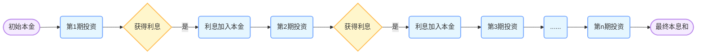

# 复利的魔力：20年长期投资的惊人结果

> 关键词：复利、长期投资、投资回报率、财务规划、资产增值、投资策略、复利计算

> 摘要：本文深入探讨了复利在20年长期投资中的巨大作用。通过对复利核心概念、算法原理、数学模型的详细分析，结合实际案例展示了复利如何实现资产的惊人增长。同时，介绍了相关的开发环境搭建、代码实现与解读，阐述了复利在不同场景下的实际应用，推荐了学习资源、开发工具和相关论文著作。最后，总结了复利投资的未来发展趋势与挑战，并提供了常见问题解答和扩展阅读资料，帮助读者全面理解复利的魔力以及如何在长期投资中运用它实现财务目标。

## 1. 背景介绍 
### 1.1 目的和范围
本文旨在揭示复利在20年长期投资过程中所产生的巨大影响。通过理论分析、数学建模、代码实现以及实际案例展示，让读者深入理解复利的运作机制和强大威力。范围涵盖复利的基本概念、计算方法、在不同投资场景中的应用，以及如何利用复利制定有效的长期投资策略。

### 1.2 预期读者
本文适合对投资和理财感兴趣的初学者，希望深入了解复利原理并将其应用于实际投资的投资者，以及从事金融、经济相关专业的学生和研究人员。同时，对于程序员和技术爱好者，也能从本文的代码实现和算法原理中获得启发。

### 1.3 文档结构概述
本文将首先介绍复利的核心概念和相关联系，包括原理和架构的示意图与流程图。接着详细阐述复利的核心算法原理和具体操作步骤，通过Python代码进行说明。然后给出复利的数学模型和公式，并举例说明。之后通过项目实战，展示复利在实际投资中的代码实现和详细解释。再探讨复利的实际应用场景，推荐相关的学习资源、开发工具和论文著作。最后总结复利投资的未来发展趋势与挑战，提供常见问题解答和扩展阅读资料。

### 1.4 术语表
#### 1.4.1 核心术语定义
- **复利**：复利是指在每一个计息期后，将所生利息加入本金再计利息，逐期滚算，俗称“利滚利”。
- **本金**：指投资者最初投入的资金数额。
- **利率**：一定时期内利息与本金的比率，通常用百分比表示。
- **投资回报率**：通过投资而应返回的价值，即企业从一项投资活动中得到的经济回报，常用百分比表示。
- **期数**：在复利计算中，指计算利息的次数，例如按年复利，20年就是20期。

#### 1.4.2 相关概念解释
- **单利**：与复利相对，单利只以本金计算利息，利息不会加入本金再计利息。例如，本金为 $P$，年利率为 $r$，存期为 $n$ 年，单利利息计算公式为 $I = P \times r \times n$。
- **年化利率**：把当前利率（日利率、周利率、月利率）换算成年利率来计算的，是一种理论利率，并不是真正的已取得的利率。

#### 1.4.3 缩略词列表
- **ROI**：Return on Investment，投资回报率。

## 2. 核心概念与联系 
### 复利的原理
复利的核心原理在于利息的再投资。当我们进行投资时，每一期所获得的利息会加入到本金中，成为下一期计算利息的基础。随着时间的推移，本金不断增加，利息也会越来越多，从而实现资产的快速增长。

### 复利与单利的对比
单利只基于初始本金计算利息，而复利则是基于本金和之前累积的利息计算利息。以下是一个简单的对比示例：

假设本金 $P = 10000$ 元，年利率 $r = 5\%$，投资期限 $n = 3$ 年。

- **单利计算**：每年的利息都是 $I = P \times r = 10000 \times 0.05 = 500$ 元，3 年后的本息和为 $A = P + I \times n = 10000 + 500 \times 3 = 11500$ 元。
- **复利计算**：第一年的本息和为 $A_1 = P(1 + r) = 10000(1 + 0.05) = 10500$ 元；第二年的本息和为 $A_2 = A_1(1 + r) = 10500(1 + 0.05) = 11025$ 元；第三年的本息和为 $A_3 = A_2(1 + r) = 11025(1 + 0.05) = 11576.25$ 元。

可以看出，复利计算的结果比单利计算的结果要高，而且随着投资期限的延长，这种差距会越来越大。

### 复利的架构示意图


这个流程图展示了复利的基本运作过程：从初始本金开始，每一期投资后获得利息，将利息加入本金，然后进行下一期投资，不断循环，最终得到最终的本息和。

## 3. 核心算法原理 & 具体操作步骤 
### 复利计算的基本公式
复利计算的基本公式为：

$$A = P(1 + r)^n$$

其中：
- $A$ 表示最终的本息和；
- $P$ 表示初始本金；
- $r$ 表示每期的利率；
- $n$ 表示期数。

### Python 代码实现复利计算
```python
def compound_interest(principal, rate, periods):
    """
    计算复利的最终本息和
    :param principal: 初始本金
    :param rate: 每期利率
    :param periods: 期数
    :return: 最终本息和
    """
    return principal * (1 + rate) ** periods

# 示例
principal = 10000  # 初始本金
rate = 0.05  # 年利率
periods = 20  # 投资期限为20年

final_amount = compound_interest(principal, rate, periods)
print(f"20年后的本息和为: {final_amount} 元")
```

### 代码解释
上述代码定义了一个名为 `compound_interest` 的函数，该函数接受三个参数：初始本金 `principal`、每期利率 `rate` 和期数 `periods`。函数内部使用复利计算公式 $A = P(1 + r)^n$ 计算最终的本息和，并将结果返回。

在示例中，我们设定初始本金为 10000 元，年利率为 5%，投资期限为 20 年。调用 `compound_interest` 函数计算 20 年后的本息和，并将结果打印输出。

### 具体操作步骤
1. 确定初始本金 $P$、每期利率 $r$ 和期数 $n$。
2. 将这些值代入复利计算公式 $A = P(1 + r)^n$ 进行计算。
3. 得到最终的本息和 $A$。

## 4. 数学模型和公式 & 详细讲解 & 举例说明 
### 复利计算公式的推导
复利的计算是基于本金和利息的不断累积。假设初始本金为 $P$，每期利率为 $r$，投资期限为 $n$ 期。

- 第 1 期结束后，本息和为 $A_1 = P + P \times r = P(1 + r)$；
- 第 2 期结束后，本息和为 $A_2 = A_1 + A_1 \times r = A_1(1 + r) = P(1 + r)(1 + r) = P(1 + r)^2$；
- 第 3 期结束后，本息和为 $A_3 = A_2 + A_2 \times r = A_2(1 + r) = P(1 + r)^2(1 + r) = P(1 + r)^3$；
- 以此类推，第 $n$ 期结束后，本息和为 $A = P(1 + r)^n$。

### 连续复利的数学模型
在实际应用中，除了离散复利（按年、月、日等固定周期计算复利），还有连续复利的概念。连续复利是指在无限短的时间间隔内进行复利计算。连续复利的计算公式为：

$$A = Pe^{rt}$$

其中：
- $A$ 表示最终的本息和；
- $P$ 表示初始本金；
- $r$ 表示年利率；
- $t$ 表示投资期限（年）；
- $e$ 是自然常数，约等于 2.71828。

### 举例说明
#### 离散复利示例
假设小明投资了 5000 元，年利率为 6%，投资期限为 15 年，按年复利计算。

根据复利计算公式 $A = P(1 + r)^n$，其中 $P = 5000$，$r = 0.06$，$n = 15$，则：

$$A = 5000(1 + 0.06)^{15} \approx 11982.79$$

即 15 年后小明的投资本息和约为 11982.79 元。

#### 连续复利示例
假设小红投资了 8000 元，年利率为 4%，投资期限为 10 年，按连续复利计算。

根据连续复利计算公式 $A = Pe^{rt}$，其中 $P = 8000$，$r = 0.04$，$t = 10$，则：

$$A = 8000e^{0.04 \times 10} \approx 11934.61$$

即 10 年后小红的投资本息和约为 11934.61 元。

## 5. 项目实战：代码实际案例和详细解释说明 
### 5.1  开发环境搭建
#### 安装 Python
首先，需要安装 Python 编程语言。可以从 Python 官方网站（https://www.python.org/downloads/）下载适合自己操作系统的 Python 安装包，并按照安装向导进行安装。

#### 安装开发工具
推荐使用 PyCharm 作为开发工具，它是一款功能强大的 Python IDE。可以从 JetBrains 官方网站（https://www.jetbrains.com/pycharm/download/）下载 PyCharm 社区版（免费）或专业版（付费）。

### 5.2  源代码详细实现和代码解读
#### 实现复利投资的动态模拟
```python
import matplotlib.pyplot as plt

def compound_interest_simulation(principal, rate, periods):
    """
    模拟复利投资的过程，并绘制每年的本息和变化曲线
    :param principal: 初始本金
    :param rate: 年利率
    :param periods: 投资期限（年）
    """
    amounts = []
    years = []
    for year in range(1, periods + 1):
        amount = principal * (1 + rate) ** year
        amounts.append(amount)
        years.append(year)

    # 绘制折线图
    plt.plot(years, amounts)
    plt.xlabel('年份')
    plt.ylabel('本息和')
    plt.title('复利投资模拟')
    plt.grid(True)
    plt.show()

# 示例
principal = 10000  # 初始本金
rate = 0.05  # 年利率
periods = 20  # 投资期限为20年

compound_interest_simulation(principal, rate, periods)
```

#### 代码解读
上述代码实现了一个复利投资的动态模拟程序。具体步骤如下：
1. 定义 `compound_interest_simulation` 函数，该函数接受三个参数：初始本金 `principal`、年利率 `rate` 和投资期限 `periods`。
2. 在函数内部，使用 `for` 循环遍历每年，根据复利计算公式 $A = P(1 + r)^n$ 计算每年的本息和，并将结果存储在 `amounts` 列表中，同时将年份存储在 `years` 列表中。
3. 使用 `matplotlib` 库绘制折线图，展示每年的本息和变化情况。
4. 设置图表的标题、坐标轴标签和网格线，并显示图表。

### 5.3  代码解读与分析
#### 代码的功能分析
这段代码的主要功能是模拟复利投资的过程，并通过折线图直观地展示每年的本息和变化情况。通过这种方式，我们可以更清晰地看到复利的增长趋势。

#### 代码的复杂度分析
- **时间复杂度**：代码中的 `for` 循环遍历了 `periods` 次，因此时间复杂度为 $O(n)$，其中 $n$ 是投资期限。
- **空间复杂度**：代码中使用了两个列表 `amounts` 和 `years` 来存储每年的本息和和年份，因此空间复杂度也为 $O(n)$。

#### 代码的扩展性
这段代码具有一定的扩展性。例如，我们可以添加更多的参数，如每年的追加投资金额，以模拟更复杂的投资场景。另外，还可以对图表进行更多的美化和定制，如添加图例、调整线条颜色等。

## 6. 实际应用场景 
### 个人理财规划
复利在个人理财规划中具有重要的应用。通过长期投资，利用复利的力量可以实现资产的快速增长，为个人的退休生活、子女教育等目标提供资金支持。例如，年轻人可以每月定期投资一定金额到基金、股票等理财产品中，经过几十年的复利积累，将获得一笔可观的财富。

### 企业投资决策
企业在进行投资决策时，也需要考虑复利的因素。例如，企业在选择投资项目时，会计算项目的投资回报率和净现值，其中复利计算是重要的一环。通过合理利用复利，企业可以评估项目的长期收益，做出更明智的投资决策。

### 金融产品设计
金融机构在设计金融产品时，常常会运用复利的原理。例如，银行的定期存款、债券等产品，通常会采用复利计算利息，以吸引投资者。保险公司的一些理财产品也会利用复利来实现资金的增值，为客户提供更有吸引力的回报。

### 教育储蓄
教育储蓄是一种为子女教育储备资金的方式。家长可以每月或每年定期存入一定金额，通过复利的积累，在子女上大学时可以获得足够的资金支持。教育储蓄通常具有一定的税收优惠政策，进一步提高了投资回报率。

## 7. 工具和资源推荐
### 7.1 学习资源推荐
#### 7.1.1 书籍推荐
- 《穷查理宝典》：作者查理·芒格是巴菲特的黄金搭档，书中介绍了复利的理念以及如何通过长期投资实现财富增长。
- 《聪明的投资者》：本杰明·格雷厄姆的经典著作，详细阐述了投资的基本原则和方法，其中包括复利的应用。
- 《财务自由之路》：作者博多·舍费尔提供了实用的理财建议和投资策略，帮助读者利用复利实现财务自由。

#### 7.1.2 在线课程
- Coursera 上的“Financial Markets”课程：由耶鲁大学教授罗伯特·席勒讲授，涵盖了金融市场的基本原理和投资策略，包括复利的相关内容。
- edX 上的“Investment Management”课程：提供了专业的投资管理知识，帮助学习者深入理解复利在投资中的应用。

#### 7.1.3 技术博客和网站
- 雪球网：一个投资交流社区，有很多投资者分享自己的投资经验和心得，其中不乏关于复利投资的讨论。
- 金融界网站：提供丰富的金融资讯和投资分析，包括复利计算工具和案例分析。

### 7.2 开发工具框架推荐
#### 7.2.1 IDE和编辑器
- PyCharm：功能强大的 Python IDE，提供代码编辑、调试、自动补全、版本控制等功能，适合开发复利计算相关的 Python 程序。
- Jupyter Notebook：交互式的开发环境，支持 Python、R 等多种编程语言，方便进行数据分析和可视化，可用于复利投资的模拟和分析。

#### 7.2.2 调试和性能分析工具
- Py-Spy：一个轻量级的 Python 性能分析工具，可以实时监测 Python 程序的 CPU 使用率和函数调用情况，帮助优化复利计算程序的性能。
- PDB：Python 自带的调试工具，可用于调试复利计算代码，定位和解决代码中的问题。

#### 7.2.3 相关框架和库
- NumPy：用于科学计算的 Python 库，提供高效的数组操作和数学函数，可用于复利计算中的数值计算。
- Pandas：用于数据处理和分析的 Python 库，可用于处理复利投资的历史数据和生成报表。
- Matplotlib：用于数据可视化的 Python 库，可用于绘制复利投资的图表，直观展示投资收益的变化情况。

### 7.3 相关论文著作推荐
#### 7.3.1 经典论文
- 《The Theory of Interest》：欧文·费雪的经典著作，系统阐述了利息理论，包括复利的基本原理和应用。
- 《A Random Walk Down Wall Street》：作者伯顿·马尔基尔提出了随机漫步理论，同时也讨论了复利在长期投资中的重要性。

#### 7.3.2 最新研究成果
- 可以通过学术数据库（如 IEEE Xplore、ACM Digital Library 等）搜索关于复利投资的最新研究论文，了解该领域的前沿动态和研究方法。

#### 7.3.3 应用案例分析
- 一些金融研究机构和咨询公司会发布关于复利投资的应用案例分析报告，可以通过这些报告了解复利在实际投资中的应用效果和策略。

## 8. 总结：未来发展趋势与挑战
### 未来发展趋势
- **数字化投资平台的兴起**：随着互联网技术的发展，数字化投资平台将越来越普及。这些平台提供便捷的投资渠道和智能化的投资工具，让更多的人能够轻松参与复利投资。例如，一些在线理财平台可以根据用户的风险偏好和投资目标，自动为用户推荐合适的投资产品，并实时计算复利收益。
- **个性化投资策略的发展**：未来，投资者对个性化投资策略的需求将不断增加。基于大数据和人工智能技术，投资机构可以为投资者提供更加精准的投资建议，根据投资者的年龄、收入、资产状况等因素，制定个性化的复利投资方案。
- **社会责任投资的融合**：越来越多的投资者开始关注社会责任投资，即投资于那些具有良好社会和环境效益的企业。未来，复利投资将与社会责任投资相结合，实现经济收益和社会效益的双赢。

### 挑战
- **市场波动风险**：复利投资需要长期持有资产，但市场是波动的，资产价格可能会出现大幅下跌。在市场低迷时期，投资者可能会面临资产缩水的风险，影响复利的效果。因此，投资者需要具备一定的风险承受能力和应对市场波动的策略。
- **通货膨胀风险**：通货膨胀会导致货币贬值，降低投资的实际回报率。如果投资回报率低于通货膨胀率，那么复利投资的实际收益将为负数。投资者需要选择能够抵御通货膨胀的投资产品，如股票、房地产等。
- **信息不对称风险**：在金融市场中，信息不对称是一个普遍存在的问题。投资者可能无法获得充分的信息，从而做出错误的投资决策。此外，一些不法分子可能会利用投资者对复利的不了解，进行非法集资和诈骗活动。投资者需要提高自身的金融素养，增强风险意识。

## 9. 附录：常见问题与解答
### 复利计算中利率和期数的单位必须一致吗？
是的，复利计算公式 $A = P(1 + r)^n$ 中，利率 $r$ 和期数 $n$ 的单位必须一致。例如，如果利率是年利率，那么期数就是年数；如果利率是月利率，那么期数就是月数。

### 如何选择合适的投资产品进行复利投资？
选择合适的投资产品需要考虑多个因素，如个人的风险承受能力、投资目标、投资期限等。一般来说，风险承受能力较低的投资者可以选择债券、定期存款等固定收益类产品；风险承受能力较高的投资者可以选择股票、基金等权益类产品。同时，投资者还可以根据自己的投资目标和期限，进行合理的资产配置。

### 复利投资一定能获得高收益吗？
复利投资并不一定能获得高收益。虽然复利的力量在长期投资中非常强大，但投资收益还受到市场环境、投资产品的选择、投资时机等多种因素的影响。在市场不利的情况下，复利投资也可能会出现亏损。因此，投资者需要做好风险控制，合理规划投资。

### 连续复利和离散复利有什么区别？
连续复利是指在无限短的时间间隔内进行复利计算，其计算公式为 $A = Pe^{rt}$；离散复利是指按固定周期（如年、月、日等）计算复利，其计算公式为 $A = P(1 + r)^n$。在实际应用中，离散复利更为常见，但连续复利在理论研究和金融数学中有重要的应用。

## 10. 扩展阅读 & 参考资料
### 扩展阅读
- 《漫步华尔街》：作者伯顿·马尔基尔通过幽默风趣的语言，介绍了股票市场的运作机制和投资策略，对复利投资有深入的探讨。
- 《邻家的百万富翁》：揭示了百万富翁的财富积累秘密，强调了长期投资和复利的重要性。

### 参考资料
- 《金融市场学》：一本经典的金融教材，涵盖了金融市场的基本概念、理论和实务，对复利的计算和应用有详细的介绍。
- 《投资学》：全面介绍了投资的基本原理、方法和策略，包括复利投资的相关内容。

作者：AI天才研究院/AI Genius Institute & 禅与计算机程序设计艺术 /Zen And The Art of Computer Programming