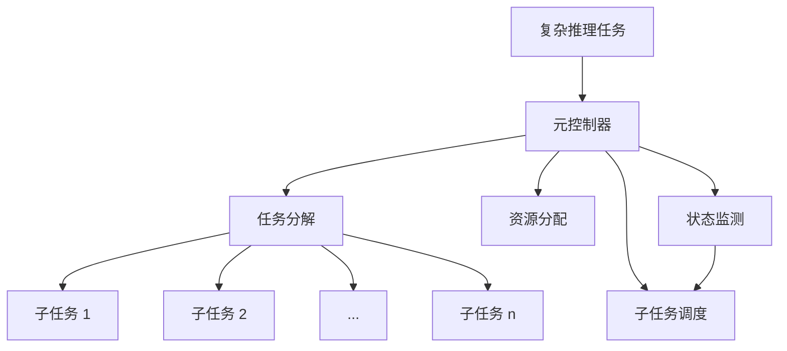

# 复杂推理任务协调中元控制器的优化策略

> 关键词：复杂推理任务、元控制器、优化策略、任务协调、人工智能

> 摘要：本文聚焦于复杂推理任务协调中的元控制器优化策略。首先介绍了相关背景知识，包括研究目的、预期读者等。接着深入剖析核心概念，阐述元控制器在复杂推理任务协调中的作用与原理，并给出相应的文本示意图和Mermaid流程图。详细讲解核心算法原理，结合Python代码进行说明，同时介绍相关数学模型和公式。通过项目实战，展示代码的实际案例并进行详细解读。探讨了元控制器优化策略在实际中的应用场景，推荐了学习资源、开发工具框架以及相关论文著作。最后总结未来发展趋势与挑战，提供常见问题解答和扩展阅读参考资料，旨在为相关领域的研究者和开发者提供全面而深入的技术指导。

## 1. 背景介绍 
### 1.1 目的和范围
在当今复杂的人工智能和计算机科学领域，复杂推理任务如知识图谱推理、自然语言处理中的语义推理等变得日益重要。这些任务往往需要多个子任务的协同工作，而元控制器在协调这些子任务的执行过程中起着关键作用。本文的目的在于深入研究复杂推理任务协调中元控制器的优化策略，以提高推理任务的效率、准确性和可扩展性。范围涵盖元控制器的基本概念、核心算法原理、数学模型、实际应用场景以及相关的工具和资源推荐等方面。

### 1.2 预期读者
本文预期读者包括人工智能、计算机科学领域的研究者、开发者、研究生等。对于那些对复杂推理任务协调和元控制器优化感兴趣的人员，以及希望在相关领域开展研究或开发工作的专业人士都具有一定的参考价值。

### 1.3 文档结构概述
本文将按照以下结构进行组织：首先介绍核心概念与联系，明确元控制器在复杂推理任务协调中的角色和工作原理；接着详细阐述核心算法原理和具体操作步骤，结合Python代码进行说明；然后介绍相关的数学模型和公式，并举例说明；通过项目实战展示代码的实际应用和详细解释；探讨实际应用场景；推荐学习资源、开发工具框架和相关论文著作；最后总结未来发展趋势与挑战，提供常见问题解答和扩展阅读参考资料。

### 1.4 术语表
#### 1.4.1 核心术语定义
- **复杂推理任务**：指需要多个步骤、多种知识和推理规则协同工作才能完成的推理任务，如知识图谱中的多跳推理、自然语言处理中的语义推理等。
- **元控制器**：在复杂推理任务协调中，负责管理和调度各个子任务的执行顺序、资源分配等，以实现整体任务的高效完成。
- **优化策略**：为提高元控制器的性能和效率而采取的一系列方法和技术，如算法优化、参数调整等。

#### 1.4.2 相关概念解释
- **任务协调**：在复杂推理任务中，将各个子任务按照一定的规则和顺序进行组织和安排，确保它们能够协同工作，共同完成整体任务。
- **子任务**：复杂推理任务可以分解为多个相对独立的子任务，每个子任务完成特定的推理步骤或功能。

#### 1.4.3 缩略词列表
- **AI**：Artificial Intelligence，人工智能
- **NLP**：Natural Language Processing，自然语言处理
- **KG**：Knowledge Graph，知识图谱

## 2. 核心概念与联系 
### 核心概念原理
在复杂推理任务协调中，元控制器扮演着指挥中心的角色。它接收整体推理任务的描述和目标，将其分解为多个子任务，并根据任务的特点和资源的可用性，决定子任务的执行顺序和资源分配。元控制器通过不断地监测子任务的执行状态，动态地调整任务的调度策略，以确保整体任务能够高效、准确地完成。

例如，在知识图谱的多跳推理任务中，元控制器首先根据查询的问题，将其分解为多个子查询任务。然后，根据知识图谱的结构和节点信息，决定子查询任务的执行顺序。在执行过程中，元控制器实时监测每个子查询任务的执行结果，如果某个子查询任务出现错误或超时，元控制器会及时调整策略，重新分配资源或选择其他的子查询路径。

### 文本示意图
```plaintext
复杂推理任务
|
|-- 元控制器
|   |-- 任务分解
|   |-- 子任务调度
|   |-- 资源分配
|   |-- 状态监测
|
|-- 子任务 1
|-- 子任务 2
|--...
|-- 子任务 n
```

### Mermaid 流程图


## 3. 核心算法原理 & 具体操作步骤 
### 算法原理
元控制器的优化策略通常基于强化学习算法。强化学习是一种通过智能体与环境进行交互，不断学习最优策略的方法。在复杂推理任务协调中，元控制器可以看作是一个智能体，它的目标是通过合理地调度子任务，最大化整体任务的奖励。

具体来说，元控制器的状态可以表示为当前任务的执行状态、资源的使用情况等；动作可以表示为选择下一个要执行的子任务、分配资源等；奖励可以根据任务的完成情况、执行时间等因素来定义。元控制器通过不断地与环境进行交互，根据当前状态选择动作，并根据环境反馈的奖励来更新自己的策略，以逐渐找到最优的任务调度策略。

### Python 源代码阐述
以下是一个简单的元控制器优化策略的 Python 示例代码：
```python
import numpy as np

# 定义状态空间
state_space = np.array([0, 1, 2, 3])  # 示例状态空间
# 定义动作空间
action_space = np.array([0, 1, 2])  # 示例动作空间
# 定义奖励函数
def reward_function(state, action):
    # 简单的奖励函数示例
    if state == 0 and action == 0:
        return 1
    elif state == 1 and action == 1:
        return 2
    else:
        return -1

# 初始化 Q 表
Q_table = np.zeros((len(state_space), len(action_space)))

# 定义超参数
alpha = 0.1  # 学习率
gamma = 0.9  # 折扣因子
epsilon = 0.1  # 探索率
num_episodes = 1000  # 训练轮数

# 强化学习训练过程
for episode in range(num_episodes):
    state = np.random.choice(state_space)  # 随机初始化状态
    done = False
    while not done:
        if np.random.uniform(0, 1) < epsilon:
            action = np.random.choice(action_space)  # 探索
        else:
            action = np.argmax(Q_table[state, :])  # 利用
        reward = reward_function(state, action)
        next_state = np.random.choice(state_space)  # 简单示例，实际中根据任务确定
        # Q 表更新
        Q_table[state, action] = (1 - alpha) * Q_table[state, action] + alpha * (reward + gamma * np.max(Q_table[next_state, :]))
        state = next_state
        if reward > 0:
            done = True

# 输出最优策略
optimal_policy = np.argmax(Q_table, axis=1)
print("最优策略:", optimal_policy)
```
### 具体操作步骤
1. **定义状态空间和动作空间**：根据复杂推理任务的特点，确定元控制器的状态和动作表示。
2. **定义奖励函数**：根据任务的目标和要求，设计合理的奖励函数，用于评估元控制器的动作效果。
3. **初始化 Q 表**：Q 表用于存储状态 - 动作对的价值估计，初始化为零。
4. **设置超参数**：包括学习率、折扣因子、探索率和训练轮数等。
5. **强化学习训练**：在每一轮训练中，元控制器根据当前状态选择动作，执行动作并获得奖励，然后更新 Q 表。
6. **输出最优策略**：训练结束后，根据 Q 表选择每个状态下的最优动作，得到最优策略。

## 4. 数学模型和公式 & 详细讲解 & 举例说明 
### 数学模型
元控制器的优化策略可以用马尔可夫决策过程（MDP）来建模。MDP 是一个五元组 $(S, A, P, R, \gamma)$，其中：
- $S$ 是状态空间，表示元控制器可能处于的所有状态。
- $A$ 是动作空间，表示元控制器可以采取的所有动作。
- $P(s'|s, a)$ 是状态转移概率，表示在状态 $s$ 下采取动作 $a$ 后转移到状态 $s'$ 的概率。
- $R(s, a)$ 是奖励函数，表示在状态 $s$ 下采取动作 $a$ 所获得的即时奖励。
- $\gamma$ 是折扣因子，用于权衡即时奖励和未来奖励。

### 公式
在强化学习中，常用的 Q - learning 算法用于更新 Q 表。Q 表存储了状态 - 动作对的价值估计，更新公式如下：
$$Q(s, a) \leftarrow (1 - \alpha)Q(s, a) + \alpha[R(s, a) + \gamma \max_{a'} Q(s', a')]$$
其中，$Q(s, a)$ 是状态 $s$ 下采取动作 $a$ 的价值估计，$\alpha$ 是学习率，$R(s, a)$ 是即时奖励，$\gamma$ 是折扣因子，$s'$ 是下一个状态。

### 详细讲解
- **状态转移概率**：在复杂推理任务中，状态转移概率通常由任务的具体逻辑和环境决定。例如，在知识图谱推理中，状态可以表示当前推理的位置和已经访问过的节点，动作可以表示选择下一个要访问的节点，状态转移概率则取决于知识图谱的结构和节点之间的连接关系。
- **奖励函数**：奖励函数的设计直接影响元控制器的学习效果。合理的奖励函数应该能够引导元控制器朝着完成任务的目标前进。例如，在自然语言处理的语义推理任务中，奖励函数可以根据推理结果的准确性、推理时间等因素来定义。
- **Q - learning 算法**：Q - learning 算法是一种无模型的强化学习算法，它通过不断地与环境进行交互，更新 Q 表来学习最优策略。学习率 $\alpha$ 控制了新的经验对 Q 表更新的影响程度，折扣因子 $\gamma$ 用于权衡即时奖励和未来奖励。

### 举例说明
假设我们有一个简单的推理任务，状态空间 $S = \{s_0, s_1, s_2\}$，动作空间 $A = \{a_0, a_1\}$。奖励函数如下：
- $R(s_0, a_0) = 1$
- $R(s_1, a_1) = 2$
- 其他情况 $R(s, a) = -1$

初始时，Q 表 $Q$ 全为零。假设当前状态 $s = s_0$，根据 $\epsilon$ - 贪心策略选择动作 $a = a_0$，获得奖励 $R(s_0, a_0) = 1$，下一个状态 $s' = s_1$。则根据 Q - learning 算法更新 Q 表：
$$Q(s_0, a_0) \leftarrow (1 - \alpha)Q(s_0, a_0) + \alpha[R(s_0, a_0) + \gamma \max_{a'} Q(s_1, a')]$$
假设 $\alpha = 0.1$，$\gamma = 0.9$，初始时 $Q(s_0, a_0) = 0$，$Q(s_1, a_0) = 0$，$Q(s_1, a_1) = 0$，则更新后：
$$Q(s_0, a_0) = 0.1 \times (1 + 0.9 \times 0) = 0.1$$

## 5. 项目实战：代码实际案例和详细解释说明 
### 5.1  开发环境搭建
- **Python 环境**：建议使用 Python 3.7 及以上版本，可以从 Python 官方网站（https://www.python.org/downloads/）下载安装。
- **依赖库**：需要安装 NumPy 库，用于数值计算。可以使用以下命令进行安装：
```sh
pip install numpy
```

### 5.2  源代码详细实现和代码解读
```python
import numpy as np

# 定义状态空间
state_space = np.array([0, 1, 2, 3])  # 示例状态空间
# 定义动作空间
action_space = np.array([0, 1, 2])  # 示例动作空间
# 定义奖励函数
def reward_function(state, action):
    # 简单的奖励函数示例
    if state == 0 and action == 0:
        return 1
    elif state == 1 and action == 1:
        return 2
    else:
        return -1

# 初始化 Q 表
Q_table = np.zeros((len(state_space), len(action_space)))

# 定义超参数
alpha = 0.1  # 学习率
gamma = 0.9  # 折扣因子
epsilon = 0.1  # 探索率
num_episodes = 1000  # 训练轮数

# 强化学习训练过程
for episode in range(num_episodes):
    state = np.random.choice(state_space)  # 随机初始化状态
    done = False
    while not done:
        if np.random.uniform(0, 1) < epsilon:
            action = np.random.choice(action_space)  # 探索
        else:
            action = np.argmax(Q_table[state, :])  # 利用
        reward = reward_function(state, action)
        next_state = np.random.choice(state_space)  # 简单示例，实际中根据任务确定
        # Q 表更新
        Q_table[state, action] = (1 - alpha) * Q_table[state, action] + alpha * (reward + gamma * np.max(Q_table[next_state, :]))
        state = next_state
        if reward > 0:
            done = True

# 输出最优策略
optimal_policy = np.argmax(Q_table, axis=1)
print("最优策略:", optimal_policy)
```
### 代码解读与分析
- **状态空间和动作空间定义**：`state_space` 和 `action_space` 分别定义了元控制器的状态和动作表示。在实际应用中，需要根据具体的复杂推理任务进行调整。
- **奖励函数**：`reward_function` 用于评估元控制器在每个状态下采取动作的效果。在这个示例中，根据状态和动作的组合返回不同的奖励值。
- **Q 表初始化**：`Q_table` 用于存储状态 - 动作对的价值估计，初始化为零。
- **超参数设置**：`alpha` 是学习率，控制了新的经验对 Q 表更新的影响程度；`gamma` 是折扣因子，用于权衡即时奖励和未来奖励；`epsilon` 是探索率，控制了元控制器在训练过程中的探索和利用平衡；`num_episodes` 是训练轮数。
- **强化学习训练过程**：在每一轮训练中，元控制器根据当前状态选择动作，执行动作并获得奖励，然后更新 Q 表。如果获得正奖励，则认为任务完成，结束当前轮训练。
- **最优策略输出**：训练结束后，根据 Q 表选择每个状态下的最优动作，得到最优策略并输出。

## 6. 实际应用场景 
### 知识图谱推理
在知识图谱中，多跳推理任务需要根据已知的实体和关系，推理出未知的关系或实体。元控制器可以根据知识图谱的结构和查询问题，合理地调度子查询任务，如选择合适的推理路径、决定查询的顺序等，以提高推理的效率和准确性。

### 自然语言处理中的语义推理
在自然语言处理中，语义推理任务需要理解文本的语义信息，并进行逻辑推理。元控制器可以将复杂的语义推理任务分解为多个子任务，如词性标注、命名实体识别、句法分析等，并协调这些子任务的执行，以实现准确的语义推理。

### 智能决策系统
在智能决策系统中，需要根据大量的信息和规则进行决策。元控制器可以对决策任务进行分解和调度，根据不同的情况选择合适的决策策略，如风险评估、资源分配等，以提高决策的效率和质量。

## 7. 工具和资源推荐
### 7.1 学习资源推荐
#### 7.1.1 书籍推荐
- 《强化学习：原理与Python实现》：详细介绍了强化学习的基本原理和算法，并提供了 Python 代码实现，有助于深入理解元控制器优化策略中使用的强化学习算法。
- 《人工智能：一种现代的方法》：全面介绍了人工智能的各个领域，包括推理、决策等，对于理解复杂推理任务和元控制器的应用有很大帮助。

#### 7.1.2 在线课程
- Coursera 上的“强化学习专项课程”：由知名教授授课，系统地讲解了强化学习的理论和实践，包括 Q - learning 算法等内容。
- edX 上的“人工智能基础”：涵盖了人工智能的基础知识，包括推理、搜索等，对于理解复杂推理任务的本质有一定的帮助。

#### 7.1.3 技术博客和网站
- Medium 上的 AI 相关博客：有很多关于强化学习、元控制器等方面的技术文章，及时了解最新的研究成果和应用案例。
- arXiv 网站：可以获取最新的学术论文，了解复杂推理任务和元控制器优化策略的前沿研究。

### 7.2 开发工具框架推荐
#### 7.2.1 IDE和编辑器
- PyCharm：功能强大的 Python 集成开发环境，提供代码编辑、调试、版本控制等功能，方便开发元控制器优化策略的代码。
- Jupyter Notebook：交互式的开发环境，适合进行代码实验和数据分析，对于验证元控制器优化策略的效果很有帮助。

#### 7.2.2 调试和性能分析工具
- pdb：Python 自带的调试工具，可以帮助开发者定位代码中的问题，调试元控制器优化策略的代码。
- cProfile：Python 的性能分析工具，可以分析代码的运行时间和资源消耗，帮助优化元控制器的性能。

#### 7.2.3 相关框架和库
- OpenAI Gym：提供了一系列的强化学习环境，可以用于测试和验证元控制器优化策略的效果。
- Stable Baselines：基于 TensorFlow 的强化学习库，提供了多种强化学习算法的实现，方便开发者快速应用到元控制器优化中。

### 7.3 相关论文著作推荐
#### 7.3.1 经典论文
- “Reinforcement Learning: An Introduction”：强化学习领域的经典论文，系统地介绍了强化学习的基本概念、算法和应用，对于理解元控制器优化策略的理论基础有重要意义。
- “Markov Decision Processes”：详细阐述了马尔可夫决策过程的理论和应用，是元控制器优化策略建模的重要参考。

#### 7.3.2 最新研究成果
- 可以关注 NeurIPS、ICML、AAAI 等顶级人工智能会议上的相关论文，了解复杂推理任务协调中元控制器优化策略的最新研究进展。

#### 7.3.3 应用案例分析
- 一些工业界的应用案例分析文章，如 Google、Facebook 等公司在复杂推理任务中的实践经验，对于将元控制器优化策略应用到实际项目中有很大的启发。

## 8. 总结：未来发展趋势与挑战
### 未来发展趋势
- **与深度学习的融合**：将元控制器优化策略与深度学习相结合，利用深度学习强大的特征提取和表示能力，提高复杂推理任务的性能。
- **多智能体协作**：在复杂的推理任务中，多个元控制器可以协作工作，共同完成任务，提高系统的整体效率和鲁棒性。
- **可解释性增强**：提高元控制器优化策略的可解释性，使人们能够理解元控制器的决策过程和依据，增强系统的可信度。

### 挑战
- **计算资源需求**：复杂推理任务和元控制器优化策略通常需要大量的计算资源，如何在有限的资源下提高系统的性能是一个挑战。
- **环境动态性**：实际应用中的环境往往是动态变化的，元控制器需要能够快速适应环境的变化，调整策略，这对算法的鲁棒性提出了更高的要求。
- **数据质量和数量**：强化学习算法需要大量高质量的数据进行训练，如何获取和处理这些数据是一个需要解决的问题。

## 9. 附录：常见问题与解答
### Q1：元控制器优化策略只适用于强化学习吗？
A1：不是的，虽然本文主要介绍了基于强化学习的元控制器优化策略，但实际上元控制器的优化还可以采用其他方法，如启发式算法、遗传算法等。强化学习是一种常用的方法，因为它可以通过与环境的交互不断学习最优策略。

### Q2：如何选择合适的超参数？
A2：超参数的选择通常需要通过实验来确定。可以采用网格搜索、随机搜索等方法，在一定的参数范围内进行尝试，选择性能最优的超参数组合。同时，也可以参考相关的研究论文和经验来进行初步的参数设置。

### Q3：元控制器优化策略在实际应用中需要注意什么？
A3：在实际应用中，需要注意以下几点：一是要根据具体的任务特点和环境进行合理的建模和设计；二是要确保数据的质量和数量，以保证算法的学习效果；三是要进行充分的实验和评估，不断优化策略。

## 10. 扩展阅读 & 参考资料
- Sutton, R. S., & Barto, A. G. (2018). Reinforcement learning: An introduction. MIT press.
- Russell, S. J., & Norvig, P. (2016). Artificial intelligence: A modern approach. Pearson.
- OpenAI Gym 官方文档：https://gym.openai.com/docs/
- Stable Baselines 官方文档：https://stable-baselines.readthedocs.io/en/master/

作者：AI天才研究院/AI Genius Institute & 禅与计算机程序设计艺术 /Zen And The Art of Computer Programming