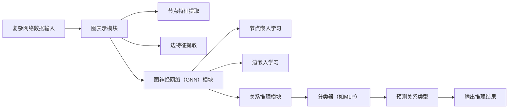

# 复杂网络分析中神经关系推理的前沿技术

> 关键词：复杂网络分析、神经关系推理、图神经网络、深度学习、知识图谱、前沿技术、推理算法

> 摘要：本文聚焦于复杂网络分析中神经关系推理的前沿技术。首先介绍了该领域的研究背景，包括目的、预期读者等内容。接着阐述了核心概念与联系，通过文本示意图和Mermaid流程图展示其原理和架构。详细讲解了核心算法原理，并用Python代码进行说明，同时给出了相关数学模型和公式。在项目实战部分，提供了开发环境搭建、源代码实现及解读。还探讨了实际应用场景，推荐了学习资源、开发工具框架和相关论文著作。最后总结了未来发展趋势与挑战，并给出常见问题解答和参考资料，旨在为相关研究人员和开发者提供全面且深入的技术指导。

## 1. 背景介绍 
### 1.1 目的和范围
复杂网络在现实世界中广泛存在，如社交网络、生物网络、电力网络等。在复杂网络分析中，理解节点之间的关系至关重要。神经关系推理技术旨在利用神经网络的强大学习能力，从复杂网络的数据中自动推理出节点之间的潜在关系。本文章的目的是深入探讨复杂网络分析中神经关系推理的前沿技术，包括其核心概念、算法原理、实际应用等方面。范围涵盖了从基础理论到实际项目的多个层面，旨在为读者提供全面且深入的技术洞察。

### 1.2 预期读者
本文预期读者包括计算机科学、数学、物理学等相关专业的研究人员和学生，以及对复杂网络分析和人工智能技术感兴趣的开发者。无论是从事学术研究还是工业应用的人员，都可以从本文中获取关于神经关系推理的前沿知识和技术指导。

### 1.3 文档结构概述
本文共分为十个部分。第一部分为背景介绍，阐述了研究目的、预期读者和文档结构概述。第二部分介绍核心概念与联系，通过文本示意图和Mermaid流程图展示其原理和架构。第三部分详细讲解核心算法原理，并使用Python源代码进行说明。第四部分给出数学模型和公式，并进行详细讲解和举例说明。第五部分是项目实战，包括开发环境搭建、源代码详细实现和代码解读。第六部分探讨实际应用场景。第七部分推荐学习资源、开发工具框架和相关论文著作。第八部分总结未来发展趋势与挑战。第九部分是附录，解答常见问题。第十部分提供扩展阅读和参考资料。

### 1.4 术语表
#### 1.4.1 核心术语定义
- **复杂网络**：由大量节点和连接这些节点的边组成的网络，节点和边可以代表不同的实体和它们之间的关系。
- **神经关系推理**：利用神经网络技术，从复杂网络的数据中学习和推理节点之间的潜在关系。
- **图神经网络（GNN）**：一类专门用于处理图结构数据的神经网络，能够对图中的节点和边进行表示学习。
- **知识图谱**：一种以图的形式表示知识的结构化数据库，其中节点表示实体，边表示实体之间的关系。

#### 1.4.2 相关概念解释
- **节点嵌入**：将图中的节点映射到低维向量空间的过程，以便于神经网络进行处理和学习。
- **关系推理**：根据已知的节点信息和边的信息，推断出节点之间未知的关系。
- **深度学习**：一种基于神经网络的机器学习方法，通过多层神经网络自动学习数据的特征和模式。

#### 1.4.3 缩略词列表
- **GNN**：Graph Neural Network（图神经网络）
- **MLP**：Multi - Layer Perceptron（多层感知机）
- **RNN**：Recurrent Neural Network（循环神经网络）
- **LSTM**：Long Short - Term Memory（长短期记忆网络）

## 2. 核心概念与联系 

### 核心概念原理
在复杂网络分析中，神经关系推理的核心在于利用神经网络对复杂网络的结构和数据进行建模，从而推理出节点之间的关系。其基本原理是将复杂网络表示为图结构，其中节点代表实体，边代表实体之间的关系。通过图神经网络（GNN）等技术，对图中的节点和边进行特征学习，将节点和边映射到低维向量空间中。在这个向量空间中，可以使用各种机器学习算法和模型来进行关系推理。

例如，对于一个社交网络，节点可以表示用户，边可以表示用户之间的好友关系。通过神经关系推理技术，可以根据用户的基本信息、社交行为等数据，推断出用户之间可能存在的其他关系，如共同兴趣、潜在合作等。

### 架构的文本示意图
```plaintext
复杂网络数据输入
|
|__ 图表示模块
    |
    |__ 节点特征提取
    |__ 边特征提取
|
|__ 图神经网络（GNN）模块
    |
    |__ 节点嵌入学习
    |__ 边嵌入学习
|
|__ 关系推理模块
    |
    |__ 分类器（如MLP）
    |__ 预测关系类型
|
|__ 输出推理结果
```

### Mermaid流程图


## 3. 核心算法原理 & 具体操作步骤 

### 核心算法原理
在神经关系推理中，常用的核心算法是图神经网络（GNN）。GNN通过迭代地聚合节点的邻居信息来更新节点的表示。具体来说，每个节点会根据其邻居节点的特征和边的特征来更新自己的特征。以下是一个简单的GNN层的更新公式：

设 $h_i^{(l)}$ 表示第 $l$ 层中节点 $i$ 的特征向量，$N(i)$ 表示节点 $i$ 的邻居节点集合，$W^{(l)}$ 是第 $l$ 层的可学习权重矩阵，$f$ 是激活函数。则节点 $i$ 在第 $l + 1$ 层的特征更新公式为：

$$h_i^{(l + 1)} = f\left(W^{(l)}\sum_{j\in N(i)}\frac{h_j^{(l)}}{|N(i)|}\right)$$

### 具体操作步骤
1. **数据预处理**：将复杂网络数据转换为图结构数据，包括节点特征和边特征的提取和表示。
2. **图神经网络构建**：选择合适的GNN模型，如Graph Convolutional Network（GCN）、Graph Attention Network（GAT）等，并初始化模型的参数。
3. **训练过程**：使用训练数据对GNN模型进行训练，通过最小化损失函数来更新模型的参数。常见的损失函数包括交叉熵损失、均方误差损失等。
4. **关系推理**：使用训练好的GNN模型对测试数据进行推理，得到节点之间的关系预测结果。

### Python源代码实现
```python
import torch
import torch.nn as nn
import torch.nn.functional as F

# 定义一个简单的GCN层
class GCNLayer(nn.Module):
    def __init__(self, in_features, out_features):
        super(GCNLayer, self).__init__()
        self.weight = nn.Parameter(torch.FloatTensor(in_features, out_features))
        self.reset_parameters()

    def reset_parameters(self):
        nn.init.xavier_uniform_(self.weight)

    def forward(self, x, adj):
        support = torch.mm(x, self.weight)
        output = torch.spmm(adj, support)
        return output

# 定义一个简单的GCN模型
class GCN(nn.Module):
    def __init__(self, nfeat, nhid, nclass):
        super(GCN, self).__init__()
        self.gc1 = GCNLayer(nfeat, nhid)
        self.gc2 = GCNLayer(nhid, nclass)

    def forward(self, x, adj):
        x = F.relu(self.gc1(x, adj))
        x = self.gc2(x, adj)
        return F.log_softmax(x, dim=1)

# 示例使用
# 假设输入特征维度为10，隐藏层维度为20，输出类别数为3
nfeat = 10
nhid = 20
nclass = 3
model = GCN(nfeat, nhid, nclass)

# 生成随机输入数据
x = torch.randn(100, nfeat)  # 100个节点，每个节点特征维度为10
adj = torch.randn(100, 100)  # 邻接矩阵
adj = (adj > 0).float()  # 转换为0-1矩阵

# 前向传播
output = model(x, adj)
print(output.shape)
```

## 4. 数学模型和公式 & 详细讲解 & 举例说明 

### 图神经网络的数学模型
在图神经网络中，常用的数学模型基于消息传递机制。消息传递机制可以分为三个步骤：消息生成、消息聚合和消息更新。

#### 消息生成
对于节点 $i$ 和其邻居节点 $j$，消息生成函数 $M$ 定义为：

$$m_{j\rightarrow i}^{(l)} = M^{(l)}(h_i^{(l)}, h_j^{(l)}, e_{ij})$$

其中，$h_i^{(l)}$ 和 $h_j^{(l)}$ 分别是节点 $i$ 和 $j$ 在第 $l$ 层的特征向量，$e_{ij}$ 是节点 $i$ 和 $j$ 之间的边的特征向量。

#### 消息聚合
节点 $i$ 从其所有邻居节点收到的消息通过聚合函数 $A$ 进行聚合：

$$\hat{m}_i^{(l)} = A^{(l)}\left(\{m_{j\rightarrow i}^{(l)}\}_{j\in N(i)}\right)$$

常见的聚合函数包括求和、平均、最大值等。

#### 消息更新
节点 $i$ 在第 $l + 1$ 层的特征向量通过更新函数 $U$ 进行更新：

$$h_i^{(l + 1)} = U^{(l)}(h_i^{(l)}, \hat{m}_i^{(l)})$$

### 举例说明
假设我们有一个简单的图，包含三个节点 $A$、$B$、$C$，节点之间的边表示它们之间的关系。节点 $A$ 和 $B$ 相连，节点 $B$ 和 $C$ 相连。

设节点 $A$、$B$、$C$ 的初始特征向量分别为 $h_A^{(0)} = [1, 0]^T$，$h_B^{(0)} = [0, 1]^T$，$h_C^{(0)} = [1, 1]^T$，边的特征向量 $e_{AB} = [0.5, 0.5]^T$，$e_{BC} = [0.6, 0.4]^T$。

#### 消息生成
对于节点 $A$ 到节点 $B$ 的消息：

$$m_{A\rightarrow B}^{(0)} = M^{(0)}(h_B^{(0)}, h_A^{(0)}, e_{AB})$$

假设消息生成函数 $M^{(0)}$ 为简单的拼接和线性变换：

$$M^{(0)}(h_B^{(0)}, h_A^{(0)}, e_{AB}) = W_1\begin{bmatrix}h_B^{(0)}\\h_A^{(0)}\\e_{AB}\end{bmatrix}$$

其中 $W_1$ 是可学习的权重矩阵。

#### 消息聚合
节点 $B$ 从节点 $A$ 和节点 $C$ 收到的消息进行聚合：

$$\hat{m}_B^{(0)} = A^{(0)}(m_{A\rightarrow B}^{(0)}, m_{C\rightarrow B}^{(0)})$$

假设聚合函数 $A^{(0)}$ 为求和：

$$\hat{m}_B^{(0)} = m_{A\rightarrow B}^{(0)} + m_{C\rightarrow B}^{(0)}$$

#### 消息更新
节点 $B$ 在第 1 层的特征向量更新：

$$h_B^{(1)} = U^{(0)}(h_B^{(0)}, \hat{m}_B^{(0)})$$

假设更新函数 $U^{(0)}$ 为线性变换和激活函数：

$$U^{(0)}(h_B^{(0)}, \hat{m}_B^{(0)}) = \sigma(W_2\begin{bmatrix}h_B^{(0)}\\\hat{m}_B^{(0)}\end{bmatrix})$$

其中 $W_2$ 是可学习的权重矩阵，$\sigma$ 是激活函数，如ReLU。

## 5. 项目实战：代码实际案例和详细解释说明 

### 5.1  开发环境搭建
#### 安装Python
首先，确保你已经安装了Python 3.6及以上版本。可以从Python官方网站（https://www.python.org/downloads/）下载并安装。

#### 安装必要的库
使用pip命令安装以下必要的库：
```sh
pip install torch torchvision  # 安装PyTorch
pip install networkx  # 用于图数据处理
pip install scikit-learn  # 用于机器学习工具
```

### 5.2  源代码详细实现和代码解读
```python
import torch
import torch.nn as nn
import torch.nn.functional as F
import networkx as nx
import numpy as np
from sklearn.model_selection import train_test_split

# 定义一个简单的GCN层
class GCNLayer(nn.Module):
    def __init__(self, in_features, out_features):
        super(GCNLayer, self).__init__()
        self.weight = nn.Parameter(torch.FloatTensor(in_features, out_features))
        self.reset_parameters()

    def reset_parameters(self):
        nn.init.xavier_uniform_(self.weight)

    def forward(self, x, adj):
        support = torch.mm(x, self.weight)
        output = torch.spmm(adj, support)
        return output

# 定义一个简单的GCN模型
class GCN(nn.Module):
    def __init__(self, nfeat, nhid, nclass):
        super(GCN, self).__init__()
        self.gc1 = GCNLayer(nfeat, nhid)
        self.gc2 = GCNLayer(nhid, nclass)

    def forward(self, x, adj):
        x = F.relu(self.gc1(x, adj))
        x = self.gc2(x, adj)
        return F.log_softmax(x, dim=1)

# 生成一个简单的图数据
G = nx.karate_club_graph()
adj = nx.adjacency_matrix(G).todense()
adj = torch.FloatTensor(adj)

# 节点特征可以简单地使用单位矩阵
n_nodes = G.number_of_nodes()
features = torch.eye(n_nodes)

# 节点标签
labels = np.array([0 if data['club'] == 'Mr. Hi' else 1 for _, data in G.nodes(data=True)])
labels = torch.LongTensor(labels)

# 划分训练集和测试集
train_idx, test_idx = train_test_split(range(n_nodes), test_size=0.2, random_state=42)
train_idx = torch.LongTensor(train_idx)
test_idx = torch.LongTensor(test_idx)

# 初始化模型、优化器和损失函数
nfeat = features.shape[1]
nhid = 16
nclass = 2
model = GCN(nfeat, nhid, nclass)
optimizer = torch.optim.Adam(model.parameters(), lr=0.01)
criterion = nn.NLLLoss()

# 训练模型
for epoch in range(200):
    model.train()
    optimizer.zero_grad()
    output = model(features, adj)
    loss = criterion(output[train_idx], labels[train_idx])
    loss.backward()
    optimizer.step()

    if epoch % 10 == 0:
        print(f'Epoch {epoch}: Loss = {loss.item()}')

# 测试模型
model.eval()
output = model(features, adj)
preds = output.argmax(dim=1)
test_acc = (preds[test_idx] == labels[test_idx]).float().mean()
print(f'Test Accuracy: {test_acc.item()}')
```

### 5.3  代码解读与分析
1. **GCNLayer类**：定义了一个简单的GCN层，包含权重矩阵的初始化和前向传播函数。在 `forward` 方法中，首先将输入特征矩阵 $x$ 与权重矩阵 $W$ 相乘，然后与邻接矩阵 $adj$ 进行稀疏矩阵乘法。
2. **GCN类**：定义了一个两层的GCN模型，包含两个GCN层和ReLU激活函数。在 `forward` 方法中，依次调用两个GCN层，并使用 `log_softmax` 函数进行输出。
3. **数据生成**：使用 `networkx` 库生成一个简单的图数据（Zachary's karate club graph），并将其邻接矩阵转换为PyTorch张量。节点特征使用单位矩阵表示，节点标签根据节点的俱乐部信息进行划分。
4. **训练过程**：使用Adam优化器和负对数似然损失函数进行模型训练。在每个epoch中，首先将模型设置为训练模式，然后进行前向传播、计算损失、反向传播和参数更新。
5. **测试过程**：将模型设置为评估模式，进行前向传播并计算预测结果。最后计算测试集的准确率。

## 6. 实际应用场景 
### 社交网络分析
在社交网络中，神经关系推理可以用于发现用户之间的潜在关系，如共同兴趣、潜在好友等。通过分析用户的社交行为、个人信息等数据，神经关系推理技术可以预测用户之间可能存在的关系，从而为社交平台提供个性化的推荐服务。

### 生物网络分析
在生物网络中，如蛋白质相互作用网络、基因调控网络等，神经关系推理可以用于推断蛋白质之间的相互作用、基因之间的调控关系等。这有助于理解生物系统的复杂机制，为药物研发、疾病诊断等提供重要的信息。

### 知识图谱补全
知识图谱是一种以图的形式表示知识的结构化数据库。在知识图谱中，可能存在一些缺失的关系。神经关系推理技术可以利用已知的知识图谱信息，推理出缺失的关系，从而补全知识图谱，提高知识图谱的完整性和可用性。

### 金融风险评估
在金融领域，神经关系推理可以用于分析金融机构之间的关系、企业之间的关联等。通过分析这些关系，可以评估金融风险，预测金融市场的波动，为金融监管和投资决策提供支持。

## 7. 工具和资源推荐
### 7.1 学习资源推荐
#### 7.1.1 书籍推荐
- 《图神经网络：基础、前沿与应用》：全面介绍了图神经网络的基本概念、算法和应用，是学习图神经网络的经典书籍。
- 《深度学习》：由Ian Goodfellow、Yoshua Bengio和Aaron Courville撰写，是深度学习领域的权威教材，涵盖了神经网络的基本原理、训练方法等内容。

#### 7.1.2 在线课程
- Coursera上的“图神经网络”课程：由知名学者授课，详细讲解了图神经网络的理论和实践。
- edX上的“深度学习基础”课程：提供了深度学习的基础知识和编程实践，为学习神经关系推理打下基础。

#### 7.1.3 技术博客和网站
- Medium上的“Towards Data Science”：有许多关于机器学习、深度学习和图神经网络的高质量文章。
- 图神经网络官方网站（https://graphneural.network/）：提供了图神经网络的最新研究成果和开源代码。

### 7.2 开发工具框架推荐
#### 7.2.1 IDE和编辑器
- PyCharm：一款专业的Python集成开发环境，提供了丰富的代码编辑、调试和版本控制功能。
- Jupyter Notebook：一种交互式的编程环境，适合进行数据分析和模型实验。

#### 7.2.2 调试和性能分析工具
- TensorBoard：用于可视化深度学习模型的训练过程和性能指标。
- PyTorch Profiler：可以分析PyTorch模型的性能瓶颈，帮助优化代码。

#### 7.2.3 相关框架和库
- PyTorch Geometric：一个基于PyTorch的图神经网络库，提供了丰富的图数据处理和图神经网络模型。
- DGL（Deep Graph Library）：一个用于图深度学习的框架，支持多种深度学习框架，如PyTorch、TensorFlow等。

### 7.3 相关论文著作推荐
#### 7.3.1 经典论文
- “Semi - Supervised Classification with Graph Convolutional Networks”：提出了图卷积网络（GCN）的概念，是图神经网络领域的经典论文。
- “Graph Attention Networks”：提出了图注意力网络（GAT），通过引入注意力机制提高了图神经网络的性能。

#### 7.3.2 最新研究成果
- 关注NeurIPS、ICML、CVPR等顶级学术会议上关于图神经网络和神经关系推理的最新研究成果。
- 关注知名学术期刊，如Journal of Machine Learning Research（JMLR）、Artificial Intelligence等。

#### 7.3.3 应用案例分析
- 可以在ACM SIGKDD、IEEE ICDM等数据挖掘领域的会议上找到关于神经关系推理在实际应用中的案例分析。

## 8. 总结：未来发展趋势与挑战
### 未来发展趋势
- **多模态融合**：将复杂网络分析中的图数据与其他模态的数据（如图像、文本、音频等）进行融合，以获取更全面的信息，提高神经关系推理的性能。
- **可解释性增强**：随着神经关系推理技术在医疗、金融等领域的应用越来越广泛，对模型的可解释性要求也越来越高。未来的研究将致力于提高神经关系推理模型的可解释性，使模型的决策过程更加透明。
- **强化学习与神经关系推理的结合**：强化学习可以用于优化神经关系推理的过程，通过与环境的交互来不断改进推理策略，提高推理的准确性和效率。

### 挑战
- **数据质量和规模**：复杂网络数据通常具有噪声、不完整性等问题，而且数据规模可能非常大。如何处理高质量的数据和大规模的数据是神经关系推理面临的一个挑战。
- **计算资源需求**：神经关系推理模型通常需要大量的计算资源进行训练和推理。如何在有限的计算资源下提高模型的性能是一个亟待解决的问题。
- **模型泛化能力**：在不同的复杂网络场景下，神经关系推理模型的泛化能力可能受到挑战。如何提高模型的泛化能力，使其在不同的数据集和任务上都能取得良好的性能是未来研究的重点。

## 9. 附录：常见问题与解答
### 问题1：神经关系推理和传统关系推理方法有什么区别？
解答：传统关系推理方法通常基于规则、统计等方法，需要人工定义规则和特征，对领域知识的要求较高。而神经关系推理方法利用神经网络的强大学习能力，自动从数据中学习特征和模式，不需要人工定义复杂的规则和特征，具有更强的适应性和灵活性。

### 问题2：图神经网络在神经关系推理中有什么优势？
解答：图神经网络专门用于处理图结构数据，能够有效地捕捉节点之间的关系和图的结构信息。在神经关系推理中，图神经网络可以对复杂网络的节点和边进行表示学习，将节点和边映射到低维向量空间中，从而方便进行关系推理。

### 问题3：如何选择合适的图神经网络模型？
解答：选择合适的图神经网络模型需要考虑多个因素，如数据的特点、任务的要求、计算资源等。如果数据具有较强的局部结构信息，可以选择Graph Convolutional Network（GCN）；如果需要考虑节点之间的重要性差异，可以选择Graph Attention Network（GAT）。同时，还可以根据实验结果进行模型的选择和调优。

## 10. 扩展阅读 & 参考资料
- Kipf, T. N., & Welling, M. (2016). Semi - Supervised Classification with Graph Convolutional Networks. arXiv preprint arXiv:1609.02907.
- Veličković, P., Cucurull, G., Casanova, A., Romero, A., Lio, P., & Bengio, Y. (2017). Graph Attention Networks. arXiv preprint arXiv:1710.10903.
- Zhou, J., Cui, G., Zhang, Z., Yang, C., Liu, Z., Wang, L.,... & Li, M. (2020). Graph neural networks: A review of methods and applications. AI Open, 1, 57-81.

作者：AI天才研究院/AI Genius Institute & 禅与计算机程序设计艺术 /Zen And The Art of Computer Programming