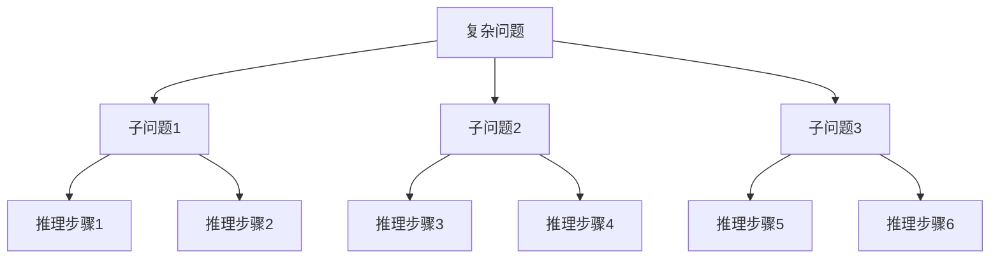

# 复杂问题分解:AI思维链的构建与应用

> 关键词：复杂问题分解、AI思维链、问题解决、人工智能、算法原理、应用场景

> 摘要：本文聚焦于复杂问题分解中AI思维链的构建与应用。通过详细介绍背景知识，阐述核心概念及其联系，深入剖析核心算法原理和具体操作步骤，运用数学模型和公式进行理论支持，并结合项目实战案例进行代码实现与解读，探讨了AI思维链在实际应用中的场景。同时推荐了相关的学习资源、开发工具框架以及论文著作，最后总结了未来发展趋势与挑战，还提供了常见问题解答和扩展阅读参考资料，旨在帮助读者全面深入地理解和掌握复杂问题分解中AI思维链的相关知识和应用。

## 1. 背景介绍 
### 1.1 目的和范围
在当今复杂多变的世界中，我们面临着各种各样的复杂问题，如科学研究中的难题、商业决策中的困境、社会治理中的挑战等。这些问题往往具有高度的复杂性、不确定性和多维度性，传统的问题解决方法可能难以有效应对。人工智能技术的发展为解决复杂问题提供了新的思路和方法。本文的目的在于探讨如何利用AI思维链来分解复杂问题，提高问题解决的效率和质量。范围涵盖了AI思维链的核心概念、算法原理、数学模型、实际应用场景等方面，旨在为读者提供一个全面而深入的关于复杂问题分解中AI思维链构建与应用的知识体系。

### 1.2 预期读者
本文预期读者包括人工智能领域的专业人士，如程序员、软件架构师、数据科学家等，他们可以从本文中获取关于AI思维链的最新技术和应用案例，为实际项目提供参考。同时，对于对人工智能感兴趣的学生和爱好者来说，本文也可以作为一个学习的入门资料，帮助他们了解复杂问题分解的基本原理和方法。此外，企业管理者和决策者也可以通过阅读本文，了解如何运用AI思维链来解决企业面临的复杂问题，提升企业的竞争力。

### 1.3 文档结构概述
本文将按照以下结构进行组织：首先介绍背景知识，包括目的和范围、预期读者以及文档结构概述和术语表。接着阐述核心概念与联系，通过文本示意图和Mermaid流程图展示AI思维链的原理和架构。然后详细讲解核心算法原理和具体操作步骤，并使用Python源代码进行说明。随后介绍数学模型和公式，通过具体例子进行详细讲解。再通过项目实战案例，包括开发环境搭建、源代码实现和代码解读，深入探讨AI思维链的实际应用。之后分析实际应用场景，推荐相关的工具和资源，包括学习资源、开发工具框架和论文著作。最后总结未来发展趋势与挑战，提供常见问题解答和扩展阅读参考资料。

### 1.4 术语表
#### 1.4.1 核心术语定义
- **复杂问题分解**：将一个复杂的问题拆分成若干个相对简单的子问题的过程，以便更易于理解和解决。
- **AI思维链**：一种基于人工智能技术的问题解决思路和方法，通过一系列的推理和决策步骤，将复杂问题逐步分解并解决。
- **子问题**：复杂问题经过分解后得到的相对简单的问题。
- **推理步骤**：AI思维链中用于从一个状态或信息推导出另一个状态或信息的操作。

#### 1.4.2 相关概念解释
- **问题表示**：将复杂问题以一种计算机能够理解和处理的方式进行描述，例如使用数据结构、图形等。
- **问题求解策略**：在解决问题时所采用的方法和步骤，如贪心算法、动态规划等。
- **知识图谱**：一种用于表示知识和信息的图结构，包含实体、关系和属性等元素，可用于辅助AI思维链的推理。

#### 1.4.3 缩略词列表
- **AI**：Artificial Intelligence，人工智能
- **ML**：Machine Learning，机器学习
- **DL**：Deep Learning，深度学习

## 2. 核心概念与联系 
### 核心概念原理
AI思维链的核心原理是将复杂问题分解为多个子问题，并通过一系列的推理步骤来解决这些子问题。在这个过程中，需要对问题进行准确的表示和理解，同时运用合适的问题求解策略。例如，在自然语言处理中，对于一个复杂的文本理解问题，可以将其分解为词法分析、句法分析、语义分析等子问题，然后通过不同的算法和模型来解决这些子问题。

### 架构的文本示意图
```plaintext
复杂问题
|
|-- 子问题1
|   |-- 推理步骤1
|   |-- 推理步骤2
|   |--...
|
|-- 子问题2
|   |-- 推理步骤3
|   |-- 推理步骤4
|   |--...
|
|--...
```

### Mermaid流程图


## 3. 核心算法原理 & 具体操作步骤 
### 核心算法原理
AI思维链的核心算法可以基于机器学习和深度学习技术。例如，在问题分解阶段，可以使用聚类算法将复杂问题的相关特征进行聚类，从而得到不同的子问题。在推理步骤中，可以使用神经网络模型进行预测和决策。以下是一个简单的基于Python的聚类算法示例，用于问题分解：

```python
import numpy as np
from sklearn.cluster import KMeans

# 假设我们有一些问题特征数据
X = np.array([[1, 2], [1, 4], [1, 0],
              [4, 2], [4, 4], [4, 0]])

# 使用KMeans算法进行聚类，假设我们将问题分解为2个子问题
kmeans = KMeans(n_clusters=2, random_state=0).fit(X)

# 查看每个样本所属的子问题类别
labels = kmeans.labels_
print("每个样本所属的子问题类别:", labels)
```

### 具体操作步骤
1. **问题表示**：将复杂问题转化为计算机能够处理的数据结构，例如向量、矩阵等。可以使用特征提取技术从问题中提取关键信息。
2. **问题分解**：使用聚类算法、决策树等方法将问题分解为多个子问题。根据问题的特点选择合适的分解方法。
3. **推理步骤设计**：针对每个子问题，设计相应的推理步骤。可以使用机器学习模型、规则引擎等进行推理。
4. **推理执行**：按照设计好的推理步骤，依次解决每个子问题。在推理过程中，可能需要根据前一个子问题的结果来调整后续子问题的推理方法。
5. **结果整合**：将每个子问题的解决结果进行整合，得到最终的问题解决方案。

## 4. 数学模型和公式 & 详细讲解 & 举例说明 
### 聚类算法的数学模型
以KMeans聚类算法为例，其目标是将数据集 $X = \{x_1, x_2,..., x_n\}$ 划分为 $k$ 个簇 $C = \{C_1, C_2,..., C_k\}$，使得簇内的样本相似度尽可能高，簇间的样本相似度尽可能低。具体的数学模型可以表示为最小化以下目标函数：

$$
J = \sum_{i=1}^{k} \sum_{x_j \in C_i} ||x_j - \mu_i||^2
$$

其中，$\mu_i$ 是第 $i$ 个簇的中心点，$||x_j - \mu_i||^2$ 表示样本 $x_j$ 到中心点 $\mu_i$ 的欧几里得距离的平方。

### 详细讲解
KMeans算法的基本思想是通过迭代的方式不断更新簇的中心点，直到目标函数 $J$ 收敛。具体步骤如下：
1. 随机初始化 $k$ 个中心点 $\mu_1, \mu_2,..., \mu_k$。
2. 对于每个样本 $x_j$，计算其到各个中心点的距离 $||x_j - \mu_i||^2$，并将其分配到距离最近的中心点所在的簇中。
3. 根据新的簇分配情况，更新每个簇的中心点 $\mu_i$，计算公式为：

$$
\mu_i = \frac{1}{|C_i|} \sum_{x_j \in C_i} x_j
$$

其中，$|C_i|$ 是第 $i$ 个簇中的样本数量。
4. 重复步骤2和3，直到目标函数 $J$ 不再发生显著变化或达到最大迭代次数。

### 举例说明
假设我们有一个二维数据集 $X = \{(1, 2), (1, 4), (1, 0), (4, 2), (4, 4), (4, 0)\}$，我们希望将其划分为2个簇。

1. 随机初始化2个中心点，假设 $\mu_1 = (1, 2)$，$\mu_2 = (4, 4)$。
2. 计算每个样本到中心点的距离，并分配到距离最近的簇中：
    - 对于样本 $(1, 2)$，$||(1, 2) - (1, 2)||^2 = 0$，$||(1, 2) - (4, 4)||^2 = 13$，所以 $(1, 2)$ 属于簇 $C_1$。
    - 对于样本 $(1, 4)$，$||(1, 4) - (1, 2)||^2 = 4$，$||(1, 4) - (4, 4)||^2 = 9$，所以 $(1, 4)$ 属于簇 $C_1$。
    - 以此类推，得到所有样本的簇分配情况。
3. 更新中心点：
    - 假设簇 $C_1$ 包含样本 $(1, 2), (1, 4), (1, 0)$，则 $\mu_1 = (\frac{1 + 1 + 1}{3}, \frac{2 + 4 + 0}{3}) = (1, 2)$。
    - 假设簇 $C_2$ 包含样本 $(4, 2), (4, 4), (4, 0)$，则 $\mu_2 = (\frac{4 + 4 + 4}{3}, \frac{2 + 4 + 0}{3}) = (4, 2)$。
4. 重复步骤2和3，直到目标函数收敛。

## 5. 项目实战：代码实际案例和详细解释说明 
### 5.1  开发环境搭建
为了实现一个基于AI思维链的复杂问题分解项目，我们需要搭建以下开发环境：
1. **Python环境**：推荐使用Python 3.7及以上版本。可以从Python官方网站（https://www.python.org/downloads/）下载并安装。
2. **开发工具**：可以使用PyCharm、Jupyter Notebook等开发工具。PyCharm是一个功能强大的Python集成开发环境，Jupyter Notebook则适合进行交互式的代码开发和数据分析。
3. **相关库**：需要安装一些常用的Python库，如NumPy、Pandas、Scikit-learn、TensorFlow等。可以使用pip命令进行安装，例如：

```bash
pip install numpy pandas scikit-learn tensorflow
```

### 5.2  源代码详细实现和代码解读
以下是一个简单的基于AI思维链的复杂问题分解项目示例，假设我们要对一个文本分类问题进行处理：

```python
import numpy as np
from sklearn.feature_extraction.text import TfidfVectorizer
from sklearn.cluster import KMeans
from sklearn.metrics import adjusted_rand_score

# 示例文本数据
documents = [
    "This is a document about sports.",
    "Another document related to sports.",
    "A document on technology.",
    "Technology is changing the world.",
    "Sports events are exciting."
]

# 步骤1：问题表示
# 使用TF-IDF向量化将文本转换为向量表示
vectorizer = TfidfVectorizer(stop_words='english')
X = vectorizer.fit_transform(documents)

# 步骤2：问题分解
# 使用KMeans算法将文本数据分解为2个子问题（聚类）
true_labels = [0, 0, 1, 1, 0]  # 假设的真实标签
kmeans = KMeans(n_clusters=2, random_state=0).fit(X)
predicted_labels = kmeans.labels_

# 步骤3：评估分解结果
ari = adjusted_rand_score(true_labels, predicted_labels)
print("调整兰德指数 (ARI):", ari)

# 步骤4：推理步骤（这里简单打印每个簇的文本）
for cluster in range(2):
    cluster_docs = [documents[i] for i in range(len(documents)) if predicted_labels[i] == cluster]
    print(f"簇 {cluster} 的文本:")
    for doc in cluster_docs:
        print(doc)
    print()
```

### 代码解读与分析
1. **问题表示**：使用`TfidfVectorizer`将文本数据转换为TF-IDF向量表示。TF-IDF（Term Frequency-Inverse Document Frequency）是一种常用的文本特征提取方法，它可以衡量一个词在文档中的重要性。
2. **问题分解**：使用`KMeans`算法将文本数据聚类为2个簇，从而将问题分解为2个子问题。
3. **评估分解结果**：使用调整兰德指数（Adjusted Rand Index，ARI）来评估聚类结果与真实标签的一致性。ARI的取值范围为[-1, 1]，值越接近1表示聚类结果越接近真实标签。
4. **推理步骤**：简单地打印每个簇中的文本，以便直观地观察聚类结果。

## 6. 实际应用场景 
### 自然语言处理
在自然语言处理中，AI思维链可以用于文本分类、情感分析、机器翻译等任务。例如，在文本分类任务中，可以将一个复杂的文本分类问题分解为多个子问题，如主题分类、情感分类等，然后分别解决这些子问题，最后将结果进行整合。

### 计算机视觉
在计算机视觉领域，AI思维链可以用于图像识别、目标检测、图像分割等任务。例如，在目标检测任务中，可以先将图像进行预处理，然后使用不同的算法和模型进行特征提取、目标定位和分类，通过一系列的推理步骤来完成目标检测任务。

### 医疗领域
在医疗领域，AI思维链可以用于疾病诊断、药物研发等任务。例如，在疾病诊断中，可以将患者的症状、检查结果等信息进行分析和分解，通过一系列的推理步骤来判断患者可能患有哪些疾病，并给出相应的治疗建议。

### 金融领域
在金融领域，AI思维链可以用于风险评估、投资决策等任务。例如，在风险评估中，可以将企业的财务数据、市场数据等进行分析和分解，通过一系列的推理步骤来评估企业的信用风险和市场风险。

## 7. 工具和资源推荐
### 7.1 学习资源推荐
#### 7.1.1 书籍推荐
- 《人工智能：一种现代的方法》：这本书是人工智能领域的经典教材，全面介绍了人工智能的基本概念、算法和应用。
- 《Python机器学习》：详细介绍了如何使用Python进行机器学习开发，包括各种机器学习算法的原理和实现。
- 《深度学习》：由深度学习领域的三位顶尖专家撰写，系统地介绍了深度学习的理论和实践。

#### 7.1.2 在线课程
- Coursera上的“机器学习”课程：由斯坦福大学教授Andrew Ng授课，是机器学习领域最受欢迎的在线课程之一。
- edX上的“人工智能导论”课程：提供了人工智能的基础知识和应用案例。
- 网易云课堂上的“Python数据分析与机器学习实战”课程：结合实际项目，介绍了Python在数据分析和机器学习中的应用。

#### 7.1.3 技术博客和网站
- Medium：上面有很多人工智能领域的优秀博客文章，涵盖了各种技术和应用案例。
- Towards Data Science：专注于数据科学和机器学习领域的技术博客，提供了很多实用的教程和案例。
- AI社区：国内的人工智能技术社区，有很多关于人工智能的最新动态和技术分享。

### 7.2 开发工具框架推荐
#### 7.2.1 IDE和编辑器
- PyCharm：功能强大的Python集成开发环境，提供了代码编辑、调试、版本控制等功能。
- Jupyter Notebook：适合进行交互式的代码开发和数据分析，支持多种编程语言。
- Visual Studio Code：轻量级的代码编辑器，支持多种编程语言和插件扩展。

#### 7.2.2 调试和性能分析工具
- PySnooper：可以方便地调试Python代码，自动记录函数的调用过程和变量的值。
- cProfile：Python内置的性能分析工具，可以分析代码的运行时间和函数调用次数。
- TensorBoard：TensorFlow的可视化工具，可以用于查看模型的训练过程和性能指标。

#### 7.2.3 相关框架和库
- NumPy：Python的数值计算库，提供了高效的数组操作和数学函数。
- Pandas：用于数据处理和分析的库，提供了数据结构和数据操作的方法。
- Scikit-learn：机器学习库，提供了各种机器学习算法和工具，如分类、回归、聚类等。
- TensorFlow和PyTorch：深度学习框架，用于构建和训练深度学习模型。

### 7.3 相关论文著作推荐
#### 7.3.1 经典论文
- “A Logical Calculus of the Ideas Immanent in Nervous Activity”：由Warren McCulloch和Walter Pitts发表于1943年，提出了神经元模型，为神经网络的发展奠定了基础。
- “Learning Representations by Back-propagating Errors”：由David Rumelhart、Geoffrey Hinton和Ronald Williams发表于1986年，介绍了反向传播算法，推动了神经网络的发展。
- “ImageNet Classification with Deep Convolutional Neural Networks”：由Alex Krizhevsky、Ilya Sutskever和Geoffrey Hinton发表于2012年，介绍了AlexNet模型，开启了深度学习在计算机视觉领域的热潮。

#### 7.3.2 最新研究成果
- 关注顶级学术会议，如NeurIPS（神经信息处理系统大会）、ICML（国际机器学习会议）、CVPR（计算机视觉与模式识别会议）等，这些会议上会发布很多人工智能领域的最新研究成果。
- 查阅相关的学术期刊，如Journal of Artificial Intelligence Research（JAIR）、Artificial Intelligence等。

#### 7.3.3 应用案例分析
- 《AI 超级大国：中国、硅谷与新世界秩序》：分析了人工智能在全球的发展趋势和应用案例，探讨了人工智能对社会和经济的影响。
- 《智能时代》：介绍了人工智能在各个领域的应用案例，如医疗、金融、交通等，阐述了人工智能对未来社会的变革作用。

## 8. 总结：未来发展趋势与挑战
### 未来发展趋势
- **多模态融合**：未来的AI思维链将更加注重多模态数据的融合，如将文本、图像、音频等多种数据类型结合起来进行问题解决，以提高问题解决的准确性和效率。
- **强化学习与决策**：强化学习将在AI思维链中发挥更重要的作用，通过智能体与环境的交互和学习，实现更加智能的决策和问题解决。
- **知识图谱的应用**：知识图谱将为AI思维链提供更丰富的知识支持，帮助AI系统更好地理解问题和进行推理。
- **跨领域应用**：AI思维链将在更多的领域得到应用，如教育、农业、能源等，推动各领域的智能化发展。

### 挑战
- **数据质量和隐私问题**：高质量的数据是AI思维链有效运行的基础，但数据质量和隐私问题仍然是一个挑战。如何获取高质量的数据并保护数据隐私是需要解决的问题。
- **可解释性和透明度**：AI系统的可解释性和透明度是当前人工智能领域的一个重要问题。在复杂问题分解中，如何让AI思维链的推理过程和结果具有可解释性，以便用户更好地理解和信任AI系统，是一个亟待解决的挑战。
- **计算资源和效率**：复杂问题分解和AI思维链的构建通常需要大量的计算资源和时间。如何提高计算效率，降低计算成本，是未来发展需要解决的问题。
- **伦理和法律问题**：随着AI技术的广泛应用，伦理和法律问题也日益凸显。例如，AI系统的决策责任、算法偏见等问题，需要建立相应的伦理和法律框架来规范和约束。

## 9. 附录：常见问题与解答
### 问题1：如何选择合适的问题分解方法？
解答：选择合适的问题分解方法需要考虑问题的特点和需求。如果问题具有明显的层次结构，可以使用层次分析法进行分解；如果问题的特征具有相似性，可以使用聚类算法进行分解；如果问题的决策过程比较复杂，可以使用决策树等方法进行分解。同时，还可以结合领域知识和经验来选择合适的分解方法。

### 问题2：AI思维链的推理步骤是如何设计的？
解答：AI思维链的推理步骤设计需要根据问题的性质和目标来确定。一般来说，可以先分析问题的输入和输出，然后确定中间的推理环节。可以使用机器学习模型、规则引擎等进行推理。在设计推理步骤时，需要考虑推理的准确性、效率和可解释性。

### 问题3：如何评估AI思维链的性能？
解答：可以从多个方面评估AI思维链的性能，如问题解决的准确性、效率、可解释性等。对于准确性，可以使用准确率、召回率、F1值等指标进行评估；对于效率，可以使用运行时间、计算资源消耗等指标进行评估；对于可解释性，可以通过可视化推理过程、提供解释文档等方式进行评估。

### 问题4：AI思维链在实际应用中可能会遇到哪些问题？
解答：在实际应用中，AI思维链可能会遇到数据质量问题、模型过拟合或欠拟合问题、推理结果不准确问题等。此外，还可能会面临计算资源不足、数据隐私和安全等问题。需要针对不同的问题采取相应的解决措施，如数据预处理、模型调优、增加计算资源等。

## 10. 扩展阅读 & 参考资料
### 扩展阅读
- 《人工智能简史》：介绍了人工智能的发展历程和重要事件，帮助读者了解人工智能的发展脉络。
- 《算法之美：指导工作与生活的算法》：通过生动有趣的例子，介绍了算法在生活和工作中的应用，让读者对算法有更深入的理解。
- 《思考，快与慢》：虽然不是专门关于人工智能的书籍，但书中介绍的人类思维方式和决策过程，对理解AI思维链的构建和应用有一定的启发。

### 参考资料
- 相关学术论文和研究报告，可以从学术数据库如IEEE Xplore、ACM Digital Library等获取。
- 人工智能领域的官方文档和教程，如TensorFlow、PyTorch等框架的官方文档。
- 行业报告和白皮书，如麦肯锡、波士顿咨询等机构发布的关于人工智能的行业报告。

作者：AI天才研究院/AI Genius Institute & 禅与计算机程序设计艺术 /Zen And The Art of Computer Programming