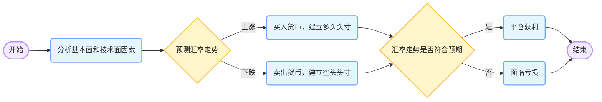

# 外汇投资：把握全球货币市场机会

> 关键词：外汇投资、全球货币市场、汇率波动、交易策略、风险管理

> 摘要：本文围绕外汇投资展开，深入探讨如何把握全球货币市场机会。首先介绍外汇投资的背景知识，包括目的、范围、预期读者等。接着阐述外汇投资的核心概念与联系，分析核心算法原理和操作步骤，并运用数学模型和公式进行详细讲解。通过项目实战案例展示外汇投资的具体操作和代码实现，同时探讨其实际应用场景。还推荐了相关的学习资源、开发工具框架和论文著作。最后总结外汇投资的未来发展趋势与挑战，解答常见问题，并提供扩展阅读和参考资料，旨在为投资者提供全面、深入的外汇投资指导。

## 1. 背景介绍 
### 1.1 目的和范围
外汇投资是指投资者为了获取投资收益而进行的不同货币之间的兑换行为。其目的在于利用不同国家货币之间汇率的波动来赚取差价利润。外汇市场是全球最大、最具流动性的金融市场之一，每天的交易量巨大，涉及到全球各个国家和地区的货币交易。本文的范围涵盖了外汇投资的基本概念、交易原理、分析方法、实战操作以及相关的风险管理等方面，旨在帮助投资者全面了解外汇投资，掌握在全球货币市场中把握机会的方法。

### 1.2 预期读者
本文预期读者包括对外汇投资感兴趣的初学者，希望了解外汇市场基本原理和投资方法；有一定投资经验但对外汇投资领域涉足不深的投资者，期望通过学习提升外汇投资技能；金融专业人士，如分析师、交易员等，可用于进一步深入研究外汇市场动态和交易策略。

### 1.3 文档结构概述
本文将按照以下结构进行阐述：首先介绍外汇投资的背景知识，包括目的、范围、预期读者和术语表；接着讲解外汇投资的核心概念与联系，通过文本示意图和 Mermaid 流程图展示其原理和架构；然后深入分析核心算法原理和具体操作步骤，并用 Python 源代码进行详细阐述；再介绍外汇投资相关的数学模型和公式，并举例说明；通过项目实战案例，详细解释开发环境搭建、源代码实现和代码解读；探讨外汇投资的实际应用场景；推荐相关的学习资源、开发工具框架和论文著作；最后总结外汇投资的未来发展趋势与挑战，解答常见问题，并提供扩展阅读和参考资料。

### 1.4 术语表
#### 1.4.1 核心术语定义
- **外汇**：是指以外币表示的可用于国际结算的支付手段，包括外国货币、外币存款、外币有价证券等。
- **汇率**：又称外汇汇价，是两种货币之间的兑换比率，也就是用一种货币表示另一种货币的价格。
- **外汇交易**：是指同时买入一种货币并卖出另一种货币的交易方式。
- **保证金交易**：是指投资者只需要缴纳一定比例的保证金，就可以进行较大金额的外汇交易。
- **点差**：是指外汇交易中买入价和卖出价之间的差价，是外汇交易商的主要盈利来源。

#### 1.4.2 相关概念解释
- **基本面分析**：通过研究影响汇率的宏观经济因素，如经济增长、通货膨胀、利率、财政政策等，来预测汇率的走势。
- **技术分析**：通过研究历史汇率数据，运用各种技术指标和图表形态，来预测汇率的未来走势。
- **多头头寸**：是指投资者买入一种货币，预期该货币汇率将上涨。
- **空头头寸**：是指投资者卖出一种货币，预期该货币汇率将下跌。

#### 1.4.3 缩略词列表
- **GDP**：国内生产总值，是衡量一个国家或地区经济状况和发展水平的重要指标。
- **CPI**：消费者物价指数，反映与居民生活有关的消费品及服务价格水平的变动情况。
- **FED**：美国联邦储备系统，负责制定和执行美国的货币政策。
- **ECB**：欧洲中央银行，负责制定和执行欧元区的货币政策。

## 2. 核心概念与联系 
外汇投资的核心概念主要包括外汇、汇率、外汇交易等，它们之间存在着密切的联系。下面通过文本示意图和 Mermaid 流程图来详细展示其原理和架构。

### 文本示意图
外汇投资的基本原理是基于不同国家货币之间的汇率波动。投资者通过分析各种因素，预测汇率的走势，然后进行外汇交易，以获取利润。具体过程如下：
- 投资者首先需要了解不同国家的经济状况、政治局势等基本面因素，以及市场的技术指标和图表形态等技术面因素。
- 根据对这些因素的分析，投资者预测某种货币的汇率将上涨或下跌。
- 如果预测某种货币汇率将上涨，投资者可以买入该货币，建立多头头寸；如果预测某种货币汇率将下跌，投资者可以卖出该货币，建立空头头寸。
- 当汇率走势符合投资者的预期时，投资者可以平仓获利；如果汇率走势与投资者的预期相反，投资者将面临亏损。

### Mermaid 流程图


## 3. 核心算法原理 & 具体操作步骤 
### 核心算法原理
在外汇投资中，常用的分析方法包括基本面分析和技术分析。下面以简单移动平均线（SMA）为例，介绍技术分析中的核心算法原理。

简单移动平均线是一种常用的技术指标，它通过计算一定时期内的汇率平均值，来平滑汇率数据，从而更清晰地显示汇率的趋势。其计算公式如下：

$$SMA_n = \frac{\sum_{i=0}^{n-1} P_{i}}{n}$$

其中，$SMA_n$ 表示 $n$ 期的简单移动平均线，$P_i$ 表示第 $i$ 期的汇率，$n$ 表示计算移动平均线的期数。

### 具体操作步骤
以下是使用 Python 实现简单移动平均线计算的具体步骤：

```python
import pandas as pd
import matplotlib.pyplot as plt

# 模拟汇率数据
data = {
    'date': pd.date_range(start='2023-01-01', periods=30),
    'exchange_rate': [1.2, 1.21, 1.22, 1.23, 1.24, 1.25, 1.26, 1.27, 1.28, 1.29,
                      1.3, 1.31, 1.32, 1.33, 1.34, 1.35, 1.36, 1.37, 1.38, 1.39,
                      1.4, 1.41, 1.42, 1.43, 1.44, 1.45, 1.46, 1.47, 1.48, 1.49]
}
df = pd.DataFrame(data)

# 计算 5 期简单移动平均线
n = 5
df['SMA_5'] = df['exchange_rate'].rolling(window=n).mean()

# 绘制汇率和简单移动平均线图表
plt.figure(figsize=(12, 6))
plt.plot(df['date'], df['exchange_rate'], label='Exchange Rate')
plt.plot(df['date'], df['SMA_5'], label=f'{n}-Period SMA')
plt.title('Exchange Rate and Simple Moving Average')
plt.xlabel('Date')
plt.ylabel('Exchange Rate')
plt.legend()
plt.show()
```

### 代码解释
1. **导入必要的库**：使用 `pandas` 库处理数据，`matplotlib.pyplot` 库绘制图表。
2. **模拟汇率数据**：创建一个包含日期和汇率的 DataFrame。
3. **计算简单移动平均线**：使用 `rolling()` 方法计算指定窗口大小的移动平均值。
4. **绘制图表**：使用 `plot()` 方法绘制汇率和简单移动平均线的图表。

## 4. 数学模型和公式 & 详细讲解 & 举例说明 
### 购买力平价理论
购买力平价理论是一种重要的外汇汇率决定理论，它认为两种货币之间的汇率应该等于两国物价水平的比率。其基本公式为：

$$E = \frac{P_1}{P_2}$$

其中，$E$ 表示汇率（直接标价法，即一单位外国货币兑换多少本国货币），$P_1$ 表示本国物价水平，$P_2$ 表示外国物价水平。

**详细讲解**：购买力平价理论的核心思想是，在没有贸易壁垒和运输成本的情况下，同样的商品在不同国家应该具有相同的价格。如果两国物价水平不同，那么汇率就会发生调整，使得同样的商品在两国的价格相等。例如，如果美国的物价水平上升，而欧洲的物价水平不变，那么根据购买力平价理论，美元对欧元的汇率应该下降，即美元贬值。

**举例说明**：假设在美国，一件商品的价格为 100 美元，在欧洲，同样的商品价格为 80 欧元。根据购买力平价理论，美元对欧元的汇率应该为：

$$E = \frac{100}{80} = 1.25$$

即 1 欧元兑换 1.25 美元。

### 利率平价理论
利率平价理论认为，两国之间的利率差异会影响汇率的变动。其基本公式为：

$$F = S \times \frac{1 + r_1}{1 + r_2}$$

其中，$F$ 表示远期汇率，$S$ 表示即期汇率，$r_1$ 表示本国利率，$r_2$ 表示外国利率。

**详细讲解**：利率平价理论的基本原理是，投资者会比较不同国家的利率水平，选择利率较高的国家进行投资。如果本国利率高于外国利率，那么投资者会将资金从外国转移到本国，从而导致本国货币需求增加，本国货币升值。为了平衡这种资金流动，远期汇率会发生调整，使得投资者在不同国家的投资收益相等。

**举例说明**：假设即期汇率为 1 美元兑换 0.8 欧元，美国的年利率为 5%，欧洲的年利率为 3%。根据利率平价理论，一年后的远期汇率应该为：

$$F = 0.8 \times \frac{1 + 0.05}{1 + 0.03} \approx 0.8155$$

即 1 美元兑换约 0.8155 欧元。

## 5. 项目实战：代码实际案例和详细解释说明 
### 5.1  开发环境搭建
为了进行外汇投资的项目实战，我们需要搭建相应的开发环境。以下是具体的步骤：

1. **安装 Python**：Python 是一种广泛使用的编程语言，我们可以从 Python 官方网站（https://www.python.org/downloads/）下载并安装最新版本的 Python。
2. **安装必要的库**：在外汇投资项目中，我们需要使用一些常用的 Python 库，如 `pandas`、`numpy`、`matplotlib` 等。可以使用 `pip` 命令进行安装：
```sh
pip install pandas numpy matplotlib
```
3. **获取外汇数据**：可以从一些免费的外汇数据提供商，如雅虎财经、Alpha Vantage 等，获取外汇汇率数据。也可以使用一些专业的外汇交易平台提供的 API 接口获取数据。

### 5.2  源代码详细实现和代码解读
以下是一个使用 Python 实现简单外汇交易策略的代码示例：

```python
import pandas as pd
import numpy as np
import matplotlib.pyplot as plt

# 模拟外汇数据
data = {
    'date': pd.date_range(start='2023-01-01', periods=30),
    'exchange_rate': [1.2, 1.21, 1.22, 1.23, 1.24, 1.25, 1.26, 1.27, 1.28, 1.29,
                      1.3, 1.31, 1.32, 1.33, 1.34, 1.35, 1.36, 1.37, 1.38, 1.39,
                      1.4, 1.41, 1.42, 1.43, 1.44, 1.45, 1.46, 1.47, 1.48, 1.49]
}
df = pd.DataFrame(data)

# 计算 5 期和 10 期简单移动平均线
df['SMA_5'] = df['exchange_rate'].rolling(window=5).mean()
df['SMA_10'] = df['exchange_rate'].rolling(window=10).mean()

# 生成交易信号
df['signal'] = 0
df.loc[df['SMA_5'] > df['SMA_10'], 'signal'] = 1  # 买入信号
df.loc[df['SMA_5'] < df['SMA_10'], 'signal'] = -1  # 卖出信号

# 计算持仓情况
df['position'] = df['signal'].diff()

# 绘制图表
plt.figure(figsize=(12, 6))
plt.plot(df['date'], df['exchange_rate'], label='Exchange Rate')
plt.plot(df['date'], df['SMA_5'], label='5-Period SMA')
plt.plot(df['date'], df['SMA_10'], label='10-Period SMA')

# 绘制买入和卖出信号
plt.plot(df[df['position'] == 1]['date'], df[df['position'] == 1]['exchange_rate'], '^', markersize=10, color='g', label='Buy Signal')
plt.plot(df[df['position'] == -1]['date'], df[df['position'] == -1]['exchange_rate'], 'v', markersize=10, color='r', label='Sell Signal')

plt.title('Exchange Rate and Moving Average Crossover Strategy')
plt.xlabel('Date')
plt.ylabel('Exchange Rate')
plt.legend()
plt.show()
```

### 5.3  代码解读与分析
1. **数据模拟**：使用 `pandas` 库创建一个包含日期和汇率的 DataFrame。
2. **计算移动平均线**：使用 `rolling()` 方法计算 5 期和 10 期的简单移动平均线。
3. **生成交易信号**：当 5 期移动平均线大于 10 期移动平均线时，生成买入信号（信号值为 1）；当 5 期移动平均线小于 10 期移动平均线时，生成卖出信号（信号值为 -1）。
4. **计算持仓情况**：通过 `diff()` 方法计算信号的差值，得到持仓情况。当差值为 1 时，表示买入；当差值为 -1 时，表示卖出。
5. **绘制图表**：使用 `matplotlib` 库绘制汇率、移动平均线、买入和卖出信号的图表。

通过这个简单的交易策略，我们可以根据移动平均线的交叉情况来判断买入和卖出的时机。但需要注意的是，这只是一个简单的示例，实际的外汇交易需要考虑更多的因素，如市场风险、交易成本等。

## 6. 实际应用场景 
外汇投资在全球经济和金融领域有着广泛的实际应用场景，以下是一些主要的应用场景：

### 国际贸易
在国际贸易中，企业通常需要进行不同货币之间的兑换。例如，一家中国企业从美国进口商品，需要用人民币兑换美元来支付货款。外汇投资可以帮助企业管理汇率风险，通过合理的外汇交易策略，降低因汇率波动而带来的成本增加风险。企业可以在汇率有利的时候进行外汇兑换，或者使用外汇衍生品进行套期保值，锁定汇率，确保交易成本的稳定。

### 跨国投资
跨国公司在进行海外投资时，需要将本国货币兑换成投资目标国的货币。外汇投资对于跨国公司来说至关重要，它可以帮助公司在不同国家的市场中获取更好的投资回报。例如，一家欧洲公司在美国投资房地产，需要将欧元兑换成美元。通过分析美元和欧元的汇率走势，公司可以选择在合适的时机进行兑换，从而降低投资成本。同时，外汇市场的波动也为跨国公司提供了额外的投资机会，公司可以通过外汇交易获取汇率差价收益。

### 个人投资
随着金融市场的发展，越来越多的个人投资者开始参与外汇投资。个人投资者可以通过外汇交易平台进行外汇买卖，获取汇率波动带来的收益。外汇投资具有交易时间长、流动性高、杠杆交易等特点，为个人投资者提供了更多的投资选择和机会。例如，个人投资者可以通过分析全球经济形势和各国货币政策，预测某种货币的汇率走势，然后进行相应的外汇交易。同时，外汇投资也可以作为个人资产配置的一部分，分散投资风险。

### 金融机构
银行、证券公司等金融机构在外汇市场中扮演着重要的角色。金融机构不仅为客户提供外汇交易服务，还进行自营外汇交易以获取利润。银行可以通过外汇买卖业务赚取点差收入，同时也可以利用外汇衍生品进行风险管理。证券公司可以为客户提供外汇投资咨询和交易服务，帮助客户制定投资策略。此外，金融机构还可以通过参与外汇市场的做市商业务，提供流动性，促进市场的稳定运行。

## 7. 工具和资源推荐
### 7.1 学习资源推荐
#### 7.1.1 书籍推荐
- 《外汇交易进阶》：这本书详细介绍了外汇交易的基本知识、技术分析方法和交易策略，适合初学者阅读。
- 《日本蜡烛图技术》：讲解了日本蜡烛图的基本原理和应用，是技术分析领域的经典著作，对于外汇投资者理解价格走势有很大帮助。
- 《金融炼金术》：乔治·索罗斯的著作，书中分享了他的投资理念和实践经验，对于深入理解金融市场和外汇投资有重要启示。

#### 7.1.2 在线课程
- Coursera 上的“外汇交易入门”课程：由专业的金融教授授课，系统地介绍了外汇交易的基础知识和操作技巧。
- Udemy 上的“高级外汇交易策略”课程：适合有一定基础的投资者，课程深入讲解了各种外汇交易策略和风险管理方法。

#### 7.1.3 技术博客和网站
- 外汇通：提供外汇市场的实时行情、分析评论、交易策略等信息，是外汇投资者获取市场动态的重要平台。
- DailyFX：全球知名的外汇资讯网站，提供专业的外汇分析报告、技术指标分析和交易信号等内容。

### 7.2 开发工具框架推荐
#### 7.2.1 IDE和编辑器
- PyCharm：一款专业的 Python 集成开发环境，具有代码编辑、调试、自动补全等功能，适合进行外汇投资项目的开发。
- Jupyter Notebook：交互式的开发环境，方便进行数据探索、可视化和代码调试，对于外汇数据分析和策略开发非常有用。

#### 7.2.2 调试和性能分析工具
- PDB：Python 自带的调试工具，可以帮助开发者定位代码中的问题。
- cProfile：Python 的性能分析工具，可以分析代码的运行时间和资源消耗情况，帮助优化代码性能。

#### 7.2.3 相关框架和库
- Pandas：用于数据处理和分析的 Python 库，提供了丰富的数据结构和数据操作方法，非常适合处理外汇市场数据。
- Numpy：用于科学计算的 Python 库，提供了高效的数组操作和数学函数，对于外汇投资中的数值计算非常有用。
- Matplotlib：用于数据可视化的 Python 库，可以绘制各种类型的图表，帮助投资者直观地分析外汇市场数据。

### 7.3 相关论文著作推荐
#### 7.3.1 经典论文
- Fama, E. F. (1970). Efficient capital markets: A review of theory and empirical work. The Journal of Finance, 25(2), 383-417. 这篇论文提出了有效市场假说，对于理解外汇市场的有效性和价格波动具有重要意义。
- Meese, R. A., & Rogoff, K. (1983). Empirical exchange rate models of the seventies: Do they fit out of sample?. Journal of International Economics, 14(1-2), 3-24. 该论文对传统的汇率模型进行了实证检验，引发了对外汇汇率预测的深入研究。

#### 7.3.2 最新研究成果
- 通过 Google Scholar 等学术搜索引擎，可以搜索到关于外汇投资的最新研究论文，了解该领域的前沿动态和研究方法。

#### 7.3.3 应用案例分析
- 一些金融研究机构和咨询公司会发布外汇投资的应用案例分析报告，这些报告可以帮助投资者了解实际市场中的投资策略和风险管理方法。

## 8. 总结：未来发展趋势与挑战
### 未来发展趋势
#### 技术创新推动
随着人工智能、大数据、区块链等技术的不断发展，外汇投资领域将迎来更多的创新。人工智能算法可以用于外汇市场的数据分析和预测，帮助投资者更准确地把握市场趋势。大数据技术可以整合全球外汇市场的各种信息，为投资者提供更全面的决策依据。区块链技术则可以提高外汇交易的透明度和安全性，降低交易成本。

#### 全球化进程加速
全球经济一体化的趋势将继续加强，外汇市场的规模和流动性将进一步扩大。新兴市场国家的经济发展将吸引更多的国际资本流入，这些国家的货币在外汇市场中的地位将逐渐提升。同时，跨国企业的业务范围不断扩大，对外汇风险管理的需求也将增加，这将推动外汇投资市场的进一步发展。

#### 交易方式多元化
除了传统的外汇现货交易和外汇期货交易外，外汇期权、外汇掉期等衍生产品的交易将越来越活跃。投资者可以根据自己的风险偏好和投资目标，选择不同的交易方式。此外，随着移动互联网的普及，外汇交易将更加便捷，投资者可以通过手机应用随时随地进行交易。

### 挑战
#### 市场不确定性增加
全球政治、经济形势的不确定性将给外汇市场带来更大的波动。地缘政治冲突、贸易保护主义、货币政策调整等因素都可能导致汇率的大幅波动，增加投资者的风险。例如，英国脱欧、中美贸易摩擦等事件都对外汇市场产生了重大影响。

#### 监管加强
为了维护金融市场的稳定，各国政府和监管机构将加强对外汇投资市场的监管。这将对投资者的交易行为和交易策略产生一定的限制，同时也增加了合规成本。投资者需要密切关注监管政策的变化，确保自己的投资行为符合法律法规的要求。

#### 技术风险
虽然技术创新为外汇投资带来了机遇，但也带来了技术风险。网络安全问题、算法错误等都可能导致投资者的损失。例如，黑客攻击外汇交易平台，可能导致投资者的账户信息泄露和资金被盗取。投资者需要加强技术安全意识，选择安全可靠的交易平台和技术工具。

## 9. 附录：常见问题与解答
### 外汇投资风险大吗？
外汇投资具有一定的风险，其风险主要来自于汇率波动、市场不确定性、杠杆交易等因素。汇率波动是外汇投资的主要风险来源，由于外汇市场的复杂性和不确定性，汇率的走势难以准确预测。此外，杠杆交易可以放大投资者的收益，但同时也会放大投资者的损失。因此，投资者在进行外汇投资时，需要充分了解市场风险，制定合理的风险管理策略。

### 如何选择外汇交易平台？
选择外汇交易平台时，需要考虑以下几个方面：
- **监管合规**：选择受到正规监管机构监管的平台，如英国金融行为监管局（FCA）、美国商品期货交易委员会（CFTC）等，以确保平台的合法性和安全性。
- **交易成本**：比较不同平台的点差、佣金等交易成本，选择成本较低的平台。
- **交易品种**：选择提供丰富外汇交易品种的平台，以满足自己的投资需求。
- **交易软件**：选择交易软件稳定、易用的平台，方便自己进行交易操作。
- **客户服务**：选择提供优质客户服务的平台，以便在交易过程中遇到问题时能够及时得到解决。

### 外汇投资需要多少资金？
外汇投资的资金门槛相对较低，不同的交易平台和交易方式对资金的要求也不同。一些平台提供小额交易账户，投资者可以用几百美元甚至更少的资金开始交易。但需要注意的是，外汇投资具有一定的风险，投资者应该根据自己的风险承受能力和投资目标，合理安排投资资金。

### 如何进行外汇投资分析？
外汇投资分析主要包括基本面分析和技术分析两种方法。基本面分析是通过研究影响汇率的宏观经济因素，如经济增长、通货膨胀、利率、财政政策等，来预测汇率的走势。技术分析是通过研究历史汇率数据，运用各种技术指标和图表形态，来预测汇率的未来走势。投资者可以结合这两种分析方法，制定合理的投资策略。

## 10. 扩展阅读 & 参考资料
### 扩展阅读
- 《货币战争》：这本书深入探讨了货币在全球经济和政治中的作用，以及国际金融体系的演变，对于理解外汇市场的背景和影响因素有很大帮助。
- 《金融市场技术分析》：系统地介绍了技术分析的基本原理和方法，包括各种技术指标和图表形态的应用，是外汇投资者进行技术分析的重要参考书籍。

### 参考资料
- 国际货币基金组织（IMF）官方网站：提供全球经济和金融数据、政策分析等信息，是研究外汇市场的重要数据来源。
- 各国中央银行官方网站：如美联储、欧洲央行等，发布货币政策信息和经济数据，对于分析各国货币走势有重要参考价值。

作者：AI天才研究院/AI Genius Institute & 禅与计算机程序设计艺术 /Zen And The Art of Computer Programming