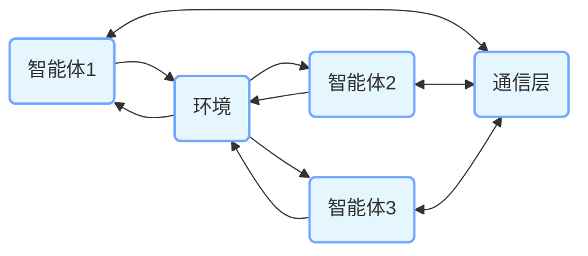

# 多Agent博弈系统：策略学习与优化技术

> 关键词：多Agent博弈系统、策略学习、策略优化、强化学习、纳什均衡

> 摘要：本文围绕多Agent博弈系统中的策略学习与优化技术展开深入探讨。首先介绍多Agent博弈系统的背景知识，包括其目的、预期读者和文档结构等。接着阐述核心概念与联系，分析其原理和架构，并通过Mermaid流程图呈现。详细讲解核心算法原理，结合Python源代码进行说明，同时给出相关数学模型和公式并举例。通过项目实战展示代码实现和解读，探讨实际应用场景。推荐相关的学习资源、开发工具框架和论文著作。最后总结未来发展趋势与挑战，提供常见问题解答和扩展阅读参考资料，旨在为读者全面介绍多Agent博弈系统中策略学习与优化的相关技术。

## 1. 背景介绍 
### 1.1 目的和范围
多Agent博弈系统在许多领域都有着广泛的应用，如经济学、计算机科学、人工智能等。其目的在于研究多个智能体（Agent）在相互作用的环境中如何制定最优策略以实现自身目标。本文章的范围将涵盖多Agent博弈系统的基本概念、核心算法、数学模型、实际应用以及相关工具和资源等方面，重点聚焦于策略学习与优化技术。

### 1.2 预期读者
本文预期读者包括对多Agent系统、博弈论、人工智能和机器学习等领域感兴趣的研究人员、学生和专业开发者。无论是初学者想要了解多Agent博弈系统的基础知识，还是有一定经验的专业人士希望深入研究策略学习与优化技术，都能从本文中获得有价值的信息。

### 1.3 文档结构概述
本文将按照以下结构进行组织：首先介绍多Agent博弈系统的背景知识，包括目的、预期读者和文档结构等。然后阐述核心概念与联系，分析其原理和架构，并通过Mermaid流程图呈现。接着详细讲解核心算法原理，结合Python源代码进行说明，同时给出相关数学模型和公式并举例。通过项目实战展示代码实现和解读，探讨实际应用场景。推荐相关的学习资源、开发工具框架和论文著作。最后总结未来发展趋势与挑战，提供常见问题解答和扩展阅读参考资料。

### 1.4 术语表
#### 1.4.1 核心术语定义
- **多Agent系统（Multi - Agent System, MAS）**：由多个自主的智能体组成的系统，这些智能体在一定的环境中相互作用，通过协作或竞争来实现各自的目标。
- **博弈论（Game Theory）**：研究决策主体在相互作用时的策略选择及其均衡问题的理论。
- **智能体（Agent）**：具有自主性、反应性、社会性和主动性等特征的实体，能够感知环境并采取行动以实现自身目标。
- **策略（Strategy）**：智能体在博弈过程中选择行动的规则或方法。
- **纳什均衡（Nash Equilibrium）**：在博弈中，每个智能体的策略都是对其他智能体策略的最优反应，此时没有智能体有动机单方面改变自己的策略。

#### 1.4.2 相关概念解释
- **协作博弈**：多个智能体为了共同的目标而进行合作的博弈。在协作博弈中，智能体之间需要协调行动，以实现整体利益的最大化。
- **竞争博弈**：多个智能体为了各自的利益而进行竞争的博弈。在竞争博弈中，智能体需要根据对手的策略来选择自己的最优策略。
- **混合策略**：智能体在博弈中以一定的概率选择不同的纯策略。

#### 1.4.3 缩略词列表
- **MAS**：Multi - Agent System（多Agent系统）
- **RL**：Reinforcement Learning（强化学习）
- **NE**：Nash Equilibrium（纳什均衡）

## 2. 核心概念与联系 
### 核心概念原理
多Agent博弈系统的核心在于多个智能体之间的相互作用。每个智能体都有自己的目标和策略，它们在环境中感知信息并根据这些信息做出决策。智能体的决策不仅受到自身目标的影响，还受到其他智能体策略的影响。

博弈论为多Agent博弈系统提供了理论基础。通过博弈论的方法，可以分析智能体之间的策略互动，找出纳什均衡等稳定的策略组合。强化学习则是多Agent博弈系统中常用的策略学习方法，智能体通过与环境的交互不断调整自己的策略，以获得最大的累积奖励。

### 架构的文本示意图
多Agent博弈系统的架构可以分为以下几个部分：
1. **智能体层**：包含多个智能体，每个智能体都有自己的感知器、决策器和执行器。感知器用于感知环境信息，决策器根据感知到的信息和自身的策略选择行动，执行器将决策转化为实际行动。
2. **环境层**：智能体所处的环境，提供智能体感知的信息，并根据智能体的行动更新环境状态。
3. **通信层**：智能体之间进行信息交流的通道，用于协作博弈中的信息共享和协调。

### Mermaid流程图


## 3. 核心算法原理 & 具体操作步骤 
### 强化学习算法原理
强化学习是多Agent博弈系统中常用的策略学习算法。其基本思想是智能体通过与环境的交互不断尝试不同的行动，并根据环境给予的奖励来调整自己的策略，以获得最大的累积奖励。

强化学习的核心要素包括状态（State）、行动（Action）、奖励（Reward）和策略（Policy）。智能体在每个时间步处于一个状态 $s$，根据策略 $\pi$ 选择一个行动 $a$，执行该行动后环境会转移到下一个状态 $s'$，并给予智能体一个奖励 $r$。智能体的目标是学习一个最优策略 $\pi^*$，使得累积奖励最大化。

### Python源代码实现
以下是一个简单的基于Q - learning算法的强化学习示例，用于解决多Agent博弈中的简单问题。

```python
import numpy as np

# 定义环境
class Environment:
    def __init__(self):
        self.state_space = 5
        self.action_space = 3
        self.current_state = np.random.randint(0, self.state_space)

    def step(self, action):
        # 简单的状态转移规则
        next_state = (self.current_state + action) % self.state_space
        # 简单的奖励规则
        reward = 1 if next_state == 0 else 0
        self.current_state = next_state
        return next_state, reward

# 定义智能体
class Agent:
    def __init__(self, state_space, action_space, learning_rate=0.1, discount_factor=0.9):
        self.state_space = state_space
        self.action_space = action_space
        self.learning_rate = learning_rate
        self.discount_factor = discount_factor
        self.q_table = np.zeros((state_space, action_space))

    def choose_action(self, state):
        # 简单的贪心策略
        if np.random.uniform(0, 1) < 0.1:
            action = np.random.randint(0, self.action_space)
        else:
            action = np.argmax(self.q_table[state, :])
        return action

    def learn(self, state, action, reward, next_state):
        # Q - learning更新公式
        max_q_next = np.max(self.q_table[next_state, :])
        self.q_table[state, action] += self.learning_rate * (reward + self.discount_factor * max_q_next - self.q_table[state, action])

# 主循环
if __name__ == "__main__":
    env = Environment()
    agent = Agent(env.state_space, env.action_space)
    num_episodes = 1000
    for episode in range(num_episodes):
        state = env.current_state
        done = False
        while not done:
            action = agent.choose_action(state)
            next_state, reward = env.step(action)
            agent.learn(state, action, reward, next_state)
            state = next_state
            if state == 0:
                done = True
```

### 具体操作步骤
1. **初始化环境和智能体**：创建环境对象和智能体对象，初始化智能体的Q表。
2. **训练循环**：进行多个训练回合，每个回合中智能体与环境进行交互。
3. **选择行动**：智能体根据当前状态和策略选择一个行动。
4. **执行行动**：智能体执行选择的行动，环境根据行动更新状态并给予奖励。
5. **学习更新**：智能体根据奖励和下一个状态更新Q表。
6. **结束条件**：当达到终止条件（如到达目标状态）时，结束当前回合。

## 4. 数学模型和公式 & 详细讲解 & 举例说明 
### 强化学习中的数学模型
强化学习可以用马尔可夫决策过程（Markov Decision Process, MDP）来建模。一个MDP可以用一个五元组 $\langle S, A, P, R, \gamma \rangle$ 表示，其中：
- $S$ 是状态空间，表示所有可能的状态集合。
- $A$ 是行动空间，表示所有可能的行动集合。
- $P(s'|s, a)$ 是状态转移概率，表示在状态 $s$ 执行行动 $a$ 后转移到状态 $s'$ 的概率。
- $R(s, a, s')$ 是奖励函数，表示在状态 $s$ 执行行动 $a$ 转移到状态 $s'$ 时获得的奖励。
- $\gamma \in [0, 1]$ 是折扣因子，用于平衡即时奖励和未来奖励。

### Q - learning公式
Q - learning是一种无模型的强化学习算法，其目标是学习一个最优的动作价值函数 $Q(s, a)$，表示在状态 $s$ 执行行动 $a$ 的预期累积奖励。Q - learning的更新公式为：

$$Q(s, a) \leftarrow Q(s, a) + \alpha [r + \gamma \max_{a'} Q(s', a') - Q(s, a)]$$

其中：
- $\alpha$ 是学习率，表示每次更新的步长。
- $r$ 是当前时间步获得的奖励。
- $\gamma$ 是折扣因子。
- $s'$ 是下一个状态。

### 举例说明
假设一个简单的MDP，状态空间 $S = \{s_1, s_2, s_3\}$，行动空间 $A = \{a_1, a_2\}$。初始时，智能体处于状态 $s_1$，选择行动 $a_1$，转移到状态 $s_2$，获得奖励 $r = 1$。当前的Q表值为 $Q(s_1, a_1) = 0$，$Q(s_2, a_1) = 0.5$，$Q(s_2, a_2) = 0.3$，学习率 $\alpha = 0.1$，折扣因子 $\gamma = 0.9$。

根据Q - learning更新公式：

$$Q(s_1, a_1) \leftarrow 0 + 0.1 [1 + 0.9 \max\{0.5, 0.3\} - 0] = 0 + 0.1 [1 + 0.9 \times 0.5 - 0] = 0 + 0.1 \times 1.45 = 0.145$$

## 5. 项目实战：代码实际案例和详细解释说明 
### 5.1  开发环境搭建
- **Python环境**：建议使用Python 3.6及以上版本。可以从Python官方网站（https://www.python.org/downloads/）下载安装。
- **开发工具**：可以使用PyCharm、VS Code等集成开发环境（IDE），也可以使用Jupyter Notebook进行交互式开发。
- **依赖库**：本项目需要使用NumPy库，可以使用以下命令进行安装：
```sh
pip install numpy
```

### 5.2  源代码详细实现和代码解读
```python
import numpy as np

# 定义环境
class Environment:
    def __init__(self):
        # 状态空间大小
        self.state_space = 5
        # 行动空间大小
        self.action_space = 3
        # 随机初始化当前状态
        self.current_state = np.random.randint(0, self.state_space)

    def step(self, action):
        # 简单的状态转移规则：当前状态加上行动值后对状态空间大小取模
        next_state = (self.current_state + action) % self.state_space
        # 简单的奖励规则：如果下一个状态为0，则奖励为1，否则为0
        reward = 1 if next_state == 0 else 0
        # 更新当前状态
        self.current_state = next_state
        return next_state, reward

# 定义智能体
class Agent:
    def __init__(self, state_space, action_space, learning_rate=0.1, discount_factor=0.9):
        # 状态空间大小
        self.state_space = state_space
        # 行动空间大小
        self.action_space = action_space
        # 学习率
        self.learning_rate = learning_rate
        # 折扣因子
        self.discount_factor = discount_factor
        # 初始化Q表，大小为状态空间乘以行动空间
        self.q_table = np.zeros((state_space, action_space))

    def choose_action(self, state):
        # 简单的贪心策略：以0.1的概率随机选择行动，否则选择Q表中值最大的行动
        if np.random.uniform(0, 1) < 0.1:
            action = np.random.randint(0, self.action_space)
        else:
            action = np.argmax(self.q_table[state, :])
        return action

    def learn(self, state, action, reward, next_state):
        # Q - learning更新公式
        max_q_next = np.max(self.q_table[next_state, :])
        self.q_table[state, action] += self.learning_rate * (reward + self.discount_factor * max_q_next - self.q_table[state, action])

# 主循环
if __name__ == "__main__":
    # 创建环境对象
    env = Environment()
    # 创建智能体对象
    agent = Agent(env.state_space, env.action_space)
    # 训练回合数
    num_episodes = 1000
    for episode in range(num_episodes):
        # 获取当前状态
        state = env.current_state
        done = False
        while not done:
            # 智能体选择行动
            action = agent.choose_action(state)
            # 执行行动，获取下一个状态和奖励
            next_state, reward = env.step(action)
            # 智能体学习更新Q表
            agent.learn(state, action, reward, next_state)
            # 更新当前状态
            state = next_state
            # 判断是否到达终止状态
            if state == 0:
                done = True
```

### 5.3  代码解读与分析
- **环境类（Environment）**：负责管理环境的状态和状态转移，以及根据行动给予奖励。`__init__` 方法初始化环境的状态空间、行动空间和当前状态。`step` 方法根据输入的行动更新状态并返回下一个状态和奖励。
- **智能体类（Agent）**：负责学习和决策。`__init__` 方法初始化智能体的状态空间、行动空间、学习率、折扣因子和Q表。`choose_action` 方法根据当前状态和贪心策略选择行动。`learn` 方法根据Q - learning更新公式更新Q表。
- **主循环**：进行多个训练回合，每个回合中智能体与环境进行交互，不断选择行动、执行行动、学习更新，直到达到终止状态。

## 6. 实际应用场景 
### 经济学领域
在经济学中，多Agent博弈系统可以用于研究市场竞争、拍卖、谈判等问题。例如，在拍卖中，多个买家作为智能体，他们的策略是出价，通过博弈论和策略学习技术可以分析买家的最优出价策略，以及拍卖机制的效率。

### 计算机科学领域
在计算机科学中，多Agent博弈系统可以用于多机器人协作、网络路由、分布式系统等领域。例如，在多机器人协作中，多个机器人作为智能体，它们需要通过协作完成任务，如搬运物品、搜索目标等。通过策略学习和优化技术，机器人可以学习到最优的协作策略，提高任务执行效率。

### 人工智能领域
在人工智能领域，多Agent博弈系统可以用于游戏AI、智能交通、智能电网等领域。例如，在游戏AI中，多个玩家或AI角色作为智能体，它们通过博弈和策略学习来制定最优的游戏策略，提高游戏的趣味性和挑战性。

## 7. 工具和资源推荐
### 7.1 学习资源推荐
#### 7.1.1 书籍推荐
- 《博弈论》（Game Theory）：由Martin J. Osborne和Ariel Rubinstein所著，是博弈论领域的经典教材，系统地介绍了博弈论的基本概念、理论和方法。
- 《强化学习：原理与Python实现》（Reinforcement Learning: An Introduction）：由Richard S. Sutton和Andrew G. Barto所著，是强化学习领域的经典书籍，详细介绍了强化学习的基本原理和算法。
- 《多Agent系统：现代方法与应用