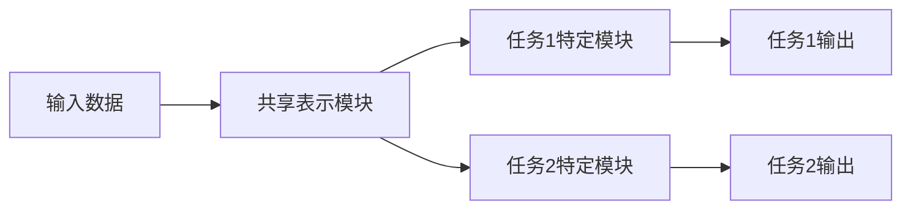

# 多任务学习对推理能力泛化性的影响研究

> 关键词：多任务学习、推理能力、泛化性、机器学习、深度学习

> 摘要：本文深入探讨了多任务学习对推理能力泛化性的影响。首先介绍了研究的背景、目的、预期读者和文档结构，阐述了相关术语和概念。接着详细讲解了多任务学习和推理能力泛化性的核心概念及其联系，并给出了相应的文本示意图和 Mermaid 流程图。通过 Python 源代码阐述了多任务学习的核心算法原理和具体操作步骤，同时给出了相关的数学模型和公式，并举例说明。通过项目实战展示了代码的实际应用和详细解释。分析了多任务学习在不同场景下的实际应用，推荐了学习资源、开发工具框架和相关论文著作。最后总结了多任务学习对推理能力泛化性影响的未来发展趋势与挑战，解答了常见问题，并提供了扩展阅读和参考资料。

## 1. 背景介绍 
### 1.1 目的和范围
在当今的人工智能和机器学习领域，推理能力的泛化性是衡量模型性能的重要指标之一。泛化性指的是模型在未见过的数据上能够准确进行推理和预测的能力。而多任务学习作为一种有效的机器学习范式，通过同时学习多个相关任务，可以共享任务之间的信息，从而提高模型的性能。本研究的目的在于深入探究多任务学习对推理能力泛化性的影响，明确多任务学习在提升推理泛化性方面的作用机制、优势和局限性。

研究范围涵盖了多任务学习的基本理论、常见算法，推理能力泛化性的评估方法，以及多任务学习在不同领域（如自然语言处理、计算机视觉、语音识别等）中对推理泛化性的具体影响。通过理论分析、实验验证和实际案例研究，全面揭示多任务学习与推理能力泛化性之间的关系。

### 1.2 预期读者
本文预期读者包括人工智能、机器学习领域的研究人员和学者，他们可以从本文中获取关于多任务学习和推理能力泛化性的最新研究成果和理论分析，为自己的研究提供参考和启示。同时，也适合从事相关领域开发的工程师和技术人员，帮助他们在实际项目中更好地应用多任务学习技术来提升模型的推理泛化能力。此外，对人工智能和机器学习感兴趣的学生和爱好者也可以通过本文了解多任务学习和推理能力泛化性的基本概念和重要意义。

### 1.3 文档结构概述
本文共分为十个部分。第一部分为背景介绍，阐述了研究的目的、范围、预期读者和文档结构，同时对相关术语进行了定义和解释。第二部分介绍了多任务学习和推理能力泛化性的核心概念及其联系，并给出了相应的文本示意图和 Mermaid 流程图。第三部分通过 Python 源代码详细阐述了多任务学习的核心算法原理和具体操作步骤。第四部分给出了相关的数学模型和公式，并进行了详细讲解和举例说明。第五部分通过项目实战展示了代码的实际应用和详细解释。第六部分分析了多任务学习在不同场景下的实际应用。第七部分推荐了学习资源、开发工具框架和相关论文著作。第八部分总结了多任务学习对推理能力泛化性影响的未来发展趋势与挑战。第九部分解答了常见问题。第十部分提供了扩展阅读和参考资料。

### 1.4 术语表
#### 1.4.1 核心术语定义
- **多任务学习（Multi - Task Learning, MTL）**：是一种机器学习范式，在这种范式中，模型同时学习多个相关任务，通过共享任务之间的信息来提高模型的性能和效率。
- **推理能力（Reasoning Ability）**：指模型根据已知信息进行逻辑推导、得出合理结论的能力。在机器学习中，推理能力通常体现在模型对数据的理解、分析和预测上。
- **泛化性（Generalization）**：模型在未见过的数据上能够准确进行推理和预测的能力。一个具有良好泛化性的模型能够适应不同的数据集和场景。
- **共享表示（Shared Representation）**：在多任务学习中，模型学习到的一种能够同时对多个任务有用的特征表示。共享表示可以减少模型的参数数量，提高模型的效率和泛化能力。

#### 1.4.2 相关概念解释
- **单任务学习（Single - Task Learning）**：与多任务学习相对，单任务学习是指模型只针对一个特定的任务进行学习和训练。在单任务学习中，模型专注于解决单一问题，不考虑其他任务的信息。
- **迁移学习（Transfer Learning）**：是一种机器学习技术，它将在一个任务上学习到的知识迁移到另一个相关任务上。与多任务学习不同，迁移学习通常是先在一个源任务上进行训练，然后将学到的知识应用到目标任务上。
- **元学习（Meta - Learning）**：也称为“学习如何学习”，元学习的目标是让模型能够快速适应新的任务。它通过在多个任务上进行训练，学习到一种通用的学习策略，从而在面对新任务时能够更快地收敛和达到较好的性能。

#### 1.4.3 缩略词列表
- **MTL**：Multi - Task Learning（多任务学习）
- **DNN**：Deep Neural Network（深度神经网络）
- **CNN**：Convolutional Neural Network（卷积神经网络）
- **RNN**：Recurrent Neural Network（循环神经网络）

## 2. 核心概念与联系 

### 多任务学习的核心概念
多任务学习的核心思想是通过同时学习多个相关任务，利用任务之间的相关性和互补性，共享任务之间的信息，从而提高模型的性能和泛化能力。在多任务学习中，模型通常由多个任务特定的模块和一个共享的表示模块组成。共享表示模块负责提取输入数据的通用特征，而任务特定模块则根据共享表示进行特定任务的预测。

例如，在自然语言处理中，我们可以同时进行词性标注、命名实体识别和句法分析等多个任务。这些任务之间存在一定的相关性，例如词性信息可以帮助进行命名实体识别，句法结构也与词性和命名实体有关。通过多任务学习，模型可以学习到更丰富的语言特征，提高在各个任务上的性能。

### 推理能力泛化性的核心概念
推理能力泛化性是指模型在未见过的数据上能够准确进行推理和预测的能力。在实际应用中，我们希望模型不仅能够在训练数据上表现良好，还能够在新的数据上做出合理的推理。例如，在图像识别任务中，模型需要能够识别不同角度、光照条件下的物体；在自然语言处理任务中，模型需要能够理解不同表达方式的文本。

推理能力泛化性的评估通常通过在测试数据集上的性能指标来进行，如准确率、召回率、F1 值等。一个具有良好推理能力泛化性的模型应该在不同的测试数据集上都能够保持稳定的性能。

### 多任务学习与推理能力泛化性的联系
多任务学习可以通过多种方式提高推理能力泛化性。首先，多任务学习可以学习到更丰富的特征表示。由于多个任务共享信息，模型可以从不同的任务中获取不同的视角和信息，从而学习到更全面、更通用的特征。这些通用特征可以帮助模型在面对未见过的数据时更好地进行推理。

其次，多任务学习可以增加模型的稳定性。通过同时学习多个任务，模型可以减少对单一任务的过拟合，提高模型的鲁棒性。在面对新的数据时，模型能够更好地适应数据的变化，从而提高推理能力泛化性。

### 文本示意图
```plaintext
输入数据
|
V
共享表示模块
|         |
V         V
任务1特定模块  任务2特定模块
|         |
V         V
任务1输出    任务2输出
```

### Mermaid 流程图


## 3. 核心算法原理 & 具体操作步骤 

### 核心算法原理
多任务学习的核心算法有很多种，这里我们以基于深度神经网络的多任务学习为例进行介绍。在基于深度神经网络的多任务学习中，通常采用共享底层网络层，不同任务使用不同的上层网络层的结构。

假设我们有 $K$ 个任务，输入数据为 $x$，共享表示为 $h$，任务 $k$ 的输出为 $y_k$。我们可以将模型的结构表示为：

1. 共享表示学习：$h = f_{shared}(x; \theta_{shared})$，其中 $f_{shared}$ 是共享的神经网络层，$\theta_{shared}$ 是共享层的参数。
2. 任务特定输出：$y_k = f_{k}(h; \theta_{k})$，其中 $f_{k}$ 是任务 $k$ 的特定神经网络层，$\theta_{k}$ 是任务 $k$ 特定层的参数。

模型的损失函数通常是各个任务损失的加权和：

$L(\theta_{shared}, \theta_{1}, \cdots, \theta_{K})=\sum_{k = 1}^{K}\alpha_{k}L_{k}(y_{k}, \hat{y}_{k})$

其中，$\alpha_{k}$ 是任务 $k$ 的权重，$L_{k}$ 是任务 $k$ 的损失函数，$y_{k}$ 是任务 $k$ 的真实标签，$\hat{y}_{k}$ 是任务 $k$ 的预测输出。

### 具体操作步骤
以下是使用 Python 和 PyTorch 实现一个简单的多任务学习模型的具体步骤：

```python
import torch
import torch.nn as nn
import torch.optim as optim

# 定义共享表示模块
class SharedModule(nn.Module):
    def __init__(self, input_size, hidden_size):
        super(SharedModule, self).__init__()
        self.fc1 = nn.Linear(input_size, hidden_size)
        self.relu = nn.ReLU()

    def forward(self, x):
        out = self.fc1(x)
        out = self.relu(out)
        return out

# 定义任务特定模块
class TaskSpecificModule(nn.Module):
    def __init__(self, hidden_size, output_size):
        super(TaskSpecificModule, self).__init__()
        self.fc = nn.Linear(hidden_size, output_size)

    def forward(self, x):
        out = self.fc(x)
        return out

# 定义多任务学习模型
class MultiTaskModel(nn.Module):
    def __init__(self, input_size, hidden_size, output_sizes):
        super(MultiTaskModel, self).__init__()
        self.shared_module = SharedModule(input_size, hidden_size)
        self.task_specific_modules = nn.ModuleList([
            TaskSpecificModule(hidden_size, output_size) for output_size in output_sizes
        ])

    def forward(self, x):
        shared_output = self.shared_module(x)
        task_outputs = [task_module(shared_output) for task_module in self.task_specific_modules]
        return task_outputs

# 示例参数
input_size = 10
hidden_size = 20
output_sizes = [2, 3]  # 两个任务的输出维度
num_tasks = len(output_sizes)

# 创建模型
model = MultiTaskModel(input_size, hidden_size, output_sizes)

# 定义损失函数和优化器
criterion = [nn.CrossEntropyLoss() for _ in range(num_tasks)]
optimizer = optim.Adam(model.parameters(), lr=0.001)

# 模拟训练数据
batch_size = 32
x = torch.randn(batch_size, input_size)
y1 = torch.randint(0, output_sizes[0], (batch_size,))
y2 = torch.randint(0, output_sizes[1], (batch_size,))

# 训练模型
num_epochs = 10
for epoch in range(num_epochs):
    optimizer.zero_grad()
    task_outputs = model(x)
    total_loss = 0
    for i in range(num_tasks):
        loss = criterion[i](task_outputs[i], [y1, y2][i])
        total_loss += loss
    total_loss.backward()
    optimizer.step()
    print(f'Epoch {epoch + 1}/{num_epochs}, Loss: {total_loss.item()}')
```

### 代码解释
1. **SharedModule**：定义了共享表示模块，它包含一个全连接层和一个 ReLU 激活函数。
2. **TaskSpecificModule**：定义了任务特定模块，它包含一个全连接层。
3. **MultiTaskModel**：定义了多任务学习模型，它由一个共享表示模块和多个任务特定模块组成。
4. **损失函数和优化器**：使用交叉熵损失函数和 Adam 优化器。
5. **训练过程**：在每个 epoch 中，计算各个任务的损失并求和，然后进行反向传播和参数更新。

## 4. 数学模型和公式 & 详细讲解 & 举例说明 

### 数学模型和公式
在多任务学习中，我们通常使用以下数学模型和公式来描述模型的结构和训练过程。

#### 共享表示学习
假设输入数据 $x \in \mathbb{R}^{n}$，共享表示 $h \in \mathbb{R}^{m}$，共享表示学习可以表示为一个函数 $f_{shared}$：

$h = f_{shared}(x; \theta_{shared})$

其中，$\theta_{shared}$ 是共享层的参数。常见的 $f_{shared}$ 可以是神经网络的前馈计算，例如：

$f_{shared}(x; \theta_{shared})=\sigma(W_{shared}x + b_{shared})$

其中，$W_{shared} \in \mathbb{R}^{m \times n}$ 是权重矩阵，$b_{shared} \in \mathbb{R}^{m}$ 是偏置向量，$\sigma$ 是激活函数，如 ReLU 函数 $\sigma(z)=\max(0, z)$。

#### 任务特定输出
对于第 $k$ 个任务，其输出 $y_k \in \mathbb{R}^{d_k}$ 可以表示为：

$y_k = f_{k}(h; \theta_{k})$

其中，$\theta_{k}$ 是任务 $k$ 特定层的参数。同样，$f_{k}$ 可以是神经网络的前馈计算，例如：

$f_{k}(h; \theta_{k})=W_{k}h + b_{k}$

其中，$W_{k} \in \mathbb{R}^{d_k \times m}$ 是权重矩阵，$b_{k} \in \mathbb{R}^{d_k}$ 是偏置向量。

#### 损失函数
模型的损失函数通常是各个任务损失的加权和：

$L(\theta_{shared}, \theta_{1}, \cdots, \theta_{K})=\sum_{k = 1}^{K}\alpha_{k}L_{k}(y_{k}, \hat{y}_{k})$

其中，$\alpha_{k}$ 是任务 $k$ 的权重，$L_{k}$ 是任务 $k$ 的损失函数，$y_{k}$ 是任务 $k$ 的真实标签，$\hat{y}_{k}$ 是任务 $k$ 的预测输出。常见的损失函数包括交叉熵损失函数、均方误差损失函数等。

### 详细讲解
- **共享表示学习**：共享表示学习的目的是提取输入数据的通用特征，这些特征可以对多个任务都有用。通过共享表示，模型可以减少参数数量，提高学习效率，同时也可以避免过拟合。
- **任务特定输出**：任务特定输出模块根据共享表示进行特定任务的预测。由于不同任务的输出要求不同，因此每个任务都有自己独立的输出模块。
- **损失函数**：损失函数的设计是多任务学习的关键。权重 $\alpha_{k}$ 的选择会影响模型对不同任务的关注程度。如果 $\alpha_{k}$ 较大，模型会更关注任务 $k$ 的损失；如果 $\alpha_{k}$ 较小，模型会相对忽略任务 $k$ 的损失。通常，我们可以根据任务的重要性、数据量等因素来选择合适的权重。

### 举例说明
假设我们有两个任务：图像分类和目标检测。输入数据是图像，共享表示模块可以是一个卷积神经网络（CNN），用于提取图像的通用特征。任务特定输出模块中，图像分类任务可以使用一个全连接层将共享特征映射到类别概率分布，目标检测任务可以使用一个回归层来预测目标的位置和大小。

对于损失函数，图像分类任务可以使用交叉熵损失函数，目标检测任务可以使用均方误差损失函数。假设我们认为图像分类任务更重要，我们可以将图像分类任务的权重 $\alpha_{1}$ 设置为 0.7，目标检测任务的权重 $\alpha_{2}$ 设置为 0.3。

在训练过程中，模型会同时最小化两个任务的加权损失，从而学习到既适合图像分类又适合目标检测的共享表示。

## 5. 项目实战：代码实际案例和详细解释说明 

### 5.1  开发环境搭建
为了实现多任务学习的项目实战，我们需要搭建相应的开发环境。以下是具体的步骤：

#### 安装 Python
首先，确保你已经安装了 Python 3.x 版本。你可以从 Python 官方网站（https://www.python.org/downloads/）下载并安装适合你操作系统的 Python 版本。

#### 安装 PyTorch
PyTorch 是一个常用的深度学习框架，我们可以使用它来实现多任务学习模型。你可以根据自己的 CUDA 版本和操作系统选择合适的安装命令。例如，如果你使用的是 CPU 版本，可以使用以下命令安装：

```bash
pip install torch torchvision
```

如果你使用的是 GPU 版本，需要根据你的 CUDA 版本选择相应的安装命令，具体可以参考 PyTorch 官方网站（https://pytorch.org/get-started/locally/）。

#### 安装其他依赖库
除了 PyTorch，我们还需要安装一些其他的依赖库，如 NumPy、Matplotlib 等。可以使用以下命令进行安装：

```bash
pip install numpy matplotlib
```

### 5.2  源代码详细实现和代码解读
以下是一个基于 PyTorch 的多任务学习项目实战代码，我们将使用一个简单的数据集来同时进行分类和回归任务。

```python
import torch
import torch.nn as nn
import torch.optim as optim
import numpy as np
import matplotlib.pyplot as plt

# 生成模拟数据
def generate_data(num_samples):
    x = np.random.randn(num_samples, 1)
    y_class = (x > 0).astype(int).flatten()
    y_reg = x.flatten() + np.random.randn(num_samples) * 0.1
    return torch.tensor(x, dtype=torch.float32), torch.tensor(y_class, dtype=torch.long), torch.tensor(y_reg, dtype=torch.float32)

# 定义共享表示模块
class SharedModule(nn.Module):
    def __init__(self, input_size, hidden_size):
        super(SharedModule, self).__init__()
        self.fc1 = nn.Linear(input_size, hidden_size)
        self.relu = nn.ReLU()

    def forward(self, x):
        out = self.fc1(x)
        out = self.relu(out)
        return out

# 定义分类任务特定模块
class ClassificationModule(nn.Module):
    def __init__(self, hidden_size, num_classes):
        super(ClassificationModule, self).__init__()
        self.fc = nn.Linear(hidden_size, num_classes)

    def forward(self, x):
        out = self.fc(x)
        return out

# 定义回归任务特定模块
class RegressionModule(nn.Module):
    def __init__(self, hidden_size):
        super(RegressionModule, self).__init__()
        self.fc = nn.Linear(hidden_size, 1)

    def forward(self, x):
        out = self.fc(x)
        return out

# 定义多任务学习模型
class MultiTaskModel(nn.Module):
    def __init__(self, input_size, hidden_size, num_classes):
        super(MultiTaskModel, self).__init__()
        self.shared_module = SharedModule(input_size, hidden_size)
        self.classification_module = ClassificationModule(hidden_size, num_classes)
        self.regression_module = RegressionModule(hidden_size)

    def forward(self, x):
        shared_output = self.shared_module(x)
        class_output = self.classification_module(shared_output)
        reg_output = self.regression_module(shared_output)
        return class_output, reg_output

# 超参数设置
input_size = 1
hidden_size = 10
num_classes = 2
num_samples = 1000
num_epochs = 100
learning_rate = 0.001

# 生成数据
x, y_class, y_reg = generate_data(num_samples)

# 创建模型
model = MultiTaskModel(input_size, hidden_size, num_classes)

# 定义损失函数和优化器
criterion_class = nn.CrossEntropyLoss()
criterion_reg = nn.MSELoss()
optimizer = optim.Adam(model.parameters(), lr=learning_rate)

# 训练模型
losses = []
for epoch in range(num_epochs):
    optimizer.zero_grad()
    class_output, reg_output = model(x)
    loss_class = criterion_class(class_output, y_class)
    loss_reg = criterion_reg(reg_output.squeeze(), y_reg)
    total_loss = loss_class + loss_reg
    total_loss.backward()
    optimizer.step()
    losses.append(total_loss.item())
    if (epoch + 1) % 10 == 0:
        print(f'Epoch {epoch + 1}/{num_epochs}, Loss: {total_loss.item()}')

# 绘制损失曲线
plt.plot(losses)
plt.xlabel('Epoch')
plt.ylabel('Loss')
plt.title('Multi - Task Learning Loss Curve')
plt.show()
```

### 代码解读与分析
#### 数据生成
`generate_data` 函数用于生成模拟数据，包括输入数据 $x$、分类标签 $y_{class}$ 和回归标签 $y_{reg}$。输入数据 $x$ 是从正态分布中随机采样得到的，分类标签根据 $x$ 的正负进行划分，回归标签是 $x$ 加上一些噪声。

#### 模型定义
- **SharedModule**：共享表示模块，包含一个全连接层和一个 ReLU 激活函数，用于提取输入数据的通用特征。
- **ClassificationModule**：分类任务特定模块，包含一个全连接层，用于将共享特征映射到分类概率分布。
- **RegressionModule**：回归任务特定模块，包含一个全连接层，用于将共享特征映射到回归值。
- **MultiTaskModel**：多任务学习模型，由共享表示模块、分类任务特定模块和回归任务特定模块组成。

#### 损失函数和优化器
- **损失函数**：使用交叉熵损失函数 `nn.CrossEntropyLoss()` 来计算分类任务的损失，使用均方误差损失函数 `nn.MSELoss()` 来计算回归任务的损失。总损失是两个任务损失的和。
- **优化器**：使用 Adam 优化器来更新模型的参数。

#### 训练过程
在每个 epoch 中，模型根据输入数据计算分类和回归的输出，然后计算相应的损失。通过反向传播和参数更新，模型逐渐学习到适合两个任务的共享表示。

#### 损失曲线绘制
最后，使用 Matplotlib 库绘制损失曲线，直观地展示模型在训练过程中的损失变化情况。

## 6. 实际应用场景 
### 自然语言处理
在自然语言处理领域，多任务学习可以同时进行多个相关任务，如词性标注、命名实体识别、句法分析和语义角色标注等。这些任务之间存在一定的相关性，通过多任务学习可以学习到更丰富的语言特征，提高模型在各个任务上的性能。例如，在信息抽取系统中，同时进行命名实体识别和关系抽取任务，可以更好地理解文本中的语义信息，提高信息抽取的准确性。

### 计算机视觉
在计算机视觉领域，多任务学习可以应用于图像分类、目标检测、语义分割等任务。例如，在自动驾驶场景中，模型需要同时进行车辆检测、行人检测、交通标志识别等多个任务。通过多任务学习，模型可以学习到图像的通用特征，提高在不同任务上的泛化能力和效率。此外，多任务学习还可以用于图像生成任务，如同时进行图像超分辨率和图像去噪任务，提高图像生成的质量。

### 语音识别
在语音识别领域，多任务学习可以同时进行语音识别、说话人识别和情感分析等任务。语音信号中包含了语音内容、说话人身份和情感等多种信息，通过多任务学习可以更好地利用这些信息，提高语音识别系统的性能。例如，在智能语音助手系统中，同时进行语音识别和情感分析可以更好地理解用户的意图和情绪，提供更个性化的服务。

### 医疗领域
在医疗领域，多任务学习可以应用于疾病诊断、医学图像分析和药物研发等任务。例如，在医学图像分析中，模型可以同时进行肿瘤检测、肿瘤分类和肿瘤分期等任务。通过多任务学习，模型可以学习到医学图像的通用特征，提高疾病诊断的准确性和效率。此外，在药物研发中，多任务学习可以同时预测药物的疗效和副作用，为药物研发提供更全面的信息。

## 7. 工具和资源推荐
### 7.1 学习资源推荐
#### 7.1.1 书籍推荐
- 《深度学习》（Deep Learning）：由 Ian Goodfellow、Yoshua Bengio 和 Aaron Courville 合著，是深度学习领域的经典教材，涵盖了深度学习的基本概念、算法和应用。
- 《机器学习》（Machine Learning: A Probabilistic Perspective）：由 Kevin P. Murphy 所著，从概率的角度介绍了机器学习的基本原理和算法，内容丰富，适合深入学习。
- 《动手学深度学习》（Dive into Deep Learning）：由 Aston Zhang、Zachary C. Lipton、Mu Li 和 Alexander J. Smola 合著，提供了丰富的代码示例和实践指导，适合初学者快速上手。

#### 7.1.2 在线课程
- Coursera 上的“深度学习专项课程”（Deep Learning Specialization）：由 Andrew Ng 教授授课，包括五门课程，全面介绍了深度学习的各个方面。
- edX 上的“强化学习基础”（Fundamentals of Reinforcement Learning）：介绍了强化学习的基本概念和算法，适合对强化学习感兴趣的学习者。
- 哔哩哔哩上的“李宏毅机器学习”：由李宏毅教授授课，课程内容生动有趣，适合初学者入门。

#### 7.1.3 技术博客和网站
- Medium：一个技术博客平台，有很多关于人工智能和机器学习的优质文章。
- arXiv：一个预印本平台，提供了最新的学术研究成果，包括多任务学习和推理能力泛化性的相关研究。
- AI研习社：专注于人工智能领域的社区，提供了丰富的技术文章、案例和课程。

### 7.2 开发工具框架推荐
#### 7.2.1 IDE和编辑器
- PyCharm：一款专业的 Python 集成开发环境，提供了丰富的代码编辑、调试和版本控制功能。
- Jupyter Notebook：一个交互式的开发环境，适合进行数据探索和模型实验，支持多种编程语言。
- Visual Studio Code：一款轻量级的代码编辑器，支持多种编程语言和插件扩展，具有强大的代码编辑和调试功能。

#### 7.2.2 调试和性能分析工具
- TensorBoard：TensorFlow 提供的可视化工具，可以用于可视化模型的训练过程、损失曲线、模型结构等。
- PyTorch Profiler：PyTorch 提供的性能分析工具，可以帮助用户分析模型的性能瓶颈，优化模型的运行效率。
- NVIDIA Nsight Systems：一款用于 GPU 性能分析的工具，可以帮助用户深入了解 GPU 的使用情况，优化 GPU 代码。

#### 7.2.3 相关框架和库
- PyTorch：一个开源的深度学习框架，具有动态图和静态图两种模式，易于使用和调试。
- TensorFlow：一个广泛使用的深度学习框架，提供了丰富的工具和库，适合大规模的深度学习应用。
- Scikit - learn：一个常用的机器学习库，提供了多种机器学习算法和工具，适合快速搭建机器学习模型。

### 7.3 相关论文著作推荐
#### 7.3.1 经典论文
- “Learning Multiple Tasks with Gradient Descent”：这篇论文是多任务学习领域的经典论文，提出了基于梯度下降的多任务学习算法。
- “An Overview of Multi - Task Learning in Deep Neural Networks”：对深度学习中的多任务学习进行了全面的综述，介绍了多任务学习的不同方法和应用。
- “Deep Neural Networks for YouTube Recommendations”：介绍了 YouTube 推荐系统中使用的深度学习模型，其中包括多任务学习的应用。

#### 7.3.2 最新研究成果
- 关注 arXiv 上关于多任务学习和推理能力泛化性的最新论文，了解该领域的最新研究动态。
- 参加相关的学术会议，如 NeurIPS、ICML、CVPR 等，获取最新的研究成果和技术趋势。

#### 7.3.3 应用案例分析
- 阅读一些实际应用案例，了解多任务学习在不同领域的具体应用和效果。例如，在医疗领域的多任务学习应用案例可以帮助我们更好地理解多任务学习在实际问题中的应用。

## 8. 总结：未来发展趋势与挑战
### 未来发展趋势
#### 更复杂的任务组合
未来，多任务学习将处理更复杂的任务组合，这些任务可能涉及不同模态的数据（如图像、文本、语音等）和不同类型的任务（如分类、回归、生成等）。例如，在智能机器人领域，机器人需要同时处理视觉、听觉和触觉等多模态信息，完成导航、目标识别、交互等多个任务。通过多任务学习，机器人可以更好地整合这些信息，提高自身的智能水平。

#### 自适应的任务权重调整
目前，多任务学习中任务权重的选择通常是手动设置或通过经验确定的。未来，将发展自适应的任务权重调整方法，使模型能够根据任务的难度、数据的分布和模型的性能自动调整任务权重。例如，在训练过程中，如果某个任务的损失下降缓慢，模型可以自动增加该任务的权重，以提高该任务的学习效果。

#### 与其他技术的融合
多任务学习将与其他技术如迁移学习、元学习、强化学习等进一步融合。例如，将迁移学习和多任务学习相结合，可以利用在源任务上学习到的知识来加速多任务学习的过程；将多任务学习和强化学习相结合，可以在多任务环境中进行更有效的决策和学习。

### 挑战
#### 任务间的冲突和干扰
在多任务学习中，不同任务之间可能存在冲突和干扰，导致模型在某些任务上的性能下降。例如，在某些情况下，共享表示可能无法同时满足所有任务的需求，从而影响模型的泛化能力。解决任务间的冲突和干扰是多任务学习面临的一个重要挑战。

#### 数据不平衡问题
在多任务学习中，不同任务的数据量可能存在不平衡的情况。数据量较少的任务可能会被数据量较多的任务所淹没，导致模型在数据量较少的任务上的性能不佳。如何处理数据不平衡问题，提高模型在各个任务上的性能，是多任务学习需要解决的另一个挑战。

#### 计算资源和时间成本
多任务学习通常需要同时处理多个任务，这会增加模型的计算复杂度和训练时间。在大规模数据集和复杂任务的情况下，计算资源和时间成本可能会成为制约多任务学习应用的瓶颈。如何优化多任务学习的算法和模型结构，降低计算资源和时间成本，是未来需要研究的重要方向。

## 9. 附录：常见问题与解答
### 多任务学习一定能提高推理能力泛化性吗？
不一定。虽然多任务学习可以通过共享任务之间的信息来提高模型的性能和泛化能力，但如果任务之间的相关性不强或者任务之间存在冲突，多任务学习可能无法提高推理能力泛化性，甚至会导致模型性能下降。因此，在应用多任务学习时，需要选择合适的任务组合，并合理设计模型结构和损失函数。

### 如何选择多任务学习中的任务权重？
任务权重的选择可以根据任务的重要性、数据量、任务的难度等因素来确定。一种简单的方法是手动设置任务权重，根据经验调整权重值。另一种方法是使用自适应的任务权重调整方法，如动态权重平均（Dynamic Weight Average, DWA）等，使模型能够根据任务的训练情况自动调整权重。

### 多任务学习对数据有什么要求？
多任务学习要求各个任务的数据具有一定的相关性，这样模型才能通过共享信息来提高性能。同时，数据的质量和数量也会影响多任务学习的效果。在数据量方面，各个任务的数据量应该尽量平衡，避免出现数据不平衡的问题。在数据质量方面，数据应该准确、无噪声，以保证模型能够学习到有效的特征。

### 多任务学习的模型结构有哪些常见类型？
常见的多任务学习模型结构包括硬参数共享（Hard Parameter Sharing）和软参数共享（Soft Parameter Sharing）。硬参数共享是指多个任务共享底层的神经网络层，每个任务有自己独立的上层网络层；软参数共享是指每个任务都有自己独立的网络，但通过一些约束条件（如正则化）来使网络之间的参数尽量相似。

## 10. 扩展阅读 & 参考资料
### 扩展阅读
- 《神经网络与深度学习》：进一步深入学习神经网络和深度学习的理论和算法。
- 《强化学习精要：核心算法与TensorFlow实现》：了解强化学习的基本概念和算法，以及如何使用 TensorFlow 实现强化学习模型。
- 《自然语言处理入门》：学习自然语言处理的基础知识和常用技术。

### 参考资料
- Goodfellow, I., Bengio, Y., & Courville, A. (2016). Deep Learning. MIT Press.
- Murphy, K. P. (2012). Machine Learning: A Probabilistic Perspective. MIT Press.
- Zhang, A., Lipton, Z. C., Li, M., & Smola, A. J. (2020). Dive into Deep Learning.
- Caruana, R. (1997). Multitask learning. Machine learning, 28(1), 41 - 75.
- Ruder, S. (2017). An overview of multi - task learning in deep neural networks. arXiv preprint arXiv:1706.05098.

作者：AI天才研究院/AI Genius Institute & 禅与计算机程序设计艺术 /Zen And The Art of Computer Programming