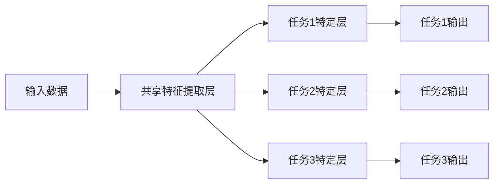

# 多任务学习对推理能力鲁棒性的影响分析

> 关键词：多任务学习、推理能力、鲁棒性、深度学习、机器学习

> 摘要：本文旨在深入分析多任务学习对推理能力鲁棒性的影响。多任务学习作为一种强大的机器学习范式，能够同时处理多个相关任务，有望提升模型的泛化能力和推理性能。通过对多任务学习的核心概念、算法原理、数学模型进行详细阐述，并结合实际项目案例，探讨多任务学习如何影响推理能力的鲁棒性。同时，分析多任务学习在不同应用场景中的表现，推荐相关的学习资源、开发工具和论文著作，最后总结多任务学习的未来发展趋势与挑战，为研究人员和开发者提供全面的参考。

## 1. 背景介绍 
### 1.1 目的和范围
本研究的主要目的是全面分析多任务学习对推理能力鲁棒性的影响。具体而言，我们将探讨多任务学习如何通过共享特征和知识，增强模型在面对各种干扰和不确定性时的推理能力。研究范围涵盖多任务学习的基本概念、核心算法、数学模型，以及在实际项目中的应用。同时，我们还将分析多任务学习在不同领域和场景中的表现，为进一步优化多任务学习模型提供理论和实践依据。

### 1.2 预期读者
本文预期读者包括机器学习和深度学习领域的研究人员、开发者、学生，以及对人工智能技术感兴趣的专业人士。对于希望深入了解多任务学习和推理能力鲁棒性的读者，本文将提供系统的知识和实用的指导。

### 1.3 文档结构概述
本文将按照以下结构进行组织：
1. 背景介绍：介绍研究的目的、范围、预期读者和文档结构概述。
2. 核心概念与联系：阐述多任务学习、推理能力和鲁棒性的核心概念，并分析它们之间的联系。
3. 核心算法原理 & 具体操作步骤：介绍多任务学习的核心算法，如硬参数共享、软参数共享等，并给出具体的操作步骤。
4. 数学模型和公式 & 详细讲解 & 举例说明：建立多任务学习的数学模型，推导相关公式，并通过具体例子进行说明。
5. 项目实战：代码实际案例和详细解释说明：通过实际项目案例，展示多任务学习在提升推理能力鲁棒性方面的应用。
6. 实际应用场景：分析多任务学习在不同领域和场景中的实际应用。
7. 工具和资源推荐：推荐相关的学习资源、开发工具和论文著作。
8. 总结：未来发展趋势与挑战：总结多任务学习对推理能力鲁棒性的影响，分析未来发展趋势和面临的挑战。
9. 附录：常见问题与解答：解答读者在阅读过程中可能遇到的常见问题。
10. 扩展阅读 & 参考资料：提供相关的扩展阅读材料和参考资料。

### 1.4 术语表
#### 1.4.1 核心术语定义
- **多任务学习（Multi-Task Learning）**：一种机器学习范式，通过同时学习多个相关任务，共享特征和知识，提高模型的泛化能力和性能。
- **推理能力（Reasoning Ability）**：模型根据输入数据进行逻辑推理和判断的能力。
- **鲁棒性（Robustness）**：模型在面对各种干扰和不确定性时，仍能保持稳定性能的能力。
- **硬参数共享（Hard Parameter Sharing）**：多个任务共享相同的模型参数。
- **软参数共享（Soft Parameter Sharing）**：每个任务有自己的模型参数，但通过正则化等方法鼓励参数之间的相似性。

#### 1.4.2 相关概念解释
- **特征共享（Feature Sharing）**：多任务学习中，不同任务之间共享部分特征表示，从而减少模型的复杂度，提高学习效率。
- **任务相关性（Task Relevance）**：多个任务之间的关联程度，任务相关性越高，多任务学习的效果越好。
- **泛化能力（Generalization Ability）**：模型在未见过的数据上的表现能力，多任务学习可以通过共享知识提高模型的泛化能力。

#### 1.4.3 缩略词列表
- **ML（Machine Learning）**：机器学习
- **DL（Deep Learning）**：深度学习
- **MTL（Multi-Task Learning）**：多任务学习
- **CNN（Convolutional Neural Network）**：卷积神经网络
- **RNN（Recurrent Neural Network）**：循环神经网络

## 2. 核心概念与联系 

### 2.1 多任务学习的核心概念
多任务学习是一种机器学习范式，它允许模型同时处理多个相关任务。与单任务学习不同，多任务学习通过共享特征和知识，使得模型能够从多个任务中学习到更丰富的信息，从而提高模型的泛化能力和性能。

在多任务学习中，通常有两种主要的参数共享方式：硬参数共享和软参数共享。硬参数共享是指多个任务共享相同的模型参数，而软参数共享则是每个任务有自己的模型参数，但通过正则化等方法鼓励参数之间的相似性。

以下是多任务学习的核心概念原理和架构的文本示意图：

```plaintext
输入数据 -> 共享特征提取层 -> 任务特定层 -> 任务输出
```

在这个架构中，输入数据首先通过共享特征提取层，提取出通用的特征表示。然后，这些特征表示被输入到任务特定层，每个任务特定层负责处理一个特定的任务，并输出该任务的预测结果。

### 2.2 推理能力的核心概念
推理能力是指模型根据输入数据进行逻辑推理和判断的能力。在机器学习中，推理能力通常与模型的泛化能力和知识表示能力密切相关。一个具有良好推理能力的模型能够在未见过的数据上做出准确的预测和判断。

推理能力可以分为不同的类型，如演绎推理、归纳推理和类比推理等。在多任务学习中，模型需要具备综合运用这些推理能力的能力，以处理多个相关任务。

### 2.3 鲁棒性的核心概念
鲁棒性是指模型在面对各种干扰和不确定性时，仍能保持稳定性能的能力。在实际应用中，模型往往会遇到各种噪声、异常值和对抗攻击等情况，因此鲁棒性是衡量模型性能的一个重要指标。

提高模型的鲁棒性可以通过多种方法实现，如数据增强、正则化、对抗训练等。在多任务学习中，通过共享特征和知识，模型可以学习到更具泛化性的表示，从而提高其鲁棒性。

### 2.4 多任务学习、推理能力和鲁棒性之间的联系
多任务学习、推理能力和鲁棒性之间存在着密切的联系。多任务学习通过共享特征和知识，能够提高模型的泛化能力和知识表示能力，从而增强模型的推理能力。同时，多任务学习还可以使模型学习到更具鲁棒性的特征表示，提高模型在面对各种干扰和不确定性时的性能。

具体来说，多任务学习可以通过以下方式影响推理能力和鲁棒性：
- **增强特征表示**：多任务学习可以使模型学习到更丰富、更具代表性的特征表示，从而提高模型的推理能力。
- **提高泛化能力**：通过共享知识，多任务学习可以减少模型的过拟合风险，提高模型在未见过的数据上的泛化能力，进而增强推理能力和鲁棒性。
- **增强鲁棒性**：多任务学习可以使模型学习到更具鲁棒性的特征表示，从而提高模型在面对各种干扰和不确定性时的性能。

### 2.5 Mermaid 流程图


## 3. 核心算法原理 & 具体操作步骤 

### 3.1 硬参数共享算法原理
硬参数共享是多任务学习中最常用的算法之一。在硬参数共享中，多个任务共享相同的模型参数，具体来说，模型由一个共享的特征提取层和多个任务特定的输出层组成。

以下是硬参数共享算法的Python源代码示例：

```python
import torch
import torch.nn as nn

# 定义共享特征提取层
class SharedFeatureExtractor(nn.Module):
    def __init__(self, input_size, hidden_size):
        super(SharedFeatureExtractor, self).__init__()
        self.fc = nn.Linear(input_size, hidden_size)
        self.relu = nn.ReLU()

    def forward(self, x):
        x = self.fc(x)
        x = self.relu(x)
        return x

# 定义任务特定输出层
class TaskSpecificOutput(nn.Module):
    def __init__(self, hidden_size, output_size):
        super(TaskSpecificOutput, self).__init__()
        self.fc = nn.Linear(hidden_size, output_size)

    def forward(self, x):
        x = self.fc(x)
        return x

# 定义多任务学习模型
class MultiTaskModel(nn.Module):
    def __init__(self, input_size, hidden_size, output_sizes):
        super(MultiTaskModel, self).__init__()
        self.shared_extractor = SharedFeatureExtractor(input_size, hidden_size)
        self.task_outputs = nn.ModuleList([TaskSpecificOutput(hidden_size, output_size) for output_size in output_sizes])

    def forward(self, x):
        shared_features = self.shared_extractor(x)
        task_outputs = [task_output(shared_features) for task_output in self.task_outputs]
        return task_outputs

# 示例使用
input_size = 10
hidden_size = 20
output_sizes = [5, 3, 2]

model = MultiTaskModel(input_size, hidden_size, output_sizes)
input_data = torch.randn(16, input_size)
outputs = model(input_data)
print(outputs)
```

### 3.2 硬参数共享算法具体操作步骤
1. **定义共享特征提取层**：如上述代码中的`SharedFeatureExtractor`类，负责从输入数据中提取共享的特征表示。
2. **定义任务特定输出层**：如上述代码中的`TaskSpecificOutput`类，每个任务特定输出层负责处理一个特定的任务。
3. **定义多任务学习模型**：如上述代码中的`MultiTaskModel`类，将共享特征提取层和任务特定输出层组合在一起。
4. **前向传播**：将输入数据输入到多任务学习模型中，通过共享特征提取层提取共享特征，然后将共享特征输入到每个任务特定输出层中，得到每个任务的输出。

### 3.3 软参数共享算法原理
软参数共享是另一种常用的多任务学习算法。在软参数共享中，每个任务有自己的模型参数，但通过正则化等方法鼓励参数之间的相似性。

以下是软参数共享算法的Python源代码示例：

```python
import torch
import torch.nn as nn
import torch.optim as optim

# 定义任务特定模型
class TaskSpecificModel(nn.Module):
    def __init__(self, input_size, hidden_size, output_size):
        super(TaskSpecificModel, self).__init__()
        self.fc1 = nn.Linear(input_size, hidden_size)
        self.relu = nn.ReLU()
        self.fc2 = nn.Linear(hidden_size, output_size)

    def forward(self, x):
        x = self.fc1(x)
        x = self.relu(x)
        x = self.fc2(x)
        return x

# 定义多任务学习模型
class MultiTaskModelSoft(nn.Module):
    def __init__(self, input_size, hidden_size, output_sizes):
        super(MultiTaskModelSoft, self).__init__()
        self.task_models = nn.ModuleList([TaskSpecificModel(input_size, hidden_size, output_size) for output_size in output_sizes])

    def forward(self, x):
        task_outputs = [task_model(x) for task_model in self.task_models]
        return task_outputs

# 示例使用
input_size = 10
hidden_size = 20
output_sizes = [5, 3, 2]

model = MultiTaskModelSoft(input_size, hidden_size, output_sizes)
input_data = torch.randn(16, input_size)
outputs = model(input_data)
print(outputs)

# 定义正则化项
def parameter_distance(model):
    total_distance = 0
    num_pairs = 0
    for i in range(len(model.task_models)):
        for j in range(i + 1, len(model.task_models)):
            for param_i, param_j in zip(model.task_models[i].parameters(), model.task_models[j].parameters()):
                distance = torch.norm(param_i - param_j)
                total_distance += distance
                num_pairs += 1
    return total_distance / num_pairs

# 训练模型
criterion = nn.MSELoss()
optimizer = optim.Adam(model.parameters(), lr=0.001)
lambda_reg = 0.1

for epoch in range(100):
    optimizer.zero_grad()
    outputs = model(input_data)
    losses = [criterion(output, torch.randn_like(output)) for output in outputs]
    total_loss = sum(losses) + lambda_reg * parameter_distance(model)
    total_loss.backward()
    optimizer.step()
    print(f'Epoch {epoch+1}, Loss: {total_loss.item()}')
```

### 3.4 软参数共享算法具体操作步骤
1. **定义任务特定模型**：如上述代码中的`TaskSpecificModel`类，每个任务特定模型负责处理一个特定的任务。
2. **定义多任务学习模型**：如上述代码中的`MultiTaskModelSoft`类，将多个任务特定模型组合在一起。
3. **定义正则化项**：如上述代码中的`parameter_distance`函数，用于计算不同任务模型参数之间的距离。
4. **训练模型**：在训练过程中，除了计算每个任务的损失外，还需要加上正则化项，以鼓励不同任务模型参数之间的相似性。

## 4. 数学模型和公式 & 详细讲解 & 举例说明 

### 4.1 多任务学习的数学模型
假设我们有 $K$ 个任务，每个任务的数据集为 $\mathcal{D}_k = \{(x_{i}^k, y_{i}^k)\}_{i=1}^{N_k}$，其中 $x_{i}^k$ 是第 $k$ 个任务的第 $i$ 个输入样本，$y_{i}^k$ 是对应的输出标签。

在多任务学习中，我们的目标是学习一个共享的特征表示 $h(x)$ 和 $K$ 个任务特定的预测函数 $f_k(h(x))$，使得所有任务的损失函数之和最小。具体来说，多任务学习的目标函数可以表示为：

$$
\min_{\theta, \theta_1, \cdots, \theta_K} \sum_{k=1}^{K} \sum_{i=1}^{N_k} L_k(f_k(h(x_{i}^k; \theta_k); \theta), y_{i}^k) + \Omega(\theta, \theta_1, \cdots, \theta_K)
$$

其中，$\theta$ 是共享特征表示的参数，$\theta_k$ 是第 $k$ 个任务特定预测函数的参数，$L_k$ 是第 $k$ 个任务的损失函数，$\Omega$ 是正则化项。

### 4.2 硬参数共享的数学公式
在硬参数共享中，所有任务共享相同的特征表示 $h(x)$，因此目标函数可以简化为：

$$
\min_{\theta, \theta_1, \cdots, \theta_K} \sum_{k=1}^{K} \sum_{i=1}^{N_k} L_k(f_k(h(x_{i}^k; \theta); \theta_k), y_{i}^k)
$$

其中，$\theta$ 是共享特征提取层的参数，$\theta_k$ 是第 $k$ 个任务特定输出层的参数。

### 4.3 软参数共享的数学公式
在软参数共享中，每个任务有自己的特征表示 $h_k(x)$，但通过正则化项鼓励不同任务的特征表示之间的相似性。目标函数可以表示为：

$$
\min_{\theta_1, \cdots, \theta_K} \sum_{k=1}^{K} \sum_{i=1}^{N_k} L_k(f_k(h_k(x_{i}^k; \theta_k), y_{i}^k) + \lambda \sum_{i=1}^{K} \sum_{j=i+1}^{K} d(h_i(x); \theta_i, h_j(x); \theta_j)
$$

其中，$d$ 是距离函数，用于衡量不同任务特征表示之间的相似性，$\lambda$ 是正则化系数。

### 4.4 举例说明
假设我们有两个任务：图像分类和目标检测。每个任务的输入都是图像，输出分别是图像的类别标签和目标的边界框。

在硬参数共享中，我们可以使用一个共享的卷积神经网络（CNN）来提取图像的特征表示，然后将这些特征表示分别输入到两个任务特定的全连接层中，进行图像分类和目标检测。

在软参数共享中，每个任务有自己的 CNN 来提取图像的特征表示，但通过正则化项鼓励两个 CNN 的参数之间的相似性。

## 5. 项目实战：代码实际案例和详细解释说明 

### 5.1  开发环境搭建
在进行多任务学习项目实战之前，我们需要搭建开发环境。以下是搭建开发环境的步骤：
1. **安装 Python**：建议使用 Python 3.7 及以上版本。
2. **安装深度学习框架**：本文使用 PyTorch 作为深度学习框架，可以通过以下命令安装：
```sh
pip install torch torchvision
```
3. **安装其他依赖库**：根据项目需求，安装其他必要的依赖库，如 NumPy、Pandas 等。

### 5.2  源代码详细实现和代码解读
以下是一个使用多任务学习进行图像分类和图像分割的项目实战代码示例：

```python
import torch
import torch.nn as nn
import torch.optim as optim
import torchvision
import torchvision.transforms as transforms

# 定义共享特征提取层
class SharedFeatureExtractor(nn.Module):
    def __init__(self):
        super(SharedFeatureExtractor, self).__init__()
        self.conv1 = nn.Conv2d(3, 64, kernel_size=3, padding=1)
        self.relu1 = nn.ReLU()
        self.conv2 = nn.Conv2d(64, 128, kernel_size=3, padding=1)
        self.relu2 = nn.ReLU()
        self.pool = nn.MaxPool2d(2, 2)

    def forward(self, x):
        x = self.relu1(self.conv1(x))
        x = self.pool(x)
        x = self.relu2(self.conv2(x))
        x = self.pool(x)
        return x

# 定义图像分类任务特定层
class ClassificationOutput(nn.Module):
    def __init__(self):
        super(ClassificationOutput, self).__init__()
        self.fc1 = nn.Linear(128 * 8 * 8, 128)
        self.relu = nn.ReLU()
        self.fc2 = nn.Linear(128, 10)

    def forward(self, x):
        x = x.view(-1, 128 * 8 * 8)
        x = self.relu(self.fc1(x))
        x = self.fc2(x)
        return x

# 定义图像分割任务特定层
class SegmentationOutput(nn.Module):
    def __init__(self):
        super(SegmentationOutput, self).__init__()
        self.conv1 = nn.Conv2d(128, 64, kernel_size=3, padding=1)
        self.relu1 = nn.ReLU()
        self.conv2 = nn.Conv2d(64, 1, kernel_size=3, padding=1)

    def forward(self, x):
        x = self.relu1(self.conv1(x))
        x = self.conv2(x)
        return x

# 定义多任务学习模型
class MultiTaskModel(nn.Module):
    def __init__(self):
        super(MultiTaskModel, self).__init__()
        self.shared_extractor = SharedFeatureExtractor()
        self.classification_output = ClassificationOutput()
        self.segmentation_output = SegmentationOutput()

    def forward(self, x):
        shared_features = self.shared_extractor(x)
        classification_output = self.classification_output(shared_features)
        segmentation_output = self.segmentation_output(shared_features)
        return classification_output, segmentation_output

# 数据预处理
transform = transforms.Compose(
    [transforms.ToTensor(),
     transforms.Normalize((0.5, 0.5, 0.5), (0.5, 0.5, 0.5))])

# 加载数据集
trainset = torchvision.datasets.CIFAR10(root='./data', train=True,
                                        download=True, transform=transform)
trainloader = torch.utils.data.DataLoader(trainset, batch_size=4,
                                          shuffle=True, num_workers=2)

# 初始化模型
model = MultiTaskModel()

# 定义损失函数和优化器
criterion_classification = nn.CrossEntropyLoss()
criterion_segmentation = nn.MSELoss()
optimizer = optim.SGD(model.parameters(), lr=0.001, momentum=0.9)

# 训练模型
for epoch in range(2):  # 训练 2 个 epoch
    running_loss = 0.0
    for i, data in enumerate(trainloader, 0):
        inputs, labels = data

        # 生成随机的分割标签（仅用于示例）
        segmentation_labels = torch.randn(inputs.size(0), 1, 32, 32)

        optimizer.zero_grad()

        classification_output, segmentation_output = model(inputs)

        loss_classification = criterion_classification(classification_output, labels)
        loss_segmentation = criterion_segmentation(segmentation_output, segmentation_labels)

        total_loss = loss_classification + loss_segmentation
        total_loss.backward()
        optimizer.step()

        running_loss += total_loss.item()
        if i % 2000 == 1999:    # 每 2000 个小批量打印一次损失
            print(f'[{epoch + 1}, {i + 1:5d}] loss: {running_loss / 2000:.3f}')
            running_loss = 0.0

print('Finished Training')
```

### 5.3  代码解读与分析
1. **共享特征提取层**：`SharedFeatureExtractor` 类定义了一个简单的卷积神经网络，用于提取图像的共享特征表示。
2. **任务特定层**：`ClassificationOutput` 类用于图像分类任务，`SegmentationOutput` 类用于图像分割任务。
3. **多任务学习模型**：`MultiTaskModel` 类将共享特征提取层和两个任务特定层组合在一起。
4. **数据预处理**：使用 `torchvision.transforms` 对图像数据进行预处理，包括转换为张量和归一化。
5. **加载数据集**：使用 `torchvision.datasets.CIFAR10` 加载 CIFAR-10 数据集，并使用 `torch.utils.data.DataLoader` 创建数据加载器。
6. **损失函数和优化器**：使用交叉熵损失函数进行图像分类任务，使用均方误差损失函数进行图像分割任务。使用随机梯度下降（SGD）优化器进行模型训练。
7. **训练模型**：在每个 epoch 中，遍历数据集，计算每个任务的损失，并将它们相加得到总损失。然后，使用反向传播算法更新模型参数。

通过这个项目实战，我们可以看到多任务学习如何在一个模型中同时处理多个相关任务，并通过共享特征提取层提高模型的性能。

## 6. 实际应用场景 
### 6.1 自然语言处理
在自然语言处理领域，多任务学习可以用于同时处理多个相关任务，如文本分类、情感分析、命名实体识别等。通过共享特征和知识，模型可以学习到更丰富的语言表示，从而提高在各个任务上的性能。例如，在一个新闻文章处理系统中，可以同时进行文章分类和关键词提取，多任务学习可以使模型更好地理解文章的语义，提高分类和提取的准确性。

### 6.2 计算机视觉
在计算机视觉领域，多任务学习可以用于同时进行图像分类、目标检测、图像分割等任务。共享特征提取层可以提取图像的通用特征，然后将这些特征输入到不同的任务特定层中，进行不同的任务处理。例如，在自动驾驶系统中，需要同时进行道路识别、车辆检测和行人检测等任务，多任务学习可以提高系统的整体性能和鲁棒性。

### 6.3 医疗保健
在医疗保健领域，多任务学习可以用于同时处理多个医疗任务，如疾病诊断、病情预测、医疗影像分析等。通过共享患者的病历信息和医疗影像特征，模型可以学习到更全面的患者信息，从而提高诊断和预测的准确性。例如，在一个肿瘤诊断系统中，可以同时进行肿瘤分类和肿瘤分期，多任务学习可以帮助医生更准确地判断病情。

### 6.4 金融领域
在金融领域，多任务学习可以用于同时进行风险评估、信用评级、投资预测等任务。通过共享金融数据的特征，模型可以学习到更准确的市场趋势和风险信息，从而提高金融决策的准确性。例如，在一个银行贷款审批系统中，可以同时考虑借款人的信用历史、收入情况和资产状况等因素，多任务学习可以帮助银行更准确地评估贷款风险。

## 7. 工具和资源推荐
### 7.1 学习资源推荐
#### 7.1.1 书籍推荐
- 《深度学习》（Deep Learning）：由 Ian Goodfellow、Yoshua Bengio 和 Aaron Courville 所著，是深度学习领域的经典教材，涵盖了多任务学习等多个重要主题。
- 《机器学习》（Machine Learning: A Probabilistic Perspective）：由 Kevin P. Murphy 所著，从概率的角度介绍了机器学习的基本概念和算法，包括多任务学习。
- 《神经网络与深度学习》（Neural Networks and Deep Learning）：由 Michael Nielsen 所著，以通俗易懂的方式介绍了神经网络和深度学习的基本原理，适合初学者。

#### 7.1.2 在线课程
- Coursera 上的“深度学习专项课程”（Deep Learning Specialization）：由 Andrew Ng 教授授课，包括多任务学习等多个深度学习主题的课程。
- edX 上的“强化学习”（Reinforcement Learning）：介绍了强化学习的基本概念和算法，其中也涉及到多任务学习的相关内容。
- Udemy 上的“Python 深度学习实战”（Deep Learning with Python）：通过实际项目案例，介绍了如何使用 Python 和深度学习框架进行多任务学习。

#### 7.1.3 技术博客和网站
- arXiv：一个开放的预印本平台，提供了大量关于多任务学习的最新研究论文。
- Medium：一个技术博客平台，有很多关于多任务学习的技术文章和案例分享。
- Towards Data Science：专注于数据科学和机器学习领域的技术博客，提供了丰富的多任务学习相关资源。

### 7.2 开发工具框架推荐
#### 7.2.1 IDE和编辑器
- PyCharm：一个专业的 Python 集成开发环境，提供了丰富的代码编辑、调试和分析功能，适合开发多任务学习项目。
- Jupyter Notebook：一个交互式的开发环境，适合进行数据探索、模型训练和结果可视化，常用于多任务学习的实验和研究。
- Visual Studio Code：一个轻量级的代码编辑器，支持多种编程语言和插件，可用于开发多任务学习项目。

#### 7.2.2 调试和性能分析工具
- TensorBoard：一个用于可视化深度学习模型训练过程和性能的工具，可以帮助开发者监控多任务学习模型的训练进度和性能指标。
- PyTorch Profiler：PyTorch 提供的性能分析工具，可以帮助开发者找出多任务学习模型中的性能瓶颈。
- cProfile：Python 内置的性能分析工具，可以用于分析多任务学习代码的执行时间和内存使用情况。

#### 7.2.3 相关框架和库
- PyTorch：一个开源的深度学习框架，提供了丰富的神经网络层和优化算法，方便开发者实现多任务学习模型。
- TensorFlow：另一个流行的深度学习框架，具有强大的分布式训练和模型部署能力，也支持多任务学习。
- Scikit-learn：一个用于机器学习的 Python 库，提供了多种机器学习算法和工具，可用于多任务学习的特征工程和模型评估。

### 7.3 相关论文著作推荐
#### 7.3.1 经典论文
- “An Overview of Multi-Task Learning in Deep Neural Networks”：对深度学习中的多任务学习进行了全面的综述，介绍了多任务学习的基本概念、算法和应用。
- “Learning Multiple Tasks with Multi-Objective Gradient Descent”：提出了一种基于多目标梯度下降的多任务学习算法，通过优化多个目标函数来提高模型的性能。
- “Multi-Task Learning Using Uncertainty to Weigh Losses for Scene Geometry and Semantics”：介绍了一种使用不确定性来加权损失的多任务学习方法，用于场景几何和语义分析。

#### 7.3.2 最新研究成果
- 关注 arXiv 上关于多任务学习的最新预印本论文，了解多任务学习领域的最新研究动态。
- 参加机器学习和深度学习领域的国际会议，如 NeurIPS、ICML、CVPR 等，获取最新的研究成果和技术趋势。

#### 7.3.3 应用案例分析
- 查阅相关的学术期刊和会议论文，了解多任务学习在不同领域的应用案例和实践经验。
- 关注开源项目和技术博客，学习他人在实际项目中使用多任务学习的方法和技巧。

## 8. 总结：未来发展趋势与挑战
### 8.1 未来发展趋势
- **更复杂的任务组合**：未来，多任务学习将处理更复杂的任务组合，涉及到更多的领域和数据类型。例如，将自然语言处理和计算机视觉任务结合起来，实现更智能的人机交互。
- **自适应的任务权重分配**：研究如何根据任务的重要性和难度，自适应地分配任务权重，以提高多任务学习的性能。
- **与其他技术的融合**：多任务学习将与强化学习、迁移学习等其他技术相结合，形成更强大的学习范式，解决更复杂的问题。
- **可解释性和可视化**：提高多任务学习模型的可解释性和可视化能力，使模型的决策过程更加透明，便于用户理解和信任。

### 8.2 面临的挑战
- **任务相关性的衡量**：如何准确衡量不同任务之间的相关性，是多任务学习中的一个重要挑战。任务相关性的不准确衡量可能导致模型性能下降。
- **梯度冲突问题**：在多任务学习中，不同任务的梯度可能会相互冲突，导致模型难以收敛。如何解决梯度冲突问题，是提高多任务学习性能的关键。
- **计算资源需求**：多任务学习通常需要处理多个任务，计算资源需求较大。如何在有限的计算资源下，高效地训练多任务学习模型，是一个亟待解决的问题。
- **数据不平衡问题**：不同任务的数据量和分布可能存在不平衡，这会影响模型的学习效果。如何处理数据不平衡问题，是提高多任务学习鲁棒性的重要方面。

## 9. 附录：常见问题与解答
### 9.1 多任务学习一定能提高模型的性能吗？
不一定。多任务学习的效果取决于多个因素，如任务之间的相关性、数据的质量和数量、模型的架构等。如果任务之间的相关性较低，或者数据质量较差，多任务学习可能无法提高模型的性能，甚至可能导致性能下降。

### 9.2 如何选择合适的任务进行多任务学习？
选择合适的任务进行多任务学习需要考虑任务之间的相关性。一般来说，任务之间的相关性越高，多任务学习的效果越好。可以通过领域知识、数据特征分析等方法来判断任务之间的相关性。

### 9.3 多任务学习中如何处理不同任务的损失权重？
处理不同任务的损失权重可以采用多种方法，如固定权重、自适应权重等。固定权重是指为每个任务的损失分配一个固定的权重，而自适应权重则是根据任务的重要性和难度动态调整权重。可以通过实验和调参来选择合适的权重分配方法。

### 9.4 多任务学习对数据有什么要求？
多任务学习对数据的要求包括数据的质量、数量和相关性。数据质量要高，避免噪声和错误数据的影响。数据数量要足够，以保证模型能够学习到足够的信息。同时，不同任务的数据之间要有一定的相关性，以便模型能够共享特征和知识。

## 10. 扩展阅读 & 参考资料
### 10.1 扩展阅读
- 《Pattern Recognition and Machine Learning》：深入介绍了机器学习的基本理论和算法，包括多任务学习的相关内容。
- 《Deep Learning in Neural Networks: An Overview》：对深度学习中的神经网络进行了全面的综述，包括多任务学习的应用。
- 《Advances in Neural Information Processing Systems》（NeurIPS）会议论文集：包含了多任务学习领域的最新研究成果和技术趋势。

### 10.2 参考资料
- Goodfellow, I., Bengio, Y., & Courville, A. (2016). Deep Learning. MIT Press.
- Murphy, K. P. (2012). Machine Learning: A Probabilistic Perspective. MIT Press.
- Nielsen, M. A. (2015). Neural Networks and Deep Learning. Determination Press.

作者：AI天才研究院/AI Genius Institute & 禅与计算机程序设计艺术 /Zen And The Art of Computer Programming