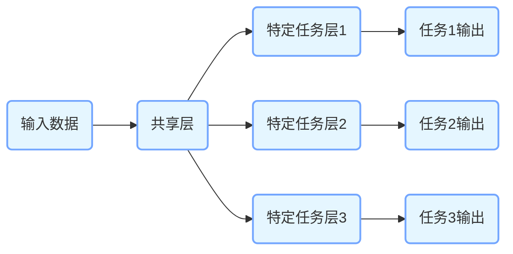

# 多任务学习提升AI推理效果的新范式

> 关键词：多任务学习、AI推理效果、新范式、模型架构、损失函数

> 摘要：本文围绕多任务学习提升AI推理效果的新范式展开深入探讨。首先介绍了多任务学习在AI领域的背景和重要性，阐述了核心概念与联系，包括多任务学习的原理和架构。接着详细讲解了核心算法原理，并给出Python源代码示例。通过数学模型和公式进一步剖析多任务学习的内在机制。在项目实战部分，给出代码实际案例并进行详细解释。同时分析了多任务学习的实际应用场景，推荐了相关的工具和资源。最后总结了多任务学习的未来发展趋势与挑战，解答了常见问题，并提供了扩展阅读和参考资料，旨在为读者全面呈现多任务学习提升AI推理效果的新范式的全貌。

## 1. 背景介绍 
### 1.1 目的和范围
随着人工智能技术的不断发展，单任务学习已经难以满足复杂场景下的需求。多任务学习作为一种有效的学习方式，能够让模型同时处理多个相关任务，从而提升AI推理效果。本文章的目的在于深入探讨多任务学习提升AI推理效果的新范式，涵盖多任务学习的核心概念、算法原理、数学模型、实际应用等方面，旨在为研究人员和开发者提供全面的技术指导和实践参考。

### 1.2 预期读者
本文预期读者包括人工智能领域的研究人员、深度学习开发者、机器学习爱好者等。无论是对多任务学习有初步了解的初学者，还是希望深入研究该领域的专业人士，都能从本文中获得有价值的信息。

### 1.3 文档结构概述
本文将按照以下结构进行组织：首先介绍多任务学习的背景和相关概念；接着阐述核心算法原理和具体操作步骤，并给出Python代码示例；然后通过数学模型和公式对多任务学习进行详细讲解；在项目实战部分，给出实际代码案例并进行详细解读；之后分析多任务学习的实际应用场景；推荐相关的工具和资源；最后总结未来发展趋势与挑战，解答常见问题，并提供扩展阅读和参考资料。

### 1.4 术语表
#### 1.4.1 核心术语定义
- **多任务学习（Multi-Task Learning）**：指在一个模型中同时学习多个相关任务，通过共享模型的部分参数，使得模型能够在不同任务之间进行知识迁移，从而提高模型的泛化能力和推理效果。
- **AI推理（AI Inference）**：指在训练好的模型基础上，对新的数据进行预测和判断的过程。
- **范式（Paradigm）**：是指在某一领域内被广泛接受的理论、方法和实践模式。

#### 1.4.2 相关概念解释
- **任务相关性**：在多任务学习中，不同任务之间的相关性是一个重要的概念。任务相关性越高，模型在多任务学习中能够更好地进行知识迁移，从而提升推理效果。
- **共享参数**：多任务学习通过共享模型的部分参数，使得不同任务之间能够相互影响和促进。共享参数的设计和选择对多任务学习的效果有着重要的影响。

#### 1.4.3 缩略词列表
- **MTL**：Multi-Task Learning（多任务学习）
- **DNN**：Deep Neural Network（深度神经网络）

## 2. 核心概念与联系 

### 核心概念原理
多任务学习的核心原理是利用不同任务之间的相关性，通过共享模型的部分参数，使得模型能够在不同任务之间进行知识迁移。例如，在一个图像识别系统中，同时进行物体分类和目标检测两个任务。这两个任务都需要对图像的特征进行提取和分析，因此可以共享一部分特征提取层的参数。通过共享参数，模型可以在不同任务之间共享知识，从而提高模型的泛化能力和推理效果。

### 架构的文本示意图
多任务学习的架构通常包括共享层和特定任务层。共享层用于提取不同任务之间的共同特征，而特定任务层则用于处理每个任务的特定信息。以下是一个简单的多任务学习架构示意图：

```plaintext
输入数据 -> 共享层（如卷积层、全连接层） -> 特定任务层1 -> 任务1输出
                          |
                          -> 特定任务层2 -> 任务2输出
                          |
                         ...
                          -> 特定任务层n -> 任务n输出
```

### Mermaid流程图


在这个流程图中，输入数据首先经过共享层进行特征提取，然后将提取的特征分别输入到不同的特定任务层中，最后得到每个任务的输出。

## 3. 核心算法原理 & 具体操作步骤 

### 核心算法原理
多任务学习的核心算法原理是通过优化一个包含多个任务损失的联合损失函数来训练模型。联合损失函数通常是各个任务损失的加权和，公式如下：

$$L = \sum_{i=1}^{n} w_i L_i$$

其中，$L$ 是联合损失函数，$n$ 是任务的数量，$w_i$ 是第 $i$ 个任务的权重，$L_i$ 是第 $i$ 个任务的损失函数。

### 具体操作步骤
1. **数据准备**：收集和整理包含多个任务的数据集，并将其划分为训练集、验证集和测试集。
2. **模型构建**：构建一个包含共享层和特定任务层的多任务学习模型。
3. **定义损失函数**：根据每个任务的特点，定义相应的损失函数，并计算联合损失函数。
4. **模型训练**：使用训练集对模型进行训练，通过优化联合损失函数来更新模型的参数。
5. **模型评估**：使用验证集和测试集对训练好的模型进行评估，根据评估结果调整模型的参数和权重。

### Python源代码示例
```python
import torch
import torch.nn as nn
import torch.optim as optim

# 定义多任务学习模型
class MultiTaskModel(nn.Module):
    def __init__(self):
        super(MultiTaskModel, self).__init__()
        # 共享层
        self.shared_layer = nn.Sequential(
            nn.Linear(10, 20),
            nn.ReLU()
        )
        # 特定任务层1
        self.task1_layer = nn.Linear(20, 1)
        # 特定任务层2
        self.task2_layer = nn.Linear(20, 1)

    def forward(self, x):
        shared_output = self.shared_layer(x)
        task1_output = self.task1_layer(shared_output)
        task2_output = self.task2_layer(shared_output)
        return task1_output, task2_output

# 生成一些示例数据
x = torch.randn(100, 10)
y1 = torch.randn(100, 1)
y2 = torch.randn(100, 1)

# 初始化模型
model = MultiTaskModel()

# 定义损失函数和优化器
criterion1 = nn.MSELoss()
criterion2 = nn.MSELoss()
optimizer = optim.Adam(model.parameters(), lr=0.001)

# 训练模型
num_epochs = 100
for epoch in range(num_epochs):
    optimizer.zero_grad()
    task1_output, task2_output = model(x)
    loss1 = criterion1(task1_output, y1)
    loss2 = criterion2(task2_output, y2)
    # 联合损失函数
    joint_loss = loss1 + loss2
    joint_loss.backward()
    optimizer.step()

    if (epoch + 1) % 10 == 0:
        print(f'Epoch [{epoch+1}/{num_epochs}], Loss: {joint_loss.item():.4f}')
```

在这个示例中，我们定义了一个简单的多任务学习模型，包含一个共享层和两个特定任务层。使用均方误差损失函数计算每个任务的损失，并将它们相加得到联合损失函数。最后使用Adam优化器对模型进行训练。

## 4. 数学模型和公式 & 详细讲解 & 举例说明 

### 数学模型和公式
#### 联合损失函数
如前面所述，联合损失函数通常是各个任务损失的加权和：

$$L = \sum_{i=1}^{n} w_i L_i$$

其中，$L$ 是联合损失函数，$n$ 是任务的数量，$w_i$ 是第 $i$ 个任务的权重，$L_i$ 是第 $i$ 个任务的损失函数。

#### 任务权重的选择
任务权重的选择对多任务学习的效果有着重要的影响。常见的任务权重选择方法包括固定权重法、动态权重法等。

- **固定权重法**：在训练过程中，任务权重保持不变。例如，$w_1 = 0.5$，$w_2 = 0.5$，表示两个任务的重要性相同。
- **动态权重法**：任务权重在训练过程中根据任务的训练情况动态调整。例如，根据每个任务的损失值来调整权重，使得损失较大的任务在联合损失函数中占比更大。

### 详细讲解
联合损失函数的作用是将多个任务的损失合并为一个统一的目标函数，使得模型能够同时优化多个任务。通过调整任务权重，可以控制每个任务在联合损失函数中的重要性。在实际应用中，需要根据具体的任务特点和需求来选择合适的任务权重。

### 举例说明
假设我们有两个任务：任务1是图像分类，任务2是目标检测。我们可以定义任务1的损失函数为交叉熵损失 $L_1$，任务2的损失函数为均方误差损失 $L_2$。如果我们认为两个任务的重要性相同，可以设置 $w_1 = 0.5$，$w_2 = 0.5$，则联合损失函数为：

$$L = 0.5L_1 + 0.5L_2$$

在训练过程中，模型将同时优化图像分类和目标检测两个任务，通过共享特征提取层的参数，实现知识迁移，从而提高模型的推理效果。

## 5. 项目实战：代码实际案例和详细解释说明 

### 5.1  开发环境搭建
- **操作系统**：推荐使用Ubuntu 18.04或以上版本。
- **Python环境**：使用Python 3.7或以上版本。
- **深度学习框架**：使用PyTorch 1.7或以上版本。

可以使用以下命令创建一个虚拟环境并安装所需的库：

```bash
# 创建虚拟环境
python -m venv mtl_env
# 激活虚拟环境
source mtl_env/bin/activate
# 安装PyTorch
pip install torch torchvision
```

### 5.2  源代码详细实现和代码解读
```python
import torch
import torch.nn as nn
import torch.optim as optim
from torch.utils.data import DataLoader, Dataset

# 定义数据集类
class MultiTaskDataset(Dataset):
    def __init__(self, x, y1, y2):
        self.x = x
        self.y1 = y1
        self.y2 = y2

    def __len__(self):
        return len(self.x)

    def __getitem__(self, idx):
        return self.x[idx], self.y1[idx], self.y2[idx]

# 定义多任务学习模型
class MultiTaskModel(nn.Module):
    def __init__(self):
        super(MultiTaskModel, self).__init__()
        # 共享层
        self.shared_layer = nn.Sequential(
            nn.Linear(10, 20),
            nn.ReLU()
        )
        # 特定任务层1
        self.task1_layer = nn.Linear(20, 1)
        # 特定任务层2
        self.task2_layer = nn.Linear(20, 1)

    def forward(self, x):
        shared_output = self.shared_layer(x)
        task1_output = self.task1_layer(shared_output)
        task2_output = self.task2_layer(shared_output)
        return task1_output, task2_output

# 生成一些示例数据
x = torch.randn(1000, 10)
y1 = torch.randn(1000, 1)
y2 = torch.randn(1000, 1)

# 创建数据集和数据加载器
dataset = MultiTaskDataset(x, y1, y2)
dataloader = DataLoader(dataset, batch_size=32, shuffle=True)

# 初始化模型
model = MultiTaskModel()

# 定义损失函数和优化器
criterion1 = nn.MSELoss()
criterion2 = nn.MSELoss()
optimizer = optim.Adam(model.parameters(), lr=0.001)

# 训练模型
num_epochs = 100
for epoch in range(num_epochs):
    running_loss = 0.0
    for batch_x, batch_y1, batch_y2 in dataloader:
        optimizer.zero_grad()
        task1_output, task2_output = model(batch_x)
        loss1 = criterion1(task1_output, batch_y1)
        loss2 = criterion2(task2_output, batch_y2)
        # 联合损失函数
        joint_loss = loss1 + loss2
        joint_loss.backward()
        optimizer.step()
        running_loss += joint_loss.item()

    if (epoch + 1) % 10 == 0:
        print(f'Epoch [{epoch+1}/{num_epochs}], Loss: {running_loss / len(dataloader):.4f}')
```

### 代码解读与分析
1. **数据集类 `MultiTaskDataset`**：继承自 `torch.utils.data.Dataset`，用于封装多任务学习的数据集。`__getitem__` 方法返回每个样本的输入数据和对应的两个任务的标签。
2. **多任务学习模型 `MultiTaskModel`**：包含一个共享层和两个特定任务层。共享层用于提取输入数据的共同特征，特定任务层用于处理每个任务的特定信息。
3. **数据加载器 `DataLoader`**：用于批量加载数据，提高训练效率。
4. **损失函数和优化器**：使用均方误差损失函数计算每个任务的损失，并将它们相加得到联合损失函数。使用Adam优化器对模型进行训练。
5. **训练过程**：在每个epoch中，遍历数据加载器，计算联合损失函数，并使用反向传播算法更新模型的参数。

## 6. 实际应用场景 
### 自然语言处理
在自然语言处理中，多任务学习可以同时进行多个相关任务，如文本分类、情感分析、命名实体识别等。通过共享词嵌入层和部分神经网络层，模型可以在不同任务之间进行知识迁移，提高模型的性能。例如，在一个新闻分类系统中，同时进行新闻主题分类和情感分析任务，通过多任务学习可以更好地理解新闻文本的语义信息，提高分类和情感分析的准确性。

### 计算机视觉
在计算机视觉中，多任务学习可以用于图像分类、目标检测、语义分割等任务。例如，在一个自动驾驶系统中，同时进行道路识别、车辆检测和行人检测等任务。通过共享卷积层的参数，模型可以在不同任务之间共享图像特征，提高模型的推理速度和准确性。

### 医疗保健
在医疗保健领域，多任务学习可以用于疾病诊断、疾病预测、药物研发等任务。例如，在一个疾病诊断系统中，同时进行多种疾病的诊断任务。通过共享患者的病历信息和医学图像特征，模型可以在不同疾病之间进行知识迁移，提高疾病诊断的准确性和效率。

## 7. 工具和资源推荐
### 7.1 学习资源推荐
#### 7.1.1 书籍推荐
- 《深度学习》（Deep Learning）：由Ian Goodfellow、Yoshua Bengio和Aaron Courville所著，是深度学习领域的经典教材，涵盖了多任务学习等多个方面的内容。
- 《动手学深度学习》（Dive into Deep Learning）：由李沐等人所著，提供了丰富的深度学习实践案例，包括多任务学习的代码实现。

#### 7.1.2 在线课程
- Coursera上的“深度学习专项课程”（Deep Learning Specialization）：由Andrew Ng教授授课，包含了多任务学习等深度学习的核心内容。
- edX上的“人工智能基础”（Introduction to Artificial Intelligence）：介绍了人工智能的基本概念和方法，包括多任务学习的原理和应用。

#### 7.1.3 技术博客和网站
- Medium上的Towards Data Science：提供了大量关于深度学习和多任务学习的技术文章和案例分析。
- arXiv.org：是一个预印本服务器，提供了最新的机器学习和人工智能研究论文，包括多任务学习的研究成果。

### 7.2 开发工具框架推荐
#### 7.2.1 IDE和编辑器
- PyCharm：是一款专业的Python集成开发环境，提供了丰富的代码编辑、调试和分析功能，适合深度学习开发。
- Jupyter Notebook：是一个交互式的笔记本环境，方便进行代码编写、数据可视化和模型调试，常用于深度学习的实验和研究。

#### 7.2.2 调试和性能分析工具
- TensorBoard：是TensorFlow提供的可视化工具，可以用于可视化模型的训练过程、损失函数曲线、模型结构等，帮助开发者调试和优化模型。
- PyTorch Profiler：是PyTorch提供的性能分析工具，可以用于分析模型的计算时间、内存使用情况等，帮助开发者优化模型的性能。

#### 7.2.3 相关框架和库
- PyTorch：是一个开源的深度学习框架，提供了丰富的神经网络层和优化算法，支持多任务学习的模型构建和训练。
- TensorFlow：是另一个广泛使用的深度学习框架，提供了高级的API和分布式训练功能，也支持多任务学习。

### 7.3 相关论文著作推荐
#### 7.3.1 经典论文
- "Learning Multiple Tasks with Multilinear Relationship Networks"：提出了一种基于多线性关系网络的多任务学习方法，通过建模任务之间的多线性关系，提高了多任务学习的性能。
- "An Overview of Multi-Task Learning in Deep Neural Networks"：对深度学习中的多任务学习进行了全面的综述，介绍了多任务学习的基本概念、方法和应用。

#### 7.3.2 最新研究成果
- 关注arXiv.org上最新的多任务学习研究论文，了解该领域的最新技术和方法。

#### 7.3.3 应用案例分析
- 一些知名的学术会议和期刊，如NeurIPS、ICML、CVPR等，会发表多任务学习在不同领域的应用案例分析，从中可以学习到多任务学习的实际应用经验。

## 8. 总结：未来发展趋势与挑战
### 未来发展趋势
- **更复杂的任务组合**：未来多任务学习将处理更复杂的任务组合，涉及到更多的领域和模态，如结合自然语言处理、计算机视觉和语音识别等多个领域的任务。
- **自适应任务权重调整**：研究更加智能的任务权重调整方法，使得模型能够根据任务的动态变化自动调整任务权重，提高模型的灵活性和适应性。
- **与强化学习的结合**：将多任务学习与强化学习相结合，用于解决复杂的决策问题，如机器人控制、自动驾驶等。

### 挑战
- **任务相关性的度量**：如何准确地度量不同任务之间的相关性是多任务学习面临的一个挑战。任务相关性的度量不准确可能会导致模型在不同任务之间无法有效进行知识迁移。
- **模型复杂度和训练效率**：随着任务数量的增加，模型的复杂度也会相应增加，导致训练效率下降。如何在保证模型性能的前提下，提高模型的训练效率是一个需要解决的问题。
- **可解释性**：多任务学习模型的可解释性较差，难以理解模型在不同任务之间是如何进行知识迁移的。提高多任务学习模型的可解释性是未来研究的一个重要方向。

## 9. 附录：常见问题与解答
### 问题1：多任务学习中如何选择合适的任务权重？
解答：可以根据任务的重要性、数据集的大小等因素来选择任务权重。常见的方法包括固定权重法和动态权重法。固定权重法在训练过程中任务权重保持不变，而动态权重法根据任务的训练情况动态调整任务权重。

### 问题2：多任务学习对数据集有什么要求？
解答：多任务学习要求数据集包含多个相关任务的标注数据。不同任务的数据应该具有一定的相关性，以便模型能够在不同任务之间进行知识迁移。同时，数据集的规模和质量也会影响多任务学习的效果。

### 问题3：多任务学习模型的训练时间会比单任务学习模型长吗？
解答：一般来说，多任务学习模型的训练时间会比单任务学习模型长，因为模型需要同时优化多个任务的损失函数。但是，通过合理设计模型架构和选择合适的训练方法，可以在一定程度上提高训练效率。

## 10. 扩展阅读 & 参考资料
- Goodfellow, I., Bengio, Y., & Courville, A. (2016). Deep Learning. MIT Press.
- Li, M., Zhang, A., Li, Z., & Smola, A. J. (2020). Dive into Deep Learning.
- Caruana, R. (1997). Multitask learning. Machine learning, 28(1), 41-75.

作者：AI天才研究院/AI Genius Institute & 禅与计算机程序设计艺术 /Zen And The Art of Computer Programming