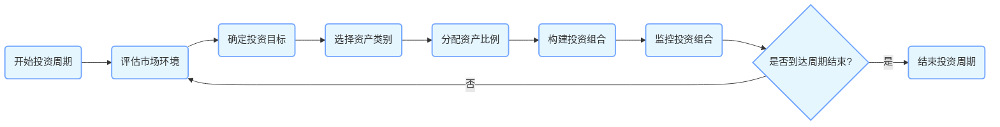

# 多周期投资优化：考虑时间维度的资产配置

> 关键词：多周期投资优化、时间维度、资产配置、投资组合、数学模型

> 摘要：本文聚焦于多周期投资优化中考虑时间维度的资产配置问题。详细介绍了多周期投资优化的背景，包括目的、预期读者、文档结构和相关术语。深入剖析了核心概念与联系，阐述了核心算法原理并给出Python代码示例，推导了数学模型和公式。通过项目实战展示了代码的实际应用和解读，探讨了实际应用场景。推荐了学习资源、开发工具框架和相关论文著作。最后总结了未来发展趋势与挑战，解答常见问题并提供扩展阅读和参考资料，旨在为投资者和相关研究人员提供全面深入的多周期投资优化知识体系。

## 1. 背景介绍 
### 1.1 目的和范围
在传统的投资决策中，往往只关注单一周期内的资产配置，忽略了时间维度对投资组合的影响。然而，实际的投资过程是一个长期的、多阶段的过程，不同阶段的市场环境、投资者的风险偏好和投资目标都会发生变化。因此，考虑时间维度的多周期投资优化具有重要的现实意义。

本文的目的在于深入探讨多周期投资优化中考虑时间维度的资产配置方法，涵盖从核心概念、算法原理、数学模型到实际应用的各个方面，为投资者和研究人员提供全面的理论和实践指导。具体范围包括介绍相关术语和概念，推导核心算法和数学模型，通过实际案例展示如何进行多周期投资优化，以及推荐相关的学习资源和工具。

### 1.2 预期读者
本文预期读者主要包括以下几类人群：
- **投资者**：无论是个人投资者还是机构投资者，都可以从本文中获取关于多周期投资优化的方法和策略，以提高投资组合的绩效。
- **金融分析师**：帮助他们更深入地理解多周期投资的复杂性，为客户提供更专业的投资建议。
- **研究人员**：为相关领域的学术研究提供理论和方法参考，推动多周期投资优化领域的发展。
- **金融专业学生**：作为学习多周期投资和资产配置的教材，加深对该领域的理解和掌握。

### 1.3 文档结构概述
本文的文档结构如下：
- **核心概念与联系**：介绍多周期投资优化和考虑时间维度的资产配置的核心概念，以及它们之间的联系，并通过文本示意图和Mermaid流程图进行可视化展示。
- **核心算法原理 & 具体操作步骤**：详细阐述核心算法的原理，并使用Python源代码进行具体操作步骤的演示。
- **数学模型和公式 & 详细讲解 & 举例说明**：推导多周期投资优化的数学模型和公式，并通过具体例子进行说明。
- **项目实战：代码实际案例和详细解释说明**：通过实际项目案例，展示如何使用代码进行多周期投资优化，并对代码进行详细解读。
- **实际应用场景**：探讨多周期投资优化在不同领域的实际应用场景。
- **工具和资源推荐**：推荐学习资源、开发工具框架和相关论文著作。
- **总结：未来发展趋势与挑战**：总结多周期投资优化的未来发展趋势和面临的挑战。
- **附录：常见问题与解答**：解答读者在阅读过程中可能遇到的常见问题。
- **扩展阅读 & 参考资料**：提供扩展阅读的建议和相关参考资料。

### 1.4 术语表
#### 1.4.1 核心术语定义
- **多周期投资优化**：在多个投资周期内，通过合理配置资产，以实现投资目标的最优化。
- **时间维度**：考虑投资过程中不同阶段的时间因素，包括投资期限、市场周期等。
- **资产配置**：将资金分配到不同的资产类别中，以降低风险并提高收益。
- **投资组合**：由多种资产组成的集合，通过合理组合资产来实现投资目标。
- **风险偏好**：投资者对风险的承受能力和偏好程度。
- **投资目标**：投资者期望实现的投资收益和风险水平。

#### 1.4.2 相关概念解释
- **动态资产配置**：根据市场环境和投资者情况的变化，动态调整资产配置比例。
- **均值 - 方差模型**：一种经典的资产配置模型，通过最大化预期收益和最小化风险来确定最优投资组合。
- **蒙特卡罗模拟**：一种通过随机抽样来模拟投资组合未来表现的方法。

#### 1.4.3 缩略词列表
- **MVP**：Minimum Variance Portfolio（最小方差投资组合）
- **Efficient Frontier**：有效前沿
- **CAPM**：Capital Asset Pricing Model（资本资产定价模型）

## 2. 核心概念与联系 

### 核心概念原理
多周期投资优化的核心在于考虑时间维度对资产配置的影响。在不同的投资周期内，市场环境、资产价格波动和投资者的风险偏好都会发生变化。因此，需要动态地调整资产配置比例，以适应这些变化。

时间维度的引入使得投资决策不再是静态的，而是一个动态的过程。投资者需要在每个投资周期开始时，根据当前的市场情况和自身的投资目标，重新评估资产配置方案，并进行相应的调整。

资产配置是多周期投资优化的关键环节。通过将资金分配到不同的资产类别中，如股票、债券、现金等，可以降低投资组合的风险。不同资产类别在不同的市场环境下表现不同，因此合理的资产配置可以在一定程度上平衡风险和收益。

### 架构的文本示意图
```plaintext
多周期投资优化
|-- 时间维度
|   |-- 投资期限
|   |-- 市场周期
|-- 资产配置
|   |-- 资产类别选择
|   |-- 资产比例分配
|-- 投资组合
|   |-- 风险评估
|   |-- 收益预测
|-- 投资目标
|   |-- 风险偏好
|   |-- 预期收益
```

### Mermaid流程图


## 3. 核心算法原理 & 具体操作步骤 

### 核心算法原理
多周期投资优化的核心算法通常基于动态规划和均值 - 方差模型。动态规划用于在多个投资周期内进行最优决策，通过递推的方式求解每个周期的最优资产配置方案。均值 - 方差模型用于评估投资组合的风险和收益，通过最大化预期收益和最小化风险来确定最优投资组合。

具体来说，假设我们有 $n$ 个投资周期，每个周期有 $m$ 种资产可供选择。在每个周期 $t$ ，我们需要确定每种资产的投资比例 $w_{t,i}$ ，其中 $i = 1,2,\cdots,m$ 。目标是在满足一定约束条件下，最大化整个投资过程的预期收益。

### 具体操作步骤
1. **数据收集**：收集历史资产价格数据、市场指数数据等，用于计算资产的预期收益率和协方差矩阵。
2. **确定投资目标和约束条件**：明确投资者的风险偏好、预期收益和投资期限等，同时确定投资组合的约束条件，如资产比例限制、投资金额限制等。
3. **初始化参数**：设置初始投资组合的资产比例和投资金额。
4. **循环迭代**：对于每个投资周期 $t$ ，执行以下步骤：
    - 计算当前周期的资产预期收益率和协方差矩阵。
    - 根据均值 - 方差模型，求解当前周期的最优资产配置方案。
    - 更新投资组合的资产比例和投资金额。
5. **监控和调整**：在每个投资周期结束时，监控投资组合的表现，根据市场情况和投资目标的变化，调整资产配置方案。

### Python源代码实现
```python
import numpy as np
import pandas as pd
from scipy.optimize import minimize

# 数据收集
def collect_data():
    # 这里假设我们已经有了历史资产价格数据
    # 数据格式为DataFrame，列名分别为资产名称，行索引为日期
    data = pd.read_csv('asset_prices.csv', index_col=0)
    returns = data.pct_change().dropna()
    return returns

# 计算预期收益率和协方差矩阵
def calculate_stats(returns):
    expected_returns = returns.mean()
    cov_matrix = returns.cov()
    return expected_returns, cov_matrix

# 定义目标函数：最小化投资组合的方差
def portfolio_variance(weights, cov_matrix):
    return np.dot(weights.T, np.dot(cov_matrix, weights))

# 定义约束条件：权重之和为1
def weight_constraint(weights):
    return np.sum(weights) - 1

# 求解最优资产配置方案
def optimize_portfolio(expected_returns, cov_matrix):
    num_assets = len(expected_returns)
    # 初始权重
    initial_weights = np.ones(num_assets) / num_assets
    # 权重约束
    constraints = ({'type': 'eq', 'fun': weight_constraint})
    # 权重范围
    bounds = [(0, 1) for _ in range(num_assets)]
    # 最小化方差
    result = minimize(portfolio_variance, initial_weights, args=(cov_matrix,),
                      method='SLSQP', bounds=bounds, constraints=constraints)
    optimal_weights = result.x
    return optimal_weights

# 主函数
def main():
    returns = collect_data()
    expected_returns, cov_matrix = calculate_stats(returns)
    optimal_weights = optimize_portfolio(expected_returns, cov_matrix)
    print("最优资产配置权重:", optimal_weights)

if __name__ == "__main__":
    main()
```

## 4. 数学模型和公式 & 详细讲解 & 举例说明 

### 数学模型
多周期投资优化的数学模型可以表示为一个动态规划问题。假设我们有 $n$ 个投资周期，每个周期有 $m$ 种资产可供选择。在每个周期 $t$ ，我们需要确定每种资产的投资比例 $w_{t,i}$ ，其中 $i = 1,2,\cdots,m$ 。

设 $r_{t,i}$ 为资产 $i$ 在周期 $t$ 的收益率，$x_{t,i}$ 为资产 $i$ 在周期 $t$ 的投资金额，$W_t$ 为周期 $t$ 的总投资金额。则有：

$$W_{t+1}=\sum_{i=1}^{m}x_{t,i}(1 + r_{t,i})$$

$$x_{t,i}=W_tw_{t,i}$$

目标是在满足一定约束条件下，最大化整个投资过程的预期收益。假设投资者的风险偏好可以用一个风险厌恶系数 $\lambda$ 表示，则目标函数可以表示为：

$$\max_{w_{1,1},\cdots,w_{n,m}}E\left[\sum_{t=1}^{n}\left(\sum_{i=1}^{m}w_{t,i}r_{t,i}-\frac{\lambda}{2}\sum_{i=1}^{m}\sum_{j=1}^{m}w_{t,i}w_{t,j}\sigma_{t,ij}\right)\right]$$

其中，$\sigma_{t,ij}$ 为资产 $i$ 和资产 $j$ 在周期 $t$ 的协方差。

### 约束条件
- **权重约束**：$\sum_{i=1}^{m}w_{t,i}=1$，即每种资产的投资比例之和为1。
- **非负约束**：$w_{t,i}\geq0$，即每种资产的投资比例不能为负数。
- **投资金额约束**：$x_{t,i}\geq0$，即每种资产的投资金额不能为负数。

### 详细讲解
上述数学模型的核心思想是在多个投资周期内，通过动态调整资产配置比例，最大化投资组合的预期收益，同时考虑投资者的风险偏好。在每个周期 $t$ ，我们需要根据当前的市场情况和投资者的风险偏好，求解最优的资产配置方案。

目标函数中的第一项 $\sum_{i=1}^{m}w_{t,i}r_{t,i}$ 表示投资组合在周期 $t$ 的预期收益，第二项 $\frac{\lambda}{2}\sum_{i=1}^{m}\sum_{j=1}^{m}w_{t,i}w_{t,j}\sigma_{t,ij}$ 表示投资组合在周期 $t$ 的风险。风险厌恶系数 $\lambda$ 越大，投资者对风险的厌恶程度越高，在优化过程中会更倾向于降低风险。

### 举例说明
假设我们有两个投资周期，每个周期有两种资产可供选择，分别为股票和债券。历史数据显示，股票的预期收益率为 $0.1$ ，债券的预期收益率为 $0.05$ ，股票和债券的协方差矩阵为：

$$\Sigma=\begin{bmatrix}0.04 & 0.01\\0.01 & 0.01\end{bmatrix}$$

投资者的风险厌恶系数 $\lambda = 2$ ，初始投资金额 $W_1 = 10000$ 元。

在第一个周期，我们需要求解最优的资产配置方案。根据上述数学模型和约束条件，可以得到以下优化问题：

$$\max_{w_{1,1},w_{1,2}}\left(w_{1,1}\times0.1 + w_{1,2}\times0.05-\frac{2}{2}\left(w_{1,1}^2\times0.04 + 2w_{1,1}w_{1,2}\times0.01 + w_{1,2}^2\times0.01\right)\right)$$

$$s.t.\quad w_{1,1}+w_{1,2}=1$$

$$w_{1,1}\geq0,w_{1,2}\geq0$$

使用Python的 `scipy.optimize.minimize` 函数求解上述优化问题，得到最优资产配置权重为 $w_{1,1}=0.6$ ，$w_{1,2}=0.4$ 。

在第二个周期，我们需要根据第一个周期的投资结果和市场情况，重新求解最优的资产配置方案。假设第一个周期结束后，总投资金额变为 $W_2 = 10000\times(0.6\times(1 + 0.1)+0.4\times(1 + 0.05)) = 10600$ 元。此时，我们可以重复上述优化过程，得到第二个周期的最优资产配置方案。

## 5. 项目实战：代码实际案例和详细解释说明 

### 5.1  开发环境搭建
为了实现多周期投资优化的项目，我们需要搭建以下开发环境：
- **Python环境**：建议使用Python 3.7及以上版本。
- **相关库**：需要安装 `numpy`、`pandas`、`scipy` 等库。可以使用以下命令进行安装：
```sh
pip install numpy pandas scipy
```
- **代码编辑器**：可以使用VS Code、PyCharm等代码编辑器。

### 5.2  源代码详细实现和代码解读
以下是一个完整的多周期投资优化项目的源代码：
```python
import numpy as np
import pandas as pd
from scipy.optimize import minimize

# 数据收集
def collect_data():
    # 这里假设我们已经有了历史资产价格数据
    # 数据格式为DataFrame，列名分别为资产名称，行索引为日期
    data = pd.read_csv('asset_prices.csv', index_col=0)
    returns = data.pct_change().dropna()
    return returns

# 计算预期收益率和协方差矩阵
def calculate_stats(returns):
    expected_returns = returns.mean()
    cov_matrix = returns.cov()
    return expected_returns, cov_matrix

# 定义目标函数：最小化投资组合的方差
def portfolio_variance(weights, cov_matrix):
    return np.dot(weights.T, np.dot(cov_matrix, weights))

# 定义约束条件：权重之和为1
def weight_constraint(weights):
    return np.sum(weights) - 1

# 求解最优资产配置方案
def optimize_portfolio(expected_returns, cov_matrix):
    num_assets = len(expected_returns)
    # 初始权重
    initial_weights = np.ones(num_assets) / num_assets
    # 权重约束
    constraints = ({'type': 'eq', 'fun': weight_constraint})
    # 权重范围
    bounds = [(0, 1) for _ in range(num_assets)]
    # 最小化方差
    result = minimize(portfolio_variance, initial_weights, args=(cov_matrix,),
                      method='SLSQP', bounds=bounds, constraints=constraints)
    optimal_weights = result.x
    return optimal_weights

# 多周期投资优化主函数
def multi_period_optimization(num_periods, initial_investment):
    all_weights = []
    all_wealth = [initial_investment]
    for period in range(num_periods):
        returns = collect_data()
        expected_returns, cov_matrix = calculate_stats(returns)
        optimal_weights = optimize_portfolio(expected_returns, cov_matrix)
        all_weights.append(optimal_weights)
        # 计算当前周期的投资组合收益率
        portfolio_return = np.dot(optimal_weights, expected_returns)
        # 更新总投资金额
        current_wealth = all_wealth[-1] * (1 + portfolio_return)
        all_wealth.append(current_wealth)
    return all_weights, all_wealth

# 主函数
def main():
    num_periods = 5
    initial_investment = 10000
    all_weights, all_wealth = multi_period_optimization(num_periods, initial_investment)
    print("各周期最优资产配置权重:", all_weights)
    print("各周期总投资金额:", all_wealth)

if __name__ == "__main__":
    main()
```

### 代码解读与分析
- **数据收集**：`collect_data` 函数用于收集历史资产价格数据，并计算资产的收益率。
- **计算统计信息**：`calculate_stats` 函数用于计算资产的预期收益率和协方差矩阵。
- **目标函数**：`portfolio_variance` 函数定义了投资组合的方差，作为优化的目标函数。
- **约束条件**：`weight_constraint` 函数定义了权重之和为1的约束条件。
- **求解最优资产配置方案**：`optimize_portfolio` 函数使用 `scipy.optimize.minimize` 函数求解最优资产配置方案。
- **多周期投资优化主函数**：`multi_period_optimization` 函数实现了多周期投资优化的主要逻辑，在每个周期内计算最优资产配置方案，并更新总投资金额。
- **主函数**：`main` 函数设置了投资周期数和初始投资金额，调用 `multi_period_optimization` 函数进行多周期投资优化，并输出结果。

通过上述代码，我们可以实现多周期投资优化，动态调整资产配置比例，以适应不同周期的市场环境。

## 6. 实际应用场景 
多周期投资优化在实际投资中有广泛的应用场景，以下是一些常见的应用场景：
- **个人投资规划**：个人投资者可以根据自己的投资目标、风险偏好和投资期限，使用多周期投资优化方法进行资产配置。例如，一个年轻的投资者可能更倾向于投资股票等高风险资产，以追求较高的长期收益；而一个临近退休的投资者可能会增加债券等低风险资产的比例，以保证资产的稳定性。
- **基金管理**：基金经理可以使用多周期投资优化方法来管理基金的资产配置。通过动态调整基金的投资组合，基金经理可以在不同的市场环境下实现基金的最优表现。例如，在市场上涨时，增加股票的投资比例；在市场下跌时，增加债券的投资比例。
- **养老金管理**：养老金管理机构需要在长期内保证养老金的安全和增值。多周期投资优化方法可以帮助养老金管理机构合理配置资产，降低投资风险，提高养老金的收益率。例如，养老金管理机构可以根据不同年龄段的投资者的风险偏好，制定不同的资产配置方案。
- **保险资金投资**：保险公司需要将大量的保险资金进行投资，以实现资金的保值增值。多周期投资优化方法可以帮助保险公司在保证资金安全性的前提下，提高投资收益。例如，保险公司可以根据保险业务的特点和市场情况，动态调整投资组合的资产配置比例。

## 7. 工具和资源推荐
### 7.1 学习资源推荐
#### 7.1.1 书籍推荐
- 《投资学》（第10版），滋维·博迪、亚历克斯·凯恩、艾伦·马库斯著，是投资领域的经典教材，涵盖了资产配置、投资组合理论等内容。
- 《金融数学：金融工程引论》，马雷克·卡皮塔尼斯基、托马什·扎斯特温斯基著，介绍了金融数学的基本原理和方法，对于理解多周期投资优化的数学模型有很大帮助。
- 《动态资产配置》，约翰·Y·坎贝尔、路易斯·M·韦尔奇著，深入探讨了动态资产配置的理论和实践。

#### 7.1.2 在线课程
- Coursera上的“投资学原理”课程，由知名教授授课，系统介绍了投资学的基本概念和方法。
- edX上的“金融工程与风险管理”课程，涵盖了金融工程的核心内容，包括资产配置和风险管理。
- Udemy上的“Python金融分析与算法交易”课程，通过Python代码实现金融分析和算法交易，对于学习多周期投资优化的代码实现有很大帮助。

#### 7.1.3 技术博客和网站
- 优矿（uqer.io）：提供金融数据和量化分析工具，有很多关于资产配置和投资优化的技术文章和案例。
- 聚宽（joinquant.com）：是一个量化交易平台，有丰富的金融数据和策略库，适合学习和实践多周期投资优化。
- 雪球（xueqiu.com）：是一个投资社区，有很多投资者分享自己的投资经验和策略，可以从中获取灵感。

### 7.2 开发工具框架推荐
#### 7.2.1 IDE和编辑器
- PyCharm：是一款专业的Python集成开发环境，具有代码自动补全、调试等功能，适合开发复杂的Python项目。
- VS Code：是一款轻量级的代码编辑器，支持多种编程语言，有丰富的插件可以扩展功能，适合快速开发和调试代码。

#### 7.2.2 调试和性能分析工具
- `pdb`：是Python自带的调试工具，可以帮助我们定位代码中的问题。
- `cProfile`：是Python的性能分析工具，可以分析代码的运行时间和函数调用情况，帮助我们优化代码性能。

#### 7.2.3 相关框架和库
- `numpy`：是Python的数值计算库，提供了高效的数组操作和数学函数，是多周期投资优化中不可或缺的工具。
- `pandas`：是Python的数据处理库，提供了强大的数据结构和数据处理功能，方便我们处理和分析金融数据。
- `scipy`：是Python的科学计算库，提供了优化、积分、插值等功能，用于求解多周期投资优化的数学模型。

### 7.3 相关论文著作推荐
#### 7.3.1 经典论文
- Markowitz, H. M. (1952). Portfolio selection. The journal of finance, 7(1), 77-91. 提出了均值 - 方差模型，是现代投资组合理论的奠基之作。
- Merton, R. C. (1971). Optimum consumption and portfolio rules in a continuous-time model. Journal of economic theory, 3(4), 373-413. 提出了连续时间的动态资产配置模型。

#### 7.3.2 最新研究成果
- Brandt, M. W., Santa-Clara, P., & Valkanov, R. (2009). Parametric portfolio policies: Exploiting characteristics in the cross-section of equity returns. The Journal of Finance, 64(1), 137-167. 提出了参数化投资组合策略，用于利用股票的特征信息进行资产配置。
- Campbell, J. Y., & Viceira, L. M. (2002). Strategic asset allocation: Portfolio choice for long-term investors. Oxford University Press. 深入研究了长期投资者的资产配置策略。

#### 7.3.3 应用案例分析
- 许多金融机构和研究机构会发布关于多周期投资优化的应用案例分析报告，可以在它们的官方网站上查找相关资料。例如，贝莱德（BlackRock）、先锋集团（Vanguard）等。

## 8. 总结：未来发展趋势与挑战
### 未来发展趋势
- **智能化和自动化**：随着人工智能和机器学习技术的发展，多周期投资优化将越来越智能化和自动化。通过使用深度学习、强化学习等算法，可以更好地预测市场走势和资产价格波动，从而实现更精准的资产配置。
- **个性化投资**：不同投资者的风险偏好、投资目标和投资期限都不同，未来的多周期投资优化将更加注重个性化投资。根据投资者的个人情况，提供定制化的资产配置方案。
- **跨资产类别和跨市场投资**：随着全球金融市场的一体化，投资者将有更多的机会进行跨资产类别和跨市场投资。多周期投资优化将考虑更多的资产类别和市场因素，以实现更有效的风险分散和收益提升。
- **社会责任投资**：越来越多的投资者开始关注社会责任和可持续发展，未来的多周期投资优化将融入社会责任投资的理念。在资产配置中，考虑企业的环境、社会和治理（ESG）因素。

### 挑战
- **数据质量和可靠性**：多周期投资优化需要大量的历史数据来计算资产的预期收益率和协方差矩阵。然而，金融数据往往存在噪声和缺失值，数据质量和可靠性会影响模型的准确性和稳定性。
- **市场不确定性**：金融市场是复杂多变的，存在很多不确定性因素，如宏观经济政策变化、地缘政治风险等。这些不确定性因素会增加多周期投资优化的难度，使得模型的预测结果可能与实际情况存在偏差。
- **模型复杂度和计算效率**：随着考虑的因素越来越多，多周期投资优化的模型会变得越来越复杂。模型复杂度的增加会导致计算效率的下降，需要开发更高效的算法和计算技术来解决这个问题。
- **投资者行为偏差**：投资者的行为往往受到情绪、认知偏差等因素的影响，可能会做出不理性的投资决策。在多周期投资优化中，如何考虑投资者的行为偏差，引导投资者做出理性的投资决策，是一个挑战。

## 9. 附录：常见问题与解答
### 1. 多周期投资优化和单周期投资优化有什么区别？
单周期投资优化只考虑一个投资周期内的资产配置，假设市场环境和投资者情况在该周期内保持不变。而多周期投资优化考虑了时间维度，在多个投资周期内动态调整资产配置比例，以适应市场环境和投资者情况的变化。

### 2. 如何确定投资者的风险偏好？
确定投资者的风险偏好可以通过问卷调查、面谈等方式。常见的风险偏好类型包括保守型、稳健型、平衡型、进取型和激进型。在多周期投资优化中，可以根据投资者的风险偏好设置风险厌恶系数，以平衡投资组合的风险和收益。

### 3. 多周期投资优化的计算复杂度高吗？
多周期投资优化的计算复杂度与投资周期数、资产种类数和模型复杂度有关。一般来说，随着投资周期数和资产种类数的增加，计算复杂度会显著提高。可以使用一些优化算法和计算技术来降低计算复杂度，如动态规划、并行计算等。

### 4. 多周期投资优化的模型需要不断更新吗？
是的，多周期投资优化的模型需要不断更新。因为市场环境和投资者情况是不断变化的，为了保证模型的准确性和有效性，需要定期收集新的数据，更新资产的预期收益率和协方差矩阵，重新求解最优资产配置方案。

### 5. 多周期投资优化可以完全消除投资风险吗？
多周期投资优化可以通过合理的资产配置和动态调整，降低投资组合的风险，但不能完全消除投资风险。金融市场存在很多不确定性因素，如宏观经济政策变化、地缘政治风险等，这些因素会影响资产价格的波动，从而带来投资风险。

## 10. 扩展阅读 & 参考资料
### 扩展阅读
- 《行为金融学》：了解投资者的行为偏差对投资决策的影响，有助于在多周期投资优化中更好地引导投资者做出理性的决策。
- 《量化投资：策略与技术》：介绍了量化投资的基本原理和方法，包括数据处理、模型构建、策略回测等内容，对于学习多周期投资优化的量化实现有很大帮助。
- 《金融科技前沿：应用与趋势》：了解金融科技在投资领域的应用和发展趋势，如人工智能、区块链等技术在多周期投资优化中的应用。

### 参考资料
- 各类金融学术期刊，如《The Journal of Finance》、《Journal of Financial Economics》等，发表了很多关于投资组合理论、资产配置等方面的研究论文。
- 金融机构的研究报告，如摩根大通、高盛等公司发布的关于市场趋势、投资策略等方面的研究报告。
- 相关的书籍和教材，如前面推荐的《投资学》、《金融数学：金融工程引论》等。

作者：AI天才研究院/AI Genius Institute & 禅与计算机程序设计艺术 /Zen And The Art of Computer Programming