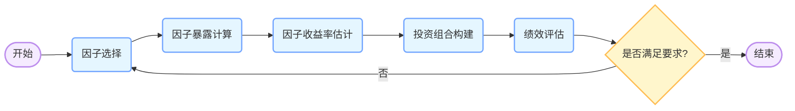

# 多因子模型：提高投资组合表现的系统方法

> 关键词：多因子模型、投资组合、因子分析、系统方法、投资表现

> 摘要：本文深入探讨了多因子模型这一提高投资组合表现的系统方法。首先介绍了多因子模型的背景知识，包括其目的、适用读者、文档结构及相关术语。接着阐述了核心概念与联系，通过文本示意图和 Mermaid 流程图展示其原理和架构。详细讲解了核心算法原理，并用 Python 代码进行具体实现。给出了数学模型和公式，并举例说明。通过项目实战，从开发环境搭建到源代码实现与解读，全面展示了多因子模型的应用。分析了其实际应用场景，推荐了学习、开发工具及相关论文著作。最后总结了未来发展趋势与挑战，解答了常见问题并提供了扩展阅读和参考资料。

## 1. 背景介绍 
### 1.1 目的和范围
多因子模型的主要目的是为投资者提供一种系统的方法来构建和优化投资组合，以提高投资组合的表现。通过识别和分析多个影响资产收益的因子，投资者可以更好地理解资产价格的变动规律，从而做出更明智的投资决策。本文的范围涵盖了多因子模型的基本概念、核心算法、数学原理、实际应用案例以及相关的工具和资源推荐等方面，旨在为读者提供一个全面深入的多因子模型知识体系。

### 1.2 预期读者
本文预期读者包括金融领域的专业投资者、投资组合经理、量化分析师、金融科技从业者以及对金融投资和量化分析感兴趣的学生和研究人员。无论您是初学者希望了解多因子模型的基础知识，还是有一定经验的专业人士寻求更深入的技术探讨，本文都将为您提供有价值的信息。

### 1.3 文档结构概述
本文将按照以下结构进行阐述：首先介绍多因子模型的背景知识，包括目的、读者和文档结构等；接着详细讲解核心概念与联系，通过示意图和流程图展示其原理和架构；然后深入探讨核心算法原理，并用 Python 代码实现具体操作步骤；给出数学模型和公式，并举例说明其应用；通过项目实战展示多因子模型在实际中的应用，包括开发环境搭建、源代码实现和代码解读；分析多因子模型的实际应用场景；推荐相关的学习、开发工具和论文著作；最后总结未来发展趋势与挑战，解答常见问题并提供扩展阅读和参考资料。

### 1.4 术语表
#### 1.4.1 核心术语定义
- **多因子模型**：一种用于解释资产收益的统计模型，它认为资产的收益可以由多个因子共同解释。这些因子可以是宏观经济变量、公司基本面指标、市场情绪等。
- **因子**：影响资产收益的变量，可以分为系统性因子和特质因子。系统性因子影响整个市场或某一行业的资产收益，而特质因子只影响个别资产的收益。
- **因子暴露**：资产对某个因子的敏感程度，通常用回归系数来表示。
- **投资组合**：由多种资产组成的集合，投资者通过合理配置资产来实现特定的投资目标。

#### 1.4.2 相关概念解释
- **风险分散**：通过投资多种不同的资产来降低投资组合的整体风险。多因子模型可以帮助投资者识别不同资产之间的相关性，从而实现更有效的风险分散。
- **因子选股**：根据因子的表现来选择投资的资产。例如，选择那些对某个正向因子暴露较高的资产，预期其未来收益较高。
- **因子择时**：判断因子在不同市场环境下的有效性，选择在因子表现较好的时期进行投资。

#### 1.4.3 缩略词列表
- **CAPM**：资本资产定价模型（Capital Asset Pricing Model），是一种单因子模型，认为资产的收益只与市场风险因子有关。
- **Fama - French 三因子模型**：由 Eugene F. Fama 和 Kenneth R. French 提出的多因子模型，包含市场因子、规模因子和价值因子。
- **APT**：套利定价理论（Arbitrage Pricing Theory），是一种多因子模型，认为资产的收益可以由多个系统性因子解释。

## 2. 核心概念与联系 

### 核心概念原理
多因子模型的核心思想是将资产的收益分解为多个因子的线性组合。假设我们有 $n$ 种资产，第 $i$ 种资产在时期 $t$ 的收益率为 $R_{i,t}$，可以表示为：

$$R_{i,t}=\alpha_{i}+\sum_{j = 1}^{k}\beta_{i,j}F_{j,t}+\epsilon_{i,t}$$

其中，$\alpha_{i}$ 是资产 $i$ 的特质收益，与因子无关；$\beta_{i,j}$ 是资产 $i$ 对第 $j$ 个因子的暴露；$F_{j,t}$ 是第 $j$ 个因子在时期 $t$ 的收益率；$\epsilon_{i,t}$ 是资产 $i$ 在时期 $t$ 的特质误差，满足 $E(\epsilon_{i,t}) = 0$ 且与因子不相关。

### 架构的文本示意图
多因子模型的架构可以分为以下几个主要部分：
1. **因子选择**：从众多可能的因子中筛选出对资产收益有显著影响的因子。这些因子可以是宏观经济因子（如 GDP 增长率、通货膨胀率）、公司基本面因子（如市盈率、市净率）、技术因子（如动量因子、波动率因子）等。
2. **因子暴露计算**：通过回归分析等方法计算每种资产对各个因子的暴露程度。
3. **因子收益率估计**：估计每个因子在不同时期的收益率。
4. **投资组合构建**：根据因子暴露和因子收益率，结合投资者的风险偏好和投资目标，构建投资组合。
5. **绩效评估**：对构建的投资组合进行绩效评估，分析其收益和风险特征，并根据评估结果进行调整。

### Mermaid 流程图


## 3. 核心算法原理 & 具体操作步骤 

### 核心算法原理
多因子模型的核心算法主要包括因子暴露计算和投资组合优化。

#### 因子暴露计算
因子暴露通常通过回归分析来计算。假设我们有 $n$ 种资产的收益率数据 $\mathbf{R}=[R_{1},R_{2},\cdots,R_{n}]^T$ 和 $k$ 个因子的收益率数据 $\mathbf{F}=[F_{1},F_{2},\cdots,F_{k}]$，其中 $R_{i}$ 和 $F_{j}$ 分别是资产 $i$ 和因子 $j$ 的收益率向量。我们可以通过以下回归模型来计算资产 $i$ 对各个因子的暴露：

$$R_{i}=\alpha_{i}+\beta_{i,1}F_{1}+\beta_{i,2}F_{2}+\cdots+\beta_{i,k}F_{k}+\epsilon_{i}$$

其中，$\beta_{i,j}$ 就是资产 $i$ 对因子 $j$ 的暴露。可以使用最小二乘法来估计回归系数 $\beta_{i,j}$。

#### 投资组合优化
投资组合优化的目标是在给定的风险约束下最大化投资组合的预期收益，或者在给定的预期收益目标下最小化投资组合的风险。常用的投资组合优化方法是均值 - 方差优化。假设我们有 $n$ 种资产，其预期收益率向量为 $\mathbf{\mu}=[\mu_{1},\mu_{2},\cdots,\mu_{n}]^T$，协方差矩阵为 $\mathbf{\Sigma}$，投资组合的权重向量为 $\mathbf{w}=[w_{1},w_{2},\cdots,w_{n}]^T$，则投资组合的预期收益率为 $E(R_{p})=\mathbf{w}^T\mathbf{\mu}$，投资组合的方差为 $\sigma_{p}^2=\mathbf{w}^T\mathbf{\Sigma}\mathbf{w}$。

均值 - 方差优化问题可以表示为以下二次规划问题：

$$\min_{\mathbf{w}}\frac{1}{2}\mathbf{w}^T\mathbf{\Sigma}\mathbf{w}-\lambda\mathbf{w}^T\mathbf{\mu}$$

$$\text{s.t.}\quad\sum_{i = 1}^{n}w_{i}=1$$

其中，$\lambda$ 是投资者的风险厌恶系数。

### 具体操作步骤
#### 步骤 1：数据收集
收集资产的收益率数据和因子的收益率数据。可以从金融数据提供商（如 Bloomberg、Wind 等）获取相关数据。

#### 步骤 2：因子暴露计算
使用 Python 中的 `statsmodels` 库进行回归分析，计算每种资产对各个因子的暴露。以下是一个简单的示例代码：

```python
import numpy as np
import pandas as pd
import statsmodels.api as sm

# 模拟资产收益率数据
np.random.seed(0)
n_assets = 5
n_periods = 100
asset_returns = pd.DataFrame(np.random.randn(n_periods, n_assets), columns=[f'Asset_{i}' for i in range(n_assets)])

# 模拟因子收益率数据
n_factors = 3
factor_returns = pd.DataFrame(np.random.randn(n_periods, n_factors), columns=[f'Factor_{i}' for i in range(n_factors)])

# 计算因子暴露
factor_exposures = {}
for asset in asset_returns.columns:
    X = sm.add_constant(factor_returns)
    y = asset_returns[asset]
    model = sm.OLS(y, X).fit()
    factor_exposures[asset] = model.params[1:]

print("因子暴露：", factor_exposures)
```

#### 步骤 3：投资组合优化
使用 Python 中的 `cvxpy` 库进行均值 - 方差优化。以下是一个简单的示例代码：

```python
import cvxpy as cp

# 模拟预期收益率和协方差矩阵
expected_returns = np.random.randn(n_assets)
cov_matrix = np.cov(asset_returns.T)

# 定义优化变量
w = cp.Variable(n_assets)

# 定义风险厌恶系数
lambda_ = 0.5

# 定义目标函数
objective = cp.Minimize(0.5 * cp.quad_form(w, cov_matrix) - lambda_ * w.T @ expected_returns)

# 定义约束条件
constraints = [cp.sum(w) == 1, w >= 0]

# 构建优化问题
prob = cp.Problem(objective, constraints)

# 求解优化问题
prob.solve()

# 输出最优投资组合权重
optimal_weights = w.value
print("最优投资组合权重：", optimal_weights)
```

## 4. 数学模型和公式 & 详细讲解 & 举例说明 

### 多因子模型的数学模型
如前文所述，多因子模型可以表示为：

$$R_{i,t}=\alpha_{i}+\sum_{j = 1}^{k}\beta_{i,j}F_{j,t}+\epsilon_{i,t}$$

其中，$R_{i,t}$ 是资产 $i$ 在时期 $t$ 的收益率，$\alpha_{i}$ 是资产 $i$ 的特质收益，$\beta_{i,j}$ 是资产 $i$ 对第 $j$ 个因子的暴露，$F_{j,t}$ 是第 $j$ 个因子在时期 $t$ 的收益率，$\epsilon_{i,t}$ 是资产 $i$ 在时期 $t$ 的特质误差。

### 详细讲解
- **特质收益 $\alpha_{i}$**：表示资产 $i$ 中与因子无关的部分收益，通常被认为是资产的超额收益。如果一个资产的 $\alpha_{i}$ 为正，说明该资产在相同因子暴露的情况下，获得了比预期更高的收益。
- **因子暴露 $\beta_{i,j}$**：衡量了资产 $i$ 对因子 $j$ 的敏感程度。如果 $\beta_{i,j}$ 为正，说明资产 $i$ 的收益率与因子 $j$ 的收益率呈正相关；如果 $\beta_{i,j}$ 为负，则呈负相关。
- **因子收益率 $F_{j,t}$**：反映了因子 $j$ 在时期 $t$ 的表现。不同的因子在不同的市场环境下可能有不同的表现，例如，在经济扩张时期，价值因子可能表现较好，而在市场上涨时期，动量因子可能表现较好。
- **特质误差 $\epsilon_{i,t}$**：表示资产 $i$ 中不能被因子解释的部分收益，通常被认为是随机噪声。

### 举例说明
假设我们有一个包含三只股票（股票 A、股票 B、股票 C）的投资组合，考虑两个因子：市场因子和价值因子。市场因子用市场指数的收益率表示，价值因子用市盈率的倒数表示。

经过回归分析，我们得到以下因子暴露和因子收益率数据：

| 股票 | $\beta_{市场}$ | $\beta_{价值}$ |
| ---- | ---- | ---- |
| 股票 A | 1.2 | 0.8 |
| 股票 B | 0.9 | 1.1 |
| 股票 C | 1.1 | 0.9 |

| 时期 | 市场因子收益率 $F_{市场}$ | 价值因子收益率 $F_{价值}$ |
| ---- | ---- | ---- |
| 1 | 0.05 | 0.03 |
| 2 | -0.02 | 0.01 |

假设股票 A 的特质收益 $\alpha_{A}=0.01$，股票 B 的特质收益 $\alpha_{B}=0.005$，股票 C 的特质收益 $\alpha_{C}=0.008$。

在时期 1，股票 A 的收益率为：

$$R_{A,1}=\alpha_{A}+\beta_{A,市场}F_{市场,1}+\beta_{A,价值}F_{价值,1}+\epsilon_{A,1}$$

假设 $\epsilon_{A,1}=0$，则

$$R_{A,1}=0.01 + 1.2\times0.05 + 0.8\times0.03=0.01 + 0.06 + 0.024 = 0.094$$

同理，可以计算出股票 B 和股票 C 在时期 1 的收益率。

## 5. 项目实战：代码实际案例和详细解释说明 

### 5.1  开发环境搭建
#### 操作系统
可以选择 Windows、Linux 或 macOS 操作系统。本文以 Windows 10 为例进行说明。

#### Python 环境
建议使用 Python 3.7 及以上版本。可以从 Python 官方网站（https://www.python.org/downloads/） 下载并安装 Python。安装完成后，建议使用虚拟环境来管理项目的依赖包。可以使用 `venv` 模块创建虚拟环境：

```bash
python -m venv myenv
```

激活虚拟环境：

```bash
myenv\Scripts\activate
```

#### 安装依赖包
在激活的虚拟环境中，使用 `pip` 安装所需的依赖包：

```bash
pip install pandas numpy statsmodels cvxpy
```

### 5.2  源代码详细实现和代码解读
#### 数据收集和预处理
```python
import pandas as pd
import numpy as np

# 模拟资产收益率数据
np.random.seed(0)
n_assets = 5
n_periods = 100
asset_returns = pd.DataFrame(np.random.randn(n_periods, n_assets), columns=[f'Asset_{i}' for i in range(n_assets)])

# 模拟因子收益率数据
n_factors = 3
factor_returns = pd.DataFrame(np.random.randn(n_periods, n_factors), columns=[f'Factor_{i}' for i in range(n_factors)])

# 数据预处理：去除缺失值
asset_returns = asset_returns.dropna()
factor_returns = factor_returns.dropna()
```

代码解读：
- 首先，使用 `numpy` 生成模拟的资产收益率数据和因子收益率数据。
- 然后，使用 `pandas` 的 `dropna()` 方法去除数据中的缺失值，以确保后续分析的准确性。

#### 因子暴露计算
```python
import statsmodels.api as sm

# 计算因子暴露
factor_exposures = {}
for asset in asset_returns.columns:
    X = sm.add_constant(factor_returns)
    y = asset_returns[asset]
    model = sm.OLS(y, X).fit()
    factor_exposures[asset] = model.params[1:]

print("因子暴露：", factor_exposures)
```

代码解读：
- 对于每种资产，使用 `statsmodels` 的 `OLS` 类进行普通最小二乘回归分析。
- `sm.add_constant()` 函数用于在因子数据中添加常数项，以拟合回归模型中的截距项。
- `model.params[1:]` 提取回归系数，即因子暴露。

#### 投资组合优化
```python
import cvxpy as cp

# 模拟预期收益率和协方差矩阵
expected_returns = np.random.randn(n_assets)
cov_matrix = np.cov(asset_returns.T)

# 定义优化变量
w = cp.Variable(n_assets)

# 定义风险厌恶系数
lambda_ = 0.5

# 定义目标函数
objective = cp.Minimize(0.5 * cp.quad_form(w, cov_matrix) - lambda_ * w.T @ expected_returns)

# 定义约束条件
constraints = [cp.sum(w) == 1, w >= 0]

# 构建优化问题
prob = cp.Problem(objective, constraints)

# 求解优化问题
prob.solve()

# 输出最优投资组合权重
optimal_weights = w.value
print("最优投资组合权重：", optimal_weights)
```

代码解读：
- 使用 `numpy` 的 `cov()` 函数计算资产收益率的协方差矩阵。
- 使用 `cvxpy` 定义优化变量、目标函数和约束条件。
- `cp.Minimize()` 定义最小化目标函数，其中 `cp.quad_form()` 计算二次型。
- `cp.sum(w) == 1` 确保投资组合的权重之和为 1，`w >= 0` 确保权重非负。
- `prob.solve()` 求解优化问题，`w.value` 获取最优投资组合权重。

### 5.3  代码解读与分析
通过上述代码，我们完成了多因子模型的因子暴露计算和投资组合优化。因子暴露计算帮助我们了解每种资产对不同因子的敏感程度，而投资组合优化则根据资产的预期收益率和协方差矩阵，找到在给定风险约束下的最优投资组合权重。

在实际应用中，我们可以使用真实的金融数据代替模拟数据，以提高模型的准确性和实用性。同时，还可以考虑更多的因子和更复杂的优化方法，以进一步提高投资组合的表现。

## 6. 实际应用场景 
### 资产配置
多因子模型可以帮助投资者进行资产配置，通过分析不同资产对各种因子的暴露，投资者可以选择那些对正向因子暴露较高、对负向因子暴露较低的资产，从而构建更有效的投资组合。例如，在经济增长预期较强的时期，投资者可以增加对与经济增长相关因子暴露较高的资产的配置，如股票市场中的周期股。

### 因子选股
投资者可以根据因子的表现来选择投资的股票。例如，价值因子通常与低市盈率、低市净率的股票相关，投资者可以选择那些价值因子暴露较高的股票，预期其未来可能获得较高的收益。动量因子则与股票的短期涨幅相关，投资者可以选择那些动量因子暴露较高的股票，跟随市场趋势获取收益。

### 风险管理
多因子模型可以用于风险管理，通过分析投资组合对各个因子的暴露，投资者可以评估投资组合的风险来源，并采取相应的措施进行风险控制。例如，如果投资组合对某个因子的暴露过高，投资者可以通过调整资产配置来降低对该因子的暴露，从而降低投资组合的风险。

### 绩效评估
多因子模型可以用于评估投资组合的绩效，通过将投资组合的收益分解为因子收益和特质收益，投资者可以更准确地评估投资组合经理的投资能力。如果投资组合的特质收益为正，说明投资组合经理具有一定的选股能力；如果因子收益为正，说明投资组合的表现与市场因子或其他因子的表现相关。

## 7. 工具和资源推荐
### 7.1 学习资源推荐
#### 7.1.1 书籍推荐
- 《投资学》（Investments），作者：Zvi Bodie、Alex Kane、Alan J. Marcus。这本书是投资学领域的经典教材，详细介绍了投资组合理论、资产定价模型等内容，包括多因子模型的相关知识。
- 《量化投资：策略与技术》，作者：丁鹏。本书系统地介绍了量化投资的理论和实践，包括多因子模型的构建、因子选股策略等内容，适合对量化投资感兴趣的读者。
- 《金融数学》（Mathematical Finance），作者：Marek Capinski、Tomasz Zastawniak。这本书介绍了金融数学的基本概念和方法，包括资产定价、风险管理等内容，对于理解多因子模型的数学原理有很大帮助。

#### 7.1.2 在线课程
- Coursera 上的“Investment Management with Python and Machine Learning”课程，由 EDHEC Business School 提供。该课程介绍了如何使用 Python 和机器学习方法进行投资管理，包括多因子模型的应用。
- Udemy 上的“Quantitative Finance with Python”课程，由 365 Careers 提供。该课程涵盖了量化金融的基础知识和实践，包括多因子模型的构建和回测。

#### 7.1.3 技术博客和网站
- QuantNet（https://www.quantnet.com/）：一个专注于量化金融领域的论坛和社区，提供了大量的量化投资知识和技术文章，包括多因子模型的讨论和实践经验分享。
- Towards Data Science（https://towardsdatascience.com/）：一个数据科学领域的博客平台，有很多关于金融数据分析和量化投资的文章，其中不乏多因子模型的相关内容。

### 7.2 开发工具框架推荐
#### 7.2.1 IDE和编辑器
- PyCharm：一款功能强大的 Python 集成开发环境，提供了代码编辑、调试、版本控制等功能，适合开发复杂的 Python 项目，包括多因子模型的实现。
- Jupyter Notebook：一个交互式的开发环境，支持 Python、R 等多种编程语言。它以笔记本的形式展示代码和结果，方便进行数据分析和模型验证，非常适合多因子模型的研究和实验。

#### 7.2.2 调试和性能分析工具
- pdb：Python 自带的调试工具，可以帮助开发者逐行调试代码，找出代码中的错误和问题。
- cProfile：Python 标准库中的性能分析工具，可以分析代码的运行时间和函数调用次数，帮助开发者找出代码中的性能瓶颈。

#### 7.2.3 相关框架和库
- Pandas：一个强大的数据分析库，提供了高效的数据结构和数据处理工具，适合处理金融数据和进行因子分析。
- NumPy：一个用于科学计算的基础库，提供了高性能的多维数组对象和数学函数，在多因子模型的计算中发挥着重要作用。
- Statsmodels：一个用于统计建模和数据分析的 Python 库，提供了多种统计模型和方法，包括线性回归、时间序列分析等，可用于因子暴露计算。
- CVXPY：一个用于凸优化的 Python 库，提供了简单易用的接口来定义和求解优化问题，可用于投资组合优化。

### 7.3 相关论文著作推荐
#### 7.3.1 经典论文
- Fama, Eugene F., and Kenneth R. French. "Common risk factors in the returns on stocks and bonds." Journal of Financial Economics 33.1 (1993): 3-56. 这篇论文提出了著名的 Fama - French 三因子模型，对多因子模型的发展产生了深远影响。
- Ross, Stephen A. "The arbitrage theory of capital asset pricing." Journal of economic theory 13.3 (1976): 341-360. 这篇论文提出了套利定价理论（APT），为多因子模型的发展奠定了理论基础。

#### 7.3.2 最新研究成果
- Barillas, Francisco, and Robert F. Stambaugh. "Comparing asset pricing models." The Journal of Finance 70.1 (2015): 71-104. 这篇论文比较了不同的资产定价模型，包括多因子模型，为投资者选择合适的模型提供了参考。
- Kozak, Serhiy, Stefan Nagel, and Shrihari Santosh. "Dissecting characteristics nonparametrically." The Journal of Finance 74.1 (2019): 1-40. 这篇论文提出了一种非参数方法来分析资产的特征和因子，为多因子模型的研究提供了新的思路。

#### 7.3.3 应用案例分析
- Ang, Andrew, and Joseph Chen. "Asymmetric correlations of equity portfolios." Journal of Financial Economics 63.3 (2002): 443-494. 这篇论文分析了股票投资组合的非对称相关性，展示了多因子模型在风险管理中的应用。
- Clarke, Roger G., Harindra de Silva, and Steven Thorley. "Portfolio constraints and the fundamental law of active management." The Journal of Portfolio Management 33.3 (2007): 48-66. 这篇论文讨论了投资组合约束对主动管理的影响，以及多因子模型在投资组合优化中的应用。

## 8. 总结：未来发展趋势与挑战
### 未来发展趋势
#### 因子挖掘与创新
随着金融市场的不断发展和数据的日益丰富，未来将有更多的因子被挖掘和发现。除了传统的宏观经济因子、公司基本面因子和技术因子外，还可能出现基于社交媒体情绪、文本挖掘、卫星图像等新兴数据源的因子。这些新兴因子有望为多因子模型带来新的活力和更高的预测能力。

#### 机器学习与深度学习的应用
机器学习和深度学习技术在多因子模型中的应用将越来越广泛。这些技术可以自动从大量数据中提取特征和模式，发现潜在的因子关系，提高因子选择和因子暴露计算的准确性。例如，神经网络可以处理复杂的非线性关系，能够更好地捕捉资产收益与因子之间的复杂交互。

#### 跨市场和跨资产类别的多因子模型
随着全球金融市场的一体化和投资者对多元化投资的需求增加，跨市场和跨资产类别的多因子模型将成为未来的发展方向。这种模型可以综合考虑不同市场和资产类别的因子信息，构建更全面、更有效的投资组合，实现更好的风险分散和收益提升。

### 挑战
#### 数据质量和可得性
多因子模型的有效性依赖于高质量的数据。然而，金融数据往往存在缺失值、异常值和数据偏差等问题，这些问题可能会影响因子的计算和模型的准确性。此外，一些新兴因子的数据可能难以获取，需要投入大量的时间和精力进行收集和整理。

#### 因子的稳定性和时效性
因子的表现可能会随着市场环境的变化而发生改变，一些因子在某些时期可能有效，但在其他时期可能失效。因此，如何判断因子的稳定性和时效性，选择合适的因子进行投资组合构建，是多因子模型面临的一个挑战。

#### 模型的复杂性和可解释性
随着多因子模型的发展，模型的复杂性也在不断增加。复杂的模型可能会提高预测能力，但同时也会降低模型的可解释性。投资者和监管机构通常希望能够理解模型的工作原理和决策依据，因此如何在提高模型性能的同时保持模型的可解释性，是一个需要解决的问题。

## 9. 附录：常见问题与解答
### 问题 1：多因子模型与单因子模型（如 CAPM）有什么区别？
单因子模型（如 CAPM）认为资产的收益只与市场风险因子有关，而多因子模型认为资产的收益可以由多个因子共同解释。多因子模型考虑了更多的影响因素，能够更全面地解释资产价格的变动，因此在实际应用中通常比单因子模型具有更高的解释能力和预测能力。

### 问题 2：如何选择合适的因子？
选择合适的因子需要考虑多个因素，包括因子的经济意义、统计显著性、稳定性和时效性等。可以从宏观经济、公司基本面、技术分析等多个角度筛选可能的因子，然后通过实证研究和回测来评估因子的有效性。此外，还可以参考相关的学术研究和市场经验，选择那些被广泛认可和应用的因子。

### 问题 3：多因子模型是否适用于所有市场和资产类别？
多因子模型在不同的市场和资产类别中都有一定的应用，但并不是适用于所有情况。在一些新兴市场或流动性较差的市场，因子的有效性可能会受到影响。此外，不同的资产类别可能具有不同的因子结构和特征，需要根据具体情况选择合适的因子和模型。

### 问题 4：如何评估多因子模型的性能？
可以从多个方面评估多因子模型的性能，包括模型的解释能力（如 $R^2$ 值）、预测能力（如均方误差、平均绝对误差等）、投资组合的收益和风险特征（如夏普比率、信息比率等）。此外，还可以通过回测和模拟来评估模型在不同市场环境下的表现，以及与其他模型的比较。

### 问题 5：多因子模型的实现需要具备哪些技术和知识？
多因子模型的实现需要具备一定的金融知识、统计学知识和编程技能。需要了解金融市场的基本原理和资产定价理论，掌握统计学中的回归分析、时间序列分析等方法，以及熟练使用 Python 等编程语言进行数据处理、模型构建和优化。

## 10. 扩展阅读 & 参考资料
### 扩展阅读
- 《主动投资组合管理：创造高收益并控制风险的量化投资方法》（Active Portfolio Management: A Quantitative Approach for Producing Superior Returns and Controlling Risk），作者：Richard C. Grinold、Ronald N. Kahn。这本书深入介绍了主动投资组合管理的理论和方法，包括多因子模型的应用和优化。
- 《因子投资：方法与实践》，作者：钱思佳、刘海波。本书系统地介绍了因子投资的基本概念、方法和实践案例，对于深入理解多因子模型在投资中的应用具有重要参考价值。

### 参考资料
- 各金融数据提供商的官方文档和数据说明，如 Bloomberg、Wind 等。
- Python 官方文档（https://docs.python.org/），包括 Pandas、NumPy、Statsmodels、CVXPY 等库的文档。
- 相关学术期刊和会议论文，如 The Journal of Finance、The Review of Financial Studies 等。

作者：AI天才研究院/AI Genius Institute & 禅与计算机程序设计艺术 /Zen And The Art of Computer Programming