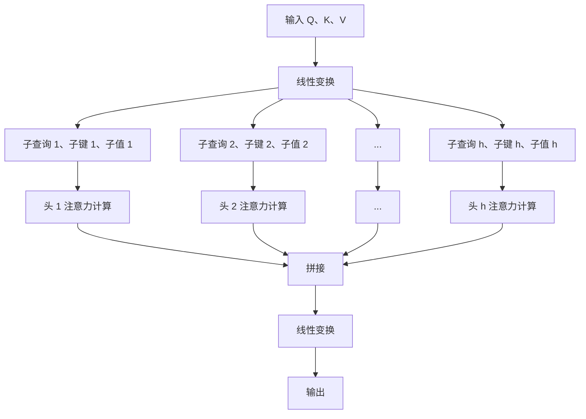

# 多头注意力机制在并行推理中的效率提升

> 关键词：多头注意力机制、并行推理、效率提升、Transformer、自注意力

> 摘要：本文聚焦于多头注意力机制在并行推理中的效率提升问题。首先介绍了多头注意力机制和并行推理的背景知识，包括其目的、适用读者和文档结构。接着详细阐述了核心概念，给出了原理和架构的文本示意图及 Mermaid 流程图。通过 Python 代码详细解释了核心算法原理和具体操作步骤，同时给出了相关的数学模型和公式，并举例说明。在项目实战部分，展示了开发环境搭建、源代码实现和代码解读。还探讨了实际应用场景，推荐了学习资源、开发工具框架和相关论文著作。最后总结了未来发展趋势与挑战，提供了常见问题解答和扩展阅读参考资料，旨在全面深入地剖析多头注意力机制在并行推理中如何实现效率提升。

## 1. 背景介绍 
### 1.1 目的和范围
在自然语言处理（NLP）和计算机视觉（CV）等领域，模型的推理效率至关重要。随着模型规模的不断增大，推理时间也显著增加，这限制了模型在实时应用中的部署。多头注意力机制作为 Transformer 架构的核心组件，为提高并行推理效率提供了可能。本文的目的在于深入探讨多头注意力机制如何在并行推理中发挥作用，提升推理效率。范围涵盖了多头注意力机制的原理、算法实现、数学模型，以及在实际项目中的应用和相关工具资源的推荐。

### 1.2 预期读者
本文预期读者包括人工智能领域的研究人员、开发人员、机器学习工程师和对深度学习技术感兴趣的学生。对于希望深入了解多头注意力机制和并行推理技术，以及寻求提高模型推理效率方法的读者具有较高的参考价值。

### 1.3 文档结构概述
本文将按照以下结构进行组织：首先介绍核心概念与联系，包括多头注意力机制和并行推理的原理和架构；接着详细讲解核心算法原理和具体操作步骤，并给出 Python 代码实现；然后介绍相关的数学模型和公式，并举例说明；在项目实战部分，将展示如何搭建开发环境、实现源代码并进行代码解读；之后探讨实际应用场景；推荐相关的工具和资源；最后总结未来发展趋势与挑战，提供常见问题解答和扩展阅读参考资料。

### 1.4 术语表
#### 1.4.1 核心术语定义
- **多头注意力机制（Multi - Head Attention Mechanism）**：将输入的查询（Query）、键（Key）和值（Value）通过多个不同的线性变换，并行计算多个注意力头，最后将这些头的输出拼接并经过线性变换得到最终输出的机制。
- **并行推理（Parallel Inference）**：在推理过程中，同时处理多个任务或数据样本，以提高推理效率的方法。
- **Transformer**：一种基于注意力机制的深度学习架构，广泛应用于自然语言处理和计算机视觉等领域，多头注意力机制是其核心组件之一。
- **自注意力（Self - Attention）**：一种特殊的注意力机制，其中查询、键和值都来自同一输入序列，用于捕捉序列内元素之间的关系。

#### 1.4.2 相关概念解释
- **注意力机制（Attention Mechanism）**：一种模仿人类注意力的机制，通过计算输入元素之间的相关性，为不同元素分配不同的权重，从而聚焦于重要的信息。
- **线性变换（Linear Transformation）**：一种数学运算，通过矩阵乘法将输入向量映射到另一个向量空间。

#### 1.4.3 缩略词列表
- **NLP**：Natural Language Processing，自然语言处理
- **CV**：Computer Vision，计算机视觉
- **Q**：Query，查询
- **K**：Key，键
- **V**：Value，值

## 2. 核心概念与联系 
### 核心概念原理
#### 多头注意力机制原理
多头注意力机制的核心思想是将输入的查询（Q）、键（K）和值（V）分别通过多个不同的线性变换，得到多个不同的子查询（$Q_i$）、子键（$K_i$）和子值（$V_i$），其中 $i = 1,2,\cdots,h$，$h$ 为头的数量。对于每个头，计算其注意力分数：
$$
\text{Attention}(Q_i, K_i, V_i)=\text{softmax}\left(\frac{Q_iK_i^T}{\sqrt{d_k}}\right)V_i
$$
其中 $d_k$ 是键向量的维度。最后，将所有头的输出拼接起来，并通过一个线性变换得到最终的多头注意力输出：
$$
\text{MultiHead}(Q, K, V)=\text{Concat}(\text{head}_1,\cdots,\text{head}_h)W^O
$$
其中 $\text{head}_i=\text{Attention}(Q_i, K_i, V_i)$，$W^O$ 是一个可学习的矩阵。

#### 并行推理原理
并行推理是指在推理过程中，同时处理多个任务或数据样本。在深度学习中，常见的并行方式有数据并行和模型并行。数据并行是将不同的数据样本分配到多个计算设备（如 GPU）上同时进行处理；模型并行是将模型的不同部分分配到不同的计算设备上，每个设备处理一部分计算任务。

### 架构的文本示意图
```plaintext
输入：查询（Q）、键（K）、值（V）
|
|-- 线性变换：将 Q、K、V 分别变换为 h 个子查询、子键、子值
|   |-- 子查询 1（Q1）、子键 1（K1）、子值 1（V1）
|   |-- 子查询 2（Q2）、子键 2（K2）、子值 2（V2）
|   |--...
|   |-- 子查询 h（Qh）、子键 h（Kh）、子值 h（Vh）
|
|-- 多头注意力计算：对每个头分别计算注意力分数
|   |-- 头 1：Attention(Q1, K1, V1)
|   |-- 头 2：Attention(Q2, K2, V2)
|   |--...
|   |-- 头 h：Attention(Qh, Kh, Vh)
|
|-- 拼接：将所有头的输出拼接起来
|
|-- 线性变换：通过可学习矩阵 W^O 得到最终输出
|
输出：多头注意力输出
```

### Mermaid 流程图


## 3. 核心算法原理 & 具体操作步骤 
### 核心算法原理
多头注意力机制的核心算法主要包括以下几个步骤：
1. **线性变换**：将输入的查询（Q）、键（K）和值（V）分别通过线性变换得到多个子查询、子键和子值。
2. **注意力计算**：对于每个头，计算其注意力分数。
3. **拼接**：将所有头的输出拼接起来。
4. **最终线性变换**：通过一个线性变换得到最终的多头注意力输出。

### 具体操作步骤
以下是使用 Python 和 PyTorch 实现多头注意力机制的代码：
```python
import torch
import torch.nn as nn

class MultiHeadAttention(nn.Module):
    def __init__(self, input_dim, num_heads):
        super(MultiHeadAttention, self).__init__()
        self.input_dim = input_dim
        self.num_heads = num_heads
        self.head_dim = input_dim // num_heads

        # 定义线性变换层
        self.W_q = nn.Linear(input_dim, input_dim)
        self.W_k = nn.Linear(input_dim, input_dim)
        self.W_v = nn.Linear(input_dim, input_dim)
        self.W_o = nn.Linear(input_dim, input_dim)

    def forward(self, Q, K, V, mask=None):
        batch_size = Q.size(0)

        # 线性变换
        Q = self.W_q(Q)
        K = self.W_k(K)
        V = self.W_v(V)

        # 分割为多个头
        Q = Q.view(batch_size, -1, self.num_heads, self.head_dim).transpose(1, 2)
        K = K.view(batch_size, -1, self.num_heads, self.head_dim).transpose(1, 2)
        V = V.view(batch_size, -1, self.num_heads, self.head_dim).transpose(1, 2)

        # 计算注意力分数
        attn_scores = torch.matmul(Q, K.transpose(-2, -1)) / torch.sqrt(torch.tensor(self.head_dim, dtype=torch.float32))

        # 应用掩码
        if mask is not None:
            attn_scores = attn_scores.masked_fill(mask == 0, -1e9)

        # 计算注意力权重
        attn_weights = torch.softmax(attn_scores, dim=-1)

        # 计算注意力输出
        attn_output = torch.matmul(attn_weights, V)

        # 拼接头的输出
        attn_output = attn_output.transpose(1, 2).contiguous().view(batch_size, -1, self.input_dim)

        # 最终线性变换
        output = self.W_o(attn_output)

        return output
```
### 代码解释
1. **初始化**：在 `__init__` 方法中，定义了输入维度 `input_dim`、头的数量 `num_heads` 和每个头的维度 `head_dim`。同时，定义了四个线性变换层 `W_q`、`W_k`、`W_v` 和 `W_o`。
2. **前向传播**：在 `forward` 方法中，首先对输入的查询（Q）、键（K）和值（V）进行线性变换。然后将它们分割为多个头，并计算注意力分数。如果存在掩码，则应用掩码。接着计算注意力权重和注意力输出。最后将所有头的输出拼接起来，并通过最终的线性变换得到最终输出。

## 4. 数学模型和公式 & 详细讲解 & 举例说明 
### 数学模型和公式
#### 线性变换
输入的查询（Q）、键（K）和值（V）通过线性变换得到子查询、子键和子值：
$$
Q_i = QW^Q_i, \quad K_i = KW^K_i, \quad V_i = VW^V_i
$$
其中 $W^Q_i$、$W^K_i$ 和 $W^V_i$ 是可学习的矩阵，$i = 1,2,\cdots,h$。

#### 注意力分数计算
对于每个头，计算其注意力分数：
$$
\text{Attention}(Q_i, K_i, V_i)=\text{softmax}\left(\frac{Q_iK_i^T}{\sqrt{d_k}}\right)V_i
$$
其中 $d_k$ 是键向量的维度。

#### 多头注意力输出
将所有头的输出拼接起来，并通过一个线性变换得到最终的多头注意力输出：
$$
\text{MultiHead}(Q, K, V)=\text{Concat}(\text{head}_1,\cdots,\text{head}_h)W^O
$$
其中 $\text{head}_i=\text{Attention}(Q_i, K_i, V_i)$，$W^O$ 是一个可学习的矩阵。

### 详细讲解
- **线性变换**：通过线性变换将输入的查询、键和值映射到不同的子空间，使得每个头可以关注输入序列的不同方面。
- **注意力分数计算**：注意力分数表示查询与键之间的相关性，通过矩阵乘法计算得到。除以 $\sqrt{d_k}$ 是为了防止点积结果过大，导致 softmax 函数的梯度消失。
- **softmax 函数**：将注意力分数转换为概率分布，使得所有注意力权重之和为 1。
- **注意力输出**：通过注意力权重对值进行加权求和，得到每个头的注意力输出。
- **拼接和最终线性变换**：将所有头的输出拼接起来，并通过最终的线性变换将其映射回原始的特征空间。

### 举例说明
假设输入序列的长度为 $n$，输入维度为 $d$，头的数量为 $h$。则查询（Q）、键（K）和值（V）的形状均为 $(batch\_size, n, d)$。经过线性变换后，每个子查询、子键和子值的形状为 $(batch\_size, n, d/h)$。计算注意力分数时，得到的分数矩阵形状为 $(batch\_size, h, n, n)$。经过 softmax 函数和注意力输出计算后，每个头的输出形状为 $(batch\_size, h, n, d/h)$。拼接所有头的输出后，形状变为 $(batch\_size, n, d)$，最后经过最终的线性变换，输出形状仍为 $(batch\_size, n, d)$。

## 5. 项目实战：代码实际案例和详细解释说明 
### 5.1  开发环境搭建
#### 安装 Python
首先需要安装 Python，建议使用 Python 3.7 及以上版本。可以从 Python 官方网站（https://www.python.org/downloads/）下载并安装。

#### 安装 PyTorch
PyTorch 是一个广泛使用的深度学习框架，用于实现多头注意力机制。可以根据自己的系统和 CUDA 版本选择合适的安装方式，具体安装命令可以参考 PyTorch 官方网站（https://pytorch.org/get-started/locally/）。例如，使用以下命令安装 CPU 版本的 PyTorch：
```bash
pip install torch torchvision
```

#### 安装其他依赖库
还需要安装一些其他的依赖库，如 `numpy` 和 `matplotlib`，可以使用以下命令进行安装：
```bash
pip install numpy matplotlib
```

### 5.2  源代码详细实现和代码解读
以下是一个完整的使用多头注意力机制进行序列分类的代码示例：
```python
import torch
import torch.nn as nn
import torch.optim as optim
from torch.utils.data import Dataset, DataLoader

# 定义数据集类
class SeqDataset(Dataset):
    def __init__(self, data, labels):
        self.data = data
        self.labels = labels

    def __len__(self):
        return len(self.data)

    def __getitem__(self, idx):
        return self.data[idx], self.labels[idx]

# 定义多头注意力机制类
class MultiHeadAttention(nn.Module):
    def __init__(self, input_dim, num_heads):
        super(MultiHeadAttention, self).__init__()
        self.input_dim = input_dim
        self.num_heads = num_heads
        self.head_dim = input_dim // num_heads

        # 定义线性变换层
        self.W_q = nn.Linear(input_dim, input_dim)
        self.W_k = nn.Linear(input_dim, input_dim)
        self.W_v = nn.Linear(input_dim, input_dim)
        self.W_o = nn.Linear(input_dim, input_dim)

    def forward(self, Q, K, V, mask=None):
        batch_size = Q.size(0)

        # 线性变换
        Q = self.W_q(Q)
        K = self.W_k(K)
        V = self.W_v(V)

        # 分割为多个头
        Q = Q.view(batch_size, -1, self.num_heads, self.head_dim).transpose(1, 2)
        K = K.view(batch_size, -1, self.num_heads, self.head_dim).transpose(1, 2)
        V = V.view(batch_size, -1, self.num_heads, self.head_dim).transpose(1, 2)

        # 计算注意力分数
        attn_scores = torch.matmul(Q, K.transpose(-2, -1)) / torch.sqrt(torch.tensor(self.head_dim, dtype=torch.float32))

        # 应用掩码
        if mask is not None:
            attn_scores = attn_scores.masked_fill(mask == 0, -1e9)

        # 计算注意力权重
        attn_weights = torch.softmax(attn_scores, dim=-1)

        # 计算注意力输出
        attn_output = torch.matmul(attn_weights, V)

        # 拼接头的输出
        attn_output = attn_output.transpose(1, 2).contiguous().view(batch_size, -1, self.input_dim)

        # 最终线性变换
        output = self.W_o(attn_output)

        return output

# 定义序列分类模型
class SeqClassifier(nn.Module):
    def __init__(self, input_dim, num_heads, num_classes):
        super(SeqClassifier, self).__init__()
        self.mha = MultiHeadAttention(input_dim, num_heads)
        self.fc = nn.Linear(input_dim, num_classes)

    def forward(self, x, mask=None):
        attn_output = self.mha(x, x, x, mask)
        pooled_output = torch.mean(attn_output, dim=1)
        logits = self.fc(pooled_output)
        return logits

# 生成示例数据
data = torch.randn(100, 10, 64)  # 100 个样本，序列长度为 10，特征维度为 64
labels = torch.randint(0, 2, (100,))  # 二分类问题

# 创建数据集和数据加载器
dataset = SeqDataset(data, labels)
dataloader = DataLoader(dataset, batch_size=16, shuffle=True)

# 初始化模型、损失函数和优化器
model = SeqClassifier(input_dim=64, num_heads=4, num_classes=2)
criterion = nn.CrossEntropyLoss()
optimizer = optim.Adam(model.parameters(), lr=0.001)

# 训练模型
num_epochs = 10
for epoch in range(num_epochs):
    running_loss = 0.0
    for inputs, labels in dataloader:
        optimizer.zero_grad()
        outputs = model(inputs)
        loss = criterion(outputs, labels)
        loss.backward()
        optimizer.step()
        running_loss += loss.item()
    print(f'Epoch {epoch + 1}, Loss: {running_loss / len(dataloader)}')
```
### 代码解读
1. **数据集类**：`SeqDataset` 类继承自 `torch.utils.data.Dataset`，用于封装数据和标签。
2. **多头注意力机制类**：`MultiHeadAttention` 类实现了多头注意力机制的前向传播过程。
3. **序列分类模型类**：`SeqClassifier` 类使用多头注意力机制对输入序列进行特征提取，然后通过全连接层进行分类。
4. **数据生成和加载**：生成示例数据，并使用 `DataLoader` 进行批量加载。
5. **模型训练**：使用交叉熵损失函数和 Adam 优化器对模型进行训练。

### 5.3  代码解读与分析
- **多头注意力机制的作用**：多头注意力机制可以捕捉输入序列中不同位置之间的关系，从而提取更丰富的特征。在序列分类任务中，这些特征可以帮助模型更好地进行分类。
- **并行计算**：在代码中，多头注意力机制的计算可以并行进行，因为每个头的计算是相互独立的。这使得在 GPU 上可以高效地进行计算，提高推理效率。
- **训练过程**：通过迭代训练数据，不断更新模型的参数，使得模型的损失函数逐渐减小，从而提高模型的分类准确率。

## 6. 实际应用场景 
### 自然语言处理
- **机器翻译**：在机器翻译任务中，多头注意力机制可以帮助模型捕捉源语言和目标语言之间的语义关系，提高翻译的质量。例如，在 Transformer 架构的机器翻译模型中，多头注意力机制用于处理输入序列和输出序列之间的交互。
- **文本分类**：在文本分类任务中，多头注意力机制可以提取文本中的关键信息，从而提高分类的准确率。例如，在新闻分类、情感分析等任务中，多头注意力机制可以帮助模型更好地理解文本的语义。
- **问答系统**：在问答系统中，多头注意力机制可以用于处理问题和文档之间的关系，找到最相关的答案。例如，在阅读理解任务中，多头注意力机制可以帮助模型定位文档中与问题相关的部分。

### 计算机视觉
- **图像分类**：在图像分类任务中，多头注意力机制可以帮助模型关注图像中的重要区域，提高分类的准确率。例如，在卷积神经网络中引入多头注意力机制，可以增强模型对图像特征的提取能力。
- **目标检测**：在目标检测任务中，多头注意力机制可以用于处理不同尺度和位置的目标，提高检测的精度。例如，在 Faster R - CNN 等目标检测模型中引入多头注意力机制，可以更好地捕捉目标的特征。
- **图像生成**：在图像生成任务中，多头注意力机制可以帮助模型生成更加真实和自然的图像。例如，在生成对抗网络（GAN）中引入多头注意力机制，可以提高生成图像的质量。

### 其他领域
- **语音识别**：在语音识别任务中，多头注意力机制可以帮助模型处理语音信号中的时序信息，提高识别的准确率。例如，在端到端的语音识别模型中引入多头注意力机制，可以更好地捕捉语音的特征。
- **推荐系统**：在推荐系统中，多头注意力机制可以帮助模型处理用户和物品之间的关系，提高推荐的准确性。例如，在基于深度学习的推荐系统中引入多头注意力机制，可以更好地理解用户的偏好和物品的特征。

## 7. 工具和资源推荐
### 7.1 学习资源推荐
#### 7.1.1 书籍推荐
- 《深度学习》（Deep Learning）：由 Ian Goodfellow、Yoshua Bengio 和 Aaron Courville 编写，是深度学习领域的经典教材，涵盖了深度学习的基本概念、算法和应用。
- 《动手学深度学习》（Dive into Deep Learning）：由 Aston Zhang、Zack C. Lipton、Mu Li 和 Alexander J. Smola 编写，提供了丰富的代码示例和实践项目，适合初学者学习。
- 《自然语言处理入门》（Natural Language Processing with Python）：由 Steven Bird、Ewan Klein 和 Edward Loper 编写，介绍了自然语言处理的基本概念和方法，以及使用 Python 进行自然语言处理的实践。

#### 7.1.2 在线课程
- Coursera 上的《深度学习专项课程》（Deep Learning Specialization）：由 Andrew Ng 教授授课，涵盖了深度学习的多个方面，包括神经网络、卷积神经网络、循环神经网络等。
- edX 上的《使用 PyTorch 进行深度学习》（Introduction to Deep Learning with PyTorch）：介绍了如何使用 PyTorch 进行深度学习模型的开发和训练。
- 哔哩哔哩上的《李宏毅机器学习》：由李宏毅教授授课，课程内容生动有趣，适合初学者入门。

#### 7.1.3 技术博客和网站
- Medium 上的 Towards Data Science：提供了大量关于数据科学和机器学习的文章和教程。
- arXiv：是一个预印本平台，包含了最新的学术研究成果，特别是在人工智能和机器学习领域。
- 机器之心：关注人工智能领域的最新技术和应用，提供了丰富的技术文章和行业动态。

### 7.2 开发工具框架推荐
#### 7.2.1 IDE和编辑器
- PyCharm：是一款专业的 Python 集成开发环境，提供了丰富的代码编辑、调试和项目管理功能。
- Jupyter Notebook：是一个交互式的开发环境，适合进行数据分析和模型开发的实验和演示。
- Visual Studio Code：是一款轻量级的代码编辑器，支持多种编程语言和插件扩展，适合快速开发和调试。

#### 7.2.2 调试和性能分析工具
- PyTorch Profiler：是 PyTorch 提供的性能分析工具，可以帮助用户分析模型的运行时间和内存使用情况。
- TensorBoard：是 TensorFlow 提供的可视化工具，也可以用于 PyTorch 模型的可视化和调试。
- cProfile：是 Python 内置的性能分析工具，可以帮助用户分析代码的运行时间和函数调用情况。

#### 7.2.3 相关框架和库
- PyTorch：是一个广泛使用的深度学习框架，提供了丰富的深度学习模型和工具，支持 GPU 加速。
- TensorFlow：是另一个流行的深度学习框架，具有强大的分布式训练和部署能力。
- Transformers：是 Hugging Face 开发的一个自然语言处理库，提供了预训练的 Transformer 模型和相关工具，方便用户进行自然语言处理任务的开发。

### 7.3 相关论文著作推荐
#### 7.3.1 经典论文
- 《Attention Is All You Need》：提出了 Transformer 架构和多头注意力机制，是自然语言处理领域的经典论文。
- 《Neural Machine Translation by Jointly Learning to Align and Translate》：引入了注意力机制在机器翻译中的应用，为后续的研究奠定了基础。
- 《Show, Attend and Tell: Neural Image Caption Generation with Visual Attention》：将注意力机制应用于图像描述生成任务，取得了很好的效果。

#### 7.3.2 最新研究成果
- 关注 arXiv 上的最新论文，特别是在自然语言处理和计算机视觉领域的研究成果。
- 参加相关的学术会议，如 NeurIPS、ICML、ACL 等，了解最新的研究动态。

#### 7.3.3 应用案例分析
- 《BERT: Pre - training of Deep Bidirectional Transformers for Language Understanding》：介绍了 BERT 模型的预训练和微调方法，在自然语言处理任务中取得了很好的效果。
- 《EfficientNet: Rethinking Model Scaling for Convolutional Neural Networks》：提出了 EfficientNet 模型，通过网络架构搜索的方法，提高了卷积神经网络的效率和性能。

## 8. 总结：未来发展趋势与挑战
### 未来发展趋势
- **模型效率优化**：随着模型规模的不断增大，如何提高模型的推理效率将成为未来的研究重点。多头注意力机制在并行推理中的应用将得到进一步的优化和改进，例如通过更高效的算法和硬件加速技术。
- **跨领域应用**：多头注意力机制将在更多的领域得到应用，如医疗、金融、交通等。通过与不同领域的知识和数据相结合，多头注意力机制可以解决更多复杂的问题。
- **与其他技术融合**：多头注意力机制将与其他技术，如强化学习、生成对抗网络等进行融合，创造出更强大的模型和算法。例如，在强化学习中引入多头注意力机制，可以提高智能体对环境的感知和决策能力。

### 挑战
- **计算资源需求**：多头注意力机制的计算复杂度较高，需要大量的计算资源。如何在有限的计算资源下实现高效的推理是一个挑战。
- **可解释性**：多头注意力机制的决策过程往往难以解释，这在一些对可解释性要求较高的领域，如医疗和金融，是一个问题。如何提高多头注意力机制的可解释性是未来需要解决的问题。
- **数据隐私和安全**：在使用多头注意力机制处理敏感数据时，数据隐私和安全是一个重要的问题。如何在保证模型性能的前提下，保护数据的隐私和安全是一个挑战。

## 9. 附录：常见问题与解答
### 问题 1：多头注意力机制和单头注意力机制有什么区别？
解答：单头注意力机制只使用一个注意力头进行计算，而多头注意力机制使用多个注意力头并行计算。多头注意力机制可以捕捉输入序列中不同方面的信息，从而提取更丰富的特征，提高模型的性能。

### 问题 2：如何选择多头注意力机制的头的数量？
解答：头的数量是一个超参数，需要根据具体的任务和数据集进行调整。一般来说，增加头的数量可以提高模型的性能，但也会增加计算复杂度和内存需求。可以通过实验的方法选择合适的头的数量。

### 问题 3：多头注意力机制在 GPU 上的并行计算是如何实现的？
解答：在 PyTorch 等深度学习框架中，多头注意力机制的计算可以自动并行化到 GPU 上。每个头的计算是相互独立的，可以在 GPU 的不同线程或核心上同时进行，从而提高计算效率。

### 问题 4：多头注意力机制的计算复杂度是多少？
解答：多头注意力机制的计算复杂度主要取决于输入序列的长度 $n$ 和输入维度 $d$。线性变换的计算复杂度为 $O(nd^2)$，注意力分数计算的复杂度为 $O(n^2d)$，拼接和最终线性变换的复杂度为 $O(nd^2)$。因此，总的计算复杂度为 $O(n^2d + nd^2)$。

## 10. 扩展阅读 & 参考资料
- Vaswani, A., Shazeer, N., Parmar, N., Uszkoreit, J., Jones, L., Gomez, A. N.,... & Polosukhin, I. (2017). Attention is all you need. Advances in neural information processing systems, 5998 - 6008.
- Devlin, J., Chang, M. W., Lee, K., & Toutanova, K. (2018). Bert: Pre - training of deep bidirectional transformers for language understanding. arXiv preprint arXiv:1810.04805.
- Tan, M., & Le, Q. V. (2019). EfficientNet: Rethinking model scaling for convolutional neural networks. In Proceedings of the IEEE/CVF international conference on computer vision (pp. 6105 - 6114).

作者：AI天才研究院/AI Genius Institute & 禅与计算机程序设计艺术 /Zen And The Art of Computer Programming