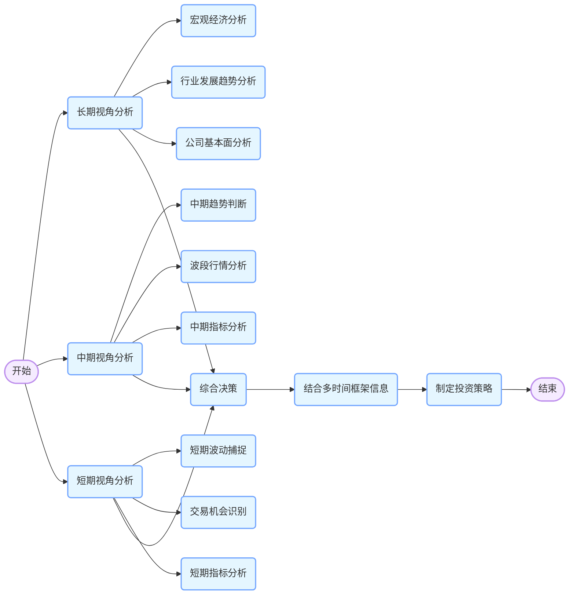

# 多时间框架分析：结合短中长期视角制定投资决策

> 关键词：多时间框架分析、投资决策、短期视角、中期视角、长期视角

> 摘要：本文聚焦于多时间框架分析在投资决策中的应用。通过结合短中长期不同视角，投资者能够更全面、深入地了解市场动态和资产表现。文章详细阐述了多时间框架分析的核心概念、算法原理、数学模型，提供了项目实战案例，分析了实际应用场景，并推荐了相关的工具和资源。最后总结了该方法的未来发展趋势与挑战，旨在帮助投资者运用多时间框架分析制定更为科学、合理的投资决策。

## 1. 背景介绍 
### 1.1 目的和范围
投资决策是一个复杂的过程，受到众多因素的影响，如市场趋势、宏观经济环境、公司基本面等。单一时间框架的分析往往只能提供片面的信息，容易导致投资者做出错误的决策。多时间框架分析的目的在于结合短中长期不同视角，综合考虑各种因素，为投资者提供更全面、准确的市场信息，从而制定出更为科学、合理的投资决策。

本文的范围涵盖了多时间框架分析的基本概念、核心算法原理、数学模型、实际应用场景以及相关工具和资源推荐等方面。通过理论与实践相结合的方式，帮助读者深入理解多时间框架分析的方法和应用。

### 1.2 预期读者
本文预期读者包括各类投资者，如个人投资者、机构投资者等，以及对投资分析方法感兴趣的金融从业者、学生等。无论是初涉投资领域的新手，还是有一定投资经验的专业人士，都能从本文中获得有关多时间框架分析的有益信息。

### 1.3 文档结构概述
本文将按照以下结构进行阐述：首先介绍多时间框架分析的核心概念与联系，包括其原理和架构；接着详细讲解核心算法原理及具体操作步骤，并给出相应的 Python 源代码；然后介绍相关的数学模型和公式，并举例说明；通过项目实战案例，展示多时间框架分析在实际投资中的应用；分析多时间框架分析的实际应用场景；推荐相关的工具和资源；总结多时间框架分析的未来发展趋势与挑战；提供常见问题与解答；最后列出扩展阅读和参考资料。

### 1.4 术语表
#### 1.4.1 核心术语定义
- **多时间框架分析**：指同时运用短、中、长三种不同时间周期的数据分析方法，对投资标的进行全面、综合的分析，以制定投资决策。
- **短期视角**：通常指时间周期较短的分析视角，如日线、小时线等，用于捕捉市场的短期波动和交易机会。
- **中期视角**：时间周期介于短期和长期之间，如周线、月线等，有助于把握市场的中期趋势和波段行情。
- **长期视角**：时间周期较长，如季线、年线等，用于分析市场的长期发展趋势和基本面情况。

#### 1.4.2 相关概念解释
- **趋势分析**：通过对不同时间框架下的价格走势进行分析，判断市场的上涨、下跌或盘整趋势。
- **指标分析**：运用各种技术指标，如移动平均线、相对强弱指标（RSI）等，辅助判断市场的买卖信号和趋势强度。
- **基本面分析**：从宏观经济、行业发展、公司财务等方面分析投资标的的内在价值和发展前景。

#### 1.4.3 缩略词列表
- **RSI**：相对强弱指标（Relative Strength Index）
- **MA**：移动平均线（Moving Average）

## 2. 核心概念与联系 
多时间框架分析的核心思想是将不同时间周期的市场信息进行整合，从而更全面地了解市场的运行规律。不同时间框架下的市场表现反映了不同参与者的行为和市场力量的变化。短期视角主要反映了市场的短期波动和交易情绪，中期视角体现了市场的中期趋势和波段行情，长期视角则反映了市场的长期发展趋势和基本面情况。

### 核心概念原理
多时间框架分析的原理基于市场的层次性和周期性。市场在不同时间尺度上呈现出不同的特征和规律，通过对多个时间框架的分析，可以更清晰地识别市场的主要趋势和次要波动。例如，在长期上涨趋势中，中期可能会出现回调，而短期则可能存在更多的波动和交易机会。通过结合不同时间框架的分析，投资者可以在把握长期趋势的基础上，更好地利用中期和短期的波动进行投资操作。

### 架构的文本示意图
```plaintext
多时间框架分析架构
|-- 长期视角分析
|   |-- 宏观经济分析
|   |-- 行业发展趋势分析
|   |-- 公司基本面分析
|-- 中期视角分析
|   |-- 中期趋势判断
|   |-- 波段行情分析
|   |-- 中期指标分析
|-- 短期视角分析
|   |-- 短期波动捕捉
|   |-- 交易机会识别
|   |-- 短期指标分析
|-- 综合决策
|   |-- 结合多时间框架信息
|   |-- 制定投资策略
```

### Mermaid 流程图


## 3. 核心算法原理 & 具体操作步骤 
### 核心算法原理
多时间框架分析的核心算法主要涉及趋势分析和指标分析。趋势分析通过对不同时间框架下的价格数据进行处理，判断市场的趋势方向；指标分析则运用各种技术指标，如移动平均线、相对强弱指标等，辅助判断市场的买卖信号和趋势强度。

#### 移动平均线（MA）
移动平均线是一种常用的趋势分析工具，它通过计算一定时间周期内的平均价格，平滑价格波动，从而更清晰地显示市场的趋势。计算公式如下：
$$MA_n = \frac{\sum_{i=0}^{n-1} P_{t-i}}{n}$$
其中，$MA_n$ 表示 $n$ 期移动平均线，$P_{t-i}$ 表示第 $t-i$ 期的价格，$n$ 表示计算周期。

#### 相对强弱指标（RSI）
相对强弱指标用于衡量市场的买卖力量对比，判断市场的超买和超卖情况。计算公式如下：
$$RSI = 100 - \frac{100}{1 + RS}$$
其中，$RS$ 表示相对强度，计算公式为：
$$RS = \frac{\text{平均上涨幅度}}{\text{平均下跌幅度}}$$

### 具体操作步骤
#### 步骤 1：选择时间框架
根据投资目标和风险偏好，选择合适的短、中、长三个时间框架。例如，短期可以选择日线，中期选择周线，长期选择月线。

#### 步骤 2：收集数据
收集所选时间框架下的价格数据，包括开盘价、收盘价、最高价、最低价等。

#### 步骤 3：进行趋势分析
分别对不同时间框架下的价格数据计算移动平均线，判断市场的趋势方向。例如，当短期移动平均线向上穿过中期移动平均线时，可能表示短期趋势向上；当长期移动平均线呈上升趋势时，可能表示长期趋势向好。

#### 步骤 4：进行指标分析
运用相对强弱指标等技术指标，辅助判断市场的买卖信号和趋势强度。例如，当 RSI 指标超过 70 时，可能表示市场处于超买状态；当 RSI 指标低于 30 时，可能表示市场处于超卖状态。

#### 步骤 5：综合决策
结合不同时间框架的趋势分析和指标分析结果，制定投资决策。例如，如果长期趋势向好，中期趋势向上，短期出现超卖信号，则可以考虑买入；如果长期趋势向下，中期趋势向下，短期出现超买信号，则可以考虑卖出。

### Python 源代码实现
```python
import pandas as pd
import numpy as np
import matplotlib.pyplot as plt

# 模拟价格数据
np.random.seed(0)
dates = pd.date_range(start='2020-01-01', periods=365, freq='D')
prices = np.random.randn(365).cumsum() + 100
data = pd.DataFrame({'Close': prices}, index=dates)

# 计算不同时间框架的移动平均线
short_window = 5
medium_window = 20
long_window = 60

data['Short_MA'] = data['Close'].rolling(window=short_window).mean()
data['Medium_MA'] = data['Close'].rolling(window=medium_window).mean()
data['Long_MA'] = data['Close'].rolling(window=long_window).mean()

# 计算相对强弱指标（RSI）
delta = data['Close'].diff()
up = delta.clip(lower=0)
down = -delta.clip(upper=0)
avg_up = up.rolling(window=14).mean()
avg_down = down.rolling(window=14).mean()
rs = avg_up / avg_down
data['RSI'] = 100 - (100 / (1 + rs))

# 绘制图表
plt.figure(figsize=(12, 8))
plt.subplot(2, 1, 1)
plt.plot(data['Close'], label='Close Price')
plt.plot(data['Short_MA'], label=f'{short_window}-day MA')
plt.plot(data['Medium_MA'], label=f'{medium_window}-day MA')
plt.plot(data['Long_MA'], label=f'{long_window}-day MA')
plt.title('Price and Moving Averages')
plt.legend()

plt.subplot(2, 1, 2)
plt.plot(data['RSI'], label='RSI')
plt.axhline(y=70, color='r', linestyle='--', label='Overbought')
plt.axhline(y=30, color='g', linestyle='--', label='Oversold')
plt.title('Relative Strength Index (RSI)')
plt.legend()

plt.tight_layout()
plt.show()
```

## 4. 数学模型和公式 & 详细讲解 & 举例说明 
### 移动平均线（MA）
#### 公式
$$MA_n = \frac{\sum_{i=0}^{n-1} P_{t-i}}{n}$$
#### 详细讲解
移动平均线是一种平滑价格数据的方法，通过计算一定时间周期内的平均价格，消除价格的短期波动，更清晰地显示市场的趋势。$n$ 表示计算周期，周期越长，移动平均线越平滑，对价格的反应越滞后；周期越短，移动平均线越敏感，对价格的反应越及时。

#### 举例说明
假设我们有以下 10 天的收盘价数据：$[10, 12, 11, 13, 14, 15, 16, 17, 18, 19]$。如果我们计算 5 天移动平均线，那么第一天的 5 天移动平均线无法计算，因为数据不足；第二天到第四天同样无法计算；从第五天开始，计算方法如下：
- 第五天的 5 天移动平均线：$MA_5 = \frac{10 + 12 + 11 + 13 + 14}{5} = 12$
- 第六天的 5 天移动平均线：$MA_5 = \frac{12 + 11 + 13 + 14 + 15}{5} = 13$
- 以此类推

### 相对强弱指标（RSI）
#### 公式
$$RSI = 100 - \frac{100}{1 + RS}$$
其中，$RS = \frac{\text{平均上涨幅度}}{\text{平均下跌幅度}}$
#### 详细讲解
相对强弱指标用于衡量市场的买卖力量对比，取值范围在 0 到 100 之间。当 RSI 指标超过 70 时，通常表示市场处于超买状态，意味着市场上涨过度，可能会出现回调；当 RSI 指标低于 30 时，通常表示市场处于超卖状态，意味着市场下跌过度，可能会出现反弹。

#### 举例说明
假设我们有以下 14 天的收盘价数据：$[100, 102, 101, 103, 105, 104, 106, 108, 107, 109, 110, 108, 106, 104]$。首先计算每天的价格变化：
- $\Delta P_1 = 102 - 100 = 2$
- $\Delta P_2 = 101 - 102 = -1$
- 以此类推

然后将价格变化分为上涨和下跌两部分：
- 上涨幅度：$[2, 2, 2, 2, 2, 2]$
- 下跌幅度：$[1, 1, 2, 2]$

计算平均上涨幅度和平均下跌幅度：
- 平均上涨幅度：$\frac{2 + 2 + 2 + 2 + 2 + 2}{6} = 2$
- 平均下跌幅度：$\frac{1 + 1 + 2 + 2}{4} = 1.5$

计算相对强度：
$RS = \frac{2}{1.5} = \frac{4}{3}$

计算 RSI 指标：
$RSI = 100 - \frac{100}{1 + \frac{4}{3}} = 100 - \frac{100}{\frac{7}{3}} = 100 - \frac{300}{7} \approx 57.14$

## 5. 项目实战：代码实际案例和详细解释说明 
### 5.1  开发环境搭建
#### 安装 Python
首先需要安装 Python 环境，建议使用 Python 3.7 及以上版本。可以从 Python 官方网站（https://www.python.org/downloads/）下载安装包，按照安装向导进行安装。

#### 安装必要的库
在项目中，我们需要使用以下库：
- `pandas`：用于数据处理和分析
- `numpy`：用于数值计算
- `matplotlib`：用于数据可视化

可以使用以下命令安装这些库：
```sh
pip install pandas numpy matplotlib
```

### 5.2  源代码详细实现和代码解读
```python
import pandas as pd
import numpy as np
import matplotlib.pyplot as plt

# 模拟价格数据
np.random.seed(0)
dates = pd.date_range(start='2020-01-01', periods=365, freq='D')
prices = np.random.randn(365).cumsum() + 100
data = pd.DataFrame({'Close': prices}, index=dates)

# 计算不同时间框架的移动平均线
short_window = 5
medium_window = 20
long_window = 60

data['Short_MA'] = data['Close'].rolling(window=short_window).mean()
data['Medium_MA'] = data['Close'].rolling(window=medium_window).mean()
data['Long_MA'] = data['Close'].rolling(window=long_window).mean()

# 计算相对强弱指标（RSI）
delta = data['Close'].diff()
up = delta.clip(lower=0)
down = -delta.clip(upper=0)
avg_up = up.rolling(window=14).mean()
avg_down = down.rolling(window=14).mean()
rs = avg_up / avg_down
data['RSI'] = 100 - (100 / (1 + rs))

# 绘制图表
plt.figure(figsize=(12, 8))
plt.subplot(2, 1, 1)
plt.plot(data['Close'], label='Close Price')
plt.plot(data['Short_MA'], label=f'{short_window}-day MA')
plt.plot(data['Medium_MA'], label=f'{medium_window}-day MA')
plt.plot(data['Long_MA'], label=f'{long_window}-day MA')
plt.title('Price and Moving Averages')
plt.legend()

plt.subplot(2, 1, 2)
plt.plot(data['RSI'], label='RSI')
plt.axhline(y=70, color='r', linestyle='--', label='Overbought')
plt.axhline(y=30, color='g', linestyle='--', label='Oversold')
plt.title('Relative Strength Index (RSI)')
plt.legend()

plt.tight_layout()
plt.show()
```

#### 代码解读
1. **数据模拟**：
    - 使用 `np.random.seed(0)` 确保随机数的可重复性。
    - `pd.date_range` 生成日期序列。
    - `np.random.randn(365).cumsum() + 100` 生成模拟的收盘价数据。
    - `pd.DataFrame` 将日期和收盘价数据组合成一个数据框。

2. **移动平均线计算**：
    - `rolling(window=short_window).mean()` 计算短期移动平均线。
    - 同理计算中期和长期移动平均线。

3. **相对强弱指标计算**：
    - `diff()` 计算价格的变化。
    - `clip(lower=0)` 和 `-delta.clip(upper=0)` 分别提取上涨和下跌幅度。
    - `rolling(window=14).mean()` 计算平均上涨幅度和平均下跌幅度。
    - 根据公式计算 RSI 指标。

4. **数据可视化**：
    - 使用 `matplotlib` 绘制价格和移动平均线的图表。
    - 绘制 RSI 指标的图表，并添加超买和超卖线。

### 5.3  代码解读与分析
通过上述代码，我们可以得到价格数据、不同时间框架的移动平均线和相对强弱指标，并将它们可视化。从移动平均线的走势可以判断市场的趋势，当短期移动平均线向上穿过中期移动平均线时，可能是买入信号；当短期移动平均线向下穿过中期移动平均线时，可能是卖出信号。从 RSI 指标可以判断市场的超买和超卖情况，当 RSI 指标超过 70 时，可能需要谨慎买入；当 RSI 指标低于 30 时，可能是买入机会。

## 6. 实际应用场景 
### 股票投资
在股票投资中，多时间框架分析可以帮助投资者更全面地了解股票的走势。长期视角可以分析公司的基本面和行业发展趋势，判断股票的长期投资价值；中期视角可以把握股票的波段行情，进行高抛低吸；短期视角可以捕捉股票的短期波动，进行日内交易或短期投机。例如，通过长期分析发现某只股票所在行业前景良好，公司业绩稳定增长；中期分析发现股票处于上升波段；短期分析发现股票出现超卖信号，此时可以考虑买入该股票。

### 期货投资
期货市场波动较大，多时间框架分析对于期货投资尤为重要。长期视角可以分析宏观经济形势和商品供求关系，判断期货品种的长期趋势；中期视角可以把握期货合约的季节性波动和波段行情；短期视角可以根据市场情绪和技术指标进行日内交易。例如，在农产品期货投资中，通过长期分析发现全球气候异常可能导致某农产品减产，价格上涨；中期分析发现该农产品期货合约进入上涨波段；短期分析发现价格回调至支撑位且 RSI 指标超卖，此时可以考虑买入该期货合约。

### 外汇投资
外汇市场 24 小时交易，多时间框架分析可以帮助外汇投资者更好地把握汇率走势。长期视角可以分析各国经济基本面、货币政策和地缘政治因素，判断货币的长期趋势；中期视角可以关注宏观经济数据的发布和市场预期的变化，把握汇率的中期波动；短期视角可以根据技术指标和市场情绪进行短线交易。例如，通过长期分析发现某国经济增长强劲，货币政策收紧，该国货币有望升值；中期分析发现该国即将公布重要经济数据，市场预期数据向好；短期分析发现汇率回调至关键支撑位且 RSI 指标超卖，此时可以考虑买入该国货币。

## 7. 工具和资源推荐
### 7.1 学习资源推荐
#### 7.1.1 书籍推荐
- 《期货市场技术分析》（约翰·墨菲著）：本书是技术分析领域的经典之作，详细介绍了各种技术分析方法和工具，包括多时间框架分析的应用。
- 《聪明的投资者》（本杰明·格雷厄姆著）：价值投资的经典著作，强调投资者应从长期视角分析投资标的，结合多时间框架分析可以更好地进行投资决策。
- 《金融市场技术分析》（墨菲著）：涵盖了股票、期货、外汇等多个金融市场的技术分析方法，对多时间框架分析有深入的讲解。

#### 7.1.2 在线课程
- Coursera 上的“投资学原理”课程：系统介绍了投资学的基本原理和方法，包括多时间框架分析在投资决策中的应用。
- edX 上的“金融市场与投资策略”课程：结合实际案例，讲解了如何运用多时间框架分析制定投资策略。

#### 7.1.3 技术博客和网站
- 雪球网：提供股票、基金等投资领域的资讯和分析，很多投资者会分享自己的多时间框架分析经验和投资策略。
- 汇通网：专注于外汇市场，提供外汇行情分析、技术指标解读等内容，有助于学习外汇市场的多时间框架分析。

### 7.2 开发工具框架推荐
#### 7.2.1 IDE和编辑器
- PyCharm：功能强大的 Python 集成开发环境，提供代码编辑、调试、版本控制等功能，适合进行多时间框架分析的代码开发。
- Jupyter Notebook：交互式的开发环境，支持代码、文本、图表等多种形式的展示，方便进行数据分析和可视化。

#### 7.2.2 调试和性能分析工具
- pdb：Python 自带的调试工具，可以帮助开发者逐行调试代码，查找问题。
- cProfile：Python 内置的性能分析工具，可以分析代码的运行时间和函数调用情况，优化代码性能。

#### 7.2.3 相关框架和库
- `pandas`：用于数据处理和分析，提供了丰富的数据结构和函数，方便处理不同时间框架的价格数据。
- `numpy`：用于数值计算，提供了高效的数组和矩阵运算功能，在多时间框架分析中可用于计算移动平均线、RSI 等指标。
- `matplotlib`：用于数据可视化，可将多时间框架分析的结果以图表的形式直观展示。

### 7.3 相关论文著作推荐
#### 7.3.1 经典论文
- “A New Approach to Technical Analysis: The Use of Multiple Time Frames”：探讨了多时间框架分析在技术分析中的应用，提出了一种新的分析方法和框架。
- “The Impact of Multiple Time Frame Analysis on Investment Decision Making”：研究了多时间框架分析对投资决策的影响，通过实证分析证明了该方法的有效性。

#### 7.3.2 最新研究成果
- 关注顶级金融学术期刊，如《Journal of Finance》《Review of Financial Studies》等，这些期刊会发表关于投资分析方法和市场趋势的最新研究成果。
- 参加金融学术会议，如美国金融协会（AFA）年会等，了解多时间框架分析领域的最新研究动态。

#### 7.3.3 应用案例分析
- 一些金融研究机构和投资公司会发布多时间框架分析的应用案例报告，如高盛、摩根大通等的研究报告，可以从中学习实际应用中的经验和技巧。

## 8. 总结：未来发展趋势与挑战
### 未来发展趋势
- **智能化分析**：随着人工智能和机器学习技术的发展，多时间框架分析将越来越智能化。通过机器学习算法，可以自动识别不同时间框架下的市场模式和趋势，提高分析的准确性和效率。
- **多维度融合**：未来的多时间框架分析将不仅仅局限于价格数据，还会融合更多的维度，如宏观经济数据、社交媒体情绪、新闻资讯等，从而更全面地了解市场动态。
- **个性化定制**：根据投资者的风险偏好、投资目标和交易习惯，提供个性化的多时间框架分析方案，满足不同投资者的需求。

### 挑战
- **数据质量和获取**：多时间框架分析需要大量的历史数据，数据的质量和获取的及时性直接影响分析的结果。如何获取准确、完整、及时的数据是一个挑战。
- **模型复杂度和解释性**：随着分析方法的不断发展，模型的复杂度也在增加。如何在保证模型准确性的同时，提高模型的解释性，让投资者理解分析结果的含义，是一个需要解决的问题。
- **市场不确定性**：金融市场具有高度的不确定性，即使采用多时间框架分析，也不能完全准确地预测市场走势。如何应对市场的不确定性，降低投资风险，是投资者面临的挑战。

## 9. 附录：常见问题与解答
### 问题 1：多时间框架分析适用于所有投资品种吗？
答：多时间框架分析适用于大多数投资品种，包括股票、期货、外汇、基金等。不同投资品种的市场特点和波动规律不同，但多时间框架分析的基本原理是相通的，可以帮助投资者更全面地了解市场走势，制定合理的投资决策。

### 问题 2：如何选择合适的时间框架？
答：选择合适的时间框架需要考虑投资目标、风险偏好和交易周期等因素。一般来说，长期投资可以选择月线、季线等时间框架；中期投资可以选择周线、月线等时间框架；短期投资可以选择日线、小时线等时间框架。投资者可以根据自己的实际情况进行调整。

### 问题 3：多时间框架分析的结果出现矛盾怎么办？
答：当多时间框架分析的结果出现矛盾时，需要综合考虑各种因素，进一步分析矛盾产生的原因。例如，长期趋势向好，但短期出现回调，可能是市场的短期波动导致的。此时，可以结合基本面分析和其他技术指标，判断市场的真实情况，再做出投资决策。

### 问题 4：多时间框架分析需要具备专业的金融知识吗？
答：多时间框架分析需要一定的金融知识和技术分析基础。投资者需要了解基本的金融概念、市场分析方法和技术指标的含义。但随着投资教育的普及和分析工具的不断发展，普通投资者也可以通过学习和实践掌握多时间框架分析的方法。

## 10. 扩展阅读 & 参考资料
### 扩展阅读
- 《交易心理分析》：探讨了投资者的心理因素对投资决策的影响，结合多时间框架分析，可以更好地控制投资情绪，提高投资效果。
- 《金融炼金术》：乔治·索罗斯的著作，介绍了他的投资哲学和方法，对多时间框架分析的应用有一定的启发。

### 参考资料
- 约翰·墨菲. 《期货市场技术分析》. 地震出版社.
- 本杰明·格雷厄姆. 《聪明的投资者》. 人民邮电出版社.
- “A New Approach to Technical Analysis: The Use of Multiple Time Frames”. Journal of Technical Analysis.
- “The Impact of Multiple Time Frame Analysis on Investment Decision Making”. Review of Financial Economics.

作者：AI天才研究院/AI Genius Institute & 禅与计算机程序设计艺术 /Zen And The Art of Computer Programming