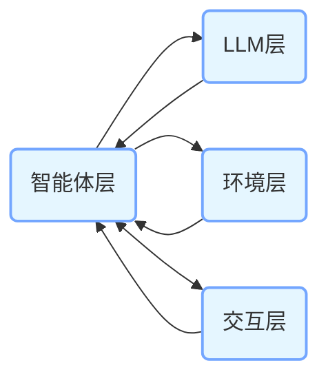

# 多智能体AI Agent：LLM驱动的协作与竞争系统

> 关键词：多智能体AI Agent、大语言模型（LLM）、协作系统、竞争系统、智能体交互

> 摘要：本文聚焦于多智能体AI Agent在大语言模型（LLM）驱动下的协作与竞争系统。首先介绍相关背景知识，包括目的、预期读者、文档结构等内容。接着阐述核心概念及联系，深入剖析其原理与架构，并给出对应的Mermaid流程图。详细讲解核心算法原理，使用Python代码进行具体操作步骤的说明，同时介绍相关数学模型和公式。通过项目实战，展示代码实际案例并进行详细解释。探讨实际应用场景，推荐相关工具和资源。最后总结未来发展趋势与挑战，提供常见问题解答及扩展阅读参考资料，旨在全面深入地介绍多智能体AI Agent在LLM驱动下的协作与竞争系统。

## 1. 背景介绍 
### 1.1 目的和范围
多智能体AI Agent系统是人工智能领域的一个重要研究方向。随着大语言模型（LLM）的发展，其在多智能体系统中的应用为智能体之间的协作与竞争带来了新的机遇和挑战。本文的目的在于深入探讨多智能体AI Agent在LLM驱动下的协作与竞争机制，分析其原理、算法、应用场景等内容。范围涵盖从理论基础到实际应用的多个方面，旨在为研究人员、开发者和相关从业者提供全面的技术参考。

### 1.2 预期读者
本文预期读者包括但不限于人工智能领域的研究人员、计算机科学专业的学生、软件开发者、对多智能体系统和大语言模型感兴趣的技术爱好者等。希望通过本文的介绍，能帮助读者深入理解多智能体AI Agent在LLM驱动下的协作与竞争系统，为他们的研究、学习和开发工作提供有价值的信息。

### 1.3 文档结构概述
本文首先介绍背景知识，让读者对多智能体AI Agent和LLM有初步的了解。接着阐述核心概念与联系，明确相关概念的原理和架构。然后详细讲解核心算法原理及具体操作步骤，结合Python代码进行说明。之后介绍数学模型和公式，并举例说明。通过项目实战展示代码实际案例和详细解释。探讨实际应用场景，推荐相关工具和资源。最后总结未来发展趋势与挑战，提供常见问题解答及扩展阅读参考资料。

### 1.4 术语表
#### 1.4.1 核心术语定义
- **多智能体AI Agent**：是指由多个具有自主决策和行动能力的智能体组成的系统，这些智能体可以在一定的环境中相互交互、协作或竞争。
- **大语言模型（LLM）**：是一种基于深度学习的自然语言处理模型，通过大量文本数据的训练，能够生成自然流畅的文本，理解语言的语义和上下文信息。
- **协作系统**：多智能体之间通过合作、协调等方式共同完成某个任务或目标的系统。
- **竞争系统**：多智能体之间为了争夺资源、利益或优势等而进行竞争的系统。

#### 1.4.2 相关概念解释
- **智能体**：具有感知、决策和行动能力的实体，可以是软件程序、机器人等。智能体能够根据环境的变化和自身的目标做出相应的决策和行动。
- **环境**：智能体所处的外部世界，包括物理环境、信息环境等。环境会影响智能体的感知和行动，智能体的行动也会对环境产生影响。
- **交互**：智能体之间或智能体与环境之间进行信息传递和行动影响的过程。交互可以是直接的（如通信、协作）或间接的（如对环境的改变）。

#### 1.4.3 缩略词列表
- **LLM**：大语言模型（Large Language Model）
- **AI**：人工智能（Artificial Intelligence）

## 2. 核心概念与联系 

### 核心概念原理
多智能体AI Agent系统的核心在于多个智能体的存在和它们之间的交互。每个智能体都有自己的目标、知识和能力，它们在环境中通过感知、决策和行动来实现自己的目标。在LLM驱动下，智能体可以利用大语言模型的语言理解和生成能力来进行更有效的交互和决策。

协作系统中，智能体之间通过共享信息、协调行动等方式来共同完成一个或多个任务。例如，在一个物流配送系统中，多个智能体可以分别负责货物的运输、仓储、调度等任务，它们通过协作来提高物流效率。

竞争系统中，智能体之间为了争夺有限的资源或优势而进行竞争。例如，在一个市场竞争环境中，多个企业智能体可以通过制定不同的策略来争夺市场份额。

### 架构的文本示意图
多智能体AI Agent在LLM驱动下的协作与竞争系统架构可以分为以下几个层次：

1. **智能体层**：包含多个具有不同功能和能力的智能体。每个智能体都有自己的感知模块、决策模块和行动模块。感知模块用于获取环境信息，决策模块根据感知信息和自身目标进行决策，行动模块执行决策结果。
2. **LLM层**：大语言模型为智能体提供语言理解和生成能力。智能体可以将感知信息转化为文本输入到LLM中，LLM根据输入生成相应的决策建议或回复信息，智能体再根据这些信息进行决策和行动。
3. **环境层**：是智能体所处的外部世界，包括物理环境、信息环境等。环境会影响智能体的感知和行动，智能体的行动也会对环境产生影响。
4. **交互层**：负责智能体之间以及智能体与环境之间的交互。交互方式可以包括通信、协作、竞争等。

### Mermaid流程图


## 3. 核心算法原理 & 具体操作步骤 

### 核心算法原理
多智能体AI Agent在LLM驱动下的协作与竞争系统的核心算法主要包括智能体决策算法和交互算法。

#### 智能体决策算法
智能体决策算法的目标是根据智能体的感知信息、自身目标和知识，做出最优的决策。在LLM驱动下，智能体可以将感知信息转化为文本输入到LLM中，LLM根据输入生成相应的决策建议。智能体再根据这些建议和自身的决策规则进行决策。

以下是一个简单的智能体决策算法的Python示例：

```python
import random

# 模拟LLM生成决策建议
def llm_generate_advice(perception_info):
    # 这里只是简单模拟，实际中LLM会根据输入生成更复杂的建议
    advice_list = ["行动A", "行动B", "行动C"]
    return random.choice(advice_list)

# 智能体决策函数
def agent_decision(perception_info, goals, knowledge):
    # 获取LLM生成的决策建议
    advice = llm_generate_advice(perception_info)
    # 这里可以根据自身的决策规则对建议进行处理
    # 简单示例：直接返回建议
    return advice

# 示例使用
perception_info = "环境信息示例"
goals = ["完成任务1", "获取资源"]
knowledge = {"规则1": "如果条件A成立，选择行动A"}
decision = agent_decision(perception_info, goals, knowledge)
print("智能体的决策是：", decision)
```

#### 交互算法
交互算法的目标是实现智能体之间以及智能体与环境之间的有效交互。在协作系统中，交互算法可以包括信息共享、任务分配、协调行动等功能。在竞争系统中，交互算法可以包括策略制定、竞争行为选择等功能。

以下是一个简单的智能体交互算法的Python示例：

```python
# 模拟智能体之间的通信
def agent_communication(agent1, agent2, message):
    print(f"{agent1}向{agent2}发送消息：{message}")
    # 这里可以实现消息的接收和处理逻辑
    return f"{agent2}收到消息：{message}"

# 示例使用
agent1 = "智能体1"
agent2 = "智能体2"
message = "协作完成任务"
response = agent_communication(agent1, agent2, message)
print(response)
```

### 具体操作步骤
1. **初始化智能体和环境**：创建多个智能体，并设置它们的初始状态、目标和知识。同时，初始化环境的状态。
2. **智能体感知环境**：每个智能体通过感知模块获取环境信息。
3. **智能体决策**：智能体将感知信息输入到LLM中，获取决策建议，并根据自身的决策规则做出决策。
4. **智能体行动**：智能体根据决策结果执行相应的行动，行动会对环境产生影响。
5. **智能体交互**：智能体之间进行信息共享、协作或竞争等交互行为。
6. **更新环境状态**：根据智能体的行动和交互结果，更新环境的状态。
7. **重复步骤2 - 6**：直到达到系统的终止条件。

## 4. 数学模型和公式 & 详细讲解 & 举例说明 

### 数学模型
多智能体AI Agent在LLM驱动下的协作与竞争系统可以用马尔可夫决策过程（MDP）和博弈论来进行建模。

#### 马尔可夫决策过程（MDP）
马尔可夫决策过程是一个五元组 $<S, A, P, R, \gamma>$，其中：
- $S$ 是状态空间，表示环境的所有可能状态。
- $A$ 是动作空间，表示智能体的所有可能动作。
- $P(s'|s, a)$ 是状态转移概率，表示在状态 $s$ 下执行动作 $a$ 后转移到状态 $s'$ 的概率。
- $R(s, a, s')$ 是奖励函数，表示在状态 $s$ 下执行动作 $a$ 转移到状态 $s'$ 后获得的奖励。
- $\gamma$ 是折扣因子，用于权衡当前奖励和未来奖励。

智能体的目标是找到一个最优策略 $\pi(s)$，使得长期累积奖励最大化：

$$V^{\pi}(s) = \mathbb{E} \left[ \sum_{t=0}^{\infty} \gamma^t R(s_t, a_t, s_{t+1}) | s_0 = s, a_t = \pi(s_t) \right]$$

其中 $V^{\pi}(s)$ 是策略 $\pi$ 下状态 $s$ 的值函数。

#### 博弈论
博弈论用于建模智能体之间的竞争和协作关系。常见的博弈模型包括囚徒困境、合作博弈等。

以囚徒困境为例，假设有两个智能体 $A$ 和 $B$，每个智能体有两种策略：合作（C）和背叛（D）。收益矩阵如下：

|        | 智能体B合作（C） | 智能体B背叛（D） |
|--------|-----------------|-----------------|
| 智能体A合作（C） | (3, 3)          | (0, 5)          |
| 智能体A背叛（D） | (5, 0)          | (1, 1)          |

在这个博弈中，每个智能体都希望最大化自己的收益。但是，如果两个智能体都选择背叛，最终的收益都不如都选择合作的情况。

### 详细讲解
马尔可夫决策过程适用于单个智能体在环境中进行决策的情况。智能体通过不断地感知环境状态，选择动作，根据奖励函数获得奖励，最终目标是找到一个最优策略来最大化长期累积奖励。

博弈论适用于多个智能体之间的交互情况。通过建立收益矩阵，可以分析智能体之间的竞争和协作关系，找到纳什均衡等最优策略。

### 举例说明
#### 马尔可夫决策过程示例
假设有一个简单的机器人导航问题。机器人在一个二维网格环境中，状态空间 $S$ 是网格的所有位置，动作空间 $A$ 是机器人可以执行的动作（如向上、向下、向左、向右移动）。状态转移概率 $P(s'|s, a)$ 表示在当前位置 $s$ 执行动作 $a$ 后到达位置 $s'$ 的概率。奖励函数 $R(s, a, s')$ 可以根据机器人是否到达目标位置、是否撞到障碍物等情况来设置。机器人的目标是找到一个最优策略，使得从初始位置到达目标位置的时间最短。

#### 博弈论示例
在一个市场竞争环境中，有两个企业智能体 $A$ 和 $B$。每个企业可以选择降低价格（背叛）或维持价格（合作）。如果两个企业都维持价格，它们可以获得较高的利润；如果一个企业降低价格，另一个企业维持价格，降低价格的企业可以获得更多的市场份额和利润；如果两个企业都降低价格，它们的利润都会降低。通过分析收益矩阵，企业可以制定最优的竞争策略。

## 5. 项目实战：代码实际案例和详细解释说明 

### 5.1  开发环境搭建
- **操作系统**：可以选择Windows、Linux或macOS等主流操作系统。
- **编程语言**：Python，推荐使用Python 3.7及以上版本。
- **开发工具**：可以使用PyCharm、VS Code等集成开发环境。
- **依赖库**：需要安装`transformers`库来使用大语言模型，`numpy`、`pandas`等库用于数据处理。

安装依赖库的命令如下：
```sh
pip install transformers numpy pandas
```

### 5.2  源代码详细实现和代码解读
以下是一个简单的多智能体AI Agent在LLM驱动下的协作与竞争系统的Python代码示例：

```python
import random
from transformers import AutoTokenizer, AutoModelForCausalLM

# 初始化LLM
tokenizer = AutoTokenizer.from_pretrained("gpt2")
model = AutoModelForCausalLM.from_pretrained("gpt2")

# 定义智能体类
class Agent:
    def __init__(self, name, goals):
        self.name = name
        self.goals = goals

    def perceive(self, environment):
        # 简单模拟感知环境信息
        return f"环境信息：{environment}"

    def decision(self, perception_info):
        # 将感知信息输入到LLM中获取决策建议
        input_text = f"{self.name}收到感知信息：{perception_info}，目标是{self.goals}，应该怎么做？"
        input_ids = tokenizer.encode(input_text, return_tensors="pt")
        output = model.generate(input_ids, max_length=50, num_beams=5, no_repeat_ngram_size=2)
        advice = tokenizer.decode(output[0], skip_special_tokens=True)
        # 简单处理建议，提取关键信息
        advice = advice.replace(input_text, "").strip()
        return advice

    def act(self, decision):
        print(f"{self.name}执行决策：{decision}")

# 定义环境类
class Environment:
    def __init__(self):
        self.state = "初始状态"

    def update(self, agent_actions):
        # 简单模拟环境更新
        self.state = f"环境状态更新：{agent_actions}"
        return self.state

# 主函数
def main():
    # 初始化智能体和环境
    agent1 = Agent("智能体1", ["完成任务1", "获取资源"])
    agent2 = Agent("智能体2", ["完成任务2", "获取资源"])
    environment = Environment()

    # 模拟多轮交互
    for _ in range(3):
        # 智能体感知环境
        perception_info1 = agent1.perceive(environment.state)
        perception_info2 = agent2.perceive(environment.state)

        # 智能体决策
        decision1 = agent1.decision(perception_info1)
        decision2 = agent2.decision(perception_info2)

        # 智能体行动
        agent1.act(decision1)
        agent2.act(decision2)

        # 环境更新
        agent_actions = f"{agent1.name}执行{decision1}，{agent2.name}执行{decision2}"
        new_environment_state = environment.update(agent_actions)
        print(f"环境新状态：{new_environment_state}")

if __name__ == "__main__":
    main()
```

### 5.3  代码解读与分析
1. **LLM初始化**：使用`transformers`库加载`gpt2`模型和对应的分词器。
2. **智能体类（`Agent`）**：
    - `__init__`方法：初始化智能体的名称和目标。
    - `perceive`方法：模拟智能体感知环境信息。
    - `decision`方法：将感知信息输入到LLM中，获取决策建议。
    - `act`方法：执行决策。
3. **环境类（`Environment`）**：
    - `__init__`方法：初始化环境的初始状态。
    - `update`方法：根据智能体的行动更新环境状态。
4. **主函数（`main`）**：
    - 初始化智能体和环境。
    - 模拟多轮交互，包括智能体感知环境、决策、行动和环境更新。

通过这个代码示例，可以看到多智能体AI Agent在LLM驱动下的协作与竞争系统的基本工作流程。

## 6. 实际应用场景 
### 物流配送系统
在物流配送系统中，多个智能体可以分别负责货物的运输、仓储、调度等任务。通过协作，它们可以优化