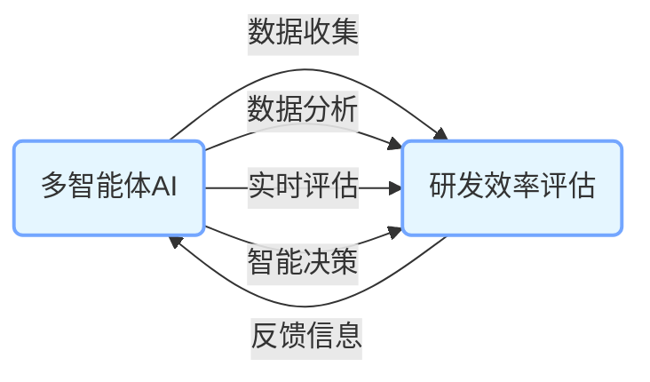

# 多智能体AI如何优化研发效率评估流程

> 关键词：多智能体AI、研发效率评估、流程优化、人工智能、软件开发

> 摘要：本文聚焦于多智能体AI在优化研发效率评估流程方面的应用。首先介绍了多智能体AI和研发效率评估的背景知识，包括目的、预期读者和文档结构等。接着深入阐述了多智能体AI和研发效率评估的核心概念及它们之间的联系，并通过Mermaid流程图展示架构。详细讲解了相关核心算法原理，给出Python源代码示例。分析了其中涉及的数学模型和公式，并举例说明。通过项目实战展示了如何在实际中利用多智能体AI优化研发效率评估流程，包括开发环境搭建、源代码实现与解读。探讨了该技术在不同实际场景中的应用，推荐了学习资源、开发工具框架以及相关论文著作。最后总结了未来发展趋势与挑战，解答了常见问题，并提供了扩展阅读和参考资料，旨在为研发团队和相关技术人员提供全面的技术指导，以更好地利用多智能体AI提升研发效率评估的准确性和效率。

## 1. 背景介绍 
### 1.1 目的和范围
在当今竞争激烈的科技领域，研发效率对于企业的成功至关重要。准确评估研发效率能够帮助企业合理分配资源、及时发现问题并做出改进决策。传统的研发效率评估方法往往存在主观性强、数据收集不全面、评估周期长等问题。多智能体AI作为一种新兴的技术，具有自主学习、协同工作和适应复杂环境的能力，有望为研发效率评估流程带来新的优化思路。

本文的范围涵盖了多智能体AI的基本概念、研发效率评估的基本流程，以及如何利用多智能体AI对研发效率评估流程进行优化。将从理论原理、算法实现、实际案例等多个角度进行深入探讨，旨在为研发团队和相关技术人员提供全面的技术指导。

### 1.2 预期读者
本文预期读者主要包括以下几类人群：
- 软件开发团队的管理人员和技术负责人，他们需要了解如何利用先进技术提升团队的研发效率评估水平，以便更好地管理团队和做出决策。
- 人工智能领域的研究人员和开发者，对多智能体AI在实际应用中的探索感兴趣，希望通过本文了解其在研发效率评估方面的应用场景和技术细节。
- 计算机科学相关专业的学生，希望通过阅读本文拓宽知识面，了解多智能体AI和研发效率评估的相关知识，为未来的学习和研究打下基础。

### 1.3 文档结构概述
本文将按照以下结构进行组织：
- 核心概念与联系：介绍多智能体AI和研发效率评估的核心概念，以及它们之间的联系，并通过文本示意图和Mermaid流程图展示架构。
- 核心算法原理 & 具体操作步骤：详细讲解多智能体AI在优化研发效率评估流程中所涉及的核心算法原理，并给出Python源代码示例。
- 数学模型和公式 & 详细讲解 & 举例说明：分析其中涉及的数学模型和公式，并通过具体例子进行说明。
- 项目实战：代码实际案例和详细解释说明：通过一个实际项目案例，展示如何利用多智能体AI优化研发效率评估流程，包括开发环境搭建、源代码实现与解读。
- 实际应用场景：探讨多智能体AI在不同实际场景中的应用。
- 工具和资源推荐：推荐学习资源、开发工具框架以及相关论文著作。
- 总结：未来发展趋势与挑战：总结多智能体AI在优化研发效率评估流程方面的未来发展趋势和面临的挑战。
- 附录：常见问题与解答：解答读者在阅读过程中可能遇到的常见问题。
- 扩展阅读 & 参考资料：提供相关的扩展阅读材料和参考资料，方便读者进一步深入学习。

### 1.4 术语表
#### 1.4.1 核心术语定义
- **多智能体AI（Multi-Agent AI）**：由多个智能体组成的人工智能系统，每个智能体具有一定的自主决策能力和学习能力，它们之间可以通过通信和协作来完成复杂的任务。
- **研发效率评估（R&D Efficiency Evaluation）**：对研发过程中资源的利用效率、任务完成的速度和质量等方面进行评估的过程，旨在衡量研发团队的工作绩效和研发活动的效果。
- **智能体（Agent）**：在多智能体AI中，智能体是一个具有感知、决策和行动能力的实体，它可以根据自身的状态和环境信息做出决策并采取相应的行动。

#### 1.4.2 相关概念解释
- **自主学习（Autonomous Learning）**：智能体能够通过与环境的交互自动获取知识和技能，不断改进自己的决策和行为。
- **协同工作（Collaborative Work）**：多个智能体之间通过信息共享和协调合作，共同完成一个或多个任务。
- **环境感知（Environmental Perception）**：智能体能够感知周围环境的状态和变化，以便做出相应的决策。

#### 1.4.3 缩略词列表
- **AI**：Artificial Intelligence，人工智能
- **R&D**：Research and Development，研究与开发

## 2. 核心概念与联系 

### 多智能体AI核心概念
多智能体AI是一种复杂的人工智能系统，它由多个智能体组成。每个智能体可以看作是一个独立的个体，具有自己的目标、知识和能力。智能体之间通过通信机制进行信息交流和协作，以实现共同的或各自的目标。

例如，在一个物流配送系统中，每个配送车辆可以看作是一个智能体。每个车辆智能体需要根据自己的位置、货物信息和交通状况等因素做出决策，如选择最佳的配送路线。同时，车辆智能体之间还需要进行协作，如避免路线冲突、共享交通信息等。

### 研发效率评估核心概念
研发效率评估是对研发过程进行全面、客观评价的过程。它涉及到多个方面的指标，如研发周期、资源利用率、产品质量等。通过对这些指标的分析，可以了解研发团队的工作绩效和研发活动的效果，为企业的决策提供依据。

例如，在软件开发项目中，研发效率评估可以包括代码编写的速度、代码的质量（如代码的复杂度、可读性等）、测试用例的执行情况等指标。通过对这些指标的评估，可以发现研发过程中存在的问题，如开发人员的技术水平不足、项目管理不善等，并及时采取措施进行改进。

### 两者之间的联系
多智能体AI可以为研发效率评估提供更高效、准确的方法。具体来说，多智能体AI可以在以下几个方面优化研发效率评估流程：
- **数据收集**：智能体可以自动收集研发过程中的各种数据，如代码提交记录、测试结果、项目进度等。这些数据可以为研发效率评估提供更全面、准确的依据。
- **数据分析**：多智能体AI可以通过机器学习和数据分析算法对收集到的数据进行分析，提取有价值的信息。例如，可以通过分析代码提交记录来评估开发人员的工作效率，通过分析测试结果来评估产品的质量。
- **实时评估**：智能体可以实时监测研发过程的状态，及时发现问题并进行评估。例如，当项目进度出现延迟时，智能体可以及时发出警报，并对延迟的原因进行分析。
- **智能决策**：多智能体AI可以根据评估结果为研发团队提供智能决策建议。例如，当发现某个开发人员的工作效率较低时，智能体可以建议对该开发人员进行培训或调整其工作任务。

### 文本示意图
```plaintext
多智能体AI
├── 智能体1
│   ├── 环境感知
│   ├── 决策制定
│   └── 行动执行
├── 智能体2
│   ├── 环境感知
│   ├── 决策制定
│   └── 行动执行
└──...

研发效率评估
├── 数据收集
│   ├── 代码提交记录
│   ├── 测试结果
│   └── 项目进度
├── 数据分析
│   ├── 机器学习算法
│   └── 数据分析工具
└── 评估结果
    ├── 研发效率指标
    └── 决策建议

多智能体AI与研发效率评估的联系
├── 多智能体AI辅助数据收集
├── 多智能体AI进行数据分析
├── 多智能体AI实现实时评估
└── 多智能体AI提供智能决策
```

### Mermaid流程图


## 3. 核心算法原理 & 具体操作步骤 

### 核心算法原理

#### 强化学习算法
强化学习是多智能体AI中常用的算法之一，它可以让智能体通过与环境的交互不断学习最优的决策策略。在研发效率评估中，强化学习可以用于优化数据收集和分析的过程。

强化学习的基本原理是智能体在环境中采取行动，环境会根据智能体的行动给予相应的奖励或惩罚。智能体的目标是通过不断尝试不同的行动，最大化累积奖励。

例如，在数据收集过程中，智能体可以根据不同的数据源和收集策略，获得不同的奖励。如果收集到的数据对研发效率评估有重要价值，则给予较高的奖励；如果收集到的数据质量较低或没有价值，则给予较低的奖励。智能体通过不断学习，逐渐找到最优的数据收集策略。

#### 机器学习分类算法
机器学习分类算法可以用于对研发过程中的数据进行分类和分析。例如，可以使用决策树、支持向量机等算法对代码提交记录进行分类，判断开发人员的工作效率是高、中还是低。

分类算法的基本原理是根据已知的训练数据，构建一个分类模型。当有新的数据输入时，模型可以根据数据的特征将其分类到不同的类别中。

### 具体操作步骤

#### 步骤1：数据收集
智能体通过与研发过程中的各种数据源进行交互，收集相关的数据。数据源可以包括代码仓库、测试管理工具、项目管理系统等。

以下是一个简单的Python代码示例，用于从代码仓库中收集代码提交记录：
```python
import git

# 克隆代码仓库
repo = git.Repo.clone_from('https://github.com/example/repo.git', 'local_repo')

# 获取所有提交记录
commits = list(repo.iter_commits())

# 打印提交记录信息
for commit in commits:
    print(f"Commit ID: {commit.hexsha}")
    print(f"Author: {commit.author}")
    print(f"Message: {commit.message}")
    print(f"Date: {commit.committed_datetime}")
    print("-" * 50)
```

#### 步骤2：数据预处理
收集到的数据可能存在噪声、缺失值等问题，需要进行预处理。预处理的步骤包括数据清洗、特征提取、数据归一化等。

以下是一个简单的Python代码示例，用于对代码提交记录进行数据清洗和特征提取：
```python
import pandas as pd

# 将提交记录转换为DataFrame
data = []
for commit in commits:
    data.append({
        'commit_id': commit.hexsha,
        'author': commit.author.name,
        'message': commit.message,
        'date': commit.committed_datetime
    })
df = pd.DataFrame(data)

# 数据清洗：去除缺失值
df = df.dropna()

# 特征提取：提取提交日期的年份和月份
df['year'] = df['date'].dt.year
df['month'] = df['date'].dt.month

print(df.head())
```

#### 步骤3：数据分析
使用机器学习算法对预处理后的数据进行分析。例如，可以使用决策树算法对开发人员的工作效率进行分类。

以下是一个简单的Python代码示例，使用决策树算法进行分类：
```python
from sklearn.tree import DecisionTreeClassifier
from sklearn.model_selection import train_test_split
from sklearn.metrics import accuracy_score

# 选择特征和目标变量
X = df[['year', 'month']]
y = df['author']

# 划分训练集和测试集
X_train, X_test, y_train, y_test = train_test_split(X, y, test_size=0.2, random_state=42)

# 创建决策树分类器
clf = DecisionTreeClassifier()

# 训练模型
clf.fit(X_train, y_train)

# 预测测试集
y_pred = clf.predict(X_test)

# 计算准确率
accuracy = accuracy_score(y_test, y_pred)
print(f"Accuracy: {accuracy}")
```

#### 步骤4：评估结果反馈
将数据分析的结果反馈给研发团队，为团队提供决策建议。例如，如果发现某个开发人员在某个时间段内的工作效率较低，可以建议对该开发人员进行培训或调整其工作任务。

## 4. 数学模型和公式 & 详细讲解 & 举例说明 

### 强化学习中的数学模型和公式

#### 马尔可夫决策过程（MDP）
强化学习通常可以用马尔可夫决策过程（MDP）来描述。MDP是一个五元组 $(S, A, P, R, \gamma)$，其中：
- $S$ 是状态空间，表示智能体所处的所有可能状态。
- $A$ 是动作空间，表示智能体可以采取的所有可能动作。
- $P$ 是状态转移概率函数，表示在状态 $s$ 采取动作 $a$ 后转移到状态 $s'$ 的概率，即 $P(s'|s, a)$。
- $R$ 是奖励函数，表示在状态 $s$ 采取动作 $a$ 后获得的即时奖励，即 $R(s, a)$。
- $\gamma$ 是折扣因子，用于衡量未来奖励的重要性，取值范围为 $[0, 1]$。

智能体的目标是找到一个最优的策略 $\pi(s)$，使得累积折扣奖励最大化。累积折扣奖励可以表示为：
$$G_t = \sum_{k=0}^{\infty} \gamma^k R_{t+k+1}$$
其中，$t$ 是当前时间步，$R_{t+k+1}$ 是在时间步 $t + k + 1$ 获得的奖励。

#### Q-学习算法
Q-学习是一种无模型的强化学习算法，用于估计状态-动作对的价值 $Q(s, a)$。Q-学习的更新公式为：
$$Q(s_t, a_t) \leftarrow Q(s_t, a_t) + \alpha [R_{t+1} + \gamma \max_{a} Q(s_{t+1}, a) - Q(s_t, a_t)]$$
其中，$\alpha$ 是学习率，用于控制每次更新的步长。

### 详细讲解
在研发效率评估中，我们可以将状态 $s$ 定义为研发过程中的各种状态，如项目进度、代码质量等；将动作 $a$ 定义为数据收集和分析的策略，如选择不同的数据源、使用不同的算法等。奖励 $R$ 可以根据数据的质量和对评估的价值来定义。

智能体通过不断与环境交互，根据当前状态 $s$ 选择动作 $a$，获得奖励 $R$ 并转移到下一个状态 $s'$。然后，使用Q-学习算法更新 $Q$ 值，逐渐找到最优的策略。

### 举例说明
假设我们要评估一个软件开发项目的研发效率，状态 $s$ 可以表示为项目的进度（如已完成的功能模块数）和代码的质量（如代码的缺陷率）。动作 $a$ 可以表示为选择不同的数据源进行数据收集，如代码仓库、测试管理工具等。

奖励 $R$ 可以根据收集到的数据对评估的价值来定义。例如，如果收集到的数据能够准确反映项目的进度和代码的质量，则给予较高的奖励；如果收集到的数据质量较低或没有价值，则给予较低的奖励。

智能体从初始状态开始，根据当前的 $Q$ 值选择动作，执行动作后获得奖励并转移到下一个状态。然后，使用Q-学习算法更新 $Q$ 值。经过多次迭代，智能体逐渐找到最优的动作策略，即最优的数据收集和分析策略。

## 5. 项目实战：代码实际案例和详细解释说明 

### 5.1  开发环境搭建
在进行项目实战之前，需要搭建相应的开发环境。以下是具体的步骤：

#### 安装Python
Python是一种广泛使用的编程语言，许多机器学习和人工智能库都支持Python。可以从Python官方网站（https://www.python.org/downloads/）下载并安装Python。

#### 安装必要的库
在本项目中，需要使用以下几个Python库：
- `gitpython`：用于与Git代码仓库进行交互。
- `pandas`：用于数据处理和分析。
- `scikit-learn`：用于机器学习算法的实现。

可以使用以下命令安装这些库：
```sh
pip install gitpython pandas scikit-learn
```

### 5.2  源代码详细实现和代码解读

#### 数据收集模块
```python
import git
import pandas as pd

def collect_commit_data(repo_url, local_path):
    # 克隆代码仓库
    repo = git.Repo.clone_from(repo_url, local_path)
    
    # 获取所有提交记录
    commits = list(repo.iter_commits())
    
    # 将提交记录转换为DataFrame
    data = []
    for commit in commits:
        data.append({
            'commit_id': commit.hexsha,
            'author': commit.author.name,
            'message': commit.message,
            'date': commit.committed_datetime
        })
    df = pd.DataFrame(data)
    
    return df

# 示例使用
repo_url = 'https://github.com/example/repo.git'
local_path = 'local_repo'
commit_data = collect_commit_data(repo_url, local_path)
print(commit_data.head())
```
**代码解读**：
- `collect_commit_data` 函数接受代码仓库的URL和本地存储路径作为参数，使用 `gitpython` 库克隆代码仓库，并获取所有的提交记录。
- 将提交记录转换为 `pandas` 的 `DataFrame` 格式，方便后续的数据处理和分析。

#### 数据预处理模块
```python
def preprocess_data(df):
    # 数据清洗：去除缺失值
    df = df.dropna()
    
    # 特征提取：提取提交日期的年份和月份
    df['year'] = df['date'].dt.year
    df['month'] = df['date'].dt.month
    
    return df

# 示例使用
preprocessed_data = preprocess_data(commit_data)
print(preprocessed_data.head())
```
**代码解读**：
- `preprocess_data` 函数接受一个 `DataFrame` 作为输入，对数据进行清洗，去除缺失值。
- 提取提交日期的年份和月份作为新的特征，方便后续的数据分析。

#### 数据分析模块
```python
from sklearn.tree import DecisionTreeClassifier
from sklearn.model_selection import train_test_split
from sklearn.metrics import accuracy_score

def analyze_data(df):
    # 选择特征和目标变量
    X = df[['year', 'month']]
    y = df['author']
    
    # 划分训练集和测试集
    X_train, X_test, y_train, y_test = train_test_split(X, y, test_size=0.2, random_state=42)
    
    # 创建决策树分类器
    clf = DecisionTreeClassifier()
    
    # 训练模型
    clf.fit(X_train, y_train)
    
    # 预测测试集
    y_pred = clf.predict(X_test)
    
    # 计算准确率
    accuracy = accuracy_score(y_test, y_pred)
    
    return accuracy

# 示例使用
accuracy = analyze_data(preprocessed_data)
print(f"Accuracy: {accuracy}")
```
**代码解读**：
- `analyze_data` 函数接受一个 `DataFrame` 作为输入，选择提交日期的年份和月份作为特征，开发人员的姓名作为目标变量。
- 使用 `train_test_split` 函数将数据划分为训练集和测试集。
- 创建决策树分类器，并使用训练集进行训练。
- 使用训练好的模型对测试集进行预测，并计算预测的准确率。

### 5.3  代码解读与分析
通过以上代码，我们实现了一个简单的研发效率评估流程。首先，使用 `gitpython` 库从代码仓库中收集提交记录；然后，使用 `pandas` 库对数据进行预处理；最后，使用 `scikit-learn` 库中的决策树算法对数据进行分析。

在实际应用中，可以根据具体的需求对代码进行扩展和优化。例如，可以增加更多的数据源，如测试结果、项目进度等；可以使用更复杂的机器学习算法，如神经网络、随机森林等。

## 6. 实际应用场景 
### 软件开发项目
在软件开发项目中，多智能体AI可以用于优化研发效率评估流程。例如，智能体可以实时监测开发人员的代码提交情况，分析代码的质量和复杂度，评估开发人员的工作效率。同时，智能体还可以根据项目的进度和资源使用情况，提供智能决策建议，如调整开发计划、分配资源等。

### 硬件研发项目
在硬件研发项目中，多智能体AI可以用于监测实验数据、分析产品性能、评估研发进度等。例如，智能体可以自动收集实验设备的数据，分析数据中的异常情况，及时发现研发过程中的问题。同时，智能体还可以根据产品的性能指标和市场需求，提供产品优化的建议。

### 科研项目
在科研项目中，多智能体AI可以用于评估科研人员的工作效率和科研成果的质量。例如，智能体可以分析科研人员发表的论文数量、引用次数等指标，评估科研人员的学术影响力。同时，智能体还可以根据科研项目的目标和进展情况，提供科研方向的建议。

## 7. 工具和资源推荐
### 7.1 学习资源推荐
#### 7.1.1 书籍推荐
- 《人工智能：一种现代的方法》：这是一本经典的人工智能教材，涵盖了人工智能的各个领域，包括多智能体系统、机器学习、自然语言处理等。
- 《强化学习：原理与Python实现》：详细介绍了强化学习的基本原理和算法，并提供了Python代码示例，适合初学者学习。
- 《Python机器学习》：介绍了Python在机器学习中的应用，包括数据处理、模型选择、算法实现等方面的内容。

#### 7.1.2 在线课程
- Coursera上的“人工智能基础”课程：由知名教授授课，系统地介绍了人工智能的基本概念和技术。
- edX上的“强化学习”课程：深入讲解了强化学习的理论和实践，提供了丰富的案例和实验。
- 网易云课堂上的“Python数据分析与机器学习实战”课程：结合实际案例，介绍了Python在数据分析和机器学习中的应用。

#### 7.1.3 技术博客和网站
- Medium：上面有许多人工智能和机器学习领域的优秀博客文章，涵盖了最新的技术动态和研究成果。
- Towards Data Science：专注于数据科学和机器学习领域，提供了许多高质量的技术文章和教程。
- GitHub：是一个开源代码托管平台，可以在上面找到许多与多智能体AI和研发效率评估相关的开源项目和代码。

### 7.2 开发工具框架推荐
#### 7.2.1 IDE和编辑器
- PyCharm：是一款专门为Python开发设计的集成开发环境，具有代码自动补全、调试、版本控制等功能，适合开发Python项目。
- Jupyter Notebook：是一个交互式的开发环境，支持多种编程语言，适合进行数据探索和模型实验。
- Visual Studio Code：是一款轻量级的代码编辑器，支持多种编程语言和插件扩展，适合快速开发和调试代码。

#### 7.2.2 调试和性能分析工具
- PySnooper：是一个简单易用的Python调试工具，可以自动记录函数的执行过程和变量的值，方便调试代码。
- cProfile：是Python标准库中的性能分析工具，可以分析代码的运行时间和函数调用次数，帮助优化代码性能。
- TensorBoard：是TensorFlow提供的可视化工具，可以用于可视化训练过程、模型结构等信息，方便调试和优化深度学习模型。

#### 7.2.3 相关框架和库
- OpenAI Gym：是一个用于开发和比较强化学习算法的工具包，提供了许多经典的强化学习环境和基准测试。
- Stable Baselines：是一个基于OpenAI Gym的强化学习库，提供了多种预训练的强化学习算法和模型，方便快速实现和测试强化学习算法。
- Scikit-learn：是一个常用的机器学习库，提供了多种机器学习算法和工具，如分类、回归、聚类等，适合进行数据分析和模型训练。

### 7.3 相关论文著作推荐
#### 7.3.1 经典论文
- “Multi-Agent Systems: A Modern Approach to Distributed Artificial Intelligence”：介绍了多智能体系统的基本概念、理论和应用，是多智能体系统领域的经典论文。
- “Reinforcement Learning: An Introduction”：是强化学习领域的经典著作，详细介绍了强化学习的基本原理和算法。
- “Machine Learning”：由Tom M. Mitchell编写，是机器学习领域的经典教材，涵盖了机器学习的各个方面。

#### 7.3.2 最新研究成果
- 可以关注顶级人工智能会议和期刊上的最新研究成果，如NeurIPS（神经信息处理系统大会）、ICML（国际机器学习会议）、Journal of Artificial Intelligence Research等。
- 许多科研机构和大学也会发布相关的研究报告和论文，可以关注他们的官方网站获取最新信息。

#### 7.3.3 应用案例分析
- 可以参考一些实际应用案例的分析报告，了解多智能体AI在不同领域的应用情况和效果。例如，一些科技公司会在其官方博客或技术分享平台上发布相关的案例分析。

## 8. 总结：未来发展趋势与挑战
### 未来发展趋势
- **更强大的智能体协作**：未来，多智能体AI中的智能体之间将实现更高效、更复杂的协作。智能体可以根据不同的任务和环境，动态地调整协作策略，提高整体的性能和效率。
- **与其他技术的融合**：多智能体AI将与其他技术，如物联网、大数据、区块链等进行深度融合。例如，在物联网环境中，多智能体AI可以实现对大量设备的智能管理和优化；在大数据领域，多智能体AI可以用于数据的挖掘和分析。
- **应用领域的拓展**：多智能体AI将在更多的领域得到应用，如医疗、交通、金融等。例如，在医疗领域，多智能体AI可以用于辅助医生进行诊断和治疗决策；在交通领域，多智能体AI可以用于交通流量的优化和自动驾驶的协同。

### 挑战
- **智能体的自主性和安全性**：随着智能体的自主性不断提高，如何确保智能体的行为符合人类的价值观和安全要求是一个重要的挑战。例如，在自动驾驶领域，智能体需要在复杂的环境中做出决策，如何避免智能体的错误决策导致安全事故是一个亟待解决的问题。
- **通信和协调问题**：在多智能体系统中，智能体之间的通信和协调是一个关键问题。如何设计高效的通信协议和协调机制，确保智能体之间能够及时、准确地交换信息，是提高多智能体系统性能的关键。
- **数据隐私和安全**：多智能体AI需要处理大量的数据，如何保护数据的隐私和安全是一个重要的挑战。例如，在医疗领域，智能体需要处理患者的敏感信息，如何确保这些信息不被泄露是一个需要解决的问题。

## 9. 附录：常见问题与解答
### 问题1：多智能体AI与传统人工智能有什么区别？
答：传统人工智能通常是单个智能体的系统，而多智能体AI由多个智能体组成。多智能体AI中的智能体之间可以进行通信和协作，共同完成复杂的任务。相比传统人工智能，多智能体AI具有更强的适应性和灵活性，能够处理更复杂的问题。

### 问题2：多智能体AI在研发效率评估中的应用有哪些局限性？
答：多智能体AI在研发效率评估中的应用存在一些局限性。例如，智能体的决策可能受到数据质量和模型准确性的影响；智能体之间的协作可能存在冲突和协调问题；多智能体系统的复杂度较高，维护和管理成本较大。

### 问题3：如何选择适合的机器学习算法用于研发效率评估？
答：选择适合的机器学习算法需要考虑多个因素，如数据的类型和规模、问题的复杂度、算法的性能和可解释性等。例如，如果数据是结构化的，且问题相对简单，可以选择决策树、逻辑回归等算法；如果数据是非结构化的，且问题比较复杂，可以选择神经网络、深度学习等算法。同时，还可以通过实验和比较不同算法的性能，选择最优的算法。

## 10. 扩展阅读 & 参考资料
### 扩展阅读
- 《多智能体系统导论》：深入介绍了多智能体系统的理论和技术，适合对多智能体AI感兴趣的读者进一步学习。
- 《人工智能前沿技术》：介绍了人工智能领域的最新前沿技术和研究成果，包括多智能体AI、量子计算等。
- 《数据科学实战》：结合实际案例，介绍了数据科学的整个流程，包括数据收集、预处理、分析和可视化等。

### 参考资料
- 相关的学术论文和研究报告，如IEEE Transactions on Intelligent Systems、ACM Transactions on Intelligent Systems and Technology等期刊上的文章。
- 开源项目和代码库，如GitHub上的相关项目。
- 官方文档和技术手册，如Python、Scikit-learn、OpenAI Gym等的官方文档。

作者：AI天才研究院/AI Genius Institute & 禅与计算机程序设计艺术 /Zen And The Art of Computer Programming