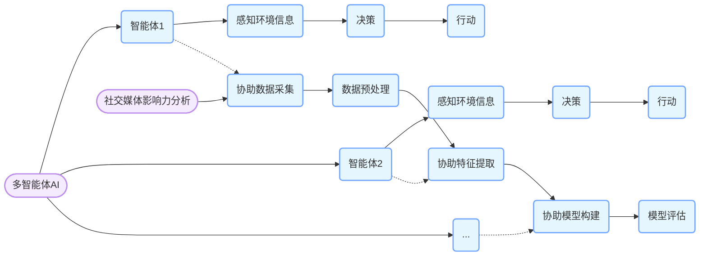

# 多智能体AI如何优化社交媒体影响力分析

> 关键词：多智能体AI、社交媒体影响力分析、优化策略、智能算法、数据挖掘

> 摘要：本文聚焦于多智能体AI在社交媒体影响力分析中的应用与优化。首先介绍了相关背景知识，包括目的、预期读者等内容。接着阐述了多智能体AI和社交媒体影响力分析的核心概念与联系，深入探讨了核心算法原理及具体操作步骤，并给出了相应的数学模型和公式。通过项目实战展示了代码实现及详细解释，分析了实际应用场景。同时推荐了相关的学习资源、开发工具框架以及论文著作。最后总结了未来发展趋势与挑战，解答了常见问题并提供了扩展阅读和参考资料，旨在全面剖析多智能体AI如何有效优化社交媒体影响力分析。

## 1. 背景介绍 
### 1.1 目的和范围
在当今数字化时代，社交媒体已经成为人们生活中不可或缺的一部分。社交媒体平台上每天产生海量的数据，这些数据蕴含着用户的行为、观点、偏好等丰富信息。分析社交媒体影响力对于企业的市场营销、品牌推广、舆情监测，以及政府的社会管理、政策制定等都具有重要意义。

多智能体AI作为一种先进的人工智能技术，具有分布式、自主性、协作性等特点。本研究的目的在于探索如何利用多智能体AI技术优化社交媒体影响力分析，提高分析的准确性、效率和全面性。研究范围涵盖了多智能体AI的基本原理、社交媒体影响力的评估指标、相关算法的实现，以及在不同社交媒体平台上的应用等方面。

### 1.2 预期读者
本文预期读者包括从事人工智能、数据挖掘、社交媒体分析等领域的研究人员和学者，他们可以从本文中获取多智能体AI在社交媒体影响力分析方面的最新研究成果和技术思路，为进一步的研究提供参考。同时，也适合社交媒体运营人员、市场营销人员以及相关企业的管理人员阅读，帮助他们更好地理解社交媒体影响力分析的方法和技术，从而制定更有效的运营和营销策略。此外，对于对人工智能和社交媒体感兴趣的广大技术爱好者来说，本文也可以作为了解相关知识的科普性文章。

### 1.3 文档结构概述
本文共分为十个部分。第一部分为背景介绍，阐述了研究的目的、范围、预期读者和文档结构概述，并对相关术语进行了解释。第二部分介绍了多智能体AI和社交媒体影响力分析的核心概念与联系，通过文本示意图和Mermaid流程图进行了直观展示。第三部分详细讲解了核心算法原理及具体操作步骤，并给出了Python源代码。第四部分介绍了相关的数学模型和公式，并进行了详细讲解和举例说明。第五部分通过项目实战，展示了开发环境搭建、源代码实现和代码解读。第六部分分析了多智能体AI优化社交媒体影响力分析的实际应用场景。第七部分推荐了学习资源、开发工具框架和相关论文著作。第八部分总结了未来发展趋势与挑战。第九部分解答了常见问题。第十部分提供了扩展阅读和参考资料。

### 1.4 术语表
#### 1.4.1 核心术语定义
- **多智能体AI（Multi - Agent AI）**：由多个具有自主决策能力的智能体组成的人工智能系统，这些智能体可以通过协作和交互来完成复杂的任务。
- **社交媒体影响力（Social Media Influence）**：指个体、组织或内容在社交媒体平台上对其他用户的观点、行为和决策产生影响的能力。
- **智能体（Agent）**：在多智能体AI中，智能体是具有感知、决策和行动能力的实体，能够根据环境信息自主地做出决策并执行相应的动作。
- **数据挖掘（Data Mining）**：从大量数据中发现有价值信息和知识的过程。
- **舆情监测（Public Opinion Monitoring）**：对社会公众的意见、态度和情绪进行监测和分析的过程。

#### 1.4.2 相关概念解释
- **分布式系统（Distributed System）**：多智能体AI通常采用分布式系统架构，其中各个智能体分布在不同的节点上，通过网络进行通信和协作。这种架构具有高可扩展性、容错性和并行处理能力。
- **机器学习（Machine Learning）**：是多智能体AI中常用的技术之一，通过让智能体从数据中学习模式和规律，从而提高其决策能力和性能。
- **社交网络分析（Social Network Analysis）**：用于分析社交媒体平台上用户之间的关系和互动模式，是评估社交媒体影响力的重要方法之一。

#### 1.4.3 缩略词列表
- **AI**：Artificial Intelligence（人工智能）
- **ML**：Machine Learning（机器学习）
- **SNA**：Social Network Analysis（社交网络分析）

## 2. 核心概念与联系 

### 多智能体AI原理
多智能体AI是由多个智能体组成的系统，每个智能体都具有一定的自主性和智能。智能体可以感知周围环境的信息，根据自身的目标和规则进行决策，并采取相应的行动。智能体之间可以通过通信和协作来完成共同的任务。

多智能体AI的架构通常包括智能体层、通信层和协调层。智能体层包含多个智能体，每个智能体负责完成特定的任务。通信层负责智能体之间的信息传递和交互。协调层负责协调智能体的行为，确保它们能够协同工作，实现系统的整体目标。

### 社交媒体影响力分析原理
社交媒体影响力分析是通过对社交媒体平台上的用户行为、内容传播等数据进行挖掘和分析，评估个体、组织或内容在社交媒体上的影响力。常见的评估指标包括粉丝数量、点赞数、评论数、转发数等。

社交媒体影响力分析的过程通常包括数据采集、数据预处理、特征提取、模型构建和评估等步骤。首先从社交媒体平台上采集相关数据，然后对数据进行清洗、转换等预处理操作，提取有价值的特征，接着构建影响力评估模型，最后对模型进行评估和优化。

### 核心概念联系的文本示意图
```plaintext
多智能体AI
|
|-- 智能体1 -- 感知环境信息 -- 决策 -- 行动
|-- 智能体2 -- 感知环境信息 -- 决策 -- 行动
|-- ...
|
|-- 通信层 -- 智能体之间信息交互
|-- 协调层 -- 协调智能体行为

社交媒体影响力分析
|
|-- 数据采集 -- 从社交媒体平台获取数据
|-- 数据预处理 -- 清洗、转换数据
|-- 特征提取 -- 提取有价值特征
|-- 模型构建 -- 构建影响力评估模型
|-- 模型评估 -- 评估和优化模型

联系：多智能体AI可以用于优化社交媒体影响力分析的各个环节，如数据采集、特征提取、模型构建等。智能体可以自主地采集数据、挖掘特征，通过协作构建更准确的影响力评估模型。
```

### Mermaid流程图


## 3. 核心算法原理 & 具体操作步骤 

### 核心算法原理
在多智能体AI优化社交媒体影响力分析中，常用的算法包括强化学习算法、遗传算法和蚁群算法等。这里以强化学习算法为例进行详细讲解。

强化学习是一种通过智能体与环境进行交互来学习最优策略的机器学习方法。在社交媒体影响力分析中，智能体可以将社交媒体平台视为环境，通过观察环境状态（如用户行为数据、内容传播数据等），采取不同的行动（如选择不同的特征进行分析、调整模型参数等），并根据环境给予的奖励（如影响力评估的准确性提高）来学习最优策略。

### 具体操作步骤
1. **定义环境和智能体**：将社交媒体平台定义为环境，智能体定义为具有感知和决策能力的实体。
2. **定义状态空间**：状态空间包括社交媒体平台上的各种数据信息，如用户的基本信息、行为数据、内容传播数据等。
3. **定义动作空间**：动作空间包括智能体可以采取的各种行动，如选择不同的特征进行分析、调整模型参数等。
4. **定义奖励函数**：奖励函数用于评估智能体采取的行动对社交媒体影响力分析准确性的影响。如果行动使得影响力评估的准确性提高，则给予正奖励；反之，则给予负奖励。
5. **智能体与环境交互**：智能体根据当前环境状态选择一个动作，执行该动作后，环境会返回一个新的状态和相应的奖励。
6. **更新智能体策略**：智能体根据奖励和新的状态更新自己的策略，以提高未来获得更多奖励的可能性。
7. **重复步骤5和6**：直到智能体学习到最优策略。

### Python源代码实现
```python
import numpy as np

# 定义环境类
class SocialMediaEnvironment:
    def __init__(self):
        # 初始化状态空间和动作空间
        self.state_space = np.random.rand(10)  # 假设状态空间有10个维度
        self.action_space = [0, 1, 2]  # 假设动作空间有3个动作

    def reset(self):
        # 重置环境状态
        self.state_space = np.random.rand(10)
        return self.state_space

    def step(self, action):
        # 执行动作，返回新状态和奖励
        new_state = self.state_space + np.random.rand(10) * action  # 简单示例
        if action == 1:
            reward = 1  # 假设动作1会得到正奖励
        else:
            reward = -1  # 其他动作得到负奖励
        done = False  # 假设任务不会结束
        return new_state, reward, done

# 定义智能体类
class Agent:
    def __init__(self, action_space):
        self.action_space = action_space
        self.q_table = np.zeros((10, len(action_space)))  # 简单的Q表，假设状态空间有10个状态

    def choose_action(self, state):
        # 根据Q表选择动作
        state_index = np.argmax(state)  # 简单示例，将状态的最大值索引作为状态索引
        action_index = np.argmax(self.q_table[state_index])
        return self.action_space[action_index]

    def update_q_table(self, state, action, reward, next_state):
        # 更新Q表
        state_index = np.argmax(state)
        next_state_index = np.argmax(next_state)
        action_index = self.action_space.index(action)
        alpha = 0.1  # 学习率
        gamma = 0.9  # 折扣因子
        self.q_table[state_index, action_index] += alpha * (reward + gamma * np.max(self.q_table[next_state_index]) - self.q_table[state_index, action_index])

# 主程序
if __name__ == "__main__":
    env = SocialMediaEnvironment()
    agent = Agent(env.action_space)
    num_episodes = 100  # 训练的回合数
    for episode in range(num_episodes):
        state = env.reset()
        done = False
        while not done:
            action = agent.choose_action(state)
            next_state, reward, done = env.step(action)
            agent.update_q_table(state, action, reward, next_state)
            state = next_state
```

## 4. 数学模型和公式 & 详细讲解 & 举例说明 

### 强化学习的数学模型
强化学习的核心是马尔可夫决策过程（Markov Decision Process，MDP），它可以用一个五元组 $<S, A, P, R, \gamma>$ 来表示，其中：
- $S$ 是状态空间，即环境可能处于的所有状态的集合。
- $A$ 是动作空间，即智能体可以采取的所有动作的集合。
- $P$ 是状态转移概率函数，$P(s'|s, a)$ 表示在状态 $s$ 下采取动作 $a$ 后转移到状态 $s'$ 的概率。
- $R$ 是奖励函数，$R(s, a, s')$ 表示在状态 $s$ 下采取动作 $a$ 转移到状态 $s'$ 时获得的奖励。
- $\gamma$ 是折扣因子，用于权衡当前奖励和未来奖励的重要性，取值范围为 $[0, 1]$。

### Q - learning算法公式
Q - learning是一种常用的强化学习算法，其核心是更新Q表。Q表记录了在每个状态下采取每个动作的价值。Q - learning的更新公式为：
$$Q(s, a) \leftarrow Q(s, a) + \alpha [R(s, a, s') + \gamma \max_{a'} Q(s', a') - Q(s, a)]$$
其中：
- $Q(s, a)$ 表示在状态 $s$ 下采取动作 $a$ 的Q值。
- $\alpha$ 是学习率，控制每次更新的步长。
- $R(s, a, s')$ 是在状态 $s$ 下采取动作 $a$ 转移到状态 $s'$ 时获得的奖励。
- $\gamma$ 是折扣因子。
- $\max_{a'} Q(s', a')$ 表示在状态 $s'$ 下采取所有可能动作中的最大Q值。

### 详细讲解
在社交媒体影响力分析中，状态 $s$ 可以表示社交媒体平台上的用户行为数据、内容传播数据等。动作 $a$ 可以表示智能体选择不同的特征进行分析、调整模型参数等操作。奖励 $R(s, a, s')$ 可以根据影响力评估的准确性来确定。如果采取某个动作后影响力评估的准确性提高，则给予正奖励；反之，则给予负奖励。

通过不断地更新Q表，智能体可以学习到在每个状态下采取最优动作的策略，从而提高社交媒体影响力分析的准确性。

### 举例说明
假设在社交媒体影响力分析中，状态 $s$ 表示用户的粉丝数量、点赞数、评论数等信息。动作 $a$ 有三个选择：选择特征1进行分析、选择特征2进行分析、调整模型参数。当智能体在状态 $s$ 下选择动作 $a_1$（选择特征1进行分析）后，转移到状态 $s'$，此时影响力评估的准确性提高，获得奖励 $R(s, a_1, s') = 1$。智能体根据Q - learning公式更新Q表中 $Q(s, a_1)$ 的值，随着训练的进行，智能体将逐渐学习到在不同状态下采取最优动作的策略。

## 5. 项目实战：代码实际案例和详细解释说明 

### 5.1  开发环境搭建
1. **安装Python**：建议使用Python 3.7及以上版本，可以从Python官方网站（https://www.python.org/downloads/） 下载并安装。
2. **安装必要的库**：本项目需要使用 `numpy` 库，可以使用以下命令进行安装：
```sh
pip install numpy
```
3. **选择开发工具**：可以选择使用PyCharm、Jupyter Notebook等开发工具。

### 5.2  源代码详细实现和代码解读
```python
import numpy as np

# 定义环境类
class SocialMediaEnvironment:
    def __init__(self):
        # 初始化状态空间和动作空间
        self.state_space = np.random.rand(10)  # 假设状态空间有10个维度
        self.action_space = [0, 1, 2]  # 假设动作空间有3个动作

    def reset(self):
        # 重置环境状态
        self.state_space = np.random.rand(10)
        return self.state_space

    def step(self, action):
        # 执行动作，返回新状态和奖励
        new_state = self.state_space + np.random.rand(10) * action  # 简单示例
        if action == 1:
            reward = 1  # 假设动作1会得到正奖励
        else:
            reward = -1  # 其他动作得到负奖励
        done = False  # 假设任务不会结束
        return new_state, reward, done

# 定义智能体类
class Agent:
    def __init__(self, action_space):
        self.action_space = action_space
        self.q_table = np.zeros((10, len(action_space)))  # 简单的Q表，假设状态空间有10个状态

    def choose_action(self, state):
        # 根据Q表选择动作
        state_index = np.argmax(state)  # 简单示例，将状态的最大值索引作为状态索引
        action_index = np.argmax(self.q_table[state_index])
        return self.action_space[action_index]

    def update_q_table(self, state, action, reward, next_state):
        # 更新Q表
        state_index = np.argmax(state)
        next_state_index = np.argmax(next_state)
        action_index = self.action_space.index(action)
        alpha =