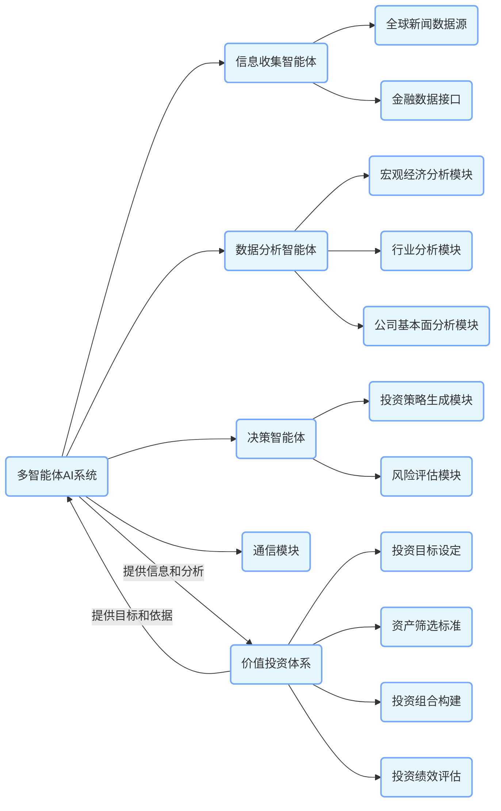

# 多智能体AI如何提升价值投资的全球化视野

> 关键词：多智能体AI、价值投资、全球化视野、金融市场、信息处理

> 摘要：本文深入探讨了多智能体AI在提升价值投资全球化视野方面的应用。首先介绍了研究的背景，包括目的、预期读者、文档结构和相关术语。接着阐述了多智能体AI和价值投资的核心概念及联系，分析了核心算法原理和操作步骤，并给出了数学模型和公式。通过项目实战展示了代码实现和解读，探讨了实际应用场景。同时推荐了相关的学习资源、开发工具框架和论文著作。最后总结了未来发展趋势与挑战，解答了常见问题，并提供了扩展阅读和参考资料，旨在帮助投资者借助多智能体AI更好地实现全球化价值投资。

## 1. 背景介绍 
### 1.1 目的和范围
随着全球金融市场的日益复杂和一体化，价值投资面临着前所未有的挑战和机遇。传统的投资分析方法在处理海量、多元且快速变化的全球信息时显得力不从心。多智能体AI作为一种新兴的技术手段，具有强大的信息处理、决策和协作能力，有望为价值投资带来新的突破。本文的目的在于深入研究多智能体AI如何提升价值投资的全球化视野，探讨其在全球金融市场中的应用原理、方法和实际效果。研究范围涵盖了多智能体AI的基本概念、核心算法、数学模型，以及在价值投资中的具体应用场景和案例分析。

### 1.2 预期读者
本文主要面向对金融投资和人工智能技术感兴趣的专业人士，包括金融分析师、投资经理、人工智能研究人员和开发者等。同时，也适合对全球金融市场和价值投资有一定了解，希望深入学习如何利用先进技术提升投资决策能力的投资者和爱好者。

### 1.3 文档结构概述
本文将按照以下结构展开：首先介绍多智能体AI和价值投资的核心概念及它们之间的联系，通过文本示意图和Mermaid流程图进行直观展示；接着详细阐述多智能体AI的核心算法原理，并给出具体的Python操作步骤；然后介绍相关的数学模型和公式，并举例说明其应用；通过项目实战，展示多智能体AI在价值投资中的代码实现和详细解读；探讨多智能体AI在价值投资中的实际应用场景；推荐相关的学习资源、开发工具框架和论文著作；最后总结多智能体AI在提升价值投资全球化视野方面的未来发展趋势与挑战，解答常见问题，并提供扩展阅读和参考资料。

### 1.4 术语表
#### 1.4.1 核心术语定义
- **多智能体AI（Multi-Agent AI）**：由多个智能体组成的人工智能系统，每个智能体具有一定的自主决策能力和信息处理能力，它们之间可以通过通信和协作来完成复杂的任务。
- **价值投资（Value Investing）**：一种投资策略，通过分析股票、债券等金融资产的内在价值，寻找被市场低估的资产进行投资，以期在长期获得超过市场平均水平的回报。
- **全球化视野（Global Perspective）**：在价值投资中，指考虑全球范围内的政治、经济、社会等因素对金融市场和投资标的的影响，从而做出更全面、准确的投资决策。

#### 1.4.2 相关概念解释
- **智能体（Agent）**：在多智能体AI中，智能体是一个具有感知、决策和行动能力的实体。它可以感知环境信息，根据自身的目标和规则做出决策，并采取相应的行动。
- **内在价值（Intrinsic Value）**：指资产本身所具有的价值，通常通过对资产的基本面分析，如财务状况、盈利能力、行业前景等因素来评估。
- **市场效率（Market Efficiency）**：指市场价格反映资产内在价值的程度。在有效市场中，资产价格能够迅速、准确地反映所有可用信息；而在无效市场中，资产价格可能会偏离其内在价值。

#### 1.4.3 缩略词列表
- **AI**：Artificial Intelligence，人工智能
- **ML**：Machine Learning，机器学习
- **DL**：Deep Learning，深度学习

## 2. 核心概念与联系 
### 核心概念原理
#### 多智能体AI原理
多智能体AI的核心思想是将复杂的任务分解为多个子任务，由多个智能体分别承担不同的子任务，并通过协作来完成整个任务。每个智能体具有一定的自主性和学习能力，可以根据环境的变化和自身的经验调整决策和行为。智能体之间通过通信机制进行信息交换和协调，以实现全局最优的目标。

例如，在一个多智能体股票投资系统中，可能有一些智能体负责收集全球金融市场的新闻和数据，一些智能体负责分析宏观经济指标，还有一些智能体负责评估具体股票的内在价值。这些智能体通过通信和协作，共同为投资者提供投资建议。

#### 价值投资原理
价值投资的基本原理是基于资产的内在价值进行投资。投资者通过对公司的财务报表、行业竞争格局、管理层能力等因素进行分析，评估公司的内在价值。如果市场价格低于内在价值，投资者认为该资产被低估，从而买入；反之，如果市场价格高于内在价值，投资者认为该资产被高估，从而卖出。

价值投资强调长期投资和基本面分析，认为市场在短期内可能会出现价格波动，但从长期来看，资产价格会回归其内在价值。

### 架构的文本示意图
```plaintext
多智能体AI系统
|-- 信息收集智能体
|   |-- 全球新闻数据源
|   |-- 金融数据接口
|-- 数据分析智能体
|   |-- 宏观经济分析模块
|   |-- 行业分析模块
|   |-- 公司基本面分析模块
|-- 决策智能体
|   |-- 投资策略生成模块
|   |-- 风险评估模块
|-- 通信模块
    |-- 智能体间通信协议
    |-- 数据传输接口

价值投资体系
|-- 投资目标设定
|-- 资产筛选标准
|-- 投资组合构建
|-- 投资绩效评估

多智能体AI与价值投资的联系
|-- 多智能体AI为价值投资提供全球信息收集和分析能力
|-- 价值投资为多智能体AI提供投资目标和决策依据
```

### Mermaid流程图


## 3. 核心算法原理 & 具体操作步骤 
### 核心算法原理
#### 多智能体强化学习算法
多智能体强化学习是多智能体AI中常用的算法之一，它通过智能体与环境的交互来学习最优的决策策略。在多智能体强化学习中，每个智能体都有自己的奖励函数和策略，通过不断地尝试和探索，智能体可以找到使自己的奖励最大化的策略。

以投资决策为例，每个智能体可以看作是一个投资者，环境是全球金融市场，智能体的行动是买入、卖出或持有某种资产，奖励是投资收益。智能体通过与市场环境的交互，学习到在不同市场条件下的最优投资策略。

#### 贝叶斯网络算法
贝叶斯网络是一种概率图模型，用于表示变量之间的概率关系。在多智能体AI中，贝叶斯网络可以用于处理不确定性信息和进行推理。例如，在分析全球经济形势对股票市场的影响时，贝叶斯网络可以根据各种经济指标和市场数据，计算出股票价格上涨或下跌的概率。

### 具体操作步骤（Python代码实现）
#### 多智能体强化学习示例
```python
import numpy as np
import random

# 定义智能体类
class Agent:
    def __init__(self, num_actions):
        self.num_actions = num_actions
        self.q_table = {}

    def get_action(self, state):
        if state not in self.q_table:
            self.q_table[state] = [0] * self.num_actions
        if random.uniform(0, 1) < 0.1:  # 探索率
            return random.randint(0, self.num_actions - 1)
        else:
            return np.argmax(self.q_table[state])

    def update_q_table(self, state, action, reward, next_state):
        if state not in self.q_table:
            self.q_table[state] = [0] * self.num_actions
        if next_state not in self.q_table:
            self.q_table[next_state] = [0] * self.num_actions
        alpha = 0.1  # 学习率
        gamma = 0.9  # 折扣因子
        max_q_next = np.max(self.q_table[next_state])
        self.q_table[state][action] += alpha * (reward + gamma * max_q_next - self.q_table[state][action])

# 模拟投资环境
class InvestmentEnv:
    def __init__(self):
        self.states = ['bull', 'bear', 'neutral']
        self.actions = ['buy', 'sell', 'hold']
        self.current_state = random.choice(self.states)

    def step(self, action):
        if action == 0:  # buy
            if self.current_state == 'bull':
                reward = 1
            elif self.current_state == 'bear':
                reward = -1
            else:
                reward = 0
        elif action == 1:  # sell
            if self.current_state == 'bear':
                reward = 1
            elif self.current_state == 'bull':
                reward = -1
            else:
                reward = 0
        else:  # hold
            reward = 0

        # 随机改变状态
        self.current_state = random.choice(self.states)
        next_state = self.current_state
        return next_state, reward

# 初始化智能体和环境
agent = Agent(num_actions=3)
env = InvestmentEnv()

# 训练智能体
num_episodes = 1000
for episode in range(num_episodes):
    state = env.current_state
    for _ in range(10):
        action = agent.get_action(state)
        next_state, reward = env.step(action)
        agent.update_q_table(state, action, reward, next_state)
        state = next_state

# 测试智能体
state = env.current_state
action = agent.get_action(state)
print(f"当前状态: {state}, 采取行动: {env.actions[action]}")
```

#### 贝叶斯网络示例
```python
from pgmpy.models import BayesianNetwork
from pgmpy.factors.discrete import TabularCPD
from pgmpy.inference import VariableElimination

# 定义贝叶斯网络结构
model = BayesianNetwork([('GDP_Growth', 'Stock_Market'), ('Interest_Rate', 'Stock_Market')])

# 定义条件概率分布
cpd_gdp = TabularCPD(variable='GDP_Growth', variable_card=2, values=[[0.7], [0.3]], state_names={'GDP_Growth': ['High', 'Low']})
cpd_interest = TabularCPD(variable='Interest_Rate', variable_card=2, values=[[0.6], [0.4]], state_names={'Interest_Rate': ['High', 'Low']})
cpd_stock = TabularCPD(variable='Stock_Market', variable_card=2,
                       values=[[0.8, 0.6, 0.3, 0.1],
                               [0.2, 0.4, 0.7, 0.9]],
                       evidence=['GDP_Growth', 'Interest_Rate'],
                       evidence_card=[2, 2],
                       state_names={'Stock_Market': ['Up', 'Down'], 'GDP_Growth': ['High', 'Low'], 'Interest_Rate': ['High', 'Low']})

# 将条件概率分布添加到模型中
model.add_cpds(cpd_gdp, cpd_interest, cpd_stock)

# 验证模型
assert model.check_model()

# 进行推理
infer = VariableElimination(model)
result = infer.query(variables=['Stock_Market'], evidence={'GDP_Growth': 'High', 'Interest_Rate': 'Low'})
print(result)
```

## 4. 数学模型和公式 & 详细讲解 & 举例说明 
### 多智能体强化学习数学模型
#### Q学习公式
在多智能体强化学习中，常用的算法是Q学习。Q学习的目标是学习一个Q函数 $Q(s, a)$，表示在状态 $s$ 下采取行动 $a$ 的期望累积奖励。Q学习的更新公式如下：

$$Q(s_t, a_t) \leftarrow Q(s_t, a_t) + \alpha \left[ r_t + \gamma \max_{a} Q(s_{t+1}, a) - Q(s_t, a_t) \right]$$

其中：
- $s_t$ 是当前状态
- $a_t$ 是当前行动
- $r_t$ 是当前奖励
- $s_{t+1}$ 是下一个状态
- $\alpha$ 是学习率，控制每次更新的步长
- $\gamma$ 是折扣因子，用于权衡当前奖励和未来奖励

#### 详细讲解
Q学习的核心思想是通过不断地尝试和探索，逐步更新Q函数的值，使得Q函数能够准确地反映在不同状态下采取不同行动的价值。学习率 $\alpha$ 决定了每次更新的幅度，如果 $\alpha$ 过大，Q函数可能会不稳定；如果 $\alpha$ 过小，学习速度会很慢。折扣因子 $\gamma$ 表示未来奖励的重要性，$\gamma$ 越接近1，智能体越关注未来的奖励；$\gamma$ 越接近0，智能体越关注当前的奖励。

#### 举例说明
假设一个智能体在股票市场中进行投资决策，当前状态 $s_t$ 是市场处于牛市，采取的行动 $a_t$ 是买入股票，获得的奖励 $r_t$ 是100元，下一个状态 $s_{t+1}$ 是市场仍然处于牛市。假设当前的Q值 $Q(s_t, a_t) = 200$，学习率 $\alpha = 0.1$，折扣因子 $\gamma = 0.9$，且 $\max_{a} Q(s_{t+1}, a) = 250$。根据Q学习公式，更新后的Q值为：

$$Q(s_t, a_t) = 200 + 0.1 \left[ 100 + 0.9 \times 250 - 200 \right] = 200 + 0.1 \times 125 = 212.5$$

### 贝叶斯网络数学模型
#### 联合概率分布公式
贝叶斯网络通过条件概率分布来表示变量之间的依赖关系。对于一个包含 $n$ 个变量 $X_1, X_2, \cdots, X_n$ 的贝叶斯网络，其联合概率分布可以表示为：

$$P(X_1, X_2, \cdots, X_n) = \prod_{i=1}^{n} P(X_i | Pa(X_i))$$

其中 $Pa(X_i)$ 表示变量 $X_i$ 的父节点集合。

#### 详细讲解
贝叶斯网络的核心思想是将复杂的联合概率分布分解为多个简单的条件概率分布的乘积。通过这种方式，可以有效地处理变量之间的依赖关系和不确定性。在实际应用中，我们可以根据已知的证据变量，利用贝叶斯定理进行推理，计算出其他变量的条件概率。

#### 举例说明
假设有一个简单的贝叶斯网络，包含三个变量：天气（$W$）、是否带伞（$U$）和是否下雨（$R$）。其中，天气是是否下雨的父节点，是否下雨是是否带伞的父节点。已知条件概率分布 $P(W)$、$P(R|W)$ 和 $P(U|R)$，则联合概率分布为：

$$P(W, R, U) = P(W) \times P(R|W) \times P(U|R)$$

如果我们已知天气是晴天（$W = \text{Sunny}$），要计算是否带伞的概率 $P(U|W = \text{Sunny})$，可以通过以下步骤进行推理：

1. 计算 $P(R|W = \text{Sunny})$
2. 计算 $P(U|R)$
3. 根据全概率公式计算 $P(U|W = \text{Sunny})$

## 5. 项目实战：代码实际案例和详细解释说明 
### 5.1  开发环境搭建
#### 安装Python
首先需要安装Python环境，建议使用Python 3.7及以上版本。可以从Python官方网站（https://www.python.org/downloads/） 下载安装包，按照安装向导进行安装。

#### 安装必要的库
在项目中，我们需要使用一些Python库，如`numpy`、`pgmpy`等。可以使用`pip`命令进行安装：

```sh
pip install numpy pgmpy
```

### 5.2  源代码详细实现和代码解读
#### 多智能体投资决策系统
```python
import numpy as np
import random

# 定义智能体类
class Agent:
    def __init__(self, num_actions):
        self.num_actions = num_actions
        self.q_table = {}

    def get_action(self, state):
        if state not in self.q_table:
            self.q_table[state] = [0] * self.num_actions
        if random.uniform(0, 1) < 0.1:  # 探索率
            return random.randint(0, self.num_actions - 1)
        else:
            return np.argmax(self.q_table[state])

    def update_q_table(self, state, action, reward, next_state):
        if state not in self.q_table:
            self.q_table[state] = [0] * self.num_actions
        if next_state not in self.q_table:
            self.q_table[next_state] = [0] * self.num_actions
        alpha = 0.1  # 学习率
        gamma = 0.9  # 折扣因子
        max_q_next = np.max(self.q_table[next_state])
        self.q_table[state][action] += alpha * (reward + gamma * max_q_next - self.q_table[state][action])

# 模拟投资环境
class InvestmentEnv:
    def __init__(self):
        self.states = ['bull', 'bear', 'neutral']
        self.actions = ['buy', 'sell', 'hold']
        self.current_state = random.choice(self.states)

    def step(self, action):
        if action == 0:  # buy
            if self.current_state == 'bull':
                reward = 1
            elif self.current_state == 'bear':
                reward = -1
            else:
                reward = 0
        elif action == 1:  # sell
            if self.current_state == 'bear':
                reward = 1
            elif self.current_state == 'bull':
                reward = -1
            else:
                reward = 0
        else:  # hold
            reward = 0

        # 随机改变状态
        self.current_state = random.choice(self.states)
        next_state = self.current_state
        return next_state, reward

# 初始化智能体和环境
agent = Agent(num_actions=3)
env = InvestmentEnv()

# 训练智能体
num_episodes = 1000
for episode in range(num_episodes):
    state = env.current_state
    for _ in range(10):
        action = agent.get_action(state)
        next_state, reward = env.step(action)
        agent.update_q_table(state, action, reward, next_state)
        state = next_state

# 测试智能体
state = env.current_state
action = agent.get_action(state)
print(f"当前状态: {state}, 采取行动: {env.actions[action]}")
```

#### 代码解读
1. **智能体类（`Agent`）**：
    - `__init__` 方法：初始化智能体的动作数量和Q表。
    - `get_action` 方法：根据当前状态选择动作，以一定的概率进行探索，否则选择Q值最大的动作。
    - `update_q_table` 方法：根据Q学习公式更新Q表。

2. **投资环境类（`InvestmentEnv`）**：
    - `__init__` 方法：初始化环境的状态和动作集合，并随机选择一个初始状态。
    - `step` 方法：根据智能体的动作返回下一个状态和奖励。

3. **训练和测试过程**：
    - 初始化智能体和环境。
    - 进行多次训练，每次训练中智能体与环境交互多次，更新Q表。
    - 最后进行一次测试，输出当前状态和智能体采取的动作。

#### 贝叶斯网络投资分析系统
```python
from pgmpy.models import BayesianNetwork
from pgmpy.factors.discrete import TabularCPD
from pgmpy.inference import VariableElimination

# 定义贝叶斯网络结构
model = BayesianNetwork([('GDP_Growth', 'Stock_Market'), ('Interest_Rate', 'Stock_Market')])

# 定义条件概率分布
cpd_gdp = TabularCPD(variable='GDP_Growth', variable_card=2, values=[[0.7], [0.3]], state_names={'GDP_Growth': ['High', 'Low']})
cpd_interest = TabularCPD(variable='Interest_Rate', variable_card=2, values=[[0.6], [0.4]], state_names={'Interest_Rate': ['High', 'Low']})
cpd_stock = TabularCPD(variable='Stock_Market', variable_card=2,
                       values=[[0.8, 0.6, 0.3, 0.1],
                               [0.2, 0.4, 0.7, 0.9]],
                       evidence=['GDP_Growth', 'Interest_Rate'],
                       evidence_card=[2, 2],
                       state_names={'Stock_Market': ['Up', 'Down'], 'GDP_Growth': ['High', 'Low'], 'Interest_Rate': ['High', 'Low']})

# 将条件概率分布添加到模型中
model.add_cpds(cpd_gdp, cpd_interest, cpd_stock)

# 验证模型
assert model.check_model()

# 进行推理
infer = VariableElimination(model)
result = infer.query(variables=['Stock_Market'], evidence={'GDP_Growth': 'High', 'Interest_Rate': 'Low'})
print(result)
```

#### 代码解读
1. **定义贝叶斯网络结构**：使用`BayesianNetwork`类定义网络结构，指定变量之间的依赖关系。
2. **定义条件概率分布**：使用`TabularCPD`类定义每个变量的条件概率分布。
3. **添加条件概率分布到模型中**：使用`add_cpds`方法将条件概率分布添加到模型中。
4. **验证模型**：使用`check_model`方法验证模型的正确性。
5. **进行推理**：使用`VariableElimination`类进行推理，计算在给定证据下目标变量的条件概率。

### 5.3  代码解读与分析
#### 多智能体投资决策系统分析
- **优点**：
    - 能够通过强化学习不断学习和优化投资策略。
    - 具有一定的探索能力，可以在不同的市场环境中找到更优的策略。
- **缺点**：
    - 学习过程可能比较耗时，需要大量的训练数据。
    - 对环境的建模比较简单，可能无法准确反映真实的金融市场。

#### 贝叶斯网络投资分析系统分析
- **优点**：
    - 能够处理不确定性信息，通过概率推理提供投资建议。
    - 可以直观地表示变量之间的依赖关系，便于理解和分析。
- **缺点**：
    - 条件概率分布的确定可能比较困难，需要大量的历史数据和专业知识。
    - 模型的复杂度随着变量数量的增加而迅速增加，可能导致计算效率低下。

## 6. 实际应用场景 
### 全球宏观经济分析
多智能体AI可以收集全球范围内的宏观经济数据，如GDP增长率、通货膨胀率、利率等，并通过数据分析智能体进行深入分析。决策智能体可以根据分析结果，预测全球经济走势，为投资者提供宏观经济层面的投资建议。例如，当预测到某个国家的经济将出现衰退时，投资者可以减少对该国股票和债券的投资，增加对避险资产的配置。

### 行业和公司分析
多智能体AI可以对全球各个行业和公司进行实时监测和分析。信息收集智能体可以收集行业新闻、公司财报、竞争对手信息等，数据分析智能体可以对这些信息进行处理和分析，评估行业的发展前景和公司的竞争力。决策智能体可以根据分析结果，筛选出具有投资价值的行业和公司，为投资者构建投资组合。例如，在科技行业中，多智能体AI可以分析不同科技公司的研发实力、市场份额和盈利能力，为投资者推荐最具潜力的科技股。

### 风险管理
多智能体AI可以帮助投资者进行风险管理。通过实时监测全球金融市场的波动和风险因素，如汇率波动、政治风险、自然灾害等，多智能体AI可以及时预警并提供相应的风险应对策略。例如，当预测到某个地区将发生政治动荡时，投资者可以提前减少对该地区资产的投资，或者采取套期保值等措施来降低风险。

### 投资组合优化
多智能体AI可以根据投资者的风险偏好和投资目标，优化投资组合。决策智能体可以综合考虑全球各种资产的预期收益、风险水平和相关性，运用优化算法构建最优的投资组合。例如，对于风险偏好较低的投资者，多智能体AI可以构建一个以债券和稳定蓝筹股为主的投资组合；对于风险偏好较高的投资者，可以适当增加新兴市场股票和高收益债券的比重。

## 7. 工具和资源推荐
### 7.1 学习资源推荐
#### 7.1.1 书籍推荐
- 《人工智能：一种现代的方法》（Artificial Intelligence: A Modern Approach）：这是一本经典的人工智能教材，全面介绍了人工智能的各个领域，包括多智能体系统、强化学习等内容。
- 《价值投资：从格雷厄姆到巴菲特》（Value Investing: From Graham to Buffett and Beyond）：详细阐述了价值投资的理论和实践，是价值投资者的必读之书。
- 《Python机器学习》（Python Machine Learning）：介绍了使用Python进行机器学习的方法和技术，对于实现多智能体AI和数据分析非常有帮助。

#### 7.1.2 在线课程
- Coursera上的“人工智能基础”（Foundations of Artificial Intelligence）课程：由知名教授授课，系统地介绍了人工智能的基本概念和方法。
- edX上的“强化学习”（Reinforcement Learning）课程：深入讲解了强化学习的理论和算法，对于理解多智能体强化学习非常有帮助。
- Udemy上的“Python金融数据分析”（Python for Financial Analysis and Algorithmic Trading）课程：结合Python和金融数据，介绍了如何进行金融数据分析和算法交易。

#### 7.1.3 技术博客和网站
- Medium上的人工智能和金融科技相关博客：有很多专业人士分享他们的研究成果和实践经验。
- Kaggle：一个数据科学竞赛平台，上面有很多关于金融数据和人工智能的竞赛和案例，可以学习到最新的技术和方法。
- Towards Data Science：提供了大量关于数据科学和人工智能的技术文章和教程。

### 7.2 开发工具框架推荐
#### 7.2.1 IDE和编辑器
- PyCharm：一款功能强大的Python集成开发环境，提供了代码编辑、调试、版本控制等功能，适合开发多智能体AI和金融数据分析项目。
- Jupyter Notebook：一个交互式的开发环境，可以方便地进行代码编写、数据可视化和文档编写，非常适合进行数据探索和模型实验。

#### 7.2.2 调试和性能分析工具
- PDB：Python自带的调试器，可以帮助开发者定位代码中的问题。
- cProfile：Python的性能分析工具，可以分析代码的运行时间和内存使用情况，帮助优化代码性能。

#### 7.2.3 相关框架和库
- TensorFlow：一个开源的机器学习框架，提供了丰富的工具和算法，可用于构建多智能体AI模型。
- PyTorch：另一个流行的深度学习框架，具有动态图的优势，适合进行快速迭代和实验。
- Pandas：一个用于数据处理和分析的Python库，提供了高效的数据结构和数据分析工具，非常适合处理金融数据。

### 7.3 相关论文著作推荐
#### 7.3.1 经典论文
- “Multiagent Systems: A Modern Approach to Distributed Artificial Intelligence”：全面介绍了多智能体系统的理论和方法，是多智能体领域的经典论文。
- “The Intelligent Investor”：由本杰明·格雷厄姆（Benjamin Graham）撰写，阐述了价值投资的基本原理和方法，对价值投资领域产生了深远的影响。

#### 7.3.2 最新研究成果
- 关注顶级学术会议如NeurIPS（神经信息处理系统大会）、ICML（国际机器学习会议）上关于多智能体AI和金融科技的研究论文，了解最新的技术进展。
- 阅读金融领域的学术期刊如《Journal of Finance》《Review of Financial Studies》，获取关于价值投资和风险管理的最新研究成果。

#### 7.3.3 应用案例分析
- 一些知名金融机构和科技公司会发布关于多智能体AI在价值投资中的应用案例，如桥水基金（Bridgewater Associates）的投资策略和谷歌（Google）的人工智能应用案例，可以从中学习到实际应用中的经验和方法。

## 8. 总结：未来发展趋势与挑战
### 未来发展趋势
#### 融合更多技术
多智能体AI将与区块链、物联网等技术深度融合，实现更加高效、安全和智能的价值投资。例如，区块链技术可以提供不可篡改的交易记录和智能合约，保障投资交易的安全性和透明度；物联网技术可以提供更多的实时数据，为多智能体AI的决策提供更丰富的信息。

#### 个性化投资服务
随着多智能体AI技术的不断发展，投资服务将更加个性化。多智能体AI可以根据投资者的风险偏好、投资目标和财务状况，为每个投资者量身定制投资策略和投资组合，提供更加精准的投资建议。

#### 全球化投资生态系统
多智能体AI将促进全球金融市场的互联互通，形成一个更加开放、高效的全球化投资生态系统。投资者可以通过多智能体AI系统，轻松地投资于全球各个市场和资产类别，实现资产的全球化配置。

### 挑战
#### 数据质量和隐私问题
多智能体AI需要大量的高质量数据来进行训练和决策，但全球金融数据的质量参差不齐，存在数据缺失、错误和不一致等问题。此外，数据隐私和安全也是一个重要的挑战，如何在保护投资者隐私的前提下，有效地利用数据是一个亟待解决的问题。

#### 模型可解释性
多智能体AI模型通常比较复杂，其决策过程难以理解和解释。在价值投资中，投资者需要了解投资决策的依据和风险，因此模型的可解释性至关重要。如何提高多智能体AI模型的可解释性，是当前研究的一个热点问题。

#### 法律法规和监管
随着多智能体AI在价值投资中的应用越来越广泛，相关的法律法规和监管政策也需要不断完善。如何确保多智能体AI系统的合法合规运行，防范金融风险，是监管部门面临的一个重要挑战。

## 9. 附录：常见问题与解答
### 多智能体AI在价值投资中的应用是否可靠？
多智能体AI在价值投资中的应用具有一定的可靠性，但也存在一定的局限性。多智能体AI可以通过处理大量的数据和复杂的信息，提供更全面、准确的投资分析和决策建议。然而，金融市场是复杂多变的，存在很多不确定性因素，多智能体AI模型也可能存在误差和偏差。因此，在实际应用中，投资者应该将多智能体AI的建议作为参考，结合自己的经验和判断进行投资决策。

### 如何评估多智能体AI在价值投资中的效果？
可以从以下几个方面评估多智能体AI在价值投资中的效果：
- **投资回报率**：比较使用多智能体AI和传统投资方法的投资回报率，评估其是否能够带来更高的收益。
- **风险控制能力**：观察多智能体AI在不同市场环境下的风险控制能力，如最大回撤、波动率等指标。
- **决策准确性**：分析多智能体AI的投资决策是否准确，如买入和卖出时机的选择是否合理。

### 多智能体AI是否会取代人类投资者？
多智能体AI不会完全取代人类投资者。虽然多智能体AI具有强大的信息处理和决策能力，但人类投资者具有独特的判断力、创造力和情感智慧。在价值投资中，人类投资者可以根据自己的经验和直觉，对多智能体AI的建议进行综合评估和调整。此外，投资决策不仅仅是基于数据和模型，还涉及到投资者的价值观、风险偏好等因素，这些都是多智能体AI无法替代的。

## 10. 扩展阅读 & 参考资料
### 扩展阅读
- 《人工智能时代的金融科技》：深入探讨了人工智能在金融领域的应用和发展趋势。
- 《金融科技前沿：多智能体系统与金融市场》：介绍了多智能体系统在金融市场中的应用案例和研究成果。

### 参考资料
- 相关学术论文和研究报告，如IEEE Transactions on Neural Networks and Learning Systems、ACM Transactions on Intelligent Systems and Technology等期刊上的论文。
- 金融机构和科技公司的官方网站和报告，如摩根大通（JPMorgan Chase）、高盛（Goldman Sachs）等公司的研究报告。

作者：AI天才研究院/AI Genius Institute & 禅与计算机程序设计艺术 /Zen And The Art of Computer Programming