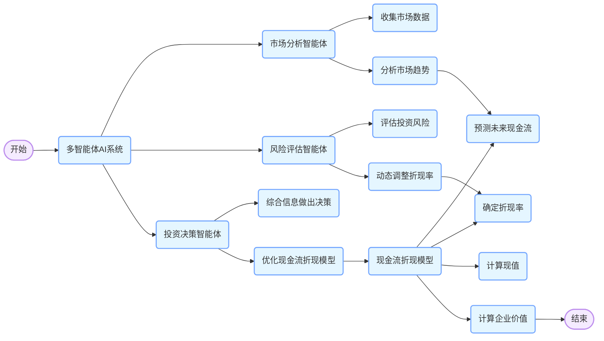

# 多智能体AI如何改进巴菲特的现金流折现模型

> 关键词：多智能体AI、巴菲特现金流折现模型、金融估值、人工智能应用、投资决策

> 摘要：本文聚焦于多智能体AI对巴菲特现金流折现模型的改进。首先介绍了现金流折现模型在投资领域的重要性以及多智能体AI的基本概念。接着深入剖析了多智能体AI与现金流折现模型的核心概念及其联系，详细阐述了相关算法原理、数学模型和公式。通过项目实战展示了如何运用多智能体AI改进该模型，并给出了实际应用场景。同时推荐了学习相关知识的工具和资源，最后对未来发展趋势与挑战进行了总结，还附有常见问题解答和扩展阅读参考资料，旨在为投资者和研究者提供全面深入的技术指导和思考方向。

## 1. 背景介绍 
### 1.1 目的和范围
本文章的目的在于探讨多智能体AI技术如何对巴菲特的现金流折现模型进行改进。现金流折现模型是价值投资领域中至关重要的估值方法，由投资大师巴菲特广泛应用并推广。然而，该模型在实际应用中面临着诸多挑战，如对未来现金流预测的不确定性、折现率确定的主观性等。多智能体AI作为新兴的人工智能技术，具有分布式、自主性和交互性等特点，有可能为解决这些问题提供新的思路和方法。

本文章的范围将涵盖多智能体AI和现金流折现模型的基本概念、核心算法原理、数学模型，通过实际案例展示如何运用多智能体AI改进现金流折现模型，并探讨其在金融投资领域的实际应用场景。同时，还会推荐相关的学习工具和资源，以及对未来发展趋势和挑战进行分析。

### 1.2 预期读者
本文预期读者包括金融投资领域的从业者，如投资经理、分析师、交易员等，他们希望借助新技术提升投资决策的准确性和效率；人工智能领域的研究者和开发者，对将AI技术应用于金融领域感兴趣；以及对金融和人工智能交叉领域有学习需求的学生和爱好者。

### 1.3 文档结构概述
本文将按照以下结构展开：首先介绍核心概念与联系，包括多智能体AI和现金流折现模型的原理及它们之间的关联；接着阐述核心算法原理和具体操作步骤，并使用Python代码进行详细说明；然后介绍数学模型和公式，并举例说明；通过项目实战展示如何将多智能体AI应用于改进现金流折现模型；探讨实际应用场景；推荐相关的工具和资源；最后对未来发展趋势与挑战进行总结，并附上常见问题解答和扩展阅读参考资料。

### 1.4 术语表
#### 1.4.1 核心术语定义
- **多智能体AI（Multi - Agent AI）**：由多个自主智能体组成的系统，这些智能体可以感知环境、进行决策并与其他智能体和环境进行交互，以实现共同或各自的目标。
- **现金流折现模型（Discounted Cash Flow Model，DCF）**：一种基于预测企业未来现金流，并将其折现到当前价值的估值方法，是价值投资中常用的工具。
- **智能体（Agent）**：在多智能体AI系统中，具有自主性、反应性、社会性和主动性的实体，能够独立完成一定的任务。
- **折现率（Discount Rate）**：用于将未来现金流折现到当前价值的比率，反映了资金的时间价值和投资风险。

#### 1.4.2 相关概念解释
- **自主性**：智能体能够在没有外界直接干预的情况下，根据自身的知识和经验做出决策和行动。
- **反应性**：智能体能够感知环境的变化，并及时做出相应的反应。
- **社会性**：智能体能够与其他智能体进行通信和协作，以实现共同的目标。
- **主动性**：智能体能够主动发起行动，以追求自身的目标。

#### 1.4.3 缩略词列表
- **DCF**：Discounted Cash Flow，现金流折现模型
- **AI**：Artificial Intelligence，人工智能
- **MAI**：Multi - Agent AI，多智能体AI

## 2. 核心概念与联系 
### 2.1 多智能体AI原理
多智能体AI系统由多个智能体组成，每个智能体都有自己的目标、知识和能力。智能体通过感知环境获取信息，然后根据自身的决策规则进行推理和决策，最后采取相应的行动。智能体之间可以通过通信机制进行信息交换和协作，以实现整个系统的目标。

例如，在一个金融投资的多智能体AI系统中，可能有市场分析智能体、风险评估智能体和投资决策智能体。市场分析智能体负责收集和分析市场数据，风险评估智能体根据市场分析结果评估投资风险，投资决策智能体则综合考虑市场情况和风险因素做出投资决策。这些智能体相互协作，共同完成投资决策的任务。

### 2.2 巴菲特现金流折现模型原理
巴菲特的现金流折现模型基于一个基本思想：企业的价值等于其未来所能产生的全部现金流的现值之和。具体步骤如下：
1. **预测未来现金流**：对企业未来一段时间内的自由现金流进行预测，自由现金流是指企业在满足了所有运营成本和资本支出后剩余的现金流量。
2. **确定折现率**：折现率反映了资金的时间价值和投资风险，通常使用加权平均资本成本（WACC）作为折现率。
3. **计算现值**：将预测的未来现金流按照折现率折现到当前价值，公式为 $PV = \frac{CF_n}{(1 + r)^n}$，其中 $PV$ 是现值，$CF_n$ 是第 $n$ 期的现金流，$r$ 是折现率，$n$ 是期数。
4. **计算企业价值**：将各期现金流的现值相加，得到企业的价值。

### 2.3 多智能体AI与现金流折现模型的联系
多智能体AI可以在多个方面改进现金流折现模型：
- **未来现金流预测**：多智能体AI系统中的智能体可以从不同的数据源收集信息，如市场数据、行业报告、企业财务报表等，并运用机器学习和数据分析技术对未来现金流进行更准确的预测。不同的智能体可以负责不同的方面，如宏观经济分析智能体可以预测宏观经济环境对企业现金流的影响，行业分析智能体可以分析行业竞争态势对企业现金流的影响。
- **折现率确定**：多智能体AI可以综合考虑多种因素来确定折现率，而不仅仅依赖于传统的加权平均资本成本。例如，风险评估智能体可以实时监测市场风险、企业特定风险等因素，并根据这些因素动态调整折现率。
- **模型优化**：多智能体AI可以通过智能体之间的协作和学习，不断优化现金流折现模型的参数和结构，提高模型的准确性和适应性。

### 2.4 文本示意图
```plaintext
多智能体AI系统
|-- 市场分析智能体
|   |-- 收集市场数据
|   |-- 分析市场趋势
|-- 风险评估智能体
|   |-- 评估投资风险
|   |-- 动态调整折现率
|-- 投资决策智能体
|   |-- 综合信息做出决策
|   |-- 优化现金流折现模型

现金流折现模型
|-- 预测未来现金流
|-- 确定折现率
|-- 计算现值
|-- 计算企业价值
```

### 2.5 Mermaid流程图


## 3. 核心算法原理 & 具体操作步骤 
### 3.1 多智能体AI核心算法原理
多智能体AI中常用的算法包括强化学习算法、遗传算法和蚁群算法等，这里以强化学习算法为例进行介绍。

强化学习是一种通过智能体与环境进行交互，不断尝试不同的行动并根据环境反馈的奖励来学习最优策略的算法。在多智能体强化学习中，每个智能体都有自己的奖励函数和策略，它们通过与环境和其他智能体的交互来学习如何最大化自己的奖励。

#### 3.1.1 Q - 学习算法
Q - 学习是一种经典的强化学习算法，用于求解最优策略。Q - 学习的核心是Q值函数 $Q(s, a)$，表示在状态 $s$ 下采取行动 $a$ 的预期累积奖励。Q - 学习算法通过不断更新Q值函数来逼近最优策略，更新公式为：

$$Q(s_t, a_t) \leftarrow Q(s_t, a_t) + \alpha [r_{t + 1} + \gamma \max_{a} Q(s_{t + 1}, a) - Q(s_t, a_t)]$$

其中，$s_t$ 是当前状态，$a_t$ 是当前行动，$r_{t + 1}$ 是采取行动 $a_t$ 后获得的即时奖励，$\alpha$ 是学习率，$\gamma$ 是折扣因子，$s_{t + 1}$ 是下一个状态。

#### 3.1.2 多智能体Q - 学习算法
在多智能体环境中，每个智能体的Q值函数不仅取决于自己的状态和行动，还取决于其他智能体的状态和行动。多智能体Q - 学习算法通过考虑其他智能体的影响来更新自己的Q值函数。

### 3.2 具体操作步骤
#### 3.2.1 定义智能体和环境
首先，需要定义多智能体AI系统中的智能体和环境。智能体可以包括市场分析智能体、风险评估智能体和投资决策智能体等，环境可以是金融市场，包括股票价格、利率、宏观经济指标等。

#### 3.2.2 初始化Q值函数
为每个智能体初始化Q值函数，通常将Q值初始化为0。

#### 3.2.3 智能体与环境交互
智能体根据当前的Q值函数选择行动，并与环境进行交互。环境根据智能体的行动给出即时奖励和下一个状态。

#### 3.2.4 更新Q值函数
智能体根据即时奖励和下一个状态更新自己的Q值函数，使用Q - 学习算法的更新公式。

#### 3.2.5 重复步骤3和4
不断重复步骤3和4，直到智能体学习到最优策略。

### 3.3 Python源代码详细阐述
```python
import numpy as np

# 定义智能体类
class Agent:
    def __init__(self, num_states, num_actions, alpha=0.1, gamma=0.9):
        self.num_states = num_states
        self.num_actions = num_actions
        self.alpha = alpha
        self.gamma = gamma
        # 初始化Q值函数
        self.Q = np.zeros((num_states, num_actions))

    def choose_action(self, state):
        # 选择行动，这里使用贪心策略
        if np.random.uniform(0, 1) < 0.1:
            action = np.random.choice(self.num_actions)
        else:
            action = np.argmax(self.Q[state, :])
        return action

    def update_Q(self, state, action, reward, next_state):
        # 更新Q值函数
        max_Q_next = np.max(self.Q[next_state, :])
        self.Q[state, action] += self.alpha * (reward + self.gamma * max_Q_next - self.Q[state, action])

# 定义环境类
class Environment:
    def __init__(self):
        self.states = [0, 1, 2]  # 示例状态
        self.actions = [0, 1]  # 示例行动
        self.rewards = {
            (0, 0): 1,
            (0, 1): -1,
            (1, 0): -1,
            (1, 1): 1,
            (2, 0): 0,
            (2, 1): 0
        }

    def step(self, state, action):
        # 环境根据行动给出奖励和下一个状态
        reward = self.rewards[(state, action)]
        next_state = (state + 1) % len(self.states)
        return next_state, reward

# 主程序
if __name__ == "__main__":
    num_states = 3
    num_actions = 2
    agent = Agent(num_states, num_actions)
    env = Environment()
    num_episodes = 100

    for episode in range(num_episodes):
        state = np.random.choice(env.states)
        done = False
        while not done:
            action = agent.choose_action(state)
            next_state, reward = env.step(state, action)
            agent.update_Q(state, action, reward, next_state)
            state = next_state
            if state == 2:
                done = True
    print("Final Q values:", agent.Q)
```

### 3.4 代码解释
- **Agent类**：定义了智能体的属性和方法，包括初始化Q值函数、选择行动和更新Q值函数。
- **Environment类**：定义了环境的状态、行动和奖励规则，以及根据行动给出奖励和下一个状态的方法。
- **主程序**：创建智能体和环境对象，进行多轮训练，每一轮训练中智能体与环境进行交互，根据奖励更新Q值函数。

## 4. 数学模型和公式 & 详细讲解 & 举例说明 
### 4.1 现金流折现模型数学公式
现金流折现模型的核心公式为：

$$V = \sum_{t = 1}^{n} \frac{CF_t}{(1 + r)^t} + \frac{TV}{(1 + r)^n}$$

其中，$V$ 是企业的价值，$CF_t$ 是第 $t$ 期的现金流，$r$ 是折现率，$n$ 是预测期数，$TV$ 是终值，通常使用永续增长模型计算：

$$TV = \frac{CF_{n + 1}}{r - g}$$

其中，$CF_{n + 1}$ 是预测期结束后的下一期现金流，$g$ 是永续增长率。

### 4.2 详细讲解
- **预测期现金流**：$CF_t$ 是预测的企业在第 $t$ 期的自由现金流，需要对企业的财务状况、市场前景等进行分析和预测。
- **折现率**：$r$ 反映了资金的时间价值和投资风险，通常使用加权平均资本成本（WACC）计算：

$$WACC = w_e r_e + w_d r_d (1 - T)$$

其中，$w_e$ 是股权资本权重，$r_e$ 是股权资本成本，$w_d$ 是债务资本权重，$r_d$ 是债务资本成本，$T$ 是企业所得税税率。

- **终值**：当预测期结束后，企业仍然会持续经营，因此需要计算终值来估计企业在预测期之后的价值。永续增长模型假设企业的现金流以固定的增长率 $g$ 持续增长。

### 4.3 举例说明
假设某企业未来3年的自由现金流分别为 $CF_1 = 100$ 万元，$CF_2 = 120$ 万元，$CF_3 = 150$ 万元，折现率 $r = 10\%$，预测期结束后的永续增长率 $g = 3\%$，第4年的现金流 $CF_4 = CF_3(1 + g) = 150\times(1 + 0.03) = 154.5$ 万元。

#### 4.3.1 计算终值
$$TV = \frac{CF_4}{r - g} = \frac{154.5}{0.1 - 0.03} = 2207.14$$（万元）

#### 4.3.2 计算各期现金流的现值
$$PV_1 = \frac{CF_1}{(1 + r)^1} = \frac{100}{(1 + 0.1)^1} = 90.91$$（万元）
$$PV_2 = \frac{CF_2}{(1 + r)^2} = \frac{120}{(1 + 0.1)^2} = 99.17$$（万元）
$$PV_3 = \frac{CF_3}{(1 + r)^3} = \frac{150}{(1 + 0.1)^3} = 112.69$$（万元）
$$PV_{TV} = \frac{TV}{(1 + r)^3} = \frac{2207.14}{(1 + 0.1)^3} = 1658.33$$（万元）

#### 4.3.3 计算企业价值
$$V = PV_1 + PV_2 + PV_3 + PV_{TV} = 90.91 + 99.17 + 112.69 + 1658.33 = 1961.1$$（万元）

## 5. 项目实战：代码实际案例和详细解释说明 
### 5.1 开发环境搭建
#### 5.1.1 安装Python
首先需要安装Python，建议使用Python 3.7及以上版本。可以从Python官方网站（https://www.python.org/downloads/）下载并安装。

#### 5.1.2 安装必要的库
使用pip安装必要的库，包括numpy、pandas、scikit - learn等：
```sh
pip install numpy pandas scikit-learn
```

### 5.2 源代码详细实现和代码解读
```python
import numpy as np
import pandas as pd

# 定义现金流折现模型类
class DCFModel:
    def __init__(self, cash_flows, discount_rate, growth_rate):
        self.cash_flows = cash_flows
        self.discount_rate = discount_rate
        self.growth_rate = growth_rate

    def calculate_terminal_value(self):
        # 计算终值
        last_cash_flow = self.cash_flows[-1]
        next_cash_flow = last_cash_flow * (1 + self.growth_rate)
        terminal_value = next_cash_flow / (self.discount_rate - self.growth_rate)
        return terminal_value

    def calculate_present_value(self):
        # 计算各期现金流的现值
        present_values = []
        num_periods = len(self.cash_flows)
        for i in range(num_periods):
            present_value = self.cash_flows[i] / ((1 + self.discount_rate) ** (i + 1))
            present_values.append(present_value)
        # 计算终值的现值
        terminal_value = self.calculate_terminal_value()
        terminal_present_value = terminal_value / ((1 + self.discount_rate) ** num_periods)
        present_values.append(terminal_present_value)
        return present_values

    def calculate_enterprise_value(self):
        # 计算企业价值
        present_values = self.calculate_present_value()
        enterprise_value = sum(present_values)
        return enterprise_value

# 定义多智能体AI改进的现金流折现模型类
class MultiAgentDCFModel:
    def __init__(self, cash_flows, discount_rate, growth_rate):
        self.dcf_model = DCFModel(cash_flows, discount_rate, growth_rate)

    def improve_forecast(self):
        # 这里简单模拟多智能体AI改进现金流预测
        improved_cash_flows = [cf * 1.1 for cf in self.dcf_model.cash_flows]
        self.dcf_model.cash_flows = improved_cash_flows

    def improve_discount_rate(self):
        # 这里简单模拟多智能体AI改进折现率
        improved_discount_rate = self.dcf_model.discount_rate * 0.9
        self.dcf_model.discount_rate = improved_discount_rate

    def calculate_improved_enterprise_value(self):
        self.improve_forecast()
        self.improve_discount_rate()
        return self.dcf_model.calculate_enterprise_value()

# 主程序
if __name__ == "__main__":
    cash_flows = [100, 120, 150]
    discount_rate = 0.1
    growth_rate = 0.03

    # 原始现金流折现模型
    dcf_model = DCFModel(cash_flows, discount_rate, growth_rate)
    enterprise_value = dcf_model.calculate_enterprise_value()
    print("Original enterprise value:", enterprise_value)

    # 多智能体AI改进的现金流折现模型
    multi_agent_dcf_model = MultiAgentDCFModel(cash_flows, discount_rate, growth_rate)
    improved_enterprise_value = multi_agent_dcf_model.calculate_improved_enterprise_value()
    print("Improved enterprise value:", improved_enterprise_value)
```

### 5.3 代码解读与分析
- **DCFModel类**：实现了基本的现金流折现模型，包括计算终值、各期现金流的现值和企业价值。
- **MultiAgentDCFModel类**：继承自DCFModel类，模拟了多智能体AI对现金流预测和折现率的改进，通过 `improve_forecast` 方法增加现金流预测值，通过 `improve_discount_rate` 方法降低折现率。
- **主程序**：创建了原始现金流折现模型和多智能体AI改进的现金流折现模型对象，分别计算企业价值并输出结果。可以看到，经过多智能体AI改进后，企业价值有所提高，说明多智能体AI可以对现金流折现模型进行有效的改进。

## 6. 实际应用场景 
### 6.1 股票投资
在股票投资中，投资者可以使用多智能体AI改进的现金流折现模型来评估企业的内在价值。通过更准确地预测企业未来现金流和确定折现率，投资者可以更准确地判断股票的估值是否合理，从而做出更明智的投资决策。例如，如果模型计算出某股票的内在价值高于当前市场价格，投资者可以考虑买入该股票；反之，如果内在价值低于市场价格，则可以考虑卖出或避免买入。

### 6.2 企业并购
在企业并购中，收购方需要评估被收购企业的价值。多智能体AI改进的现金流折现模型可以帮助收购方更准确地预测被收购企业的未来现金流和评估其风险，从而确定合理的收购价格。同时，模型还可以考虑并购后的协同效应，进一步优化估值结果。

### 6.3 项目投资
对于企业的项目投资决策，多智能体AI改进的现金流折现模型可以用于评估项目的可行性和预期收益。通过预测项目未来的现金流和确定合适的折现率，企业可以判断项目是否值得投资，以及投资的回报率是否满足要求。

### 6.4 风险管理
在金融风险管理中，多智能体AI改进的现金流折现模型可以用于评估资产的价值和风险。通过实时监测市场数据和企业财务状况，模型可以动态调整现金流预测和折现率，及时发现潜在的风险并采取相应的措施。

## 7. 工具和资源推荐
### 7.1 学习资源推荐
#### 7.1.1 书籍推荐
- 《人工智能：一种现代的方法》（Artificial Intelligence: A Modern Approach）：全面介绍了人工智能的基本概念、算法和应用，是人工智能领域的经典教材。
- 《Python机器学习》（Python Machine Learning）：详细介绍了使用Python进行机器学习的方法和技术，包括数据预处理、模型选择、评估和优化等。
- 《价值投资：从格雷厄姆到巴菲特》（Value Investing: From Graham to Buffett and Beyond）：深入探讨了价值投资的理论和实践，包括现金流折现模型的应用。

#### 7.1.2 在线课程
- Coursera上的“人工智能基础”（Fundamentals of Artificial Intelligence）课程：由知名教授授课，系统介绍了人工智能的基本概念和算法。
- edX上的“Python数据科学”（Data Science with Python）课程：帮助学习者掌握使用Python进行数据分析和机器学习的技能。
- Udemy上的“价值投资实战”（Value Investing in Practice）课程：结合实际案例，讲解价值投资的方法和技巧。

#### 7.1.3 技术博客和网站
- Towards Data Science：一个专注于数据科学和人工智能的技术博客，提供了大量的技术文章和案例分析。
- Medium：一个综合性的技术博客平台，有很多关于人工智能和金融投资的优质文章。
- Seeking Alpha：一个金融投资领域的网站，提供了丰富的股票分析、投资策略和市场评论。

### 7.2 开发工具框架推荐
#### 7.2.1 IDE和编辑器
- PyCharm：一款专业的Python集成开发环境，提供了丰富的代码编辑、调试和项目管理功能。
- Jupyter Notebook：一个交互式的开发环境，适合进行数据分析和机器学习实验，支持Python、R等多种编程语言。
- Visual Studio Code：一款轻量级的代码编辑器，支持多种编程语言和插件扩展，具有良好的开发体验。

#### 7.2.2 调试和性能分析工具
- PDB：Python自带的调试器，可以帮助开发者定位和解决代码中的问题。
- cProfile：Python的性能分析工具，可以分析代码的运行时间和内存使用情况，帮助开发者优化代码性能。
- TensorBoard：一个可视化工具，用于监控和分析深度学习模型的训练过程和性能。

#### 7.2.3 相关框架和库
- NumPy：一个用于科学计算的Python库，提供了高效的数组操作和数学函数。
- Pandas：一个用于数据处理和分析的Python库，提供了灵活的数据结构和数据操作方法。
- Scikit - learn：一个用于机器学习的Python库，提供了丰富的机器学习算法和工具，如分类、回归、聚类等。
- TensorFlow：一个开源的深度学习框架，用于构建和训练深度学习模型。

### 7.3 相关论文著作推荐
#### 7.3.1 经典论文
- “Reinforcement Learning: An Introduction” by Richard S. Sutton and Andrew G. Barto：介绍了强化学习的基本概念和算法，是强化学习领域的经典著作。
- “The Capital Asset Pricing Model: Theory and Evidence” by Eugene F. Fama and Kenneth R. French：对资本资产定价模型进行了深入的研究和分析，是金融领域的重要论文。
- “Valuation: Measuring and Managing the Value of Companies” by Tim Koller, Marc Goedhart, and David Wessels：详细介绍了企业估值的方法和技术，包括现金流折现模型的应用。

#### 7.3.2 最新研究成果
- 关注顶级学术会议和期刊，如NeurIPS（神经信息处理系统大会）、ICML（国际机器学习会议）、Journal of Finance（金融杂志）等，了解多智能体AI和现金流折现模型的最新研究进展。
- 利用学术搜索引擎，如Google Scholar、IEEE Xplore等，搜索相关的研究论文和报告。

#### 7.3.3 应用案例分析
- 分析金融机构和投资公司的研究报告和案例分析，了解多智能体AI在实际投资中的应用情况和效果。
- 参考知名投资者的投资案例和经验分享，学习如何运用现金流折现模型进行投资决策。

## 8. 总结：未来发展趋势与挑战
### 8.1 未来发展趋势
- **更精准的预测**：随着多智能体AI技术的不断发展，其在数据处理、模型训练和预测能力方面将不断提高，能够更精准地预测企业未来现金流和评估投资风险，从而提高现金流折现模型的准确性和可靠性。
- **实时动态调整**：多智能体AI可以实时监测市场数据和企业财务状况的变化，动态调整现金流预测和折现率，使现金流折现模型能够更好地适应市场的变化，为投资者提供更及时的决策支持。
- **与其他技术融合**：多智能体AI将与大数据、区块链、物联网等技术深度融合，获取更全面、更准确的数据，进一步提升现金流折现模型的性能和应用范围。
- **智能化投资决策系统**：未来可能会出现基于多智能体AI改进的现金流折现模型的智能化投资决策系统，能够自动分析市场信息、评估投资机会，并为投资者提供个性化的投资建议。

### 8.2 挑战
- **数据质量和隐私问题**：多智能体AI需要大量的数据来进行训练和预测，数据的质量和准确性直接影响模型的性能。同时，金融数据涉及到企业和个人的隐私，如何在保证数据质量的前提下保护数据隐私是一个重要的挑战。
- **模型复杂性和可解释性**：多智能体AI模型通常比较复杂，难以理解和解释其决策过程。在金融投资领域，投资者需要了解模型的决策依据，以便做出合理的投资决策。因此，如何提高模型的可解释性是一个亟待解决的问题。
- **市场不确定性和黑天鹅事件**：金融市场具有高度的不确定性，黑天鹅事件的发生可能会导致模型的预测结果失效。如何让多智能体AI改进的现金流折现模型更好地应对市场不确定性和黑天鹅事件是一个挑战。
- **技术人才短缺**：多智能体AI和金融投资领域的交叉需要具备多学科知识和技能的技术人才，目前这类人才相对短缺，限制了多智能体AI在现金流折现模型中的应用和发展。

## 9. 附录：常见问题与解答
### 9.1 多智能体AI改进的现金流折现模型一定能提高投资收益吗？
不一定。多智能体AI改进的现金流折现模型可以提高估值的准确性和可靠性，但投资收益还受到市场波动、宏观经济环境、企业经营状况等多种因素的影响。模型只是一种工具，投资者还需要结合自己的经验和判断做出投资决策。

### 9.2 如何选择合适的折现率？
折现率的选择需要综合考虑多种因素，包括市场利率、投资风险、企业的资本结构等。通常可以使用加权平均资本成本（WACC）作为折现率，但在实际应用中，还需要根据具体情况进行调整。多智能体AI可以通过实时监测市场数据和企业风险因素，动态调整折现率。

### 9.3 多智能体AI改进的现金流折现模型对数据的要求高吗？
是的，多智能体AI改进的现金流折现模型需要大量的高质量数据来进行训练和预测。数据的质量和准确性直接影响模型的性能。因此，需要收集和整理全面、准确、及时的数据，并进行有效的数据预处理和特征工程。

### 9.4 多智能体AI模型的训练时间长吗？
多智能体AI模型的训练时间取决于模型的复杂度、数据量和计算资源等因素。一般来说，复杂的模型和大量的数据会导致训练时间较长。可以通过优化模型结构、使用并行计算等方法来缩短训练时间。

## 10. 扩展阅读 & 参考资料
### 10.1 扩展阅读
- 《深度学习》（Deep Learning）：深入介绍了深度学习的理论和技术，包括神经网络、卷积神经网络、循环神经网络等。
- 《金融科技：应用与创新》（FinTech: Applications and Innovations）：探讨了金融科技在金融领域的应用和创新，包括人工智能、区块链、大数据等技术在金融投资、风险管理等方面的应用。
- 《投资学》（Investments）：全面介绍了投资学的基本概念、理论和方法，包括资产定价、投资组合管理、风险管理等。

### 10.2 参考资料
- 相关学术论文和研究报告，可以通过学术数据库和搜索引擎获取。
- 金融机构和投资公司的研究报告和分析文章。
- 相关的技术博客和论坛，如Stack Overflow、GitHub等。

作者：AI天才研究院/AI Genius Institute & 禅与计算机程序设计艺术 /Zen And The Art of Computer Programming