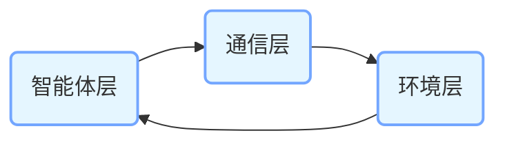
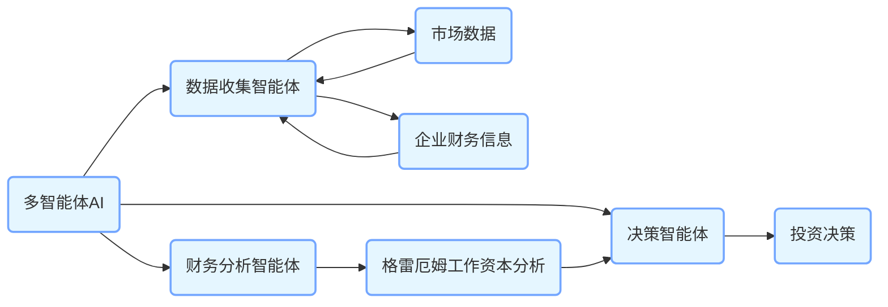

# 多智能体AI如何改进格雷厄姆的工作资本分析

> 关键词：多智能体AI、格雷厄姆工作资本分析、财务分析、人工智能应用、金融决策

> 摘要：本文深入探讨了多智能体AI在改进格雷厄姆工作资本分析中的应用。格雷厄姆的工作资本分析是价值投资领域的重要方法，但在面对复杂多变的市场环境时存在一定局限性。多智能体AI作为先进的人工智能技术，具有强大的信息处理和决策能力。文章首先介绍了相关背景，包括目的、预期读者等；接着阐述了多智能体AI和格雷厄姆工作资本分析的核心概念及联系；详细讲解了相关核心算法原理和操作步骤，并给出数学模型和公式；通过项目实战展示代码实现和解读；分析了实际应用场景；推荐了学习、开发相关的工具和资源；最后总结了未来发展趋势与挑战，并对常见问题进行解答，为多智能体AI在财务分析领域的应用提供了全面的指导。

## 1. 背景介绍 
### 1.1 目的和范围
本文章的主要目的是探索多智能体AI技术如何有效地改进格雷厄姆的工作资本分析方法。格雷厄姆的工作资本分析作为传统财务分析的重要手段，在评估企业价值和投资潜力方面发挥了重要作用。然而，随着市场环境的日益复杂和数据量的爆炸式增长，传统方法面临着诸多挑战。多智能体AI凭借其分布式、协同性和智能决策等特性，有望为工作资本分析带来新的突破。

本文的范围涵盖了多智能体AI和格雷厄姆工作资本分析的基本概念、核心算法原理、数学模型、实际应用案例以及相关工具和资源的推荐。通过理论分析和实际案例相结合，旨在为读者提供全面且深入的理解，帮助他们掌握如何利用多智能体AI改进工作资本分析。

### 1.2 预期读者
本文预期读者主要包括金融分析师、投资者、财务管理人员、人工智能研究人员以及对金融与人工智能交叉领域感兴趣的专业人士。对于金融从业者，文章可以帮助他们在工作中引入先进的AI技术，提升财务分析的准确性和效率；对于AI研究人员，本文提供了一个将多智能体AI应用于实际金融场景的案例，为进一步的研究提供思路。

### 1.3 文档结构概述
本文将按照以下结构展开：首先介绍核心概念与联系，包括多智能体AI和格雷厄姆工作资本分析的原理和架构；接着详细阐述核心算法原理和具体操作步骤，并给出Python源代码示例；然后介绍相关的数学模型和公式，并通过举例进行说明；之后通过项目实战展示代码实现和详细解读；分析实际应用场景；推荐学习和开发所需的工具和资源；总结未来发展趋势与挑战；最后对常见问题进行解答，并提供扩展阅读和参考资料。

### 1.4 术语表
#### 1.4.1 核心术语定义
- **多智能体AI（Multi - Agent AI）**：由多个智能体组成的人工智能系统，每个智能体具有自主决策能力，能够通过与其他智能体和环境进行交互来完成特定任务。
- **格雷厄姆工作资本分析（Graham's Working Capital Analysis）**：由本杰明·格雷厄姆提出的一种财务分析方法，主要通过分析企业的流动资产、流动负债等指标来评估企业的财务健康状况和投资价值。
- **工作资本（Working Capital）**：企业的流动资产减去流动负债后的余额，反映了企业短期运营的资金状况。

#### 1.4.2 相关概念解释
- **智能体（Agent）**：在多智能体AI中，智能体是一个具有感知、决策和行动能力的实体。它可以是软件程序、机器人或其他具有智能行为的对象。
- **协同决策（Collaborative Decision - Making）**：多个智能体通过相互协作和信息共享，共同做出决策的过程。在多智能体AI中，协同决策可以提高决策的准确性和效率。
- **价值投资（Value Investing）**：一种投资策略，强调通过分析企业的内在价值来选择被低估的股票进行投资。格雷厄姆的工作资本分析是价值投资的重要工具之一。

#### 1.4.3 缩略词列表
- **AI**：Artificial Intelligence，人工智能
- **MAI**：Multi - Agent AI，多智能体AI
- **WC**：Working Capital，工作资本

## 2. 核心概念与联系 

### 2.1 多智能体AI的原理和架构
多智能体AI系统由多个智能体组成，每个智能体具有一定的自主性和智能性。智能体可以感知环境中的信息，并根据自身的目标和规则做出决策和行动。智能体之间通过通信机制进行信息交换和协作，以实现整个系统的目标。

其架构通常包括以下几个部分：
- **智能体层**：包含多个智能体，每个智能体负责特定的任务，如数据收集、分析、决策等。
- **通信层**：负责智能体之间的信息传递和交互，确保智能体能够共享数据和协调行动。
- **环境层**：智能体所处的外部环境，包括市场数据、企业财务信息等。

下面是一个简单的多智能体AI架构的Mermaid流程图：


### 2.2 格雷厄姆工作资本分析的原理
格雷厄姆工作资本分析的核心思想是通过分析企业的流动资产和流动负债来评估企业的短期偿债能力和财务健康状况。其主要指标包括：
- **净流动资产（Net Current Assets）**：流动资产减去流动负债后的余额，反映了企业在短期运营中可自由支配的资金。
- **流动比率（Current Ratio）**：流动资产与流动负债的比值，衡量企业短期偿债能力的强弱。一般认为，流动比率大于2较为理想。
- **速动比率（Quick Ratio）**：（流动资产 - 存货）与流动负债的比值，更严格地衡量企业的短期偿债能力，因为存货的变现能力相对较弱。

### 2.3 多智能体AI与格雷厄姆工作资本分析的联系
多智能体AI可以在多个方面改进格雷厄姆的工作资本分析：
- **数据处理能力**：多智能体AI可以同时处理大量的市场数据和企业财务信息，包括不同行业、不同时期的数据，从而为工作资本分析提供更全面、准确的信息。
- **动态分析**：传统的工作资本分析往往是静态的，而多智能体AI可以实时监测市场变化和企业财务状况的动态变化，及时调整分析结果和投资建议。
- **协同决策**：多个智能体可以通过协同工作，从不同角度对企业的工作资本进行分析，提高分析的准确性和可靠性。例如，一个智能体负责收集市场数据，另一个智能体负责分析企业财务指标，它们通过信息共享和协作，共同做出投资决策。

下面是多智能体AI改进格雷厄姆工作资本分析的Mermaid流程图：


## 3. 核心算法原理 & 具体操作步骤 

### 3.1 核心算法原理
在多智能体AI改进格雷厄姆工作资本分析中，主要涉及以下几种算法：
- **数据挖掘算法**：用于从大量的市场数据和企业财务信息中提取有价值的信息。例如，关联规则挖掘可以发现不同财务指标之间的关联关系，聚类算法可以将企业按照财务特征进行分类。
- **机器学习算法**：用于建立预测模型，预测企业的财务状况和市场趋势。常见的机器学习算法包括线性回归、逻辑回归、决策树、神经网络等。
- **智能体协作算法**：用于协调多个智能体之间的工作，确保它们能够高效地协作完成分析任务。例如，合同网协议（Contract Net Protocol）可以实现智能体之间的任务分配和协作。

### 3.2 具体操作步骤
以下是使用多智能体AI改进格雷厄姆工作资本分析的具体操作步骤：
1. **数据收集**：使用数据收集智能体从各种数据源（如财经网站、企业年报等）收集市场数据和企业财务信息。
2. **数据预处理**：对收集到的数据进行清洗、转换和归一化处理，以提高数据的质量和可用性。
3. **特征提取**：使用数据挖掘算法从预处理后的数据中提取与工作资本分析相关的特征，如流动资产、流动负债、净利润等。
4. **模型训练**：使用机器学习算法对提取的特征进行训练，建立预测模型。例如，使用线性回归模型预测企业的净流动资产。
5. **智能体协作**：多个智能体通过通信机制进行信息共享和协作，共同对企业的工作资本进行分析。例如，财务分析智能体根据预测模型对企业的财务状况进行评估，决策智能体根据评估结果做出投资决策。
6. **结果评估和反馈**：对分析结果进行评估，根据评估结果调整模型和智能体的参数，以提高分析的准确性和可靠性。

### 3.3 Python源代码示例
以下是一个简单的Python代码示例，展示了如何使用线性回归模型预测企业的净流动资产：

```python
import pandas as pd
from sklearn.model_selection import train_test_split
from sklearn.linear_model import LinearRegression
from sklearn.metrics import mean_squared_error

# 读取数据
data = pd.read_csv('financial_data.csv')

# 提取特征和目标变量
X = data[['流动资产', '流动负债', '净利润']]
y = data['净流动资产']

# 划分训练集和测试集
X_train, X_test, y_train, y_test = train_test_split(X, y, test_size=0.2, random_state=42)

# 创建线性回归模型
model = LinearRegression()

# 训练模型
model.fit(X_train, y_train)

# 预测
y_pred = model.predict(X_test)

# 评估模型
mse = mean_squared_error(y_test, y_pred)
print(f"均方误差: {mse}")
```

## 4. 数学模型和公式 & 详细讲解 & 举例说明 

### 4.1 格雷厄姆工作资本分析的数学模型和公式
- **净流动资产（NCA）**：
$$NCA = CA - CL$$
其中，$CA$ 表示流动资产，$CL$ 表示流动负债。

- **流动比率（CR）**：
$$CR=\frac{CA}{CL}$$

- **速动比率（QR）**：
$$QR=\frac{CA - I}{CL}$$
其中，$I$ 表示存货。

### 4.2 多智能体AI中的数学模型和公式
- **线性回归模型**：
线性回归模型用于预测连续变量，其数学表达式为：
$$y = \beta_0+\beta_1x_1+\beta_2x_2+\cdots+\beta_nx_n+\epsilon$$
其中，$y$ 是目标变量，$x_1,x_2,\cdots,x_n$ 是特征变量，$\beta_0,\beta_1,\cdots,\beta_n$ 是模型的参数，$\epsilon$ 是误差项。

模型的目标是通过最小化误差平方和来估计参数 $\beta$，误差平方和的表达式为：
$$SSE=\sum_{i = 1}^{m}(y_i-\hat{y}_i)^2$$
其中，$y_i$ 是实际值，$\hat{y}_i$ 是预测值，$m$ 是样本数量。

### 4.3 举例说明
假设我们有一家企业的财务数据如下：
| 指标 | 数值 |
| ---- | ---- |
| 流动资产 | 1000万元 |
| 流动负债 | 500万元 |
| 存货 | 200万元 |

则该企业的净流动资产为：
$$NCA = 1000 - 500 = 500\text{万元}$$

流动比率为：
$$CR=\frac{1000}{500}=2$$

速动比率为：
$$QR=\frac{1000 - 200}{500}=1.6$$

现在，我们使用线性回归模型预测该企业下一年的净流动资产。假设我们已经训练好的线性回归模型为：
$$\hat{y}=100 + 0.5x_1+0.3x_2+0.2x_3$$
其中，$x_1$ 表示流动资产，$x_2$ 表示流动负债，$x_3$ 表示净利润。

如果下一年该企业的流动资产预计为1200万元，流动负债预计为600万元，净利润预计为200万元，则预测的净流动资产为：
$$\hat{y}=100 + 0.5\times1200+0.3\times600+0.2\times200$$
$$=100 + 600+180 + 40$$
$$=920\text{万元}$$

## 5. 项目实战：代码实际案例和详细解释说明 

### 5.1  开发环境搭建
在进行项目实战之前，需要搭建开发环境。以下是所需的软件和库：
- **Python**：建议使用Python 3.7及以上版本。
- **开发工具**：可以使用Jupyter Notebook、PyCharm等开发工具。
- **所需库**：需要安装pandas、numpy、scikit - learn等库。可以使用以下命令进行安装：
```bash
pip install pandas numpy scikit-learn
```

### 5.2  源代码详细实现和代码解读
以下是一个完整的Python代码示例，展示了如何使用多智能体AI改进格雷厄姆工作资本分析：

```python
import pandas as pd
from sklearn.model_selection import train_test_split
from sklearn.linear_model import LinearRegression
from sklearn.metrics import mean_squared_error

# 模拟智能体类
class Agent:
    def __init__(self, name):
        self.name = name

    def collect_data(self):
        # 模拟数据收集
        data = pd.read_csv('financial_data.csv')
        return data

    def preprocess_data(self, data):
        # 数据预处理
        data = data.dropna()
        X = data[['流动资产', '流动负债', '净利润']]
        y = data['净流动资产']
        return X, y

    def train_model(self, X, y):
        # 划分训练集和测试集
        X_train, X_test, y_train, y_test = train_test_split(X, y, test_size=0.2, random_state=42)

        # 创建线性回归模型
        model = LinearRegression()

        # 训练模型
        model.fit(X_train, y_train)

        # 预测
        y_pred = model.predict(X_test)

        # 评估模型
        mse = mean_squared_error(y_test, y_pred)
        print(f"{self.name} 训练的模型均方误差: {mse}")
        return model

    def make_decision(self, model, new_data):
        # 做出决策
        prediction = model.predict(new_data)
        if prediction[0] > 0:
            print(f"{self.name} 建议买入")
        else:
            print(f"{self.name} 建议卖出")

# 创建智能体
data_collector = Agent('数据收集智能体')
analyzer = Agent('财务分析智能体')
decision_maker = Agent('决策智能体')

# 数据收集
data = data_collector.collect_data()

# 数据预处理
X, y = analyzer.preprocess_data(data)

# 模型训练
model = analyzer.train_model(X, y)

# 模拟新数据
new_data = pd.DataFrame([[1200, 600, 200]], columns=['流动资产', '流动负债', '净利润'])

# 做出决策
decision_maker.make_decision(model, new_data)
```

### 5.3  代码解读与分析
- **智能体类（Agent）**：定义了一个智能体类，包含数据收集、数据预处理、模型训练和决策等方法。每个智能体可以独立完成特定的任务。
- **数据收集（collect_data）**：模拟从CSV文件中读取财务数据。
- **数据预处理（preprocess_data）**：对收集到的数据进行清洗，去除缺失值，并提取特征和目标变量。
- **模型训练（train_model）**：使用线性回归模型对数据进行训练，并评估模型的均方误差。
- **决策（make_decision）**：根据训练好的模型对新数据进行预测，并根据预测结果做出买入或卖出的决策。

通过这种方式，多个智能体可以协同工作，完成格雷厄姆工作资本分析和投资决策。

## 6. 实际应用场景 
### 6.1 投资决策
在投资领域，多智能体AI改进的格雷厄姆工作资本分析可以帮助投资者更准确地评估企业的价值和投资潜力。投资者可以使用多智能体系统实时监测市场数据和企业财务状况，根据分析结果做出投资决策。例如，当多智能体系统预测某企业的净流动资产将增加时，投资者可以考虑买入该企业的股票。

### 6.2 企业财务风险管理
企业可以使用多智能体AI改进的工作资本分析来管理财务风险。通过实时监测企业的流动资产、流动负债等指标，企业可以及时发现潜在的财务风险，并采取相应的措施进行调整。例如，当多智能体系统发现企业的流动比率下降时，企业可以采取措施增加流动资产或减少流动负债，以提高短期偿债能力。

### 6.3 行业分析
多智能体AI可以对整个行业的企业进行工作资本分析，帮助分析师了解行业的整体财务状况和发展趋势。分析师可以通过比较不同企业的工作资本指标，发现行业中的优势企业和潜在风险。例如，在某个行业中，如果大部分企业的流动比率都较低，说明该行业可能存在短期偿债压力较大的问题。

## 7. 工具和资源推荐
### 7.1 学习资源推荐
#### 7.1.1 书籍推荐
- 《人工智能：一种现代的方法》：全面介绍了人工智能的基本概念、算法和应用，是学习人工智能的经典教材。
- 《Python数据分析实战》：详细介绍了如何使用Python进行数据分析，包括数据处理、可视化和机器学习等方面的内容。
- 《聪明的投资者》：本杰明·格雷厄姆的经典著作，深入阐述了价值投资的理念和方法，是学习格雷厄姆工作资本分析的必读之书。

#### 7.1.2 在线课程
- Coursera上的“人工智能基础”课程：由知名高校教授授课，系统介绍了人工智能的基本原理和算法。
- edX上的“Python数据科学导论”课程：帮助学习者掌握Python在数据科学领域的应用。
- Udemy上的“金融数据分析与投资决策”课程：结合金融领域的实际案例，介绍数据分析和投资决策的方法。

#### 7.1.3 技术博客和网站
- Medium：有许多关于人工智能和金融分析的优质博客文章，涵盖了最新的技术和研究成果。
- Towards Data Science：专注于数据科学和人工智能领域的技术分享和讨论。
- Seeking Alpha：提供金融市场的分析和评论，包括企业财务分析和投资建议。

### 7.2 开发工具框架推荐
#### 7.2.1 IDE和编辑器
- PyCharm：功能强大的Python集成开发环境，提供代码编辑、调试、版本控制等功能。
- Jupyter Notebook：交互式的开发环境，适合进行数据分析和模型实验。
- Visual Studio Code：轻量级的代码编辑器，支持多种编程语言和插件扩展。

#### 7.2.2 调试和性能分析工具
- PDB：Python自带的调试工具，可以帮助开发者定位和解决代码中的问题。
- cProfile：Python的性能分析工具，可以分析代码的运行时间和内存使用情况。
- TensorBoard：用于可视化深度学习模型的训练过程和性能指标。

#### 7.2.3 相关框架和库
- Pandas：用于数据处理和分析的Python库，提供了高效的数据结构和数据操作方法。
- NumPy：Python的数值计算库，支持多维数组和矩阵运算。
- Scikit - learn：机器学习库，提供了丰富的机器学习算法和工具，用于模型训练和评估。

### 7.3 相关论文著作推荐
#### 7.3.1 经典论文
- “Multi - Agent Systems: A Modern Approach to Distributed Artificial Intelligence”：介绍了多智能体系统的基本概念、架构和算法，是多智能体AI领域的经典论文。
- “The Intelligent Investor”：本杰明·格雷厄姆的原著论文，阐述了价值投资的理论和方法。

#### 7.3.2 最新研究成果
- 在IEEE Transactions on Intelligent Systems、Artificial Intelligence等期刊上可以找到多智能体AI和金融分析领域的最新研究成果。

#### 7.3.3 应用案例分析
- 一些金融科技公司和研究机构会发布关于多智能体AI在金融分析中的应用案例，可以通过它们的官方网站或相关报告进行查阅。

## 8. 总结：未来发展趋势与挑战
### 8.1 未来发展趋势
- **更强大的数据分析能力**：随着数据量的不断增加和计算能力的提升，多智能体AI将具备更强大的数据分析能力，能够处理更复杂的市场数据和企业财务信息。
- **与其他技术的融合**：多智能体AI将与区块链、物联网等技术深度融合，为金融分析和决策提供更全面、准确的信息。例如，区块链技术可以保证数据的安全性和不可篡改，物联网技术可以实时收集企业的生产和运营数据。
- **个性化的投资建议**：多智能体AI可以根据投资者的风险偏好、投资目标等因素，提供个性化的投资建议，提高投资决策的准确性和效率。

### 8.2 挑战
- **数据质量和隐私问题**：多智能体AI需要大量的高质量数据进行训练和分析，但数据质量和隐私问题是目前面临的主要挑战之一。如何保证数据的准确性、完整性和安全性，以及如何保护用户的隐私，是需要解决的重要问题。
- **智能体协作的复杂性**：多个智能体之间的协作需要有效的通信和协调机制，但在实际应用中，智能体协作的复杂性可能会导致系统的效率降低和决策失误。如何设计高效的智能体协作算法，是多智能体AI发展的关键问题之一。
- **法律法规和监管问题**：多智能体AI在金融领域的应用涉及到法律法规和监管问题。如何确保多智能体AI系统的合法合规运行，以及如何对其进行有效的监管，是需要解决的重要问题。

## 9. 附录：常见问题与解答
### 9.1 多智能体AI是否可以完全替代人类进行财务分析？
目前来看，多智能体AI还不能完全替代人类进行财务分析。虽然多智能体AI具有强大的数据处理和分析能力，但在一些方面还存在局限性，如对复杂经济环境的理解、对企业战略和文化的评估等。人类分析师具有丰富的经验和判断力，可以在多智能体AI的分析结果基础上进行综合判断和决策。

### 9.2 如何确保多智能体AI系统的可靠性和稳定性？
为了确保多智能体AI系统的可靠性和稳定性，可以采取以下措施：
- **数据质量控制**：对输入的数据进行严格的质量控制，确保数据的准确性和完整性。
- **模型评估和验证**：对训练好的模型进行充分的评估和验证，确保模型的性能和可靠性。
- **智能体协作机制设计**：设计合理的智能体协作机制，确保多个智能体之间能够高效地协作和通信。
- **系统监控和维护**：对多智能体AI系统进行实时监控和维护，及时发现和解决系统中出现的问题。

### 9.3 多智能体AI在金融分析中的应用成本高吗？
多智能体AI在金融分析中的应用成本取决于多个因素，如数据采集成本、计算资源成本、模型开发成本等。一般来说，随着技术的不断发展和普及，多智能体AI的应用成本会逐渐降低。同时，多智能体AI可以提高财务分析的效率和准确性，为企业和投资者带来更大的收益，从长远来看，其应用成本是值得的。

## 10. 扩展阅读 & 参考资料
### 10.1 扩展阅读
- 《多智能体系统导论》：深入介绍了多智能体系统的理论和应用，适合进一步学习多智能体AI的读者。
- 《财务报表分析与证券定价》：详细介绍了财务报表分析的方法和技巧，以及如何将其应用于证券定价。

### 10.2 参考资料
- 相关的学术论文和研究报告，如IEEE Transactions on Intelligent Systems、Journal of Financial Economics等期刊上的文章。
- 财经网站和数据库，如Wind、Bloomberg等，提供了丰富的市场数据和企业财务信息。

作者：AI天才研究院/AI Genius Institute & 禅与计算机程序设计艺术 /Zen And The Art of Computer Programming