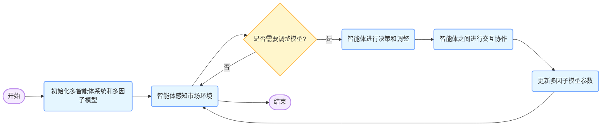

# 多智能体优化价值投资的多因子模型自适应调整

> 关键词：多智能体系统、价值投资、多因子模型、自适应调整、优化算法

> 摘要：本文聚焦于多智能体优化价值投资的多因子模型自适应调整这一前沿课题。在价值投资领域，多因子模型是常用的分析工具，但传统模型往往缺乏动态适应性。多智能体系统凭借其分布式、自主性和协作性的特点，为多因子模型的自适应调整提供了新的思路和方法。文章深入探讨了多智能体系统与多因子模型的核心概念及联系，详细阐述了核心算法原理、数学模型和公式，并结合项目实战给出了代码实现和案例分析。同时，介绍了该技术在实际投资场景中的应用，推荐了相关的学习资源、开发工具和论文著作。最后，对未来发展趋势与挑战进行了总结，旨在为投资者和研究者提供全面而深入的技术指导。

## 1. 背景介绍 
### 1.1 目的和范围
在金融市场中，价值投资一直是投资者追求长期稳定回报的重要策略。多因子模型通过综合考虑多个影响资产价格的因素，能够更全面地评估资产的价值和风险。然而，金融市场环境复杂多变，传统的多因子模型往往难以实时适应市场变化，导致模型的有效性和准确性下降。本文的目的是引入多智能体系统对多因子模型进行优化，实现模型的自适应调整，以提高价值投资决策的准确性和有效性。

本文的研究范围涵盖了多智能体系统的基本原理、多因子模型的构建与应用、多智能体优化多因子模型的算法设计、数学模型的建立与分析，以及在实际投资场景中的应用案例等方面。

### 1.2 预期读者
本文预期读者包括金融领域的投资者、投资分析师、金融科技从业者，以及计算机科学和人工智能领域对金融应用感兴趣的研究者和开发者。对于投资者和分析师而言，本文提供了一种创新的投资决策方法和技术手段；对于研究者和开发者来说，本文为多智能体系统在金融领域的应用提供了理论基础和实践案例。

### 1.3 文档结构概述
本文共分为十个部分。第一部分为背景介绍，阐述了研究的目的、范围、预期读者和文档结构。第二部分介绍多智能体系统和多因子模型的核心概念及联系，并给出相应的文本示意图和 Mermaid 流程图。第三部分详细讲解多智能体优化多因子模型的核心算法原理，并使用 Python 源代码进行阐述。第四部分建立数学模型和公式，并进行详细讲解和举例说明。第五部分通过项目实战，给出代码实际案例和详细解释说明。第六部分探讨该技术在实际投资场景中的应用。第七部分推荐相关的学习资源、开发工具和论文著作。第八部分总结未来发展趋势与挑战。第九部分为附录，解答常见问题。第十部分提供扩展阅读和参考资料。

### 1.4 术语表
#### 1.4.1 核心术语定义
- **多智能体系统（Multi-Agent System，MAS）**：由多个智能体组成的系统，每个智能体具有一定的自主性和智能，能够感知环境、做出决策并与其他智能体进行交互协作，以实现系统的整体目标。
- **价值投资（Value Investing）**：一种投资策略，投资者通过分析资产的内在价值，寻找被市场低估的资产进行投资，以期在长期获得超过市场平均水平的回报。
- **多因子模型（Multi-Factor Model）**：一种用于解释资产收益率的模型，该模型认为资产的收益率受到多个因子的共同影响，通过建立因子与资产收益率之间的关系，来评估资产的价值和风险。
- **自适应调整（Adaptive Adjustment）**：系统根据环境的变化自动调整自身的参数或结构，以保持良好的性能和适应性。

#### 1.4.2 相关概念解释
- **智能体（Agent）**：具有感知、决策和行动能力的实体，能够在一定的环境中自主地执行任务。在多智能体系统中，智能体可以是软件程序、机器人等。
- **因子（Factor）**：影响资产收益率的各种因素，如市场风险、公司盈利、估值水平等。因子可以分为宏观因子和微观因子。
- **模型有效性（Model Validity）**：模型能够准确地描述和预测实际情况的程度。在多因子模型中，模型有效性表现为模型对资产收益率的解释能力和预测能力。

#### 1.4.3 缩略词列表
- MAS：Multi-Agent System，多智能体系统
- CAPM：Capital Asset Pricing Model，资本资产定价模型
- FFC：Fama-French-Carhart 四因子模型

## 2. 核心概念与联系 

### 2.1 多智能体系统的原理和架构
多智能体系统由多个智能体组成，每个智能体具有自己的目标、知识和能力。智能体通过感知环境获取信息，并根据自身的决策规则做出行动。智能体之间可以通过通信进行交互协作，以实现系统的整体目标。

多智能体系统的架构可以分为集中式架构、分布式架构和混合式架构。集中式架构中，有一个中央控制节点负责协调和管理所有智能体的行为；分布式架构中，智能体之间通过平等的通信进行协作，没有中央控制节点；混合式架构则结合了集中式和分布式架构的特点。

下面是多智能体系统的文本示意图：

```plaintext
            +----------------+
            |  环境 （市场）  |
            +----------------+
                  |   ^
                  v   |
 +----------+   +----------+   +----------+
 | 智能体 1 |   | 智能体 2 |   | 智能体 3 |
 +----------+   +----------+   +----------+
       |            |            |
       |            |            |
       +------------+------------+
                    |
                    v
            +----------------+
            |  整体目标 （优化投资）  |
            +----------------+
```

### 2.2 多因子模型的原理和架构
多因子模型认为资产的收益率可以表示为多个因子的线性组合。常见的多因子模型包括资本资产定价模型（CAPM）、Fama-French 三因子模型和 Fama-French-Carhart 四因子模型等。

以 Fama-French-Carhart 四因子模型为例，其公式为：

$$R_{i,t} - R_{f,t} = \alpha_{i} + \beta_{i,MKT}(R_{M,t} - R_{f,t}) + \beta_{i,SMB}SMB_{t} + \beta_{i,HML}HML_{t} + \beta_{i,UMD}UMD_{t} + \epsilon_{i,t}$$

其中，$R_{i,t}$ 是资产 $i$ 在 $t$ 时期的收益率，$R_{f,t}$ 是无风险收益率，$R_{M,t}$ 是市场组合的收益率，$SMB_{t}$ 是规模因子，$HML_{t}$ 是价值因子，$UMD_{t}$ 是动量因子，$\alpha_{i}$ 是资产 $i$ 的超额收益率，$\beta_{i,MKT}$、$\beta_{i,SMB}$、$\beta_{i,HML}$、$\beta_{i,UMD}$ 是资产 $i$ 对各因子的敏感度，$\epsilon_{i,t}$ 是随机误差项。

多因子模型的架构主要包括因子选择、因子数据收集、模型参数估计和模型验证等步骤。

下面是多因子模型的文本示意图：

```plaintext
            +----------------+
            |  因子选择  |
            +----------------+
                  |
                  v
            +----------------+
            |  因子数据收集  |
            +----------------+
                  |
                  v
            +----------------+
            |  模型参数估计  |
            +----------------+
                  |
                  v
            +----------------+
            |  模型验证  |
            +----------------+
```

### 2.3 多智能体系统与多因子模型的联系
多智能体系统可以为多因子模型的自适应调整提供有效的解决方案。每个智能体可以负责一个或多个因子的分析和调整，通过智能体之间的协作，实现多因子模型的整体优化。

智能体可以根据市场环境的变化，实时调整因子的权重和参数，以提高模型的有效性和适应性。同时，智能体之间的交互可以促进信息的共享和知识的传播，使模型能够更好地应对复杂多变的市场情况。

下面是多智能体优化多因子模型的 Mermaid 流程图：



## 3. 核心算法原理 & 具体操作步骤 

### 3.1 多智能体优化算法原理
多智能体优化算法的核心思想是通过多个智能体的协作和竞争，寻找最优的解决方案。在多智能体优化多因子模型中，每个智能体代表一个因子或一组因子，智能体的目标是最大化模型的有效性。

常见的多智能体优化算法包括粒子群优化算法（PSO）、蚁群算法（ACO）和遗传算法（GA）等。这里我们以粒子群优化算法为例进行介绍。

粒子群优化算法模拟了鸟群或鱼群的群体行为，每个粒子代表一个潜在的解决方案，粒子在搜索空间中飞行，通过不断调整自己的位置来寻找最优解。粒子的位置和速度更新公式如下：

$$v_{i}(t + 1) = wv_{i}(t) + c_{1}r_{1}(pbest_{i} - x_{i}(t)) + c_{2}r_{2}(gbest - x_{i}(t))$$

$$x_{i}(t + 1) = x_{i}(t) + v_{i}(t + 1)$$

其中，$v_{i}(t)$ 是粒子 $i$ 在 $t$ 时刻的速度，$x_{i}(t)$ 是粒子 $i$ 在 $t$ 时刻的位置，$w$ 是惯性权重，$c_{1}$ 和 $c_{2}$ 是加速常数，$r_{1}$ 和 $r_{2}$ 是 $[0, 1]$ 之间的随机数，$pbest_{i}$ 是粒子 $i$ 历史上的最优位置，$gbest$ 是整个粒子群历史上的最优位置。

### 3.2 具体操作步骤
下面是使用粒子群优化算法优化多因子模型的具体操作步骤：

1. **初始化**：随机初始化粒子群的位置和速度，每个粒子的位置代表多因子模型的一组参数。
2. **适应度评估**：计算每个粒子的适应度值，适应度值可以定义为多因子模型的有效性指标，如模型的解释能力、预测精度等。
3. **更新个体最优和全局最优**：比较每个粒子的当前适应度值和历史最优适应度值，更新 $pbest_{i}$；比较所有粒子的适应度值，更新 $gbest$。
4. **更新粒子的位置和速度**：根据上述公式更新粒子的位置和速度。
5. **终止条件判断**：判断是否满足终止条件，如达到最大迭代次数或适应度值收敛到一定程度。如果满足终止条件，则输出最优解；否则，返回步骤 2。

### 3.3 Python 源代码实现
```python
import numpy as np

# 定义适应度函数，这里简单假设为目标函数值的相反数
def fitness_function(x):
    # 这里需要根据具体的多因子模型和评估指标进行实现
    return -np.sum(x**2)

# 粒子群优化算法实现
def pso(num_particles, num_dimensions, max_iter):
    # 初始化粒子的位置和速度
    particles_position = np.random.uniform(-10, 10, (num_particles, num_dimensions))
    particles_velocity = np.random.uniform(-1, 1, (num_particles, num_dimensions))

    # 初始化个体最优位置和全局最优位置
    pbest_position = particles_position.copy()
    pbest_fitness = np.array([fitness_function(x) for x in particles_position])
    gbest_index = np.argmax(pbest_fitness)
    gbest_position = pbest_position[gbest_index]
    gbest_fitness = pbest_fitness[gbest_index]

    # 迭代更新
    for _ in range(max_iter):
        for i in range(num_particles):
            # 更新速度
            r1, r2 = np.random.rand(2)
            w = 0.7  # 惯性权重
            c1 = 1.4  # 加速常数
            c2 = 1.4  # 加速常数
            particles_velocity[i] = (w * particles_velocity[i] +
                                     c1 * r1 * (pbest_position[i] - particles_position[i]) +
                                     c2 * r2 * (gbest_position - particles_position[i]))

            # 更新位置
            particles_position[i] += particles_velocity[i]

            # 计算新的适应度值
            new_fitness = fitness_function(particles_position[i])

            # 更新个体最优位置
            if new_fitness > pbest_fitness[i]:
                pbest_fitness[i] = new_fitness
                pbest_position[i] = particles_position[i]

                # 更新全局最优位置
                if new_fitness > gbest_fitness:
                    gbest_fitness = new_fitness
                    gbest_position = particles_position[i]

    return gbest_position, gbest_fitness

# 示例调用
num_particles = 20
num_dimensions = 5
max_iter = 100
best_position, best_fitness = pso(num_particles, num_dimensions, max_iter)
print("最优位置:", best_position)
print("最优适应度值:", best_fitness)
```

## 4. 数学模型和公式 & 详细讲解 & 举例说明 

### 4.1 多因子模型的数学表示
如前文所述，Fama-French-Carhart 四因子模型的公式为：

$$R_{i,t} - R_{f,t} = \alpha_{i} + \beta_{i,MKT}(R_{M,t} - R_{f,t}) + \beta_{i,SMB}SMB_{t} + \beta_{i,HML}HML_{t} + \beta_{i,UMD}UMD_{t} + \epsilon_{i,t}$$

其中，各变量的含义如下：
- $R_{i,t}$：资产 $i$ 在 $t$ 时期的收益率。
- $R_{f,t}$：无风险收益率，通常可以用国债收益率来近似表示。
- $R_{M,t}$：市场组合的收益率，如沪深 300 指数的收益率。
- $SMB_{t}$：规模因子，反映了小市值股票与大市值股票的收益率差异。
- $HML_{t}$：价值因子，反映了高市净率股票与低市净率股票的收益率差异。
- $UMD_{t}$：动量因子，反映了过去表现好的股票与过去表现差的股票的收益率差异。
- $\alpha_{i}$：资产 $i$ 的超额收益率，代表了资产的选股能力。
- $\beta_{i,MKT}$、$\beta_{i,SMB}$、$\beta_{i,HML}$、$\beta_{i,UMD}$：资产 $i$ 对各因子的敏感度，衡量了资产收益率对各因子的变化程度。
- $\epsilon_{i,t}$：随机误差项，反映了除因子之外的其他因素对资产收益率的影响。

### 4.2 多智能体优化的目标函数
多智能体优化的目标是最大化多因子模型的有效性。常用的有效性指标包括模型的解释能力和预测精度。

#### 解释能力指标
可以使用决定系数 $R^{2}$ 来衡量模型的解释能力，其公式为：

$$R^{2} = 1 - \frac{\sum_{t = 1}^{T}\epsilon_{i,t}^{2}}{\sum_{t = 1}^{T}(R_{i,t} - \bar{R}_{i})^{2}}$$

其中，$\bar{R}_{i}$ 是资产 $i$ 的平均收益率，$T$ 是样本数量。$R^{2}$ 的取值范围是 $[0, 1]$，$R^{2}$ 越接近 1，说明模型对资产收益率的解释能力越强。

#### 预测精度指标
可以使用均方误差（MSE）来衡量模型的预测精度，其公式为：

$$MSE = \frac{1}{T}\sum_{t = 1}^{T}(R_{i,t} - \hat{R}_{i,t})^{2}$$

其中，$\hat{R}_{i,t}$ 是模型对资产 $i$ 在 $t$ 时期收益率的预测值。MSE 越小，说明模型的预测精度越高。

多智能体优化的目标函数可以定义为：

$$\max f(\beta) = w_{1}R^{2} - w_{2}MSE$$

其中，$\beta = (\beta_{i,MKT}, \beta_{i,SMB}, \beta_{i,HML}, \beta_{i,UMD})$ 是模型的参数向量，$w_{1}$ 和 $w_{2}$ 是权重系数，用于平衡解释能力和预测精度。

### 4.3 举例说明
假设我们有一个包含 100 只股票的投资组合，我们使用 Fama-French-Carhart 四因子模型来分析这些股票的收益率。我们收集了过去 5 年的月度数据，包括股票的收益率、无风险收益率、市场组合收益率、规模因子、价值因子和动量因子。

首先，我们使用最小二乘法估计模型的参数 $\beta$，得到初始的模型。然后，我们使用粒子群优化算法对模型的参数进行优化，以最大化目标函数 $f(\beta)$。

在优化过程中，每个粒子代表一组模型参数，粒子的适应度值根据目标函数计算。通过不断迭代更新粒子的位置和速度，最终找到最优的模型参数。

假设经过优化后，我们得到的最优参数为 $\beta_{i,MKT} = 1.2$，$\beta_{i,SMB} = 0.8$，$\beta_{i,HML} = 0.6$，$\beta_{i,UMD} = 0.4$。我们可以使用这些参数来预测股票的收益率，并评估模型的有效性。

## 5. 项目实战：代码实际案例和详细解释说明 

### 5.1 开发环境搭建
#### 操作系统
建议使用 Linux 或 macOS 操作系统，因为这些系统在开发和数据分析方面具有较好的兼容性和稳定性。当然，Windows 系统也可以使用，但可能需要进行一些额外的配置。

#### Python 环境
使用 Python 3.7 及以上版本。可以使用 Anaconda 来管理 Python 环境，Anaconda 包含了许多常用的科学计算和数据分析库，方便我们进行开发。

#### 安装必要的库
在命令行中使用以下命令安装必要的库：
```bash
pip install numpy pandas scikit-learn matplotlib
```

### 5.2 源代码详细实现和代码解读
```python
import numpy as np
import pandas as pd
from sklearn.linear_model import LinearRegression
from sklearn.metrics import r2_score, mean_squared_error

# 生成模拟数据
def generate_data(num_samples, num_factors):
    # 生成因子数据
    factors = np.random.randn(num_samples, num_factors)
    # 生成资产收益率数据
    true_beta = np.random.randn(num_factors)
    noise = np.random.randn(num_samples) * 0.1
    returns = np.dot(factors, true_beta) + noise
    return factors, returns

# 初始化多因子模型
def initialize_model(factors, returns):
    model = LinearRegression()
    model.fit(factors, returns)
    return model

# 定义适应度函数
def fitness_function(beta, factors, returns):
    predicted_returns = np.dot(factors, beta)
    r2 = r2_score(returns, predicted_returns)
    mse = mean_squared_error(returns, predicted_returns)
    w1 = 0.5
    w2 = 0.5
    return w1 * r2 - w2 * mse

# 粒子群优化算法实现
def pso(num_particles, num_dimensions, max_iter, factors, returns):
    # 初始化粒子的位置和速度
    particles_position = np.random.uniform(-10, 10, (num_particles, num_dimensions))
    particles_velocity = np.random.uniform(-1, 1, (num_particles, num_dimensions))

    # 初始化个体最优位置和全局最优位置
    pbest_position = particles_position.copy()
    pbest_fitness = np.array([fitness_function(x, factors, returns) for x in particles_position])
    gbest_index = np.argmax(pbest_fitness)
    gbest_position = pbest_position[gbest_index]
    gbest_fitness = pbest_fitness[gbest_index]

    # 迭代更新
    for _ in range(max_iter):
        for i in range(num_particles):
            # 更新速度
            r1, r2 = np.random.rand(2)
            w = 0.7  # 惯性权重
            c1 = 1.4  # 加速常数
            c2 = 1.4  # 加速常数
            particles_velocity[i] = (w * particles_velocity[i] +
                                     c1 * r1 * (pbest_position[i] - particles_position[i]) +
                                     c2 * r2 * (gbest_position - particles_position[i]))

            # 更新位置
            particles_position[i] += particles_velocity[i]

            # 计算新的适应度值
            new_fitness = fitness_function(particles_position[i], factors, returns)

            # 更新个体最优位置
            if new_fitness > pbest_fitness[i]:
                pbest_fitness[i] = new_fitness
                pbest_position[i] = particles_position[i]

                # 更新全局最优位置
                if new_fitness > gbest_fitness:
                    gbest_fitness = new_fitness
                    gbest_position = particles_position[i]

    return gbest_position, gbest_fitness

# 主函数
def main():
    num_samples = 1000
    num_factors = 4
    num_particles = 20
    max_iter = 100

    # 生成数据
    factors, returns = generate_data(num_samples, num_factors)

    # 初始化模型
    model = initialize_model(factors, returns)
    initial_beta = model.coef_
    initial_fitness = fitness_function(initial_beta, factors, returns)
    print("初始参数:", initial_beta)
    print("初始适应度值:", initial_fitness)

    # 使用粒子群优化算法优化模型参数
    best_beta, best_fitness = pso(num_particles, num_factors, max_iter, factors, returns)
    print("最优参数:", best_beta)
    print("最优适应度值:", best_fitness)

if __name__ == "__main__":
    main()
```

### 5.3 代码解读与分析
#### 数据生成部分
`generate_data` 函数用于生成模拟数据，包括因子数据和资产收益率数据。我们使用 `np.random.randn` 函数生成随机数据，并通过线性组合和添加噪声的方式得到资产收益率数据。

#### 模型初始化部分
`initialize_model` 函数使用 `sklearn` 库中的 `LinearRegression` 类来初始化多因子模型。通过调用 `fit` 方法，我们可以使用最小二乘法估计模型的参数。

#### 适应度函数部分
`fitness_function` 函数用于计算粒子的适应度值。我们使用 $R^{2}$ 和 MSE 来衡量模型的解释能力和预测精度，并通过加权求和的方式得到适应度值。

#### 粒子群优化部分
`pso` 函数实现了粒子群优化算法。我们首先初始化粒子的位置和速度，然后迭代更新粒子的位置和速度，直到满足终止条件。在每次迭代中，我们计算粒子的适应度值，并更新个体最优位置和全局最优位置。

#### 主函数部分
`main` 函数是程序的入口，我们在主函数中调用上述函数，完成数据生成、模型初始化和参数优化的过程，并输出初始参数和最优参数以及对应的适应度值。

通过对比初始参数和最优参数的适应度值，我们可以看到粒子群优化算法能够有效地提高多因子模型的有效性。

## 6. 实际应用场景 
### 6.1 投资组合优化
在投资组合优化中，多智能体优化的多因子模型可以帮助投资者更准确地评估资产的价值和风险，从而构建更优的投资组合。通过自适应调整模型的参数，模型能够实时适应市场变化，提高投资组合的收益和稳定性。

例如，投资者可以根据多因子模型的预测结果，调整不同资产的权重，增加被低估资产的持仓比例，减少被高估资产的持仓比例。同时，通过多智能体系统的协作，投资者可以综合考虑多个因子的影响，避免单一因子的局限性。

### 6.2 风险管理
多智能体优化的多因子模型可以用于风险管理，帮助投资者识别和评估投资组合的风险。通过分析不同因子对资产收益率的影响，投资者可以了解投资组合的风险来源，并采取相应的措施进行风险控制。

例如，当市场风险因子发生变化时，模型可以及时调整因子的权重，以降低投资组合对市场风险的暴露。同时，多智能体系统可以实时监测市场环境的变化，提前预警潜在的风险。

### 6.3 量化投资策略开发
量化投资策略开发需要依赖准确的市场预测模型。多智能体优化的多因子模型可以为量化投资策略提供更精确的预测结果，从而提高策略的盈利能力。

例如，投资者可以根据多因子模型的预测结果，开发基于因子选股、因子择时等策略。通过不断优化模型的参数，投资者可以提高策略的适应性和稳定性，在不同的市场环境中获得更好的收益。

## 7. 工具和资源推荐
### 7.1 学习资源推荐
#### 7.1.1 书籍推荐
- 《智能系统中的多Agent建模与仿真》：本书全面介绍了多智能体系统的基本原理、建模方法和仿真技术，是学习多智能体系统的经典教材。
- 《金融计量学：从初级到高级建模技术》：该书详细讲解了金融计量学的各种模型和方法，包括多因子模型的构建和应用，适合金融领域的研究者和从业者阅读。
- 《Python金融数据分析实战》：本书结合 Python 编程语言，介绍了金融数据分析的常用方法和工具，包括数据处理、模型建立和可视化等，对金融科技从业者有很大的帮助。

#### 7.1.2 在线课程
- Coursera 上的“Multi-Agent Systems”课程：该课程由知名高校的教授授课，系统地介绍了多智能体系统的理论和实践，提供了丰富的案例和实验。
- edX 上的“Financial Engineering and Risk Management”课程：该课程涵盖了金融工程和风险管理的各个方面，包括多因子模型的应用和风险管理策略的制定。
- 中国大学 MOOC 上的“Python 金融大数据分析”课程：该课程结合 Python 语言，详细讲解了金融大数据分析的方法和技巧，适合初学者学习。

#### 7.1.3 技术博客和网站
- Towards Data Science：这是一个专注于数据科学和机器学习的技术博客，上面有很多关于金融数据分析和多智能体系统应用的文章。
- QuantNet：这是一个量化投资领域的专业社区，提供了丰富的量化投资知识、研究报告和交流平台。
- 金融界网站：该网站提供了大量的金融数据和资讯，以及金融分析工具和模型，对金融从业者和投资者有很大的帮助。

### 7.2 开发工具框架推荐
#### 7.2.1 IDE和编辑器
- PyCharm：这是一款功能强大的 Python 集成开发环境，提供了代码编辑、调试、版本控制等功能，适合 Python 开发者使用。
- Jupyter Notebook：这是一个交互式的开发环境，支持多种编程语言，适合数据科学家和分析师进行数据探索和模型实验。
- Visual Studio Code：这是一款轻量级的代码编辑器，支持多种编程语言和插件，具有良好的扩展性和用户体验。

#### 7.2.2 调试和性能分析工具
- pdb：这是 Python 自带的调试工具，可以帮助开发者定位代码中的问题和错误。
- cProfile：这是 Python 自带的性能分析工具，可以分析代码的运行时间和函数调用情况，帮助开发者优化代码性能。
- Py-Spy：这是一个第三方的性能分析工具，可以实时监测 Python 程序的运行状态，找出性能瓶颈。

#### 7.2.3 相关框架和库
- NumPy：这是 Python 中用于科学计算的基础库，提供了高效的数组操作和数学函数。
- Pandas：这是一个用于数据处理和分析的库，提供了数据结构和数据分析工具，方便开发者处理和分析金融数据。
- Scikit-learn：这是一个用于机器学习的库，提供了各种机器学习算法和工具，包括线性回归、逻辑回归、决策树等，适合用于多因子模型的构建和优化。

### 7.3 相关论文著作推荐
#### 7.3.1 经典论文
- Fama, E. F., & French, K. R. (1993). Common risk factors in the returns on stocks and bonds. *Journal of Financial Economics*, 33(1), 3-56. 这篇论文提出了 Fama-French 三因子模型，是多因子模型领域的经典之作。
- Carhart, M. M. (1997). On persistence in mutual fund performance. *The Journal of Finance*, 52(1), 57-82. 这篇论文在 Fama-French 三因子模型的基础上加入了动量因子，提出了 Fama-French-Carhart 四因子模型。
- Shoham, Y. (1993). Agent-oriented programming. *Artificial Intelligence*, 60(1), 51-92. 这篇论文提出了面向智能体编程的概念，为多智能体系统的发展奠定了基础。

#### 7.3.2 最新研究成果
- 在 IEEE Transactions on Intelligent Systems、Journal of Financial Economics 等学术期刊上，经常发表关于多智能体系统和多因子模型的最新研究成果。可以关注这些期刊，了解该领域的最新动态。
- 每年的国际人工智能联合会议（IJCAI）、国际多智能体系统会议（AAMAS）等学术会议上，也有很多关于多智能体系统应用于金融领域的研究报告。

#### 7.3.3 应用案例分析
- 《量化投资：策略与技术》：该书介绍了量化投资的各种策略和技术，包括多因子模型的应用案例和实证分析，对量化投资者有很大的参考价值。
- 《金融科技前沿：多智能体系统在金融市场中的应用》：这本书详细介绍了多智能体系统在金融市场中的各种应用案例，包括投资组合优化、风险管理等，适合金融科技从业者阅读。

## 8. 总结：未来发展趋势与挑战
### 8.1 未来发展趋势
#### 与深度学习的融合
随着深度学习技术的不断发展，多智能体优化的多因子模型有望与深度学习相结合。深度学习可以自动提取数据中的复杂特征，提高模型的预测能力。通过将深度学习模型与多智能体系统相结合，可以实现更智能、更自适应的投资决策。

#### 应用于更多金融场景
除了投资组合优化和风险管理，多智能体优化的多因子模型还可以应用于更多的金融场景，如信用评级、金融市场预测等。通过不断拓展应用领域，该技术将为金融行业带来更多的创新和发展。

#### 跨领域融合
多智能体系统和多因子模型涉及计算机科学、金融学、数学等多个领域。未来，该技术将与其他领域进行更深入的融合，如与物理学中的复杂系统理论相结合，进一步提高模型的解释能力和预测精度。

### 8.2 挑战
#### 数据质量和可用性
多智能体优化的多因子模型需要大量的高质量数据作为支撑。然而，金融数据往往存在噪声、缺失值等问题，数据的质量和可用性对模型的性能有很大的影响。因此，如何提高数据的质量和可用性是一个亟待解决的问题。

#### 模型复杂度和可解释性
随着模型的不断发展，模型的复杂度也在不断增加。复杂的模型虽然可以提高预测能力，但也会降低模型的可解释性。在金融领域，模型的可解释性非常重要，因为投资者需要了解模型的决策依据。因此，如何在提高模型性能的同时保持模型的可解释性是一个挑战。

#### 计算资源和效率
多智能体优化算法通常需要大量的计算资源和时间。在实际应用中，如何提高算法的计算效率，减少计算时间，是一个需要解决的问题。特别是在处理大规模金融数据时，计算资源和效率的问题更加突出。

## 9. 附录：常见问题与解答
### 9.1 多智能体系统与传统优化算法有什么区别？
多智能体系统具有分布式、自主性和协作性的特点，与传统优化算法相比，它能够更好地适应复杂多变的环境。传统优化算法通常是集中式的，需要一个中心控制器来协调和管理整个优化过程；而多智能体系统中的每个智能体都可以自主地做出决策，并与其他智能体进行协作，共同完成优化任务。

### 9.2 多因子模型中的因子是如何选择的？
因子的选择通常基于理论分析和实证研究。理论分析可以从经济学、金融学等角度出发，找出可能影响资产收益率的因素；实证研究则通过对历史数据的分析，验证这些因素与资产收益率之间的关系。常见的因子选择方法包括逐步回归法、主成分分析法等。

### 9.3 粒子群优化算法的参数如何调整？
粒子群优化算法的参数包括惯性权重 $w$、加速常数 $c_{1}$ 和 $c_{2}$ 等。这些参数的调整通常需要根据具体的问题和实验结果进行。一般来说，惯性权重 $w$ 可以控制粒子的搜索范围，较大的 $w$ 可以使粒子更快地搜索整个空间，较小的 $w$ 可以使粒子更专注于局部搜索；加速常数 $c_{1}$ 和 $c_{2}$ 可以控制粒子向个体最优位置和全局最优位置的收敛速度。

### 9.4 多智能体优化的多因子模型在实际应用中需要注意什么？
在实际应用中，需要注意以下几点：
- 数据质量：确保数据的准确性和完整性，对数据进行清洗和预处理。
- 模型验证：在使用模型进行决策之前，需要对模型进行充分的验证和评估，确保模型的有效性和稳定性。
- 风险控制：虽然多智能体优化的多因子模型可以提高投资决策的准确性，但仍然存在一定的风险。因此，需要建立完善的风险控制机制，降低投资风险。

## 10. 扩展阅读 & 参考资料
### 扩展阅读
- 《复杂系统与金融市场》：本书介绍了复杂系统理论在金融市场中的应用，对理解多智能体系统和金融市场的相互作用有很大的帮助。
- 《人工智能与金融科技》：该书探讨了人工智能技术在金融科技领域的应用和发展趋势，为多智能体优化的多因子模型的研究提供了更广阔的视野。

### 参考资料
- Fama, E. F., & French, K. R. (1993). Common risk factors in the returns on stocks and bonds. *Journal of Financial Economics*, 33(1), 3-56.
- Carhart, M. M. (1997). On persistence in mutual fund performance. *The Journal of Finance*, 52(1), 57-82.
- Shoham, Y. (1993). Agent-oriented programming. *Artificial Intelligence*, 60(1), 51-92.
- Kennedy, J., & Eberhart, R. C. (1995, November). Particle swarm optimization. In *Proceedings of ICNN'95 - International Conference on Neural Networks* (Vol. 4, pp. 1942-1948). IEEE.

作者：AI天才研究院/AI Genius Institute & 禅与计算机程序设计艺术 /Zen And The Art of Computer Programming