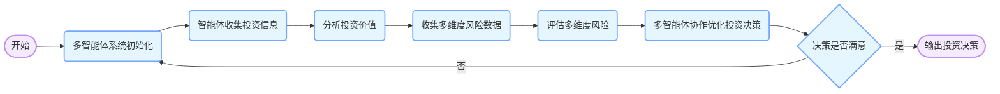

# 多智能体优化价值投资的多维度风险评估模型

> 关键词：多智能体系统、价值投资、多维度风险评估、优化模型、金融风险

> 摘要：本文聚焦于多智能体优化价值投资的多维度风险评估模型。首先介绍了该研究的背景，包括目的、预期读者、文档结构和相关术语。接着阐述了核心概念，如多智能体系统、价值投资和多维度风险评估，并给出了相应的原理和架构示意图及流程图。详细讲解了核心算法原理，通过Python代码进行说明。同时给出了数学模型和公式，并举例解释。在项目实战部分，展示了开发环境搭建、源代码实现与解读。分析了该模型的实际应用场景，推荐了学习资源、开发工具框架和相关论文著作。最后总结了未来发展趋势与挑战，解答了常见问题，并提供了扩展阅读和参考资料。旨在为价值投资中的风险评估提供一种有效的多智能体优化方法，助力投资者更好地管理风险。

## 1. 背景介绍 
### 1.1 目的和范围
在价值投资领域，准确评估风险是至关重要的。传统的风险评估方法往往只考虑单一维度的因素，难以全面反映投资过程中的复杂风险。本研究的目的是构建一个多智能体优化的多维度风险评估模型，综合考虑多种因素，如市场风险、信用风险、流动性风险等，以提高风险评估的准确性和可靠性。

本研究的范围涵盖了多智能体系统的设计与应用、多维度风险指标的选取与量化、优化算法的选择与实现等方面。通过对这些方面的研究，开发出一个实用的风险评估模型，并通过实际案例进行验证。

### 1.2 预期读者
本文的预期读者包括金融领域的投资者、投资顾问、风险管理人员，以及计算机科学和人工智能领域对金融应用感兴趣的研究人员和开发者。对于投资者和风险管理人员来说，本文提供了一种新的风险评估方法和工具，有助于他们做出更明智的投资决策。对于研究人员和开发者来说，本文的技术细节和算法实现可以为他们的研究和开发工作提供参考。

### 1.3 文档结构概述
本文的结构如下：首先介绍研究的背景，包括目的、预期读者和文档结构。接着阐述核心概念，包括多智能体系统、价值投资和多维度风险评估，并给出相应的原理和架构示意图及流程图。然后详细讲解核心算法原理，通过Python代码进行说明。随后给出数学模型和公式，并举例解释。在项目实战部分，展示开发环境搭建、源代码实现与解读。分析该模型的实际应用场景，推荐学习资源、开发工具框架和相关论文著作。最后总结未来发展趋势与挑战，解答常见问题，并提供扩展阅读和参考资料。

### 1.4 术语表
#### 1.4.1 核心术语定义
- **多智能体系统（Multi - Agent System，MAS）**：由多个智能体组成的系统，每个智能体具有自主决策和交互的能力，通过智能体之间的协作来完成复杂的任务。
- **价值投资（Value Investing）**：一种投资策略，投资者通过分析股票的内在价值，寻找被低估的股票进行投资，以获取长期的投资回报。
- **多维度风险评估（Multi - Dimensional Risk Assessment）**：综合考虑多个维度的风险因素，如市场风险、信用风险、流动性风险等，对投资风险进行全面评估的方法。

#### 1.4.2 相关概念解释
- **市场风险（Market Risk）**：由于市场因素的变化，如股票价格波动、利率变动、汇率波动等，导致投资价值发生变化的风险。
- **信用风险（Credit Risk）**：指借款人或交易对手未能履行合同义务而导致投资者遭受损失的风险。
- **流动性风险（Liquidity Risk）**：指投资者在需要变现资产时，无法以合理的价格及时卖出资产的风险。

#### 1.4.3 缩略词列表
- MAS：Multi - Agent System（多智能体系统）
- VAR：Value at Risk（风险价值）
- CVAR：Conditional Value at Risk（条件风险价值）

## 2. 核心概念与联系 
### 核心概念原理
#### 多智能体系统原理
多智能体系统由多个智能体组成，每个智能体可以看作是一个具有自主决策能力的个体。智能体之间通过通信和协作来完成系统的整体目标。智能体具有感知环境、处理信息、做出决策和执行动作的能力。在多智能体系统中，智能体的行为可以分为个体行为和群体行为。个体行为是指单个智能体根据自身的目标和环境信息做出的决策和行动；群体行为是指多个智能体通过协作和交互形成的整体行为。

#### 价值投资原理
价值投资的核心思想是寻找被市场低估的股票。投资者通过分析公司的财务报表、行业前景、管理层能力等因素，评估公司的内在价值。如果股票的市场价格低于其内在价值，投资者认为该股票具有投资价值，从而进行买入操作。价值投资强调长期投资，通过持有被低估的股票，等待市场对其价值的重新发现，从而获得投资回报。

#### 多维度风险评估原理
多维度风险评估综合考虑多个维度的风险因素，以全面评估投资风险。不同维度的风险因素相互关联、相互影响，单一维度的风险评估无法准确反映投资的真实风险。例如，市场风险可能会影响公司的盈利能力，进而影响信用风险；流动性风险可能会加剧市场风险和信用风险的影响。因此，多维度风险评估需要建立一个综合的评估体系，对各个维度的风险因素进行量化和分析。

### 架构的文本示意图
```plaintext
多智能体优化价值投资的多维度风险评估模型架构

|----------------------|
| 多智能体系统         |
|----------------------|
| 智能体1              |
| 智能体2              |
|...                  |
| 智能体n              |
|----------------------|
| 与价值投资交互       |
|----------------------|
| 收集投资信息         |
| 分析投资价值         |
|----------------------|
| 与多维度风险评估交互 |
|----------------------|
| 收集风险数据         |
| 评估多维度风险       |
|----------------------|
| 优化投资决策         |
|----------------------|
```

### Mermaid 流程图


## 3. 核心算法原理 & 具体操作步骤 
### 核心算法原理
本模型采用多智能体协作优化算法来进行价值投资的多维度风险评估。每个智能体负责不同的任务，如收集市场数据、分析公司财务报表、评估特定维度的风险等。智能体之间通过通信和协作，共享信息和决策结果，以实现整体的优化目标。

具体来说，我们使用粒子群优化（PSO）算法作为智能体协作的基础。粒子群优化算法是一种基于群体智能的优化算法，通过模拟鸟群或鱼群的群体行为来寻找最优解。在本模型中，每个智能体可以看作是一个粒子，其位置表示投资决策，速度表示决策的调整方向和幅度。

### Python源代码详细阐述
```python
import numpy as np

# 定义目标函数，这里简单假设是最小化风险
def objective_function(x):
    # x 是投资决策向量
    # 这里可以根据多维度风险评估结果计算风险值
    risk = np.sum(x**2)
    return risk

# 粒子群优化算法实现
def pso_optimization(num_particles, num_dimensions, max_iter):
    # 初始化粒子的位置和速度
    particles_position = np.random.uniform(-1, 1, (num_particles, num_dimensions))
    particles_velocity = np.random.uniform(-0.1, 0.1, (num_particles, num_dimensions))

    # 初始化个体最优位置和全局最优位置
    particles_best_position = particles_position.copy()
    particles_best_fitness = np.array([objective_function(p) for p in particles_position])
    global_best_index = np.argmin(particles_best_fitness)
    global_best_position = particles_best_position[global_best_index]
    global_best_fitness = particles_best_fitness[global_best_index]

    # 迭代更新
    for _ in range(max_iter):
        for i in range(num_particles):
            # 更新速度
            r1, r2 = np.random.rand(2)
            w = 0.7  # 惯性权重
            c1 = 1.4  # 个体学习因子
            c2 = 1.4  # 社会学习因子
            particles_velocity[i] = (w * particles_velocity[i] +
                                     c1 * r1 * (particles_best_position[i] - particles_position[i]) +
                                     c2 * r2 * (global_best_position - particles_position[i]))
            # 更新位置
            particles_position[i] += particles_velocity[i]

            # 计算新的适应度
            fitness = objective_function(particles_position[i])

            # 更新个体最优位置
            if fitness < particles_best_fitness[i]:
                particles_best_fitness[i] = fitness
                particles_best_position[i] = particles_position[i]

            # 更新全局最优位置
            if fitness < global_best_fitness:
                global_best_fitness = fitness
                global_best_position = particles_position[i]

    return global_best_position, global_best_fitness

# 示例调用
num_particles = 20
num_dimensions = 5
max_iter = 100
best_position, best_fitness = pso_optimization(num_particles, num_dimensions, max_iter)
print("最优投资决策:", best_position)
print("最小风险值:", best_fitness)
```
### 具体操作步骤
1. **初始化多智能体系统**：创建多个智能体，每个智能体负责不同的任务，如数据收集、风险评估等。
2. **智能体收集信息**：各个智能体根据自身的任务，收集投资相关的信息，如市场数据、公司财务报表等。
3. **分析投资价值**：智能体对收集到的信息进行分析，评估投资的价值。
4. **收集多维度风险数据**：智能体收集多个维度的风险数据，如市场风险、信用风险、流动性风险等。
5. **评估多维度风险**：根据收集到的风险数据，智能体对投资的多维度风险进行评估。
6. **多智能体协作优化**：使用粒子群优化算法，智能体之间协作优化投资决策，以最小化风险。
7. **判断决策是否满意**：检查优化后的投资决策是否满足要求，如果不满足，则返回步骤2继续迭代；如果满足，则输出投资决策。

## 4. 数学模型和公式 & 详细讲解 & 举例说明 
### 数学模型
本模型的目标是在考虑多维度风险的情况下，优化价值投资决策。我们可以将其表示为一个优化问题：

$$
\begin{aligned}
\min_{x} & \quad f(x) \\
\text{s.t.} & \quad g_i(x) \leq 0, \quad i = 1, 2, \cdots, m \\
& \quad h_j(x) = 0, \quad j = 1, 2, \cdots, n
\end{aligned}
$$

其中，$x$ 是投资决策向量，$f(x)$ 是目标函数，通常表示投资的风险；$g_i(x)$ 是不等式约束条件，如投资比例的限制；$h_j(x)$ 是等式约束条件，如投资总额的限制。

### 风险评估公式
#### 市场风险
市场风险可以使用风险价值（VAR）来衡量。VAR 表示在一定的置信水平下，投资组合在未来一段时间内可能遭受的最大损失。其计算公式为：

$$
\text{VAR}_{\alpha}(P) = - \inf \{ l \in \mathbb{R} : P(P_T - P_0 \leq l) \geq \alpha \}
$$

其中，$P$ 是投资组合的价值，$P_0$ 是初始价值，$P_T$ 是未来时刻的价值，$\alpha$ 是置信水平。

#### 信用风险
信用风险可以使用违约概率（PD）和违约损失率（LGD）来衡量。预期信用损失（ECL）的计算公式为：

$$
\text{ECL} = \text{PD} \times \text{LGD} \times \text{EAD}
$$

其中，EAD 是违约风险暴露。

#### 流动性风险
流动性风险可以使用买卖价差（Bid - Ask Spread）来衡量。买卖价差越大，流动性风险越高。

### 详细讲解
目标函数 $f(x)$ 通常是多个维度风险的加权和。例如，我们可以将市场风险、信用风险和流动性风险分别表示为 $f_1(x)$、$f_2(x)$ 和 $f_3(x)$，则目标函数可以表示为：

$$
f(x) = w_1 f_1(x) + w_2 f_2(x) + w_3 f_3(x)
$$

其中，$w_1$、$w_2$ 和 $w_3$ 是权重系数，反映了不同维度风险的重要性。

约束条件 $g_i(x)$ 和 $h_j(x)$ 是为了保证投资决策的合理性。例如，投资比例的限制可以表示为：

$$
\sum_{i = 1}^{n} x_i = 1, \quad 0 \leq x_i \leq 1, \quad i = 1, 2, \cdots, n
$$

其中，$x_i$ 是第 $i$ 种资产的投资比例。

### 举例说明
假设我们有一个投资组合，包含三种资产 $A$、$B$ 和 $C$。投资决策向量 $x = [x_A, x_B, x_C]$ 表示三种资产的投资比例。市场风险 $f_1(x)$ 可以通过历史数据计算得到，信用风险 $f_2(x)$ 可以根据资产的信用评级和违约概率计算得到，流动性风险 $f_3(x)$ 可以根据资产的买卖价差计算得到。

假设权重系数 $w_1 = 0.5$、$w_2 = 0.3$ 和 $w_3 = 0.2$，则目标函数为：

$$
f(x) = 0.5 f_1(x) + 0.3 f_2(x) + 0.2 f_3(x)
$$

约束条件为：

$$
x_A + x_B + x_C = 1, \quad 0 \leq x_A, x_B, x_C \leq 1
$$

我们可以使用粒子群优化算法来求解这个优化问题，得到最优的投资决策向量 $x^*$，使得投资的风险最小。

## 5. 项目实战：代码实际案例和详细解释说明 
### 5.1  开发环境搭建
#### 操作系统
本项目可以在 Windows、Linux 或 macOS 操作系统上进行开发。建议使用 Linux 系统，因为它具有更好的稳定性和开发环境支持。

#### Python 环境
我们使用 Python 作为开发语言，建议使用 Python 3.7 及以上版本。可以使用 Anaconda 来管理 Python 环境，它包含了许多常用的科学计算库。

#### 安装必要的库
在项目中，我们需要使用以下库：
- `numpy`：用于数值计算。
- `pandas`：用于数据处理和分析。
- `matplotlib`：用于数据可视化。

可以使用以下命令来安装这些库：
```sh
pip install numpy pandas matplotlib
```

### 5.2  源代码详细实现和代码解读
```python
import numpy as np
import pandas as pd
import matplotlib.pyplot as plt

# 模拟市场数据
def generate_market_data(num_days, num_assets):
    returns = np.random.normal(0, 0.01, (num_days, num_assets))
    prices = np.cumprod(1 + returns, axis=0)
    return prices

# 计算风险价值（VAR）
def calculate_var(returns, confidence_level=0.95):
    sorted_returns = np.sort(returns)
    index = int((1 - confidence_level) * len(sorted_returns))
    var = -sorted_returns[index]
    return var

# 粒子群优化算法实现
def pso_optimization(num_particles, num_dimensions, max_iter, prices):
    # 初始化粒子的位置和速度
    particles_position = np.random.uniform(0, 1, (num_particles, num_dimensions))
    particles_position = particles_position / np.sum(particles_position, axis=1, keepdims=True)
    particles_velocity = np.random.uniform(-0.1, 0.1, (num_particles, num_dimensions))

    # 初始化个体最优位置和全局最优位置
    particles_best_position = particles_position.copy()
    particles_best_fitness = np.array([calculate_fitness(p, prices) for p in particles_position])
    global_best_index = np.argmin(particles_best_fitness)
    global_best_position = particles_best_position[global_best_index]
    global_best_fitness = particles_best_fitness[global_best_index]

    # 迭代更新
    for _ in range(max_iter):
        for i in range(num_particles):
            # 更新速度
            r1, r2 = np.random.rand(2)
            w = 0.7  # 惯性权重
            c1 = 1.4  # 个体学习因子
            c2 = 1.4  # 社会学习因子
            particles_velocity[i] = (w * particles_velocity[i] +
                                     c1 * r1 * (particles_best_position[i] - particles_position[i]) +
                                     c2 * r2 * (global_best_position - particles_position[i]))
            # 更新位置
            particles_position[i] += particles_velocity[i]
            particles_position[i] = np.clip(particles_position[i], 0, 1)
            particles_position[i] = particles_position[i] / np.sum(particles_position[i])

            # 计算新的适应度
            fitness = calculate_fitness(particles_position[i], prices)

            # 更新个体最优位置
            if fitness < particles_best_fitness[i]:
                particles_best_fitness[i] = fitness
                particles_best_position[i] = particles_position[i]

            # 更新全局最优位置
            if fitness < global_best_fitness:
                global_best_fitness = fitness
                global_best_position = particles_position[i]

    return global_best_position, global_best_fitness

# 计算适应度函数，这里简单使用 VAR 作为风险度量
def calculate_fitness(weights, prices):
    portfolio_returns = np.sum(weights * (prices[1:] - prices[:-1]) / prices[:-1], axis=1)
    var = calculate_var(portfolio_returns)
    return var

# 主函数
if __name__ == "__main__":
    num_days = 252
    num_assets = 3
    prices = generate_market_data(num_days, num_assets)

    num_particles = 20
    max_iter = 100
    best_weights, best_fitness = pso_optimization(num_particles, num_assets, max_iter, prices)

    print("最优投资权重:", best_weights)
    print("最小风险价值:", best_fitness)

    # 可视化投资组合价值变化
    portfolio_values = np.sum(best_weights * prices, axis=1)
    plt.plot(portfolio_values)
    plt.xlabel('Days')
    plt.ylabel('Portfolio Value')
    plt.title('Portfolio Value over Time')
    plt.show()
```

### 代码解读与分析
1. **generate_market_data 函数**：该函数用于模拟市场数据，生成指定天数和资产数量的价格数据。
2. **calculate_var 函数**：该函数用于计算投资组合的风险价值（VAR），通过对投资组合的收益率进行排序，找到指定置信水平下的分位数。
3. **pso_optimization 函数**：该函数实现了粒子群优化算法，用于寻找最优的投资权重。在每次迭代中，粒子根据自身的历史最优位置和全局最优位置更新速度和位置，并计算新的适应度。
4. **calculate_fitness 函数**：该函数计算投资组合的适应度，这里简单使用 VAR 作为风险度量。
5. **主函数**：在主函数中，我们首先生成市场数据，然后调用粒子群优化算法寻找最优的投资权重。最后，我们可视化投资组合的价值变化。

通过这个代码示例，我们可以看到如何使用多智能体优化算法（这里简化为粒子群优化算法）来进行价值投资的风险评估和决策优化。

## 6. 实际应用场景 
### 投资组合管理
在投资组合管理中，投资者需要根据不同资产的风险和收益特征，合理分配资金，以实现风险和收益的平衡。多智能体优化价值投资的多维度风险评估模型可以帮助投资者综合考虑市场风险、信用风险、流动性风险等多个维度的因素，优化投资组合的配置，降低投资风险。

### 金融机构风险管理
金融机构如银行、证券公司等需要对其资产和负债进行风险管理。该模型可以帮助金融机构评估不同业务的风险，制定合理的风险控制策略。例如，银行可以使用该模型评估贷款组合的风险，优化贷款审批流程，降低违约风险。

### 量化投资策略开发
量化投资策略通过数学模型和算法来进行投资决策。多智能体优化价值投资的多维度风险评估模型可以为量化投资策略提供更准确的风险评估，帮助策略开发者优化投资策略，提高策略的盈利能力和稳定性。

### 保险产品定价
保险公司在开发保险产品时，需要评估保险标的的风险，确定合理的保险费率。该模型可以帮助保险公司综合考虑多种风险因素，如市场风险、信用风险、自然灾害风险等，制定更合理的保险产品定价策略。

## 7. 工具和资源推荐
### 7.1 学习资源推荐
#### 7.1.1 书籍推荐
- 《多智能体系统导论》：这本书全面介绍了多智能体系统的基本概念、理论和方法，适合初学者和有一定基础的读者。
- 《价值投资：从格雷厄姆到巴菲特》：该书详细阐述了价值投资的理论和实践，是价值投资领域的经典著作。
- 《金融风险管理》：这本书系统介绍了金融风险管理的理论、方法和工具，对理解多维度风险评估有很大帮助。

#### 7.1.2 在线课程
- Coursera 上的“多智能体系统”课程：由知名教授授课，内容涵盖多智能体系统的各个方面。
- edX 上的“价值投资原理”课程：讲解价值投资的基本原理和分析方法。
- Udemy 上的“金融风险管理实战”课程：通过实际案例介绍金融风险管理的方法和工具。

#### 7.1.3 技术博客和网站
- Towards Data Science：该网站提供了大量关于数据科学、人工智能和金融科技的技术文章和案例。
- QuantNet：专注于量化投资领域，有很多关于量化策略开发和风险评估的讨论和分享。
- SSRN：社会科学研究网络，提供了丰富的金融和经济领域的研究论文。

### 7.2 开发工具框架推荐
#### 7.2.1 IDE和编辑器
- PyCharm：功能强大的 Python 集成开发环境，提供了代码编辑、调试、版本控制等功能。
- Jupyter Notebook：交互式的开发环境，适合数据分析和模型开发，方便代码的展示和分享。

#### 7.2.2 调试和性能分析工具
- pdb：Python 自带的调试工具，可以帮助开发者定位代码中的问题。
- cProfile：Python 的性能分析工具，可以分析代码的运行时间和函数调用情况，帮助优化代码性能。

#### 7.2.3 相关框架和库
- Mesa：用于开发多智能体系统的 Python 框架，提供了丰富的智能体模型和仿真工具。
- scikit - learn：常用的机器学习库，提供了多种机器学习算法和工具，可用于风险评估和投资决策。
- TensorFlow：开源的深度学习框架，可以用于构建复杂的风险评估模型。

### 7.3 相关论文著作推荐
#### 7.3.1 经典论文
- “Multi - Agent Systems: A Modern Approach to Distributed Artificial Intelligence”：介绍了多智能体系统的基本概念和理论。
- “The Intelligent Investor”：本杰明·格雷厄姆的经典著作，阐述了价值投资的核心思想。
- “Value at Risk: The New Benchmark for Managing Financial Risk”：介绍了风险价值（VAR）的概念和计算方法。

#### 7.3.2 最新研究成果
- 可以关注顶级金融和计算机科学期刊，如《Journal of Finance》、《Artificial Intelligence》等，获取关于多智能体优化和金融风险评估的最新研究成果。
- 参加相关的学术会议，如 ACM SIGKDD、IEEE ICML 等，与领域内的专家和学者交流最新的研究进展。

#### 7.3.3 应用案例分析
- 一些金融机构和投资公司会发布关于风险管理和投资决策的案例分析报告，可以通过他们的官方网站或专业财经媒体获取这些报告，学习实际应用中的经验和方法。

## 8. 总结：未来发展趋势与挑战
### 未来发展趋势
#### 融合更多数据源
随着信息技术的发展，越来越多的数据可以用于投资风险评估，如社交媒体数据、物联网数据等。未来的多智能体优化价值投资的多维度风险评估模型将融合更多类型的数据源，以提高风险评估的准确性和及时性。

#### 与深度学习技术结合
深度学习技术在处理复杂数据和模式识别方面具有强大的能力。未来的模型将与深度学习技术相结合，构建更复杂、更智能的风险评估模型，以更好地应对金融市场的不确定性。

#### 强化学习优化决策
强化学习可以通过智能体与环境的交互，不断优化决策策略。未来的模型将引入强化学习技术，使智能体能够在动态变化的市场环境中实时调整投资决策，提高投资收益。

#### 跨领域应用拓展
多智能体优化价值投资的多维度风险评估模型不仅可以应用于金融领域，还可以拓展到其他领域，如供应链管理、能源管理等。通过跨领域应用，模型将发挥更大的作用。

### 挑战
#### 数据质量和隐私问题
数据质量是影响风险评估准确性的关键因素。金融数据往往存在噪声、缺失值等问题，需要进行有效的数据清洗和预处理。同时，数据隐私问题也需要得到重视，确保数据的合法使用和安全存储。

#### 模型复杂度和可解释性
随着模型的不断发展，其复杂度也在增加。复杂的模型可能会导致过拟合问题，并且难以解释模型的决策过程。因此，如何在保证模型性能的前提下，提高模型的可解释性是一个重要的挑战。

#### 市场不确定性和黑天鹅事件
金融市场具有高度的不确定性，黑天鹅事件（如金融危机、重大自然灾害等）可能会对市场产生巨大的冲击。如何在模型中考虑这些极端事件的影响，提高模型的鲁棒性是一个亟待解决的问题。

#### 智能体协作和通信问题
在多智能体系统中，智能体之间的协作和通信是实现整体优化的关键。然而，智能体之间的通信可能会受到网络延迟、带宽限制等因素的影响，如何确保智能体之间的有效协作和通信是一个挑战。

## 9. 附录：常见问题与解答
### 1. 多智能体系统中的智能体是如何协作的？
智能体之间通过通信和共享信息来协作。每个智能体根据自身的任务和目标，收集和处理信息，并将处理结果发送给其他智能体。智能体之间可以通过协商、合作等方式来共同完成系统的整体目标。例如，在本模型中，负责市场数据收集的智能体将数据发送给负责风险评估的智能体，风险评估智能体根据这些数据进行风险计算，并将结果反馈给决策智能体，决策智能体根据风险评估结果做出投资决策。

### 2. 如何选择合适的风险评估指标？
选择合适的风险评估指标需要考虑多个因素，如投资目标、投资期限、市场环境等。常见的风险评估指标包括风险价值（VAR）、条件风险价值（CVAR）、标准差等。对于短期投资，可以更关注市场波动风险，使用 VAR 等指标；对于长期投资，可以综合考虑多种风险因素，使用多维度风险评估方法。同时，还可以根据具体的投资领域和资产类型，选择合适的特定风险指标，如信用风险可以使用违约概率和违约损失率等指标。

### 3. 粒子群优化算法的参数如何调整？
粒子群优化算法的参数包括惯性权重 $w$、个体学习因子 $c_1$ 和社会学习因子 $c_2$ 等。这些参数的调整需要根据具体的问题进行实验和优化。一般来说，惯性权重 $w$ 控制粒子的惯性，较大的 $w$ 可以使粒子更容易跳出局部最优解，但可能会导致收敛速度变慢；较小的 $w$ 可以使粒子更快地收敛，但可能会陷入局部最优解。个体学习因子 $c_1$ 和社会学习因子 $c_2$ 分别控制粒子向自身历史最优位置和全局最优位置学习的程度，通常取值在 1 - 2 之间。可以通过多次实验，观察算法的收敛情况和优化结果，选择合适的参数值。

### 4. 模型在实际应用中如何验证其有效性？
可以通过以下几种方式验证模型在实际应用中的有效性：
- **历史数据回测**：使用历史市场数据对模型进行回测，比较模型的预测结果与实际情况的差异。如果模型能够准确预测风险和收益，说明模型具有一定的有效性。
- **模拟交易实验**：在模拟交易环境中使用模型进行投资决策，观察模拟交易的结果。通过多次模拟交易，统计模型的收益率、风险指标等，评估模型的性能。
- **与其他模型比较**：将本模型与其他常用的风险评估模型进行比较，分析其在相同数据集上的表现。如果本模型在风险评估准确性、投资收益等方面优于其他模型，说明模型具有优势。

### 5. 多智能体系统的可扩展性如何？
多智能体系统具有较好的可扩展性。可以通过增加智能体的数量和功能来扩展系统的能力。例如，可以添加更多的智能体来处理不同类型的数据和任务，或者引入新的智能体来处理新的风险维度。同时，智能体之间的通信和协作机制也可以进行优化，以支持更多智能体的加入。在实际应用中，可以根据具体的需求和系统的负载情况，灵活调整智能体的数量和配置，以实现系统的可扩展性。

## 10. 扩展阅读 & 参考资料
### 扩展阅读
- 《人工智能：一种现代的方法》：全面介绍了人工智能的基本概念、技术和应用，对于理解多智能体系统和相关算法有很大帮助。
- 《金融科技：重构未来金融生态》：探讨了金融科技的发展趋势和应用场景，包括人工智能在金融领域的应用。
- 《复杂网络与复杂系统》：介绍了复杂网络的理论和方法，对于理解多智能体系统中的智能体交互和协作有一定的启发。

### 参考资料
- 相关的学术论文和研究报告，如 IEEE Transactions on Systems, Man, and Cybernetics: Systems、Journal of Financial Economics 等期刊上发表的关于多智能体系统、金融风险评估和价值投资的论文。
- 金融数据提供商的官方网站，如 Bloomberg、Wind 等，获取金融市场数据和相关研究报告。
- 开源代码库，如 GitHub 上的多智能体系统和金融分析相关的项目，学习和借鉴他人的代码实现。

作者：AI天才研究院/AI Genius Institute & 禅与计算机程序设计艺术 /Zen And The Art of Computer Programming