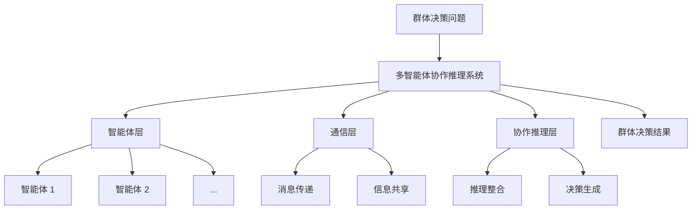

# 多智能体协作推理在群体决策中的创新

> 关键词：多智能体系统、协作推理、群体决策、创新应用、智能决策模型

> 摘要：本文聚焦于多智能体协作推理在群体决策中的创新应用。首先介绍多智能体协作推理和群体决策的相关背景知识，深入剖析多智能体协作推理的核心概念、原理及架构，详细阐述其核心算法原理与具体操作步骤，同时给出相关数学模型和公式并举例说明。通过项目实战展示代码实现及解读，探讨其在不同实际应用场景中的作用。此外，推荐了学习资源、开发工具框架以及相关论文著作。最后总结多智能体协作推理在群体决策领域的未来发展趋势与挑战，并对常见问题进行解答。旨在为该领域的研究和实践提供全面而深入的参考。

## 1. 背景介绍 
### 1.1 目的和范围
多智能体协作推理在群体决策领域具有巨大的潜力和广阔的应用前景。本文章的目的在于全面深入地探讨多智能体协作推理在群体决策中的创新应用，从理论原理到实际案例，为读者呈现该领域的全貌。范围涵盖多智能体协作推理的基本概念、算法原理、数学模型、项目实战以及实际应用场景等多个方面，旨在为相关研究人员、开发者和决策者提供有价值的参考和指导。

### 1.2 预期读者
本文预期读者包括但不限于计算机科学、人工智能、决策科学等领域的研究人员和学者，他们可以从本文中获取多智能体协作推理在群体决策方面的最新研究动态和创新思路；软件开发人员和工程师能够借鉴本文的算法实现和项目实战经验，应用于实际的开发工作中；企业管理者和决策者可以了解多智能体协作推理在群体决策中的应用价值，为企业的决策制定提供新的方法和工具。

### 1.3 文档结构概述
本文共分为十个部分。第一部分为背景介绍，阐述文章的目的、范围、预期读者和文档结构概述，并对相关术语进行解释。第二部分介绍多智能体协作推理的核心概念与联系，包括原理和架构的文本示意图及 Mermaid 流程图。第三部分详细讲解核心算法原理及具体操作步骤，并给出 Python 源代码。第四部分介绍数学模型和公式，进行详细讲解并举例说明。第五部分通过项目实战展示代码实际案例和详细解释说明。第六部分探讨多智能体协作推理在群体决策中的实际应用场景。第七部分推荐学习资源、开发工具框架以及相关论文著作。第八部分总结未来发展趋势与挑战。第九部分为附录，解答常见问题。第十部分提供扩展阅读和参考资料。

### 1.4 术语表
#### 1.4.1 核心术语定义
- **多智能体系统（Multi - Agent System，MAS）**：由多个智能体组成的系统，这些智能体能够感知环境、自主决策并与其他智能体进行交互，以实现共同的或各自的目标。
- **智能体（Agent）**：具有自主性、反应性、社会性和能动性的实体，能够在一定环境中独立运行并与其他智能体协作。
- **协作推理（Collaborative Reasoning）**：多个智能体通过信息共享、交互和合作，共同进行推理和决策的过程。
- **群体决策（Group Decision - Making）**：由多个个体或智能体参与，共同对某个问题或事项做出决策的过程。

#### 1.4.2 相关概念解释
- **自主性**：智能体能够在没有外部干预的情况下，独立地做出决策和采取行动。
- **反应性**：智能体能够感知环境的变化，并及时做出相应的反应。
- **社会性**：智能体能够与其他智能体进行通信和协作，以实现共同的目标。
- **能动性**：智能体能够主动地发起行动，以实现自己的目标。

#### 1.4.3 缩略词列表
- **MAS**：Multi - Agent System（多智能体系统）
- **AI**：Artificial Intelligence（人工智能）
- **ML**：Machine Learning（机器学习）
- **RL**：Reinforcement Learning（强化学习）

## 2. 核心概念与联系 

### 多智能体协作推理的原理
多智能体协作推理的核心原理在于多个智能体之间的信息共享、交互和合作。每个智能体都具有一定的知识和推理能力，它们通过与其他智能体进行通信，交换信息和推理结果，从而实现更全面、更准确的推理。在群体决策中，多智能体协作推理可以帮助各个决策参与者更好地理解问题，综合各方意见，提高决策的质量和效率。

### 多智能体协作推理的架构
多智能体协作推理的架构通常包括智能体层、通信层和协作推理层。智能体层由多个智能体组成，每个智能体负责感知环境、处理信息和做出决策。通信层负责智能体之间的信息传输和交互，确保智能体能够及时获取和共享信息。协作推理层则负责协调智能体之间的协作，整合各方的推理结果，最终得出群体决策。

### 文本示意图
```plaintext
+----------------------+
|    群体决策问题      |
+----------------------+
           |
           v
+----------------------+
|  多智能体协作推理系统 |
| +------------------+ |
| |  智能体层        | |
| |  - 智能体 1      | |
| |  - 智能体 2      | |
| |  - ...           | |
| +------------------+ |
| +------------------+ |
| |  通信层          | |
| |  - 消息传递      | |
| |  - 信息共享      | |
| +------------------+ |
| +------------------+ |
| |  协作推理层      | |
| |  - 推理整合      | |
| |  - 决策生成      | |
| +------------------+ |
+----------------------+
           |
           v
+----------------------+
|    群体决策结果      |
+----------------------+
```

### Mermaid 流程图


## 3. 核心算法原理 & 具体操作步骤 

### 核心算法原理
多智能体协作推理的核心算法通常基于分布式人工智能和机器学习的技术。其中，一种常见的算法是基于强化学习的协作推理算法。该算法的基本思想是每个智能体通过与环境进行交互，学习到最优的决策策略，同时通过与其他智能体的协作，共同优化整个系统的性能。

### 具体操作步骤
1. **智能体初始化**：为每个智能体分配初始的知识和策略。
2. **环境感知**：每个智能体感知当前的环境状态。
3. **决策生成**：每个智能体根据自己的知识和策略，生成局部决策。
4. **信息共享**：智能体之间通过通信层共享局部决策和环境信息。
5. **协作推理**：根据共享的信息，进行协作推理，整合各方的决策。
6. **全局决策生成**：根据协作推理的结果，生成全局决策。
7. **环境反馈**：将全局决策应用到环境中，获取环境的反馈。
8. **策略更新**：根据环境反馈，更新智能体的知识和策略。
9. **循环迭代**：重复步骤 2 - 8，直到满足终止条件。

### Python 源代码实现
```python
import numpy as np

# 定义智能体类
class Agent:
    def __init__(self, id, num_actions):
        self.id = id
        self.num_actions = num_actions
        self.q_table = np.zeros((10, num_actions))  # 简单示例，假设状态空间大小为 10
        self.epsilon = 0.1  # 探索率
        self.alpha = 0.1  # 学习率
        self.gamma = 0.9  # 折扣因子

    def choose_action(self, state):
        if np.random.uniform(0, 1) < self.epsilon:
            action = np.random.choice(self.num_actions)
        else:
            action = np.argmax(self.q_table[state, :])
        return action

    def update_q_table(self, state, action, reward, next_state):
        predict = self.q_table[state, action]
        target = reward + self.gamma * np.max(self.q_table[next_state, :])
        self.q_table[state, action] += self.alpha * (target - predict)

# 定义多智能体协作推理系统类
class MultiAgentSystem:
    def __init__(self, num_agents, num_actions):
        self.agents = [Agent(i, num_actions) for i in range(num_agents)]
        self.num_agents = num_agents
        self.num_actions = num_actions

    def run(self, num_episodes):
        for episode in range(num_episodes):
            state = np.random.randint(0, 10)  # 随机初始化状态
            total_reward = 0
            done = False
            while not done:
                actions = [agent.choose_action(state) for agent in self.agents]
                # 简单示例，假设奖励是所有智能体动作的和
                reward = sum(actions)
                next_state = np.random.randint(0, 10)
                for agent, action in zip(self.agents, actions):
                    agent.update_q_table(state, action, reward, next_state)
                state = next_state
                total_reward += reward
                if episode % 100 == 0:
                    print(f"Episode {episode}: Total Reward = {total_reward}")

# 主程序
if __name__ == "__main__":
    num_agents = 3
    num_actions = 5
    mas = MultiAgentSystem(num_agents, num_actions)
    mas.run(1000)
```

## 4. 数学模型和公式 & 详细讲解 & 举例说明 

### 强化学习基础公式
在强化学习中，智能体的目标是最大化长期累积奖励。常用的强化学习算法是 Q - learning，其核心公式为：

$$Q(s, a) \leftarrow Q(s, a) + \alpha [r + \gamma \max_{a'} Q(s', a') - Q(s, a)]$$

其中：
- $Q(s, a)$ 表示在状态 $s$ 下采取动作 $a$ 的 Q 值。
- $\alpha$ 是学习率，控制新信息对旧 Q 值的更新程度。
- $r$ 是在状态 $s$ 下采取动作 $a$ 后获得的即时奖励。
- $\gamma$ 是折扣因子，用于平衡即时奖励和未来奖励的重要性。
- $s'$ 是采取动作 $a$ 后转移到的下一个状态。

### 详细讲解
Q - learning 算法通过不断地与环境进行交互，更新 Q 表中的值，从而学习到最优的决策策略。在每个时间步，智能体根据当前状态和 Q 表选择一个动作，执行该动作后获得即时奖励和下一个状态，然后根据上述公式更新 Q 表。通过多次迭代，Q 表中的值会逐渐收敛到最优值，智能体也会学习到最优的决策策略。

### 举例说明
假设一个智能体在一个简单的网格世界中移动，状态空间包括网格的位置，动作空间包括上下左右四个方向。智能体的目标是到达网格世界中的某个目标位置，每次移动会获得一个即时奖励。例如，如果智能体成功到达目标位置，会获得一个正奖励；如果撞到墙壁或越界，会获得一个负奖励。智能体通过不断地尝试不同的动作，根据 Q - learning 算法更新 Q 表，最终学习到如何最快地到达目标位置。

## 5. 项目实战：代码实际案例和详细解释说明 

### 5.1  开发环境搭建
- **操作系统**：推荐使用 Linux 或 macOS，也可以使用 Windows。
- **Python 版本**：Python 3.6 及以上版本。
- **开发工具**：推荐使用 PyCharm 或 VS Code 作为集成开发环境。
- **依赖库**：需要安装 numpy 库，可以使用以下命令进行安装：
```sh
pip install numpy
```

### 5.2  源代码详细实现和代码解读
```python
import numpy as np

# 定义智能体类
class Agent:
    def __init__(self, id, num_actions):
        self.id = id
        self.num_actions = num_actions
        self.q_table = np.zeros((10, num_actions))  # 简单示例，假设状态空间大小为 10
        self.epsilon = 0.1  # 探索率
        self.alpha = 0.1  # 学习率
        self.gamma = 0.9  # 折扣因子

    def choose_action(self, state):
        if np.random.uniform(0, 1) < self.epsilon:
            action = np.random.choice(self.num_actions)
        else:
            action = np.argmax(self.q_table[state, :])
        return action

    def update_q_table(self, state, action, reward, next_state):
        predict = self.q_table[state, action]
        target = reward + self.gamma * np.max(self.q_table[next_state, :])
        self.q_table[state, action] += self.alpha * (target - predict)

# 定义多智能体协作推理系统类
class MultiAgentSystem:
    def __init__(self, num_agents, num_actions):
        self.agents = [Agent(i, num_actions) for i in range(num_agents)]
        self.num_agents = num_agents
        self.num_actions = num_actions

    def run(self, num_episodes):
        for episode in range(num_episodes):
            state = np.random.randint(0, 10)  # 随机初始化状态
            total_reward = 0
            done = False
            while not done:
                actions = [agent.choose_action(state) for agent in self.agents]
                # 简单示例，假设奖励是所有智能体动作的和
                reward = sum(actions)
                next_state = np.random.randint(0, 10)
                for agent, action in zip(self.agents, actions):
                    agent.update_q_table(state, action, reward, next_state)
                state = next_state
                total_reward += reward
                if episode % 100 == 0:
                    print(f"Episode {episode}: Total Reward = {total_reward}")

# 主程序
if __name__ == "__main__":
    num_agents = 3
    num_actions = 5
    mas = MultiAgentSystem(num_agents, num_actions)
    mas.run(1000)
```

### 代码解读与分析
- **Agent 类**：表示一个智能体，包含智能体的基本属性和方法。`__init__` 方法用于初始化智能体的 Q 表、探索率、学习率和折扣因子。`choose_action` 方法用于根据当前状态选择一个动作，采用 $\epsilon$-贪心策略，以一定的概率进行探索。`update_q_table` 方法用于根据 Q - learning 算法更新 Q 表。
- **MultiAgentSystem 类**：表示多智能体协作推理系统，包含多个智能体。`__init__` 方法用于初始化多个智能体。`run` 方法用于运行多智能体系统，每个回合随机初始化状态，智能体选择动作，计算奖励，更新 Q 表，直到回合结束。
- **主程序**：创建多智能体系统实例，设置智能体数量和动作数量，运行 1000 个回合。

## 6. 实际应用场景 
### 交通管理
在交通管理中，多智能体协作推理可以用于优化交通信号控制。每个路口的交通信号控制器可以看作一个智能体，它们通过感知交通流量、车辆排队长度等信息，与其他路口的智能体进行协作推理，共同调整交通信号的时间分配，以提高道路的通行效率，减少交通拥堵。

### 供应链管理
在供应链管理中，多智能体协作推理可以用于优化供应链的决策。供应商、生产商、经销商等可以看作不同的智能体，它们通过共享库存信息、需求预测、运输成本等信息，进行协作推理，共同制定采购计划、生产计划和配送计划，以降低供应链的成本，提高客户满意度。

### 医疗决策
在医疗决策中，多智能体协作推理可以用于辅助医生进行诊断和治疗方案的选择。不同的医疗专家、医学知识库、病例数据库等可以看作智能体，它们通过共享患者的症状、检查结果、病史等信息，进行协作推理，为医生提供更全面、准确的诊断和治疗建议。

### 金融投资决策
在金融投资决策中，多智能体协作推理可以用于优化投资组合。不同的投资者、金融分析师、市场数据等可以看作智能体，它们通过共享市场信息、风险偏好、投资目标等信息，进行协作推理，为投资者提供更合理的投资建议，降低投资风险，提高投资收益。

## 7. 工具和资源推荐
### 7.1 学习资源推荐
#### 7.1.1 书籍推荐
- 《多智能体系统：原理与编程》：全面介绍了多智能体系统的基本原理、设计方法和编程实现，是学习多智能体系统的经典教材。
- 《强化学习：原理与Python