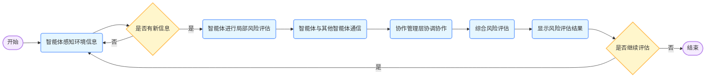

# 多智能体协作评估全球宏观风险

> 关键词：多智能体协作、全球宏观风险、风险评估、人工智能、分布式系统

> 摘要：本文聚焦于多智能体协作在评估全球宏观风险方面的应用。首先介绍了多智能体协作和全球宏观风险评估的背景知识，包括目的、预期读者等内容。接着阐述了多智能体协作的核心概念、原理及架构，通过 Mermaid 流程图进行直观展示。详细讲解了核心算法原理，给出 Python 源代码示例。对相关数学模型和公式进行推导与举例说明。通过项目实战，展示了多智能体协作评估全球宏观风险的具体实现过程。探讨了该技术在实际中的应用场景，推荐了学习、开发相关的工具和资源，最后对未来发展趋势与挑战进行总结，并解答常见问题，提供扩展阅读和参考资料。

## 1. 背景介绍 
### 1.1 目的和范围
全球宏观风险涵盖了经济、政治、环境、社会等多个领域，如经济危机、地缘政治冲突、气候变化、公共卫生事件等。这些风险相互关联、相互影响，对全球的稳定和发展构成了严重威胁。传统的风险评估方法往往难以全面、及时地捕捉这些复杂的风险信息。多智能体协作作为一种新兴的技术手段，具有分布式、自适应、协同性等特点，能够整合不同来源的信息，从多个角度对全球宏观风险进行评估。本文的目的在于深入探讨多智能体协作在全球宏观风险评估中的应用原理、方法和实践，为相关领域的研究和应用提供理论支持和实践指导。范围涉及多智能体协作的基本概念、算法原理、数学模型，以及在不同场景下的实际应用案例等。

### 1.2 预期读者
本文预期读者包括人工智能领域的研究人员、风险评估专业人士、金融分析师、政策制定者、计算机科学专业的学生以及对全球宏观风险评估和多智能体技术感兴趣的爱好者。对于研究人员，可以提供新的研究思路和方法；对于专业人士，有助于其在实际工作中应用多智能体协作技术进行更准确的风险评估；对于学生，可以作为学习相关知识的参考资料；对于爱好者，可以帮助他们了解该领域的前沿技术。

### 1.3 文档结构概述
本文首先介绍多智能体协作评估全球宏观风险的背景知识，包括目的、预期读者和文档结构等。接着阐述多智能体协作的核心概念、原理及架构，通过 Mermaid 流程图进行直观展示。详细讲解核心算法原理，给出 Python 源代码示例。对相关数学模型和公式进行推导与举例说明。通过项目实战，展示多智能体协作评估全球宏观风险的具体实现过程。探讨该技术在实际中的应用场景，推荐学习、开发相关的工具和资源，最后对未来发展趋势与挑战进行总结，并解答常见问题，提供扩展阅读和参考资料。

### 1.4 术语表
#### 1.4.1 核心术语定义
- **多智能体系统（Multi - Agent System, MAS）**：由多个智能体组成的系统，这些智能体能够在一定的环境中自主地感知、决策和行动，并通过交互与协作来实现共同的目标。
- **智能体（Agent）**：具有自主性、反应性、社会性和主动性等特性的实体，能够感知环境信息，根据自身的目标和知识进行决策，并采取相应的行动。
- **全球宏观风险**：指在全球范围内，由于经济、政治、环境、社会等因素的变化而可能引发的具有广泛影响的风险事件。
- **风险评估**：对风险的可能性、影响程度等进行分析和评价的过程。

#### 1.4.2 相关概念解释
- **分布式系统**：由多个独立的计算单元组成，通过网络进行通信和协作的系统。多智能体系统通常基于分布式系统实现，各个智能体可以分布在不同的物理节点上。
- **协作机制**：多智能体系统中智能体之间进行交互和合作的方式，包括通信协议、协调策略、冲突解决方法等。
- **自适应**：智能体能够根据环境的变化自动调整自己的行为和策略，以适应不同的情况。

#### 1.4.3 缩略词列表
- **MAS**：Multi - Agent System（多智能体系统）
- **AI**：Artificial Intelligence（人工智能）

## 2. 核心概念与联系 
### 2.1 多智能体系统的基本概念
多智能体系统是由多个智能体组成的复杂系统。每个智能体都有自己的感知器、决策器和执行器。感知器用于感知环境中的信息，决策器根据感知到的信息和自身的目标、知识进行决策，执行器则根据决策结果采取相应的行动。智能体之间可以通过通信机制进行信息交换和协作，以实现共同的目标。

### 2.2 多智能体协作的原理
多智能体协作的原理基于智能体之间的交互和合作。智能体通过通信协议进行信息传递，分享各自的感知信息、决策结果和行动计划。在协作过程中，智能体需要协调彼此的行为，避免冲突，以实现整体的最优目标。常见的协作策略包括合同网协议、拍卖机制、协商机制等。

### 2.3 多智能体协作与全球宏观风险评估的联系
全球宏观风险评估需要综合考虑多个领域的信息，包括经济数据、政治事件、环境变化等。多智能体系统可以通过分布在不同领域的智能体来收集和处理这些信息。每个智能体可以专注于特定领域的风险评估，然后通过协作将各自的评估结果进行整合，从而实现对全球宏观风险的全面、准确评估。

### 2.4 核心概念原理和架构的文本示意图
多智能体协作评估全球宏观风险的系统架构主要包括以下几个部分：
- **智能体层**：由多个智能体组成，每个智能体负责不同领域的信息收集和风险评估。
- **通信层**：负责智能体之间的信息传递和交互，确保智能体能够及时、准确地共享信息。
- **协作管理层**：对智能体的协作过程进行管理和协调，包括任务分配、冲突解决等。
- **风险评估层**：根据智能体提供的信息和协作结果，对全球宏观风险进行综合评估。
- **用户界面层**：向用户展示风险评估结果，提供交互功能。

### 2.5 Mermaid 流程图


## 3. 核心算法原理 & 具体操作步骤 
### 3.1 核心算法原理
多智能体协作评估全球宏观风险的核心算法包括智能体的局部风险评估算法和多智能体协作算法。

#### 3.1.1 局部风险评估算法
局部风险评估算法用于智能体对其负责的领域进行风险评估。常见的方法包括基于概率模型的方法、基于机器学习的方法等。以基于概率模型的方法为例，假设我们要评估某一经济指标（如 GDP 增长率）的风险。可以通过历史数据建立该指标的概率分布模型，然后根据当前的观测值计算其处于不同风险等级的概率。

#### 3.1.2 多智能体协作算法
多智能体协作算法用于协调智能体之间的信息共享和合作。常见的算法包括合同网协议、拍卖机制等。以合同网协议为例，其基本流程如下：
1. **任务发布**：一个智能体（管理者）将任务分解为多个子任务，并向其他智能体发布任务请求。
2. **投标**：其他智能体（投标者）根据自己的能力和资源对任务请求进行投标，表达自己完成任务的意愿和能力。
3. **中标选择**：管理者根据投标者的投标信息选择最合适的中标者，并向其分配任务。
4. **任务执行**：中标者执行分配的任务，并将执行结果反馈给管理者。
5. **结果整合**：管理者对各个中标者的执行结果进行整合，得到最终的任务结果。

### 3.2 具体操作步骤
#### 3.2.1 智能体初始化
为每个智能体分配初始的任务和资源，设置其感知范围和通信能力。例如，一个负责经济领域风险评估的智能体可以被分配到收集和分析经济数据的任务，其感知范围可以包括各种经济指标数据来源，通信能力可以设置为能够与其他智能体进行信息交换。

#### 3.2.2 信息收集
智能体通过感知器收集其负责领域的信息。例如，环境领域的智能体可以收集气象数据、污染数据等；政治领域的智能体可以收集政治事件、政策变化等信息。

#### 3.2.3 局部风险评估
智能体根据收集到的信息，使用局部风险评估算法进行风险评估。例如，一个金融智能体可以根据股票价格、利率等数据计算金融市场的风险指数。

#### 3.2.4 多智能体协作
智能体通过通信层与其他智能体进行信息交换和协作。根据多智能体协作算法，协调彼此的行为，避免冲突。例如，当一个智能体发现某一风险事件可能影响到其他领域时，它可以将相关信息传递给其他智能体，共同进行风险评估。

#### 3.2.5 综合风险评估
协作管理层根据智能体的协作结果，对全球宏观风险进行综合评估。可以采用加权平均、层次分析法等方法将各个智能体的局部风险评估结果进行整合，得到最终的风险评估结果。

#### 3.2.6 结果展示
将综合风险评估结果通过用户界面层展示给用户。可以采用图表、报表等形式直观地展示风险评估结果，方便用户进行决策。

### 3.3 Python 源代码示例
以下是一个简单的多智能体协作模拟示例，用于演示局部风险评估和多智能体协作的基本过程。

```python
import random

# 定义智能体类
class Agent:
    def __init__(self, name, domain):
        self.name = name
        self.domain = domain
        self.local_risk = 0

    # 局部风险评估方法
    def local_risk_evaluation(self):
        # 模拟风险评估过程，随机生成一个风险值
        self.local_risk = random.uniform(0, 1)
        print(f"{self.name} 在 {self.domain} 领域的局部风险评估结果: {self.local_risk}")
        return self.local_risk

# 定义多智能体系统类
class MultiAgentSystem:
    def __init__(self):
        self.agents = []

    # 添加智能体
    def add_agent(self, agent):
        self.agents.append(agent)

    # 多智能体协作过程
    def multi_agent_collaboration(self):
        local_risks = []
        for agent in self.agents:
            local_risk = agent.local_risk_evaluation()
            local_risks.append(local_risk)
        # 简单的综合风险评估，采用加权平均法（这里权重都设为 1）
        total_risk = sum(local_risks) / len(local_risks)
        print(f"综合风险评估结果: {total_risk}")

# 创建智能体
agent1 = Agent("Agent1", "经济领域")
agent2 = Agent("Agent2", "环境领域")
agent3 = Agent("Agent3", "政治领域")

# 创建多智能体系统
mas = MultiAgentSystem()
mas.add_agent(agent1)
mas.add_agent(agent2)
mas.add_agent(agent3)

# 进行多智能体协作
mas.multi_agent_collaboration()
```

在这个示例中，我们定义了一个 `Agent` 类表示智能体，其中包含局部风险评估方法 `local_risk_evaluation`。`MultiAgentSystem` 类表示多智能体系统，包含添加智能体和多智能体协作的方法。通过模拟不同领域的智能体进行局部风险评估，并将结果进行整合，得到综合风险评估结果。

## 4. 数学模型和公式 & 详细讲解 & 举例说明 
### 4.1 局部风险评估的数学模型
#### 4.1.1 基于概率模型的局部风险评估
假设我们要评估某一事件 $E$ 的风险，其发生的概率为 $P(E)$，事件发生后造成的损失为 $L(E)$。则该事件的风险值 $R(E)$ 可以表示为：
$$R(E) = P(E) \times L(E)$$

例如，在金融市场中，某只股票价格下跌的概率为 $P = 0.3$，如果价格下跌，预计造成的损失为 $L = 100$ 万元。则该股票价格下跌的风险值为：
$$R = 0.3 \times 100 = 30 \text{ 万元}$$

#### 4.1.2 基于机器学习的局部风险评估
在基于机器学习的局部风险评估中，通常使用分类算法或回归算法。以分类算法为例，假设我们要将风险分为高、中、低三个等级。可以使用逻辑回归模型，其基本公式为：
$$P(y = 1|x) = \frac{1}{1 + e^{-(w_0 + w_1x_1 + \cdots + w_nx_n)}}$$
其中，$y$ 表示风险等级（$y = 1$ 表示高风险，$y = 0$ 表示非高风险），$x$ 表示输入的特征向量，$w$ 表示模型的权重参数。

### 4.2 多智能体协作的数学模型
#### 4.2.1 合同网协议的数学模型
在合同网协议中，任务分配可以看作是一个优化问题。假设管理者有 $m$ 个子任务，投标者有 $n$ 个。每个投标者 $j$ 对任务 $i$ 的投标价值为 $v_{ij}$，管理者希望找到一个最优的任务分配方案，使得总投标价值最大。可以用线性规划模型来表示：
$$\max \sum_{i = 1}^{m} \sum_{j = 1}^{n} v_{ij}x_{ij}$$
$$\text{s.t. } \sum_{j = 1}^{n} x_{ij} = 1, \quad i = 1, \cdots, m$$
$$\sum_{i = 1}^{m} x_{ij} \leq 1, \quad j = 1, \cdots, n$$
$$x_{ij} \in \{0, 1\}, \quad i = 1, \cdots, m; j = 1, \cdots, n$$
其中，$x_{ij}$ 表示任务 $i$ 是否分配给投标者 $j$（$x_{ij} = 1$ 表示分配，$x_{ij} = 0$ 表示不分配）。

#### 4.2.2 综合风险评估的数学模型
综合风险评估可以采用加权平均法、层次分析法等方法。以加权平均法为例，假设共有 $n$ 个智能体，每个智能体的局部风险评估结果为 $R_i$，对应的权重为 $w_i$，且 $\sum_{i = 1}^{n} w_i = 1$。则综合风险值 $R_{total}$ 为：
$$R_{total} = \sum_{i = 1}^{n} w_iR_i$$

例如，有三个智能体，其局部风险评估结果分别为 $R_1 = 0.2$，$R_2 = 0.3$，$R_3 = 0.4$，对应的权重分别为 $w_1 = 0.2$，$w_2 = 0.3$，$w_3 = 0.5$。则综合风险值为：
$$R_{total} = 0.2 \times 0.2 + 0.3 \times 0.3 + 0.4 \times 0.5 = 0.33$$

## 5. 项目实战：代码实际案例和详细解释说明 
### 5.1  开发环境搭建
#### 5.1.1 操作系统
可以选择 Windows、Linux 或 macOS 操作系统。本文以 Ubuntu 18.04 为例进行说明。

#### 5.1.2 编程语言和环境
- **Python**：建议使用 Python 3.7 及以上版本。可以通过以下命令安装 Python：
```bash
sudo apt update
sudo apt install python3
```
- **Python 虚拟环境**：使用 `venv` 或 `virtualenv` 来创建虚拟环境，以隔离项目的依赖。例如，使用 `venv` 创建虚拟环境：
```bash
python3 -m venv myenv
source myenv/bin/activate
```

#### 5.1.3 依赖库安装
在虚拟环境中安装所需的依赖库，如 `numpy`、`pandas` 等。可以使用 `pip` 进行安装：
```bash
pip install numpy pandas
```

### 5.2  源代码详细实现和代码解读
以下是一个更完整的多智能体协作评估全球宏观风险的项目示例，包括数据收集、局部风险评估