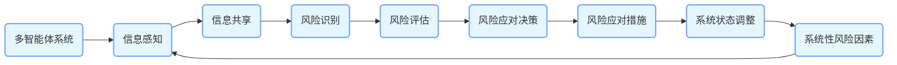

# 多智能体协作进行系统性风险分析

> 关键词：多智能体协作、系统性风险分析、智能体交互、风险建模、决策支持

> 摘要：本文聚焦于多智能体协作在系统性风险分析中的应用。系统性风险具有复杂性、关联性和不确定性等特点，传统的风险分析方法往往难以全面、准确地评估。多智能体协作通过多个智能体之间的交互和协同工作，能够从不同角度对系统性风险进行感知、分析和评估。文章详细阐述了多智能体协作的核心概念、算法原理、数学模型，通过项目实战展示了其在实际中的应用，探讨了实际应用场景，并推荐了相关的工具和资源，最后对未来发展趋势与挑战进行了总结。

## 1. 背景介绍 
### 1.1 目的和范围
系统性风险广泛存在于金融、能源、生态等多个领域，如金融市场的崩溃、能源供应的中断、生态系统的失衡等。传统的风险分析方法通常基于单一模型或单一视角，难以捕捉系统性风险中复杂的交互关系和动态变化。本研究的目的是探讨如何利用多智能体协作的方法，对系统性风险进行更全面、准确的分析。研究范围涵盖多智能体协作的基本原理、算法实现、数学模型构建，以及在不同领域的实际应用。

### 1.2 预期读者
本文预期读者包括对人工智能、风险管理、复杂系统分析等领域感兴趣的研究人员、工程师、金融从业者、政策制定者等。对于希望深入了解多智能体技术在系统性风险分析中应用的专业人士，本文提供了系统的理论和实践指导。

### 1.3 文档结构概述
本文将按照以下结构进行组织：首先介绍多智能体协作和系统性风险分析的核心概念及它们之间的联系；接着详细阐述多智能体协作进行系统性风险分析的核心算法原理和具体操作步骤，并给出相应的 Python 代码示例；然后介绍相关的数学模型和公式，并通过具体例子进行说明；通过项目实战展示多智能体协作在系统性风险分析中的实际应用；探讨多智能体协作进行系统性风险分析的实际应用场景；推荐相关的学习资源、开发工具框架和论文著作；最后总结未来发展趋势与挑战，并提供常见问题的解答和扩展阅读参考资料。

### 1.4 术语表
#### 1.4.1 核心术语定义
- **多智能体系统（Multi - Agent System，MAS）**：由多个智能体组成的系统，这些智能体可以自主地感知环境、进行决策和行动，并且能够与其他智能体进行交互和协作。
- **智能体（Agent）**：具有自主性、反应性、社会性和主动性的实体，能够在特定环境中感知信息、进行推理和决策，并采取行动以实现自身目标。
- **系统性风险（Systemic Risk）**：指整个系统面临的风险，这种风险可能由内部因素或外部冲击引起，会对系统的整体稳定性和功能产生严重影响，并且可能通过系统内的各种关联和反馈机制扩散和放大。

#### 1.4.2 相关概念解释
- **协作机制**：多智能体之间为了实现共同目标而采取的交互方式和协调策略，包括信息共享、任务分配、冲突解决等。
- **风险评估**：对系统性风险的可能性和影响程度进行量化或定性分析的过程，以便为决策提供依据。

#### 1.4.3 缩略词列表
- MAS：Multi - Agent System（多智能体系统）
- AI：Artificial Intelligence（人工智能）

## 2. 核心概念与联系 
### 2.1 多智能体系统概述
多智能体系统是一种分布式的智能系统，由多个智能体组成。每个智能体具有一定的自主性和智能，能够独立地感知环境、进行决策和行动。智能体之间可以通过通信机制进行信息交换和交互，以实现协作和协调。多智能体系统的架构通常包括智能体层、通信层和协调层。智能体层包含多个智能体，每个智能体负责特定的任务；通信层负责智能体之间的信息传递；协调层则负责协调智能体之间的行动，以实现系统的整体目标。

以下是多智能体系统架构的文本示意图：
```plaintext
多智能体系统
|-- 智能体层
|   |-- 智能体 1
|   |-- 智能体 2
|   |--...
|   |-- 智能体 n
|-- 通信层
|   |-- 通信协议
|   |-- 消息传递机制
|-- 协调层
|   |-- 协作策略
|   |-- 任务分配算法
```

### 2.2 系统性风险分析概述
系统性风险分析是对整个系统面临的风险进行全面、深入的研究。它需要考虑系统内各个要素之间的相互关系、系统与外部环境的交互，以及风险的动态变化。系统性风险分析的过程通常包括风险识别、风险评估和风险应对。风险识别是确定系统中可能存在的风险因素；风险评估是对风险的可能性和影响程度进行量化或定性分析；风险应对是根据评估结果制定相应的措施来降低风险。

### 2.3 多智能体协作与系统性风险分析的联系
多智能体协作可以为系统性风险分析提供一种有效的方法。多个智能体可以从不同的角度和层面感知系统的状态和信息，通过协作和信息共享，能够更全面地识别系统中的风险因素。智能体之间的交互和协同工作可以模拟系统内复杂的关联和反馈机制，从而更准确地评估风险的传播和影响。此外，多智能体系统的自主性和适应性使得它能够及时应对系统中风险的动态变化。

### 2.4 Mermaid 流程图


该流程图展示了多智能体协作进行系统性风险分析的基本流程。多智能体系统首先进行信息感知，收集系统性风险因素的相关信息；然后通过信息共享，将各个智能体感知到的信息进行整合；接着进行风险识别和评估；根据评估结果做出风险应对决策，并采取相应的风险应对措施；这些措施会对系统状态进行调整，调整后的系统状态又会产生新的系统性风险因素，形成一个闭环的过程。

## 3. 核心算法原理 & 具体操作步骤 
### 3.1 核心算法原理
多智能体协作进行系统性风险分析的核心算法主要包括智能体决策算法、协作算法和风险评估算法。

#### 3.1.1 智能体决策算法
智能体决策算法用于智能体根据自身感知到的信息和目标，做出决策和行动。常见的智能体决策算法包括基于规则的决策算法、基于机器学习的决策算法等。基于规则的决策算法通过预先定义的规则来进行决策，例如，如果某个智能体感知到系统中某个指标超过了阈值，则采取相应的行动。基于机器学习的决策算法则通过训练模型来进行决策，例如使用神经网络、决策树等模型。

以下是一个简单的基于规则的智能体决策算法的 Python 代码示例：
```python
class Agent:
    def __init__(self, threshold):
        self.threshold = threshold

    def make_decision(self, value):
        if value > self.threshold:
            return "Take action"
        else:
            return "Do nothing"

# 创建一个智能体实例
agent = Agent(threshold=10)

# 模拟感知到的值
perceived_value = 15

# 智能体做出决策
decision = agent.make_decision(perceived_value)
print(decision)
```

#### 3.1.2 协作算法
协作算法用于协调多个智能体之间的行动，以实现共同目标。常见的协作算法包括合同网协议、拍卖算法等。合同网协议是一种基于任务分配的协作算法，通过招标、投标和中标过程，将任务分配给合适的智能体。拍卖算法则通过模拟拍卖过程，让智能体竞争任务。

以下是一个简单的合同网协议的 Python 代码示例：
```python
# 定义任务
class Task:
    def __init__(self, task_id):
        self.task_id = task_id

# 定义智能体
class Agent:
    def __init__(self, agent_id):
        self.agent_id = agent_id
        self.capability = 1  # 假设智能体的能力为 1

    def bid(self, task):
        # 简单地返回智能体的能力作为投标值
        return self.capability

# 定义协调者
class Coordinator:
    def __init__(self):
        self.agents = []

    def add_agent(self, agent):
        self.agents.append(agent)

    def assign_task(self, task):
        bids = []
        for agent in self.agents:
            bid = agent.bid(task)
            bids.append((agent, bid))

        # 选择投标值最高的智能体
        winner = max(bids, key=lambda x: x[1])[0]
        return winner

# 创建智能体和协调者
agent1 = Agent(1)
agent2 = Agent(2)
coordinator = Coordinator()
coordinator.add_agent(agent1)
coordinator.add_agent(agent2)

# 创建任务
task = Task(1)

# 分配任务
winner = coordinator.assign_task(task)
print(f"Task {task.task_id} is assigned to Agent {winner.agent_id}")
```

#### 3.1.3 风险评估算法
风险评估算法用于对系统性风险的可能性和影响程度进行量化或定性分析。常见的风险评估算法包括层次分析法（AHP）、模糊综合评价法等。层次分析法通过将复杂的问题分解为多个层次，对每个层次的因素进行两两比较，确定其相对重要性，然后综合计算得出风险评估结果。模糊综合评价法则通过引入模糊数学的方法，处理风险评估中的不确定性。

### 3.2 具体操作步骤
#### 3.2.1 智能体初始化
首先，需要初始化多个智能体，每个智能体具有不同的属性和能力。例如，有些智能体可能擅长感知系统的某些指标，有些智能体可能擅长进行数据分析和决策。

#### 3.2.2 信息感知
各个智能体根据自身的感知能力，收集系统的相关信息。这些信息可以包括系统的状态变量、外部环境的变化等。

#### 3.2.3 信息共享
智能体之间通过通信机制进行信息共享，将各自感知到的信息传递给其他智能体。

#### 3.2.4 风险识别
智能体根据共享的信息，识别系统中可能存在的风险因素。可以使用预先定义的规则或机器学习模型来进行风险识别。

#### 3.2.5 风险评估
使用风险评估算法对识别出的风险因素进行评估，确定风险的可能性和影响程度。

#### 3.2.6 决策和行动
智能体根据风险评估结果，做出决策和行动。可以通过协作算法协调多个智能体的行动，以实现共同的风险应对目标。

#### 3.2.7 系统更新
智能体的行动会对系统状态产生影响，需要更新系统的状态信息，以便进行下一轮的风险分析。

## 4. 数学模型和公式 & 详细讲解 & 举例说明 
### 4.1 层次分析法（AHP）模型
层次分析法是一种常用的风险评估数学模型，它将复杂的问题分解为多个层次，包括目标层、准则层和方案层。通过对每个层次的因素进行两两比较，确定其相对重要性，然后综合计算得出风险评估结果。

#### 4.1.1 数学公式
假设我们有 $n$ 个因素需要进行比较，构造判断矩阵 $A=(a_{ij})_{n\times n}$，其中 $a_{ij}$ 表示因素 $i$ 相对于因素 $j$ 的重要性程度。判断矩阵 $A$ 满足 $a_{ij}>0$，$a_{ji}=\frac{1}{a_{ij}}$，$a_{ii}=1$。

计算判断矩阵 $A$ 的最大特征值 $\lambda_{max}$ 和对应的特征向量 $W=(w_1,w_2,\cdots,w_n)^T$，其中 $w_i$ 表示因素 $i$ 的权重。

一致性指标 $CI$ 的计算公式为：
$$CI=\frac{\lambda_{max}-n}{n - 1}$$

随机一致性比率 $CR$ 的计算公式为：
$$CR=\frac{CI}{RI}$$
其中 $RI$ 是随机一致性指标，它的值与 $n$ 有关，可以通过查表得到。当 $CR<0.1$ 时，认为判断矩阵具有满意的一致性。

#### 4.1.2 详细讲解
层次分析法的步骤如下：
1. **建立层次结构模型**：将问题分解为目标层、准则层和方案层。例如，在系统性风险分析中，目标层可以是评估系统性风险的大小，准则层可以包括市场风险、信用风险、操作风险等，方案层可以是不同的风险应对措施。
2. **构造判断矩阵**：对每个层次的因素进行两两比较，确定其相对重要性程度，构造判断矩阵。
3. **计算权重向量**：计算判断矩阵的最大特征值和对应的特征向量，得到每个因素的权重。
4. **一致性检验**：计算一致性指标和随机一致性比率，进行一致性检验。如果判断矩阵不具有满意的一致性，需要重新调整判断矩阵。
5. **综合计算**：根据各层次因素的权重，进行综合计算，得出风险评估结果。

#### 4.1.3 举例说明
假设我们要评估一个金融系统的系统性风险，准则层包括市场风险、信用风险和操作风险三个因素。通过两两比较，构造判断矩阵如下：
$$A=\begin{bmatrix}
1 & 3 & 5 \\
\frac{1}{3} & 1 & 3 \\
\frac{1}{5} & \frac{1}{3} & 1
\end{bmatrix}$$

首先，计算判断矩阵 $A$ 的最大特征值 $\lambda_{max}$ 和对应的特征向量 $W$。可以使用 Python 的 `numpy` 库来实现：
```python
import numpy as np

A = np.array([[1, 3, 5], [1/3, 1, 3], [1/5, 1/3, 1]])
eigenvalues, eigenvectors = np.linalg.eig(A)
lambda_max = np.max(eigenvalues).real
W = eigenvectors[:, np.argmax(eigenvalues)].real
W = W / np.sum(W)  # 归一化

print(f"最大特征值: {lambda_max}")
print(f"权重向量: {W}")
```

然后，计算一致性指标 $CI$ 和随机一致性比率 $CR$。对于 $n = 3$，$RI = 0.58$。
```python
n = 3
CI = (lambda_max - n) / (n - 1)
CR = CI / 0.58

print(f"一致性指标 CI: {CI}")
print(f"随机一致性比率 CR: {CR}")
```

如果 $CR<0.1$，则认为判断矩阵具有满意的一致性，权重向量可以作为各因素的相对重要性。

### 4.2 模糊综合评价法模型
模糊综合评价法是一种处理不确定性问题的风险评估方法，它通过引入模糊数学的概念，将风险评估中的定性和定量因素进行综合考虑。

#### 4.2.1 数学公式
设因素集 $U = \{u_1,u_2,\cdots,u_n\}$ 表示影响风险的各个因素，评语集 $V = \{v_1,v_2,\cdots,v_m\}$ 表示风险的不同等级。

首先，确定单因素评价矩阵 $R=(r_{ij})_{n\times m}$，其中 $r_{ij}$ 表示因素 $u_i$ 对评语 $v_j$ 的隶属度。

然后，确定因素权重向量 $A=(a_1,a_2,\cdots,a_n)$，其中 $a_i$ 表示因素 $u_i$ 的权重。

最后，进行模糊综合评价，得到综合评价向量 $B = A\circ R$，其中 $\circ$ 表示模糊合成算子，常见的模糊合成算子有最大 - 最小合成算子、加权平均合成算子等。

#### 4.2.2 详细讲解
模糊综合评价法的步骤如下：
1. **确定因素集和评语集**：根据具体问题，确定影响风险的因素集和风险的不同等级评语集。
2. **确定单因素评价矩阵**：通过专家评估或其他方法，确定每个因素对各个评语的隶属度，构造单因素评价矩阵。
3. **确定因素权重向量**：可以使用层次分析法等方法确定各因素的权重。
4. **选择模糊合成算子**：根据实际情况选择合适的模糊合成算子。
5. **进行模糊综合评价**：将因素权重向量和单因素评价矩阵进行模糊合成，得到综合评价向量。
6. **确定评价结果**：根据综合评价向量，确定最终的风险等级。

#### 4.2.3 举例说明
假设我们要评估一个项目的风险，因素集 $U = \{技术风险, 市场风险, 管理风险\}$，评语集 $V = \{高风险, 中风险, 低风险\}$。

通过专家评估，得到单因素评价矩阵：
$$R=\begin{bmatrix}
0.2 & 0.5 & 0.3 \\
0.3 & 0.4 & 0.3 \\
0.1 & 0.6 & 0.3
\end{bmatrix}$$

使用层次分析法确定因素权重向量 $A=(0.4, 0.3, 0.3)$。

选择加权平均合成算子进行模糊综合评价：
```python
import numpy as np

R = np.array([[0.2, 0.5, 0.3], [0.3, 0.4, 0.3], [0.1, 0.6, 0.3]])
A = np.array([0.4, 0.3, 0.3])

B = np.dot(A, R)

print(f"综合评价向量: {B}")
```

根据综合评价向量，选择隶属度最大的评语作为最终的风险等级。

## 5. 项目实战：代码实际案例和详细解释说明 
### 5.1  开发环境搭建
#### 5.1.1 安装 Python
首先，需要安装 Python 环境。可以从 Python 官方网站（https://www.python.org/downloads/）下载适合自己操作系统的 Python 版本，并按照安装向导进行安装。

#### 5.1.2 安装必要的库
在进行多智能体协作进行系统性风险分析的项目实战中，需要安装一些必要的 Python 库，如 `numpy`、`pandas`、`matplotlib` 等。可以使用 `pip` 命令进行安装：
```sh
pip install numpy pandas matplotlib
```

### 5.2  源代码详细实现和代码解读
#### 5.2.1 项目背景
假设我们要对一个简单的金融市场系统进行系统性风险分析。该系统包含多个金融机构，每个金融机构可以看作一个智能体。智能体可以感知市场的一些指标，如股票价格、利率等，并根据这些指标进行决策和行动。

#### 5.2.2 代码实现
```python
import numpy as np
import matplotlib.pyplot as plt

# 定义智能体类
class Agent:
    def __init__(self, agent_id, initial_funds):
        self.agent_id = agent_id
        self.funds = initial_funds
        self.risk_tolerance = np.random.uniform(0.1, 0.9)  # 随机生成风险容忍度

    def perceive_market(self, market_indicator):
        # 感知市场指标
        return market_indicator

    def make_decision(self, market_indicator):
        # 根据市场指标和风险容忍度做出决策
        if market_indicator > self.risk_tolerance:
            self.funds *= 0.9  # 减少资金
        else:
            self.funds *= 1.1  # 增加资金
        return self.funds

# 定义市场环境类
class MarketEnvironment:
    def __init__(self, initial_indicator):
        self.market_indicator = initial_indicator

    def update_market(self):
        # 模拟市场指标的更新
        self.market_indicator += np.random.normal(0, 0.1)
        return self.market_indicator

# 主函数
def main():
    num_agents = 10
    initial_funds = 1000
    initial_indicator = 0.5
    num_steps = 100

    # 创建智能体和市场环境
    agents = [Agent(i, initial_funds) for i in range(num_agents)]
    market = MarketEnvironment(initial_indicator)

    # 记录每个智能体的资金变化
    funds_history = [[] for _ in range(num_agents)]

    # 模拟多步过程
    for step in range(num_steps):
        # 更新市场指标
        market_indicator = market.update_market()

        # 每个智能体感知市场并做出决策
        for i, agent in enumerate(agents):
            perceived_indicator = agent.perceive_market(market_indicator)
            funds = agent.make_decision(perceived_indicator)
            funds_history[i].append(funds)

    # 绘制每个智能体的资金变化曲线
    plt.figure(figsize=(10, 6))
    for i in range(num_agents):
        plt.plot(funds_history[i], label=f"Agent {i}")

    plt.xlabel("Step")
    plt.ylabel("Funds")
    plt.title("Funds Change of Agents in the Market")
    plt.legend()
    plt.show()

if __name__ == "__main__":
    main()
```

#### 5.2.3 代码解读
- **智能体类（Agent）**：每个智能体具有唯一的标识符 `agent_id`、初始资金 `initial_funds` 和风险容忍度 `risk_tolerance`。智能体可以感知市场指标，并根据市场指标和风险容忍度做出决策，决策结果会影响智能体的资金。
- **市场环境类（MarketEnvironment）**：市场环境类模拟市场指标的更新，通过随机过程来模拟市场的不确定性。
- **主函数（main）**：在主函数中，首先创建了多个智能体和市场环境。然后模拟了多个时间步的过程，在每个时间步中，更新市场指标，每个智能体感知市场并做出决策。最后，绘制了每个智能体的资金变化曲线。

### 5.3  代码解读与分析
#### 5.3.1 智能体决策机制分析
智能体的决策机制基于市场指标和风险容忍度。当市场指标超过智能体的风险容忍度时，智能体减少资金；否则，智能体增加资金。这种决策机制模拟了智能体在面对市场风险时的行为。

#### 5.3.2 市场环境模拟分析
市场环境的模拟使用了随机过程，通过随机扰动来模拟市场的不确定性。这种模拟方法可以在一定程度上反映市场的实际情况。

#### 5.3.3 系统性风险分析
通过观察每个智能体的资金变化曲线，可以分析市场的系统性风险。如果多个智能体的资金同时出现大幅下降，说明市场可能面临系统性风险。

## 6. 实际应用场景 
### 6.1 金融领域
在金融领域，多智能体协作进行系统性风险分析可以用于评估金融市场的稳定性。多个智能体可以分别代表不同的金融机构、投资者等，通过感知市场的各种指标，如股票价格、利率、汇率等，进行风险识别和评估。例如，当某个金融机构面临风险时，通过智能体之间的协作和信息共享，可以及时发现风险的传播路径，采取相应的措施来防范系统性风险的发生。

### 6.2 能源领域
在能源领域，多智能体协作可以用于分析能源系统的系统性风险。智能体可以代表不同的能源生产企业、能源消费企业、能源传输网络等。通过感知能源的供应、需求、价格等信息，智能体可以识别能源系统中可能存在的风险因素，如能源短缺、价格波动等。然后，通过协作和协调，制定相应的风险应对策略，保障能源系统的稳定运行。

### 6.3 生态领域
在生态领域，多智能体协作可以用于分析生态系统的系统性风险。智能体可以代表不同的生态物种、生态区域等。通过感知生态系统的各种指标，如物种数量、生态环境质量等，智能体可以识别生态系统中可能存在的风险因素，如物种灭绝、生态环境恶化等。然后，通过协作和协调，制定相应的生态保护和恢复措施，维护生态系统的平衡和稳定。

### 6.4 交通领域
在交通领域，多智能体协作可以用于分析交通系统的系统性风险。智能体可以代表不同的交通工具、交通管理部门等。通过感知交通流量、交通事故等信息，智能体可以识别交通系统中可能存在的风险因素，如交通拥堵、交通事故频发等。然后，通过协作和协调，制定相应的交通管理策略，提高交通系统的运行效率和安全性。

## 7. 工具和资源推荐
### 7.1 学习资源推荐
#### 7.1.1 书籍推荐
- 《多智能体系统：原理与编程》：本书系统地介绍了多智能体系统的基本原理、设计方法和编程技术，是学习多智能体系统的经典教材。
- 《风险管理与金融机构》：该书详细介绍了金融领域的风险管理方法和技术，对于理解系统性风险分析在金融领域的应用具有重要参考价值。
- 《复杂系统科学导论》：这本书介绍了复杂系统的基本概念、理论和方法，有助于理解系统性风险分析中的复杂系统特性。

#### 7.1.2 在线课程
- Coursera 上的“人工智能基础”课程：该课程涵盖了人工智能的基本概念、算法和应用，包括多智能体系统的相关内容。
- edX 上的“风险管理与金融决策”课程：课程深入讲解了金融领域的风险管理方法和决策技术，对于学习系统性风险分析在金融领域的应用非常有帮助。

#### 7.1.3 技术博客和网站
- AI 开源社区：该社区提供了大量关于人工智能、多智能体系统的开源代码和技术文章，是学习和交流的好平台。
- 金融科技博客：关注金融科技领域的最新动态和技术应用，对于了解系统性风险分析在金融领域的前沿研究和实践具有重要参考价值。

### 7.2 开发工具框架推荐
#### 7.2.1 IDE和编辑器
- PyCharm：一款专业的 Python 集成开发环境，具有强大的代码编辑、调试和项目管理功能，适合开发多智能体系统的 Python 代码。
- Jupyter Notebook：一种交互式的开发环境，支持 Python 代码的编写、运行和可视化，非常适合进行数据分析和模型验证。

#### 7.2.2 调试和性能分析工具
- pdb：Python 自带的调试工具，可以帮助开发者定位代码中的错误和问题。
- cProfile：Python 的性能分析工具，可以分析代码的运行时间和资源消耗情况，帮助开发者优化代码性能。

#### 7.2.3 相关框架和库
- Mesa：一个用于构建基于智能体的模型的 Python 框架，提供了丰富的智能体类和交互机制，方便开发者快速搭建多智能体系统。
- NetworkX：一个用于创建、操作和研究复杂网络的 Python 库，可以用于模拟智能体之间的交互网络。

### 7.3 相关论文著作推荐
#### 7.3.1 经典论文
- “Multi - Agent Systems: A Modern Approach to Distributed Artificial Intelligence”：该论文系统地介绍了多智能体系统的基本概念、理论和方法，是多智能体系统领域的经典文献。
- “Systemic Risk in the Financial Sector: An Analysis of the Subprime - Mortgage Financial Crisis”：论文深入分析了次贷金融危机中的系统性风险问题，对于理解系统性风险的形成机制和影响具有重要参考价值。

#### 7.3.2 最新研究成果
- 关注顶级学术期刊如《Artificial Intelligence》、《Journal of Financial Economics》等上发表的关于多智能体协作和系统性风险分析的最新研究论文，了解该领域的前沿动态。

#### 7.3.3 应用案例分析
- 一些知名金融机构和研究机构发布的关于系统性风险分析的应用案例报告，如国际货币基金组织（IMF）发布的金融稳定性报告，对于学习和借鉴实际应用经验具有重要意义。

## 8. 总结：未来发展趋势与挑战
### 8.1 未来发展趋势
#### 8.1.1 与深度学习的融合
未来，多智能体协作进行系统性风险分析将与深度学习技术更加紧密地融合。深度学习可以用于处理大量的复杂数据，提高智能体的感知和决策能力。例如，使用深度学习模型对市场数据进行分析和预测，为智能体的决策提供更准确的信息。

#### 8.1.2 跨领域应用拓展
多智能体协作进行系统性风险分析将在更多的领域得到应用，如医疗、教育、社会管理等。不同领域的系统性风险具有不同的特点和需求，需要开发相应的模型和算法来进行分析和应对。

#### 8.1.3 智能化和自主化程度提高
智能体的智能化和自主化程度将不断提高，能够更好地适应复杂多变的环境。智能体可以自动学习和调整自己的行为策略，提高风险分析和应对的效率和准确性。

### 8.2 挑战
#### 8.2.1 数据质量和隐私问题
多智能体协作进行系统性风险分析需要大量的数据支持，但数据质量和隐私问题是一个挑战。数据可能存在噪声、缺失值等问题，影响分析结果的准确性。同时，数据隐私保护也是一个重要的问题，需要采取有效的措施来确保数据的安全和隐私。

#### 8.2.2 智能体交互和协作的复杂性
随着智能体数量的增加和交互关系的复杂化，智能体之间的交互和协作变得更加困难。如何设计有效的协作机制，解决智能体之间的冲突和协调问题，是一个需要研究的重要问题。

#### 8.2.3 模型的可解释性
深度学习等复杂模型在提高智能体性能的同时，也带来了模型可解释性的问题。在系统性风险分析中，决策者需要了解模型的决策依据和风险评估结果的含义，因此提高模型的可解释性是一个亟待解决的问题。

## 9. 附录：常见问题与解答
### 9.1 多智能体协作进行系统性风险分析与传统风险分析方法有什么区别？
传统风险分析方法通常基于单一模型或单一视角，难以捕捉系统性风险中复杂的交互关系和动态变化。多智能体协作通过多个智能体之间的交互和协同工作，能够从不同角度对系统性风险进行感知、分析和评估，更全面、准确地反映系统的实际情况。

### 9.2 如何选择合适的智能体决策算法？
选择合适的智能体决策算法需要考虑问题的特点、数据的类型和可用性等因素。如果问题具有明确的规则和逻辑，可以选择基于规则的决策算法；如果问题比较复杂，数据量较大，可以选择基于机器学习的决策算法。

### 9.3 多智能体协作进行系统性风险分析需要大量的数据支持，如何获取和处理这些数据？
可以从多个渠道获取数据，如政府部门、企业、科研机构等发布的数据。在处理数据时，需要进行数据清洗、预处理和特征提取等操作，以提高数据的质量和可用性。同时，可以使用数据挖掘和机器学习技术对数据进行分析和挖掘，提取有价值的信息。

### 9.4 如何评估多智能体协作进行系统性风险分析的效果？
可以从多个方面评估多智能体协作进行系统性风险分析的效果，如风险识别的准确性、风险评估的可靠性、决策的有效性等。可以使用一些指标来进行评估，如准确率、召回率、均方误差等。同时，可以通过实际应用案例和模拟实验来验证分析效果。

## 10. 扩展阅读 & 参考资料
### 10.1 扩展阅读
- 《智能系统的原理与设计》：进一步深入了解智能系统的原理和设计方法，对于理解多智能体系统的设计和实现具有重要帮助。
- 《金融风险管理的数学模型与方法》：详细介绍了金融风险管理中的各种数学模型和方法，有助于深入学习系统性风险分析在金融领域的应用。

### 10.2 参考资料
- 各学术期刊上发表的相关研究论文，如《Artificial Intelligence》、《Journal of Financial Economics》、《Complexity》等。
- 相关的学术会议论文集，如国际多智能体系统会议（International Conference on Autonomous Agents and Multi - agent Systems，AAMAS）等。
- 政府部门和国际组织发布的报告，如国际货币基金组织（IMF）的金融稳定性报告、世界银行的发展报告等。

作者：AI天才研究院/AI Genius Institute & 禅与计算机程序设计艺术 /Zen And The Art of Computer Programming