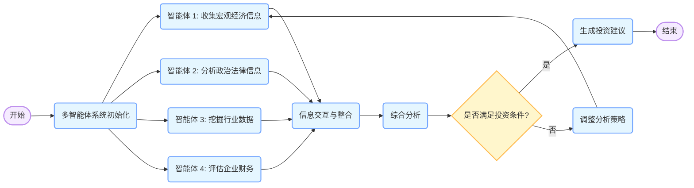

# 多智能体协作进行跨境投资分析

> 关键词：多智能体协作、跨境投资分析、智能体交互、投资决策、数据分析

> 摘要：本文聚焦于多智能体协作在跨境投资分析领域的应用。随着全球经济一体化的推进，跨境投资变得日益复杂，传统分析方法已难以满足需求。多智能体协作通过多个智能体之间的交互与合作，能够更全面、高效地处理跨境投资中的海量信息，为投资者提供更精准的决策支持。文章详细介绍了多智能体协作的核心概念、算法原理、数学模型，通过项目实战展示其具体应用，探讨了实际应用场景，并推荐了相关工具和资源，最后对未来发展趋势与挑战进行了总结。

## 1. 背景介绍 
### 1.1 目的和范围
随着全球经济的紧密联系，跨境投资成为众多投资者拓展业务、分散风险、追求更高回报的重要途径。然而，跨境投资涉及不同国家和地区的政治、经济、法律、文化等多方面因素，投资环境复杂多变，信息量大且分散。传统的投资分析方法往往难以全面、及时地处理这些信息，导致投资决策存在一定的局限性。

本文旨在探讨多智能体协作在跨境投资分析中的应用，通过多个智能体的分工协作，实现对跨境投资相关信息的高效收集、分析和处理，为投资者提供更科学、准确的投资决策依据。研究范围涵盖多智能体协作的基本原理、算法实现、数学模型构建，以及在跨境投资分析中的实际应用案例。

### 1.2 预期读者
本文的预期读者包括从事跨境投资的专业人士，如投资经理、分析师、基金管理人等，他们可以从文中获取多智能体协作在跨境投资分析中的具体应用方法和技术，提升投资决策的准确性和效率。同时，对人工智能、多智能体系统感兴趣的研究人员和学生也可以通过本文了解多智能体技术在金融领域的应用场景和发展趋势。此外，金融科技企业的技术人员和管理人员也能从中获得启发，探索将多智能体协作技术应用于实际业务的可能性。

### 1.3 文档结构概述
本文将按照以下结构展开：
- 核心概念与联系：介绍多智能体协作和跨境投资分析的核心概念，阐述两者之间的联系，并通过文本示意图和 Mermaid 流程图进行直观展示。
- 核心算法原理 & 具体操作步骤：详细讲解多智能体协作中涉及的核心算法原理，并用 Python 源代码进行具体实现和说明。
- 数学模型和公式 & 详细讲解 & 举例说明：构建多智能体协作在跨境投资分析中的数学模型，给出相关公式，并通过具体例子进行详细讲解。
- 项目实战：代码实际案例和详细解释说明：通过一个实际的跨境投资分析项目，介绍开发环境搭建、源代码实现和代码解读。
- 实际应用场景：探讨多智能体协作在跨境投资分析中的具体应用场景。
- 工具和资源推荐：推荐学习多智能体协作和跨境投资分析相关的书籍、在线课程、技术博客和网站，以及开发工具、框架和相关论文著作。
- 总结：未来发展趋势与挑战：对多智能体协作在跨境投资分析领域的未来发展趋势进行展望，并分析可能面临的挑战。
- 附录：常见问题与解答：解答读者在阅读过程中可能遇到的常见问题。
- 扩展阅读 & 参考资料：提供相关的扩展阅读资料和参考文献。

### 1.4 术语表
#### 1.4.1 核心术语定义
- **多智能体系统（Multi-Agent System，MAS）**：由多个智能体组成的系统，每个智能体具有一定的自主性、反应性和社会性，能够通过与其他智能体的交互和协作完成特定的任务。
- **智能体（Agent）**：具有感知、决策和行动能力的实体，能够根据自身的目标和环境信息自主地做出决策并执行相应的动作。
- **跨境投资分析**：对跨越不同国家和地区的投资项目进行评估和分析，包括对投资目标国家和地区的政治、经济、法律、市场等方面的研究，以及对投资项目的风险和收益进行预测。
- **投资决策**：投资者根据投资分析的结果，在众多投资机会中选择合适的投资项目的过程。

#### 1.4.2 相关概念解释
- **自主性**：智能体能够独立地感知环境信息，根据自身的目标和规则自主地做出决策，而不需要外部的直接干预。
- **反应性**：智能体能够对环境的变化做出及时的反应，调整自己的行为以适应环境的需求。
- **社会性**：智能体能够与其他智能体进行交互和协作，通过信息共享和合作完成单个智能体无法完成的任务。

#### 1.4.3 缩略词列表
- MAS：Multi-Agent System（多智能体系统）
- AI：Artificial Intelligence（人工智能）

## 2. 核心概念与联系 
### 多智能体协作的核心概念
多智能体协作是指多个智能体通过相互通信、协调和合作，共同完成一个或多个任务的过程。在多智能体系统中，每个智能体都有自己的目标和能力，它们通过与其他智能体的交互来实现信息共享和资源整合，从而提高整个系统的性能和效率。

智能体的基本结构通常包括感知模块、决策模块和行动模块。感知模块用于获取环境信息，决策模块根据感知到的信息和自身的目标做出决策，行动模块则根据决策结果执行相应的动作。智能体之间的交互可以通过消息传递、协商、合作等方式实现。

### 跨境投资分析的核心概念
跨境投资分析是一个复杂的过程，需要考虑多个方面的因素。主要包括以下几个方面：
- **宏观经济分析**：研究目标国家和地区的宏观经济状况，如 GDP 增长率、通货膨胀率、利率、汇率等，以评估投资环境的稳定性和发展潜力。
- **政治法律分析**：分析目标国家和地区的政治局势、政策法规、监管环境等，以评估投资的政治风险和法律合规性。
- **行业分析**：研究目标行业的市场规模、竞争格局、发展趋势等，以评估投资项目在行业中的竞争力和发展前景。
- **企业分析**：对投资目标企业的财务状况、经营业绩、管理团队等进行分析，以评估企业的投资价值和风险。

### 两者之间的联系
多智能体协作可以为跨境投资分析提供强大的支持。通过多个智能体的分工协作，可以实现对跨境投资相关信息的全面、高效收集和分析。例如，可以设计不同类型的智能体分别负责宏观经济信息收集、政治法律信息分析、行业数据挖掘和企业财务评估等任务。这些智能体之间通过交互和协作，将各自的分析结果进行整合和共享，从而为投资者提供更全面、准确的投资决策依据。

### 文本示意图
```plaintext
多智能体协作进行跨境投资分析
|
|-- 多智能体系统
|   |-- 智能体 1（宏观经济信息收集）
|   |-- 智能体 2（政治法律信息分析）
|   |-- 智能体 3（行业数据挖掘）
|   |-- 智能体 4（企业财务评估）
|   |--...
|
|-- 跨境投资分析
|   |-- 宏观经济分析
|   |-- 政治法律分析
|   |-- 行业分析
|   |-- 企业分析
|
|-- 信息交互与整合
|   |-- 智能体之间的信息共享
|   |-- 分析结果的整合
|
|-- 投资决策支持
|   |-- 提供投资建议
|   |-- 评估投资风险和收益
```

### Mermaid 流程图


## 3. 核心算法原理 & 具体操作步骤 
### 核心算法原理
在多智能体协作进行跨境投资分析中，常用的算法包括强化学习算法、遗传算法和蚁群算法等。这里以强化学习算法为例进行详细介绍。

强化学习是一种通过智能体与环境进行交互，不断尝试不同的动作并根据环境反馈的奖励信号来学习最优策略的机器学习方法。在跨境投资分析中，智能体可以将不同的投资决策作为动作，将投资的收益和风险作为奖励信号，通过不断学习来找到最优的投资策略。

强化学习的核心是马尔可夫决策过程（Markov Decision Process，MDP），它可以用一个五元组 $<S, A, P, R, \gamma>$ 来表示，其中：
- $S$ 是状态空间，表示智能体所处的环境状态。
- $A$ 是动作空间，表示智能体可以采取的动作。
- $P$ 是状态转移概率，表示在状态 $s$ 下采取动作 $a$ 后转移到状态 $s'$ 的概率。
- $R$ 是奖励函数，表示在状态 $s$ 下采取动作 $a$ 后获得的奖励。
- $\gamma$ 是折扣因子，用于权衡当前奖励和未来奖励的重要性。

智能体的目标是找到一个最优策略 $\pi^*: S \to A$，使得在该策略下的累积折扣奖励最大化。常用的强化学习算法包括 Q - learning 算法和深度 Q 网络（Deep Q - Network，DQN）算法等。

### Q - learning 算法原理
Q - learning 算法是一种无模型的强化学习算法，它通过学习一个动作价值函数 $Q(s, a)$ 来找到最优策略。动作价值函数 $Q(s, a)$ 表示在状态 $s$ 下采取动作 $a$ 后所能获得的累积折扣奖励的期望值。

Q - learning 算法的更新公式如下：
$$Q(s_t, a_t) \leftarrow Q(s_t, a_t) + \alpha [r_{t+1} + \gamma \max_{a} Q(s_{t+1}, a) - Q(s_t, a_t)]$$
其中：
- $s_t$ 是当前状态。
- $a_t$ 是当前采取的动作。
- $r_{t+1}$ 是执行动作 $a_t$ 后获得的奖励。
- $s_{t+1}$ 是执行动作 $a_t$ 后转移到的下一个状态。
- $\alpha$ 是学习率，控制每次更新的步长。
- $\gamma$ 是折扣因子。

### 具体操作步骤
#### 步骤 1：初始化
- 初始化动作价值函数 $Q(s, a)$ 为任意值，通常初始化为 0。
- 初始化学习率 $\alpha$ 和折扣因子 $\gamma$。

#### 步骤 2：智能体与环境交互
- 智能体根据当前状态 $s_t$，使用某种策略（如 $\epsilon$-贪心策略）选择一个动作 $a_t$。
- 执行动作 $a_t$，环境返回下一个状态 $s_{t+1}$ 和奖励 $r_{t+1}$。

#### 步骤 3：更新动作价值函数
根据 Q - learning 算法的更新公式更新 $Q(s_t, a_t)$。

#### 步骤 4：判断是否结束
如果达到最大迭代次数或满足其他终止条件，则结束学习；否则，返回步骤 2 继续进行交互和学习。

### Python 源代码实现
```python
import numpy as np

# 定义状态空间和动作空间
num_states = 10
num_actions = 5

# 初始化 Q 表
Q = np.zeros((num_states, num_actions))

# 定义学习率和折扣因子
alpha = 0.1
gamma = 0.9

# 定义 epsilon - 贪心策略
epsilon = 0.1

# 定义最大迭代次数
max_iterations = 1000

# 模拟环境的状态转移和奖励函数
def get_next_state_and_reward(state, action):
    # 这里简单模拟，实际应用中需要根据具体情况实现
    next_state = np.random.randint(num_states)
    reward = np.random.randn()
    return next_state, reward

# Q - learning 算法实现
for iteration in range(max_iterations):
    # 随机初始化初始状态
    state = np.random.randint(num_states)
    done = False
    while not done:
        # epsilon - 贪心策略选择动作
        if np.random.uniform(0, 1) < epsilon:
            action = np.random.randint(num_actions)
        else:
            action = np.argmax(Q[state, :])
        
        # 执行动作，获取下一个状态和奖励
        next_state, reward = get_next_state_and_reward(state, action)
        
        # 更新 Q 表
        Q[state, action] = Q[state, action] + alpha * (reward + gamma * np.max(Q[next_state, :]) - Q[state, action])
        
        # 判断是否结束
        if np.random.uniform(0, 1) < 0.1:  # 简单模拟结束条件
            done = True
        
        state = next_state

# 输出最终的 Q 表
print("Final Q - table:")
print(Q)
```

### 代码解释
- 首先，我们定义了状态空间和动作空间的大小，并初始化了 Q 表。
- 然后，设置了学习率、折扣因子和 epsilon 值。
- `get_next_state_and_reward` 函数用于模拟环境的状态转移和奖励函数，实际应用中需要根据具体情况进行实现。
- 在主循环中，我们使用 epsilon - 贪心策略选择动作，执行动作后更新 Q 表，直到满足结束条件。
- 最后，输出最终的 Q 表。

## 4. 数学模型和公式 & 详细讲解 & 举例说明 
### 数学模型构建
在多智能体协作进行跨境投资分析中，我们可以构建一个基于多智能体的投资决策模型。假设存在 $n$ 个智能体，每个智能体负责分析跨境投资的一个方面，如宏观经济、政治法律、行业、企业等。每个智能体根据自己的分析结果给出一个投资评分 $s_i$，其中 $i = 1, 2, \cdots, n$。

我们可以定义一个综合投资评分 $S$ 来表示整个投资项目的可行性，综合投资评分可以通过加权求和的方式得到：
$$S = \sum_{i=1}^{n} w_i s_i$$
其中 $w_i$ 是第 $i$ 个智能体的权重，满足 $\sum_{i=1}^{n} w_i = 1$ 且 $w_i \geq 0$。

### 权重确定方法
权重的确定可以根据智能体的重要性和可靠性来进行。一种常用的方法是层次分析法（Analytic Hierarchy Process，AHP）。层次分析法是一种将复杂问题分解为多个层次，通过两两比较确定各因素相对重要性的方法。

具体步骤如下：
1. **构建层次结构模型**：将跨境投资分析问题分解为目标层（综合投资评分）、准则层（宏观经济、政治法律、行业、企业等）和方案层（具体的投资项目）。
2. **构造判断矩阵**：对准则层中的各个因素进行两两比较，根据相对重要性给出判断矩阵 $A = (a_{ij})_{n \times n}$，其中 $a_{ij}$ 表示因素 $i$ 相对于因素 $j$ 的重要性程度，通常取值为 1, 3, 5, 7, 9 及其倒数。
3. **计算权重向量**：通过求解判断矩阵的最大特征值 $\lambda_{max}$ 及其对应的特征向量 $W$，并对特征向量进行归一化处理，得到权重向量 $w$。
4. **一致性检验**：计算一致性指标 $CI = \frac{\lambda_{max} - n}{n - 1}$，并与平均随机一致性指标 $RI$ 进行比较，计算一致性比率 $CR = \frac{CI}{RI}$。当 $CR < 0.1$ 时，认为判断矩阵具有满意的一致性。

### 举例说明
假设我们有三个智能体，分别负责宏观经济分析、政治法律分析和行业分析，它们的投资评分分别为 $s_1 = 0.8$，$s_2 = 0.6$，$s_3 = 0.7$。通过层次分析法确定的权重分别为 $w_1 = 0.4$，$w_2 = 0.3$，$w_3 = 0.3$。

则综合投资评分 $S$ 为：
$$S = w_1 s_1 + w_2 s_2 + w_3 s_3 = 0.4 \times 0.8 + 0.3 \times 0.6 + 0.3 \times 0.7 = 0.71$$

根据综合投资评分，我们可以判断该投资项目具有一定的可行性，但还需要进一步结合其他因素进行综合考虑。

### 风险评估模型
除了综合投资评分，我们还可以构建一个风险评估模型来评估跨境投资的风险。假设存在 $m$ 种风险因素，每种风险因素的风险程度为 $r_j$，其中 $j = 1, 2, \cdots, m$。我们可以定义一个综合风险评分 $R$ 来表示整个投资项目的风险水平，综合风险评分可以通过加权求和的方式得到：
$$R = \sum_{j=1}^{m} v_j r_j$$
其中 $v_j$ 是第 $j$ 种风险因素的权重，满足 $\sum_{j=1}^{m} v_j = 1$ 且 $v_j \geq 0$。

权重的确定同样可以使用层次分析法。通过综合投资评分和综合风险评分，投资者可以更全面地评估跨境投资项目的可行性和风险。

## 5. 项目实战：代码实际案例和详细解释说明 
### 5.1  开发环境搭建
#### 操作系统
可以选择 Windows、Linux 或 macOS 操作系统，这里以 Ubuntu 18.04 为例进行说明。

#### Python 环境
安装 Python 3.7 或以上版本。可以使用以下命令进行安装：
```bash
sudo apt update
sudo apt install python3 python3-pip
```

#### 依赖库安装
安装所需的 Python 依赖库，包括 NumPy、Pandas、Scikit - learn 等。可以使用以下命令进行安装：
```bash
pip3 install numpy pandas scikit-learn
```

#### 开发工具
可以选择使用 PyCharm、Jupyter Notebook 等开发工具。这里以 Jupyter Notebook 为例，使用以下命令进行安装：
```bash
pip3 install jupyter
```

启动 Jupyter Notebook：
```bash
jupyter notebook
```

### 5.2  源代码详细实现和代码解读
#### 数据准备
假设我们有一个跨境投资数据集，包含宏观经济指标、政治法律指标、行业指标和企业财务指标等。我们可以使用 Pandas 库来读取和处理数据。
```python
import pandas as pd

# 读取数据
data = pd.read_csv('cross_border_investment_data.csv')

# 查看数据基本信息
print(data.info())

# 查看数据集行数和列数
rows, columns = data.shape

# 提取特征和标签
X = data.drop('investment_decision', axis=1)
y = data['investment_decision']
```
代码解释：
- 首先，使用 `pd.read_csv` 函数读取 CSV 格式的数据集。
- 然后，使用 `data.info()` 查看数据的基本信息，包括列名、数据类型和缺失值情况。
- 最后，将数据集分为特征矩阵 $X$ 和标签向量 $y$，其中 `investment_decision` 是投资决策的标签。

#### 智能体定义和协作
我们定义三个智能体，分别负责宏观经济分析、政治法律分析和行业分析。每个智能体使用一个简单的机器学习模型进行分析。
```python
from sklearn.linear_model import LogisticRegression
from sklearn.model_selection import train_test_split
from sklearn.metrics import accuracy_score

# 划分训练集和测试集
X_train, X_test, y_train, y_test = train_test_split(X, y, test_size=0.2, random_state=42)

# 定义智能体 1：宏观经济分析
macro_features = ['gdp_growth_rate', 'inflation_rate', 'interest_rate']
X_train_macro = X_train[macro_features]
X_test_macro = X_test[macro_features]
agent1 = LogisticRegression()
agent1.fit(X_train_macro, y_train)
y_pred_macro = agent1.predict(X_test_macro)
accuracy_macro = accuracy_score(y_test, y_pred_macro)
print(f"Agent 1 (Macro - economic analysis) accuracy: {accuracy_macro}")

# 定义智能体 2：政治法律分析
political_features = ['political_stability', 'legal_framework']
X_train_political = X_train[political_features]
X_test_political = X_test[political_features]
agent2 = LogisticRegression()
agent2.fit(X_train_political, y_train)
y_pred_political = agent2.predict(X_test_political)
accuracy_political = accuracy_score(y_test, y_pred_political)
print(f"Agent 2 (Political - legal analysis) accuracy: {accuracy_political}")

# 定义智能体 3：行业分析
industry_features = ['industry_growth_rate', 'market_share']
X_train_industry = X_train[industry_features]
X_test_industry = X_test[industry_features]
agent3 = LogisticRegression()
agent3.fit(X_train_industry, y_train)
y_pred_industry = agent3.predict(X_test_industry)
accuracy_industry = accuracy_score(y_test, y_pred_industry)
print(f"Agent 3 (Industry analysis) accuracy: {accuracy_industry}")
```
代码解释：
- 首先，使用 `train_test_split` 函数将数据集划分为训练集和测试集。
- 然后，分别定义三个智能体，每个智能体选择相应的特征进行训练和预测。
- 最后，使用 `accuracy_score` 函数计算每个智能体的预测准确率。

#### 综合决策
根据每个智能体的预测结果，进行综合决策。这里我们使用简单的多数投票法。
```python
import numpy as np

# 多数投票法进行综合决策
y_pred_ensemble = []
for i in range(len(y_pred_macro)):
    votes = [y_pred_macro[i], y_pred_political[i], y_pred_industry[i]]
    majority_vote = np.bincount(votes).argmax()
    y_pred_ensemble.append(majority_vote)

# 计算综合决策的准确率
accuracy_ensemble = accuracy_score(y_test, y_pred_ensemble)
print(f"Ensemble accuracy: {accuracy_ensemble}")
```
代码解释：
- 对于每个测试样本，收集三个智能体的预测结果。
- 使用 `np.bincount` 函数统计每个预测结果的投票数，并选择投票数最多的结果作为综合决策的结果。
- 最后，计算综合决策的准确率。

### 5.3  代码解读与分析
通过以上代码，我们实现了一个简单的多智能体协作进行跨境投资分析的项目。每个智能体负责不同方面的分析，通过机器学习模型进行预测。然后，使用多数投票法将各个智能体的预测结果进行综合，得到最终的投资决策。

从代码运行结果可以看出，综合决策的准确率可能会高于单个智能体的准确率，这是因为多个智能体的协作可以充分利用不同方面的信息，提高决策的准确性。同时，我们可以根据实际情况调整智能体的数量、选择不同的机器学习模型和特征，以进一步提高分析的效果。

## 6. 实际应用场景 
### 跨境股票投资分析
在跨境股票投资中，多智能体协作可以发挥重要作用。不同的智能体可以分别负责分析目标国家的宏观经济状况、行业发展趋势、公司财务报表等信息。宏观经济智能体可以关注 GDP 增长率、通货膨胀率、利率等指标，判断宏观经济环境对股票市场的影响；行业智能体可以分析行业的竞争格局、市场规模、技术创新等因素，评估行业的发展前景；公司智能体可以深入研究目标公司的财务状况、经营业绩、管理团队等，判断公司的投资价值。通过多个智能体的协作和信息共享，投资者可以更全面地了解目标股票的投资潜力和风险，做出更明智的投资决策。

### 跨境债券投资分析
对于跨境债券投资，多智能体协作可以帮助投资者评估债券的信用风险、利率风险和汇率风险。信用智能体可以分析债券发行方的信用状况，包括其财务实力、偿债能力、信用评级等；利率智能体可以关注目标国家的利率走势，预测债券价格的波动；汇率智能体可以监测汇率变化，评估汇率波动对债券投资收益的影响。通过综合各个智能体的分析结果，投资者可以更好地选择合适的债券投资项目，合理配置资产，降低投资风险。

### 跨境并购投资分析
在跨境并购投资中，多智能体协作可以为投资者提供全面的决策支持。战略智能体可以分析并购项目是否符合企业的战略发展方向，评估并购的协同效应和潜在价值；财务智能体可以对目标企业的财务状况进行深入分析，包括资产负债表、利润表、现金流量表等，评估并购的成本和收益；法律智能体可以审查并购过程中的法律合规问题，包括合同条款、知识产权、反垄断等；文化智能体可以考虑目标国家和企业的文化差异，评估文化整合的难度和风险。通过多个智能体的协作，投资者可以更准确地评估跨境并购项目的可行性和风险，制定合理的并购策略。

### 跨境房地产投资分析
跨境房地产投资涉及到不同国家和地区的房地产市场、政策法规、经济环境等多个方面的因素。市场智能体可以分析目标地区的房地产市场供需状况、房价走势、租金收益率等；政策智能体可以关注当地的房地产政策，包括土地政策、税收政策、限购政策等；经济智能体可以评估目标地区的经济发展水平、就业情况、人口增长等因素对房地产市场的影响。通过多智能体协作，投资者可以更全面地了解跨境房地产投资的市场环境和风险，做出更合理的投资决策。

## 7. 工具和资源推荐
### 7.1 学习资源推荐
#### 7.1.1 书籍推荐
- 《多智能体系统：原理与编程》：本书系统地介绍了多智能体系统的基本概念、理论和方法，包括智能体的设计、交互协议、协作策略等内容，是学习多智能体系统的经典教材。
- 《投资分析与组合管理》：全面介绍了投资分析的基本原理和方法，包括宏观经济分析、行业分析、公司分析、投资组合理论等内容，对于理解跨境投资分析具有重要的参考价值。
- 《人工智能：一种现代的方法》：这本书涵盖了人工智能的各个领域，包括机器学习、自然语言处理、计算机视觉等，对于了解多智能体协作中的人工智能技术有很大的帮助。

#### 7.1.2 在线课程
- Coursera 上的“Multi - Agent Systems”课程：由知名教授授课，系统地介绍了多智能体系统的理论和实践，包括智能体建模、交互协议设计、协作算法等内容。
- edX 上的“Investment Management”课程：该课程涵盖了投资管理的各个方面，包括投资组合理论、资产定价、风险管理等，对于学习跨境投资分析有很大的帮助。
- 中国大学 MOOC 上的“人工智能基础”课程：介绍了人工智能的基本概念、算法和应用，为学习多智能体协作提供了基础知识。

#### 7.1.3 技术博客和网站
- Medium 上的人工智能和金融科技相关博客：许多专业人士会在 Medium 上分享他们在多智能体协作、跨境投资分析等领域的研究成果和实践经验。
- arXiv 网站：提供了大量的学术论文，包括多智能体系统、人工智能、金融分析等领域的最新研究成果。
- 金融界网站：提供了丰富的金融资讯和投资分析工具，对于了解跨境投资市场和行业动态有很大的帮助。

### 7.2 开发工具框架推荐
#### 7.2.1 IDE和编辑器
- PyCharm：一款功能强大的 Python 集成开发环境，提供了代码编辑、调试、版本控制等功能，适合开发多智能体协作和跨境投资分析相关的 Python 代码。
- Jupyter Notebook：一种交互式的开发环境，支持代码、文本、图表等多种元素的混合展示，方便进行数据分析和模型验证。
- Visual Studio Code：一款轻量级的代码编辑器，支持多种编程语言，具有丰富的插件扩展功能，可以用于开发多智能体系统和投资分析工具。

#### 7.2.2 调试和性能分析工具
- PDB：Python 自带的调试工具，可以帮助开发者定位代码中的错误和问题。
- cProfile：Python 的性能分析工具，可以分析代码的运行时间和函数调用情况，帮助开发者优化代码性能。
- TensorBoard：用于可视化深度学习模型的训练过程和性能指标，对于使用深度学习算法的多智能体协作系统有很大的帮助。

#### 7.2.3 相关框架和库
- Mesa：一个用于构建多智能体系统的 Python 框架，提供了智能体建模、环境模拟、交互协议等功能，方便开发者快速搭建多智能体系统。
- Scikit - learn：一个常用的机器学习库，提供了丰富的机器学习算法和工具，包括分类、回归、聚类等算法，可用于多智能体协作中的数据分析和模型训练。
- Pandas：一个强大的数据分析库，提供了数据结构和数据处理工具，方便开发者读取、处理和分析跨境投资相关的数据。

### 7.3 相关论文著作推荐
#### 7.3.1 经典论文
- “Multi - Agent Systems: A Modern Approach to Distributed Artificial Intelligence”：该论文系统地介绍了多智能体系统的基本概念、理论和方法，是多智能体系统领域的经典之作。
- “A Survey of Multi - Agent Reinforcement Learning”：对多智能体强化学习的研究现状进行了全面的综述，介绍了多种多智能体强化学习算法和应用场景。
- “Investment Analysis and Portfolio Selection”：该论文阐述了投资分析和组合选择的基本原理和方法，对于理解跨境投资分析具有重要的参考价值。

#### 7.3.2 最新研究成果
- 近年来，关于多智能体协作在金融领域的应用研究不断涌现。可以通过 IEEE Xplore、ACM Digital Library 等学术数据库搜索相关的最新研究论文，了解多智能体协作在跨境投资分析中的最新技术和方法。

#### 7.3.3 应用案例分析
- 一些金融机构和研究机构会发布多智能体协作在跨境投资分析中的应用案例。可以通过阅读这些案例，了解多智能体协作技术在实际应用中的具体实施方法和效果评估。

## 8. 总结：未来发展趋势与挑战
### 未来发展趋势
#### 与区块链技术的融合
区块链技术具有去中心化、不可篡改、安全可靠等特点，与多智能体协作相结合可以为跨境投资分析带来更高效、透明和安全的解决方案。例如，通过区块链技术可以实现智能体之间的信息共享和交互的可信性，确保投资数据的真实性和完整性。同时，区块链的智能合约功能可以实现投资决策的自动化执行，提高投资效率。

#### 深度学习和强化学习的进一步应用
随着深度学习和强化学习技术的不断发展，它们将在多智能体协作进行跨境投资分析中发挥更重要的作用。深度学习可以用于处理复杂的非结构化数据，如新闻文本、社交媒体数据等，提取有价值的信息用于投资分析。强化学习可以帮助智能体更好地学习最优的投资策略，根据市场变化实时调整投资决策。

#### 跨领域融合
多智能体协作进行跨境投资分析将与其他领域的技术进行更深入的融合，如物联网、大数据、云计算等。物联网技术可以实时收集跨境投资相关的物理数据，如能源消耗、物流运输等，为投资分析提供更全面的信息。大数据和云计算技术可以提供强大的计算和存储能力，支持多智能体系统处理海量的投资数据。

### 挑战
#### 数据质量和隐私保护
跨境投资分析需要大量的高质量数据，但数据的获取和整合存在一定的困难。不同国家和地区的数据标准和质量参差不齐，可能会影响分析结果的准确性。同时，跨境投资数据涉及到企业和个人的隐私信息，如何在保证数据安全和隐私的前提下进行数据共享和分析是一个亟待解决的问题。

#### 智能体之间的协调和冲突解决
在多智能体协作系统中，智能体之间的协调和冲突解决是一个关键问题。不同智能体可能具有不同的目标和利益，在协作过程中可能会产生冲突。如何设计有效的协调机制和冲突解决策略，确保智能体之间能够高效协作，是多智能体协作进行跨境投资分析面临的挑战之一。

#### 模型的可解释性
深度学习和强化学习等人工智能模型在跨境投资分析中取得了较好的效果，但这些模型往往具有较高的复杂性，缺乏可解释性。投资者需要了解模型的决策过程和依据，以便做出合理的投资决策。如何提高模型的可解释性，是多智能体协作进行跨境投资分析需要解决的重要问题。

## 9. 附录：常见问题与解答
### 问题 1：多智能体协作在跨境投资分析中的优势是什么？
答：多智能体协作可以实现对跨境投资相关信息的全面、高效收集和分析。通过多个智能体的分工协作，每个智能体专注于分析一个方面的信息，然后将分析结果进行整合和共享，从而为投资者提供更全面、准确的投资决策依据。此外，多智能体协作还可以提高系统的灵活性和适应性，能够快速响应市场变化。

### 问题 2：如何确定智能体的权重？
答：可以使用层次分析法（AHP）来确定智能体的权重。层次分析法通过将复杂问题分解为多个层次，对准则层中的各个因素进行两两比较，构造判断矩阵，然后求解判断矩阵的最大特征值及其对应的特征向量，并进行归一化处理，得到权重向量。同时，需要进行一致性检验，确保判断矩阵具有满意的一致性。

### 问题 3：多智能体协作系统的开发难度大吗？
答：多智能体协作系统的开发难度取决于系统的复杂度和应用场景。对于简单的多智能体系统，使用现有的框架和工具可以相对容易地进行开发。但对于复杂的系统，需要考虑智能体的设计、交互协议、协作策略、冲突解决等多个方面的问题，开发难度会相应增加。同时，还需要具备一定的人工智能、机器学习和编程知识。

### 问题 4：如何评估多智能体协作在跨境投资分析中的效果？
答：可以通过以下几个方面来评估多智能体协作在跨境投资分析中的效果：
- **投资决策的准确性**：比较多智能体协作系统给出的投资决策与实际投资结果的一致性，评估系统的预测准确性。
- **风险控制能力**：分析系统在不同市场环境下对投资风险的识别和控制能力，如通过计算风险指标（如夏普比率、波动率等）来评估。
- **效率提升**：比较多智能体协作系统与传统分析方法的分析效率，如分析时间、数据处理能力等。

## 10. 扩展阅读 & 参考资料
### 扩展阅读
- 《金融科技前沿：多智能体系统在金融领域的应用》
- 《跨境投资风险管理与策略》
- 《人工智能与金融创新》

### 参考资料
- Wooldridge, M. (2009). An Introduction to Multi - Agent Systems. John Wiley & Sons.
- Bodie, Z., Kane, A., & Marcus, A. J. (2017). Investments. McGraw - Hill Education.
- Goodfellow, I. J., Bengio, Y., & Courville, A. (2016). Deep Learning. MIT Press.

作者：AI天才研究院/AI Genius Institute & 禅与计算机程序设计艺术 /Zen And The Art of Computer Programming