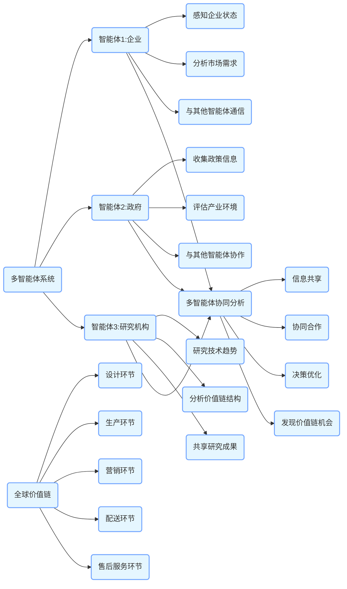

# 多智能体协同分析全球价值链机会

> 关键词：多智能体协同、全球价值链、机会分析、人工智能、经济模型

> 摘要：本文聚焦于多智能体协同在分析全球价值链机会方面的应用。首先介绍了相关背景知识，包括目的、预期读者等。接着阐述了多智能体协同和全球价值链的核心概念及其联系，详细讲解了用于分析的核心算法原理和具体操作步骤，并给出了相应的Python代码示例。同时，运用数学模型和公式对分析过程进行了严谨的描述和说明。通过项目实战部分，展示了如何搭建开发环境、实现源代码以及对代码进行解读分析。还探讨了多智能体协同分析全球价值链机会的实际应用场景，推荐了相关的学习资源、开发工具框架和论文著作。最后总结了未来发展趋势与挑战，并提供了常见问题解答和扩展阅读参考资料。

## 1. 背景介绍 
### 1.1 目的和范围
全球价值链（Global Value Chain，GVC）是当今世界经济的重要特征，它描述了产品或服务从概念到最终消费的整个过程，涉及多个国家和地区的企业、组织和个人。在全球价值链中，不同的参与者承担着不同的角色，创造着不同的价值。分析全球价值链中的机会，有助于企业、政府和其他组织更好地定位自己，优化资源配置，提高竞争力。

多智能体协同（Multi - Agent Collaboration）是人工智能领域的一个重要研究方向，它通过多个智能体之间的交互和合作，实现复杂的任务。将多智能体协同应用于全球价值链机会分析，可以充分利用多个智能体的优势，从不同的角度和层面获取信息，进行综合分析，从而更准确地发现全球价值链中的潜在机会。

本文的范围涵盖了多智能体协同分析全球价值链机会的基本概念、算法原理、数学模型、项目实战以及实际应用场景等方面，旨在为读者提供一个全面的了解和实践指导。

### 1.2 预期读者
本文预期读者包括以下几类人群：
- **企业管理人员**：希望通过分析全球价值链机会，制定企业的战略规划，寻找新的业务增长点。
- **政府政策制定者**：需要了解全球价值链的动态，制定相关政策，促进产业升级和经济发展。
- **研究人员**：对多智能体协同、全球价值链分析等领域感兴趣，希望深入研究相关理论和方法。
- **人工智能开发者**：想要将多智能体协同技术应用到实际项目中，探索新的应用场景。

### 1.3 文档结构概述
本文的结构如下：
- **核心概念与联系**：介绍多智能体协同和全球价值链的核心概念，以及它们之间的联系，并通过文本示意图和Mermaid流程图进行展示。
- **核心算法原理 & 具体操作步骤**：详细讲解用于分析的核心算法原理，并给出具体的操作步骤，同时使用Python源代码进行阐述。
- **数学模型和公式 & 详细讲解 & 举例说明**：运用数学模型和公式对分析过程进行描述和说明，并给出具体的例子。
- **项目实战：代码实际案例和详细解释说明**：通过一个实际的项目案例，展示如何搭建开发环境、实现源代码以及对代码进行解读分析。
- **实际应用场景**：探讨多智能体协同分析全球价值链机会的实际应用场景。
- **工具和资源推荐**：推荐相关的学习资源、开发工具框架和论文著作。
- **总结：未来发展趋势与挑战**：总结多智能体协同分析全球价值链机会的未来发展趋势和面临的挑战。
- **附录：常见问题与解答**：解答读者在阅读过程中可能遇到的常见问题。
- **扩展阅读 & 参考资料**：提供相关的扩展阅读材料和参考资料。

### 1.4 术语表
#### 1.4.1 核心术语定义
- **多智能体系统（Multi - Agent System，MAS）**：由多个智能体组成的系统，智能体之间可以相互通信和协作，共同完成一个或多个任务。
- **智能体（Agent）**：具有自主性、反应性、社会性和主动性的实体，能够感知环境，做出决策，并采取行动。
- **全球价值链（Global Value Chain，GVC）**：指产品或服务从概念到最终消费的整个过程，包括设计、生产、营销、配送和售后服务等环节，涉及多个国家和地区的企业、组织和个人。
- **价值链机会**：指在全球价值链中，存在的能够为企业、组织或个人带来经济利益的潜在机会，如进入新的市场、开发新的产品或服务、提高生产效率等。

#### 1.4.2 相关概念解释
- **协同（Collaboration）**：指多个智能体为了实现共同的目标，通过相互合作和协调，共同完成任务的过程。
- **信息共享（Information Sharing）**：指多个智能体之间交换和共享信息的过程，以便更好地了解环境和其他智能体的状态。
- **决策优化（Decision Optimization）**：指智能体在考虑各种因素的情况下，选择最优的决策方案，以实现自身的目标。

#### 1.4.3 缩略词列表
- MAS：Multi - Agent System（多智能体系统）
- GVC：Global Value Chain（全球价值链）

## 2. 核心概念与联系 
### 2.1 多智能体协同概念
多智能体协同是指多个智能体通过相互通信、协作和协调，共同完成一个或多个任务的过程。每个智能体都具有一定的自主性和智能性，能够感知环境，做出决策，并采取行动。在多智能体系统中，智能体之间的交互可以是合作性的，也可以是竞争性的，具体取决于任务的性质和智能体的目标。

多智能体协同的优点包括：
- **分布式处理**：多个智能体可以并行处理任务，提高处理效率。
- **适应性**：智能体可以根据环境的变化和其他智能体的行为，动态调整自己的策略。
- **鲁棒性**：当部分智能体出现故障或失效时，其他智能体可以继续完成任务，保证系统的稳定性。

### 2.2 全球价值链概念
全球价值链是指产品或服务从概念到最终消费的整个过程，包括设计、生产、营销、配送和售后服务等环节。在全球价值链中，不同的环节由不同的国家和地区的企业、组织和个人承担，每个环节都创造着不同的价值。

全球价值链的特点包括：
- **全球性**：涉及多个国家和地区的企业和组织，跨越了地理边界。
- **分工细化**：不同的环节由不同的专业企业和组织承担，实现了专业化分工。
- **动态性**：随着技术的进步、市场的变化和政策的调整，全球价值链也在不断演变。

### 2.3 两者联系
将多智能体协同应用于全球价值链机会分析，可以充分发挥多智能体系统的优势，从不同的角度和层面获取信息，进行综合分析。具体来说，多智能体可以分别扮演不同的角色，如企业、政府、研究机构等，每个智能体都可以根据自己的专业知识和信息，对全球价值链进行分析和评估。通过智能体之间的信息共享和协同合作，可以更全面、准确地发现全球价值链中的潜在机会。

### 2.4 文本示意图
```plaintext
多智能体协同分析全球价值链机会

多智能体系统
|-- 智能体1（企业）
|   |-- 感知企业自身状态
|   |-- 分析市场需求
|   |-- 与其他智能体通信
|-- 智能体2（政府）
|   |-- 收集政策信息
|   |-- 评估产业环境
|   |-- 与其他智能体协作
|-- 智能体3（研究机构）
|   |-- 研究技术趋势
|   |-- 分析价值链结构
|   |-- 共享研究成果

全球价值链
|-- 设计环节
|-- 生产环节
|-- 营销环节
|-- 配送环节
|-- 售后服务环节

多智能体协同分析
|-- 信息共享
|-- 协同合作
|-- 决策优化
|-- 发现价值链机会
```

### 2.5 Mermaid流程图


## 3. 核心算法原理 & 具体操作步骤 
### 3.1 核心算法原理
在多智能体协同分析全球价值链机会的过程中，我们可以使用基于强化学习的算法。强化学习是一种机器学习方法，智能体通过与环境进行交互，不断尝试不同的动作，并根据环境反馈的奖励信号来调整自己的策略，以最大化长期累积奖励。

具体来说，每个智能体可以将全球价值链中的不同环节看作是环境的状态，将自己的决策（如进入某个环节、与其他企业合作等）看作是动作。智能体在每个状态下选择一个动作，并根据执行该动作后环境反馈的奖励信号来更新自己的策略。

我们可以使用Q - learning算法作为核心算法。Q - learning是一种无模型的强化学习算法，它通过维护一个Q表来记录每个状态 - 动作对的价值。Q表中的每个元素 $Q(s,a)$ 表示在状态 $s$ 下选择动作 $a$ 的预期累积奖励。

### 3.2 Python代码实现
```python
import numpy as np

# 定义状态和动作的数量
num_states = 5  # 假设全球价值链有5个环节
num_actions = 3  # 假设每个智能体有3种决策

# 初始化Q表
Q = np.zeros((num_states, num_actions))

# 定义学习率和折扣因子
learning_rate = 0.1
discount_factor = 0.9

# 定义环境反馈的奖励函数
def get_reward(state, action):
    # 这里简单假设一个奖励函数，实际应用中需要根据具体情况定义
    if state == 0 and action == 0:
        return 1
    elif state == 1 and action == 1:
        return 2
    else:
        return 0

# Q - learning算法
def q_learning(num_episodes):
    for episode in range(num_episodes):
        # 随机初始化状态
        state = np.random.randint(0, num_states)
        done = False
        while not done:
            # 选择动作
            if np.random.uniform(0, 1) < 0.1:  # 探索率为0.1
                action = np.random.randint(0, num_actions)
            else:
                action = np.argmax(Q[state, :])
            # 获取奖励
            reward = get_reward(state, action)
            # 更新Q表
            next_state = (state + 1) % num_states  # 简单假设状态转移规则
            Q[state, action] = Q[state, action] + learning_rate * (reward + discount_factor * np.max(Q[next_state, :]) - Q[state, action])
            state = next_state
            # 判断是否结束
            if state == 4:
                done = True
    return Q

# 训练Q表
Q = q_learning(num_episodes=1000)
print("训练后的Q表：")
print(Q)
```

### 3.3 具体操作步骤
1. **初始化**：初始化Q表、学习率和折扣因子。
2. **选择动作**：在每个状态下，智能体根据Q表选择一个动作。可以使用ε - greedy策略，以一定的概率进行探索（随机选择动作），以一定的概率进行利用（选择Q值最大的动作）。
3. **执行动作并获取奖励**：智能体执行选择的动作，并根据环境反馈的奖励信号更新Q表。
4. **状态转移**：根据环境的状态转移规则，智能体转移到下一个状态。
5. **重复步骤2 - 4**：直到达到终止条件（如达到最大步数或完成任务）。
6. **训练结束**：经过多次训练后，Q表收敛，智能体可以根据Q表选择最优的动作。

## 4. 数学模型和公式 & 详细讲解 & 举例说明 
### 4.1 Q - learning算法的数学模型
Q - learning算法的核心是更新Q表，其更新公式如下：

$$Q(s,a) \leftarrow Q(s,a) + \alpha [r + \gamma \max_{a'} Q(s',a') - Q(s,a)]$$

其中：
- $Q(s,a)$ 表示在状态 $s$ 下选择动作 $a$ 的Q值。
- $\alpha$ 是学习率，控制每次更新的步长，取值范围为 $(0,1]$。
- $r$ 是执行动作 $a$ 后从环境中获得的即时奖励。
- $\gamma$ 是折扣因子，取值范围为 $[0,1]$，用于衡量未来奖励的重要性。
- $s'$ 是执行动作 $a$ 后转移到的下一个状态。
- $\max_{a'} Q(s',a')$ 表示在下一个状态 $s'$ 下选择最优动作的Q值。

### 4.2 详细讲解
- **学习率 $\alpha$**：学习率控制了每次更新Q值时的步长。如果 $\alpha$ 过大，Q值的更新会过于剧烈，可能导致算法无法收敛；如果 $\alpha$ 过小，Q值的更新会过于缓慢，算法的收敛速度会变慢。
- **折扣因子 $\gamma$**：折扣因子衡量了未来奖励的重要性。如果 $\gamma$ 接近1，智能体更注重长期奖励；如果 $\gamma$ 接近0，智能体更注重即时奖励。
- **Q值更新**：Q值的更新是基于贝尔曼方程的思想，即当前状态 - 动作对的Q值等于即时奖励加上下一个状态下最优动作的Q值的折扣和。

### 4.3 举例说明
假设我们有一个简单的全球价值链，只有两个状态 $s_0$ 和 $s_1$，每个状态下有两个动作 $a_0$ 和 $a_1$。初始时，Q表如下：

$$
Q = 
\begin{bmatrix}
0 & 0 \\
0 & 0
\end{bmatrix}
$$

学习率 $\alpha = 0.1$，折扣因子 $\gamma = 0.9$。

现在，智能体处于状态 $s_0$，选择动作 $a_0$，执行该动作后获得即时奖励 $r = 1$，并转移到状态 $s_1$。在状态 $s_1$ 下，选择最优动作 $a_1$ 的Q值为 $Q(s_1,a_1) = 0$。

根据Q - learning更新公式，更新 $Q(s_0,a_0)$ 的值：

$$
\begin{align*}
Q(s_0,a_0) &\leftarrow Q(s_0,a_0) + \alpha [r + \gamma \max_{a'} Q(s_1,a') - Q(s_0,a_0)] \\
&= 0 + 0.1 [1 + 0.9 \times 0 - 0] \\
&= 0.1
\end{align*}
$$

更新后的Q表为：

$$
Q = 
\begin{bmatrix}
0.1 & 0 \\
0 & 0
\end{bmatrix}
$$

## 5. 项目实战：代码实际案例和详细解释说明 
### 5.1  开发环境搭建
#### 5.1.1 安装Python
首先，需要安装Python编程语言。可以从Python官方网站（https://www.python.org/downloads/）下载适合自己操作系统的Python版本，并按照安装向导进行安装。

#### 5.1.2 安装必要的库
在多智能体协同分析全球价值链机会的项目中，需要使用一些Python库，如NumPy、Matplotlib等。可以使用pip命令来安装这些库：
```sh
pip install numpy matplotlib
```

### 5.2  源代码详细实现和代码解读
```python
import numpy as np
import matplotlib.pyplot as plt

# 定义状态和动作的数量
num_states = 5  # 假设全球价值链有5个环节
num_actions = 3  # 假设每个智能体有3种决策

# 初始化Q表
Q = np.zeros((num_states, num_actions))

# 定义学习率和折扣因子
learning_rate = 0.1
discount_factor = 0.9

# 定义环境反馈的奖励函数
def get_reward(state, action):
    # 这里简单假设一个奖励函数，实际应用中需要根据具体情况定义
    if state == 0 and action == 0:
        return 1
    elif state == 1 and action == 1:
        return 2
    else:
        return 0

# Q - learning算法
def q_learning(num_episodes):
    rewards = []
    for episode in range(num_episodes):
        # 随机初始化状态
        state = np.random.randint(0, num_states)
        total_reward = 0
        done = False
        while not done:
            # 选择动作
            if np.random.uniform(0, 1) < 0.1:  # 探索率为0.1
                action = np.random.randint(0, num_actions)
            else:
                action = np.argmax(Q[state, :])
            # 获取奖励
            reward = get_reward(state, action)
            total_reward += reward
            # 更新Q表
            next_state = (state + 1) % num_states  # 简单假设状态转移规则
            Q[state, action] = Q[state, action] + learning_rate * (reward + discount_factor * np.max(Q[next_state, :]) - Q[state, action])
            state = next_state
            # 判断是否结束
            if state == 4:
                done = True
        rewards.append(total_reward)
    return Q, rewards

# 训练Q表
num_episodes = 1000
Q, rewards = q_learning(num_episodes)
print("训练后的Q表：")
print(Q)

# 绘制奖励曲线
plt.plot(range(num_episodes), rewards)
plt.xlabel('Episode')
plt.ylabel('Total Reward')
plt.title('Training Rewards')
plt.show()
```

### 5.3  代码解读与分析
#### 5.3.1 初始化部分
```python
# 定义状态和动作的数量
num_states = 5  # 假设全球价值链有5个环节
num_actions = 3  # 假设每个智能体有3种决策

# 初始化Q表
Q = np.zeros((num_states, num_actions))

# 定义学习率和折扣因子
learning_rate = 0.1
discount_factor = 0.9
```
这部分代码定义了状态和动作的数量，初始化了Q表，并设置了学习率和折扣因子。

#### 5.3.2 奖励函数
```python
# 定义环境反馈的奖励函数
def get_reward(state, action):
    # 这里简单假设一个奖励函数，实际应用中需要根据具体情况定义
    if state == 0 and action == 0:
        return 1
    elif state == 1 and action == 1:
        return 2
    else:
        return 0
```
这部分代码定义了环境反馈的奖励函数，根据状态和动作返回相应的奖励。

#### 5.3.3 Q - learning算法
```python
# Q - learning算法
def q_learning(num_episodes):
    rewards = []
    for episode in range(num_episodes):
        # 随机初始化状态
        state = np.random.randint(0, num_states)
        total_reward = 0
        done = False
        while not done:
            # 选择动作
            if np.random.uniform(0, 1) < 0.1:  # 探索率为0.1
                action = np.random.randint(0, num_actions)
            else:
                action = np.argmax(Q[state, :])
            # 获取奖励
            reward = get_reward(state, action)
            total_reward += reward
            # 更新Q表
            next_state = (state + 1) % num_states  # 简单假设状态转移规则
            Q[state, action] = Q[state, action] + learning_rate * (reward + discount_factor * np.max(Q[next_state, :]) - Q[state, action])
            state = next_state
            # 判断是否结束
            if state == 4:
                done = True
        rewards.append(total_reward)
    return Q, rewards
```
这部分代码实现了Q - learning算法，包括选择动作、获取奖励、更新Q表和状态转移等步骤。同时，记录了每个回合的总奖励。

#### 5.3.4 训练和绘图
```python
# 训练Q表
num_episodes = 1000
Q, rewards = q_learning(num_episodes)
print("训练后的Q表：")
print(Q)

# 绘制奖励曲线
plt.plot(range(num_episodes), rewards)
plt.xlabel('Episode')
plt.ylabel('Total Reward')
plt.title('Training Rewards')
plt.show()
```
这部分代码调用Q - learning算法进行训练，并绘制了训练过程中的奖励曲线，用于观察算法的收敛情况。

## 6. 实际应用场景 
### 6.1 企业战略规划
企业可以利用多智能体协同分析全球价值链机会，制定自己的战略规划。例如，通过多个智能体分别分析市场需求、竞争对手、技术趋势等信息，企业可以更全面地了解全球价值链的现状和未来发展趋势，从而选择合适的环节进入，优化产品结构，提高竞争力。

### 6.2 政府政策制定
政府可以运用多智能体协同技术分析全球价值链机会，制定相关政策，促进产业升级和经济发展。例如，通过智能体收集和分析企业的需求、产业环境等信息，政府可以制定针对性的政策，如税收优惠、研发补贴等，引导企业在全球价值链中向高端环节攀升。

### 6.3 供应链管理
在供应链管理中，多智能体协同可以帮助企业更好地协调供应商、制造商和经销商之间的关系，优化供应链的效率和成本。例如，通过智能体实时监测供应链中的库存、物流等信息，企业可以及时调整生产和配送计划，避免库存积压和缺货现象的发生。

### 6.4 国际合作与投资
多智能体协同分析全球价值链机会可以为国际合作与投资提供决策支持。例如，企业可以通过智能体分析不同国家和地区的产业政策、市场潜力等信息，选择合适的合作伙伴和投资项目，拓展国际市场。

## 7. 工具和资源推荐
### 7.1 学习资源推荐
#### 7.1.1 书籍推荐
- 《人工智能：一种现代的方法》（Artificial Intelligence: A Modern Approach）：这本书是人工智能领域的经典教材，涵盖了多智能体系统、强化学习等多个方面的内容。
- 《强化学习：原理与Python实现》（Reinforcement Learning: An Introduction）：这本书系统地介绍了强化学习的理论和方法，并提供了Python代码示例。
- 《全球价值链与发展》（Global Value Chains and Development）：这本书深入探讨了全球价值链的理论和实践，对于理解全球价值链的概念和分析方法有很大的帮助。

#### 7.1.2 在线课程
- Coursera上的“人工智能基础”（Foundations of Artificial Intelligence）课程：该课程由斯坦福大学的教授授课，介绍了人工智能的基本概念和方法，包括多智能体系统和强化学习。
- edX上的“强化学习”（Reinforcement Learning）课程：该课程由加州大学伯克利分校的教授授课，详细讲解了强化学习的理论和算法。

#### 7.1.3 技术博客和网站
- Towards Data Science：这是一个专注于数据科学和人工智能的技术博客，上面有很多关于多智能体协同和强化学习的文章。
- OpenAI Blog：OpenAI的官方博客，提供了很多关于人工智能最新研究成果的信息。

### 7.2 开发工具框架推荐
#### 7.2.1 IDE和编辑器
- PyCharm：这是一款专门为Python开发设计的集成开发环境（IDE），具有代码编辑、调试、版本控制等功能。
- Jupyter Notebook：这是一个交互式的开发环境，适合进行数据探索和模型开发。

#### 7.2.2 调试和性能分析工具
- PDB：Python自带的调试工具，可以帮助开发者调试代码，查找错误。
- cProfile：Python的性能分析工具，可以分析代码的运行时间和内存使用情况。

#### 7.2.3 相关框架和库
- NumPy：这是一个用于科学计算的Python库，提供了高效的数组操作和数学函数。
- TensorFlow：这是一个开源的机器学习框架，支持多智能体系统和强化学习的开发。
- Gym：这是一个开源的强化学习环境库，提供了很多标准的强化学习环境，方便开发者进行算法测试和验证。

### 7.3 相关论文著作推荐
#### 7.3.1 经典论文
- “Multi - Agent Systems: A Modern Approach to Distributed Artificial Intelligence”：这篇论文介绍了多智能体系统的基本概念和方法，是多智能体系统领域的经典论文。
- “Q - learning”：这篇论文提出了Q - learning算法，是强化学习领域的重要论文。

#### 7.3.2 最新研究成果
- 可以关注ACM SIGART（Association for Computing Machinery Special Interest Group on Artificial Intelligence）、IEEE Transactions on Neural Networks and Learning Systems等学术期刊和会议，获取多智能体协同和全球价值链分析领域的最新研究成果。

#### 7.3.3 应用案例分析
- 可以参考一些企业和研究机构发布的报告和案例分析，了解多智能体协同在实际应用中的效果和经验。

## 8. 总结：未来发展趋势与挑战
### 8.1 未来发展趋势
- **智能化程度提高**：随着人工智能技术的不断发展，多智能体系统的智能化程度将不断提高，智能体将能够更好地理解环境和其他智能体的行为，做出更准确的决策。
- **与其他技术融合**：多智能体协同将与区块链、物联网等技术融合，实现更高效的信息共享和协同合作，为全球价值链分析带来更多的创新应用。
- **应用领域拓展**：多智能体协同分析全球价值链机会的应用领域将不断拓展，除了企业战略规划、政府政策制定等领域，还将应用于医疗、教育、能源等更多领域。

### 8.2 挑战
- **智能体间通信和协调**：在多智能体系统中，智能体之间的通信和协调是一个关键问题。如何确保智能体之间能够高效地交换信息，避免冲突和误解，是需要解决的挑战之一。
- **数据质量和安全**：多智能体协同分析需要大量的数据支持，数据的质量和安全直接影响分析结果的准确性和可靠性。如何保证数据的质量和安全，是需要解决的另一个挑战。
- **模型复杂度和可解释性**：随着多智能体系统和全球价值链的复杂度不断增加，模型的复杂度也会相应提高。如何在保证模型准确性的同时，提高模型的可解释性，让决策者能够理解模型的决策过程和结果，是需要解决的又一个挑战。

## 9. 附录：常见问题与解答
### 9.1 多智能体协同分析全球价值链机会的准确性如何保证？
要保证多智能体协同分析全球价值链机会的准确性，需要从以下几个方面入手：
- **数据质量**：确保收集到的数据准确、完整、及时。可以通过多种渠道收集数据，并进行数据清洗和预处理，去除噪声和错误数据。
- **模型选择和优化**：选择合适的模型，并对模型进行优化。可以使用交叉验证、网格搜索等方法来选择最优的模型参数。
- **智能体间协同**：确保智能体之间能够高效地通信和协调，避免信息冲突和误解。可以设计合理的通信协议和协调机制。

### 9.2 多智能体系统中的智能体如何进行学习和进化？
多智能体系统中的智能体可以通过强化学习、遗传算法等方法进行学习和进化。
- **强化学习**：智能体通过与环境进行交互，不断尝试不同的动作，并根据环境反馈的奖励信号来调整自己的策略，以最大化长期累积奖励。
- **遗传算法**：智能体可以通过遗传算法进行进化，通过选择、交叉和变异等操作，不断优化自己的策略。

### 9.3 如何将多智能体协同分析应用到实际项目中？
将多智能体协同分析应用到实际项目中，可以按照以下步骤进行：
- **问题定义**：明确项目的目标和问题，确定需要分析的全球价值链环节和相关因素。
- **智能体设计**：设计合适的智能体，包括智能体的功能、行为和通信方式。
- **数据收集和预处理**：收集相关的数据，并进行数据清洗和预处理。
- **模型选择和训练**：选择合适的模型，并使用收集到的数据进行训练。
- **系统实现和测试**：实现多智能体系统，并进行测试和优化。
- **应用和评估**：将多智能体系统应用到实际项目中，并对分析结果进行评估和反馈。

## 10. 扩展阅读 & 参考资料
### 10.1 扩展阅读
- 《复杂网络与多智能体系统》：深入探讨了复杂网络和多智能体系统的理论和应用。
- 《数字经济时代的全球价值链重构》：分析了数字经济时代全球价值链的新特点和重构趋势。

### 10.2 参考资料
- 《多智能体系统导论》（Introduction to Multi - Agent Systems）
- 《全球价值链研究手册》（Handbook on Global Value Chain Research）

作者：AI天才研究院/AI Genius Institute & 禅与计算机程序设计艺术 /Zen And The Art of Computer Programming