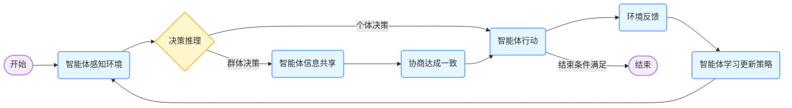

# 多智能体协同学习增强群体决策推理

> 关键词：多智能体协同学习、群体决策推理、强化学习、智能体交互、决策优化

> 摘要：本文聚焦于多智能体协同学习在增强群体决策推理方面的应用。首先介绍了相关背景，包括目的、预期读者、文档结构和术语表。接着阐述了多智能体协同学习和群体决策推理的核心概念及其联系，给出了原理和架构的文本示意图与Mermaid流程图。详细讲解了核心算法原理和具体操作步骤，通过Python源代码进行说明。深入探讨了数学模型和公式，并举例说明。通过项目实战，展示了代码实际案例及详细解释。分析了多智能体协同学习在群体决策推理中的实际应用场景，推荐了学习资源、开发工具框架和相关论文著作。最后总结了未来发展趋势与挑战，提供了常见问题解答和扩展阅读参考资料，旨在为该领域的研究和实践提供全面而深入的指导。

## 1. 背景介绍 
### 1.1 目的和范围
在当今复杂多变的环境中，许多决策问题往往具有高度的复杂性和不确定性，单一智能体难以全面、准确地处理这些问题。多智能体协同学习增强群体决策推理旨在通过多个智能体之间的协作和信息共享，提高群体决策的质量和效率。本文章的范围涵盖了多智能体协同学习的基本概念、核心算法、数学模型，以及如何将其应用于群体决策推理的实际场景中，同时提供了相关的代码示例和工具资源推荐。

### 1.2 预期读者
本文预期读者包括人工智能、机器学习、计算机科学等领域的研究人员、工程师和学生，以及对群体决策和智能系统感兴趣的专业人士。对于那些希望了解多智能体系统如何在决策过程中发挥作用，以及如何通过协同学习提高决策效果的读者来说，本文将提供有价值的信息和技术指导。

### 1.3 文档结构概述
本文将按照以下结构进行组织：首先介绍多智能体协同学习和群体决策推理的背景知识，包括目的、读者群体和文档结构。接着阐述核心概念和它们之间的联系，通过文本示意图和Mermaid流程图进行直观展示。然后详细讲解核心算法原理和具体操作步骤，结合Python代码进行说明。之后探讨相关的数学模型和公式，并给出具体的例子。通过项目实战部分，展示如何在实际中应用这些技术，包括开发环境搭建、源代码实现和代码解读。分析多智能体协同学习在群体决策推理中的实际应用场景。推荐相关的学习资源、开发工具框架和论文著作。最后总结未来发展趋势与挑战，提供常见问题解答和扩展阅读参考资料。

### 1.4 术语表
#### 1.4.1 核心术语定义
- **多智能体系统（Multi-Agent System，MAS）**：由多个智能体组成的系统，这些智能体能够感知环境、进行决策并采取行动，通过相互协作来实现共同或各自的目标。
- **智能体（Agent）**：具有自主性、反应性、社会性和主动性的实体，能够在一定环境中独立运行并与其他智能体进行交互。
- **协同学习（Collaborative Learning）**：多个智能体通过共享信息、交流经验和相互学习，以提高整体性能和解决问题的能力。
- **群体决策推理（Group Decision Reasoning）**：多个智能体共同参与决策过程，通过对各种信息的分析和推理，得出最优或较优的决策方案。
- **强化学习（Reinforcement Learning）**：一种机器学习方法，智能体通过与环境进行交互，根据环境反馈的奖励信号来学习最优的行为策略。

#### 1.4.2 相关概念解释
- **信息共享**：在多智能体系统中，智能体之间交换各自所拥有的信息，以便更好地了解环境和其他智能体的状态。
- **策略优化**：智能体通过不断调整自己的行为策略，以最大化长期累积奖励。
- **一致性达成**：多个智能体在决策过程中，通过协商和交流，达成一致的决策意见。

#### 1.4.3 缩略词列表
- MAS：Multi-Agent System（多智能体系统）
- RL：Reinforcement Learning（强化学习）
- Q - learning：Q学习算法

## 2. 核心概念与联系 

### 核心概念原理
#### 多智能体协同学习
多智能体协同学习是指多个智能体在同一环境中相互协作，共同学习以实现特定目标的过程。每个智能体都有自己的感知能力、决策能力和行动能力，它们通过与环境和其他智能体的交互来获取信息，并根据这些信息调整自己的行为策略。在协同学习中，智能体之间可以共享信息、互相帮助，从而提高整个系统的性能。例如，在一个多机器人协作的场景中，每个机器人可以通过传感器感知周围环境，然后与其他机器人共享这些信息，共同规划路径以完成任务。

#### 群体决策推理
群体决策推理是多个智能体共同参与决策过程的一种方式。在这个过程中，每个智能体根据自己的知识和经验，对问题进行分析和推理，并提出自己的决策建议。然后，通过一定的协商和交流机制，智能体们达成一致的决策意见。群体决策推理可以充分利用多个智能体的优势，提高决策的准确性和可靠性。例如，在一个商业决策场景中，不同部门的智能体可以根据自己的专业知识，对市场趋势、成本效益等因素进行分析，然后共同制定出最优的商业策略。

### 架构的文本示意图
多智能体协同学习增强群体决策推理的架构可以描述如下：

多个智能体分布在环境中，每个智能体都有自己的感知模块、决策模块和行动模块。感知模块负责收集环境信息和其他智能体的信息，决策模块根据感知到的信息进行决策推理，行动模块根据决策结果采取相应的行动。智能体之间通过通信模块进行信息共享和交流，以实现协同学习和群体决策。同时，环境会对智能体的行动做出反馈，智能体根据反馈调整自己的行为策略。

### Mermaid流程图


## 3. 核心算法原理 & 具体操作步骤 

### 核心算法原理 - Q - learning算法
Q - learning是一种经典的强化学习算法，常用于多智能体协同学习中。其核心思想是通过学习一个动作价值函数 $Q(s, a)$ 来确定在某个状态 $s$ 下采取某个动作 $a$ 的价值。智能体在每个时间步根据当前状态选择一个动作，执行该动作后会得到一个奖励 $r$ 并转移到下一个状态 $s'$，然后根据奖励和下一个状态的最大动作价值来更新当前状态 - 动作对的 $Q$ 值。

### Python源代码详细阐述
```python
import numpy as np

# 定义环境参数
num_states = 10
num_actions = 4
gamma = 0.9  # 折扣因子
alpha = 0.1  # 学习率

# 初始化Q表
Q = np.zeros((num_states, num_actions))

# 定义一个简单的环境反馈函数
def get_reward(state, action):
    # 这里简单模拟环境反馈，实际应用中需要根据具体问题定义
    if state == 5 and action == 2:
        return 10
    return -1

# 定义状态转移函数
def transition(state, action):
    # 简单的状态转移，实际应用中需要根据具体问题定义
    new_state = (state + action) % num_states
    return new_state

# Q - learning算法迭代
num_episodes = 1000
for episode in range(num_episodes):
    state = np.random.randint(0, num_states)  # 随机初始化状态
    done = False
    while not done:
        # 选择动作，这里使用epsilon - greedy策略
        epsilon = 0.1
        if np.random.uniform(0, 1) < epsilon:
            action = np.random.randint(0, num_actions)
        else:
            action = np.argmax(Q[state, :])
        
        # 执行动作，获取奖励和下一个状态
        reward = get_reward(state, action)
        next_state = transition(state, action)
        
        # 更新Q表
        Q[state, action] = Q[state, action] + alpha * (reward + gamma * np.max(Q[next_state, :]) - Q[state, action])
        
        state = next_state
        
        # 判断是否结束
        if state == 5 and action == 2:
            done = True

print("最终的Q表：")
print(Q)
```

### 具体操作步骤
1. **初始化**：初始化Q表 $Q(s, a)$ 为全零矩阵，设置折扣因子 $\gamma$ 和学习率 $\alpha$。
2. **选择动作**：在每个时间步，根据当前状态 $s$ 选择一个动作 $a$。可以使用epsilon - greedy策略，以一定的概率 $\epsilon$ 随机选择动作，以 $1 - \epsilon$ 的概率选择 $Q$ 值最大的动作。
3. **执行动作**：执行选择的动作 $a$，从环境中获取奖励 $r$ 和下一个状态 $s'$。
4. **更新Q表**：根据奖励 $r$ 和下一个状态的最大动作价值，使用以下公式更新当前状态 - 动作对的 $Q$ 值：
   $$Q(s, a) \leftarrow Q(s, a) + \alpha [r + \gamma \max_{a'} Q(s', a') - Q(s, a)]$$
5. **判断是否结束**：如果达到终止条件（如达到目标状态），则结束当前回合；否则，将下一个状态 $s'$ 作为当前状态，继续下一个时间步。
6. **重复迭代**：重复步骤2 - 5，直到达到预设的迭代次数。

## 4. 数学模型和公式 & 详细讲解 & 举例说明 

### 数学模型
在多智能体协同学习增强群体决策推理中，常用的数学模型包括马尔可夫决策过程（Markov Decision Process，MDP）和部分可观测马尔可夫决策过程（Partially Observable Markov Decision Process，POMDP）。

#### 马尔可夫决策过程（MDP）
一个MDP可以用一个五元组 $(S, A, P, R, \gamma)$ 来表示，其中：
- $S$ 是状态空间，包含所有可能的状态。
- $A$ 是动作空间，包含所有可能的动作。
- $P(s'|s, a)$ 是状态转移概率，表示在状态 $s$ 下采取动作 $a$ 后转移到状态 $s'$ 的概率。
- $R(s, a, s')$ 是奖励函数，表示在状态 $s$ 下采取动作 $a$ 并转移到状态 $s'$ 时获得的奖励。
- $\gamma \in [0, 1]$ 是折扣因子，用于权衡当前奖励和未来奖励的重要性。

#### 部分可观测马尔可夫决策过程（POMDP）
POMDP是MDP的扩展，当智能体不能完全观测到环境的真实状态时，使用POMDP来建模。一个POMDP可以用一个七元组 $(S, A, P, R, \Omega, O, \gamma)$ 来表示，其中：
- $S$、$A$、$P$、$R$、$\gamma$ 的含义与MDP相同。
- $\Omega$ 是观测空间，包含所有可能的观测值。
- $O(o|s, a)$ 是观测概率，表示在状态 $s$ 下采取动作 $a$ 后获得观测值 $o$ 的概率。

### 公式详细讲解
#### Q - learning更新公式
在Q - learning算法中，Q值的更新公式为：
$$Q(s, a) \leftarrow Q(s, a) + \alpha [r + \gamma \max_{a'} Q(s', a') - Q(s, a)]$$
其中：
- $Q(s, a)$ 是当前状态 $s$ 下采取动作 $a$ 的Q值。
- $\alpha$ 是学习率，控制每次更新的步长。
- $r$ 是执行动作 $a$ 后获得的即时奖励。
- $\gamma$ 是折扣因子，用于权衡当前奖励和未来奖励。
- $\max_{a'} Q(s', a')$ 是下一个状态 $s'$ 下所有动作的最大Q值。

#### 策略评估公式
在策略评估中，我们可以使用贝尔曼方程来计算状态价值函数 $V(s)$ 和动作价值函数 $Q(s, a)$。对于MDP，贝尔曼方程为：
$$V(s) = \sum_{a \in A} \pi(a|s) \sum_{s' \in S} P(s'|s, a) [R(s, a, s') + \gamma V(s')]$$
$$Q(s, a) = \sum_{s' \in S} P(s'|s, a) [R(s, a, s') + \gamma \sum_{a' \in A} \pi(a'|s') Q(s', a')]$$
其中 $\pi(a|s)$ 是策略函数，表示在状态 $s$ 下采取动作 $a$ 的概率。

### 举例说明
假设一个简单的机器人导航问题，机器人在一个 $3 \times 3$ 的网格环境中移动。状态空间 $S$ 包含所有网格位置，动作空间 $A$ 包含上、下、左、右四个方向的移动。奖励函数 $R$ 定义为：当机器人到达目标位置时获得奖励10，否则获得奖励 - 1。折扣因子 $\gamma = 0.9$，学习率 $\alpha = 0.1$。

初始时，机器人位于左上角 $(0, 0)$ 位置，目标位置是右下角 $(2, 2)$ 位置。在某个时间步，机器人处于状态 $s = (1, 1)$，选择动作 $a =$ 右，执行该动作后转移到状态 $s' = (1, 2)$，获得奖励 $r = - 1$。假设当前 $Q(s, a) = 0$，$Q(s', a')$ 的值分别为 $Q((1, 2), 上) = 1$，$Q((1, 2), 下) = 2$，$Q((1, 2), 左) = 0$，$Q((1, 2), 右) = 3$。

根据Q - learning更新公式，更新后的 $Q(s, a)$ 为：
$$Q((1, 1), 右) = 0 + 0.1 \times [-1 + 0.9 \times 3 - 0] = 0 + 0.1 \times ( - 1 + 2.7) = 0.17$$

## 5. 项目实战：代码实际案例和详细解释说明 

### 5.1  开发环境搭建
#### 操作系统
可以选择常见的操作系统，如Windows、Linux（如Ubuntu）或macOS。

#### 编程语言和环境
- **Python**：建议使用Python 3.7及以上版本。可以从Python官方网站（https://www.python.org/downloads/）下载并安装。
- **虚拟环境**：为了避免不同项目之间的依赖冲突，建议使用虚拟环境。可以使用`venv`或`conda`来创建虚拟环境。例如，使用`venv`创建虚拟环境的命令如下：
```bash
python -m venv myenv
source myenv/bin/activate  # 在Linux/macOS上激活虚拟环境
myenv\Scripts\activate  # 在Windows上激活虚拟环境
```

#### 依赖库安装
- **NumPy**：用于数值计算。可以使用以下命令安装：
```bash
pip install numpy
```
- **Matplotlib**：用于数据可视化。可以使用以下命令安装：
```bash
pip install matplotlib
```

### 5.2  源代码详细实现和代码解读
以下是一个多智能体协同学习在群体决策中的实际案例代码：

```python
import numpy as np
import matplotlib.pyplot as plt

# 定义智能体类
class Agent:
    def __init__(self, num_states, num_actions, gamma=0.9, alpha=0.1):
        self.num_states = num_states
        self.num_actions = num_actions
        self.gamma = gamma
        self.alpha = alpha
        self.Q = np.zeros((num_states, num_actions))
    
    def choose_action(self, state, epsilon=0.1):
        if np.random.uniform(0, 1) < epsilon:
            action = np.random.randint(0, self.num_actions)
        else:
            action = np.argmax(self.Q[state, :])
        return action
    
    def update_Q(self, state, action, reward, next_state):
        self.Q[state, action] = self.Q[state, action] + self.alpha * (reward + self.gamma * np.max(self.Q[next_state, :]) - self.Q[state, action])

# 定义环境类
class Environment:
    def __init__(self, num_states, num_actions):
        self.num_states = num_states
        self.num_actions = num_actions
    
    def get_reward(self, state, action):
        # 简单的奖励函数，实际应用中需要根据具体问题定义
        if state == 5 and action == 2:
            return 10
        return -1
    
    def transition(self, state, action):
        # 简单的状态转移函数，实际应用中需要根据具体问题定义
        new_state = (state + action) % self.num_states
        return new_state

# 多智能体协同学习函数
def multi_agent_learning(num_agents, num_states, num_actions, num_episodes):
    agents = [Agent(num_states, num_actions) for _ in range(num_agents)]
    env = Environment(num_states, num_actions)
    total_rewards = []
    
    for episode in range(num_episodes):
        states = [np.random.randint(0, num_states) for _ in range(num_agents)]
        episode_reward = 0
        done = False
        
        while not done:
            actions = [agent.choose_action(state) for agent, state in zip(agents, states)]
            rewards = [env.get_reward(state, action) for state, action in zip(states, actions)]
            next_states = [env.transition(state, action) for state, action in zip(states, actions)]
            
            for i in range(num_agents):
                agents[i].update_Q(states[i], actions[i], rewards[i], next_states[i])
            
            episode_reward += sum(rewards)
            states = next_states
            
            if all([state == 5 and action == 2 for state, action in zip(states, actions)]):
                done = True
        
        total_rewards.append(episode_reward)
    
    return total_rewards

# 运行多智能体协同学习
num_agents = 3
num_states = 10
num_actions = 4
num_episodes = 1000

total_rewards = multi_agent_learning(num_agents, num_states, num_actions, num_episodes)

# 绘制奖励曲线
plt.plot(total_rewards)
plt.xlabel('Episode')
plt.ylabel('Total Reward')
plt.title('Multi - Agent Collaborative Learning')
plt.show()
```

### 5.3  代码解读与分析
#### 智能体类（Agent）
- `__init__` 方法：初始化智能体的状态空间、动作空间、折扣因子和学习率，并初始化Q表为全零矩阵。
- `choose_action` 方法：根据epsilon - greedy策略选择动作。以一定的概率 $\epsilon$ 随机选择动作，以 $1 - \epsilon$ 的概率选择Q值最大的动作。
- `update_Q` 方法：根据Q - learning更新公式更新Q表。

#### 环境类（Environment）
- `__init__` 方法：初始化环境的状态空间和动作空间。
- `get_reward` 方法：根据当前状态和动作返回相应的奖励。
- `transition` 方法：根据当前状态和动作返回下一个状态。

#### 多智能体协同学习函数（multi_agent_learning）
- 创建多个智能体和环境对象。
- 在每个回合中，初始化智能体的状态，然后循环执行以下步骤：
  - 每个智能体选择一个动作。
  - 执行动作，获取奖励和下一个状态。
  - 每个智能体更新自己的Q表。
  - 累加回合奖励。
  - 判断是否达到终止条件，如果是则结束当前回合。
- 记录每个回合的总奖励，并返回奖励列表。

#### 奖励曲线绘制
使用Matplotlib库绘制每个回合的总奖励曲线，直观展示多智能体协同学习的效果。

## 6. 实际应用场景 
### 机器人协作
在工业生产和物流领域，多个机器人可以通过协同学习来完成复杂的任务，如货物搬运、装配等。每个机器人作为一个智能体，通过感知环境和与其他机器人的通信，共同规划路径和分配任务，以提高工作效率和质量。

### 智能交通系统
在智能交通系统中，多个车辆可以作为智能体进行协同学习。车辆之间可以共享交通信息，如路况、车速等，通过群体决策推理来优化行驶路线，减少交通拥堵，提高交通安全。

### 金融投资决策
在金融领域，多个投资智能体可以根据市场信息和其他智能体的决策，进行协同学习和群体决策推理。它们可以共同分析市场趋势，制定投资策略，以降低投资风险，提高投资收益。

### 医疗诊断
在医疗诊断中，多个医疗智能体可以根据患者的症状、检查结果等信息进行协同学习和决策推理。不同的智能体可以代表不同的医学专家，通过信息共享和交流，共同给出更准确的诊断结果和治疗方案。

## 7. 工具和资源推荐
### 7.1 学习资源推荐
#### 7.1.1 书籍推荐
- 《Reinforcement Learning: An Introduction》（Richard S. Sutton和Andrew G. Barto著）：这是强化学习领域的经典教材，详细介绍了强化学习的基本概念、算法和应用。
- 《Multiagent Systems: Algorithmic, Game - Theoretic, and Logical Foundations》（Yoav Shoham和Kevin Leyton - Brown著）：全面介绍了多智能体系统的理论和技术，包括算法、博弈论和逻辑基础。

#### 7.1.2 在线课程
- Coursera上的“Reinforcement Learning Specialization”：由University of Alberta提供，包含多个关于强化学习的课程，从基础到高级应用都有涉及。
- edX上的“Artificial Intelligence: Multi - Agent Systems”：介绍了多智能体系统的基本概念、模型和算法。

#### 7.1.3 技术博客和网站
- OpenAI Blog（https://openai.com/blog/）：OpenAI发布的最新研究成果和技术文章，涵盖了人工智能的多个领域，包括多智能体系统和强化学习。
- Towards Data Science（https://towardsdatascience.com/）：一个数据科学和人工智能领域的博客平台，有很多关于多智能体协同学习和群体决策推理的文章。

### 7.2 开发工具框架推荐
#### 7.2.1 IDE和编辑器
- PyCharm：一款功能强大的Python集成开发环境，提供了代码编辑、调试、版本控制等功能，适合开发多智能体系统和强化学习项目。
- Jupyter Notebook：一个交互式的开发环境，可以方便地编写和运行Python代码，同时可以添加文本说明和可视化图表，适合进行实验和数据分析。

#### 7.2.2 调试和性能分析工具
- TensorBoard：一个用于可视化深度学习模型训练过程的工具，可以帮助开发者监控训练过程中的损失函数、准确率等指标，也可以用于分析多智能体系统的性能。
- cProfile：Python内置的性能分析工具，可以帮助开发者找出代码中的性能瓶颈。

#### 7.2.3 相关框架和库
- OpenAI Gym：一个用于开发和比较强化学习算法的工具包，提供了多种模拟环境，可以方便地测试多智能体协同学习算法。
- Ray RLlib：一个可扩展的强化学习库，支持多种强化学习算法和多智能体系统的开发。

### 7.3 相关论文著作推荐
#### 7.3.1 经典论文
- “Q - learning”（Christopher J. C. H. Watkins和Peter Dayan著）：介绍了Q - learning算法的基本原理和实现方法，是强化学习领域的经典论文。
- “Distributed Reinforcement Learning in Cooperative Multi - Agent Systems”（Michael J. Wooldridge和Nicholas R. Jennings著）：探讨了多智能体系统中分布式强化学习的问题和方法。

#### 7.3.2 最新研究成果
- 关注顶级人工智能会议，如NeurIPS（Conference on Neural Information Processing Systems）、ICML（International Conference on Machine Learning）和AAMAS（International Joint Conference on Autonomous Agents and Multiagent Systems）上发表的关于多智能体协同学习和群体决策推理的论文。

#### 7.3.3 应用案例分析
- 一些行业报告和研究论文会分析多智能体协同学习在实际应用中的案例，如物流、交通、金融等领域。可以通过学术数据库（如IEEE Xplore、ACM Digital Library等）查找相关的应用案例分析。

## 8. 总结：未来发展趋势与挑战
### 未来发展趋势
#### 与深度学习的融合
多智能体协同学习与深度学习的结合将成为未来的一个重要发展方向。深度学习可以帮助智能体更好地处理复杂的感知信息，而多智能体协同学习可以进一步提高智能体在群体决策中的性能。例如，使用深度强化学习算法来训练多智能体系统，以应对更复杂的环境和任务。

#### 跨领域应用拓展
多智能体协同学习增强群体决策推理将在更多领域得到应用，如能源管理、环境保护、社交网络等。通过多个智能体的协作，可以更好地解决这些领域中的复杂决策问题。

#### 智能体的个性化和适应性
未来的多智能体系统将更加注重智能体的个性化和适应性。每个智能体可以根据自己的特点和任务需求，学习和调整自己的行为策略，以更好地适应不同的环境和任务。

### 挑战
#### 通信和协调问题
在多智能体系统中，智能体之间的通信和协调是一个关键问题。如何高效地共享信息、避免通信冲突，以及如何达成一致的决策意见，仍然是需要解决的挑战。

#### 可扩展性问题
随着智能体数量的增加，多智能体系统的计算复杂度和通信开销会显著增加。如何设计可扩展的算法和架构，以应对大规模多智能体系统的需求，是一个亟待解决的问题。

#### 安全性和可靠性问题
在实际应用中，多智能体系统的安全性和可靠性至关重要。如何防止智能体受到攻击、保证决策的准确性和稳定性，是需要深入研究的问题。

## 9. 附录：常见问题与解答
### Q1：多智能体协同学习和单智能体学习有什么区别？
A1：单智能体学习只考虑单个智能体在环境中的学习和决策，而多智能体协同学习需要考虑多个智能体之间的交互和协作。在多智能体系统中，智能体的行为不仅受到环境的影响，还受到其他智能体的影响。因此，多智能体协同学习需要解决通信、协调、合作等问题，以实现更好的群体决策效果。

### Q2：如何选择合适的强化学习算法用于多智能体协同学习？
A2：选择合适的强化学习算法需要考虑多个因素，如问题的复杂度、智能体的数量、环境的不确定性等。对于简单的问题，可以使用经典的Q - learning算法；对于复杂的问题，可以考虑使用深度强化学习算法，如Deep Q - Network（DQN）、Actor - Critic算法等。此外，还可以根据具体问题的特点，选择适合的多智能体强化学习算法，如Independent Q - learning、Value Decomposition Networks等。

### Q3：多智能体系统中的一致性达成是如何实现的？
A3：多智能体系统中的一致性达成可以通过多种方法实现，如协商、投票、拍卖等。协商是指智能体之间通过交流和讨论，逐步达成一致的决策意见；投票是指每个智能体对不同的决策方案进行投票，根据投票结果选择最终的决策方案；拍卖是指通过拍卖机制，让智能体竞争资源或任务，从而达成一致的分配方案。

### Q4：如何评估多智能体协同学习的效果？
A4：可以从多个方面评估多智能体协同学习的效果，如任务完成率、决策准确性、系统效率等。任务完成率是指智能体在规定时间内完成任务的比例；决策准确性是指智能体做出的决策与最优决策的接近程度；系统效率是指系统在完成任务过程中的资源利用率和时间消耗。此外，还可以通过对比实验，比较不同算法和参数设置下的多智能体系统的性能。

## 10. 扩展阅读 & 参考资料
### 扩展阅读
- 《Game Theory for Software Engineers》（Todd W. Neller和Caleb A. Phillips著）：介绍了博弈论在软件工程中的应用，对于理解多智能体系统中的决策和协作问题有很大帮助。
- 《Probabilistic Robotics》（Sebastian Thrun、Wolfram Burgard和Dieter Fox著）：介绍了机器人领域中的概率方法，包括状态估计、运动规划等，对于多智能体机器人系统的开发有重要参考价值。

### 参考资料
- 相关的学术论文和研究报告，可以通过学术数据库（如IEEE Xplore、ACM Digital Library、ScienceDirect等）进行查找。
- 开源代码库，如GitHub上的多智能体系统和强化学习相关的项目，可以参考其中的代码实现和文档说明。

作者：AI天才研究院/AI Genius Institute & 禅与计算机程序设计艺术 /Zen And The Art of Computer Programming