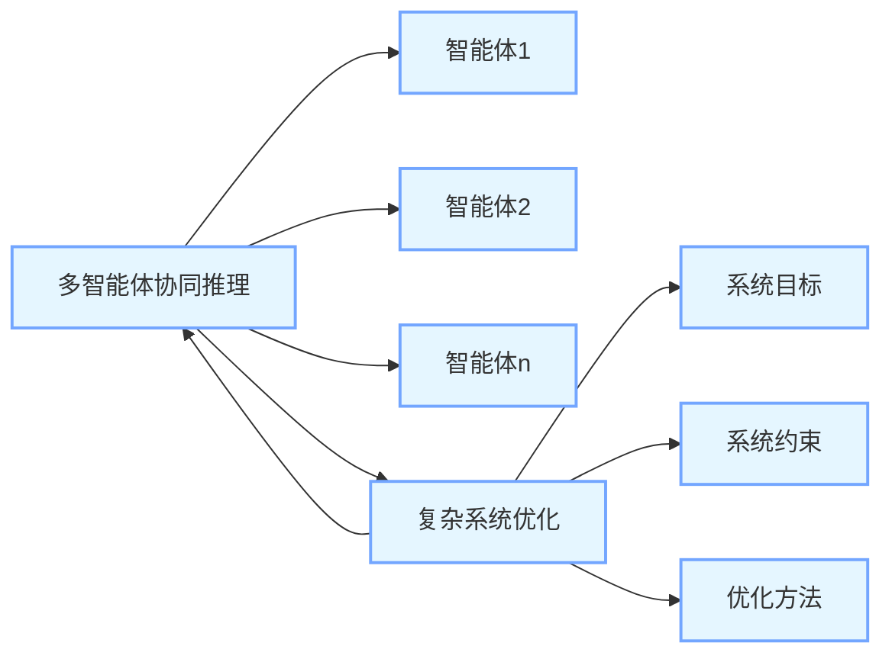

# 多智能体协同推理在复杂系统优化中的应用

> 关键词：多智能体系统、协同推理、复杂系统优化、分布式决策、智能算法

> 摘要：本文深入探讨了多智能体协同推理在复杂系统优化中的应用。首先介绍了相关背景，包括研究目的、预期读者和文档结构等。接着阐述了多智能体协同推理和复杂系统优化的核心概念及其联系，通过文本示意图和 Mermaid 流程图进行直观展示。详细讲解了核心算法原理，并给出 Python 源代码示例。引入数学模型和公式对相关原理进行量化分析，并举例说明。通过项目实战展示了代码的实际应用和详细解释。探讨了多智能体协同推理在不同实际场景中的应用，推荐了学习资源、开发工具框架和相关论文著作。最后总结了未来发展趋势与挑战，并提供了常见问题解答和扩展阅读参考资料。

## 1. 背景介绍 
### 1.1 目的和范围
在当今科技飞速发展的时代，复杂系统无处不在，如交通网络、电力系统、供应链网络等。这些系统具有高度的复杂性、不确定性和动态性，传统的优化方法往往难以应对。多智能体协同推理作为一种新兴的技术手段，为复杂系统优化提供了新的思路和方法。本文的目的在于深入研究多智能体协同推理在复杂系统优化中的应用，详细介绍其核心概念、算法原理、数学模型以及实际应用案例，旨在为相关领域的研究人员和工程师提供全面的理论指导和实践参考。

本文的范围涵盖了多智能体协同推理的基本原理、核心算法、数学模型，以及在不同复杂系统中的具体应用。同时，还将介绍相关的学习资源、开发工具和最新研究成果，以帮助读者更好地理解和应用这一技术。

### 1.2 预期读者
本文预期读者包括计算机科学、控制科学、运筹学、系统工程等相关领域的研究人员、研究生和工程师。对于对人工智能、分布式系统和复杂系统优化感兴趣的初学者，本文也提供了详细的基础知识和逐步深入的讲解，有助于他们快速入门。

### 1.3 文档结构概述
本文将按照以下结构进行组织：
- 核心概念与联系：介绍多智能体协同推理和复杂系统优化的核心概念，以及它们之间的联系，并通过文本示意图和 Mermaid 流程图进行直观展示。
- 核心算法原理 & 具体操作步骤：详细讲解多智能体协同推理的核心算法原理，并给出 Python 源代码示例，说明具体的操作步骤。
- 数学模型和公式 & 详细讲解 & 举例说明：引入数学模型和公式对多智能体协同推理和复杂系统优化进行量化分析，并通过具体例子进行详细说明。
- 项目实战：代码实际案例和详细解释说明：通过一个实际的项目案例，展示多智能体协同推理在复杂系统优化中的具体应用，包括开发环境搭建、源代码实现和代码解读。
- 实际应用场景：探讨多智能体协同推理在不同实际场景中的应用，如交通系统、电力系统、供应链管理等。
- 工具和资源推荐：推荐相关的学习资源、开发工具框架和论文著作，帮助读者进一步深入学习和研究。
- 总结：未来发展趋势与挑战：总结多智能体协同推理在复杂系统优化中的应用现状，分析未来发展趋势和面临的挑战。
- 附录：常见问题与解答：提供常见问题的解答，帮助读者解决在学习和应用过程中遇到的问题。
- 扩展阅读 & 参考资料：列出相关的扩展阅读材料和参考资料，供读者进一步深入研究。

### 1.4 术语表
#### 1.4.1 核心术语定义
- 多智能体系统（Multi-Agent System, MAS）：由多个智能体组成的系统，每个智能体具有自主决策能力，能够感知环境并与其他智能体进行交互。
- 协同推理（Collaborative Reasoning）：多个智能体通过信息共享和交互，共同进行推理和决策的过程。
- 复杂系统（Complex System）：由大量相互作用的组件组成的系统，具有高度的复杂性、不确定性和动态性。
- 优化（Optimization）：在一定的约束条件下，寻找使目标函数达到最优值的解决方案的过程。
- 分布式决策（Distributed Decision-Making）：多个智能体在分布式环境中独立进行决策，并通过信息交互协调各自的决策，以实现全局最优的过程。

#### 1.4.2 相关概念解释
- 智能体（Agent）：具有自主性、反应性、社会性和主动性的实体，能够感知环境并根据自身的目标和知识进行决策和行动。
- 环境（Environment）：智能体所处的外部世界，包括其他智能体和各种物理实体。
- 通信（Communication）：智能体之间交换信息的过程，是多智能体协同推理的基础。
- 知识表示（Knowledge Representation）：将智能体的知识和信息以某种形式进行表示的方法，以便于智能体进行推理和决策。
- 学习（Learning）：智能体通过与环境的交互，不断积累经验和知识，改进自身的决策和行为的过程。

#### 1.4.3 缩略词列表
- MAS：Multi-Agent System（多智能体系统）
- AI：Artificial Intelligence（人工智能）
- RL：Reinforcement Learning（强化学习）
- GA：Genetic Algorithm（遗传算法）
- PSO：Particle Swarm Optimization（粒子群优化算法）

## 2. 核心概念与联系 

### 2.1 多智能体协同推理的核心概念
多智能体协同推理是指多个智能体通过信息共享和交互，共同进行推理和决策的过程。在多智能体系统中，每个智能体具有自己的局部信息和目标，通过与其他智能体的协作，可以充分利用全局信息，提高决策的质量和效率。

多智能体协同推理的关键在于智能体之间的通信和协调。智能体需要通过合适的通信协议和交互机制，将自己的信息传递给其他智能体，并接收其他智能体的信息。同时，智能体还需要根据接收到的信息，调整自己的决策和行为，以实现全局最优的目标。

### 2.2 复杂系统优化的核心概念
复杂系统优化是指在复杂系统中，寻找使目标函数达到最优值的解决方案的过程。复杂系统具有高度的复杂性、不确定性和动态性，传统的优化方法往往难以应对。因此，需要采用新的优化方法和技术，如多智能体协同推理。

复杂系统优化的目标可以是单一的，也可以是多个的。例如，在交通系统中，优化目标可以是最小化交通拥堵、最大化交通流量等；在电力系统中，优化目标可以是最小化发电成本、最大化供电可靠性等。

### 2.3 核心概念的联系
多智能体协同推理和复杂系统优化之间存在着密切的联系。多智能体协同推理可以为复杂系统优化提供有效的解决方案。通过多个智能体的协作，可以充分利用全局信息，提高决策的质量和效率，从而实现复杂系统的优化。

另一方面，复杂系统优化的需求也促进了多智能体协同推理技术的发展。在复杂系统中，智能体需要面对各种复杂的情况和挑战，这就要求多智能体协同推理技术不断改进和创新，以适应不同的应用场景。

### 2.4 文本示意图
```plaintext
多智能体协同推理
├── 智能体1
│   ├── 局部信息
│   ├── 局部目标
│   ├── 推理能力
│   └── 通信能力
├── 智能体2
│   ├── 局部信息
│   ├── 局部目标
│   ├── 推理能力
│   └── 通信能力
└──...
    └── 智能体n
        ├── 局部信息
        ├── 局部目标
        ├── 推理能力
        └── 通信能力

复杂系统优化
├── 系统目标
├── 系统约束
└── 优化方法

联系：多智能体协同推理为复杂系统优化提供解决方案，复杂系统优化需求促进多智能体协同推理技术发展
```

### 2.5 Mermaid 流程图


## 3. 核心算法原理 & 具体操作步骤 

### 3.1 核心算法原理
多智能体协同推理的核心算法有很多种，这里以基于强化学习的多智能体协同推理算法为例进行介绍。强化学习是一种通过智能体与环境的交互，不断尝试和学习，以获得最大累积奖励的机器学习方法。

在基于强化学习的多智能体协同推理算法中，每个智能体都有自己的策略网络和价值网络。策略网络用于根据当前的状态选择动作，价值网络用于评估当前状态的价值。智能体通过与环境的交互，不断更新自己的策略网络和价值网络，以提高自己的决策能力。

同时，智能体之间还需要进行信息共享和交互，以实现协同推理。例如，智能体可以将自己的状态和动作信息传递给其他智能体，其他智能体可以根据这些信息调整自己的决策。

### 3.2 Python 源代码示例
```python
import numpy as np
import torch
import torch.nn as nn
import torch.optim as optim

# 定义智能体类
class Agent(nn.Module):
    def __init__(self, state_dim, action_dim):
        super(Agent, self).__init__()
        self.fc1 = nn.Linear(state_dim, 64)
        self.fc2 = nn.Linear(64, 64)
        self.fc3 = nn.Linear(64, action_dim)

    def forward(self, state):
        x = torch.relu(self.fc1(state))
        x = torch.relu(self.fc2(x))
        action_probs = torch.softmax(self.fc3(x), dim=-1)
        return action_probs

# 定义多智能体系统类
class MultiAgentSystem:
    def __init__(self, num_agents, state_dim, action_dim):
        self.agents = [Agent(state_dim, action_dim) for _ in range(num_agents)]
        self.optimizers = [optim.Adam(agent.parameters(), lr=0.001) for agent in self.agents]

    def get_actions(self, states):
        actions = []
        for i in range(len(self.agents)):
            state = torch.FloatTensor(states[i])
            action_probs = self.agents[i](state)
            action = torch.multinomial(action_probs, 1).item()
            actions.append(action)
        return actions

    def update_agents(self, states, actions, rewards):
        for i in range(len(self.agents)):
            state = torch.FloatTensor(states[i])
            action = actions[i]
            reward = rewards[i]

            action_probs = self.agents[i](state)
            log_prob = torch.log(action_probs[action])
            loss = -log_prob * reward

            self.optimizers[i].zero_grad()
            loss.backward()
            self.optimizers[i].step()

# 示例使用
num_agents = 3
state_dim = 5
action_dim = 2

mas = MultiAgentSystem(num_agents, state_dim, action_dim)

states = [np.random.rand(state_dim) for _ in range(num_agents)]
actions = mas.get_actions(states)
rewards = [np.random.rand() for _ in range(num_agents)]

mas.update_agents(states, actions, rewards)
```

### 3.3 具体操作步骤
1. **初始化多智能体系统**：根据智能体的数量、状态维度和动作维度，初始化多智能体系统，包括每个智能体的策略网络和优化器。
2. **获取动作**：每个智能体根据当前的状态，通过自己的策略网络选择动作。
3. **执行动作并获取奖励**：智能体执行选择的动作，并从环境中获取奖励。
4. **更新智能体**：每个智能体根据自己的状态、动作和奖励，更新自己的策略网络。
5. **重复步骤 2 - 4**：不断重复上述步骤，直到达到终止条件。

## 4. 数学模型和公式 & 详细讲解 & 举例说明 

### 4.1 强化学习的数学模型
在强化学习中，智能体与环境的交互可以用马尔可夫决策过程（Markov Decision Process, MDP）来描述。一个 MDP 可以表示为一个五元组 $(S, A, P, R, \gamma)$，其中：
- $S$ 是状态空间，表示环境的所有可能状态。
- $A$ 是动作空间，表示智能体可以采取的所有可能动作。
- $P: S \times A \times S \to [0, 1]$ 是状态转移概率函数，表示在状态 $s \in S$ 采取动作 $a \in A$ 后，转移到状态 $s' \in S$ 的概率。
- $R: S \times A \to \mathbb{R}$ 是奖励函数，表示在状态 $s \in S$ 采取动作 $a \in A$ 后，获得的即时奖励。
- $\gamma \in [0, 1]$ 是折扣因子，表示未来奖励的重要性。

智能体的目标是最大化累积折扣奖励 $G_t = \sum_{k=0}^{\infty} \gamma^k R_{t+k+1}$，其中 $R_{t+k+1}$ 是在时间步 $t + k + 1$ 获得的奖励。

### 4.2 策略网络和价值网络的数学公式
策略网络 $\pi_{\theta}(a|s)$ 表示在状态 $s$ 下采取动作 $a$ 的概率，其中 $\theta$ 是策略网络的参数。价值网络 $V_{\phi}(s)$ 表示在状态 $s$ 下的价值，其中 $\phi$ 是价值网络的参数。

智能体的目标是通过优化策略网络和价值网络的参数，最大化累积折扣奖励。常用的优化方法是梯度上升法，即通过计算目标函数的梯度，并沿着梯度方向更新参数。

### 4.3 多智能体协同推理的数学模型
在多智能体协同推理中，每个智能体的决策不仅取决于自己的状态和动作，还取决于其他智能体的状态和动作。因此，需要考虑智能体之间的交互和协作。

一种常见的方法是使用联合策略 $\pi_{\theta}(a_1, a_2, \cdots, a_n|s_1, s_2, \cdots, s_n)$ 表示所有智能体在联合状态 $(s_1, s_2, \cdots, s_n)$ 下采取联合动作 $(a_1, a_2, \cdots, a_n)$ 的概率，其中 $n$ 是智能体的数量。

### 4.4 举例说明
假设一个简单的多智能体系统，有两个智能体，每个智能体的状态维度为 2，动作维度为 2。环境的状态转移概率和奖励函数如下：

状态转移概率：
$$
P(s'|s, a) = 
\begin{cases}
0.8, & \text{if } s' \text{ is the next state according to } a \\
0.2, & \text{otherwise}
\end{cases}
$$

奖励函数：
$$
R(s, a) = 
\begin{cases}
1, & \text{if } s \text{ is a goal state and } a \text{ is a correct action} \\
-1, & \text{otherwise}
\end{cases}
$$

智能体的策略网络可以表示为一个简单的神经网络，输入是状态，输出是动作的概率分布。通过不断与环境交互，智能体可以学习到最优的策略，以最大化累积折扣奖励。

## 5. 项目实战：代码实际案例和详细解释说明 

### 5.1  开发环境搭建
- **Python 环境**：建议使用 Python 3.7 及以上版本。可以从 Python 官方网站（https://www.python.org/downloads/）下载并安装。
- **深度学习框架**：使用 PyTorch 作为深度学习框架。可以通过以下命令安装：
```bash
pip install torch torchvision
```
- **其他依赖库**：还需要安装 numpy 等常用的科学计算库。可以通过以下命令安装：
```bash
pip install numpy
```

### 5.2  源代码详细实现和代码解读
```python
import numpy as np
import torch
import torch.nn as nn
import torch.optim as optim

# 定义智能体类
class Agent(nn.Module):
    def __init__(self, state_dim, action_dim):
        super(Agent, self).__init__()
        # 定义全连接层
        self.fc1 = nn.Linear(state_dim, 64)
        self.fc2 = nn.Linear(64, 64)
        self.fc3 = nn.Linear(64, action_dim)

    def forward(self, state):
        # 前向传播
        x = torch.relu(self.fc1(state))
        x = torch.relu(self.fc2(x))
        action_probs = torch.softmax(self.fc3(x), dim=-1)
        return action_probs

# 定义多智能体系统类
class MultiAgentSystem:
    def __init__(self, num_agents, state_dim, action_dim):
        # 初始化多个智能体
        self.agents = [Agent(state_dim, action_dim) for _ in range(num_agents)]
        # 为每个智能体定义优化器
        self.optimizers = [optim.Adam(agent.parameters(), lr=0.001) for agent in self.agents]

    def get_actions(self, states):
        actions = []
        for i in range(len(self.agents)):
            # 将状态转换为张量
            state = torch.FloatTensor(states[i])
            # 通过智能体的策略网络获取动作概率分布
            action_probs = self.agents[i](state)
            # 根据动作概率分布采样动作
            action = torch.multinomial(action_probs, 1).item()
            actions.append(action)
        return actions

    def update_agents(self, states, actions, rewards):
        for i in range(len(self.agents)):
            # 将状态转换为张量
            state = torch.FloatTensor(states[i])
            action = actions[i]
            reward = rewards[i]

            # 通过智能体的策略网络获取动作概率分布
            action_probs = self.agents[i](state)
            # 计算动作的对数概率
            log_prob = torch.log(action_probs[action])
            # 计算损失函数
            loss = -log_prob * reward

            # 清空优化器的梯度
            self.optimizers[i].zero_grad()
            # 反向传播计算梯度
            loss.backward()
            # 更新智能体的参数
            self.optimizers[i].step()

# 示例使用
num_agents = 3
state_dim = 5
action_dim = 2

mas = MultiAgentSystem(num_agents, state_dim, action_dim)

# 生成随机状态
states = [np.random.rand(state_dim) for _ in range(num_agents)]
# 获取动作
actions = mas.get_actions(states)
# 生成随机奖励
rewards = [np.random.rand() for _ in range(num_agents)]

# 更新智能体
mas.update_agents(states, actions, rewards)
```

### 5.3  代码解读与分析
- **智能体类（Agent）**：定义了智能体的策略网络，包括三个全连接层。前向传播函数 `forward` 接受状态作为输入，输出动作的概率分布。
- **多智能体系统类（MultiAgentSystem）**：
  - `__init__` 方法：初始化多个智能体和对应的优化器。
  - `get_actions` 方法：根据当前的状态，每个智能体通过自己的策略网络选择动作。
  - `update_agents` 方法：根据每个智能体的状态、动作和奖励，更新智能体的策略网络。
- **示例使用**：创建一个包含 3 个智能体的多智能体系统，每个智能体的状态维度为 5，动作维度为 2。生成随机状态和奖励，获取动作并更新智能体。

通过不断重复获取动作、执行动作、获取奖励和更新智能体的过程，智能体可以学习到最优的策略，以实现复杂系统的优化。

## 6. 实际应用场景 
### 6.1 交通系统优化
在交通系统中，多智能体协同推理可以用于交通信号控制、车辆路径规划等方面。例如，每个交通路口的信号灯可以看作一个智能体，通过与相邻路口的信号灯进行信息交互，协同调整信号灯的时长，以减少交通拥堵。车辆也可以作为智能体，根据实时的交通信息和其他车辆的行驶情况，选择最优的行驶路径。

### 6.2 电力系统优化
在电力系统中，多智能体协同推理可以用于电力调度、分布式发电控制等方面。例如，每个发电单元可以看作一个智能体，通过与其他发电单元和电网进行信息交互，协同调整发电功率，以满足电力需求，同时最小化发电成本和环境污染。

### 6.3 供应链管理优化
在供应链管理中，多智能体协同推理可以用于库存管理、物流配送等方面。例如，每个供应商、生产商和零售商可以看作一个智能体，通过与其他智能体进行信息交互，协同调整库存水平和物流配送计划，以提高供应链的效率和灵活性。

### 6.4 机器人协作
在机器人协作领域，多智能体协同推理可以用于多个机器人的任务分配、路径规划和协作控制等方面。例如，多个机器人可以通过协同推理，共同完成一个复杂的任务，如搬运重物、搜索救援等。

## 7. 工具和资源推荐
### 7.1 学习资源推荐
#### 7.1.1 书籍推荐
- 《Multi-Agent Systems: Algorithmic, Game-Theoretic, and Logical Foundations》：这本书全面介绍了多智能体系统的理论和算法，包括博弈论、逻辑推理、分布式算法等方面的内容。
- 《Reinforcement Learning: An Introduction》：这是强化学习领域的经典教材，详细介绍了强化学习的基本概念、算法和应用。
- 《Complex Adaptive Systems: An Introduction to Computational Models of Social Life》：这本书介绍了复杂适应系统的基本概念和计算模型，对于理解复杂系统优化有很大的帮助。

#### 7.1.2 在线课程
- Coursera 上的 “Multi-Agent Artificial Intelligence” 课程：该课程由知名教授授课，系统介绍了多智能体系统的理论和应用。
- edX 上的 “Reinforcement Learning” 课程：该课程深入讲解了强化学习的算法和实践，提供了丰富的案例和实验。

#### 7.1.3 技术博客和网站
- Medium 上的 “Towards Data Science”：该博客上有很多关于人工智能、机器学习和多智能体系统的文章，内容丰富，质量较高。
- arXiv.org：这是一个预印本论文网站，提供了大量关于多智能体协同推理和复杂系统优化的最新研究成果。

### 7.2 开发工具框架推荐
#### 7.2.1 IDE和编辑器
- PyCharm：这是一个专业的 Python 集成开发环境，提供了丰富的代码编辑、调试和分析功能。
- Jupyter Notebook：这是一个交互式的开发环境，适合进行代码实验和数据分析。

#### 7.2.2 调试和性能分析工具
- TensorBoard：这是 TensorFlow 提供的一个可视化工具，可以用于可视化训练过程中的损失函数、准确率等指标。
- PyTorch Profiler：这是 PyTorch 提供的一个性能分析工具，可以用于分析代码的性能瓶颈。

#### 7.2.3 相关框架和库
- OpenAI Gym：这是一个开源的强化学习环境库，提供了丰富的环境和任务，方便进行强化学习算法的实验和验证。
- PettingZoo：这是一个用于多智能体强化学习的环境库，提供了多种多智能体环境和任务。

### 7.3 相关论文著作推荐
#### 7.3.1 经典论文
- “Multiagent Systems: A Modern Approach to Distributed Artificial Intelligence”：这篇论文介绍了多智能体系统的基本概念和方法，是多智能体系统领域的经典之作。
- “Q-Learning”：这篇论文提出了 Q 学习算法，是强化学习领域的重要里程碑。

#### 7.3.2 最新研究成果
- 在 AAAI、IJCAI、NeurIPS 等顶级学术会议上发表的关于多智能体协同推理和复杂系统优化的论文。
- 在《Journal of Artificial Intelligence Research》、《Artificial Intelligence》等顶级学术期刊上发表的相关研究成果。

#### 7.3.3 应用案例分析
- 一些实际应用案例的分析报告，如交通系统优化、电力系统优化等方面的案例分析，可以帮助读者更好地理解多智能体协同推理在实际中的应用。

## 8. 总结：未来发展趋势与挑战
### 8.1 未来发展趋势
- **与其他技术的融合**：多智能体协同推理将与区块链、物联网、大数据等技术进行深度融合，以实现更加复杂和智能的系统优化。例如，结合区块链技术可以实现智能体之间的可信通信和协作；结合物联网技术可以实时获取环境信息，提高决策的准确性。
- **应用领域的拓展**：多智能体协同推理将在更多的领域得到应用，如医疗保健、金融、教育等。例如，在医疗保健领域，多智能体系统可以用于医疗资源的分配和疾病的诊断治疗；在金融领域，多智能体系统可以用于风险评估和投资决策。
- **算法的改进和创新**：未来将不断出现更加高效和智能的多智能体协同推理算法，如基于深度学习的算法、基于博弈论的算法等。这些算法将提高多智能体系统的决策能力和协作效率。

### 8.2 挑战
- **通信和协调问题**：在多智能体系统中，智能体之间的通信和协调是一个关键问题。由于智能体数量众多、通信带宽有限等原因，可能会导致通信延迟、信息丢失等问题，影响多智能体系统的性能。
- **智能体的建模和设计**：如何准确地建模和设计智能体的行为和决策机制是一个挑战。智能体需要具有一定的自主性、适应性和协作性，同时还需要考虑到智能体之间的交互和竞争关系。
- **安全性和可靠性问题**：在复杂系统中，多智能体协同推理的安全性和可靠性是至关重要的。例如，在交通系统和电力系统中，智能体的错误决策可能会导致严重的后果。因此，需要研究有效的安全机制和容错策略，以确保多智能体系统的安全可靠运行。

## 9. 附录：常见问题与解答
### 9.1 多智能体协同推理与单智能体推理有什么区别？
单智能体推理只考虑单个智能体的决策和行为，而多智能体协同推理需要考虑多个智能体之间的交互和协作。在多智能体协同推理中，智能体需要共享信息、协调决策，以实现全局最优的目标。

### 9.2 多智能体协同推理的通信协议有哪些？
常见的多智能体协同推理通信协议包括 FIPA-ACL（Foundation for Intelligent Physical Agents - Agent Communication Language）、KQML（Knowledge Query and Manipulation Language）等。这些协议定义了智能体之间通信的语法和语义，方便智能体之间的信息交换和交互。

### 9.3 如何评估多智能体协同推理的性能？
可以从多个方面评估多智能体协同推理的性能，如决策的准确性、收敛速度、通信成本等。常用的评估指标包括平均奖励、成功率、通信次数等。

### 9.4 多智能体协同推理在实际应用中面临哪些困难？
多智能体协同推理在实际应用中面临的困难包括通信和协调问题、智能体的建模和设计问题、安全性和可靠性问题等。此外，实际应用中的环境往往具有高度的复杂性和不确定性，也给多智能体协同推理带来了挑战。

## 10. 扩展阅读 & 参考资料
### 10.1 扩展阅读
- 《Artificial Intelligence: A Modern Approach》：这本书全面介绍了人工智能的基本概念、算法和应用，对于深入理解多智能体协同推理有很大的帮助。
- 《Distributed Artificial Intelligence: A Tutorial》：该教程详细介绍了分布式人工智能的理论和方法，包括多智能体系统的设计和实现。

### 10.2 参考资料
- [FIPA官方网站](https://www.fipa.org/)：提供了关于 FIPA 标准和协议的详细信息。
- [OpenAI官方网站](https://openai.com/)：提供了关于强化学习和多智能体系统的最新研究成果和开源代码。

作者：AI天才研究院/AI Genius Institute & 禅与计算机程序设计艺术 /Zen And The Art of Computer Programming