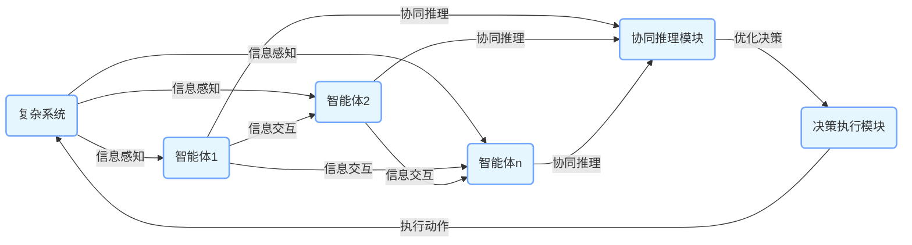

# 多智能体协同推理在复杂系统优化中的应用创新

> 关键词：多智能体协同推理、复杂系统优化、应用创新、分布式智能、智能决策

> 摘要：本文聚焦于多智能体协同推理在复杂系统优化中的应用创新。首先介绍了相关背景知识，包括目的、预期读者、文档结构等内容。接着详细阐述了多智能体协同推理和复杂系统优化的核心概念及它们之间的联系，给出了原理和架构的示意图与流程图。然后深入讲解了核心算法原理，通过 Python 代码进行了详细说明，并给出了相关的数学模型和公式。在项目实战部分，展示了开发环境搭建、源代码实现及代码解读。之后探讨了多智能体协同推理在复杂系统优化中的实际应用场景，推荐了学习资源、开发工具框架以及相关论文著作。最后总结了未来发展趋势与挑战，提供了常见问题解答和扩展阅读参考资料，旨在为相关领域的研究和实践提供全面且深入的指导。

## 1. 背景介绍 
### 1.1 目的和范围
随着科技的不断发展，复杂系统在各个领域的应用日益广泛，如交通系统、能源系统、供应链系统等。这些复杂系统通常具有高度的不确定性、动态性和复杂性，传统的优化方法往往难以应对。多智能体协同推理作为一种新兴的技术手段，为复杂系统的优化提供了新的思路和方法。

本文的目的在于深入探讨多智能体协同推理在复杂系统优化中的应用创新，详细介绍相关的理论知识、算法原理、实际应用案例等内容，为研究人员和工程师提供全面的参考。本文的范围涵盖了多智能体协同推理的基本概念、核心算法、数学模型，以及在不同复杂系统中的应用实例。

### 1.2 预期读者
本文预期读者包括计算机科学、控制科学、系统工程等领域的研究人员和研究生，他们对多智能体系统、人工智能、复杂系统优化等方向有一定的兴趣和基础。同时，也适合从事实际工程应用的工程师，如交通工程师、能源工程师、物流工程师等，他们希望了解多智能体协同推理技术在复杂系统优化中的应用，以解决实际工作中的问题。

### 1.3 文档结构概述
本文的文档结构如下：
- 背景介绍：介绍文章的目的、预期读者和文档结构，以及相关术语的定义。
- 核心概念与联系：阐述多智能体协同推理和复杂系统优化的核心概念，给出原理和架构的示意图与流程图。
- 核心算法原理 & 具体操作步骤：详细讲解多智能体协同推理的核心算法原理，通过 Python 代码进行说明。
- 数学模型和公式 & 详细讲解 & 举例说明：给出多智能体协同推理的数学模型和公式，并进行详细讲解和举例。
- 项目实战：代码实际案例和详细解释说明：展示多智能体协同推理在复杂系统优化中的项目实战，包括开发环境搭建、源代码实现和代码解读。
- 实际应用场景：探讨多智能体协同推理在不同复杂系统中的实际应用场景。
- 工具和资源推荐：推荐学习资源、开发工具框架和相关论文著作。
- 总结：未来发展趋势与挑战：总结多智能体协同推理在复杂系统优化中的未来发展趋势和面临的挑战。
- 附录：常见问题与解答：提供常见问题的解答。
- 扩展阅读 & 参考资料：提供扩展阅读的建议和参考资料。

### 1.4 术语表
#### 1.4.1 核心术语定义
- **多智能体系统（Multi - Agent System, MAS）**：由多个智能体组成的系统，每个智能体具有一定的自主性、社会性和智能性，能够在一定的环境中感知信息、进行决策和执行动作，并与其他智能体进行交互。
- **智能体（Agent）**：具有感知、决策和执行能力的实体，能够根据自身的目标和环境信息自主地做出决策和行动。
- **协同推理（Collaborative Reasoning）**：多个智能体通过信息共享和交互，共同完成推理任务，以达到更好的推理效果。
- **复杂系统（Complex System）**：由大量相互作用的组成部分构成的系统，具有高度的不确定性、动态性和复杂性，其行为和性能难以通过简单的方法进行预测和优化。

#### 1.4.2 相关概念解释
- **分布式智能**：在多智能体系统中，智能体分布在不同的位置，通过网络进行通信和协作，共同完成系统的任务。分布式智能能够提高系统的灵活性、鲁棒性和可扩展性。
- **智能决策**：智能体根据自身的目标和环境信息，运用一定的决策算法进行决策，以实现最优或次优的目标。智能决策是多智能体协同推理的核心任务之一。

#### 1.4.3 缩略词列表
- **MAS**：Multi - Agent System（多智能体系统）
- **AI**：Artificial Intelligence（人工智能）
- **RL**：Reinforcement Learning（强化学习）

## 2. 核心概念与联系 

### 多智能体协同推理的原理
多智能体协同推理的基本原理是多个智能体通过信息共享和交互，共同完成推理任务。每个智能体具有自己的局部知识和推理能力，通过与其他智能体的协作，可以整合全局信息，提高推理的准确性和效率。

例如，在一个交通管理系统中，每个交通路口的智能体可以感知该路口的交通流量、信号灯状态等信息，并根据这些信息进行局部的交通决策。通过与其他路口的智能体进行信息共享和交互，各个智能体可以了解整个交通网络的状况，从而协同做出更优化的交通管理决策。

### 复杂系统优化的概念
复杂系统优化是指在复杂系统中，通过调整系统的参数和结构，使系统的性能达到最优或次优的过程。复杂系统通常具有多个目标和约束条件，优化过程需要考虑系统的动态性、不确定性和复杂性。

例如，在一个能源系统中，优化的目标可能包括降低能源消耗、提高能源利用效率、减少环境污染等。同时，系统还受到能源供应、设备容量等约束条件的限制。因此，需要采用合适的优化方法来解决这些问题。

### 核心概念的架构示意图
下面是多智能体协同推理在复杂系统优化中的架构示意图：



该架构主要包括以下几个部分：
1. **复杂系统**：需要进行优化的对象，如交通系统、能源系统等。
2. **智能体**：分布在复杂系统中的各个位置，负责感知系统的信息，并进行局部的推理和决策。
3. **信息交互**：智能体之间通过网络进行信息共享和交互，以整合全局信息。
4. **协同推理模块**：多个智能体共同进行推理，根据全局信息和局部知识做出优化决策。
5. **决策执行模块**：将协同推理得到的决策转化为具体的动作，并在复杂系统中执行。

### 核心概念之间的联系
多智能体协同推理与复杂系统优化之间存在着密切的联系。多智能体协同推理为复杂系统优化提供了一种有效的方法，通过多个智能体的协作，可以更好地处理复杂系统的不确定性和动态性，提高优化的效果。

另一方面，复杂系统优化为多智能体协同推理提供了应用场景和目标。在复杂系统优化的过程中，需要多智能体协同推理来解决系统中的各种问题，如信息不完整、决策冲突等。

## 3. 核心算法原理 & 具体操作步骤 

### 基于强化学习的多智能体协同推理算法原理
强化学习是一种通过智能体与环境进行交互，不断学习最优策略的机器学习方法。在多智能体协同推理中，每个智能体可以看作是一个强化学习智能体，通过与其他智能体和环境进行交互，学习如何协同完成任务。

下面是一个基于 Q - 学习的多智能体协同推理算法的 Python 实现：

```python
import numpy as np

# 定义智能体类
class Agent:
    def __init__(self, num_states, num_actions, learning_rate=0.1, discount_factor=0.9):
        self.num_states = num_states
        self.num_actions = num_actions
        self.learning_rate = learning_rate
        self.discount_factor = discount_factor
        # 初始化 Q 表
        self.q_table = np.zeros((num_states, num_actions))

    def choose_action(self, state):
        # 选择动作，采用 ε - 贪心策略
        epsilon = 0.1
        if np.random.uniform(0, 1) < epsilon:
            action = np.random.choice(self.num_actions)
        else:
            action = np.argmax(self.q_table[state, :])
        return action

    def update_q_table(self, state, action, reward, next_state):
        # 更新 Q 表
        max_q_next = np.max(self.q_table[next_state, :])
        self.q_table[state, action] += self.learning_rate * (reward + self.discount_factor * max_q_next - self.q_table[state, action])


# 定义多智能体系统类
class MultiAgentSystem:
    def __init__(self, num_agents, num_states, num_actions):
        self.num_agents = num_agents
        self.agents = [Agent(num_states, num_actions) for _ in range(num_agents)]

    def step(self, states):
        actions = []
        for i in range(self.num_agents):
            action = self.agents[i].choose_action(states[i])
            actions.append(action)
        return actions

    def update(self, states, actions, rewards, next_states):
        for i in range(self.num_agents):
            self.agents[i].update_q_table(states[i], actions[i], rewards[i], next_states[i])


# 示例使用
num_agents = 2
num_states = 5
num_actions = 3

mas = MultiAgentSystem(num_agents, num_states, num_actions)

# 初始化状态
states = [np.random.randint(0, num_states) for _ in range(num_agents)]

# 进行 10 个时间步的交互
for _ in range(10):
    actions = mas.step(states)
    # 模拟奖励和下一个状态
    rewards = [np.random.randint(-1, 2) for _ in range(num_agents)]
    next_states = [np.random.randint(0, num_states) for _ in range(num_agents)]
    mas.update(states, actions, rewards, next_states)
    states = next_states


```

### 具体操作步骤
1. **初始化**：初始化多智能体系统，包括每个智能体的 Q 表和相关参数。
2. **状态感知**：每个智能体感知当前的状态。
3. **动作选择**：每个智能体根据当前状态和 Q 表选择动作。
4. **环境交互**：多智能体系统执行选择的动作，与环境进行交互，得到奖励和下一个状态。
5. **Q 表更新**：每个智能体根据奖励和下一个状态更新自己的 Q 表。
6. **重复步骤 2 - 5**：直到达到终止条件。

## 4. 数学模型和公式 & 详细讲解 & 举例说明 

### Q - 学习的数学模型和公式
在 Q - 学习中，智能体的目标是学习一个最优的动作 - 价值函数 $Q(s, a)$，表示在状态 $s$ 下执行动作 $a$ 的预期累积奖励。

Q - 学习的更新公式如下：

$$Q(s_t, a_t) \leftarrow Q(s_t, a_t) + \alpha \left[ r_{t+1} + \gamma \max_{a} Q(s_{t+1}, a) - Q(s_t, a_t) \right]$$

其中：
- $s_t$ 是时间步 $t$ 的状态。
- $a_t$ 是时间步 $t$ 执行的动作。
- $r_{t+1}$ 是执行动作 $a_t$ 后在时间步 $t + 1$ 获得的奖励。
- $s_{t+1}$ 是时间步 $t + 1$ 的状态。
- $\alpha$ 是学习率，控制每次更新的步长。
- $\gamma$ 是折扣因子，用于权衡当前奖励和未来奖励的重要性。

### 详细讲解
Q - 学习的核心思想是通过不断地与环境进行交互，更新 Q 表，使得 $Q(s, a)$ 逐渐逼近最优的动作 - 价值函数。在每次更新中，智能体根据当前的奖励和下一个状态的最大 Q 值来更新当前状态和动作的 Q 值。

学习率 $\alpha$ 决定了每次更新的幅度，如果 $\alpha$ 过大，可能会导致 Q 表的更新不稳定；如果 $\alpha$ 过小，学习的速度会很慢。折扣因子 $\gamma$ 表示智能体对未来奖励的重视程度，$\gamma$ 越接近 1，智能体越注重长期奖励；$\gamma$ 越接近 0，智能体越注重短期奖励。

### 举例说明
假设一个智能体在一个简单的网格世界中进行导航，状态 $s$ 表示智能体在网格中的位置，动作 $a$ 表示智能体的移动方向（上、下、左、右）。当智能体到达目标位置时，获得奖励 1；否则，获得奖励 0。

初始时，Q 表中的所有值都为 0。智能体在状态 $s_1$ 选择动作 $a_1$，移动到状态 $s_2$，获得奖励 $r_2 = 0$。根据 Q - 学习的更新公式，智能体更新 $Q(s_1, a_1)$ 的值：

$$Q(s_1, a_1) \leftarrow Q(s_1, a_1) + \alpha \left[ r_2 + \gamma \max_{a} Q(s_2, a) - Q(s_1, a_1) \right]$$

由于初始时 $Q(s_2, a)$ 都为 0，$Q(s_1, a_1)$ 的更新值为：

$$Q(s_1, a_1) \leftarrow Q(s_1, a_1) + \alpha \left[ 0 + \gamma \times 0 - Q(s_1, a_1) \right]=(1 - \alpha)Q(s_1, a_1)$$

随着智能体不断地与环境进行交互，Q 表中的值会逐渐更新，最终智能体可以学习到最优的导航策略。

## 5. 项目实战：代码实际案例和详细解释说明 

### 5.1  开发环境搭建
本项目使用 Python 进行开发，需要安装以下库：
- `numpy`：用于数值计算。
- `matplotlib`：用于数据可视化（可选）。

可以使用以下命令安装这些库：

```sh
pip install numpy matplotlib
```

### 5.2  源代码详细实现和代码解读
下面是一个多智能体协同推理在交通路口控制中的实际案例的源代码：

```python
import numpy as np
import matplotlib.pyplot as plt

# 定义交通路口环境类
class TrafficJunctionEnv:
    def __init__(self, num_lanes=2, num_agents=2):
        self.num_lanes = num_lanes
        self.num_agents = num_agents
        self.num_states = num_lanes * 2  # 每个车道有两种状态：有车或无车
        self.num_actions = 2  # 动作：放行或停止
        self.reset()

    def reset(self):
        # 初始化状态
        self.states = np.random.randint(0, 2, self.num_agents * self.num_lanes)
        return self.states

    def step(self, actions):
        # 执行动作，更新状态和奖励
        rewards = []
        next_states = []
        for i in range(self.num_agents):
            lane_states = self.states[i * self.num_lanes:(i + 1) * self.num_lanes]
            action = actions[i]
            if action == 1 and np.sum(lane_states) > 0:
                # 放行且有车，奖励为 1
                reward = 1
            else:
                # 其他情况，奖励为 0
                reward = 0
            # 模拟状态转移
            next_lane_states = np.random.randint(0, 2, self.num_lanes)
            rewards.append(reward)
            next_states.extend(next_lane_states)
        self.states = np.array(next_states)
        return next_states, rewards


# 定义智能体类
class Agent:
    def __init__(self, num_states, num_actions, learning_rate=0.1, discount_factor=0.9):
        self.num_states = num_states
        self.num_actions = num_actions
        self.learning_rate = learning_rate
        self.discount_factor = discount_factor
        self.q_table = np.zeros((num_states, num_actions))

    def choose_action(self, state):
        epsilon = 0.1
        if np.random.uniform(0, 1) < epsilon:
            action = np.random.choice(self.num_actions)
        else:
            action = np.argmax(self.q_table[state, :])
        return action

    def update_q_table(self, state, action, reward, next_state):
        max_q_next = np.max(self.q_table[next_state, :])
        self.q_table[state, action] += self.learning_rate * (reward + self.discount_factor * max_q_next - self.q_table[state, action])


# 定义多智能体系统类
class MultiAgentSystem:
    def __init__(self, num_agents, num_states, num_actions):
        self.num_agents = num_agents
        self.agents = [Agent(num_states, num_actions) for _ in range(num_agents)]

    def step(self, states):
        actions = []
        for i in range(self.num_agents):
            state_index = int(''.join(map(str, states[i * 2:(i + 1) * 2])), 2)
            action = self.agents[i].choose_action(state_index)
            actions.append(action)
        return actions

    def update(self, states, actions, rewards, next_states):
        for i in range(self.num_agents):
            state_index = int(''.join(map(str, states[i * 2:(i + 1) * 2])), 2)
            next_state_index = int(''.join(map(str, next_states[i * 2:(i + 1) * 2])), 2)
            self.agents[i].update_q_table(state_index, actions[i], rewards[i], next_state_index)


# 主函数
def main():
    num_agents = 2
    num_lanes = 2
    env = TrafficJunctionEnv(num_lanes, num_agents)
    mas = MultiAgentSystem(num_agents, 2 ** num_lanes, 2)

    num_episodes = 1000
    total_rewards = []

    for episode in range(num_episodes):
        states = env.reset()
        episode_reward = 0
        for _ in range(10):
            actions = mas.step(states)
            next_states, rewards = env.step(actions)
            mas.update(states, actions, rewards, next_states)
            states = next_states
            episode_reward += np.sum(rewards)
        total_rewards.append(episode_reward)

    # 绘制奖励曲线
    plt.plot(total_rewards)
    plt.xlabel('Episode')
    plt.ylabel('Total Reward')
    plt.title('Multi - Agent Traffic Junction Control')
    plt.show()


if __name__ == "__main__":
    main()


```

### 5.3  代码解读与分析
#### 代码结构
- **TrafficJunctionEnv 类**：定义了交通路口的环境，包括状态初始化、状态转移和奖励计算。
- **Agent 类**：定义了单个智能体，包括 Q 表的初始化、动作选择和 Q 表更新。
- **MultiAgentSystem 类**：定义了多智能体系统，负责协调各个智能体的动作选择和 Q 表更新。
- **main 函数**：主函数，负责初始化环境和多智能体系统，进行训练，并绘制奖励曲线。

#### 详细解读
1. **环境初始化**：在 `TrafficJunctionEnv` 类的 `__init__` 方法中，初始化了环境的参数，包括车道数、智能体数、状态数和动作数。在 `reset` 方法中，随机初始化了环境的状态。
2. **动作选择**：在 `Agent` 类的 `choose_action` 方法中，采用 ε - 贪心策略选择动作。以一定的概率随机选择动作，否则选择 Q 表中值最大的动作。
3. **Q 表更新**：在 `Agent` 类的 `update_q_table` 方法中，根据 Q - 学习的更新公式更新 Q 表。
4. **多智能体协调**：在 `MultiAgentSystem` 类的 `step` 方法中，每个智能体根据自己的状态选择动作。在 `update` 方法中，每个智能体根据奖励和下一个状态更新自己的 Q 表。
5. **训练过程**：在 `main` 函数中，进行了 1000 个回合的训练。每个回合中，智能体与环境进行 10 个时间步的交互，记录每个回合的总奖励。
6. **结果可视化**：使用 `matplotlib` 库绘制了每个回合的总奖励曲线，直观地展示了智能体的学习过程。

#### 分析
通过这个项目实战，我们可以看到多智能体协同推理在交通路口控制中的应用。智能体通过不断地与环境进行交互，学习如何根据车道的状态选择最优的动作，以提高交通流量。随着训练的进行，智能体的总奖励逐渐增加，说明智能体的性能在不断提升。

## 6. 实际应用场景 
### 交通系统优化
在交通系统中，多智能体协同推理可以用于交通路口控制、交通流量预测、路径规划等方面。例如，每个交通路口的智能体可以根据该路口的交通流量、信号灯状态等信息进行局部的交通决策，并与其他路口的智能体进行信息共享和交互，协同优化整个交通网络的流量。

### 能源系统优化
在能源系统中，多智能体协同推理可以用于能源分配、发电调度、负荷预测等方面。例如，每个发电单元和用电单元可以看作是一个智能体，通过协同推理，实现能源的高效分配和利用，降低能源消耗和成本。

### 供应链系统优化
在供应链系统中，多智能体协同推理可以用于库存管理、物流调度、供应商选择等方面。例如，每个供应商、仓库和零售商可以看作是一个智能体，通过协同推理，优化供应链的流程，提高供应链的效率和响应速度。

### 智能电网优化
在智能电网中，多智能体协同推理可以用于电力市场交易、分布式电源控制、需求响应等方面。例如，每个发电企业、电力用户和电网运营商可以看作是一个智能体，通过协同推理，实现电力资源的优化配置和电网的稳定运行。

## 7. 工具和资源推荐
### 7.1 学习资源推荐
#### 7.1.1 书籍推荐
- 《多智能体系统：原理与编程》：全面介绍了多智能体系统的基本概念、理论和方法，包括智能体的设计、通信、协作等方面。
- 《强化学习：原理与Python实现》：详细讲解了强化学习的基本原理和算法，并通过 Python 代码进行了实现和演示。
- 《复杂系统科学导论》：介绍了复杂系统的基本概念、特征和研究方法，为理解复杂系统优化提供了理论基础。

#### 7.1.2 在线课程
- Coursera 上的“Multi - Agent Systems”：由知名高校的教授授课，系统地介绍了多智能体系统的相关知识。
- edX 上的“Reinforcement Learning”：深入讲解了强化学习的理论和实践，提供了丰富的案例和实验。

#### 7.1.3 技术博客和网站
- Medium 上的 AI 相关博客：有很多关于多智能体系统、强化学习等方面的技术文章和案例分享。
- arXiv 网站：可以获取最新的学术研究论文，了解多智能体协同推理的前沿技术。

### 7.2 开发工具框架推荐
#### 7.2.1 IDE和编辑器
- PyCharm：一款功能强大的 Python 集成开发环境，提供了代码编辑、调试、版本控制等功能。
- Jupyter Notebook：一种交互式的编程环境，适合进行代码演示和数据分析。

#### 7.2.2 调试和性能分析工具
- PySnooper：一个简单易用的 Python 调试工具，可以自动记录函数的调用过程和变量的值。
- cProfile：Python 内置的性能分析工具，可以分析代码的运行时间和内存使用情况。

#### 7.2.3 相关框架和库
- OpenAI Gym：一个用于开发和比较强化学习算法的工具包，提供了丰富的环境和接口。
- Stable - Baselines3：一个基于 PyTorch 的强化学习库，提供了多种预训练的强化学习算法和模型。

### 7.3 相关论文著作推荐
#### 7.3.1 经典论文
- “Multi - Agent Reinforcement Learning: A Selective Overview of Theories and Algorithms”：对多智能体强化学习的理论和算法进行了全面的综述。
- “Distributed Constraint Optimization Problems: Algorithms and Applications”：介绍了分布式约束优化问题的算法和应用，与多智能体协同推理密切相关。

#### 7.3.2 最新研究成果
- 可以关注 AAAI、IJCAI、NeurIPS 等顶级学术会议上的相关论文，了解多智能体协同推理的最新研究进展。

#### 7.3.3 应用案例分析
- 一些实际应用案例的研究论文，如多智能体协同推理在交通、能源、供应链等领域的应用案例，有助于深入理解该技术的实际应用。

## 8. 总结：未来发展趋势与挑战
### 未来发展趋势
- **与其他技术的融合**：多智能体协同推理将与深度学习、区块链、物联网等技术进行更深入的融合，以提高系统的智能性、安全性和可扩展性。
- **应用领域的拓展**：除了交通、能源、供应链等领域，多智能体协同推理将在医疗、教育、金融等更多领域得到应用，为解决复杂问题提供新的方法和思路。
- **理论和算法的创新**：未来将不断提出新的理论和算法，以提高多智能体协同推理的效率和性能，解决现有算法的局限性。

### 挑战
- **通信和协调问题**：在多智能体系统中，智能体之间的通信和协调是一个关键问题。如何保证信息的准确传输和高效共享，以及如何解决智能体之间的决策冲突，是需要进一步研究的问题。
- **计算资源需求**：多智能体协同推理通常需要大量的计算资源，特别是在处理大规模复杂系统时。如何降低计算成本，提高算法的效率，是一个挑战。
- **安全性和可靠性**：在实际应用中，多智能体系统的安全性和可靠性至关重要。如何防止系统受到攻击和故障的影响，保证系统的稳定运行，是需要解决的问题。

## 9. 附录：常见问题与解答
### 问题 1：多智能体协同推理与单智能体推理有什么区别？
答：单智能体推理是指单个智能体根据自身的知识和信息进行推理和决策。而多智能体协同推理是指多个智能体通过信息共享和交互，共同完成推理任务。多智能体协同推理可以整合全局信息，提高推理的准确性和效率，适用于处理复杂系统中的问题。

### 问题 2：多智能体协同推理的通信方式有哪些？
答：常见的通信方式包括直接通信、广播通信、基于消息队列的通信等。直接通信是指智能体之间直接进行信息交换；广播通信是指一个智能体向所有其他智能体发送信息；基于消息队列的通信是指智能体将信息发送到消息队列中，其他智能体从消息队列中获取信息。

### 问题 3：如何评估多智能体协同推理的性能？
答：可以从多个方面评估多智能体协同推理的性能，如推理的准确性、效率、稳定性等。常用的评估指标包括奖励值、收敛速度、通信开销等。

## 10. 扩展阅读 & 参考资料
### 扩展阅读
- 《人工智能：一种现代的方法》：全面介绍了人工智能的基本概念、方法和应用，对多智能体系统和强化学习有深入的讲解。
- 《复杂网络：结构与动力学》：介绍了复杂网络的基本概念和分析方法，有助于理解复杂系统中的交互关系。

### 参考资料
- [OpenAI Gym 官方文档](https://gym.openai.com/)
- [Stable - Baselines3 官方文档](https://stable - baselines3.readthedocs.io/en/master/)

作者：AI天才研究院/AI Genius Institute & 禅与计算机程序设计艺术 /Zen And The Art of Computer Programming