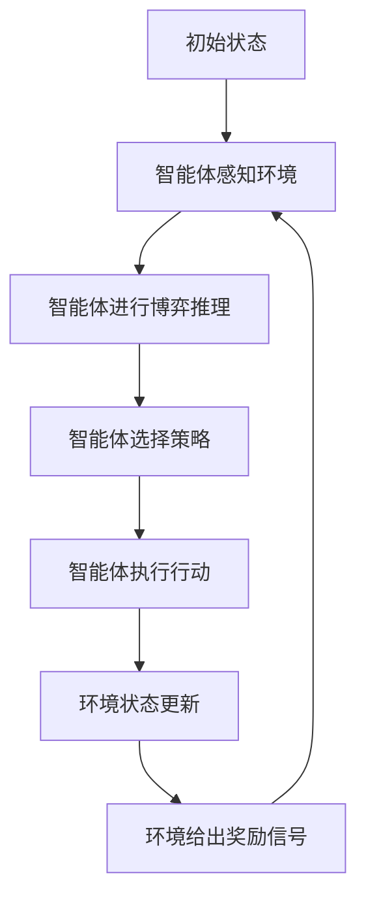

# 多智能体博弈推理在策略制定中的应用

> 关键词：多智能体、博弈推理、策略制定、纳什均衡、强化学习

> 摘要：本文围绕多智能体博弈推理在策略制定中的应用展开深入探讨。首先介绍了多智能体博弈推理的背景知识，包括其目的、适用读者、文档结构及相关术语。接着阐述了核心概念与联系，给出了原理和架构的示意图及流程图。详细讲解了核心算法原理并通过 Python 代码进行说明，同时给出了数学模型和公式，并举例分析。通过项目实战展示了多智能体博弈推理在实际中的代码实现与解读。分析了其实际应用场景，推荐了学习所需的工具和资源。最后总结了未来发展趋势与挑战，解答了常见问题，并提供了扩展阅读和参考资料，旨在为相关领域的研究者和开发者提供全面而深入的指导。

## 1. 背景介绍 
### 1.1 目的和范围
多智能体系统在当今众多领域如机器人协作、网络通信、经济市场等都有着广泛的应用。在这些系统中，每个智能体都有自己的目标和决策能力，它们之间的交互形成了复杂的博弈关系。本文章的目的在于深入探讨多智能体博弈推理如何应用于策略制定，涵盖了从基础概念到算法原理，再到实际项目应用的各个方面。通过全面的阐述，帮助读者理解多智能体博弈推理的核心思想和实现方法，以及如何将其应用到实际的策略制定中。

### 1.2 预期读者
本文预期读者包括计算机科学、人工智能、经济学、控制科学等领域的研究者和学生，他们希望深入了解多智能体系统和博弈论的相关知识，并将其应用到实际的策略制定问题中。同时，也适合从事相关软件开发和系统设计的工程师，为他们在实际项目中应用多智能体博弈推理提供理论和实践指导。

### 1.3 文档结构概述
本文首先介绍多智能体博弈推理的背景知识，包括目的、读者群体、文档结构和术语表。接着阐述核心概念与联系，给出相关的原理和架构示意图及流程图。然后详细讲解核心算法原理，并通过 Python 代码进行说明。之后介绍数学模型和公式，并举例分析。通过项目实战展示多智能体博弈推理在实际中的代码实现与解读。分析其实际应用场景，推荐学习所需的工具和资源。最后总结未来发展趋势与挑战，解答常见问题，并提供扩展阅读和参考资料。

### 1.4 术语表
#### 1.4.1 核心术语定义
- **多智能体系统（Multi - Agent System，MAS）**：由多个具有自主决策能力的智能体组成的系统，这些智能体可以相互交互，共同完成特定的任务。
- **博弈推理（Game Reasoning）**：智能体根据其他智能体的可能行为和自身的目标，运用博弈论的方法进行推理和决策的过程。
- **策略制定（Strategy Formulation）**：智能体在多智能体环境中，为了实现自身目标而制定的一系列行动方案。
- **纳什均衡（Nash Equilibrium）**：在博弈中，每个智能体的策略都是对其他智能体策略的最优反应，此时没有智能体有动机单方面改变自己的策略。
- **强化学习（Reinforcement Learning）**：智能体通过与环境进行交互，根据环境反馈的奖励信号来学习最优策略的一种机器学习方法。

#### 1.4.2 相关概念解释
- **智能体（Agent）**：具有感知、决策和行动能力的实体，可以是物理实体（如机器人）或软件实体（如智能算法）。
- **博弈论（Game Theory）**：研究多个决策主体之间相互作用的数学理论，分析在不同情况下各主体的最优策略选择。
- **合作博弈（Cooperative Game）**：智能体之间可以通过合作来实现共同的目标，并且可以达成具有约束力的协议。
- **非合作博弈（Non - Cooperative Game）**：智能体之间没有具有约束力的协议，每个智能体都以自身利益最大化为目标进行决策。

#### 1.4.3 缩略词列表
- MAS：Multi - Agent System（多智能体系统）
- RL：Reinforcement Learning（强化学习）

## 2. 核心概念与联系 
### 核心概念原理
多智能体博弈推理的核心在于多个智能体在相互作用的环境中，根据自身的目标和对其他智能体行为的预测，运用博弈论的方法进行策略选择。每个智能体都有自己的策略空间，通过不断地与其他智能体交互，学习和调整自己的策略，以达到自身利益的最大化。

在多智能体系统中，智能体的决策不仅受到自身目标的影响，还受到其他智能体行为的制约。例如，在一个竞争的市场环境中，企业作为智能体，需要考虑竞争对手的价格策略、产品策略等因素，来制定自己的最优价格和产品策略。

### 架构的文本示意图
```plaintext
多智能体系统
|-- 智能体 1
|   |-- 感知模块
|   |-- 决策模块
|   |-- 行动模块
|-- 智能体 2
|   |-- 感知模块
|   |-- 决策模块
|   |-- 行动模块
|--...
|-- 智能体 n
|   |-- 感知模块
|   |-- 决策模块
|   |-- 行动模块
|-- 环境
|   |-- 状态信息
|   |-- 奖励信号
```

### Mermaid 流程图


## 3. 核心算法原理 & 具体操作步骤 
### 算法原理
在多智能体博弈推理中，常用的算法包括基于纳什均衡求解的算法和强化学习算法。这里我们以 Q - learning 算法为例进行详细讲解。

Q - learning 是一种无模型的强化学习算法，智能体通过不断地与环境交互，学习状态 - 动作对的价值函数 $Q(s, a)$，其中 $s$ 表示环境状态，$a$ 表示智能体的动作。智能体的目标是最大化长期累积奖励。

Q - learning 的更新公式为：
$$Q(s_t, a_t) \leftarrow Q(s_t, a_t) + \alpha [r_{t+1} + \gamma \max_{a} Q(s_{t+1}, a) - Q(s_t, a_t)]$$
其中，$\alpha$ 是学习率，控制每次更新的步长；$\gamma$ 是折扣因子，用于权衡当前奖励和未来奖励的重要性；$r_{t+1}$ 是智能体在执行动作 $a_t$ 后从环境中获得的即时奖励。

### 具体操作步骤
1. **初始化**：初始化 Q 表 $Q(s, a)$ 为零，设置学习率 $\alpha$ 和折扣因子 $\gamma$。
2. **智能体选择动作**：在状态 $s_t$ 下，根据当前的 Q 表，使用某种策略（如 $\epsilon$ - 贪心策略）选择动作 $a_t$。
3. **执行动作并观察奖励和新状态**：智能体执行动作 $a_t$，环境给出即时奖励 $r_{t+1}$，并转移到新状态 $s_{t+1}$。
4. **更新 Q 表**：根据 Q - learning 更新公式更新 $Q(s_t, a_t)$。
5. **重复步骤 2 - 4**：直到达到终止条件（如达到最大步数或收敛）。

### Python 源代码实现
```python
import numpy as np

class QLearningAgent:
    def __init__(self, state_size, action_size, learning_rate=0.1, discount_factor=0.9, epsilon=0.1):
        self.state_size = state_size
        self.action_size = action_size
        self.learning_rate = learning_rate
        self.discount_factor = discount_factor
        self.epsilon = epsilon
        self.q_table = np.zeros((state_size, action_size))

    def choose_action(self, state):
        if np.random.uniform(0, 1) < self.epsilon:
            # 探索：随机选择动作
            action = np.random.choice(self.action_size)
        else:
            # 利用：选择 Q 值最大的动作
            action = np.argmax(self.q_table[state, :])
        return action

    def update_q_table(self, state, action, reward, next_state):
        # Q - learning 更新公式
        max_q_next = np.max(self.q_table[next_state, :])
        self.q_table[state, action] += self.learning_rate * (reward + self.discount_factor * max_q_next - self.q_table[state, action])


# 示例使用
state_size = 10
action_size = 4
agent = QLearningAgent(state_size, action_size)

# 模拟环境交互
state = 0
for _ in range(100):
    action = agent.choose_action(state)
    # 模拟奖励和下一个状态
    reward = np.random.randint(0, 10)
    next_state = np.random.randint(0, state_size)
    agent.update_q_table(state, action, reward, next_state)
    state = next_state
```

## 4. 数学模型和公式 & 详细讲解 & 举例说明 
### 数学模型
在多智能体博弈中，通常使用标准型博弈模型来描述。一个标准型博弈可以表示为 $G = (N, \{A_i\}_{i\in N}, \{u_i\}_{i\in N})$，其中：
- $N = \{1, 2, \cdots, n\}$ 是智能体的集合；
- $A_i$ 是智能体 $i$ 的策略空间，即智能体 $i$ 可以选择的所有策略的集合；
- $u_i : A_1\times A_2\times\cdots\times A_n \to \mathbb{R}$ 是智能体 $i$ 的效用函数，它表示当所有智能体选择各自的策略时，智能体 $i$ 获得的效用。

### 纳什均衡的数学定义
对于标准型博弈 $G = (N, \{A_i\}_{i\in N}, \{u_i\}_{i\in N})$，如果策略组合 $(a_1^*, a_2^*, \cdots, a_n^*)$ 满足对于任意的 $i\in N$ 和任意的 $a_i\in A_i$，都有：
$$u_i(a_1^*, a_2^*, \cdots, a_i^*, \cdots, a_n^*) \geq u_i(a_1^*, a_2^*, \cdots, a_i, \cdots, a_n^*)$$
则称 $(a_1^*, a_2^*, \cdots, a_n^*)$ 是该博弈的一个纳什均衡。

### 举例说明
考虑一个简单的二人博弈，两个智能体分别为玩家 1 和玩家 2，每个玩家有两个策略：合作（C）和背叛（D）。效用矩阵如下：
|  | 玩家 2: C | 玩家 2: D |
| --- | --- | --- |
| 玩家 1: C | (3, 3) | (0, 5) |
| 玩家 1: D | (5, 0) | (1, 1) |

这里，$N = \{1, 2\}$，$A_1 = A_2 = \{C, D\}$，$u_1$ 和 $u_2$ 可以根据效用矩阵来定义。例如，当玩家 1 选择 C，玩家 2 选择 D 时，$u_1(C, D) = 0$，$u_2(C, D) = 5$。

通过分析可以发现，该博弈有两个纳什均衡：$(D, D)$ 和 $(C, C)$。在 $(D, D)$ 策略组合下，玩家 1 和玩家 2 都没有动机单方面改变自己的策略，因为如果玩家 1 从 D 改为 C，其效用将从 1 变为 0；同理，玩家 2 从 D 改为 C，其效用也将从 1 变为 0。在 $(C, C)$ 策略组合下，同样每个玩家都没有动机单方面改变策略。

## 5. 项目实战：代码实际案例和详细解释说明 
### 5.1  开发环境搭建
本项目使用 Python 语言进行开发，主要依赖的库有：
- **NumPy**：用于数值计算和数组操作。
- **Matplotlib**：用于可视化结果。

可以使用以下命令安装这些库：
```bash
pip install numpy matplotlib
```

### 5.2  源代码详细实现和代码解读
我们以一个简单的多智能体博弈场景为例，假设有两个智能体在一个网格环境中进行竞争，目标是尽可能多地收集资源。

```python
import numpy as np
import matplotlib.pyplot as plt

# 环境参数
GRID_SIZE = 10
NUM_RESOURCES = 5
MAX_STEPS = 100

# 智能体类
class Agent:
    def __init__(self, state_size, action_size, learning_rate=0.1, discount_factor=0.9, epsilon=0.1):
        self.state_size = state_size
        self.action_size = action_size
        self.learning_rate = learning_rate
        self.discount_factor = discount_factor
        self.epsilon = epsilon
        self.q_table = np.zeros((state_size, action_size))

    def choose_action(self, state):
        if np.random.uniform(0, 1) < self.epsilon:
            action = np.random.choice(self.action_size)
        else:
            action = np.argmax(self.q_table[state, :])
        return action

    def update_q_table(self, state, action, reward, next_state):
        max_q_next = np.max(self.q_table[next_state, :])
        self.q_table[state, action] += self.learning_rate * (reward + self.discount_factor * max_q_next - self.q_table[state, action])


# 环境类
class Environment:
    def __init__(self):
        self.grid = np.zeros((GRID_SIZE, GRID_SIZE))
        self.resource_positions = []
        for _ in range(NUM_RESOURCES):
            x = np.random.randint(0, GRID_SIZE)
            y = np.random.randint(0, GRID_SIZE)
            self.grid[x, y] = 1
            self.resource_positions.append((x, y))
        self.agent1_pos = (np.random.randint(0, GRID_SIZE), np.random.randint(0, GRID_SIZE))
        self.agent2_pos = (np.random.randint(0, GRID_SIZE), np.random.randint(0, GRID_SIZE))

    def get_state(self):
        state = self.agent1_pos[0] * GRID_SIZE + self.agent1_pos[1]
        return state

    def step(self, action1, action2):
        # 定义动作：0 - 上，1 - 下，2 - 左，3 - 右
        actions = [(-1, 0), (1, 0), (0, -1), (0, 1)]
        new_pos1 = (self.agent1_pos[0] + actions[action1][0], self.agent1_pos[1] + actions[action1][1])
        new_pos2 = (self.agent2_pos[0] + actions[action2][0], self.agent2_pos[1] + actions[action2][1])

        # 边界处理
        new_pos1 = (max(0, min(GRID_SIZE - 1, new_pos1[0])), max(0, min(GRID_SIZE - 1, new_pos1[1])))
        new_pos2 = (max(0, min(GRID_SIZE - 1, new_pos2[0])), max(0, min(GRID_SIZE - 1, new_pos2[1])))

        reward1 = 0
        reward2 = 0
        if new_pos1 in self.resource_positions:
            reward1 = 1
            self.grid[new_pos1[0], new_pos1[1]] = 0
            self.resource_positions.remove(new_pos1)
        if new_pos2 in self.resource_positions:
            reward2 = 1
            self.grid[new_pos2[0], new_pos2[1]] = 0
            self.resource_positions.remove(new_pos2)

        self.agent1_pos = new_pos1
        self.agent2_pos = new_pos2
        next_state = self.get_state()
        return next_state, reward1, reward2


# 主循环
agent1 = Agent(GRID_SIZE * GRID_SIZE, 4)
agent2 = Agent(GRID_SIZE * GRID_SIZE, 4)
env = Environment()

total_rewards1 = []
total_rewards2 = []

for episode in range(100):
    state = env.get_state()
    total_reward1 = 0
    total_reward2 = 0
    for step in range(MAX_STEPS):
        action1 = agent1.choose_action(state)
        action2 = agent2.choose_action(state)
        next_state, reward1, reward2 = env.step(action1, action2)
        agent1.update_q_table(state, action1, reward1, next_state)
        agent2.update_q_table(state, action2, reward2, next_state)
        total_reward1 += reward1
        total_reward2 += reward2
        state = next_state
    total_rewards1.append(total_reward1)
    total_rewards2.append(total_reward2)


# 可视化结果
plt.plot(total_rewards1, label='Agent 1')
plt.plot(total_rewards2, label='Agent 2')
plt.xlabel('Episode')
plt.ylabel('Total Reward')
plt.legend()
plt.show()
```

### 5.3  代码解读与分析
- **Agent 类**：实现了 Q - learning 智能体，包括选择动作和更新 Q 表的方法。
- **Environment 类**：模拟了网格环境，包括资源的初始化、智能体的移动和奖励的计算。
- **主循环**：在每个回合中，智能体根据当前状态选择动作，与环境交互，获得奖励并更新 Q 表。最后绘制每个智能体的总奖励随回合数的变化曲线。

通过观察奖励曲线，可以分析智能体的学习效果和策略制定能力。如果奖励曲线逐渐上升，说明智能体在不断学习和优化自己的策略。

## 6. 实际应用场景 
### 机器人协作
在机器人协作场景中，多个机器人需要共同完成一项任务，如搬运货物、搜索目标等。每个机器人作为一个智能体，需要根据其他机器人的位置和动作，运用博弈推理来制定自己的行动策略，以实现高效的协作。例如，在搬运大型货物时，机器人需要协调各自的用力方向和大小，避免出现冲突和无效的劳动。

### 网络通信
在网络通信中，多个节点（如路由器、基站等）可以看作是智能体。它们需要在有限的带宽资源下，根据其他节点的流量情况和自身的任务需求，制定最优的通信策略。例如，在无线网络中，基站需要根据各个用户设备的信号强度和数据需求，合理分配信道资源，以提高网络的整体性能。

### 经济市场
在经济市场中，企业之间存在着竞争和合作关系。每个企业作为一个智能体，需要根据竞争对手的价格策略、产品策略等因素，运用博弈推理来制定自己的价格、产量和市场推广策略。例如，在智能手机市场中，各大厂商需要根据其他厂商的新产品发布情况和价格调整，及时调整自己的产品定价和营销策略，以争夺市场份额。

### 交通管理
在交通管理中，车辆、交通信号灯等都可以看作是智能体。车辆需要根据其他车辆的行驶状态和交通信号灯的变化，制定自己的行驶策略，如加速、减速、转弯等。交通信号灯则需要根据不同方向的车流量，合理调整信号灯的时长，以提高交通效率。例如，在智能交通系统中，通过车与车、车与基础设施之间的通信和博弈推理，可以实现更加智能和高效的交通管理。

## 7. 工具和资源推荐
### 7.1 学习资源推荐
#### 7.1.1 书籍推荐
- 《多智能体系统：原理与编程》：全面介绍了多智能体系统的基本概念、理论和编程方法，是学习多智能体系统的经典教材。
- 《博弈论》：详细讲解了博弈论的基本原理和应用，包括纳什均衡、合作博弈等内容，对于理解多智能体博弈推理有很大的帮助。
- 《强化学习：原理与Python实现》：深入介绍了强化学习的算法原理和实际应用，通过大量的 Python 代码示例，帮助读者掌握强化学习的编程技巧。

#### 7.1.2 在线课程
- Coursera 上的“Multi - Agent Artificial Intelligence”：由知名教授授课，系统地介绍了多智能体系统的相关知识，包括博弈论、协商机制等内容。
- edX 上的“Reinforcement Learning”：全面讲解了强化学习的理论和算法，通过实践项目让学生深入理解强化学习的应用。

#### 7.1.3 技术博客和网站
- Towards Data Science：提供了大量关于人工智能、机器学习和多智能体系统的技术文章和案例分析。
- OpenAI Blog：发布了许多关于强化学习和多智能体研究的最新成果和技术进展。

### 7.2 开发工具框架推荐
#### 7.2.1 IDE和编辑器
- PyCharm：是一款专业的 Python 集成开发环境，提供了丰富的代码编辑、调试和分析功能，适合开发多智能体系统的 Python 代码。
- Jupyter Notebook：是一个交互式的开发环境，支持 Python 代码的编写、运行和可视化，非常适合进行算法实验和数据分析。

#### 7.2.2 调试和性能分析工具
- Py-Spy：可以对 Python 代码进行性能分析，找出代码中的瓶颈和性能问题。
- pdb：是 Python 自带的调试器，可以帮助开发者调试代码，定位和解决问题。

#### 7.2.3 相关框架和库
- OpenAI Gym：是一个用于开发和比较强化学习算法的工具包，提供了丰富的环境和基准测试，方便开发者进行多智能体强化学习的实验。
- Mesa：是一个用于构建基于智能体的模型的 Python 库，支持多种类型的智能体和环境，适合开发多智能体系统的仿真模型。

### 7.3 相关论文著作推荐
#### 7.3.1 经典论文
- “Reinforcement Learning: An Introduction”：由 Richard S. Sutton 和 Andrew G. Barto 撰写，是强化学习领域的经典著作，系统地介绍了强化学习的基本理论和算法。
- “Non - Cooperative Games”：由 John Forbes Nash Jr. 撰写，提出了纳什均衡的概念，对博弈论的发展产生了深远的影响。

#### 7.3.2 最新研究成果
- 关注 AAAI（Association for the Advancement of Artificial Intelligence）、IJCAI（International Joint Conference on Artificial Intelligence）等顶级人工智能会议的论文，了解多智能体博弈推理领域的最新研究动态和技术进展。

#### 7.3.3 应用案例分析
- 可以在 IEEE Transactions on Intelligent Transportation Systems、ACM Transactions on Sensor Networks 等期刊上查找多智能体博弈推理在交通管理、网络通信等领域的应用案例分析，学习实际项目中的经验和方法。

## 8. 总结：未来发展趋势与挑战
### 未来发展趋势
- **深度强化学习的融合**：将深度神经网络与强化学习相结合，用于处理复杂的多智能体环境和高维的状态空间。深度强化学习可以自动提取环境特征，提高智能体的决策能力和学习效率。
- **多智能体协作与竞争的平衡**：在实际应用中，智能体之间既需要协作来实现共同目标，又需要竞争来获取自身利益。未来的研究将更加关注如何在多智能体系统中实现协作与竞争的平衡，提高系统的整体性能。
- **可解释性和透明度**：随着多智能体系统在关键领域的应用越来越广泛，智能体决策的可解释性和透明度变得越来越重要。未来的研究将致力于开发可解释的多智能体博弈推理算法，让用户能够理解智能体的决策过程和依据。

### 挑战
- **计算复杂度**：多智能体博弈推理涉及到多个智能体的交互和决策，计算复杂度往往很高。特别是在大规模多智能体系统中，如何高效地进行博弈推理是一个亟待解决的问题。
- **通信和协调**：在多智能体系统中，智能体之间的通信和协调是实现有效协作的关键。然而，通信带宽的限制、通信延迟和信息的不完整性等问题，给智能体之间的通信和协调带来了很大的挑战。
- **环境不确定性**：实际应用中的环境往往是不确定的，智能体需要在不确定的环境中进行决策。如何让智能体能够适应环境的变化，提高决策的鲁棒性是一个重要的挑战。

## 9. 附录：常见问题与解答
### Q1：多智能体博弈推理和单智能体强化学习有什么区别？
A1：单智能体强化学习只考虑一个智能体与环境的交互，智能体的决策主要基于自身的经验和环境反馈。而多智能体博弈推理需要考虑多个智能体之间的相互作用，每个智能体的决策不仅受到自身目标的影响，还受到其他智能体行为的制约。在多智能体博弈推理中，智能体需要预测其他智能体的行为，并根据预测结果来制定自己的策略。

### Q2：如何求解多智能体博弈的纳什均衡？
A2：求解多智能体博弈的纳什均衡是一个复杂的问题，特别是在博弈规模较大时。常见的方法包括迭代算法（如迭代剔除严格劣策略）、线性规划方法和数值计算方法等。对于一些特殊类型的博弈，还可以使用解析方法求解纳什均衡。在实际应用中，也可以使用启发式算法和近似算法来求解近似的纳什均衡。

### Q3：多智能体博弈推理在实际应用中面临的主要困难是什么？
A3：多智能体博弈推理在实际应用中面临的主要困难包括计算复杂度高、通信和协调困难、环境不确定性等。计算复杂度高是因为多智能体博弈涉及到多个智能体的交互和决策，需要考虑大量的策略组合。通信和协调困难是由于通信带宽的限制、通信延迟和信息的不完整性等问题。环境不确定性则是指实际应用中的环境往往是不确定的，智能体需要在不确定的环境中进行决策。

## 10. 扩展阅读 & 参考资料
### 扩展阅读
- 《人工智能：一种现代的方法》：全面介绍了人工智能的各个领域，包括多智能体系统、博弈论等内容，适合进一步深入学习人工智能的基础知识。
- 《复杂系统》：探讨了复杂系统的基本概念和理论，对于理解多智能体系统的复杂性和自组织行为有很大的帮助。

### 参考资料
- [Sutton, Richard S., and Andrew G. Barto. Reinforcement Learning: An Introduction. MIT press, 2018.](https://mitpress.mit.edu/books/reinforcement-learning-second-edition)
- [Nash, John F. "Non - cooperative games." Annals of mathematics (1951): 286 - 295.](https://www.jstor.org/stable/1969529)
- [OpenAI Gym Documentation](https://gym.openai.com/docs/)
- [Mesa Documentation](https://mesa.readthedocs.io/en/master/)

作者：AI天才研究院/AI Genius Institute & 禅与计算机程序设计艺术 /Zen And The Art of Computer Programming