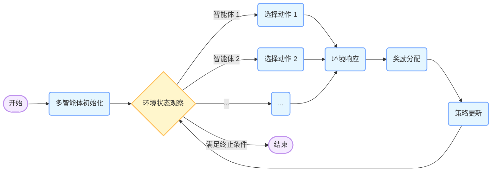

# 多智能体强化学习在智能电网调度中的优化

> 关键词：多智能体强化学习、智能电网调度、优化策略、分布式控制、电力系统

> 摘要：本文聚焦于多智能体强化学习在智能电网调度中的优化应用。随着智能电网的快速发展，其复杂的结构和多样化的运行需求对调度策略提出了更高要求。多智能体强化学习作为一种强大的技术手段，能够在分布式环境下实现智能体之间的协作与决策，为智能电网调度提供更高效、灵活的解决方案。文章深入探讨了多智能体强化学习的核心概念、算法原理，详细分析了其在智能电网调度中的数学模型和实际操作步骤，并通过项目实战案例展示了其应用效果。同时，介绍了相关的工具和资源，最后对未来发展趋势与挑战进行了总结与展望。

## 1. 背景介绍 
### 1.1 目的和范围
智能电网作为未来电力系统的发展方向，集成了先进的信息技术、通信技术和控制技术，旨在实现电力的高效、可靠、安全传输与分配。然而，智能电网的复杂性使得传统的调度方法难以满足其多样化的运行需求。多智能体强化学习作为一种新兴的技术，具有在复杂环境中进行分布式决策和协作的能力，能够有效应对智能电网调度中的各种挑战。本文的目的在于深入研究多智能体强化学习在智能电网调度中的应用，探讨其优化策略和实现方法，为智能电网的高效运行提供理论支持和实践指导。本文的范围涵盖了多智能体强化学习的基本概念、算法原理、数学模型，以及在智能电网调度中的具体应用案例和工具资源推荐。

### 1.2 预期读者
本文的预期读者包括电力系统领域的研究人员、工程师，人工智能领域的学者和开发者，以及对智能电网调度和多智能体强化学习感兴趣的专业人士。通过阅读本文，读者可以深入了解多智能体强化学习在智能电网调度中的应用原理和方法，掌握相关的技术和工具，为实际项目的开展提供参考。

### 1.3 文档结构概述
本文共分为十个部分。第一部分为背景介绍，阐述了文章的目的和范围、预期读者以及文档结构概述，并给出了相关术语的定义。第二部分介绍了多智能体强化学习和智能电网调度的核心概念，以及它们之间的联系，并通过文本示意图和 Mermaid 流程图进行了直观展示。第三部分详细讲解了多智能体强化学习的核心算法原理，并给出了具体的操作步骤和 Python 源代码示例。第四部分介绍了多智能体强化学习在智能电网调度中的数学模型和公式，并通过具体例子进行了说明。第五部分通过项目实战案例，详细介绍了开发环境搭建、源代码实现和代码解读。第六部分探讨了多智能体强化学习在智能电网调度中的实际应用场景。第七部分推荐了相关的学习资源、开发工具框架和论文著作。第八部分总结了多智能体强化学习在智能电网调度中的未来发展趋势与挑战。第九部分为附录，解答了常见问题。第十部分提供了扩展阅读和参考资料。

### 1.4 术语表
#### 1.4.1 核心术语定义
- **多智能体强化学习（Multi-Agent Reinforcement Learning，MARL）**：是强化学习的一个扩展领域，涉及多个智能体在一个环境中进行交互和学习，以实现各自或共同的目标。每个智能体根据自身的观察和奖励信号，通过学习策略来选择最优的动作。
- **智能电网调度（Smart Grid Scheduling）**：指的是在智能电网中，根据电力系统的运行状态、负荷需求、发电能力等因素，合理安排发电设备的启停、出力分配以及电力的传输和分配，以实现电力系统的安全、稳定、高效运行。
- **智能体（Agent）**：在多智能体系统中，智能体是具有自主决策能力的实体，能够感知环境信息，根据自身的目标和策略选择合适的动作，并与其他智能体进行交互。
- **环境（Environment）**：是智能体所处的外部世界，它提供了智能体可以观察到的状态信息，并根据智能体的动作给出相应的奖励信号。
- **策略（Policy）**：是智能体根据当前观察到的状态选择动作的规则，通常用概率分布来表示。

#### 1.4.2 相关概念解释
- **分布式控制**：在智能电网中，分布式控制是指将控制任务分配给多个本地控制器或智能体，每个智能体根据本地信息和与其他智能体的交互进行决策，从而实现整个系统的协调控制。多智能体强化学习可以作为一种有效的分布式控制方法，用于智能电网的调度。
- **协作与竞争**：在多智能体系统中，智能体之间可能存在协作和竞争两种关系。协作是指智能体为了实现共同的目标而相互合作，共享信息和资源；竞争则是指智能体为了自身的利益而与其他智能体进行竞争。在智能电网调度中，不同的发电单元和负荷单元可以看作是不同的智能体，它们之间既需要协作以满足系统的整体需求，又可能存在一定的竞争关系，如发电单元之间的功率分配竞争。

#### 1.4.3 缩略词列表
- **MARL**：Multi-Agent Reinforcement Learning，多智能体强化学习
- **RL**：Reinforcement Learning，强化学习
- **Q - learning**：Q 学习，一种经典的强化学习算法
- **DQN**：Deep Q - Network，深度 Q 网络，将深度学习与 Q 学习相结合的算法
- **PG**：Policy Gradient，策略梯度算法

## 2. 核心概念与联系 

### 多智能体强化学习核心概念
多智能体强化学习是强化学习在多智能体环境下的扩展。在单智能体强化学习中，一个智能体与环境进行交互，通过不断尝试不同的动作，根据环境反馈的奖励信号来学习最优的策略。而在多智能体强化学习中，存在多个智能体，它们在同一个环境中进行交互，每个智能体都有自己的目标和策略。智能体之间的交互可以是协作的，也可以是竞争的，或者是两者的混合。

多智能体强化学习的基本要素包括智能体、环境、状态、动作、奖励和策略。每个智能体都能够观察到环境的部分状态，并根据自身的策略选择动作。环境根据所有智能体的动作给出相应的奖励信号，智能体通过不断地学习和调整策略，以最大化长期累积奖励。

### 智能电网调度核心概念
智能电网调度是指对智能电网中的发电、输电、配电和用电等环节进行协调和控制，以实现电力系统的安全、稳定、高效运行。智能电网调度的主要任务包括发电计划制定、负荷预测、功率分配、故障处理等。传统的智能电网调度方法通常基于集中式控制，由一个中央控制器根据系统的全局信息进行决策。然而，随着智能电网的发展，其结构变得越来越复杂，分布式电源和储能设备的大量接入，使得集中式控制方法面临着信息传输延迟、计算复杂度高、灵活性差等问题。

### 两者联系
多智能体强化学习与智能电网调度之间存在着紧密的联系。在智能电网中，发电单元、负荷单元、储能设备等可以看作是不同的智能体，它们通过相互协作和竞争来实现电力系统的优化调度。多智能体强化学习可以为智能电网调度提供一种分布式的控制方法，每个智能体根据本地信息和与其他智能体的交互进行决策，从而提高系统的灵活性和适应性。同时，智能电网调度问题的复杂性和动态性也为多智能体强化学习的研究提供了一个实际的应用场景，促进了多智能体强化学习理论和算法的发展。

### 文本示意图
```plaintext
多智能体强化学习
├── 智能体 1
│   ├── 观察环境状态
│   ├── 选择动作
│   ├── 接收奖励
│   └── 学习策略
├── 智能体 2
│   ├── 观察环境状态
│   ├── 选择动作
│   ├── 接收奖励
│   └── 学习策略
└──...

智能电网调度
├── 发电单元
│   ├── 发电功率控制
│   └── 与其他单元交互
├── 负荷单元
│   ├── 负荷需求调整
│   └── 与其他单元交互
├── 储能设备
│   ├── 充放电控制
│   └── 与其他单元交互
└──...

联系：智能电网中的各单元作为智能体，通过多智能体强化学习实现优化调度
```

### Mermaid 流程图


## 3. 核心算法原理 & 具体操作步骤 

### 核心算法原理
#### 多智能体 Q - learning
多智能体 Q - learning 是单智能体 Q - learning 在多智能体环境下的扩展。在单智能体 Q - learning 中，智能体通过学习一个动作价值函数 $Q(s,a)$ 来选择最优的动作，其中 $s$ 表示环境的状态，$a$ 表示智能体的动作。在多智能体 Q - learning 中，每个智能体都有自己的动作价值函数 $Q_i(s,a_i)$，其中 $i$ 表示智能体的编号，$a_i$ 表示智能体 $i$ 的动作。

智能体 $i$ 的动作价值函数更新公式如下：
$$Q_i(s,a_i) \leftarrow Q_i(s,a_i) + \alpha \left[r_i(s,a) + \gamma \max_{a_i'} Q_i(s',a_i') - Q_i(s,a_i)\right]$$
其中，$\alpha$ 是学习率，$\gamma$ 是折扣因子，$r_i(s,a)$ 是智能体 $i$ 在状态 $s$ 下采取动作 $a$ 后获得的奖励，$s'$ 是下一个状态。

#### 深度多智能体强化学习
深度多智能体强化学习将深度学习与多智能体强化学习相结合，用于处理高维的状态和动作空间。常见的深度多智能体强化学习算法包括深度多智能体 Q 网络（Deep Multi - Agent Q - Network，DMAQ）和多智能体策略梯度算法（Multi - Agent Policy Gradient，MAPG）。

以 DMAQ 为例，它使用深度神经网络来近似每个智能体的动作价值函数。智能体通过神经网络输入当前状态和动作，输出对应的动作价值。在训练过程中，通过最小化损失函数来更新神经网络的参数，使得动作价值函数能够更好地估计真实的价值。

### 具体操作步骤
#### 步骤 1：环境建模
首先，需要对智能电网调度环境进行建模，包括定义环境的状态空间、动作空间和奖励函数。状态空间可以包括发电单元的功率输出、负荷需求、储能设备的电量等信息；动作空间可以包括发电单元的功率调整、负荷单元的需求调整、储能设备的充放电控制等；奖励函数可以根据系统的运行目标来设计，如最小化发电成本、最大化系统的可靠性等。

#### 步骤 2：智能体初始化
初始化每个智能体的策略和动作价值函数。可以使用随机初始化的方法，也可以根据先验知识进行初始化。

#### 步骤 3：训练过程
在每个时间步，每个智能体观察环境的状态，根据自身的策略选择动作。所有智能体的动作共同作用于环境，环境根据这些动作给出相应的奖励信号和下一个状态。每个智能体根据奖励信号和下一个状态更新自己的策略和动作价值函数。

#### 步骤 4：终止条件判断
当满足一定的终止条件时，训练过程结束。终止条件可以是达到最大训练步数、策略收敛等。

### Python 源代码示例
```python
import numpy as np

# 定义智能体类
class Agent:
    def __init__(self, state_space_size, action_space_size, learning_rate=0.1, discount_factor=0.9):
        self.state_space_size = state_space_size
        self.action_space_size = action_space_size
        self.learning_rate = learning_rate
        self.discount_factor = discount_factor
        # 初始化 Q 表
        self.Q_table = np.zeros((state_space_size, action_space_size))

    def choose_action(self, state):
        # 简单的贪心策略选择动作
        action = np.argmax(self.Q_table[state, :])
        return action

    def update_Q_table(self, state, action, reward, next_state):
        # 更新 Q 表
        max_Q_next = np.max(self.Q_table[next_state, :])
        self.Q_table[state, action] = (1 - self.learning_rate) * self.Q_table[state, action] + \
                                      self.learning_rate * (reward + self.discount_factor * max_Q_next)

# 定义环境类
class SmartGridEnv:
    def __init__(self, num_agents, state_space_size, action_space_size):
        self.num_agents = num_agents
        self.state_space_size = state_space_size
        self.action_space_size = action_space_size
        self.current_state = np.random.randint(0, state_space_size)

    def step(self, actions):
        # 模拟环境响应
        next_state = np.random.randint(0, self.state_space_size)
        rewards = [np.random.randint(-1, 2) for _ in range(self.num_agents)]
        return next_state, rewards

# 训练过程
num_agents = 2
state_space_size = 10
action_space_size = 5
episodes = 100

agents = [Agent(state_space_size, action_space_size) for _ in range(num_agents)]
env = SmartGridEnv(num_agents, state_space_size, action_space_size)

for episode in range(episodes):
    state = env.current_state
    actions = [agent.choose_action(state) for agent in agents]
    next_state, rewards = env.step(actions)
    for i, agent in enumerate(agents):
        agent.update_Q_table(state, actions[i], rewards[i], next_state)
    env.current_state = next_state

print("训练完成")
```

## 4. 数学模型和公式 & 详细讲解 & 举例说明 

### 多智能体强化学习数学模型
#### 马尔可夫决策过程（MDP）扩展
在多智能体环境中，马尔可夫决策过程可以扩展为多智能体马尔可夫决策过程（Multi - Agent Markov Decision Process，MMDP）。MMDP 由以下几个要素组成：
- **状态空间 $S$**：表示环境的所有可能状态。
- **动作空间 $A = A_1 \times A_2 \times \cdots \times A_n$**：其中 $A_i$ 是智能体 $i$ 的动作空间，$n$ 是智能体的数量。
- **转移概率函数 $P(s'|s,a)$**：表示在状态 $s$ 下，所有智能体采取动作 $a = (a_1,a_2,\cdots,a_n)$ 后，环境转移到状态 $s'$ 的概率。
- **奖励函数 $R(s,a) = (R_1(s,a),R_2(s,a),\cdots,R_n(s,a))$**：其中 $R_i(s,a)$ 是智能体 $i$ 在状态 $s$ 下，所有智能体采取动作 $a$ 后获得的奖励。

#### 策略和价值函数
每个智能体 $i$ 都有自己的策略 $\pi_i(a_i|s)$，表示在状态 $s$ 下，智能体 $i$ 选择动作 $a_i$ 的概率。智能体 $i$ 的状态 - 动作价值函数 $Q_i(s,a_i)$ 定义为：
$$Q_i(s,a_i) = \mathbb{E}_{\pi}\left[\sum_{t = 0}^{\infty} \gamma^t R_i(s_t,a_t) | s_0 = s, a_{i0} = a_i\right]$$
其中，$\gamma$ 是折扣因子，$\pi = (\pi_1,\pi_2,\cdots,\pi_n)$ 是所有智能体的联合策略。

### 智能电网调度数学模型
#### 目标函数
智能电网调度的目标通常是在满足各种约束条件的前提下，最小化发电成本或最大化系统的可靠性。以最小化发电成本为例，目标函数可以表示为：
$$\min \sum_{t = 0}^{T - 1} \sum_{i = 1}^{N_g} C_i(P_{it})$$
其中，$T$ 是调度周期，$N_g$ 是发电单元的数量，$C_i(P_{it})$ 是发电单元 $i$ 在时刻 $t$ 的发电成本函数，$P_{it}$ 是发电单元 $i$ 在时刻 $t$ 的功率输出。

#### 约束条件
- **功率平衡约束**：在每个时刻 $t$，发电功率总和等于负荷需求总和加上网损，即
$$\sum_{i = 1}^{N_g} P_{it} = \sum_{j = 1}^{N_l} D_{jt} + P_{loss,t}$$
其中，$N_l$ 是负荷单元的数量，$D_{jt}$ 是负荷单元 $j$ 在时刻 $t$ 的需求，$P_{loss,t}$ 是时刻 $t$ 的网损。
- **发电单元约束**：每个发电单元的功率输出需要满足一定的上下限约束，即
$$P_{i\min} \leq P_{it} \leq P_{i\max}$$
其中，$P_{i\min}$ 和 $P_{i\max}$ 分别是发电单元 $i$ 的最小和最大功率输出。
- **储能设备约束**：储能设备的充放电功率和电量需要满足一定的约束条件，例如
$$-P_{es\max} \leq P_{est} \leq P_{es\max}$$
$$E_{es\min} \leq E_{est} \leq E_{es\max}$$
其中，$P_{es\max}$ 是储能设备的最大充放电功率，$E_{est}$ 是储能设备在时刻 $t$ 的电量，$E_{es\min}$ 和 $E_{es\max}$ 分别是储能设备的最小和最大电量。

### 举例说明
假设一个简单的智能电网系统，包含 2 个发电单元和 1 个负荷单元。发电单元 1 的发电成本函数为 $C_1(P_1) = 0.1P_1^2 + 10P_1$，发电单元 2 的发电成本函数为 $C_2(P_2) = 0.2P_2^2 + 8P_2$。负荷单元的需求为 $D = 100$ MW。发电单元 1 的功率范围为 $[20, 80]$ MW，发电单元 2 的功率范围为 $[10, 60]$ MW。

目标是在满足功率平衡约束 $P_1 + P_2 = 100$ 的前提下，最小化发电总成本 $C = C_1(P_1) + C_2(P_2)$。

可以通过拉格朗日乘数法求解该优化问题。构造拉格朗日函数：
$$L(P_1,P_2,\lambda) = 0.1P_1^2 + 10P_1 + 0.2P_2^2 + 8P_2 + \lambda(100 - P_1 - P_2)$$

分别对 $P_1$、$P_2$ 和 $\lambda$ 求偏导数，并令其为 0：
$$\frac{\partial L}{\partial P_1} = 0.2P_1 + 10 - \lambda = 0$$
$$\frac{\partial L}{\partial P_2} = 0.4P_2 + 8 - \lambda = 0$$
$$\frac{\partial L}{\partial \lambda} = 100 - P_1 - P_2 = 0$$

联立求解上述方程组，可得最优的发电功率分配方案。

## 5. 项目实战：代码实际案例和详细解释说明 

### 5.1  开发环境搭建
#### 操作系统
推荐使用 Linux 系统，如 Ubuntu 18.04 或更高版本。Linux 系统具有良好的稳定性和开源生态，适合进行深度学习和强化学习的开发。

#### Python 环境
安装 Python 3.7 或更高版本。可以使用 Anaconda 来管理 Python 环境，Anaconda 提供了丰富的科学计算库和工具。安装完成后，创建一个新的虚拟环境：
```bash
conda create -n smart_grid_rl python=3.8
conda activate smart_grid_rl
```

#### 安装必要的库
在虚拟环境中安装以下必要的库：
```bash
pip install numpy pandas matplotlib tensorflow torch gym
```
- `numpy`：用于数值计算。
- `pandas`：用于数据处理和分析。
- `matplotlib`：用于数据可视化。
- `tensorflow` 和 `torch`：深度学习框架，用于实现深度多智能体强化学习算法。
- `gym`：OpenAI Gym 是一个用于开发和比较强化学习算法的工具包，提供了各种环境和接口。

### 5.2  源代码详细实现和代码解读
#### 环境建模
```python
import gym
import numpy as np

class SmartGridEnv(gym.Env):
    def __init__(self):
        # 定义状态空间和动作空间
        self.state_space_size = 10
        self.action_space_size = 5
        self.observation_space = gym.spaces.Box(low=0, high=1, shape=(self.state_space_size,))
        self.action_space = gym.spaces.Discrete(self.action_space_size)
        # 初始化当前状态
        self.current_state = np.random.rand(self.state_space_size)

    def step(self, action):
        # 模拟环境响应
        next_state = np.random.rand(self.state_space_size)
        reward = np.random.randint(-1, 2)
        done = False
        info = {}
        return next_state, reward, done, info

    def reset(self):
        # 重置环境
        self.current_state = np.random.rand(self.state_space_size)
        return self.current_state
```
**代码解读**：
- `__init__` 方法：初始化环境的状态空间和动作空间，使用 `gym.spaces.Box` 和 `gym.spaces.Discrete` 定义连续和离散的空间。同时，随机初始化当前状态。
- `step` 方法：根据智能体的动作，模拟环境的响应，返回下一个状态、奖励、是否结束和额外信息。
- `reset` 方法：重置环境的状态，返回初始状态。

#### 智能体实现
```python
import torch
import torch.nn as nn
import torch.optim as optim

class DQNAgent:
    def __init__(self, state_space_size, action_space_size, learning_rate=0.001, discount_factor=0.9):
        self.state_space_size = state_space_size
        self.action_space_size = action_space_size
        self.learning_rate = learning_rate
        self.discount_factor = discount_factor
        # 定义神经网络
        self.model = nn.Sequential(
            nn.Linear(state_space_size, 64),
            nn.ReLU(),
            nn.Linear(64, action_space_size)
        )
        self.optimizer = optim.Adam(self.model.parameters(), lr=learning_rate)
        self.criterion = nn.MSELoss()

    def choose_action(self, state):
        state = torch.FloatTensor(state).unsqueeze(0)
        q_values = self.model(state)
        action = torch.argmax(q_values).item()
        return action

    def update_model(self, state, action, reward, next_state):
        state = torch.FloatTensor(state).unsqueeze(0)
        next_state = torch.FloatTensor(next_state).unsqueeze(0)
        q_values = self.model(state)
        next_q_values = self.model(next_state)
        max_next_q = torch.max(next_q_values).item()
        target_q = q_values.clone()
        target_q[0][action] = reward + self.discount_factor * max_next_q
        self.optimizer.zero_grad()
        loss = self.criterion(q_values, target_q)
        loss.backward()
        self.optimizer.step()
```
**代码解读**：
- `__init__` 方法：初始化智能体的状态空间、动作空间、学习率和折扣因子。定义一个简单的神经网络作为 Q 网络，使用 Adam 优化器和均方误差损失函数。
- `choose_action` 方法：根据当前状态，通过神经网络计算 Q 值，选择 Q 值最大的动作。
- `update_model` 方法：根据当前状态、动作、奖励和下一个状态，更新神经网络的参数。首先计算当前状态的 Q 值和下一个状态的最大 Q 值，然后更新目标 Q 值，最后通过反向传播更新神经网络的参数。

#### 训练过程
```python
env = SmartGridEnv()
agent = DQNAgent(env.state_space_size, env.action_space_size)

episodes = 100
for episode in range(episodes):
    state = env.reset()
    done = False
    while not done:
        action = agent.choose_action(state)
        next_state, reward, done, _ = env.step(action)
        agent.update_model(state, action, reward, next_state)
        state = next_state
    print(f"Episode {episode + 1} completed")
```
**代码解读**：
- 初始化环境和智能体。
- 进行多个训练周期，每个周期中，重置环境状态，智能体根据当前状态选择动作，环境根据动作给出响应，智能体更新模型参数，直到环境结束。

### 5.3  代码解读与分析
#### 环境建模分析
通过继承 `gym.Env` 类，我们可以方便地定义智能电网调度环境。使用 `gym` 提供的接口，可以将环境与各种强化学习算法进行集成。在 `step` 方法中，我们简单地模拟了环境的响应，实际应用中，需要根据智能电网的具体模型来实现。

#### 智能体实现分析
使用深度学习框架 `torch` 实现了一个简单的 DQN 智能体。通过神经网络来近似 Q 值函数，使用 Adam 优化器和均方误差损失函数进行训练。在 `choose_action` 方法中，采用贪心策略选择动作；在 `update_model` 方法中，使用 Q - learning 的思想更新神经网络的参数。

#### 训练过程分析
训练过程通过循环多个周期，让智能体与环境进行交互，不断学习和调整策略。每个周期中，智能体根据当前状态选择动作，环境给出奖励和下一个状态，智能体根据奖励更新模型参数。通过多次训练，智能体可以逐渐学习到最优的策略。

## 6. 实际应用场景 
### 发电功率分配
在智能电网中，存在多个发电单元，如火力发电、水力发电、风力发电等。不同的发电单元具有不同的发电成本和发电特性。多智能体强化学习可以用于优化发电功率的分配，每个发电单元作为一个智能体，根据自身的成本和系统的需求，通过与其他发电单元协作和竞争，选择最优的发电功率，以最小化发电总成本。

### 负荷需求响应
智能电网中的负荷单元可以根据电价和系统的运行状态调整自己的用电需求。多智能体强化学习可以用于实现负荷需求响应，每个负荷单元作为一个智能体，根据电价信号和自身的用电需求，通过学习和决策，选择合适的用电时间和用电量，以降低用电成本，同时提高系统的稳定性。

### 储能设备管理
储能设备在智能电网中起着重要的作用，它可以存储多余的电能，在用电高峰期释放电能，以平衡电力供需。多智能体强化学习可以用于优化储能设备的管理，每个储能设备作为一个智能体，根据系统的功率平衡情况和自身的电量状态，通过与其他储能设备和发电单元、负荷单元的交互，选择最优的充放电策略。

### 故障处理与恢复
当智能电网中发生故障时，需要快速、有效地进行故障处理和恢复。多智能体强化学习可以用于故障处理和恢复过程，每个智能体可以代表一个保护装置、开关设备或维修团队。智能体通过协作和决策，快速隔离故障区域，恢复电力供应，以减少故障对系统的影响。

## 7. 工具和资源推荐
### 7.1 学习资源推荐
#### 7.1.1 书籍推荐
- 《Reinforcement Learning: An Introduction》：由 Richard S. Sutton 和 Andrew G. Barto 所著，是强化学习领域的经典教材，全面介绍了强化学习的基本概念、算法和应用。
- 《Multi - Agent Systems: Algorithmic, Game - Theoretic, and Logical Foundations》：详细介绍了多智能体系统的理论基础，包括算法、博弈论和逻辑等方面的内容。
- 《Smart Grid: Communication Technologies and Standards》：介绍了智能电网的通信技术和标准，对于理解智能电网的架构和运行机制有很大帮助。

#### 7.1.2 在线课程
- Coursera 上的 “Reinforcement Learning Specialization”：由 University of Alberta 提供，包括多个强化学习的课程，从基础概念到高级算法都有涉及。
- edX 上的 “Multi - Agent Artificial Intelligence”：介绍了多智能体人工智能的基本理论和算法，以及在不同领域的应用。
- Udemy 上的 “Smart Grid Technology and Applications”：讲解了智能电网的技术和应用，包括智能电网调度、分布式能源管理等方面的内容。

#### 7.1.3 技术博客和网站
- OpenAI Blog：OpenAI 发布的关于人工智能和强化学习的最新研究成果和技术文章。
- Towards Data Science：一个专注于数据科学和机器学习的技术博客，有很多关于强化学习和智能电网的优秀文章。
- IEEE Smart Grid：IEEE 关于智能电网的官方网站，提供了智能电网领域的最新研究动态和技术报告。

### 7.2 开发工具框架推荐
#### 7.2.1 IDE和编辑器
- PyCharm：是一款专门为 Python 开发设计的集成开发环境，具有强大的代码编辑、调试和项目管理功能。
- Jupyter Notebook：是一个交互式的开发环境，适合进行数据探索、模型训练和可视化。可以方便地将代码、文本和图表结合在一起，进行项目的展示和分享。
- Visual Studio Code：是一款轻量级的代码编辑器，支持多种编程语言和插件扩展。可以通过安装 Python 插件来进行 Python 开发。

#### 7.2.2 调试和性能分析工具
- TensorBoard：是 TensorFlow 提供的可视化工具，可以用于监控模型的训练过程、可视化模型的结构和性能指标。
- PyTorch Profiler：是 PyTorch 提供的性能分析工具，可以帮助开发者分析模型的运行时间、内存使用等情况，优化模型的性能。
- cProfile：是 Python 标准库中的性能分析工具，可以分析 Python 代码的执行时间和函数调用情况。

#### 7.2.3 相关框架和库
- Stable Baselines3：是一个基于 PyTorch 的强化学习库，提供了多种经典的强化学习算法的实现，如 A2C、PPO、DQN 等。可以方便地进行强化学习算法的训练和测试。
- PettingZoo：是一个用于多智能体强化学习的环境库，提供了多种多智能体环境，如合作游戏、竞争游戏等。可以用于开发和测试多智能体强化学习算法。
- Grid2Op：是一个专门为智能电网调度设计的强化学习环境，提供了智能电网的详细模型和仿真工具，可以用于研究和开发智能电网调度的强化学习算法。

### 7.3 相关论文著作推荐
#### 7.3.1 经典论文
- “Q - learning”：由 Christopher J. C. H. Watkins 和 Peter Dayan 发表，介绍了 Q - learning 算法，是强化学习领域的经典论文之一。
- “Deep Q - Networks”：由 Volodymyr Mnih 等人发表，提出了深度 Q 网络（DQN）算法，将深度学习与强化学习相结合，取得了很好的效果。
- “Multi - Agent Reinforcement Learning: A Selective Overview of Theories and Algorithms”：对多智能体强化学习的理论和算法进行了全面的综述。

#### 7.3.2 最新研究成果
- 在 IEEE Transactions on Smart Grid、Journal of Power Sources 等期刊上，经常发表关于智能电网调度和多智能体强化学习的最新研究成果。可以关注这些期刊的最新文章，了解该领域的前沿动态。
- 每年的国际会议，如 International Conference on Machine Learning (ICML)、Neural Information Processing Systems (NeurIPS) 等，也会有关于多智能体强化学习和智能电网的研究报告。

#### 7.3.3 应用案例分析
- 一些实际的智能电网项目会公开其应用多智能体强化学习进行调度优化的案例和经验总结。可以通过查阅相关的技术报告和项目文档，了解多智能体强化学习在实际应用中的效果和挑战。

## 8. 总结：未来发展趋势与挑战
### 未来发展趋势
#### 与其他技术的融合
多智能体强化学习将与区块链、边缘计算、物联网等技术深度融合。区块链技术可以提供安全、可信的分布式账本，用于智能体之间的信息共享和交易；边缘计算可以将计算任务分布到网络边缘，减少数据传输延迟，提高系统的实时性；物联网技术可以提供更丰富的环境感知数据，为多智能体强化学习提供更准确的决策依据。

#### 复杂环境下的应用拓展
随着智能电网的不断发展，其环境将变得越来越复杂，如分布式能源的大规模接入、电动汽车的广泛应用等。多智能体强化学习将在这些复杂环境下得到更广泛的应用，以解决更复杂的调度问题。

#### 理论和算法的创新
研究人员将不断探索新的多智能体强化学习理论和算法，以提高算法的收敛速度、稳定性和可扩展性。例如，发展基于博弈论的多智能体强化学习算法，解决智能体之间的协作和竞争问题。

### 挑战
#### 智能体之间的协作与通信
在多智能体系统中，智能体之间的协作和通信是一个关键问题。如何设计有效的通信协议和协作机制，确保智能体之间能够准确地共享信息和协调行动，是需要解决的挑战之一。

#### 算法的可扩展性
随着智能体数量的增加和环境复杂度的提高，多智能体强化学习算法的计算复杂度和通信开销会急剧增加。如何设计具有良好可扩展性的算法，以适应大规模多智能体系统的需求，是一个重要的挑战。

#### 环境建模和数据质量
准确的环境建模和高质量的数据是多智能体强化学习成功应用的基础。智能电网的环境复杂多变，如何建立准确的环境模型，获取和处理高质量的数据，是需要克服的挑战。

#### 安全性和可靠性
智能电网的安全和可靠运行至关重要。多智能体强化学习系统需要具备良好的安全性和可靠性，能够抵御各种攻击和故障，确保系统的稳定运行。

## 9. 附录：常见问题与解答
### 问题 1：多智能体强化学习与单智能体强化学习有什么区别？
**解答**：单智能体强化学习中只有一个智能体与环境进行交互，智能体根据自身的观察和奖励信号来学习最优策略。而多智能体强化学习中有多个智能体，它们在同一个环境中进行交互，每个智能体的决策不仅受到环境的影响，还受到其他智能体的影响。智能体之间可能存在协作、竞争等关系，需要考虑如何与其他智能体进行协调和合作。

### 问题 2：多智能体强化学习在智能电网调度中的应用有哪些优势？
**解答**：多智能体强化学习在智能电网调度中的应用具有以下优势：
- **分布式决策**：可以将调度任务分配给多个智能体，每个智能体根据本地信息进行决策，减少信息传输延迟和计算复杂度。
- **适应性和灵活性**：能够适应智能电网复杂多变的环境，根据实时的运行状态和需求进行动态调整。
- **协作能力**：智能体之间可以通过协作实现系统的整体优化，提高电网的运行效率和可靠性。

### 问题 3：如何选择合适的多智能体强化学习算法？
**解答**：选择合适的多智能体强化学习算法需要考虑以下因素：
- **问题的复杂度**：如果问题的状态空间和动作空间较小，可以选择传统的多智能体 Q - learning 算法；如果问题的复杂度较高，需要使用深度多智能体强化学习算法。
- **智能体之间的关系**：如果智能体之间是协作关系，可以选择基于协作的算法；如果智能体之间是竞争关系，可以选择基于博弈论的算法。
- **计算资源**：不同的算法对计算资源的需求不同，需要根据实际的计算资源情况选择合适的算法。

### 问题 4：多智能体强化学习在智能电网调度中的应用面临哪些挑战？
**解答**：多智能体强化学习在智能电网调度中的应用面临以下挑战：
- **智能体之间的协作与通信**：需要设计有效的通信协议和协作机制，确保智能体之间能够准确地共享信息和协调行动。
- **算法的可扩展性**：随着智能体数量的增加和环境复杂度的提高，算法的计算复杂度和通信开销会急剧增加。
- **环境建模和数据质量**：准确的环境建模和高质量的数据是算法成功应用的基础，但智能电网的环境复杂多变，获取和处理数据存在一定的困难。
- **安全性和可靠性**：智能电网的安全和可靠运行至关重要，需要确保多智能体强化学习系统具备良好的安全性和可靠性。

## 10. 扩展阅读 & 参考资料
### 扩展阅读
- 《Deep Reinforcement Learning Hands - On》：进一步深入学习深度强化学习的理论和实践，包括更多的算法和应用案例。
- 《Game Theory for Artificial Intelligence》：了解博弈论在人工智能中的应用，对于理解多智能体之间的协作和竞争关系有很大帮助。
- 《Power System Economics: Designing Markets for Electricity》：深入学习电力系统经济学，了解电力市场的设计和运行机制，对于智能电网调度的优化有更深刻的理解。

### 参考资料
- Sutton, R. S., & Barto, A. G. (2018). Reinforcement Learning: An Introduction. MIT press.
- Shoham, Y., & Leyton - Brown, K. (2009). Multi - Agent Systems: Algorithmic, Game - Theoretic, and Logical Foundations. Cambridge University Press.
- Mnih, V., Kavukcuoglu, K., Silver, D., Rusu, A. A., Veness, J., Bellemare, M. G.,... & Petersen, S. (2015). Human - level control through deep reinforcement learning. Nature, 518(7540), 529 - 533.

作者：AI天才研究院/AI Genius Institute & 禅与计算机程序设计艺术 /Zen And The Art of Computer Programming