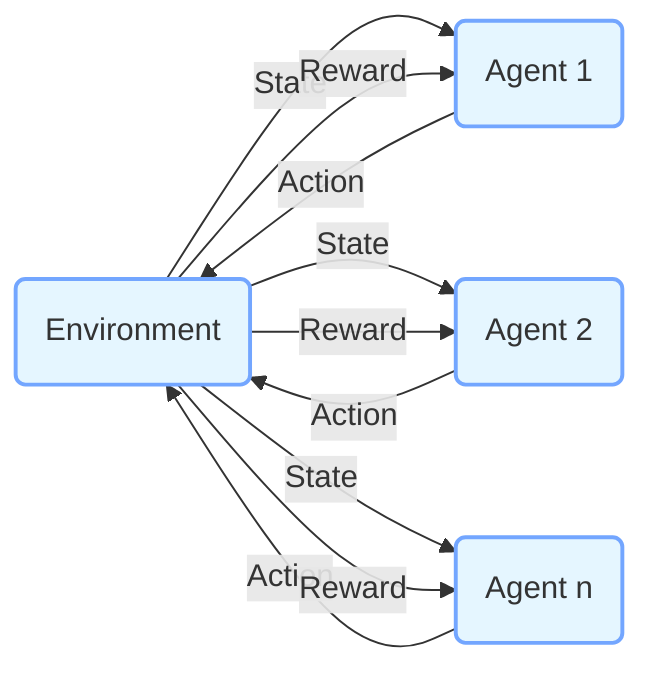

# 多智能体强化学习：复杂环境下的AI Agent协作

> 关键词：多智能体强化学习、AI Agent协作、复杂环境、算法原理、实际应用

> 摘要：本文深入探讨了多智能体强化学习在复杂环境下实现AI Agent协作的相关内容。首先介绍了多智能体强化学习的背景知识，包括目的、预期读者、文档结构和术语表等。接着详细阐述了核心概念与联系，通过文本示意图和Mermaid流程图进行清晰展示。在核心算法原理和具体操作步骤部分，使用Python源代码进行详细解释。同时，给出了相关的数学模型和公式，并结合实际例子进行说明。通过项目实战，展示了代码的实际案例和详细解释。还分析了多智能体强化学习的实际应用场景，推荐了相关的学习资源、开发工具框架和论文著作。最后总结了未来发展趋势与挑战，并对常见问题进行了解答，提供了扩展阅读和参考资料。

## 1. 背景介绍 
### 1.1 目的和范围
多智能体强化学习（Multi-Agent Reinforcement Learning，MARL）旨在解决多个智能体在复杂环境中相互协作以实现共同或各自目标的问题。在许多实际场景中，如自动驾驶、机器人协作、智能电网、游戏等，单个智能体往往无法完成复杂的任务，需要多个智能体之间进行有效的协作。本文的目的是全面介绍多智能体强化学习的相关知识，包括核心概念、算法原理、数学模型、实际应用等，帮助读者深入理解多智能体强化学习在复杂环境下的AI Agent协作机制。范围涵盖了多智能体强化学习的基础理论、常见算法、实际项目应用以及未来发展趋势等方面。

### 1.2 预期读者
本文的预期读者包括对人工智能、机器学习、强化学习等领域感兴趣的研究人员、学生和开发者。对于希望深入了解多智能体强化学习技术，以及如何将其应用于实际项目的读者来说，本文将提供有价值的信息和指导。同时，对于已经在相关领域有一定基础的专业人士，也可以作为进一步研究和探索的参考资料。

### 1.3 文档结构概述
本文将按照以下结构进行组织：
1. **背景介绍**：介绍多智能体强化学习的目的、预期读者、文档结构和术语表。
2. **核心概念与联系**：阐述多智能体强化学习的核心概念，包括智能体、环境、策略、奖励等，并通过文本示意图和Mermaid流程图展示它们之间的关系。
3. **核心算法原理 & 具体操作步骤**：详细介绍常见的多智能体强化学习算法，如独立Q学习、深度多智能体强化学习算法等，并使用Python源代码进行具体实现和解释。
4. **数学模型和公式 & 详细讲解 & 举例说明**：给出多智能体强化学习的数学模型和公式，如贝尔曼方程、策略梯度等，并结合实际例子进行详细讲解。
5. **项目实战：代码实际案例和详细解释说明**：通过一个实际的项目案例，展示多智能体强化学习在复杂环境下的应用，包括开发环境搭建、源代码实现和代码解读。
6. **实际应用场景**：分析多智能体强化学习在不同领域的实际应用场景，如自动驾驶、机器人协作、智能电网等。
7. **工具和资源推荐**：推荐相关的学习资源、开发工具框架和论文著作，帮助读者进一步学习和研究多智能体强化学习。
8. **总结：未来发展趋势与挑战**：总结多智能体强化学习的未来发展趋势和面临的挑战。
9. **附录：常见问题与解答**：解答读者在学习和应用多智能体强化学习过程中常见的问题。
10. **扩展阅读 & 参考资料**：提供相关的扩展阅读材料和参考资料，方便读者深入研究。

### 1.4 术语表
#### 1.4.1 核心术语定义
- **多智能体强化学习（Multi-Agent Reinforcement Learning，MARL）**：多个智能体在环境中通过与环境交互，学习如何采取最优行动以最大化累积奖励的学习方法。
- **智能体（Agent）**：能够感知环境状态，并根据一定的策略采取行动的实体。
- **环境（Environment）**：智能体所处的外部世界，智能体的行动会影响环境状态，环境会根据智能体的行动反馈奖励。
- **策略（Policy）**：智能体根据环境状态选择行动的规则。
- **奖励（Reward）**：环境根据智能体的行动给予的反馈信号，用于指导智能体学习最优策略。
- **状态（State）**：环境在某一时刻的特征描述，智能体根据状态选择行动。

#### 1.4.2 相关概念解释
- **协作式多智能体强化学习**：多个智能体为了实现共同目标而进行协作的学习方式。
- **竞争式多智能体强化学习**：多个智能体为了争夺有限资源或实现各自目标而进行竞争的学习方式。
- **分布式多智能体强化学习**：多个智能体在分布式环境中独立学习，但通过一定的通信机制进行信息共享和协作。
- **集中式多智能体强化学习**：存在一个中央控制器，负责收集所有智能体的信息并为它们制定行动策略。

#### 1.4.3 缩略词列表
- **MARL**：Multi-Agent Reinforcement Learning，多智能体强化学习
- **Q-Learning**：Q学习算法
- **DQN**：Deep Q-Network，深度Q网络
- **A2C**：Advantage Actor-Critic，优势演员-评论家算法
- **PPO**：Proximal Policy Optimization，近端策略优化算法

## 2. 核心概念与联系 
### 核心概念原理
多智能体强化学习涉及多个核心概念，下面对这些概念进行详细解释：
- **智能体（Agent）**：智能体是多智能体强化学习中的基本实体，它能够感知环境状态，并根据一定的策略选择行动。每个智能体都有自己的目标和奖励函数，通过与环境交互不断学习最优策略。
- **环境（Environment）**：环境是智能体所处的外部世界，它包含了所有智能体的状态信息。环境会根据智能体的行动改变自身状态，并给予智能体相应的奖励。环境可以是物理世界、虚拟游戏世界等。
- **策略（Policy）**：策略是智能体根据环境状态选择行动的规则。策略可以是确定性的，也可以是随机性的。常见的策略表示方法有表格形式（如Q表）和神经网络形式（如深度Q网络）。
- **奖励（Reward）**：奖励是环境根据智能体的行动给予的反馈信号，用于指导智能体学习最优策略。奖励可以是即时的，也可以是延迟的。智能体的目标是最大化累积奖励。
- **状态（State）**：状态是环境在某一时刻的特征描述，智能体根据状态选择行动。状态可以是离散的，也可以是连续的。

### 文本示意图
```plaintext
+----------------+
|    Environment |
+----------------+
       |
       |  State
       |
+------+------+
| Agent 1 | Agent 2 |... | Agent n |
+------+------+------+------+
       |
       |  Action
       |
+----------------+
|    Environment |
+----------------+
```
上述示意图展示了多智能体强化学习中智能体与环境之间的交互过程。环境将状态信息传递给各个智能体，智能体根据状态选择行动并反馈给环境，环境根据智能体的行动更新状态并给予奖励。

### Mermaid流程图

该流程图清晰地展示了多智能体强化学习中智能体与环境之间的交互循环。环境向智能体提供状态信息，智能体根据状态选择行动并作用于环境，环境根据行动更新状态并给予智能体奖励。

## 3. 核心算法原理 & 具体操作步骤 
### 独立Q学习（Independent Q-Learning）
#### 算法原理
独立Q学习是一种简单的多智能体强化学习算法，每个智能体独立地使用Q学习算法进行学习。Q学习是一种基于值函数的强化学习算法，其目标是学习一个Q函数 $Q(s,a)$，表示在状态 $s$ 下采取行动 $a$ 的期望累积奖励。Q函数的更新公式如下：
$$Q(s_t,a_t) \leftarrow Q(s_t,a_t) + \alpha [r_{t+1} + \gamma \max_{a} Q(s_{t+1},a) - Q(s_t,a_t)]$$
其中，$\alpha$ 是学习率，$\gamma$ 是折扣因子，$r_{t+1}$ 是在时刻 $t+1$ 获得的奖励，$s_t$ 和 $a_t$ 分别是时刻 $t$ 的状态和行动。

#### 具体操作步骤
1. 初始化所有智能体的Q表 $Q(s,a)$ 为零。
2. 对于每个训练回合：
    - 初始化环境状态 $s_0$。
    - 对于每个时间步 $t$：
        - 每个智能体根据当前状态 $s_t$ 和自己的Q表选择行动 $a_t$。
        - 所有智能体同时执行行动，环境根据行动更新状态 $s_{t+1}$ 并给予每个智能体相应的奖励 $r_{t+1}$。
        - 每个智能体根据Q学习更新公式更新自己的Q表。
    - 直到达到终止条件。

#### Python源代码实现
```python
import numpy as np

# 定义环境参数
num_states = 10
num_actions = 4
num_agents = 2
learning_rate = 0.1
discount_factor = 0.9
num_episodes = 1000

# 初始化Q表
q_tables = [np.zeros((num_states, num_actions)) for _ in range(num_agents)]

# 独立Q学习算法
for episode in range(num_episodes):
    state = np.random.randint(0, num_states)  # 初始化状态
    done = False
    while not done:
        actions = []
        # 每个智能体选择行动
        for agent in range(num_agents):
            action = np.argmax(q_tables[agent][state])
            actions.append(action)
        
        # 执行行动，更新环境状态和奖励
        next_state = np.random.randint(0, num_states)  # 简单示例，实际中需要根据环境模型更新
        rewards = [np.random.randint(-1, 2) for _ in range(num_agents)]  # 简单示例，实际中需要根据环境模型计算
        
        # 每个智能体更新Q表
        for agent in range(num_agents):
            q_tables[agent][state, actions[agent]] += learning_rate * (
                rewards[agent] + discount_factor * np.max(q_tables[agent][next_state]) - q_tables[agent][state, actions[agent]]
            )
        
        state = next_state
        
        # 终止条件判断
        if np.random.rand() < 0.1:  # 简单示例，实际中需要根据具体任务设置终止条件
            done = True
```

### 深度多智能体强化学习算法（以深度Q网络为例）
#### 算法原理
深度Q网络（Deep Q-Network，DQN）是一种将深度学习与Q学习相结合的算法，用于处理连续状态空间和高维状态空间的问题。在多智能体环境中，可以为每个智能体使用一个独立的DQN网络进行学习。DQN的核心思想是使用一个神经网络来近似Q函数，通过最小化损失函数来更新网络参数。损失函数通常定义为：
$$L(\theta) = \mathbb{E}_{s,a,r,s'} [(r + \gamma \max_{a'} Q(s',a';\theta^-) - Q(s,a;\theta))^2]$$
其中，$\theta$ 是当前网络的参数，$\theta^-$ 是目标网络的参数，目标网络的参数定期从当前网络复制。

#### 具体操作步骤
1. 初始化每个智能体的DQN网络和目标网络，随机初始化网络参数。
2. 初始化经验回放缓冲区。
3. 对于每个训练回合：
    - 初始化环境状态 $s_0$。
    - 对于每个时间步 $t$：
        - 每个智能体根据当前状态 $s_t$ 和自己的DQN网络选择行动 $a_t$。
        - 所有智能体同时执行行动，环境根据行动更新状态 $s_{t+1}$ 并给予每个智能体相应的奖励 $r_{t+1}$。
        - 将经验 $(s_t,a_t,r_{t+1},s_{t+1})$ 存储到经验回放缓冲区。
        - 从经验回放缓冲区中随机采样一批经验。
        - 计算目标Q值和当前Q值，根据损失函数更新每个智能体的DQN网络参数。
        - 定期更新目标网络的参数。
    - 直到达到终止条件。

#### Python源代码实现
```python
import torch
import torch.nn as nn
import torch.optim as optim
import numpy as np

# 定义DQN网络
class DQN(nn.Module):
    def __init__(self, input_dim, output_dim):
        super(DQN, self).__init__()
        self.fc1 = nn.Linear(input_dim, 64)
        self.fc2 = nn.Linear(64, 64)
        self.fc3 = nn.Linear(64, output_dim)
    
    def forward(self, x):
        x = torch.relu(self.fc1(x))
        x = torch.relu(self.fc2(x))
        return self.fc3(x)

# 定义环境参数
input_dim = 10
output_dim = 4
num_agents = 2
learning_rate = 0.001
discount_factor = 0.9
num_episodes = 1000
batch_size = 32
target_update_freq = 100

# 初始化DQN网络和目标网络
dqn_networks = [DQN(input_dim, output_dim) for _ in range(num_agents)]
target_networks = [DQN(input_dim, output_dim) for _ in range(num_agents)]
for i in range(num_agents):
    target_networks[i].load_state_dict(dqn_networks[i].state_dict())
    target_networks[i].eval()

# 定义优化器
optimizers = [optim.Adam(dqn_networks[i].parameters(), lr=learning_rate) for i in range(num_agents)]

# 经验回放缓冲区
replay_buffers = [[] for _ in range(num_agents)]

# 深度多智能体强化学习算法
for episode in range(num_episodes):
    state = torch.randn(input_dim)  # 初始化状态
    done = False
    while not done:
        actions = []
        # 每个智能体选择行动
        for agent in range(num_agents):
            q_values = dqn_networks[agent](state)
            action = torch.argmax(q_values).item()
            actions.append(action)
        
        # 执行行动，更新环境状态和奖励
        next_state = torch.randn(input_dim)  # 简单示例，实际中需要根据环境模型更新
        rewards = [np.random.randint(-1, 2) for _ in range(num_agents)]  # 简单示例，实际中需要根据环境模型计算
        
        # 存储经验到回放缓冲区
        for agent in range(num_agents):
            replay_buffers[agent].append((state, actions[agent], rewards[agent], next_state))
            if len(replay_buffers[agent]) > 1000:
                replay_buffers[agent].pop(0)
        
        # 从回放缓冲区中采样一批经验进行训练
        for agent in range(num_agents):
            if len(replay_buffers[agent]) >= batch_size:
                batch = np.random.choice(replay_buffers[agent], batch_size)
                states, actions, rewards, next_states = zip(*batch)
                states = torch.stack(states)
                actions = torch.tensor(actions)
                rewards = torch.tensor(rewards, dtype=torch.float32)
                next_states = torch.stack(next_states)
                
                # 计算目标Q值
                with torch.no_grad():
                    next_q_values = target_networks[agent](next_states)
                    max_next_q_values = torch.max(next_q_values, dim=1)[0]
                    target_q_values = rewards + discount_factor * max_next_q_values
                
                # 计算当前Q值
                current_q_values = dqn_networks[agent](states).gather(1, actions.unsqueeze(1)).squeeze(1)
                
                # 计算损失
                loss = nn.MSELoss()(current_q_values, target_q_values)
                
                # 更新网络参数
                optimizers[agent].zero_grad()
                loss.backward()
                optimizers[agent].step()
        
        state = next_state
        
        # 定期更新目标网络
        if episode % target_update_freq == 0:
            for i in range(num_agents):
                target_networks[i].load_state_dict(dqn_networks[i].state_dict())
        
        # 终止条件判断
        if np.random.rand() < 0.1:  # 简单示例，实际中需要根据具体任务设置终止条件
            done = True
```

## 4. 数学模型和公式 & 详细讲解 & 举例说明 
### 贝尔曼方程（Bellman Equation）
#### 详细讲解
贝尔曼方程是强化学习中的核心方程，用于描述最优值函数的递归关系。在多智能体强化学习中，每个智能体的Q函数也满足贝尔曼方程。对于单个智能体的Q学习，贝尔曼方程可以表示为：
$$Q^*(s,a) = \mathbb{E}_{s',r} [r + \gamma \max_{a'} Q^*(s',a') | s,a]$$
其中，$Q^*(s,a)$ 是最优Q函数，表示在状态 $s$ 下采取行动 $a$ 的最大期望累积奖励，$\mathbb{E}_{s',r}$ 表示对下一个状态 $s'$ 和奖励 $r$ 的期望，$\gamma$ 是折扣因子。

#### 举例说明
假设有一个简单的环境，智能体有两个状态 $s_1$ 和 $s_2$，两个行动 $a_1$ 和 $a_2$。在状态 $s_1$ 下采取行动 $a_1$ 会转移到状态 $s_2$ 并获得奖励 $r = 1$，在状态 $s_2$ 下采取行动 $a_2$ 会终止任务并获得奖励 $r = 2$。折扣因子 $\gamma = 0.9$。

首先，初始化 $Q(s,a) = 0$ 对于所有的 $s$ 和 $a$。

在状态 $s_1$ 下采取行动 $a_1$，根据贝尔曼方程更新 $Q(s_1,a_1)$：
$$Q(s_1,a_1) = r + \gamma \max_{a'} Q(s_2,a') = 1 + 0.9 \times \max\{Q(s_2,a_1), Q(s_2,a_2)\}$$
由于初始时 $Q(s_2,a_1) = Q(s_2,a_2) = 0$，所以 $Q(s_1,a_1) = 1$。

在状态 $s_2$ 下采取行动 $a_2$，更新 $Q(s_2,a_2)$：
$$Q(s_2,a_2) = r + \gamma \max_{a'} Q(s_{end},a') = 2 + 0.9 \times 0 = 2$$

### 策略梯度（Policy Gradient）
#### 详细讲解
策略梯度算法是一种基于策略的强化学习算法，其目标是直接优化策略函数 $\pi(a|s;\theta)$，其中 $\theta$ 是策略网络的参数。策略梯度定理表明，策略的期望累积奖励关于参数 $\theta$ 的梯度可以表示为：
$$\nabla_{\theta} J(\theta) = \mathbb{E}_{\tau \sim \pi_{\theta}} \left[ \sum_{t=0}^{T} \nabla_{\theta} \log \pi_{\theta}(a_t|s_t) G_t \right]$$
其中，$J(\theta)$ 是策略的期望累积奖励，$\tau$ 是一个轨迹，$T$ 是轨迹的长度，$G_t$ 是从时刻 $t$ 开始的累积奖励。

#### 举例说明
假设有一个简单的策略网络，输入是状态 $s$，输出是每个行动的概率分布 $\pi(a|s;\theta)$。智能体在一个环境中进行交互，得到一个轨迹 $\tau = (s_0,a_0,r_0,s_1,a_1,r_1,\cdots,s_T,a_T,r_T)$。

计算从时刻 $t$ 开始的累积奖励 $G_t$：
$$G_t = \sum_{k=t}^{T} \gamma^{k-t} r_k$$

根据策略梯度定理，更新策略网络的参数 $\theta$：
$$\theta \leftarrow \theta + \alpha \nabla_{\theta} \log \pi_{\theta}(a_t|s_t) G_t$$
其中，$\alpha$ 是学习率。

### 优势演员 - 评论家算法（Advantage Actor-Critic，A2C）
#### 详细讲解
A2C算法结合了策略梯度算法和值函数算法的优点，使用一个演员网络（Actor）来学习策略，一个评论家网络（Critic）来估计值函数。评论家网络的目标是最小化值函数的估计误差，演员网络的目标是最大化优势函数。优势函数定义为：
$$A(s,a) = Q(s,a) - V(s)$$
其中，$Q(s,a)$ 是Q函数，$V(s)$ 是状态值函数。

演员网络的损失函数可以表示为：
$$L_{actor} = -\mathbb{E}_{\tau \sim \pi_{\theta}} \left[ \sum_{t=0}^{T} \log \pi_{\theta}(a_t|s_t) A(s_t,a_t) \right]$$
评论家网络的损失函数可以表示为：
$$L_{critic} = \mathbb{E}_{\tau \sim \pi_{\theta}} \left[ \sum_{t=0}^{T} (G_t - V(s_t))^2 \right]$$

#### 举例说明
假设有一个多智能体环境，每个智能体都有一个演员网络和一个评论家网络。智能体在环境中进行交互，得到一个轨迹 $\tau$。

首先，评论家网络根据轨迹中的状态 $s_t$ 估计状态值函数 $V(s_t)$，并计算累积奖励 $G_t$。

然后，计算优势函数 $A(s_t,a_t) = G_t - V(s_t)$。

接着，根据演员网络的损失函数更新演员网络的参数，根据评论家网络的损失函数更新评论家网络的参数。

## 5. 项目实战：代码实际案例和详细解释说明 
### 5.1  开发环境搭建
#### 操作系统
本项目可以在Windows、Linux或macOS操作系统上进行开发。建议使用Linux系统，因为它在深度学习开发中具有更好的兼容性和性能。

#### 编程语言
使用Python作为开发语言，Python具有丰富的深度学习库和工具，适合进行多智能体强化学习的开发。

#### 深度学习框架
使用PyTorch作为深度学习框架，PyTorch具有动态图机制，易于调试和开发。

#### 安装依赖库
可以使用以下命令安装所需的依赖库：
```bash
pip install torch numpy matplotlib
```

### 5.2  源代码详细实现和代码解读
下面是一个简单的多智能体强化学习项目案例，使用独立Q学习算法实现两个智能体在一个简单环境中的协作。

```python
import numpy as np

# 定义环境类
class Environment:
    def __init__(self):
        self.num_states = 10
        self.num_actions = 4
        self.state = np.random.randint(0, self.num_states)
    
    def step(self, actions):
        # 简单示例，根据行动更新状态
        new_state = (self.state + sum(actions)) % self.num_states
        # 简单示例，计算奖励
        rewards = [1 if new_state % 2 == 0 else -1 for _ in actions]
        self.state = new_state
        done = np.random.rand() < 0.1  # 简单示例，随机终止条件
        return new_state, rewards, done

# 定义智能体类
class Agent:
    def __init__(self, num_states, num_actions):
        self.num_states = num_states
        self.num_actions = num_actions
        self.q_table = np.zeros((num_states, num_actions))
        self.learning_rate = 0.1
        self.discount_factor = 0.9
    
    def choose_action(self, state):
        action = np.argmax(self.q_table[state])
        return action
    
    def update_q_table(self, state, action, reward, next_state):
        self.q_table[state, action] += self.learning_rate * (
            reward + self.discount_factor * np.max(self.q_table[next_state]) - self.q_table[state, action]
        )

# 主函数
def main():
    num_agents = 2
    env = Environment()
    agents = [Agent(env.num_states, env.num_actions) for _ in range(num_agents)]
    num_episodes = 1000
    
    for episode in range(num_episodes):
        state = env.state
        done = False
        while not done:
            actions = [agent.choose_action(state) for agent in agents]
            next_state, rewards, done = env.step(actions)
            for i, agent in enumerate(agents):
                agent.update_q_table(state, actions[i], rewards[i], next_state)
            state = next_state
        if episode % 100 == 0:
            print(f"Episode {episode}: State = {state}")

if __name__ == "__main__":
    main()
```

### 5.3  代码解读与分析
#### 环境类（Environment）
- `__init__` 方法：初始化环境的状态数量、行动数量和当前状态。
- `step` 方法：根据智能体的行动更新环境状态，计算奖励，并判断是否终止。

#### 智能体类（Agent）
- `__init__` 方法：初始化智能体的Q表、学习率和折扣因子。
- `choose_action` 方法：根据当前状态和Q表选择行动。
- `update_q_table` 方法：根据Q学习更新公式更新Q表。

#### 主函数（main）
- 初始化环境和智能体。
- 进行多个训练回合，每个回合中智能体选择行动，环境更新状态和奖励，智能体更新Q表。
- 每隔100个回合打印当前状态。

通过这个项目案例，我们可以看到多智能体强化学习的基本流程：智能体与环境交互，根据奖励更新策略，逐步学习到最优策略。

## 6. 实际应用场景 
### 自动驾驶
在自动驾驶领域，多智能体强化学习可以用于实现多个车辆之间的协作。例如，多个自动驾驶车辆在交通路口需要协同决策，避免碰撞并提高交通效率。每个车辆可以作为一个智能体，通过与其他车辆和环境进行交互，学习如何选择最优的行驶策略。通过多智能体强化学习，车辆可以根据实时交通状况和其他车辆的行为动态调整自己的速度、方向等参数，从而实现高效、安全的交通流。

### 机器人协作
在机器人协作场景中，多个机器人需要共同完成一个复杂的任务，如搬运大型物体、搜索救援等。每个机器人可以看作一个智能体，通过与其他机器人和环境进行通信和交互，学习如何协作以实现共同目标。例如，在搬运大型物体时，机器人需要协调各自的力量和动作，避免物体掉落或损坏。多智能体强化学习可以帮助机器人学习到最优的协作策略，提高任务完成的效率和质量。

### 智能电网
在智能电网中，多个发电设备、储能设备和用户可以看作智能体，它们之间需要进行协作以实现电力的高效分配和管理。例如，发电设备需要根据用户的用电需求和电网的实时状态调整发电功率，储能设备需要在电价低时储存电能，在电价高时释放电能。多智能体强化学习可以用于优化这些智能体之间的协作策略，提高电网的稳定性和经济性。

### 游戏
在多人游戏中，多智能体强化学习可以用于实现智能的游戏AI。例如，在策略游戏中，每个玩家可以看作一个智能体，通过与其他玩家和游戏环境进行交互，学习如何制定最优的游戏策略。通过多智能体强化学习，游戏AI可以表现出更加智能和复杂的行为，提高游戏的趣味性和挑战性。

## 7. 工具和资源推荐
### 7.1 学习资源推荐
#### 7.1.1 书籍推荐
- 《Reinforcement Learning: An Introduction》（《强化学习：原理与Python实现》）：这本书是强化学习领域的经典教材，详细介绍了强化学习的基本概念、算法和应用。
- 《Multi-Agent Systems: Algorithmic, Game-Theoretic, and Logical Foundations》（《多智能体系统：算法、博弈论和逻辑基础》）：该书全面介绍了多智能体系统的理论和方法，包括多智能体强化学习。
- 《Deep Reinforcement Learning Hands-On》（《深度强化学习实战》）：这本书结合实际案例，介绍了深度强化学习的算法和应用，对多智能体强化学习也有一定的涉及。

#### 7.1.2 在线课程
- Coursera上的“Reinforcement Learning Specialization”：由阿尔伯塔大学的教授授课，系统介绍了强化学习的理论和实践。
- edX上的“Introduction to Artificial Intelligence”：包含了强化学习和多智能体系统的相关内容。
- OpenAI Gym官方文档和教程：OpenAI Gym是一个用于开发和比较强化学习算法的工具包，其官方文档和教程对强化学习的入门非常有帮助。

#### 7.1.3 技术博客和网站
- OpenAI博客：OpenAI是人工智能领域的领先研究机构，其博客上经常发布关于强化学习和多智能体强化学习的最新研究成果和技术文章。
- DeepMind博客：DeepMind在强化学习领域取得了很多重要的研究成果，其博客上的文章具有很高的学术价值。
- Towards Data Science：这是一个数据科学和人工智能领域的技术博客平台，上面有很多关于强化学习和多智能体强化学习的优质文章。

### 7.2 开发工具框架推荐
#### 7.2.1 IDE和编辑器
- PyCharm：一款功能强大的Python集成开发环境，具有代码编辑、调试、版本控制等功能，适合进行多智能体强化学习项目的开发。
- Jupyter Notebook：一个交互式的开发环境，支持Python代码的编写、运行和可视化，非常适合进行算法实验和数据分析。
- Visual Studio Code：一款轻量级的代码编辑器，支持多种编程语言和插件，具有丰富的扩展功能，可用于多智能体强化学习项目的开发。

#### 7.2.2 调试和性能分析工具
- TensorBoard：一个可视化工具，可用于查看深度学习模型的训练过程、损失函数变化、网络结构等信息，帮助调试和优化模型。
- Py-Spy：一个Python性能分析工具，可用于分析Python代码的性能瓶颈，找出运行缓慢的代码段。
- cProfile：Python标准库中的性能分析模块，可用于分析Python程序的时间和内存使用情况。

#### 7.2.3 相关框架和库
- PyTorch：一个开源的深度学习框架，具有动态图机制，易于调试和开发，广泛应用于强化学习和多智能体强化学习领域。
- TensorFlow：另一个流行的深度学习框架，提供了丰富的深度学习模型和工具，可用于多智能体强化学习项目的开发。
- OpenAI Gym：一个用于开发和比较强化学习算法的工具包，提供了多种环境和基准测试，方便进行强化学习算法的实验和评估。
- PettingZoo：一个用于多智能体强化学习的环境库，提供了多种多智能体环境，可用于开发和测试多智能体强化学习算法。

### 7.3 相关论文著作推荐
#### 7.3.1 经典论文
- “Q-learning”（Watkins, C. J. C. H., & Dayan, P. (1992)）：这篇论文提出了Q学习算法，是强化学习领域的经典之作。
- “Playing Atari with Deep Reinforcement Learning”（Mnih, V., et al. (2013)）：这篇论文提出了深度Q网络（DQN）算法，开创了深度强化学习的先河。
- “Multi-Agent Actor-Critic for Mixed Cooperative-Competitive Environments”（Lowe, R., et al. (2017)）：这篇论文提出了多智能体演员 - 评论家算法，用于解决混合协作 - 竞争环境下的多智能体强化学习问题。

#### 7.3.2 最新研究成果
- 关注NeurIPS、ICML、AAAI等顶级人工智能会议上关于多智能体强化学习的最新研究论文，了解该领域的前沿技术和发展趋势。
- 查阅相关学术期刊，如Journal of Artificial Intelligence Research（JAIR）、Artificial Intelligence等，获取多智能体强化学习的最新研究成果。

#### 7.3.3 应用案例分析
- 分析实际应用场景中多智能体强化学习的案例，如自动驾驶、机器人协作等领域的论文和报告，了解多智能体强化学习在实际中的应用效果和挑战。
- 关注科技公司和研究机构发布的关于多智能体强化学习应用的技术博客和案例分享，学习实际项目的开发经验和技巧。

## 8. 总结：未来发展趋势与挑战
### 未来发展趋势
- **与其他技术的融合**：多智能体强化学习将与计算机视觉、自然语言处理等技术相结合，实现更加复杂和智能的应用。例如，在自动驾驶中，结合计算机视觉技术可以让车辆更好地感知环境，结合自然语言处理技术可以实现车辆之间的通信和协作。
- **大规模分布式系统**：随着物联网和云计算技术的发展，多智能体强化学习将应用于大规模分布式系统中，如智能电网、工业物联网等。在这些系统中，需要处理大量的智能体和复杂的交互关系，多智能体强化学习将面临新的挑战和机遇。
- **理论研究的深入**：多智能体强化学习的理论研究将不断深入，包括算法的收敛性分析、稳定性分析等。理论的发展将为多智能体强化学习的实际应用提供更加坚实的基础。

### 挑战
- **可扩展性问题**：在大规模多智能体系统中，智能体的数量和状态空间会急剧增加，导致算法的计算复杂度和通信开销增大。如何提高算法的可扩展性是一个亟待解决的问题。
- **智能体间的协作与竞争**：在多智能体环境中，智能体之间可能存在协作和竞争的关系，如何设计合理的奖励机制和策略，使智能体能够在协作和竞争中达到最优的平衡，是一个具有挑战性的问题。
- **环境的不确定性**：实际环境往往存在不确定性，如传感器噪声、环境动态变化等。多智能体强化学习算法需要具备较强的鲁棒性，能够在不确定的环境中学习到有效的策略。

## 9. 附录：常见问题与解答
### 问题1：多智能体强化学习与单智能体强化学习有什么区别？
答：单智能体强化学习只考虑一个智能体与环境的交互，而多智能体强化学习需要考虑多个智能体之间的交互和协作。在多智能体强化学习中，每个智能体的行动不仅会影响自身的奖励，还会影响其他智能体的状态和奖励，因此问题更加复杂。

### 问题2：如何选择合适的多智能体强化学习算法？
答：选择合适的多智能体强化学习算法需要考虑多个因素，如环境的复杂度、智能体的数量、状态空间和行动空间的大小等。如果环境比较简单，智能体数量较少，可以选择独立Q学习等简单算法；如果环境复杂，状态空间和行动空间较大，可以考虑使用深度多智能体强化学习算法，如深度Q网络、策略梯度算法等。

### 问题3：多智能体强化学习中的通信机制有哪些？
答：常见的多智能体强化学习通信机制包括集中式通信和分布式通信。集中式通信中，存在一个中央控制器，负责收集所有智能体的信息并为它们制定行动策略；分布式通信中，智能体之间直接进行通信，共享信息和协作。此外，还有基于消息传递、基于注意力机制等通信方式。

### 问题4：如何评估多智能体强化学习算法的性能？
答：评估多智能体强化学习算法的性能可以从多个方面进行，如累积奖励、任务完成率、收敛速度等。可以通过在不同的环境中进行实验，比较不同算法的性能指标，选择性能最优的算法。

## 10. 扩展阅读 & 参考资料
### 扩展阅读
- 《Deep Learning》（《深度学习》）：这本书介绍了深度学习的基本原理和方法，对于理解深度多智能体强化学习中的神经网络模型有很大帮助。
- 《Game Theory》（《博弈论》）：多智能体强化学习与博弈论密切相关，学习博弈论可以帮助理解多智能体之间的策略交互和竞争关系。
- 《Artificial Intelligence: A Modern Approach》（《人工智能：一种现代的方法》）：这本书全面介绍了人工智能的各个领域，包括强化学习和多智能体系统。

### 参考资料
- Sutton, R. S., & Barto, A. G. (2018). Reinforcement Learning: An Introduction. MIT Press.
- Shoham, Y., & Leyton-Brown, K. (2008). Multi-Agent Systems: Algorithmic, Game-Theoretic, and Logical Foundations. Cambridge University Press.
- Mnih, V., et al. (2015). Human-level control through deep reinforcement learning. Nature, 518(7540), 529-533.
- Lowe, R., et al. (2017). Multi-Agent Actor-Critic for Mixed Cooperative-Competitive Environments. arXiv preprint arXiv:1706.02275.

作者：AI天才研究院/AI Genius Institute & 禅与计算机程序设计艺术 /Zen And The Art of Computer Programming