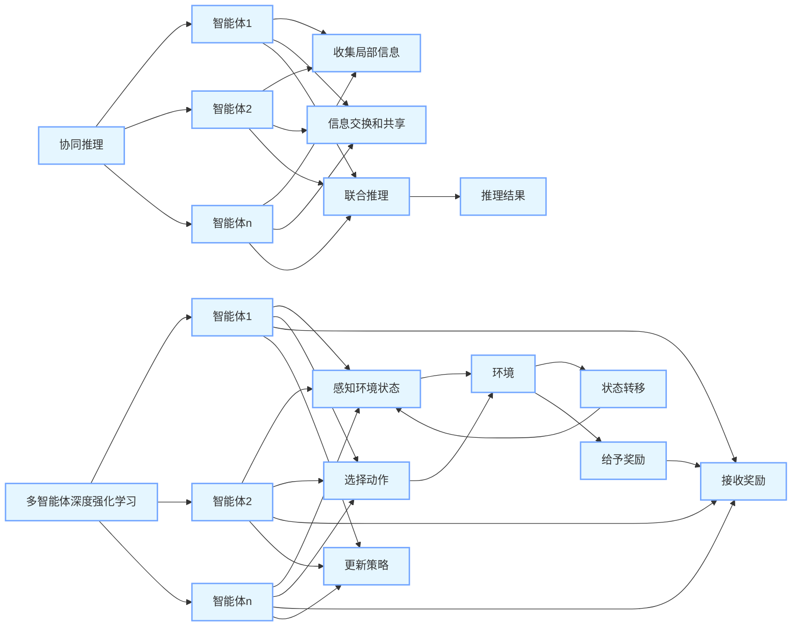

# 多智能体深度强化学习在协同推理中的应用

> 关键词：多智能体深度强化学习、协同推理、马尔可夫决策过程、策略网络、深度Q网络

> 摘要：本文聚焦于多智能体深度强化学习在协同推理中的应用。首先介绍了研究的背景、目的、预期读者以及文档结构等内容。接着详细阐述了多智能体深度强化学习和协同推理的核心概念与联系，并给出相应的文本示意图和Mermaid流程图。然后深入探讨了核心算法原理，用Python源代码进行详细说明，同时介绍了相关的数学模型和公式。通过项目实战，展示了代码的实际案例及详细解释。分析了该技术在不同场景下的实际应用，推荐了学习资源、开发工具框架和相关论文著作。最后总结了未来发展趋势与挑战，还提供了常见问题解答和扩展阅读参考资料，旨在为读者全面深入地理解多智能体深度强化学习在协同推理中的应用提供系统的知识体系。

## 1. 背景介绍 
### 1.1 目的和范围
多智能体深度强化学习在协同推理领域的应用是当前人工智能研究的前沿热点。本研究的目的在于深入探讨如何利用多智能体深度强化学习的方法来实现高效、准确的协同推理。范围涵盖了从核心概念的理解，到算法原理的剖析，再到实际项目的应用和未来发展趋势的展望。具体包括对多智能体深度强化学习和协同推理相关理论的研究，各种算法在不同场景下的性能分析，以及如何搭建开发环境和实现具体的代码案例等。

### 1.2 预期读者
本文预期读者包括人工智能、机器学习、计算机科学等相关领域的研究人员、工程师和学生。对于想要深入了解多智能体深度强化学习和协同推理技术的初学者，本文可以提供系统的基础知识和入门指导；对于有一定经验的专业人士，本文的算法分析、项目实战和应用案例等内容可以为他们的研究和开发工作提供新的思路和参考。

### 1.3 文档结构概述
本文共分为十个部分。第一部分为背景介绍，阐述了研究的目的、范围、预期读者和文档结构。第二部分介绍核心概念与联系，详细解释多智能体深度强化学习和协同推理的原理，并给出示意图和流程图。第三部分讲解核心算法原理和具体操作步骤，通过Python代码进行说明。第四部分介绍数学模型和公式，并举例说明。第五部分是项目实战，包括开发环境搭建、源代码实现和代码解读。第六部分分析实际应用场景。第七部分推荐学习资源、开发工具框架和相关论文著作。第八部分总结未来发展趋势与挑战。第九部分为附录，解答常见问题。第十部分提供扩展阅读和参考资料。

### 1.4 术语表
#### 1.4.1 核心术语定义
- **多智能体深度强化学习（Multi-Agent Deep Reinforcement Learning，MADRL）**：是一种结合了多智能体系统和深度强化学习的技术。多智能体系统由多个智能体组成，这些智能体可以相互交互和协作；深度强化学习则利用深度神经网络来近似值函数或策略函数，以解决复杂的决策问题。在MADRL中，多个智能体通过与环境进行交互，学习如何做出最优决策，以实现共同的目标或各自的目标。
- **协同推理（Collaborative Inference）**：指多个智能体或节点通过合作的方式进行推理任务。在协同推理中，智能体之间可以共享信息、知识和计算资源，以提高推理的准确性和效率。例如，在分布式传感器网络中，多个传感器节点可以协同工作，共同推断环境中的某些特征或事件。
- **马尔可夫决策过程（Markov Decision Process，MDP）**：是一个用于描述决策问题的数学模型。它由状态集合 $S$、动作集合 $A$、状态转移概率 $P(s'|s,a)$、奖励函数 $R(s,a)$ 和折扣因子 $\gamma$ 组成。在MDP中，智能体在每个时间步根据当前状态选择一个动作，环境根据状态转移概率转移到下一个状态，并给予智能体一个奖励。智能体的目标是学习一个策略，使得长期累积奖励最大化。
- **策略网络（Policy Network）**：在深度强化学习中，策略网络是一个深度神经网络，用于表示智能体的策略。策略网络以当前状态作为输入，输出每个动作的概率分布。智能体根据这个概率分布选择动作。策略网络的参数可以通过优化目标函数（如策略梯度）来学习。
- **深度Q网络（Deep Q-Network，DQN）**：是一种基于值函数的深度强化学习算法。DQN使用深度神经网络来近似Q值函数，Q值函数表示在某个状态下采取某个动作的预期累积奖励。DQN通过经验回放和目标网络等技术来提高学习的稳定性和效率。

#### 1.4.2 相关概念解释
- **智能体（Agent）**：是一个能够感知环境、做出决策并执行动作的实体。在多智能体系统中，智能体可以是软件程序、机器人、传感器等。智能体具有自主性和适应性，能够根据环境的变化调整自己的行为。
- **环境（Environment）**：是智能体所处的外部世界，智能体通过与环境进行交互来获取信息和执行动作。环境可以是物理环境（如现实世界），也可以是虚拟环境（如游戏、模拟系统）。
- **奖励（Reward）**：是环境给予智能体的反馈信号，用于表示智能体的动作对环境的影响。奖励通常是一个标量值，正奖励表示动作是有益的，负奖励表示动作是有害的。智能体的目标是通过学习策略来最大化长期累积奖励。
- **探索与利用（Exploration and Exploitation）**：是深度强化学习中的一个重要问题。探索是指智能体尝试新的动作，以发现更好的策略；利用是指智能体选择当前已知的最优动作。在学习过程中，智能体需要在探索和利用之间进行平衡，以避免陷入局部最优解。

#### 1.4.3 缩略词列表
- MADRL：Multi-Agent Deep Reinforcement Learning
- MDP：Markov Decision Process
- DQN：Deep Q-Network

## 2. 核心概念与联系 
### 多智能体深度强化学习原理
多智能体深度强化学习结合了多智能体系统和深度强化学习的优势。在多智能体系统中，多个智能体相互协作或竞争，共同完成任务。每个智能体都有自己的感知和决策能力，并且可以与其他智能体进行通信和交互。深度强化学习则利用深度神经网络来处理高维的状态和动作空间，通过学习最优策略来最大化累积奖励。

多智能体深度强化学习的基本流程如下：
1. 每个智能体感知当前环境状态 $s_t$。
2. 每个智能体根据自己的策略 $\pi_i$ 选择动作 $a_{i,t}$。
3. 所有智能体的动作组合 $a_t=(a_{1,t},a_{2,t},\cdots,a_{n,t})$ 作用于环境，环境根据状态转移概率 $P(s_{t+1}|s_t,a_t)$ 转移到下一个状态 $s_{t+1}$，并给予每个智能体一个奖励 $r_{i,t}$。
4. 智能体根据奖励和新的状态更新自己的策略 $\pi_i$。

### 协同推理原理
协同推理是指多个智能体通过合作的方式进行推理任务。在协同推理中，智能体可以共享信息、知识和计算资源，以提高推理的准确性和效率。例如，在分布式传感器网络中，多个传感器节点可以将自己采集的数据发送给其他节点，共同推断环境中的某些特征或事件。

协同推理的基本步骤如下：
1. 每个智能体收集自己的局部信息。
2. 智能体之间进行信息交换和共享。
3. 智能体根据共享的信息进行联合推理，得出最终的推理结果。

### 核心概念联系
多智能体深度强化学习可以为协同推理提供有效的决策机制。通过深度强化学习，智能体可以学习到最优的协作策略，以实现协同推理的目标。例如，在协同推理任务中，智能体可以根据环境状态和其他智能体的信息，选择最优的信息共享方式和推理策略，从而提高推理的准确性和效率。

另一方面，协同推理可以为多智能体深度强化学习提供更丰富的信息和更复杂的任务场景。在协同推理过程中，智能体之间的信息共享和合作可以帮助每个智能体更好地理解环境和其他智能体的行为，从而提高学习的效果。

### 文本示意图
```plaintext
多智能体深度强化学习
|-- 多个智能体
|   |-- 感知环境状态
|   |-- 选择动作
|   |-- 接收奖励
|   |-- 更新策略
|-- 环境
|   |-- 状态转移
|   |-- 给予奖励

协同推理
|-- 多个智能体
|   |-- 收集局部信息
|   |-- 信息交换和共享
|   |-- 联合推理
|-- 推理结果
```

### Mermaid流程图


## 3. 核心算法原理 & 具体操作步骤 
### 深度Q网络（DQN）算法原理
深度Q网络（DQN）是一种基于值函数的深度强化学习算法，它使用深度神经网络来近似Q值函数 $Q(s,a)$，表示在状态 $s$ 下采取动作 $a$ 的预期累积奖励。DQN的目标是学习一个最优的Q值函数 $Q^*(s,a)$，使得智能体能够根据 $Q^*(s,a)$ 选择最优动作。

DQN的核心思想是使用经验回放和目标网络来提高学习的稳定性和效率。经验回放是指将智能体的经验 $(s,a,r,s')$ 存储在一个经验回放缓冲区中，然后随机从缓冲区中采样一批经验进行学习。目标网络是指使用一个与主网络结构相同但参数不同的网络来计算目标Q值，以减少目标值的波动。

### DQN算法具体操作步骤
1. **初始化**：初始化主网络 $Q(s,a;\theta)$ 和目标网络 $Q(s,a;\theta^-)$，并将 $\theta^-$ 初始化为 $\theta$。初始化经验回放缓冲区 $D$。
2. **循环训练**：
    - 智能体在环境中执行动作，得到经验 $(s,a,r,s')$，并将其存储在经验回放缓冲区 $D$ 中。
    - 从经验回放缓冲区 $D$ 中随机采样一批经验 $(s_i,a_i,r_i,s_i')$。
    - 计算目标Q值 $y_i$：
      - 如果 $s_i'$ 是终止状态，则 $y_i = r_i$。
      - 否则，$y_i = r_i + \gamma \max_{a'} Q(s_i',a';\theta^-)$，其中 $\gamma$ 是折扣因子。
    - 计算损失函数 $L(\theta)$：
      - 损失函数通常使用均方误差（MSE），即 $L(\theta) = \frac{1}{N} \sum_{i=1}^{N} (y_i - Q(s_i,a_i;\theta))^2$，其中 $N$ 是采样的经验数量。
    - 使用梯度下降法更新主网络的参数 $\theta$：
      - $\theta \leftarrow \theta - \alpha \nabla_{\theta} L(\theta)$，其中 $\alpha$ 是学习率。
    - 定期更新目标网络的参数 $\theta^-$：
      - $\theta^- \leftarrow \tau \theta + (1 - \tau) \theta^-$，其中 $\tau$ 是软更新系数。

### Python源代码实现
```python
import torch
import torch.nn as nn
import torch.optim as optim
import numpy as np
import random

# 定义Q网络
class QNetwork(nn.Module):
    def __init__(self, state_size, action_size):
        super(QNetwork, self).__init__()
        self.fc1 = nn.Linear(state_size, 64)
        self.fc2 = nn.Linear(64, 64)
        self.fc3 = nn.Linear(64, action_size)

    def forward(self, x):
        x = torch.relu(self.fc1(x))
        x = torch.relu(self.fc2(x))
        return self.fc3(x)

# 定义DQN代理
class DQNAgent:
    def __init__(self, state_size, action_size, learning_rate=0.001, gamma=0.99, epsilon=1.0, epsilon_decay=0.995, epsilon_min=0.01, batch_size=64, memory_size=10000):
        self.state_size = state_size
        self.action_size = action_size
        self.learning_rate = learning_rate
        self.gamma = gamma
        self.epsilon = epsilon
        self.epsilon_decay = epsilon_decay
        self.epsilon_min = epsilon_min
        self.batch_size = batch_size
        self.memory = []
        self.memory_size = memory_size

        # 初始化主网络和目标网络
        self.main_network = QNetwork(state_size, action_size)
        self.target_network = QNetwork(state_size, action_size)
        self.target_network.load_state_dict(self.main_network.state_dict())
        self.optimizer = optim.Adam(self.main_network.parameters(), lr=learning_rate)

    def remember(self, state, action, reward, next_state, done):
        if len(self.memory) > self.memory_size:
            self.memory.pop(0)
        self.memory.append((state, action, reward, next_state, done))

    def act(self, state):
        if np.random.rand() <= self.epsilon:
            return random.randrange(self.action_size)
        state = torch.FloatTensor(state).unsqueeze(0)
        q_values = self.main_network(state)
        action = torch.argmax(q_values).item()
        return action

    def replay(self):
        if len(self.memory) < self.batch_size:
            return
        minibatch = random.sample(self.memory, self.batch_size)
        states, actions, rewards, next_states, dones = zip(*minibatch)

        states = torch.FloatTensor(states)
        actions = torch.LongTensor(actions)
        rewards = torch.FloatTensor(rewards)
        next_states = torch.FloatTensor(next_states)
        dones = torch.FloatTensor(dones)

        q_values = self.main_network(states).gather(1, actions.unsqueeze(1)).squeeze(1)
        next_q_values = self.target_network(next_states).max(1)[0]
        target_q_values = rewards + (1 - dones) * self.gamma * next_q_values

        loss = nn.MSELoss()(q_values, target_q_values)
        self.optimizer.zero_grad()
        loss.backward()
        self.optimizer.step()

        if self.epsilon > self.epsilon_min:
            self.epsilon *= self.epsilon_decay

    def update_target_network(self):
        self.target_network.load_state_dict(self.main_network.state_dict())
```

### 多智能体深度强化学习中的DQN扩展
在多智能体深度强化学习中，可以为每个智能体单独使用一个DQN代理。每个智能体根据自己的观察和奖励进行学习，同时可以通过通信机制与其他智能体进行信息交换。以下是一个简单的多智能体DQN示例：
```python
# 多智能体DQN示例
num_agents = 2
state_size = 10
action_size = 4

agents = [DQNAgent(state_size, action_size) for _ in range(num_agents)]

# 模拟训练过程
for episode in range(100):
    states = [np.random.rand(state_size) for _ in range(num_agents)]
    done = False
    while not done:
        actions = [agent.act(state) for agent, state in zip(agents, states)]
        # 模拟环境交互，得到下一个状态和奖励
        next_states = [np.random.rand(state_size) for _ in range(num_agents)]
        rewards = [np.random.rand() for _ in range(num_agents)]
        dones = [False for _ in range(num_agents)]

        for agent, state, action, reward, next_state, done in zip(agents, states, actions, rewards, next_states, dones):
            agent.remember(state, action, reward, next_state, done)
            agent.replay()

        states = next_states

    # 更新目标网络
    for agent in agents:
        agent.update_target_network()
```

## 4. 数学模型和公式 & 详细讲解 & 举例说明 
### 马尔可夫决策过程（MDP）
马尔可夫决策过程（MDP）是一个用于描述决策问题的数学模型，它由以下几个要素组成：
- **状态集合 $S$**：表示环境的所有可能状态。
- **动作集合 $A$**：表示智能体可以采取的所有可能动作。
- **状态转移概率 $P(s'|s,a)$**：表示在状态 $s$ 下采取动作 $a$ 后，环境转移到状态 $s'$ 的概率。
- **奖励函数 $R(s,a)$**：表示在状态 $s$ 下采取动作 $a$ 后，智能体获得的即时奖励。
- **折扣因子 $\gamma$**：用于权衡即时奖励和未来奖励的重要性，取值范围为 $[0,1]$。

MDP的目标是找到一个最优策略 $\pi^*$，使得智能体在长期内获得的累积奖励最大化。累积奖励可以表示为：
$$
G_t = \sum_{k=0}^{\infty} \gamma^k R(S_{t+k}, A_{t+k})
$$
其中，$S_t$ 表示时间步 $t$ 的状态，$A_t$ 表示时间步 $t$ 的动作。

### 值函数和Q值函数
值函数 $V^{\pi}(s)$ 表示在策略 $\pi$ 下，从状态 $s$ 开始的预期累积奖励：
$$
V^{\pi}(s) = \mathbb{E}_{\pi} \left[ G_t | S_t = s \right]
$$
Q值函数 $Q^{\pi}(s,a)$ 表示在策略 $\pi$ 下，从状态 $s$ 采取动作 $a$ 开始的预期累积奖励：
$$
Q^{\pi}(s,a) = \mathbb{E}_{\pi} \left[ G_t | S_t = s, A_t = a \right]
$$

值函数和Q值函数之间的关系为：
$$
V^{\pi}(s) = \sum_{a \in A} \pi(a|s) Q^{\pi}(s,a)
$$

### 贝尔曼方程
贝尔曼方程是MDP中的一个重要方程，它描述了值函数和Q值函数的递归关系。对于值函数，贝尔曼方程可以表示为：
$$
V^{\pi}(s) = \sum_{a \in A} \pi(a|s) \left[ R(s,a) + \gamma \sum_{s' \in S} P(s'|s,a) V^{\pi}(s') \right]
$$
对于Q值函数，贝尔曼方程可以表示为：
$$
Q^{\pi}(s,a) = R(s,a) + \gamma \sum_{s' \in S} P(s'|s,a) \sum_{a' \in A} \pi(a'|s') Q^{\pi}(s',a')
$$

最优值函数 $V^*(s)$ 和最优Q值函数 $Q^*(s,a)$ 满足贝尔曼最优方程：
$$
V^*(s) = \max_{a \in A} \left[ R(s,a) + \gamma \sum_{s' \in S} P(s'|s,a) V^*(s') \right]
$$
$$
Q^*(s,a) = R(s,a) + \gamma \sum_{s' \in S} P(s'|s,a) \max_{a' \in A} Q^*(s',a')
$$

### 举例说明
考虑一个简单的网格世界问题，智能体在一个 $3 \times 3$ 的网格中移动，目标是到达右下角的网格。智能体可以采取四个动作：上、下、左、右。每个状态 $s$ 表示智能体在网格中的位置，动作集合 $A = \{ \text{up}, \text{down}, \text{left}, \text{right} \}$。

状态转移概率 $P(s'|s,a)$ 表示在状态 $s$ 下采取动作 $a$ 后，智能体转移到状态 $s'$ 的概率。例如，如果智能体在状态 $(1,1)$ 采取动作 $\text{right}$，则转移到状态 $(1,2)$ 的概率为 1。

奖励函数 $R(s,a)$ 表示在状态 $s$ 下采取动作 $a$ 后，智能体获得的即时奖励。如果智能体到达右下角的网格，则获得奖励 10，否则获得奖励 -1。

假设折扣因子 $\gamma = 0.9$，我们可以使用贝尔曼方程来计算最优值函数和最优Q值函数。

首先，初始化值函数 $V(s)$ 为 0。然后，迭代更新值函数，直到收敛：
```python
import numpy as np

# 网格世界大小
grid_size = 3

# 初始化值函数
V = np.zeros((grid_size, grid_size))

# 折扣因子
gamma = 0.9

# 迭代更新值函数
for _ in range(100):
    new_V = np.copy(V)
    for i in range(grid_size):
        for j in range(grid_size):
            if (i, j) == (grid_size - 1, grid_size - 1):
                continue
            values = []
            # 上
            if i > 0:
                values.append(-1 + gamma * V[i - 1, j])
            # 下
            if i < grid_size - 1:
                values.append(-1 + gamma * V[i + 1, j])
            # 左
            if j > 0:
                values.append(-1 + gamma * V[i, j - 1])
            # 右
            if j < grid_size - 1:
                values.append(-1 + gamma * V[i, j + 1])
            new_V[i, j] = np.max(values)
    V = new_V

print("最优值函数:")
print(V)
```

通过上述代码，我们可以计算出网格世界中每个状态的最优值函数。类似地，我们也可以计算最优Q值函数。

## 5. 项目实战：代码实际案例和详细解释说明 
### 5.1  开发环境搭建
#### 操作系统
本项目可以在多种操作系统上运行，如Windows、Linux和macOS。建议使用Linux系统，因为它对机器学习和深度学习的支持更好。

#### Python环境
本项目使用Python 3.7及以上版本。可以使用Anaconda来管理Python环境，以下是搭建步骤：
1. 下载并安装Anaconda：根据自己的操作系统选择合适的Anaconda版本，从[Anaconda官网](https://www.anaconda.com/products/individual)下载安装包，然后按照安装向导进行安装。
2. 创建虚拟环境：打开终端或命令提示符，执行以下命令创建一个新的虚拟环境：
```bash
conda create -n multi_agent_rl python=3.8
```
3. 激活虚拟环境：
```bash
conda activate multi_agent_rl
```

#### 安装依赖库
在激活的虚拟环境中，安装项目所需的依赖库，包括`torch`、`numpy`、`matplotlib`等。可以使用以下命令进行安装：
```bash
pip install torch numpy matplotlib
```

### 5.2  源代码详细实现和代码解读
#### 项目背景
本项目模拟一个多智能体协同推理的场景，多个智能体在一个二维网格世界中合作完成探索任务。每个智能体可以感知自己周围的环境，并与其他智能体进行通信。智能体的目标是尽可能快地探索整个网格世界。

#### 代码实现
```python
import torch
import torch.nn as nn
import torch.optim as optim
import numpy as np
import random
import matplotlib.pyplot as plt

# 定义Q网络
class QNetwork(nn.Module):
    def __init__(self, state_size, action_size):
        super(QNetwork, self).__init__()
        self.fc1 = nn.Linear(state_size, 64)
        self.fc2 = nn.Linear(64, 64)
        self.fc3 = nn.Linear(64, action_size)

    def forward(self, x):
        x = torch.relu(self.fc1(x))
        x = torch.relu(self.fc2(x))
        return self.fc3(x)

# 定义DQN代理
class DQNAgent:
    def __init__(self, state_size, action_size, learning_rate=0.001, gamma=0.99, epsilon=1.0, epsilon_decay=0.995, epsilon_min=0.01, batch_size=64, memory_size=10000):
        self.state_size = state_size
        self.action_size = action_size
        self.learning_rate = learning_rate
        self.gamma = gamma
        self.epsilon = epsilon
        self.epsilon_decay = epsilon_decay
        self.epsilon_min = epsilon_min
        self.batch_size = batch_size
        self.memory = []
        self.memory_size = memory_size

        # 初始化主网络和目标网络
        self.main_network = QNetwork(state_size, action_size)
        self.target_network = QNetwork(state_size, action_size)
        self.target_network.load_state_dict(self.main_network.state_dict())
        self.optimizer = optim.Adam(self.main_network.parameters(), lr=learning_rate)

    def remember(self, state, action, reward, next_state, done):
        if len(self.memory) > self.memory_size:
            self.memory.pop(0)
        self.memory.append((state, action, reward, next_state, done))

    def act(self, state):
        if np.random.rand() <= self.epsilon:
            return random.randrange(self.action_size)
        state = torch.FloatTensor(state).unsqueeze(0)
        q_values = self.main_network(state)
        action = torch.argmax(q_values).item()
        return action

    def replay(self):
        if len(self.memory) < self.batch_size:
            return
        minibatch = random.sample(self.memory, self.batch_size)
        states, actions, rewards, next_states, dones = zip(*minibatch)

        states = torch.FloatTensor(states)
        actions = torch.LongTensor(actions)
        rewards = torch.FloatTensor(rewards)
        next_states = torch.FloatTensor(next_states)
        dones = torch.FloatTensor(dones)

        q_values = self.main_network(states).gather(1, actions.unsqueeze(1)).squeeze(1)
        next_q_values = self.target_network(next_states).max(1)[0]
        target_q_values = rewards + (1 - dones) * self.gamma * next_q_values

        loss = nn.MSELoss()(q_values, target_q_values)
        self.optimizer.zero_grad()
        loss.backward()
        self.optimizer.step()

        if self.epsilon > self.epsilon_min:
            self.epsilon *= self.epsilon_decay

    def update_target_network(self):
        self.target_network.load_state_dict(self.main_network.state_dict())

# 定义网格世界环境
class GridWorldEnv:
    def __init__(self, grid_size=5, num_agents=2):
        self.grid_size = grid_size
        self.num_agents = num_agents
        self.agents_positions = [np.random.randint(0, grid_size, 2) for _ in range(num_agents)]
        self.visited_cells = set()
        for pos in self.agents_positions:
            self.visited_cells.add(tuple(pos))
        self.done = False

    def reset(self):
        self.agents_positions = [np.random.randint(0, grid_size, 2) for _ in range(num_agents)]
        self.visited_cells = set()
        for pos in self.agents_positions:
            self.visited_cells.add(tuple(pos))
        self.done = False
        states = []
        for pos in self.agents_positions:
            state = np.zeros((grid_size, grid_size))
            state[pos[0], pos[1]] = 1
            states.append(state.flatten())
        return states

    def step(self, actions):
        rewards = []
        for i in range(self.num_agents):
            action = actions[i]
            pos = self.agents_positions[i]
            if action == 0:  # 上
                if pos[0] > 0:
                    pos[0] -= 1
            elif action == 1:  # 下
                if pos[0] < self.grid_size - 1:
                    pos[0] += 1
            elif action == 2:  # 左
                if pos[1] > 0:
                    pos[1] -= 1
            elif action == 3:  # 右
                if pos[1] < self.grid_size - 1:
                    pos[1] += 1

            new_pos = tuple(pos)
            if new_pos not in self.visited_cells:
                reward = 1
                self.visited_cells.add(new_pos)
            else:
                reward = -0.1
            rewards.append(reward)

        if len(self.visited_cells) == self.grid_size * self.grid_size:
            self.done = True

        next_states = []
        for pos in self.agents_positions:
            state = np.zeros((grid_size, grid_size))
            state[pos[0], pos[1]] = 1
            next_states.append(state.flatten())

        return next_states, rewards, self.done

# 主训练循环
grid_size = 5
num_agents = 2
state_size = grid_size * grid_size
action_size = 4

agents = [DQNAgent(state_size, action_size) for _ in range(num_agents)]
env = GridWorldEnv(grid_size, num_agents)

num_episodes = 1000
total_rewards = []

for episode in range(num_episodes):
    states = env.reset()
    episode_rewards = [0] * num_agents
    done = False
    while not done:
        actions = [agent.act(state) for agent, state in zip(agents, states)]
        next_states, rewards, done = env.step(actions)
        for agent, state, action, reward, next_state in zip(agents, states, actions, rewards, next_states):
            agent.remember(state, action, reward, next_state, done)
            agent.replay()
        states = next_states
        for i in range(num_agents):
            episode_rewards[i] += rewards[i]

    for agent in agents:
        agent.update_target_network()

    total_rewards.append(np.sum(episode_rewards))
    if episode % 10 == 0:
        print(f"Episode {episode}: Total Reward = {np.sum(episode_rewards)}")

# 绘制奖励曲线
plt.plot(total_rewards)
plt.xlabel('Episode')
plt.ylabel('Total Reward')
plt.title('Training Rewards')
plt.show()
```

#### 代码解读
1. **Q网络（QNetwork）**：定义了一个简单的三层全连接神经网络，用于近似Q值函数。输入是状态，输出是每个动作的Q值。
2. **DQN代理（DQNAgent）**：实现了DQN算法的核心逻辑，包括经验回放、动作选择、网络更新等。
3. **网格世界环境（GridWorldEnv）**：模拟了一个二维网格世界，智能体可以在网格中移动。环境提供了重置和步进函数，用于初始化环境和执行动作。
4. **主训练循环**：在每个回合中，智能体与环境进行交互，收集经验并更新网络。同时，记录每个回合的总奖励，并绘制奖励曲线。

### 5.3  代码解读与分析
#### 状态表示
在本项目中，每个智能体的状态表示为一个一维向量，长度为 $grid\_size \times grid\_size$。向量中只有一个元素为 1，表示智能体当前所在的位置，其余元素为 0。这种状态表示方式简单直观，便于神经网络处理。

#### 动作选择
每个智能体使用 $\epsilon$-贪心策略选择动作。在训练初期，$\epsilon$ 值较大，智能体更多地进行探索；随着训练的进行，$\epsilon$ 值逐渐减小，智能体更多地进行利用。

#### 奖励设计
奖励设计是强化学习中的关键环节，它直接影响智能体的学习效果。在本项目中，如果智能体到达一个未访问过的单元格，则获得奖励 1；如果到达一个已访问过的单元格，则获得奖励 -0.1。这种奖励设计鼓励智能体探索新的区域，提高探索效率。

#### 学习效果分析
通过绘制奖励曲线，我们可以观察智能体的学习效果。如果奖励曲线逐渐上升，说明智能体在不断学习，能够更好地完成任务；如果奖励曲线波动较大或停滞不前，可能需要调整超参数或改进算法。

## 6. 实际应用场景 
### 智能交通系统
在智能交通系统中，多智能体深度强化学习可以用于协同推理交通流量控制。多个交通信号灯可以作为智能体，通过与周围的交通环境进行交互，学习如何调整信号灯的时间间隔，以优化交通流量。例如，在高峰时段，信号灯可以根据实时交通流量调整绿灯时间，减少车辆等待时间，提高道路通行效率。

### 无人机编队
无人机编队任务中，多架无人机需要协同飞行，完成特定的任务，如侦察、测绘等。每架无人机可以作为一个智能体，通过与其他无人机进行通信和协作，学习如何调整自己的飞行姿态和速度，以保持编队的稳定性和高效性。例如，在侦察任务中，无人机可以根据目标的位置和其他无人机的信息，选择最优的侦察路径。

### 分布式传感器网络
分布式传感器网络由多个传感器节点组成，这些节点可以分布在不同的地理位置，用于监测环境参数，如温度、湿度、空气质量等。多智能体深度强化学习可以用于协同推理传感器数据，提高监测的准确性和效率。例如，传感器节点可以根据自己的监测数据和其他节点的信息，共同推断环境的整体状态，及时发现异常情况。

### 金融市场交易
在金融市场交易中，多个交易员或交易算法可以作为智能体，通过与市场环境进行交互，学习如何做出最优的交易决策。每个智能体可以根据自己的观察和分析，以及其他智能体的交易行为，推断市场的走势，选择合适的交易时机和交易策略。例如，在股票交易中，交易员可以根据其他交易员的买卖情况和市场消息，决定是否买入或卖出股票。

### 工业自动化
在工业自动化领域，多台机器人或自动化设备可以作为智能体，协同完成生产任务。例如，在汽车制造工厂中，机器人可以根据生产线上的物料供应情况和其他机器人的工作进度，调整自己的工作节奏和任务分配，提高生产效率和质量。

## 7. 工具和资源推荐
### 7.1 学习资源推荐
#### 7.1.1 书籍推荐
- 《Reinforcement Learning: An Introduction》：由Richard S. Sutton和Andrew G. Barto所著，是强化学习领域的经典教材，全面介绍了强化学习的基本概念、算法和应用。
- 《Deep Reinforcement Learning Hands-On》：由Max Lapan所著，通过实际案例和代码实现，详细介绍了深度强化学习的各种算法和应用。
- 《Multi-Agent Systems: Algorithmic, Game-Theoretic, and Logical Foundations》：由Yoav Shoham和Kevin Leyton-Brown所著，深入探讨了多智能体系统的理论和算法，包括博弈论、逻辑推理等方面的内容。

#### 7.1.2 在线课程
- Coursera上的“Reinforcement Learning Specialization”：由University of Alberta提供，包括四门课程，全面介绍了强化学习的理论和实践。
- edX上的“Introduction to Artificial Intelligence”：由UC Berkeley提供，涵盖了人工智能的多个领域，包括强化学习和多智能体系统。
- OpenAI Gym官方文档和教程：OpenAI Gym是一个用于开发和比较强化学习算法的工具包，其官方文档和教程提供了丰富的示例和代码实现。

#### 7.1.3 技术博客和网站
- Towards Data Science：是一个专注于数据科学和机器学习的技术博客平台，上面有很多关于深度强化学习和多智能体系统的优秀文章。
- Medium上的“Reinforcement Learning”主题：汇集了大量关于强化学习的最新研究成果和实践经验。
- arXiv.org：是一个预印本数据库，提供了大量关于人工智能和机器学习的最新研究论文。

### 7.2 开发工具框架推荐
#### 7.2.1 IDE和编辑器
- PyCharm：是一款专门为Python开发设计的集成开发环境（IDE），提供了丰富的代码编辑、调试和项目管理功能。
- Jupyter Notebook：是一个交互式的开发环境，适合用于数据探索、模型实验和代码演示。
- Visual Studio Code：是一款轻量级的代码编辑器，支持多种编程语言和插件，具有丰富的扩展功能。

#### 7.2.2 调试和性能分析工具
- TensorBoard：是TensorFlow提供的一个可视化工具，可以用于监控模型的训练过程、可视化模型结构和分析性能指标。
- Py-Spy：是一个用于Python代码性能分析的工具，可以帮助开发者找出代码中的性能瓶颈。
- NVIDIA NSIGHT Systems：是NVIDIA提供的一个性能分析工具，适用于GPU加速的深度学习模型。

#### 7.2.3 相关框架和库
- PyTorch：是一个开源的深度学习框架，提供了丰富的神经网络层和优化算法，易于使用和扩展。
- TensorFlow：是Google开发的一个开源深度学习框架，具有广泛的应用和强大的社区支持。
- Stable Baselines3：是一个基于PyTorch的深度强化学习库，提供了多种经典的强化学习算法的实现，方便开发者进行实验和应用。

### 7.3 相关论文著作推荐
#### 7.3.1 经典论文
- “Playing Atari with Deep Reinforcement Learning”：由Volodymyr Mnih等人发表，提出了深度Q网络（DQN）算法，开启了深度强化学习的新时代。
- “Asynchronous Methods for Deep Reinforcement Learning”：由Volodymyr Mnih等人发表，提出了异步优势演员-评论家（A3C）算法，提高了深度强化学习的训练效率。
- “Multi-Agent Actor-Critic for Mixed Cooperative-Competitive Environments”：由Ryan Lowe等人发表，提出了多智能体演员-评论家（MADDPG）算法，用于解决多智能体环境中的合作和竞争问题。

#### 7.3.2 最新研究成果
- 关注顶级学术会议，如NeurIPS（神经信息处理系统大会）、ICML（国际机器学习会议）、AAAI（美国人工智能协会会议）等，这些会议上会发表很多关于多智能体深度强化学习和协同推理的最新研究成果。
- 关注知名学术期刊，如Journal of Artificial Intelligence Research（JAIR）、Artificial Intelligence等，这些期刊上会发表一些高质量的研究论文。

#### 7.3.3 应用案例分析
- 可以参考一些实际应用案例的论文和报告，了解多智能体深度强化学习在不同领域的应用情况和效果。例如，在智能交通系统、无人机编队、工业自动化等领域的应用案例分析。

## 8. 总结：未来发展趋势与挑战
### 未来发展趋势
#### 更复杂的任务场景
未来，多智能体深度强化学习将应用于更复杂的任务场景，如大规模的城市交通管理、星际探索等。在这些场景中，智能体需要处理更多的信息和更复杂的交互关系，对算法的性能和效率提出了更高的要求。

#### 与其他技术的融合
多智能体深度强化学习将与其他技术，如计算机视觉、自然语言处理等进行更深入的融合。例如，在智能机器人领域，机器人可以通过计算机视觉感知环境，使用自然语言处理与人类进行交互，同时使用多智能体深度强化学习进行决策和控制。

#### 可解释性和安全性
随着多智能体深度强化学习在越来越多的关键领域的应用，可解释性和安全性将成为重要的研究方向。研究者需要开发出能够解释智能体决策过程的方法，同时确保智能体的行为符合安全和伦理要求。

#### 分布式和并行计算
为了提高训练效率和处理大规模问题，多智能体深度强化学习将更多地采用分布式和并行计算技术。例如，使用多个GPU或分布式计算集群进行模型训练。

### 挑战
#### 智能体间通信和协作
在多智能体系统中，智能体之间的通信和协作是一个关键问题。如何设计高效的通信协议和协作策略，以提高智能体之间的信息共享和合作效率，是一个亟待解决的问题。

#### 非平稳环境
在实际应用中，环境往往是非平稳的，即环境的状态和动态会随时间发生变化。多智能体深度强化学习算法需要具备适应非平稳环境的能力，能够及时调整策略以应对环境的变化。

#### 数据隐私和安全
在多智能体系统中，智能体之间可能需要共享数据，这涉及到数据隐私和安全问题。如何在保证数据隐私和安全的前提下，实现智能体之间的有效协作，是一个重要的挑战。

#### 计算资源需求
深度强化学习算法通常需要大量的计算资源进行训练，多智能体深度强化学习更是如此。如何降低算法的计算复杂度，提高计算效率，是一个需要解决的问题。

## 9. 附录：常见问题与解答
### 问题1：多智能体深度强化学习和单智能体深度强化学习有什么区别？
解答：多智能体深度强化学习涉及多个智能体的交互和协作，每个智能体的决策会受到其他智能体的影响。而单智能体深度强化学习只考虑单个智能体与环境的交互。在多智能体深度强化学习中，需要处理智能体之间的通信、合作和竞争等问题，算法的设计和训练更加复杂。

### 问题2：如何选择合适的奖励函数？
解答：选择合适的奖励函数是强化学习中的关键环节。奖励函数应该能够反映智能体的目标和任务要求。一般来说，奖励函数应该具有以下特点：
- **明确性**：奖励函数应该明确地表达智能体的目标，例如完成任务获得正奖励，失败获得负奖励。
- **及时性**：奖励应该及时反馈给智能体，让智能体能够及时调整策略。
- **稀疏性与密集性的平衡**：奖励函数不能过于稀疏，否则智能体可能难以学习到有效的策略；也不能过于密集，否则可能导致智能体陷入局部最优解。

### 问题3：多智能体深度强化学习算法的训练时间通常很长，如何提高训练效率？
解答：可以从以下几个方面提高多