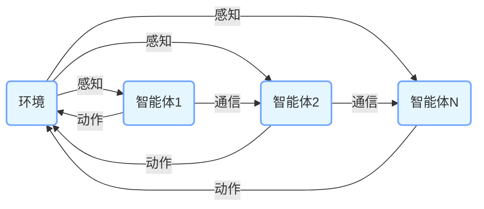

# 多智能体系统优化价值投资的资产配置

> 关键词：多智能体系统、价值投资、资产配置、优化算法、金融市场

> 摘要：本文聚焦于利用多智能体系统优化价值投资中的资产配置问题。首先介绍了相关背景知识，包括目的、预期读者、文档结构和术语表。接着阐述了多智能体系统和价值投资资产配置的核心概念及其联系，给出了相应的原理和架构示意图。详细讲解了核心算法原理，并通过Python代码进行说明，同时给出了相关数学模型和公式。通过项目实战展示了如何在实际中运用这些方法进行资产配置，分析了实际应用场景。推荐了学习资源、开发工具框架以及相关论文著作。最后总结了未来发展趋势与挑战，并提供了常见问题解答和扩展阅读参考资料，旨在为投资者和研究者提供全面且深入的技术指导。

## 1. 背景介绍 
### 1.1 目的和范围
在金融投资领域，价值投资强调通过分析资产的内在价值来选择投资标的，而合理的资产配置则是实现投资目标、降低风险的关键。多智能体系统是一种分布式人工智能技术，其中每个智能体都具有一定的自主性和智能性，能够通过与其他智能体和环境的交互来完成复杂任务。本文章的目的在于探讨如何运用多智能体系统来优化价值投资中的资产配置，以提高投资组合的收益和降低风险。范围涵盖了多智能体系统的原理、相关算法、数学模型，以及在实际金融市场中的应用案例等方面。

### 1.2 预期读者
本文预期读者包括金融投资者，他们希望借助先进的技术手段优化自己的投资组合；金融分析师，需要深入了解资产配置的新方法和技术；计算机科学领域的研究者和开发者，对将人工智能技术应用于金融领域感兴趣；以及相关专业的学生，希望学习多智能体系统和金融投资的交叉知识。

### 1.3 文档结构概述
本文首先介绍多智能体系统和价值投资资产配置的背景知识，包括术语定义和相关概念解释。然后详细阐述核心概念及其联系，给出原理和架构示意图。接着讲解核心算法原理，并使用Python代码进行具体实现。之后介绍相关的数学模型和公式，并举例说明。通过项目实战展示如何搭建开发环境、实现源代码并进行代码解读。分析实际应用场景，推荐学习资源、开发工具框架和相关论文著作。最后总结未来发展趋势与挑战，提供常见问题解答和扩展阅读参考资料。

### 1.4 术语表
#### 1.4.1 核心术语定义
- **多智能体系统（Multi - Agent System，MAS）**：由多个智能体组成的系统，每个智能体具有一定的自主性、社会性和反应性，能够通过与其他智能体和环境的交互来完成特定任务。
- **价值投资（Value Investing）**：一种投资策略，投资者通过分析资产的内在价值，寻找被低估的资产进行投资，期望在资产价格回归其内在价值时获得收益。
- **资产配置（Asset Allocation）**：指投资者将资金分配到不同类型的资产（如股票、债券、基金等）中，以实现投资目标并降低风险的过程。
- **智能体（Agent）**：具有感知环境、做出决策和执行动作能力的实体，可以是软件程序、机器人等。

#### 1.4.2 相关概念解释
- **分布式人工智能（Distributed Artificial Intelligence，DAI）**：多智能体系统是分布式人工智能的一个重要分支，强调多个智能体之间的协作和交互，以解决复杂的问题。
- **投资组合理论（Portfolio Theory）**：研究如何通过合理的资产配置来优化投资组合的收益和风险，其核心是在给定风险水平下最大化收益，或在给定收益水平下最小化风险。
- **市场有效性（Market Efficiency）**：指市场价格能够及时、准确地反映所有可用信息的程度。在有效市场中，资产价格很难被低估或高估。

#### 1.4.3 缩略词列表
- MAS：Multi - Agent System（多智能体系统）
- DAI：Distributed Artificial Intelligence（分布式人工智能）

## 2. 核心概念与联系 
### 2.1 多智能体系统原理
多智能体系统由多个智能体组成，每个智能体都有自己的目标、知识和能力。智能体之间可以通过消息传递进行通信和协作，共同完成复杂的任务。智能体的基本结构包括感知模块、决策模块和执行模块。感知模块用于感知环境信息，决策模块根据感知到的信息和自身的知识做出决策，执行模块则根据决策执行相应的动作。

以下是多智能体系统的架构示意图：


### 2.2 价值投资资产配置原理
价值投资资产配置的核心是通过分析资产的内在价值，选择被低估的资产，并将资金合理分配到这些资产中。投资者通常会考虑资产的基本面因素，如盈利能力、财务状况、行业前景等，来评估资产的内在价值。同时，为了降低风险，投资者会将资金分散投资到不同类型的资产中，以实现投资组合的多元化。

### 2.3 多智能体系统与价值投资资产配置的联系
多智能体系统可以为价值投资资产配置提供一种有效的解决方案。在多智能体系统中，每个智能体可以代表一个投资者、一种投资策略或一个资产类别。智能体之间可以通过协作和竞争来优化资产配置。例如，一些智能体可以负责分析资产的内在价值，另一些智能体可以负责执行交易策略，还有一些智能体可以负责监控市场风险。通过智能体之间的交互和协作，可以实现更高效、更智能的资产配置。

## 3. 核心算法原理 & 具体操作步骤 
### 3.1 核心算法原理
在多智能体系统优化价值投资资产配置中，常用的算法包括遗传算法、粒子群算法等。这里以遗传算法为例进行讲解。

遗传算法是一种模拟自然选择和遗传机制的优化算法。它通过模拟生物进化过程中的选择、交叉和变异操作，不断搜索最优解。在资产配置问题中，遗传算法的基本思想是将每个投资组合看作一个个体，每个个体由一组基因（即资产的权重）表示。通过不断迭代，选择适应度较高的个体进行交叉和变异，逐步找到最优的投资组合。

### 3.2 具体操作步骤
1. **初始化种群**：随机生成一组初始投资组合，每个投资组合由一组资产权重组成。
2. **计算适应度**：根据投资组合的收益和风险指标，计算每个个体的适应度。适应度越高，表示该投资组合越优。
3. **选择操作**：根据个体的适应度，选择一部分适应度较高的个体作为父代，用于产生下一代个体。
4. **交叉操作**：对选择出的父代个体进行交叉操作，生成新的个体。
5. **变异操作**：对新生成的个体进行变异操作，引入新的基因，增加种群的多样性。
6. **更新种群**：用新生成的个体替换原种群中的一部分个体，更新种群。
7. **判断终止条件**：如果满足终止条件（如达到最大迭代次数或适应度不再提高），则停止迭代，输出最优解；否则，返回步骤2继续迭代。

### 3.3 Python代码实现
```python
import numpy as np

# 初始化种群
def initialize_population(pop_size, num_assets):
    population = []
    for _ in range(pop_size):
        weights = np.random.rand(num_assets)
        weights = weights / np.sum(weights)  # 归一化
        population.append(weights)
    return np.array(population)

# 计算适应度
def calculate_fitness(population, returns, cov_matrix, risk_aversion):
    fitness = []
    for weights in population:
        portfolio_return = np.dot(weights, returns)
        portfolio_risk = np.dot(weights.T, np.dot(cov_matrix, weights))
        utility = portfolio_return - 0.5 * risk_aversion * portfolio_risk
        fitness.append(utility)
    return np.array(fitness)

# 选择操作
def selection(population, fitness):
    total_fitness = np.sum(fitness)
    probabilities = fitness / total_fitness
    selected_indices = np.random.choice(len(population), size=len(population), p=probabilities)
    return population[selected_indices]

# 交叉操作
def crossover(parent1, parent2):
    crossover_point = np.random.randint(1, len(parent1))
    child1 = np.concatenate((parent1[:crossover_point], parent2[crossover_point:]))
    child2 = np.concatenate((parent2[:crossover_point], parent1[crossover_point:]))
    child1 = child1 / np.sum(child1)  # 归一化
    child2 = child2 / np.sum(child2)  # 归一化
    return child1, child2

# 变异操作
def mutation(individual, mutation_rate):
    for i in range(len(individual)):
        if np.random.rand() < mutation_rate:
            individual[i] = np.random.rand()
    individual = individual / np.sum(individual)  # 归一化
    return individual

# 遗传算法主函数
def genetic_algorithm(pop_size, num_assets, returns, cov_matrix, risk_aversion, max_generations, mutation_rate):
    population = initialize_population(pop_size, num_assets)
    for _ in range(max_generations):
        fitness = calculate_fitness(population, returns, cov_matrix, risk_aversion)
        new_population = selection(population, fitness)
        next_generation = []
        for i in range(0, len(new_population), 2):
            parent1 = new_population[i]
            parent2 = new_population[i + 1]
            child1, child2 = crossover(parent1, parent2)
            child1 = mutation(child1, mutation_rate)
            child2 = mutation(child2, mutation_rate)
            next_generation.extend([child1, child2])
        population = np.array(next_generation)
    final_fitness = calculate_fitness(population, returns, cov_matrix, risk_aversion)
    best_index = np.argmax(final_fitness)
    best_weights = population[best_index]
    return best_weights

# 示例数据
num_assets = 3
pop_size = 50
returns = np.array([0.1, 0.15, 0.08])
cov_matrix = np.array([[0.1, 0.02, 0.01],
                       [0.02, 0.12, 0.03],
                       [0.01, 0.03, 0.09]])
risk_aversion = 1
max_generations = 100
mutation_rate = 0.1

best_weights = genetic_algorithm(pop_size, num_assets, returns, cov_matrix, risk_aversion, max_generations, mutation_rate)
print("最优资产权重:", best_weights)
```

## 4. 数学模型和公式 & 详细讲解 & 举例说明 
### 4.1 投资组合收益和风险的数学模型
设投资组合中包含 $n$ 种资产，第 $i$ 种资产的权重为 $w_i$，且 $\sum_{i = 1}^{n}w_i = 1$，第 $i$ 种资产的预期收益率为 $r_i$，资产之间的协方差矩阵为 $\Sigma$。则投资组合的预期收益率 $R_p$ 和风险 $\sigma_p^2$ 可以表示为：

$$R_p=\sum_{i = 1}^{n}w_ir_i$$

$$\sigma_p^2=\sum_{i = 1}^{n}\sum_{j = 1}^{n}w_iw_j\sigma_{ij}=\mathbf{w}^T\Sigma\mathbf{w}$$

其中，$\mathbf{w}=[w_1,w_2,\cdots,w_n]^T$ 是资产权重向量，$\sigma_{ij}$ 是第 $i$ 种资产和第 $j$ 种资产的协方差。

### 4.2 效用函数
在价值投资中，投资者通常会考虑风险和收益的平衡。一种常用的方法是使用效用函数来衡量投资组合的优劣。常见的效用函数形式为：

$$U = R_p-\frac{1}{2}A\sigma_p^2$$

其中，$U$ 是投资组合的效用，$A$ 是投资者的风险厌恶系数。风险厌恶系数越大，投资者越厌恶风险。

### 4.3 举例说明
假设投资组合包含两种资产，资产1的预期收益率为 $r_1 = 0.1$，资产2的预期收益率为 $r_2 = 0.15$，资产1和资产2的协方差 $\sigma_{12}=0.02$，资产1的方差 $\sigma_{11}=0.1$，资产2的方差 $\sigma_{22}=0.12$。投资者的风险厌恶系数 $A = 1$。

设资产1的权重为 $w_1$，则资产2的权重为 $w_2 = 1 - w_1$。投资组合的预期收益率为：

$$R_p=w_1r_1+(1 - w_1)r_2=0.1w_1+0.15(1 - w_1)=0.15 - 0.05w_1$$

投资组合的风险为：

$$\sigma_p^2=w_1^2\sigma_{11}+2w_1(1 - w_1)\sigma_{12}+(1 - w_1)^2\sigma_{22}$$

$$=0.1w_1^2+2w_1(1 - w_1)\times0.02+(1 - w_1)^2\times0.12$$

投资组合的效用为：

$$U = R_p-\frac{1}{2}A\sigma_p^2=(0.15 - 0.05w_1)-\frac{1}{2}\times1\times\sigma_p^2$$

通过求解效用函数的最大值，可以得到最优的资产权重。

## 5. 项目实战：代码实际案例和详细解释说明 
### 5.1  开发环境搭建
在进行多智能体系统优化价值投资资产配置的项目实战时，需要搭建相应的开发环境。以下是具体步骤：

#### 5.1.1 安装Python
Python是一种广泛使用的编程语言，在数据分析和人工智能领域有着丰富的库和工具。可以从Python官方网站（https://www.python.org/downloads/）下载并安装Python 3.x版本。

#### 5.1.2 安装必要的库
在项目中，需要使用一些Python库来进行数据处理、算法实现和可视化。可以使用以下命令安装这些库：
```sh
pip install numpy pandas matplotlib
```
- **numpy**：用于进行数值计算和数组操作。
- **pandas**：用于数据处理和分析。
- **matplotlib**：用于数据可视化。

### 5.2  源代码详细实现和代码解读
以下是一个完整的项目实战代码示例，用于使用多智能体系统（这里简化为遗传算法）优化价值投资的资产配置：

```python
import numpy as np
import pandas as pd
import matplotlib.pyplot as plt

# 初始化种群
def initialize_population(pop_size, num_assets):
    population = []
    for _ in range(pop_size):
        weights = np.random.rand(num_assets)
        weights = weights / np.sum(weights)  # 归一化
        population.append(weights)
    return np.array(population)

# 计算适应度
def calculate_fitness(population, returns, cov_matrix, risk_aversion):
    fitness = []
    for weights in population:
        portfolio_return = np.dot(weights, returns)
        portfolio_risk = np.dot(weights.T, np.dot(cov_matrix, weights))
        utility = portfolio_return - 0.5 * risk_aversion * portfolio_risk
        fitness.append(utility)
    return np.array(fitness)

# 选择操作
def selection(population, fitness):
    total_fitness = np.sum(fitness)
    probabilities = fitness / total_fitness
    selected_indices = np.random.choice(len(population), size=len(population), p=probabilities)
    return population[selected_indices]

# 交叉操作
def crossover(parent1, parent2):
    crossover_point = np.random.randint(1, len(parent1))
    child1 = np.concatenate((parent1[:crossover_point], parent2[crossover_point:]))
    child2 = np.concatenate((parent2[:crossover_point], parent1[crossover_point:]))
    child1 = child1 / np.sum(child1)  # 归一化
    child2 = child2 / np.sum(child2)  # 归一化
    return child1, child2

# 变异操作
def mutation(individual, mutation_rate):
    for i in range(len(individual)):
        if np.random.rand() < mutation_rate:
            individual[i] = np.random.rand()
    individual = individual / np.sum(individual)  # 归一化
    return individual

# 遗传算法主函数
def genetic_algorithm(pop_size, num_assets, returns, cov_matrix, risk_aversion, max_generations, mutation_rate):
    population = initialize_population(pop_size, num_assets)
    best_fitness_history = []
    for _ in range(max_generations):
        fitness = calculate_fitness(population, returns, cov_matrix, risk_aversion)
        best_fitness = np.max(fitness)
        best_fitness_history.append(best_fitness)
        new_population = selection(population, fitness)
        next_generation = []
        for i in range(0, len(new_population), 2):
            parent1 = new_population[i]
            parent2 = new_population[i + 1]
            child1, child2 = crossover(parent1, parent2)
            child1 = mutation(child1, mutation_rate)
            child2 = mutation(child2, mutation_rate)
            next_generation.extend([child1, child2])
        population = np.array(next_generation)
    final_fitness = calculate_fitness(population, returns, cov_matrix, risk_aversion)
    best_index = np.argmax(final_fitness)
    best_weights = population[best_index]
    plt.plot(best_fitness_history)
    plt.xlabel('Generation')
    plt.ylabel('Best Fitness')
    plt.title('Best Fitness History')
    plt.show()
    return best_weights

# 示例数据：读取历史数据
data = pd.read_csv('historical_returns.csv')
returns = data.pct_change().dropna()
mean_returns = returns.mean()
cov_matrix = returns.cov()

num_assets = len(mean_returns)
pop_size = 50
risk_aversion = 1
max_generations = 100
mutation_rate = 0.1

best_weights = genetic_algorithm(pop_size, num_assets, mean_returns, cov_matrix, risk_aversion, max_generations, mutation_rate)
print("最优资产权重:", best_weights)
```

### 5.3  代码解读与分析
#### 5.3.1 初始化种群
`initialize_population` 函数用于随机生成初始投资组合。每个投资组合由一组资产权重组成，权重之和为1。

#### 5.3.2 计算适应度
`calculate_fitness` 函数根据投资组合的收益和风险指标，计算每个个体的适应度。适应度越高，表示该投资组合越优。

#### 5.3.3 选择操作
`selection` 函数根据个体的适应度，选择一部分适应度较高的个体作为父代，用于产生下一代个体。

#### 5.3.4 交叉操作
`crossover` 函数对选择出的父代个体进行交叉操作，生成新的个体。

#### 5.3.5 变异操作
`mutation` 函数对新生成的个体进行变异操作，引入新的基因，增加种群的多样性。

#### 5.3.6 遗传算法主函数
`genetic_algorithm` 函数是遗传算法的主函数，它通过不断迭代，选择适应度较高的个体进行交叉和变异，逐步找到最优的投资组合。同时，该函数还绘制了每一代的最优适应度变化曲线，用于观察算法的收敛情况。

#### 5.3.7 数据处理
在示例代码中，使用 `pandas` 库读取历史数据，并计算资产的平均收益率和协方差矩阵。这些数据将作为遗传算法的输入。

## 6. 实际应用场景 
### 6.1 个人投资者
个人投资者可以使用多智能体系统优化资产配置，以实现自己的投资目标。例如，一个风险偏好较低的投资者可以通过多智能体系统选择一些低风险的资产，如债券、货币基金等，并合理分配资金，以降低投资风险。同时，投资者还可以根据市场情况和自己的风险承受能力，动态调整资产配置。

### 6.2 基金管理公司
基金管理公司可以利用多智能体系统优化基金的资产配置，提高基金的收益和竞争力。通过分析市场数据和资产的基本面信息，多智能体系统可以为基金经理提供最优的投资组合建议。此外，多智能体系统还可以实时监控市场风险，及时调整资产配置，以应对市场变化。

### 6.3 保险公司
保险公司需要进行大规模的资产配置，以确保其资产的安全性和收益性。多智能体系统可以帮助保险公司分析不同资产的风险和收益特征，优化资产配置方案。同时，多智能体系统还可以模拟不同市场情景下的资产组合表现，为保险公司的风险管理提供支持。

## 7. 工具和资源推荐
### 7.1 学习资源推荐
#### 7.1.1 书籍推荐
- 《人工智能：一种现代的方法》（Artificial Intelligence: A Modern Approach）：这本书是人工智能领域的经典教材，涵盖了多智能体系统的基本原理和算法。
- 《金融市场的机器学习》（Machine Learning for Asset Managers）：介绍了如何将机器学习技术应用于金融市场，包括资产配置、风险管理等方面。
- 《投资组合理论与资本市场》（Portfolio Theory and Capital Markets）：详细阐述了投资组合理论的基本原理和方法，是价值投资资产配置的重要参考书籍。

#### 7.1.2 在线课程
- Coursera上的“人工智能基础”（Fundamentals of Artificial Intelligence）课程：提供了多智能体系统的基础知识和算法实现。
- edX上的“金融科技：人工智能与机器学习”（Fintech: Artificial Intelligence and Machine Learning）课程：介绍了人工智能和机器学习在金融领域的应用，包括资产配置优化。

#### 7.1.3 技术博客和网站
- Medium上的人工智能和金融科技相关博客：可以了解到最新的研究成果和实践经验。
- arXiv.org：一个预印本服务器，提供了大量的学术论文，包括多智能体系统和金融投资领域的研究。

### 7.2 开发工具框架推荐
#### 7.2.1 IDE和编辑器
- PyCharm：一款功能强大的Python集成开发环境，提供了代码编辑、调试、版本控制等功能。
- Jupyter Notebook：一种交互式的开发环境，适合进行数据分析和算法实现。

#### 7.2.2 调试和性能分析工具
- pdb：Python自带的调试器，可以帮助开发者找出代码中的错误。
- cProfile：Python的性能分析工具，可以分析代码的运行时间和内存使用情况。

#### 7.2.3 相关框架和库
- Mesa：一个用于构建多智能体系统的Python框架，提供了丰富的工具和接口。
- scikit - learn：一个机器学习库，包含了多种机器学习算法和工具，可用于资产配置模型的训练和评估。

### 7.3 相关论文著作推荐
#### 7.3.1 经典论文
- “Multi - Agent Systems: A Modern Approach to Distributed Artificial Intelligence”：介绍了多智能体系统的基本概念和方法。
- “Portfolio Selection”：马科维茨的经典论文，提出了投资组合理论的基本框架。

#### 7.3.2 最新研究成果
- 关注顶级学术会议（如AAAI、IJCAI等）和期刊（如Journal of Artificial Intelligence Research、Journal of Financial Economics等）上的最新研究论文，了解多智能体系统和价值投资资产配置的前沿技术。

#### 7.3.3 应用案例分析
- 一些金融科技公司和研究机构会发布关于多智能体系统在资产配置中的应用案例，可以通过他们的官方网站或研究报告了解实际应用情况。

## 8. 总结：未来发展趋势与挑战
### 8.1 未来发展趋势
- **与深度学习的融合**：深度学习在处理复杂数据和模式识别方面具有强大的能力，将多智能体系统与深度学习相结合，可以提高资产配置的准确性和效率。例如，使用深度学习模型来预测资产价格，然后将预测结果作为多智能体系统的输入，进行资产配置决策。
- **实时动态优化**：随着金融市场的快速变化，需要多智能体系统能够实时动态地优化资产配置。未来的研究将更加关注如何提高多智能体系统的实时性和适应性，以应对市场的不确定性。
- **跨领域应用**：多智能体系统优化价值投资资产配置的方法可以应用到更多的领域，如供应链管理、能源管理等。通过将不同领域的知识和数据相结合，可以实现更复杂的决策和优化。

### 8.2 挑战
- **数据质量和隐私问题**：多智能体系统需要大量的金融数据来进行训练和决策，数据的质量和隐私问题是一个重要的挑战。不准确或不完整的数据可能会导致错误的决策，而数据隐私问题则需要遵守相关的法律法规。
- **模型复杂度和可解释性**：随着多智能体系统和深度学习模型的不断发展，模型的复杂度也越来越高。复杂的模型可能会导致过拟合问题，同时也增加了模型的可解释性难度。如何在保证模型准确性的同时，提高模型的可解释性是一个亟待解决的问题。
- **市场不确定性和黑天鹅事件**：金融市场具有高度的不确定性，黑天鹅事件（如金融危机、重大政策变化等）可能会对资产配置产生巨大的影响。多智能体系统需要具备应对市场不确定性和黑天鹅事件的能力，这对模型的鲁棒性和适应性提出了更高的要求。

## 9. 附录：常见问题与解答
### 9.1 多智能体系统优化资产配置一定能获得更高的收益吗？
不一定。多智能体系统优化资产配置是一种基于历史数据和模型的方法，它可以帮助投资者找到在给定风险水平下的最优投资组合。然而，金融市场是复杂多变的，未来的市场情况可能与历史数据不同，因此不能保证一定能获得更高的收益。多智能体系统只能提供一种决策参考，投资者还需要结合自己的判断和市场情况进行决策。

### 9.2 如何选择合适的风险厌恶系数？
风险厌恶系数反映了投资者对风险的承受能力和偏好。一般来说，风险偏好较低的投资者可以选择较大的风险厌恶系数，以降低投资组合的风险；而风险偏好较高的投资者可以选择较小的风险厌恶系数，以追求更高的收益。投资者可以根据自己的财务状况、投资目标和投资经验等因素来选择合适的风险厌恶系数。

### 9.3 多智能体系统的计算复杂度高吗？
多智能体系统的计算复杂度取决于系统的规模和算法的复杂度。在一些简单的情况下，多智能体系统的计算复杂度可能较低；但在处理大规模的资产配置问题时，计算复杂度可能会较高。为了降低计算复杂度，可以采用一些优化算法和并行计算技术。

## 10. 扩展阅读 & 参考资料
### 10.1 扩展阅读
- 《复杂系统与复杂网络》：了解复杂系统的基本概念和方法，有助于深入理解多智能体系统的工作原理。
- 《金融数学》：学习金融市场中的数学模型和方法，为资产配置提供理论支持。

### 10.2 参考资料
- 相关学术论文和研究报告，可从学术数据库（如IEEE Xplore、ACM Digital Library等）中获取。
- 金融数据提供商（如Bloomberg、Wind等）的官方网站，可获取金融市场的实时数据和历史数据。

作者：AI天才研究院/AI Genius Institute & 禅与计算机程序设计艺术 /Zen And The Art of Computer Programming