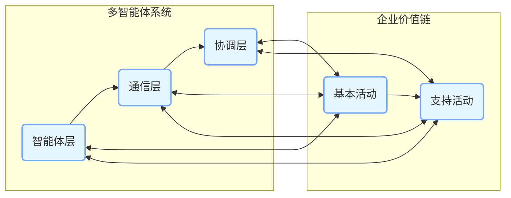

# 多智能体系统在企业价值链分析中的应用

> 关键词：多智能体系统、企业价值链分析、人工智能、协同决策、资源优化配置

> 摘要：本文深入探讨了多智能体系统在企业价值链分析中的应用。首先介绍了多智能体系统和企业价值链分析的背景知识，明确了研究目的和范围。接着阐述了多智能体系统和企业价值链的核心概念及两者之间的联系，并给出了相应的文本示意图和Mermaid流程图。详细讲解了多智能体系统用于企业价值链分析的核心算法原理及具体操作步骤，同时结合数学模型和公式进行说明。通过项目实战，展示了如何使用代码实现相关功能并进行详细解读。分析了多智能体系统在企业价值链分析中的实际应用场景，推荐了相关的学习资源、开发工具框架以及论文著作。最后总结了未来的发展趋势与挑战，并提供了常见问题的解答和扩展阅读参考资料，旨在为企业利用多智能体系统进行更高效的价值链分析提供全面的技术指导。

## 1. 背景介绍 
### 1.1 目的和范围
在当今竞争激烈的商业环境中，企业需要深入了解自身的价值链，以优化业务流程、降低成本、提高竞争力。多智能体系统作为一种分布式人工智能技术，具有自主性、交互性和协作性等特点，能够模拟企业中不同部门、角色之间的复杂交互和决策过程。本研究的目的是探讨多智能体系统在企业价值链分析中的应用，帮助企业更好地理解和优化其价值链。研究范围涵盖了多智能体系统的基本原理、企业价值链的构成要素、多智能体系统在价值链各环节的应用，以及如何通过多智能体系统实现企业资源的优化配置和协同决策。

### 1.2 预期读者
本文的预期读者包括企业管理人员、市场营销人员、供应链管理人员、信息系统管理人员等对企业价值链分析和多智能体系统感兴趣的专业人士，以及从事人工智能、管理科学、运筹学等领域研究的学者和学生。

### 1.3 文档结构概述
本文将按照以下结构进行组织：首先介绍多智能体系统和企业价值链分析的核心概念及两者之间的联系；接着详细阐述多智能体系统用于企业价值链分析的核心算法原理和具体操作步骤，并结合数学模型和公式进行说明；通过项目实战展示代码实现和详细解读；分析多智能体系统在企业价值链分析中的实际应用场景；推荐相关的学习资源、开发工具框架和论文著作；最后总结未来的发展趋势与挑战，提供常见问题的解答和扩展阅读参考资料。

### 1.4 术语表
#### 1.4.1 核心术语定义
- **多智能体系统（Multi - Agent System，MAS）**：由多个智能体组成的系统，每个智能体具有一定的自主性、感知能力、决策能力和行动能力，它们通过相互协作来完成共同的任务。
- **企业价值链（Enterprise Value Chain）**：企业为了创造价值而进行的一系列相互关联的活动，包括基本活动（如内部后勤、生产作业、外部后勤、市场营销和销售、服务）和支持活动（如采购、技术开发、人力资源管理、企业基础设施）。
- **智能体（Agent）**：具有自主性、反应性、主动性和社会性的实体，能够感知环境并根据自身的目标和知识采取行动。
- **协同决策（Collaborative Decision - Making）**：多个智能体通过信息共享和交互，共同制定决策的过程。
- **资源优化配置（Resource Optimal Allocation）**：在一定的约束条件下，将企业的资源分配到不同的活动或任务中，以实现企业价值的最大化。

#### 1.4.2 相关概念解释
- **分布式人工智能（Distributed Artificial Intelligence，DAI）**：研究如何将人工智能技术分布到多个处理单元上，以解决复杂的问题。多智能体系统是分布式人工智能的一个重要分支。
- **价值链分析（Value Chain Analysis）**：通过对企业价值链上的各项活动进行分析，识别企业的竞争优势和劣势，寻找降低成本、提高效率的机会。

#### 1.4.3 缩略词列表
- MAS：Multi - Agent System
- DAI：Distributed Artificial Intelligence

## 2. 核心概念与联系 
### 2.1 多智能体系统的核心概念
多智能体系统由多个智能体组成，每个智能体可以看作是一个独立的决策单元。智能体具有以下特点：
- **自主性**：智能体能够在没有外部干预的情况下，自主地感知环境、做出决策和采取行动。
- **反应性**：智能体能够对环境的变化做出及时的反应。
- **主动性**：智能体能够主动地追求自己的目标，而不仅仅是对环境的变化做出被动的反应。
- **社会性**：智能体能够与其他智能体进行交互和协作，以实现共同的目标。

多智能体系统的架构通常包括智能体层、通信层和协调层。智能体层包含多个智能体，每个智能体负责完成特定的任务；通信层负责智能体之间的信息传递；协调层负责协调智能体之间的行动，以避免冲突和实现协同。

### 2.2 企业价值链的核心概念
企业价值链是企业为了创造价值而进行的一系列相互关联的活动。迈克尔·波特将企业价值链分为基本活动和支持活动。基本活动直接与产品或服务的生产和销售相关，包括内部后勤、生产作业、外部后勤、市场营销和销售、服务。支持活动为基本活动提供支持和保障，包括采购、技术开发、人力资源管理、企业基础设施。

企业价值链分析的目的是识别企业的核心竞争力，找出价值创造的关键环节，以及优化价值链上的各项活动，以提高企业的经济效益和竞争力。

### 2.3 多智能体系统与企业价值链的联系
多智能体系统可以很好地模拟企业价值链上不同活动之间的交互和决策过程。在企业价值链中，每个活动可以看作是一个智能体，这些智能体之间通过信息共享和协作来完成企业的整体目标。例如，生产部门的智能体可以与采购部门的智能体进行沟通，以获取所需的原材料；市场营销部门的智能体可以与销售部门的智能体协作，制定营销策略。

通过多智能体系统，可以实现企业价值链上的协同决策和资源优化配置。智能体可以根据自身的目标和环境信息，自主地做出决策，并与其他智能体进行协商和合作，以实现企业价值的最大化。

### 2.4 文本示意图
```plaintext
多智能体系统
|-- 智能体层
|   |-- 智能体1
|   |-- 智能体2
|   |--...
|   |-- 智能体n
|-- 通信层
|   |-- 信息传递机制
|-- 协调层
|   |-- 冲突解决机制
|   |-- 协同策略

企业价值链
|-- 基本活动
|   |-- 内部后勤
|   |-- 生产作业
|   |-- 外部后勤
|   |-- 市场营销和销售
|   |-- 服务
|-- 支持活动
|   |-- 采购
|   |-- 技术开发
|   |-- 人力资源管理
|   |-- 企业基础设施

联系：
多智能体系统中的智能体对应企业价值链中的活动，通信层实现活动之间的信息共享，协调层实现活动之间的协同决策和资源优化配置。
```

### 2.5 Mermaid流程图


## 3. 核心算法原理 & 具体操作步骤 
### 3.1 核心算法原理
在多智能体系统用于企业价值链分析中，常用的算法包括博弈论算法、合同网协议算法和蚁群算法等。下面以合同网协议算法为例进行详细讲解。

合同网协议算法是一种用于多智能体系统中任务分配的算法，其基本思想是将任务发布者和任务执行者进行分离。任务发布者将任务以招标的形式发布出去，任务执行者根据自身的能力和资源对任务进行投标，任务发布者根据投标情况选择最合适的任务执行者。

### 3.2 Python源代码实现
```python
import random

# 定义智能体类
class Agent:
    def __init__(self, id, capacity):
        self.id = id
        self.capacity = capacity
        self.tasks = []

    def bid(self, task):
        # 简单的投标策略，根据自身剩余容量计算投标价格
        if self.capacity >= task:
            return random.randint(1, 10)
        else:
            return None

    def execute_task(self, task):
        if self.capacity >= task:
            self.capacity -= task
            self.tasks.append(task)
            return True
        else:
            return False

# 定义任务发布者类
class TaskPublisher:
    def __init__(self, tasks):
        self.tasks = tasks
        self.agents = []

    def add_agent(self, agent):
        self.agents.append(agent)

    def allocate_tasks(self):
        for task in self.tasks:
            bids = []
            for agent in self.agents:
                bid = agent.bid(task)
                if bid is not None:
                    bids.append((agent, bid))
            if bids:
                # 选择投标价格最低的智能体
                selected_agent = min(bids, key=lambda x: x[1])[0]
                if selected_agent.execute_task(task):
                    print(f"Task {task} is allocated to Agent {selected_agent.id}")
                else:
                    print(f"Failed to allocate Task {task}")
            else:
                print(f"No agent can handle Task {task}")


# 创建智能体
agent1 = Agent(1, 10)
agent2 = Agent(2, 8)

# 创建任务发布者
tasks = [3, 5, 6]
publisher = TaskPublisher(tasks)
publisher.add_agent(agent1)
publisher.add_agent(agent2)

# 分配任务
publisher.allocate_tasks()
```

### 3.3 具体操作步骤
1. **定义智能体和任务发布者类**：在Python代码中，定义了`Agent`类和`TaskPublisher`类。`Agent`类表示智能体，具有投标和执行任务的能力；`TaskPublisher`类表示任务发布者，负责发布任务和选择合适的智能体。
2. **创建智能体和任务**：实例化`Agent`类和`TaskPublisher`类，创建多个智能体和一系列任务。
3. **添加智能体到任务发布者**：将创建的智能体添加到任务发布者的智能体列表中。
4. **分配任务**：调用`TaskPublisher`类的`allocate_tasks`方法，任务发布者将任务依次发布出去，智能体进行投标，任务发布者选择最合适的智能体执行任务。

## 4. 数学模型和公式 & 详细讲解 & 举例说明 
### 4.1 合同网协议算法的数学模型
设 $T = \{t_1, t_2, \cdots, t_m\}$ 表示任务集合，$A = \{a_1, a_2, \cdots, a_n\}$ 表示智能体集合。对于每个任务 $t_i \in T$，其所需的资源为 $r(t_i)$。对于每个智能体 $a_j \in A$，其拥有的资源为 $R(a_j)$。

智能体 $a_j$ 对任务 $t_i$ 的投标价格为 $b_{ij}$，投标价格可以根据多种因素计算，例如智能体完成任务所需的成本、时间等。任务发布者选择投标价格最低且资源足够的智能体执行任务。

### 4.2 公式推导
设 $x_{ij}$ 为一个二进制变量，当智能体 $a_j$ 被选中执行任务 $t_i$ 时，$x_{ij} = 1$；否则，$x_{ij} = 0$。则任务分配问题可以表示为以下优化问题：

$$
\min \sum_{i = 1}^{m} \sum_{j = 1}^{n} b_{ij}x_{ij}
$$

约束条件：

1. 每个任务只能由一个智能体执行：
$$
\sum_{j = 1}^{n} x_{ij} = 1, \quad \forall i = 1, 2, \cdots, m
$$

2. 智能体的资源不能超过其拥有的资源：
$$
\sum_{i = 1}^{m} r(t_i)x_{ij} \leq R(a_j), \quad \forall j = 1, 2, \cdots, n
$$

3. $x_{ij} \in \{0, 1\}, \quad \forall i = 1, 2, \cdots, m; j = 1, 2, \cdots, n$

### 4.3 举例说明
假设有两个任务 $t_1$ 和 $t_2$，所需资源分别为 $r(t_1) = 3$ 和 $r(t_2) = 5$。有两个智能体 $a_1$ 和 $a_2$，拥有的资源分别为 $R(a_1) = 10$ 和 $R(a_2) = 8$。

智能体 $a_1$ 对任务 $t_1$ 的投标价格为 $b_{11} = 5$，对任务 $t_2$ 的投标价格为 $b_{21} = 7$；智能体 $a_2$ 对任务 $t_1$ 的投标价格为 $b_{12} = 3$，对任务 $t_2$ 的投标价格为 $b_{22} = 6$。

根据上述优化问题，我们可以列出以下方程组：

目标函数：
$$
\min (5x_{11} + 7x_{21} + 3x_{12} + 6x_{22})
$$

约束条件：
$$
x_{11} + x_{12} = 1
$$
$$
x_{21} + x_{22} = 1
$$
$$
3x_{11} + 5x_{21} \leq 10
$$
$$
3x_{12} + 5x_{22} \leq 8
$$
$$
x_{ij} \in \{0, 1\}, \quad i = 1, 2; j = 1, 2
$$

通过求解上述方程组，可以得到最优的任务分配方案。在这个例子中，最优方案是 $x_{12} = 1$，$x_{22} = 1$，即任务 $t_1$ 分配给智能体 $a_2$，任务 $t_2$ 也分配给智能体 $a_2$。

## 5. 项目实战：代码实际案例和详细解释说明 
### 5.1  开发环境搭建
#### 5.1.1 安装Python
首先需要安装Python，建议使用Python 3.7及以上版本。可以从Python官方网站（https://www.python.org/downloads/）下载适合自己操作系统的安装包，然后按照安装向导进行安装。

#### 5.1.2 安装开发工具
可以选择使用PyCharm、Visual Studio Code等开发工具。以PyCharm为例，从JetBrains官方网站（https://www.jetbrains.com/pycharm/download/）下载安装包，然后进行安装。

### 5.2  源代码详细实现和代码解读
```python
import random

# 定义智能体类
class Agent:
    def __init__(self, id, capacity):
        # 智能体的唯一标识
        self.id = id
        # 智能体的资源容量
        self.capacity = capacity
        # 智能体已执行的任务列表
        self.tasks = []

    def bid(self, task):
        # 简单的投标策略，根据自身剩余容量计算投标价格
        if self.capacity >= task:
            # 随机生成一个1到10之间的投标价格
            return random.randint(1, 10)
        else:
            return None

    def execute_task(self, task):
        # 检查智能体的资源是否足够执行任务
        if self.capacity >= task:
            # 执行任务，减少资源容量
            self.capacity -= task
            # 将任务添加到已执行任务列表中
            self.tasks.append(task)
            return True
        else:
            return False

# 定义任务发布者类
class TaskPublisher:
    def __init__(self, tasks):
        # 任务列表
        self.tasks = tasks
        # 智能体列表
        self.agents = []

    def add_agent(self, agent):
        # 将智能体添加到智能体列表中
        self.agents.append(agent)

    def allocate_tasks(self):
        # 遍历每个任务
        for task in self.tasks:
            bids = []
            # 遍历每个智能体
            for agent in self.agents:
                # 智能体进行投标
                bid = agent.bid(task)
                if bid is not None:
                    # 如果投标价格不为空，将智能体和投标价格添加到投标列表中
                    bids.append((agent, bid))
            if bids:
                # 选择投标价格最低的智能体
                selected_agent = min(bids, key=lambda x: x[1])[0]
                if selected_agent.execute_task(task):
                    print(f"Task {task} is allocated to Agent {selected_agent.id}")
                else:
                    print(f"Failed to allocate Task {task}")
            else:
                print(f"No agent can handle Task {task}")


# 创建智能体
agent1 = Agent(1, 10)
agent2 = Agent(2, 8)

# 创建任务发布者
tasks = [3, 5, 6]
publisher = TaskPublisher(tasks)
publisher.add_agent(agent1)
publisher.add_agent(agent2)

# 分配任务
publisher.allocate_tasks()
```

### 5.3  代码解读与分析
#### 5.3.1 智能体类（Agent）
- `__init__` 方法：初始化智能体的唯一标识、资源容量和已执行任务列表。
- `bid` 方法：根据智能体的剩余容量计算投标价格。如果剩余容量足够执行任务，则随机生成一个1到10之间的投标价格；否则，返回`None`。
- `execute_task` 方法：检查智能体的资源是否足够执行任务。如果足够，则执行任务，减少资源容量，并将任务添加到已执行任务列表中；否则，返回`False`。

#### 5.3.2 任务发布者类（TaskPublisher）
- `__init__` 方法：初始化任务列表和智能体列表。
- `add_agent` 方法：将智能体添加到智能体列表中。
- `allocate_tasks` 方法：遍历每个任务，让每个智能体进行投标。选择投标价格最低的智能体执行任务，并输出任务分配结果。

#### 5.3.3 主程序
创建两个智能体和一个任务发布者，将智能体添加到任务发布者的智能体列表中，然后调用任务发布者的`allocate_tasks`方法进行任务分配。

## 6. 实际应用场景 
### 6.1 供应链管理
在供应链管理中，多智能体系统可以用于优化供应链的各个环节。例如，供应商智能体可以根据库存情况和需求预测，主动与制造商智能体进行协商，确定原材料的供应数量和时间；制造商智能体可以根据订单情况和生产能力，合理安排生产计划，并与物流商智能体协作，确保产品按时交付。通过多智能体系统的协同决策和资源优化配置，可以提高供应链的效率和灵活性，降低成本。

### 6.2 市场营销和销售
在市场营销和销售领域，多智能体系统可以用于市场细分、客户关系管理和营销策略制定。市场调研智能体可以收集市场信息，分析市场趋势和客户需求；销售智能体可以根据客户信息和产品特点，为客户提供个性化的推荐和服务；营销策划智能体可以根据市场调研结果和销售数据，制定针对性的营销策略。通过多智能体系统的协作，可以提高市场营销和销售的效果，增强企业的市场竞争力。

### 6.3 生产管理
在生产管理中，多智能体系统可以用于生产调度、质量控制和设备维护。生产调度智能体可以根据订单需求、设备状态和人员安排，合理分配生产任务，优化生产流程；质量控制智能体可以实时监测生产过程中的质量指标，及时发现和解决质量问题；设备维护智能体可以根据设备的运行状态和维护记录，制定合理的维护计划，减少设备故障和停机时间。通过多智能体系统的应用，可以提高生产效率和产品质量，降低生产成本。

### 6.4 企业战略决策
在企业战略决策方面，多智能体系统可以用于模拟不同的战略方案，评估其对企业价值链的影响。战略规划智能体可以根据企业的内外部环境和目标，制定多种战略方案；财务分析智能体可以对每个战略方案进行财务评估，计算其成本、收益和风险；市场预测智能体可以预测每个战略方案在市场上的表现。通过多智能体系统的模拟和评估，企业可以做出更加科学合理的战略决策。

## 7. 工具和资源推荐
### 7.1 学习资源推荐
#### 7.1.1 书籍推荐
- 《多智能体系统：原理与编程》：本书全面介绍了多智能体系统的基本原理、设计方法和编程技术，适合初学者和有一定基础的读者阅读。
- 《企业价值链分析：理论与实践》：详细阐述了企业价值链分析的理论和方法，并通过大量的案例进行了说明，对企业管理人员和研究人员有很大的帮助。
- 《人工智能：一种现代的方法》：经典的人工智能教材，涵盖了多智能体系统等多个领域的知识，对深入理解人工智能技术有很大的帮助。

#### 7.1.2 在线课程
- Coursera上的“多智能体系统”课程：由知名高校的教授授课，内容涵盖多智能体系统的基本概念、算法和应用，通过在线视频、作业和讨论等方式进行教学。
- edX上的“企业价值链管理”课程：介绍了企业价值链管理的理论和实践，包括价值链分析、优化和创新等方面的内容，适合企业管理人员学习。

#### 7.1.3 技术博客和网站
- AI Stack Exchange：一个专门讨论人工智能技术的问答社区，用户可以在这里提出问题、分享经验和获取解决方案。
- Towards Data Science：一个专注于数据科学和人工智能领域的技术博客，提供了大量的技术文章和案例分析。

### 7.2 开发工具框架推荐
#### 7.2.1 IDE和编辑器
- PyCharm：功能强大的Python集成开发环境，提供了代码编辑、调试、版本控制等一系列功能，适合Python开发。
- Visual Studio Code：轻量级的代码编辑器，支持多种编程语言，具有丰富的插件生态系统，可以根据需要进行扩展。

#### 7.2.2 调试和性能分析工具
- Py-Spy：一个用于Python代码性能分析的工具，可以实时监测Python程序的CPU使用率、函数调用时间等信息，帮助开发者找出性能瓶颈。
- PDB：Python自带的调试器，可以在代码中设置断点，逐步执行代码，查看变量的值和程序的执行流程，方便调试代码。

#### 7.2.3 相关框架和库
- Mesa：一个用于构建基于代理的模型的Python框架，提供了丰富的代理行为和交互机制，适合开发多智能体系统。
- NetworkX：一个用于复杂网络分析和可视化的Python库，可以用于构建和分析多智能体系统中的通信网络。

### 7.3 相关论文著作推荐
#### 7.3.1 经典论文
- “Contract Net Protocol: High - Level Communication and Control in a Distributed Problem Solver”：介绍了合同网协议算法的基本原理和实现方法，是多智能体系统中任务分配的经典论文。
- “Value Chain Analysis: A Strategic Tool for Competitive Advantage”：阐述了企业价值链分析的理论和方法，为企业进行价值链分析提供了重要的理论基础。

#### 7.3.2 最新研究成果
- 可以关注《Artificial Intelligence》、《Journal of Artificial Intelligence Research》等人工智能领域的顶级期刊，以及《Management Science》、《Journal of Operations Management》等管理科学领域的期刊，了解多智能体系统在企业价值链分析中的最新研究成果。

#### 7.3.3 应用案例分析
- 可以查阅一些企业管理和信息技术领域的案例集，了解多智能体系统在不同行业和企业中的实际应用案例，学习其成功经验和解决问题的方法。

## 8. 总结：未来发展趋势与挑战
### 8.1 未来发展趋势
- **与其他技术的融合**：多智能体系统将与区块链、物联网、大数据等技术深度融合。例如，区块链技术可以为多智能体系统提供安全可靠的分布式账本，实现智能体之间的可信交互；物联网技术可以为多智能体系统提供丰富的感知数据，增强智能体对环境的感知能力；大数据技术可以为多智能体系统提供强大的数据分析和决策支持。
- **智能化和自适应能力的提升**：未来的多智能体系统将具有更高的智能化和自适应能力。智能体将能够通过学习和进化，不断优化自己的决策策略和行为模式，以适应不断变化的环境和任务需求。
- **应用领域的拓展**：多智能体系统在企业价值链分析中的应用将不断拓展到更多的领域和行业，如医疗、教育、能源等。例如，在医疗领域，多智能体系统可以用于医疗资源的优化配置、医疗流程的协同管理等。

### 8.2 挑战
- **通信和协调问题**：随着智能体数量的增加和系统复杂度的提高，智能体之间的通信和协调将变得更加困难。如何设计高效的通信协议和协调机制，确保智能体之间能够及时、准确地交换信息，避免冲突和死锁，是一个亟待解决的问题。
- **安全性和可靠性问题**：多智能体系统涉及到大量的敏感信息和重要决策，其安全性和可靠性至关重要。如何保障智能体之间的通信安全、防止信息泄露和恶意攻击，以及如何确保系统在面对各种故障和异常情况时能够正常运行，是需要解决的关键问题。
- **模型和算法的可扩展性问题**：现有的多智能体系统模型和算法在处理大规模问题时可能会遇到性能瓶颈。如何设计具有良好可扩展性的模型和算法，能够高效地处理大规模的智能体和复杂的任务，是未来研究的一个重要方向。

## 9. 附录：常见问题与解答
### 9.1 多智能体系统和传统的集中式系统有什么区别？
多智能体系统是一种分布式系统，由多个自主的智能体组成，每个智能体可以独立地感知环境、做出决策和采取行动。智能体之间通过通信和协作来完成共同的任务。而传统的集中式系统通常有一个中央控制单元，负责对整个系统进行管理和决策。多智能体系统具有更高的灵活性、适应性和容错性，但也面临着通信和协调等方面的挑战。

### 9.2 如何选择适合的智能体投标策略？
智能体的投标策略应根据具体的应用场景和任务需求来选择。常见的投标策略包括成本优先策略、时间优先策略、质量优先策略等。例如，在供应链管理中，如果企业更关注成本，可以选择成本优先策略，即智能体根据完成任务的成本进行投标；如果企业更关注交货时间，可以选择时间优先策略，即智能体根据完成任务的时间进行投标。

### 9.3 多智能体系统在企业价值链分析中的应用需要哪些技术基础？
多智能体系统在企业价值链分析中的应用需要掌握人工智能、分布式系统、博弈论、运筹学等方面的知识。同时，还需要具备一定的编程能力，熟悉Python等编程语言和相关的开发框架。

### 9.4 如何评估多智能体系统在企业价值链分析中的应用效果？
可以从多个方面评估多智能体系统在企业价值链分析中的应用效果，如成本降低、效率提高、质量提升、客户满意度增加等。可以通过对比应用多智能体系统前后的企业运营数据，以及收集用户反馈等方式来进行评估。

## 10. 扩展阅读 & 参考资料
### 10.1 扩展阅读
- 《复杂系统理论与多智能体系统》：深入探讨了复杂系统理论和多智能体系统的关系，以及多智能体系统在复杂系统中的应用。
- 《人工智能在企业管理中的应用》：介绍了人工智能技术在企业管理各个领域的应用案例和实践经验，对理解多智能体系统在企业价值链分析中的应用有一定的参考价值。

### 10.2 参考资料
- Wooldridge, M. (2009). An Introduction to Multi - Agent Systems. John Wiley & Sons.
- Porter, M. E. (1985). Competitive Advantage: Creating and Sustaining Superior Performance. Free Press.

作者：AI天才研究院/AI Genius Institute & 禅与计算机程序设计艺术 /Zen And The Art of Computer Programming