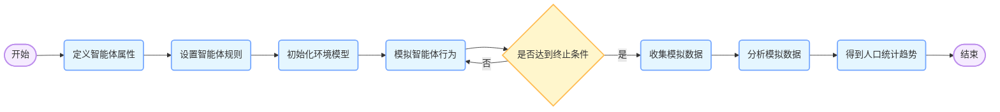

# 多智能体系统在全球人口统计趋势分析中的角色

> 关键词：多智能体系统、全球人口统计趋势、数据分析、智能决策、模拟预测

> 摘要：本文聚焦于多智能体系统在全球人口统计趋势分析中的角色。首先介绍了相关背景知识，包括研究目的、预期读者、文档结构和术语定义。接着阐述了多智能体系统和全球人口统计趋势的核心概念及联系，给出了相应的文本示意图和Mermaid流程图。详细讲解了多智能体系统用于人口统计分析的核心算法原理，结合Python代码进行说明。同时给出了相关的数学模型和公式，并举例说明。通过项目实战，展示了代码实现和解读。探讨了多智能体系统在人口统计分析中的实际应用场景，推荐了学习资源、开发工具框架和相关论文著作。最后总结了未来发展趋势与挑战，解答了常见问题，并提供了扩展阅读和参考资料，旨在全面揭示多智能体系统在全球人口统计趋势分析中的重要作用和应用价值。

## 1. 背景介绍 
### 1.1 目的和范围
全球人口统计趋势分析对于各国政府制定政策、企业规划市场、社会资源分配等方面都具有至关重要的意义。传统的人口统计分析方法往往基于静态数据和简单的统计模型，难以准确反映人口动态变化和复杂的社会交互影响。多智能体系统（Multi - Agent System, MAS）作为一种新兴的计算范式，能够模拟个体之间的交互和行为，为全球人口统计趋势分析提供了新的视角和方法。

本文的目的在于深入探讨多智能体系统在全球人口统计趋势分析中的角色，包括其原理、算法、应用场景等方面。范围涵盖了多智能体系统的基本概念、用于人口统计分析的核心算法、实际应用案例以及相关的工具和资源推荐等内容。

### 1.2 预期读者
本文预期读者包括从事人口统计学、社会学、计算机科学等领域的研究人员，对人口统计数据分析有需求的政府部门工作人员和企业市场分析人员，以及对多智能体系统和人工智能应用感兴趣的技术爱好者。

### 1.3 文档结构概述
本文将按照以下结构进行阐述：首先介绍核心概念与联系，包括多智能体系统和全球人口统计趋势的基本原理和相互关系；接着讲解核心算法原理和具体操作步骤，结合Python代码进行详细说明；然后给出相关的数学模型和公式，并举例说明；通过项目实战展示代码的实际应用和详细解释；探讨多智能体系统在全球人口统计趋势分析中的实际应用场景；推荐相关的学习资源、开发工具框架和论文著作；最后总结未来发展趋势与挑战，解答常见问题，并提供扩展阅读和参考资料。

### 1.4 术语表
#### 1.4.1 核心术语定义
- **多智能体系统（Multi - Agent System, MAS）**：由多个智能体组成的系统，每个智能体具有自主决策能力，能够感知环境并与其他智能体进行交互，共同完成特定的任务。
- **智能体（Agent）**：具有自主性、反应性、社会性和能动性的实体，能够在特定环境中独立运行并与其他智能体进行协作。
- **全球人口统计趋势**：指全球范围内人口数量、结构、分布等方面随时间的变化趋势，包括出生率、死亡率、迁移率等因素的影响。
- **人口统计数据分析**：对人口统计数据进行收集、整理、分析和解释的过程，以揭示人口的特征和变化规律。

#### 1.4.2 相关概念解释
- **自主决策**：智能体能够根据自身的目标和感知到的环境信息，独立地做出决策和行动。
- **环境感知**：智能体能够通过传感器或其他方式获取周围环境的信息，以便做出合适的决策。
- **交互协作**：智能体之间通过通信和合作，共同完成系统的任务或实现共同的目标。

#### 1.4.3 缩略词列表
- **MAS**：Multi - Agent System（多智能体系统）
- **AI**：Artificial Intelligence（人工智能）
- **ML**：Machine Learning（机器学习）

## 2. 核心概念与联系 

### 2.1 多智能体系统原理
多智能体系统由多个智能体组成，每个智能体具有以下特点：
- **自主性**：智能体能够独立地进行决策和行动，不受其他智能体的直接控制。
- **反应性**：智能体能够感知环境的变化，并及时做出相应的反应。
- **社会性**：智能体能够与其他智能体进行交互和协作，共同完成任务。
- **能动性**：智能体具有自己的目标和意图，能够主动地采取行动来实现这些目标。

多智能体系统的架构通常包括以下几个部分：
- **智能体集合**：包含多个智能体，每个智能体具有不同的功能和任务。
- **通信机制**：用于智能体之间的信息交换和协作。
- **环境模型**：描述智能体所处的环境，包括物理环境和社会环境。
- **协调机制**：用于协调智能体之间的行动，避免冲突和重复工作。

### 2.2 全球人口统计趋势分析原理
全球人口统计趋势分析主要基于人口统计学的基本原理，通过收集和分析人口数据，揭示人口数量、结构、分布等方面的变化规律。常用的人口统计指标包括出生率、死亡率、迁移率、年龄结构、性别比例等。

人口统计趋势分析的方法包括传统的统计分析方法和现代的数据分析技术。传统的统计分析方法如描述性统计、相关性分析、回归分析等，用于分析人口数据的基本特征和关系。现代的数据分析技术如机器学习、深度学习等，用于挖掘人口数据中的潜在模式和规律。

### 2.3 两者的联系
多智能体系统可以用于模拟全球人口统计趋势。每个智能体可以代表一个个体或一个群体，智能体的行为和交互可以模拟个体之间的社会行为和人口动态变化。通过设置智能体的属性和规则，可以模拟不同的人口因素对人口统计趋势的影响，如出生率、死亡率、迁移率等。

例如，智能体可以根据自身的年龄、性别、健康状况等属性，决定是否生育、是否迁移等行为。智能体之间的交互可以模拟社会网络的影响，如家庭、社区、工作场所等。通过模拟多个智能体的行为和交互，可以得到全球人口统计趋势的动态变化。

### 2.4 文本示意图
```plaintext
多智能体系统
|-- 智能体集合
|   |-- 个体智能体
|   |-- 群体智能体
|-- 通信机制
|-- 环境模型
|   |-- 物理环境
|   |-- 社会环境
|-- 协调机制

全球人口统计趋势分析
|-- 人口数据收集
|   |-- 出生率
|   |-- 死亡率
|   |-- 迁移率
|   |-- 年龄结构
|   |-- 性别比例
|-- 数据分析方法
|   |-- 传统统计分析
|   |-- 现代数据分析技术

两者联系
|-- 多智能体模拟人口动态
|   |-- 个体行为模拟
|   |   |-- 生育行为
|   |   |-- 迁移行为
|   |-- 社会交互模拟
|   |   |-- 家庭关系
|   |   |-- 社区关系
```

### 2.5 Mermaid流程图


## 3. 核心算法原理 & 具体操作步骤 

### 3.1 核心算法原理
多智能体系统用于全球人口统计趋势分析的核心算法主要包括智能体行为决策算法和智能体交互算法。

#### 3.1.1 智能体行为决策算法
智能体的行为决策算法用于决定智能体在每个时间步的行动。常见的行为决策算法包括基于规则的决策算法和基于机器学习的决策算法。

- **基于规则的决策算法**：根据预设的规则来决定智能体的行为。例如，当智能体的年龄达到一定范围，且满足某些条件时，智能体决定生育。规则可以根据人口统计学的知识和经验来设定。
- **基于机器学习的决策算法**：使用机器学习模型来预测智能体的行为。例如，可以使用神经网络模型来预测智能体的生育概率和迁移概率。机器学习模型可以通过历史人口数据进行训练。

#### 3.1.2 智能体交互算法
智能体的交互算法用于处理智能体之间的信息交换和协作。常见的交互算法包括消息传递算法和博弈论算法。

- **消息传递算法**：智能体通过发送和接收消息来交换信息。例如，智能体可以向邻居智能体发送自己的状态信息，以便邻居智能体做出决策。
- **博弈论算法**：智能体在交互过程中考虑其他智能体的策略，以最大化自己的利益。例如，在迁移决策中，智能体可以考虑其他地区的资源竞争情况，选择最优的迁移目的地。

### 3.2 具体操作步骤

#### 3.2.1 定义智能体属性
智能体的属性包括基本属性和动态属性。基本属性如年龄、性别、健康状况等，在智能体初始化时确定。动态属性如生育意愿、迁移意愿等，会随着时间和环境的变化而变化。

以下是使用Python定义智能体类的示例代码：
```python
class Agent:
    def __init__(self, age, gender, health_status):
        self.age = age
        self.gender = gender
        self.health_status = health_status
        self.fertility_wish = 0
        self.migration_wish = 0
```

#### 3.2.2 设置智能体规则
根据人口统计学的知识和经验，设置智能体的行为规则。例如，女性智能体在一定年龄范围内有生育的可能性，智能体在某些环境条件下有迁移的意愿。

以下是设置智能体生育规则的示例代码：
```python
def fertility_rule(agent):
    if agent.gender == 'female' and 18 <= agent.age <= 45:
        # 简单的生育概率计算
        if agent.health_status == 'good':
            agent.fertility_wish = 0.3
        else:
            agent.fertility_wish = 0.1
    return agent
```

#### 3.2.3 初始化环境模型
环境模型包括物理环境和社会环境。物理环境如地理区域、资源分布等，社会环境如政策法规、文化习俗等。

以下是初始化环境模型的示例代码：
```python
class Environment:
    def __init__(self, regions, resources):
        self.regions = regions
        self.resources = resources

regions = ['Region A', 'Region B', 'Region C']
resources = {'Region A': 100, 'Region B': 200, 'Region C': 150}
env = Environment(regions, resources)
```

#### 3.2.4 模拟智能体行为
在每个时间步，根据智能体的属性和规则，模拟智能体的行为。例如，智能体根据生育意愿决定是否生育，根据迁移意愿决定是否迁移。

以下是模拟智能体生育行为的示例代码：
```python
import random

def simulate_fertility(agent):
    if random.random() < agent.fertility_wish:
        # 模拟生育行为
        print(f"Agent {id(agent)} gave birth.")
    return agent
```

#### 3.2.5 收集和分析模拟数据
在模拟过程中，收集智能体的状态信息和行为数据，如人口数量、年龄结构、迁移情况等。使用数据分析方法对模拟数据进行分析，得到人口统计趋势。

以下是收集和分析模拟数据的示例代码：
```python
agents = [Agent(25, 'female', 'good') for _ in range(10)]
birth_count = 0
for agent in agents:
    agent = fertility_rule(agent)
    agent = simulate_fertility(agent)
    if agent.fertility_wish > 0 and random.random() < agent.fertility_wish:
        birth_count += 1

print(f"Total births: {birth_count}")
```

## 4. 数学模型和公式 & 详细讲解 & 举例说明 

### 4.1 人口增长模型
人口增长模型用于描述人口数量随时间的变化规律。常见的人口增长模型包括指数增长模型和逻辑斯蒂增长模型。

#### 4.1.1 指数增长模型
指数增长模型假设人口的增长率是恒定的，即人口数量的增长速度与当前人口数量成正比。指数增长模型的数学公式为：

$$P(t) = P_0 e^{rt}$$

其中，$P(t)$ 表示时间 $t$ 时的人口数量，$P_0$ 表示初始人口数量，$r$ 表示人口增长率，$e$ 是自然常数。

**详细讲解**：指数增长模型适用于人口增长不受限制的情况，如在资源丰富、没有疾病和战争等因素影响的情况下。在多智能体系统中，可以通过设置智能体的生育规则来模拟指数增长。

**举例说明**：假设初始人口数量 $P_0 = 100$，人口增长率 $r = 0.02$，则在 $t = 10$ 时的人口数量为：

$$P(10) = 100 e^{0.02 \times 10} \approx 122.14$$

以下是使用Python实现指数增长模型的代码：
```python
import math

P0 = 100
r = 0.02
t = 10
P_t = P0 * math.exp(r * t)
print(f"Population at time {t}: {P_t}")
```

#### 4.1.2 逻辑斯蒂增长模型
逻辑斯蒂增长模型考虑了人口增长的限制因素，如资源有限、环境承载能力等。逻辑斯蒂增长模型的数学公式为：

$$P(t) = \frac{K}{1 + \frac{K - P_0}{P_0} e^{-rt}}$$

其中，$K$ 表示环境承载能力，即人口数量的上限。

**详细讲解**：逻辑斯蒂增长模型描述了人口数量从初始值逐渐增长到环境承载能力的过程。在多智能体系统中，可以通过设置智能体的生存规则和资源竞争规则来模拟逻辑斯蒂增长。

**举例说明**：假设初始人口数量 $P_0 = 100$，环境承载能力 $K = 1000$，人口增长率 $r = 0.02$，则在 $t = 10$ 时的人口数量为：

$$P(10) = \frac{1000}{1 + \frac{1000 - 100}{100} e^{-0.02 \times 10}} \approx 192.07$$

以下是使用Python实现逻辑斯蒂增长模型的代码：
```python
import math

P0 = 100
K = 1000
r = 0.02
t = 10
P_t = K / (1 + ((K - P0) / P0) * math.exp(-r * t))
print(f"Population at time {t}: {P_t}")
```

### 4.2 迁移模型
迁移模型用于描述人口在不同地区之间的迁移行为。常见的迁移模型包括引力模型和空间相互作用模型。

#### 4.2.1 引力模型
引力模型假设两个地区之间的迁移流量与两个地区的人口数量成正比，与两个地区之间的距离成反比。引力模型的数学公式为：

$$M_{ij} = k \frac{P_i P_j}{d_{ij}^b}$$

其中，$M_{ij}$ 表示从地区 $i$ 到地区 $j$ 的迁移流量，$P_i$ 和 $P_j$ 分别表示地区 $i$ 和地区 $j$ 的人口数量，$d_{ij}$ 表示地区 $i$ 和地区 $j$ 之间的距离，$k$ 和 $b$ 是模型参数。

**详细讲解**：引力模型基于物理学中的引力定律，认为人口迁移受到地区人口规模和距离的影响。在多智能体系统中，可以通过设置智能体的迁移规则来模拟引力模型。

**举例说明**：假设地区 $A$ 的人口数量 $P_A = 1000$，地区 $B$ 的人口数量 $P_B = 2000$，地区 $A$ 和地区 $B$ 之间的距离 $d_{AB} = 100$，模型参数 $k = 0.1$，$b = 2$，则从地区 $A$ 到地区 $B$ 的迁移流量为：

$$M_{AB} = 0.1 \frac{1000 \times 2000}{100^2} = 20$$

以下是使用Python实现引力模型的代码：
```python
P_i = 1000
P_j = 2000
d_ij = 100
k = 0.1
b = 2
M_ij = k * (P_i * P_j) / (d_ij ** b)
print(f"Migration flow from i to j: {M_ij}")
```

### 4.3 生育模型
生育模型用于描述人口的生育行为。常见的生育模型包括年龄别生育率模型和总和生育率模型。

#### 4.3.1 年龄别生育率模型
年龄别生育率模型表示不同年龄组女性的生育概率。年龄别生育率模型的数学公式为：

$$ASFR_x = \frac{B_x}{W_x}$$

其中，$ASFR_x$ 表示年龄组 $x$ 的年龄别生育率，$B_x$ 表示年龄组 $x$ 的女性生育的婴儿数量，$W_x$ 表示年龄组 $x$ 的女性人口数量。

**详细讲解**：年龄别生育率模型反映了不同年龄组女性的生育能力。在多智能体系统中，可以根据年龄别生育率模型设置智能体的生育规则。

**举例说明**：假设年龄组 $20 - 24$ 岁的女性人口数量 $W_{20 - 24} = 1000$，该年龄组女性生育的婴儿数量 $B_{20 - 24} = 50$，则该年龄组的年龄别生育率为：

$$ASFR_{20 - 24} = \frac{50}{1000} = 0.05$$

以下是使用Python实现年龄别生育率模型的代码：
```python
B_x = 50
W_x = 1000
ASFR_x = B_x / W_x
print(f"Age - specific fertility rate for age group x: {ASFR_x}")
```

## 5. 项目实战：代码实际案例和详细解释说明 

### 5.1  开发环境搭建
本项目使用Python语言进行开发，需要安装以下库：
- **NumPy**：用于数值计算。
- **Matplotlib**：用于数据可视化。

可以使用以下命令安装所需库：
```sh
pip install numpy matplotlib
```

### 5.2  源代码详细实现和代码解读

#### 5.2.1 定义智能体类
```python
import random

class Agent:
    def __init__(self, age, gender, health_status, region):
        self.age = age
        self.gender = gender
        self.health_status = health_status
        self.region = region
        self.fertility_wish = 0
        self.migration_wish = 0

    def update_fertility_wish(self):
        if self.gender == 'female' and 18 <= self.age <= 45:
            if self.health_status == 'good':
                self.fertility_wish = 0.3
            else:
                self.fertility_wish = 0.1

    def update_migration_wish(self, env):
        current_resource = env.resources[self.region]
        other_regions = [r for r in env.regions if r!= self.region]
        for region in other_regions:
            if env.resources[region] > current_resource:
                self.migration_wish = 0.2
                break
        else:
            self.migration_wish = 0

    def simulate_fertility(self):
        if random.random() < self.fertility_wish:
            return Agent(0, 'female' if random.random() < 0.5 else 'male', 'good', self.region)
        return None

    def simulate_migration(self, env):
        if random.random() < self.migration_wish:
            other_regions = [r for r in env.regions if r!= self.region]
            new_region = random.choice(other_regions)
            self.region = new_region
            return True
        return False
```
**代码解读**：
- `__init__` 方法：初始化智能体的属性，包括年龄、性别、健康状况、所在地区、生育意愿和迁移意愿。
- `update_fertility_wish` 方法：根据智能体的年龄、性别和健康状况更新生育意愿。
- `update_migration_wish` 方法：根据所在地区的资源情况更新迁移意愿。
- `simulate_fertility` 方法：根据生育意愿模拟生育行为，如果生育成功则返回一个新的智能体。
- `simulate_migration` 方法：根据迁移意愿模拟迁移行为，如果迁移成功则更新智能体的所在地区。

#### 5.2.2 定义环境类
```python
class Environment:
    def __init__(self, regions, resources):
        self.regions = regions
        self.resources = resources

    def update_resources(self):
        for region in self.regions:
            # 简单的资源更新规则
            self.resources[region] += random.randint(-10, 10)
```
**代码解读**：
- `__init__` 方法：初始化环境的属性，包括地区列表和资源分布。
- `update_resources` 方法：随机更新每个地区的资源数量。

#### 5.2.3 模拟过程
```python
import numpy as np
import matplotlib.pyplot as plt

# 初始化环境
regions = ['Region A', 'Region B', 'Region C']
resources = {'Region A': 100, 'Region B': 200, 'Region C': 150}
env = Environment(regions, resources)

# 初始化智能体
agents = [Agent(random.randint(18, 45), 'female' if random.random() < 0.5 else 'male', 'good', random.choice(regions)) for _ in range(100)]

# 模拟时间步
time_steps = 20
population_counts = []

for t in range(time_steps):
    new_agents = []
    for agent in agents:
        agent.update_fertility_wish()
        agent.update_migration_wish(env)
        baby = agent.simulate_fertility()
        if baby:
            new_agents.append(baby)
        agent.simulate_migration(env)

    agents.extend(new_agents)
    population_counts.append(len(agents))
    env.update_resources()

# 绘制人口数量变化图
plt.plot(np.arange(time_steps), population_counts)
plt.xlabel('Time Steps')
plt.ylabel('Population Count')
plt.title('Population Growth Simulation')
plt.show()
```
**代码解读**：
- 初始化环境和智能体，设置模拟时间步。
- 在每个时间步，更新智能体的生育意愿和迁移意愿，模拟生育和迁移行为。
- 统计每个时间步的人口数量，并更新环境资源。
- 使用Matplotlib绘制人口数量随时间的变化图。

### 5.3  代码解读与分析
通过上述代码，我们实现了一个简单的多智能体系统来模拟全球人口统计趋势。智能体的生育和迁移行为受到自身属性和环境资源的影响，环境资源也会随时间随机变化。

从代码运行结果可以看出，人口数量随时间呈现出增长的趋势，但增长速度可能会受到生育规则和迁移规则的影响。例如，如果生育意愿较低，人口增长速度会变慢；如果迁移规则导致人口向资源丰富的地区集中，不同地区的人口分布会发生变化。

通过调整智能体的属性和规则，以及环境的参数，可以模拟不同的人口统计趋势，为政策制定和资源分配提供参考。

## 6. 实际应用场景 
### 6.1 政策制定
多智能体系统可以帮助政府制定人口政策。通过模拟不同政策对人口统计趋势的影响，政府可以评估政策的效果，选择最优的政策方案。例如，政府可以模拟提高生育补贴对出生率的影响，或者模拟放宽移民政策对人口结构的影响。

### 6.2 城市规划
在城市规划中，多智能体系统可以用于预测人口分布和流动趋势。城市规划者可以根据模拟结果合理规划城市的基础设施、公共服务设施等。例如，预测某个地区的人口增长趋势，以便提前规划学校、医院等公共服务设施的建设。

### 6.3 企业市场分析
企业可以利用多智能体系统分析全球人口统计趋势对市场的影响。例如，预测不同地区的人口年龄结构变化，以便调整产品的营销策略和研发方向。对于老年人口较多的地区，企业可以加大对老年用品和服务的研发和推广。

### 6.4 资源分配
多智能体系统可以帮助政府和社会组织合理分配资源。通过模拟人口的需求和分布情况，确定资源的分配方案。例如，根据人口的健康状况和分布情况，合理分配医疗资源；根据人口的教育需求和分布情况，合理分配教育资源。

## 7. 工具和资源推荐
### 7.1 学习资源推荐
#### 7.1.1 书籍推荐
- 《多智能体系统：原理与编程》：全面介绍了多智能体系统的基本原理、算法和编程实现，适合初学者和有一定基础的读者。
- 《人口统计学原理》：系统阐述了人口统计学的基本概念、方法和理论，是学习人口统计分析的经典教材。
- 《Python数据分析实战》：通过实际案例介绍了Python在数据分析中的应用，包括数据处理、可视化和机器学习等方面。

#### 7.1.2 在线课程
- Coursera上的“多智能体系统”课程：由知名高校的教授授课，内容涵盖多智能体系统的理论和实践。
- edX上的“人口统计学基础”课程：介绍了人口统计学的基本原理和方法，适合初学者。
- 慕课网上的“Python数据分析”课程：详细讲解了Python在数据分析中的应用，包括NumPy、Pandas、Matplotlib等库的使用。

#### 7.1.3 技术博客和网站
- Agent-Based Modeling：提供了多智能体系统的最新研究成果和应用案例。
- Population Reference Bureau：专注于人口统计和分析，提供全球人口数据和研究报告。
- Towards Data Science：分享了大量的数据分析和机器学习的技术文章和案例。

### 7.2 开发工具框架推荐
#### 7.2.1 IDE和编辑器
- PyCharm：功能强大的Python集成开发环境，支持代码调试、版本控制等功能。
- Jupyter Notebook：交互式的编程环境，适合数据分析和模型开发。
- Visual Studio Code：轻量级的代码编辑器，支持多种编程语言和插件扩展。

#### 7.2.2 调试和性能分析工具
- Py-Spy：用于分析Python程序的性能瓶颈，找出耗时的函数和代码段。
- PDB：Python自带的调试器，可以帮助开发者定位和解决代码中的问题。
- Memory Profiler：用于分析Python程序的内存使用情况，找出内存泄漏的原因。

#### 7.2.3 相关框架和库
- Mesa：用于构建多智能体系统的Python框架，提供了丰富的智能体模型和交互机制。
- NumPy：用于数值计算的Python库，提供了高效的数组操作和数学函数。
- Pandas：用于数据处理和分析的Python库，提供了灵活的数据结构和数据操作方法。

### 7.3 相关论文著作推荐
#### 7.3.1 经典论文
- Epstein, J. M., & Axtell, R. (1996). Growing artificial societies: Social science from the bottom up. MIT press. 该论文介绍了基于多智能体系统的社会模拟方法，对多智能体系统在社会科学中的应用产生了深远影响。
- Lee, R. D., & Tuljapurkar, S. (1994). Stochastic population forecasting for the United States: Beyond high, medium, and low. Journal of the American Statistical Association, 89(428), 1175 - 1189. 该论文提出了随机人口预测方法，为人口统计趋势分析提供了新的思路。

#### 7.3.2 最新研究成果
- 近年来，关于多智能体系统在人口统计趋势分析中的研究不断涌现。例如，一些研究利用深度学习技术改进多智能体系统的行为决策算法，提高模拟的准确性；另一些研究结合地理信息系统（GIS），更精确地模拟人口的空间分布和迁移行为。

#### 7.3.3 应用案例分析
- 许多国家和地区已经将多智能体系统应用于人口统计分析和政策制定中。例如，欧盟的一些国家利用多智能体系统模拟不同移民政策对人口结构和经济发展的影响；美国的一些城市利用多智能体系统预测人口增长和城市扩张对环境的影响。

## 8. 总结：未来发展趋势与挑战
### 8.1 未来发展趋势
#### 8.1.1 与其他技术的融合
多智能体系统将与大数据、人工智能、物联网等技术深度融合。大数据提供了丰富的人口数据，人工智能可以提高智能体的决策能力和学习能力，物联网可以实现智能体与现实世界的实时交互。例如，通过物联网收集人口的实时行为数据，利用人工智能算法训练智能体的行为模型，从而更准确地模拟人口统计趋势。

#### 8.1.2 跨学科研究的加强
多智能体系统在全球人口统计趋势分析中的应用涉及计算机科学、人口统计学、社会学、经济学等多个学科。未来，跨学科研究将不断加强，不同学科的专家将共同合作，解决复杂的人口问题。例如，计算机科学家和社会学家合作开发更符合社会现实的智能体行为模型，经济学家和人口统计学家合作评估人口变化对经济的影响。

#### 8.1.3 应用领域的拓展
多智能体系统在人口统计分析中的应用将不断拓展到更多领域。除了政策制定、城市规划、企业市场分析等领域，还将应用于医疗卫生、教育、环境保护等领域。例如，在医疗卫生领域，模拟人口的健康行为和疾病传播，为疾病防控和医疗资源分配提供决策支持。

### 8.2 挑战
#### 8.2.1 数据质量和隐私问题
多智能体系统需要大量的人口数据进行训练和模拟，但数据质量和隐私问题是一个挑战。数据可能存在误差、缺失和不一致等问题，影响模拟的准确性。同时，人口数据涉及个人隐私，如何在保护隐私的前提下使用数据是一个需要解决的问题。

#### 8.2.2 模型复杂性和计算资源需求
随着多智能体系统的发展，模型的复杂性不断增加，对计算资源的需求也越来越大。如何在有限的计算资源下实现高效的模拟是一个挑战。同时，复杂的模型也增加了模型验证和解释的难度。

#### 8.2.3 社会行为的不确定性
人口的社会行为具有很大的不确定性，难以用精确的模型进行描述。例如，人们的生育意愿和迁移行为受到文化、心理、政策等多种因素的影响，这些因素的变化具有不确定性。如何处理社会行为的不确定性是多智能体系统在人口统计分析中面临的一个挑战。

## 9. 附录：常见问题与解答
### 9.1 多智能体系统与传统人口统计分析方法有什么区别？
传统人口统计分析方法主要基于静态数据和简单的统计模型，难以反映人口动态变化和复杂的社会交互影响。多智能体系统可以模拟个体之间的交互和行为，考虑人口的异质性和社会环境的影响，更准确地预测人口统计趋势。

### 9.2 多智能体系统在人口统计分析中的准确性如何保证？
多智能体系统的准确性可以通过以下几个方面来保证：
- 使用高质量的人口数据进行模型训练和验证。
- 合理设置智能体的属性和规则，使其符合人口统计学的知识和经验。
- 进行多次模拟实验，对模拟结果进行统计分析，提高结果的可靠性。

### 9.3 如何选择合适的多智能体系统开发框架？
选择合适的多智能体系统开发框架需要考虑以下几个因素：
- 框架的功能和性能是否满足项目需求。
- 框架的易用性和学习成本。
- 框架的社区支持和文档资源。

例如，Mesa是一个简单易用的Python框架，适合初学者和小型项目；而Repast是一个功能强大的多智能体系统开发平台，适合大型复杂项目。

### 9.4 多智能体系统在人口统计分析中的应用有哪些局限性？
多智能体系统在人口统计分析中的应用存在以下局限性：
- 模型的复杂性和计算资源需求较大，可能导致模拟效率低下。
- 社会行为的不确定性难以准确模拟，影响模拟结果的准确性。
- 数据质量和隐私问题可能影响模型的训练和应用。

## 10. 扩展阅读 & 参考资料
### 10.1 扩展阅读
- 《复杂系统科学与工程》：介绍了复杂系统的基本概念、理论和方法，有助于深入理解多智能体系统的原理和应用。
- 《人工智能：一种现代的方法》：全面介绍了人工智能的各个领域，包括多智能体系统、机器学习等。
- 《数据挖掘：概念与技术》：详细讲解了数据挖掘的方法和技术，对人口统计数据分析有很大的帮助。

### 10.2 参考资料
- 联合国人口司发布的《世界人口展望》报告，提供了全球人口统计数据和预测。
- 世界银行的数据库，包含了各国的人口、经济、社会等方面的数据。
- 学术数据库如IEEE Xplore、ACM Digital Library等，提供了多智能体系统和人口统计分析领域的最新研究成果。

作者：AI天才研究院/AI Genius Institute & 禅与计算机程序设计艺术 /Zen And The Art of Computer Programming