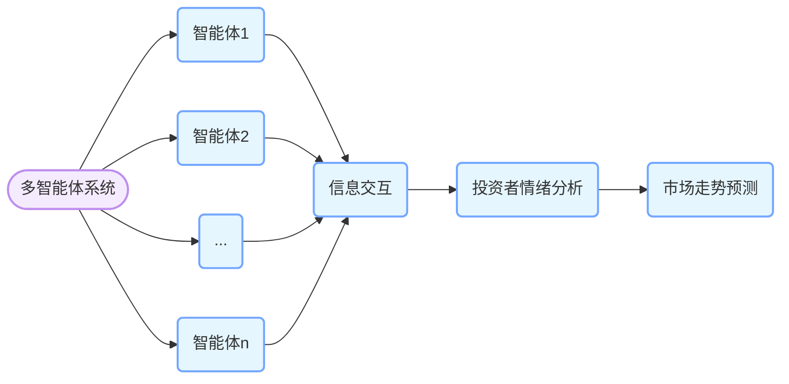

# 多智能体系统在全球投资者情绪分析中的应用：把握市场脉搏

> 关键词：多智能体系统、全球投资者情绪分析、市场脉搏、金融市场、情绪建模

> 摘要：本文深入探讨了多智能体系统在全球投资者情绪分析中的应用，旨在帮助投资者更好地把握市场脉搏。首先介绍了研究的背景、目的、预期读者、文档结构和相关术语。接着阐述了多智能体系统和投资者情绪分析的核心概念及联系，给出了原理和架构的示意图与流程图。详细讲解了核心算法原理和具体操作步骤，并通过Python代码进行了示例。同时，介绍了相关的数学模型和公式，并举例说明。通过项目实战，展示了如何搭建开发环境、实现源代码并进行解读。分析了多智能体系统在全球投资者情绪分析中的实际应用场景，推荐了相关的学习资源、开发工具框架和论文著作。最后总结了未来发展趋势与挑战，解答了常见问题，并提供了扩展阅读和参考资料。

## 1. 背景介绍 
### 1.1 目的和范围
在全球金融市场中，投资者情绪对市场的波动有着至关重要的影响。传统的市场分析方法往往侧重于基本面和技术面的分析，而忽略了投资者情绪这一重要因素。多智能体系统作为一种新兴的技术，能够模拟多个智能体之间的交互和行为，为投资者情绪分析提供了新的视角和方法。

本文的目的是探讨多智能体系统在全球投资者情绪分析中的应用，具体范围包括：介绍多智能体系统和投资者情绪分析的核心概念；阐述多智能体系统在投资者情绪分析中的算法原理和具体操作步骤；通过项目实战展示多智能体系统在投资者情绪分析中的应用；分析多智能体系统在全球投资者情绪分析中的实际应用场景；推荐相关的学习资源、开发工具框架和论文著作。

### 1.2 预期读者
本文的预期读者包括金融市场的投资者、金融分析师、计算机科学领域的研究人员和开发者，以及对多智能体系统和投资者情绪分析感兴趣的人士。

### 1.3 文档结构概述
本文的文档结构如下：
- 背景介绍：介绍研究的目的、范围、预期读者和文档结构。
- 核心概念与联系：阐述多智能体系统和投资者情绪分析的核心概念及联系。
- 核心算法原理 & 具体操作步骤：讲解多智能体系统在投资者情绪分析中的算法原理和具体操作步骤。
- 数学模型和公式 & 详细讲解 & 举例说明：介绍相关的数学模型和公式，并举例说明。
- 项目实战：代码实际案例和详细解释说明：通过项目实战展示多智能体系统在投资者情绪分析中的应用。
- 实际应用场景：分析多智能体系统在全球投资者情绪分析中的实际应用场景。
- 工具和资源推荐：推荐相关的学习资源、开发工具框架和论文著作。
- 总结：未来发展趋势与挑战：总结多智能体系统在全球投资者情绪分析中的未来发展趋势与挑战。
- 附录：常见问题与解答：解答常见问题。
- 扩展阅读 & 参考资料：提供扩展阅读和参考资料。

### 1.4 术语表
#### 1.4.1 核心术语定义
- **多智能体系统（Multi-Agent System，MAS）**：由多个智能体组成的系统，智能体之间可以进行交互和协作，以实现共同的目标。
- **投资者情绪（Investor Sentiment）**：投资者对市场的看法、预期和情感状态，通常会影响投资者的决策和市场的走势。
- **情绪分析（Sentiment Analysis）**：通过对文本、图像、语音等数据的分析，识别和提取其中的情感信息。
- **市场脉搏（Market Pulse）**：反映市场动态和趋势的指标，包括市场的涨跌、成交量、投资者情绪等。

#### 1.4.2 相关概念解释
- **智能体（Agent）**：具有自主决策能力和行为能力的实体，可以感知环境并根据环境的变化做出相应的决策和行为。
- **交互（Interaction）**：智能体之间通过通信、协作等方式进行信息交换和行为协调的过程。
- **协作（Collaboration）**：多个智能体为了实现共同的目标而进行的合作和协调。
- **市场效率（Market Efficiency）**：市场能够及时、准确地反映所有可用信息的程度。

#### 1.4.3 缩略词列表
- **MAS**：Multi-Agent System，多智能体系统
- **NLP**：Natural Language Processing，自然语言处理
- **ML**：Machine Learning，机器学习
- **AI**：Artificial Intelligence，人工智能

## 2. 核心概念与联系 

### 2.1 多智能体系统原理
多智能体系统是一种分布式人工智能系统，由多个智能体组成。每个智能体具有自主决策能力和行为能力，可以感知环境并根据环境的变化做出相应的决策和行为。智能体之间可以通过通信、协作等方式进行信息交换和行为协调，以实现共同的目标。

多智能体系统的架构通常包括以下几个部分：
- **智能体**：具有自主决策能力和行为能力的实体。
- **通信机制**：智能体之间进行信息交换的方式。
- **协作机制**：多个智能体为了实现共同的目标而进行的合作和协调。
- **环境**：智能体所处的外部环境，包括市场、社会、自然等。

下面是多智能体系统原理的文本示意图：

```plaintext
             +----------------+
             |  多智能体系统  |
             +----------------+
             |  智能体 1       |
             |  智能体 2       |
             | ...            |
             |  智能体 n       |
             +----------------+
             |  通信机制       |
             +----------------+
             |  协作机制       |
             +----------------+
             |  环境           |
             +----------------+
```

### 2.2 投资者情绪分析原理
投资者情绪分析是通过对文本、图像、语音等数据的分析，识别和提取其中的情感信息，以了解投资者对市场的看法、预期和情感状态。投资者情绪分析的主要步骤包括：
- **数据收集**：收集与投资者情绪相关的数据，如新闻报道、社交媒体评论、分析师报告等。
- **数据预处理**：对收集到的数据进行清洗、分词、词性标注等预处理操作。
- **特征提取**：从预处理后的数据中提取与投资者情绪相关的特征，如词汇、语法、语义等。
- **模型训练**：使用机器学习或深度学习算法对提取的特征进行训练，建立投资者情绪分析模型。
- **情绪分类**：使用训练好的模型对新的数据进行情绪分类，判断投资者的情绪是积极、消极还是中性。

下面是投资者情绪分析原理的文本示意图：

```plaintext
             +----------------+
             |  投资者情绪分析  |
             +----------------+
             |  数据收集       |
             +----------------+
             |  数据预处理     |
             +----------------+
             |  特征提取       |
             +----------------+
             |  模型训练       |
             +----------------+
             |  情绪分类       |
             +----------------+
```

### 2.3 多智能体系统与投资者情绪分析的联系
多智能体系统可以为投资者情绪分析提供一种新的视角和方法。在多智能体系统中，每个智能体可以代表一个投资者或一组投资者，智能体之间可以进行交互和协作，以模拟投资者之间的信息传播和行为影响。通过对多智能体系统的模拟和分析，可以更好地理解投资者情绪的形成和传播机制，从而更准确地预测市场的走势。

下面是多智能体系统与投资者情绪分析联系的Mermaid流程图：



## 3. 核心算法原理 & 具体操作步骤 

### 3.1 核心算法原理
在多智能体系统中，常用的算法包括基于规则的算法、基于机器学习的算法和基于深度学习的算法。下面以基于机器学习的算法为例，介绍多智能体系统在投资者情绪分析中的核心算法原理。

基于机器学习的算法主要包括以下几个步骤：
- **数据收集**：收集与投资者情绪相关的数据，如新闻报道、社交媒体评论、分析师报告等。
- **数据预处理**：对收集到的数据进行清洗、分词、词性标注等预处理操作。
- **特征提取**：从预处理后的数据中提取与投资者情绪相关的特征，如词汇、语法、语义等。
- **模型训练**：使用机器学习算法对提取的特征进行训练，建立投资者情绪分析模型。
- **情绪分类**：使用训练好的模型对新的数据进行情绪分类，判断投资者的情绪是积极、消极还是中性。

### 3.2 具体操作步骤
下面是使用Python实现基于机器学习的多智能体系统在投资者情绪分析中的具体操作步骤：

```python
import pandas as pd
from sklearn.feature_extraction.text import TfidfVectorizer
from sklearn.model_selection import train_test_split
from sklearn.naive_bayes import MultinomialNB
from sklearn.metrics import accuracy_score

# 步骤1：数据收集
# 假设我们有一个包含投资者评论和情绪标签的数据集
data = {
    'comment': [
        '市场前景非常好，我看好未来的发展',
        '经济形势不容乐观，股市可能会下跌',
        '这家公司的业绩很不错，值得投资',
        '行业竞争激烈，投资风险较大'
    ],
    'sentiment': [1, 0, 1, 0]
}
df = pd.DataFrame(data)

# 步骤2：数据预处理
# 这里简单假设数据已经清洗干净，直接进行分词
# 实际应用中可能需要更复杂的预处理操作
vectorizer = TfidfVectorizer()
X = vectorizer.fit_transform(df['comment'])
y = df['sentiment']

# 步骤3：特征提取
# 使用TfidfVectorizer提取文本特征

# 步骤4：模型训练
# 划分训练集和测试集
X_train, X_test, y_train, y_test = train_test_split(X, y, test_size=0.2, random_state=42)

# 使用朴素贝叶斯分类器进行训练
model = MultinomialNB()
model.fit(X_train, y_train)

# 步骤5：情绪分类
# 对测试集进行预测
y_pred = model.predict(X_test)

# 计算准确率
accuracy = accuracy_score(y_test, y_pred)
print(f"模型准确率: {accuracy}")
```

### 3.3 代码解释
- **数据收集**：使用一个简单的字典模拟包含投资者评论和情绪标签的数据集，并将其转换为Pandas DataFrame。
- **数据预处理**：使用`TfidfVectorizer`对文本数据进行特征提取，将文本转换为向量表示。
- **特征提取**：`TfidfVectorizer`会计算每个词汇的TF-IDF值，作为文本的特征。
- **模型训练**：使用`train_test_split`函数将数据集划分为训练集和测试集，使用`MultinomialNB`朴素贝叶斯分类器进行训练。
- **情绪分类**：使用训练好的模型对测试集进行预测，并计算预测的准确率。

## 4. 数学模型和公式 & 详细讲解 & 举例说明 

### 4.1 TF-IDF公式
TF-IDF（Term Frequency-Inverse Document Frequency）是一种常用的文本特征提取方法，用于衡量一个词汇在文档中的重要性。TF-IDF的计算公式如下：

$$TF-IDF(t, d, D) = TF(t, d) \times IDF(t, D)$$

其中：
- $TF(t, d)$ 表示词汇 $t$ 在文档 $d$ 中出现的频率，计算公式为：

$$TF(t, d) = \frac{count(t, d)}{|d|}$$

其中 $count(t, d)$ 表示词汇 $t$ 在文档 $d$ 中出现的次数，$|d|$ 表示文档 $d$ 的总词汇数。

- $IDF(t, D)$ 表示词汇 $t$ 在文档集合 $D$ 中的逆文档频率，计算公式为：

$$IDF(t, D) = \log\frac{|D|}{|d \in D: t \in d| + 1}$$

其中 $|D|$ 表示文档集合 $D$ 中的文档总数，$|d \in D: t \in d|$ 表示包含词汇 $t$ 的文档数。

### 4.2 朴素贝叶斯分类器公式
朴素贝叶斯分类器是一种基于贝叶斯定理的分类算法，假设特征之间相互独立。对于一个文本 $x = (x_1, x_2, \cdots, x_n)$，其中 $x_i$ 表示第 $i$ 个特征，朴素贝叶斯分类器的分类公式为：

$$P(c|x) = \frac{P(c) \prod_{i=1}^{n} P(x_i|c)}{P(x)}$$

其中：
- $P(c|x)$ 表示在文本 $x$ 出现的情况下，属于类别 $c$ 的概率。
- $P(c)$ 表示类别 $c$ 的先验概率。
- $P(x_i|c)$ 表示在类别 $c$ 下，特征 $x_i$ 出现的概率。
- $P(x)$ 表示文本 $x$ 出现的概率。

由于 $P(x)$ 对于所有类别都是相同的，因此在分类时可以忽略 $P(x)$，只需要比较 $P(c) \prod_{i=1}^{n} P(x_i|c)$ 的大小即可。

### 4.3 举例说明
假设我们有一个包含三个文档的文档集合 $D$：
- $d_1$: "市场前景非常好，我看好未来的发展"
- $d_2$: "经济形势不容乐观，股市可能会下跌"
- $d_3$: "这家公司的业绩很不错，值得投资"

我们要计算词汇 "市场" 在文档 $d_1$ 中的TF-IDF值。

首先计算 $TF$ 值：
- 在文档 $d_1$ 中，"市场" 出现了 1 次，文档 $d_1$ 的总词汇数为 9，因此 $TF("市场", d_1) = \frac{1}{9}$。

然后计算 $IDF$ 值：
- 文档集合 $D$ 中的文档总数为 3，包含 "市场" 的文档数为 1，因此 $IDF("市场", D) = \log\frac{3}{1 + 1} = \log\frac{3}{2}$。

最后计算 $TF-IDF$ 值：
- $TF-IDF("市场", d_1, D) = TF("市场", d_1) \times IDF("市场", D) = \frac{1}{9} \times \log\frac{3}{2}$。

## 5. 项目实战：代码实际案例和详细解释说明 

### 5.1  开发环境搭建
在进行项目实战之前，需要搭建相应的开发环境。以下是具体的步骤：

#### 5.1.1 安装Python
首先，确保你已经安装了Python。可以从Python官方网站（https://www.python.org/downloads/）下载并安装适合你操作系统的Python版本。建议安装Python 3.7及以上版本。

#### 5.1.2 安装必要的库
在命令行中使用以下命令安装必要的Python库：
```sh
pip install pandas scikit-learn
```
- `pandas`：用于数据处理和分析。
- `scikit-learn`：提供了丰富的机器学习算法和工具。

### 5.2  源代码详细实现和代码解读
以下是一个更完整的项目实战代码示例，用于使用多智能体系统（这里简化为基于机器学习的方法）进行投资者情绪分析：

```python
import pandas as pd
from sklearn.feature_extraction.text import TfidfVectorizer
from sklearn.model_selection import train_test_split
from sklearn.naive_bayes import MultinomialNB
from sklearn.metrics import accuracy_score, classification_report

# 步骤1：数据加载
# 假设我们有一个CSV文件，包含投资者评论和对应的情绪标签
data = pd.read_csv('investor_sentiment.csv')

# 步骤2：数据预处理
# 分离特征和标签
X = data['comment']
y = data['sentiment']

# 文本向量化
vectorizer = TfidfVectorizer()
X = vectorizer.fit_transform(X)

# 步骤3：数据集划分
X_train, X_test, y_train, y_test = train_test_split(X, y, test_size=0.2, random_state=42)

# 步骤4：模型训练
model = MultinomialNB()
model.fit(X_train, y_train)

# 步骤5：模型预测
y_pred = model.predict(X_test)

# 步骤6：模型评估
accuracy = accuracy_score(y_test, y_pred)
report = classification_report(y_test, y_pred)

print(f"模型准确率: {accuracy}")
print("分类报告:")
print(report)
```

### 5.3  代码解读与分析
#### 5.3.1 数据加载
使用`pandas`库的`read_csv`函数从CSV文件中加载投资者评论和对应的情绪标签数据。

#### 5.3.2 数据预处理
- 分离特征和标签：将评论数据作为特征`X`，情绪标签作为目标变量`y`。
- 文本向量化：使用`TfidfVectorizer`将文本数据转换为向量表示，以便机器学习模型能够处理。

#### 5.3.3 数据集划分
使用`train_test_split`函数将数据集划分为训练集和测试集，其中测试集占总数据集的20%。

#### 5.3.4 模型训练
使用`MultinomialNB`（多项式朴素贝叶斯分类器）对训练集进行训练。

#### 5.3.5 模型预测
使用训练好的模型对测试集进行预测，得到预测结果`y_pred`。

#### 5.3.6 模型评估
- 准确率：使用`accuracy_score`函数计算模型的准确率，即预测正确的样本数占总样本数的比例。
- 分类报告：使用`classification_report`函数生成详细的分类报告，包括精确率、召回率、F1值等指标。

## 6. 实际应用场景 
多智能体系统在全球投资者情绪分析中有许多实际应用场景，以下是一些常见的应用场景：

### 6.1 投资决策支持
投资者可以利用多智能体系统分析全球投资者情绪，了解市场的整体情绪状态。当市场情绪普遍乐观时，投资者可以考虑增加投资；当市场情绪普遍悲观时，投资者可以考虑减少投资或采取防御性策略。例如，通过分析社交媒体上的投资者评论和新闻报道，多智能体系统可以实时监测投资者情绪的变化，为投资者提供决策支持。

### 6.2 风险管理
金融机构可以使用多智能体系统分析投资者情绪，评估市场风险。当投资者情绪过度乐观或过度悲观时，市场可能存在泡沫或崩溃的风险。金融机构可以根据投资者情绪的分析结果，调整投资组合，降低风险。例如，在市场情绪过度乐观时，金融机构可以减少高风险资产的投资，增加低风险资产的投资。

### 6.3 市场趋势预测
多智能体系统可以通过模拟投资者之间的交互和行为，预测市场的走势。投资者情绪是影响市场走势的重要因素之一，通过分析投资者情绪的变化，多智能体系统可以提前预测市场的上涨或下跌趋势。例如，当投资者情绪逐渐从悲观转向乐观时，多智能体系统可以预测市场可能会出现上涨趋势。

### 6.4 金融产品设计
金融机构可以根据投资者情绪分析的结果，设计更符合投资者需求的金融产品。例如，当投资者情绪普遍乐观时，金融机构可以推出一些高风险、高收益的金融产品；当投资者情绪普遍悲观时，金融机构可以推出一些低风险、稳健收益的金融产品。

### 6.5 政策制定参考
政府和监管机构可以利用多智能体系统分析投资者情绪，了解市场参与者的心理状态和行为趋势。这有助于政府和监管机构制定更加合理的金融政策和监管措施，维护金融市场的稳定。例如，当投资者情绪过度恐慌时，政府可以采取一些措施来稳定市场，如降息、注入流动性等。

## 7. 工具和资源推荐
### 7.1 学习资源推荐
#### 7.1.1 书籍推荐
- 《多智能体系统导论》：全面介绍了多智能体系统的基本概念、理论和方法，是学习多智能体系统的经典教材。
- 《情感分析：挖掘观点、情感和情绪》：深入探讨了情感分析的技术和应用，包括文本情感分析、社交媒体情感分析等。
- 《金融市场技术分析》：介绍了金融市场的技术分析方法，包括图表分析、指标分析等，有助于了解市场的走势和投资者的行为。

#### 7.1.2 在线课程
- Coursera上的“多智能体系统”课程：由知名教授授课，系统地介绍了多智能体系统的理论和实践。
- edX上的“自然语言处理”课程：涵盖了自然语言处理的基本概念、算法和应用，包括情感分析。
- Udemy上的“金融市场分析与投资策略”课程：讲解了金融市场的分析方法和投资策略，结合实际案例进行分析。

#### 7.1.3 技术博客和网站
- Medium：有许多关于多智能体系统、投资者情绪分析和金融市场的技术博客文章，可以及时了解最新的研究成果和应用案例。
- arXiv：提供了大量的学术论文，包括多智能体系统、人工智能和金融领域的研究论文。
- Seeking Alpha：专注于金融市场分析和投资研究，有许多专业的分析师和投资者分享他们的观点和研究成果。

### 7.2 开发工具框架推荐
#### 7.2.1 IDE和编辑器
- PyCharm：一款专业的Python集成开发环境，提供了丰富的功能和工具，适合开发多智能体系统和进行数据处理。
- Jupyter Notebook：一种交互式的开发环境，适合进行数据探索、模型训练和结果展示。
- Visual Studio Code：一款轻量级的代码编辑器，支持多种编程语言和插件，方便进行代码开发和调试。

#### 7.2.2 调试和性能分析工具
- PDB：Python自带的调试器，可以帮助开发者定位和解决代码中的问题。
- cProfile：Python的性能分析工具，可以分析代码的运行时间和内存使用情况，帮助开发者优化代码性能。
- TensorBoard：用于可视化深度学习模型的训练过程和结果，方便开发者进行模型调试和优化。

#### 7.2.3 相关框架和库
- Mesa：一个用于构建多智能体系统的Python框架，提供了丰富的工具和类，方便开发者快速搭建多智能体系统。
- NLTK：自然语言处理工具包，提供了许多自然语言处理的算法和工具，如分词、词性标注、情感分析等。
- Scikit-learn：一个常用的机器学习库，提供了丰富的机器学习算法和工具，如分类、回归、聚类等。

### 7.3 相关论文著作推荐
#### 7.3.1 经典论文
- "Multiagent Systems: A Modern Approach to Distributed Artificial Intelligence"：介绍了多智能体系统的基本概念、理论和方法，是多智能体系统领域的经典论文。
- "Sentiment Analysis: Mining Opinions, Sentiments, and Emotions"：对情感分析的技术和应用进行了系统的总结和分析。
- "Behavioral Finance: A Review of Theory and Evidence"：探讨了行为金融学的理论和实证研究，分析了投资者的心理和行为对金融市场的影响。

#### 7.3.2 最新研究成果
- 在顶级学术会议如AAAI、IJCAI、KDD等上发表的关于多智能体系统和投资者情绪分析的研究论文，展示了最新的研究成果和技术进展。
- 在知名学术期刊如Journal of Financial Economics、Review of Financial Studies等上发表的关于金融市场和投资者行为的研究论文。

#### 7.3.3 应用案例分析
- 一些金融机构和研究机构发布的关于多智能体系统在投资者情绪分析中的应用案例报告，详细介绍了实际应用中的方法、技术和效果。
- 相关的商业分析报告，如麦肯锡、波士顿咨询等公司发布的关于金融市场和投资者情绪的分析报告。

## 8. 总结：未来发展趋势与挑战
### 8.1 未来发展趋势
#### 8.1.1 多模态数据融合
未来，多智能体系统在投资者情绪分析中将不仅仅局限于文本数据，还会融合图像、语音等多模态数据。例如，通过分析投资者的面部表情、语音语调等信息，更全面地了解投资者的情绪状态。

#### 8.1.2 深度学习与强化学习的应用
深度学习和强化学习技术将在多智能体系统中得到更广泛的应用。深度学习可以用于提取更复杂的特征，提高投资者情绪分析的准确性；强化学习可以用于优化多智能体系统的决策策略，使智能体能够根据环境的变化做出更合理的决策。

#### 8.1.3 跨领域融合
多智能体系统在投资者情绪分析中将与其他领域进行更深入的融合，如心理学、社会学、经济学等。通过综合运用不同领域的知识和方法，可以更好地理解投资者的行为和心理，提高投资者情绪分析的效果。

#### 8.1.4 实时监测与预测
随着技术的不断发展，多智能体系统将能够实现对投资者情绪的实时监测和预测。投资者和金融机构可以根据实时的情绪分析结果，及时调整投资策略和风险管理措施。

### 8.2 挑战
#### 8.2.1 数据质量和隐私问题
投资者情绪分析需要大量的数据支持，但数据的质量和隐私问题是一个挑战。数据中可能存在噪声、错误和偏见，需要进行有效的数据清洗和预处理。同时，投资者的情绪数据涉及个人隐私，需要采取有效的措施保护数据的安全和隐私。

#### 8.2.2 模型解释性
深度学习和强化学习模型通常具有较高的准确性，但模型的解释性较差。在投资者情绪分析中，需要能够解释模型的决策过程和结果，以便投资者和金融机构能够理解和信任模型的分析结果。

#### 8.2.3 多智能体系统的复杂性
多智能体系统的设计和实现具有较高的复杂性，需要考虑智能体之间的交互、协作和竞争关系。如何设计有效的通信机制和协作策略，提高多智能体系统的性能和效率，是一个挑战。

#### 8.2.4 市场不确定性
金融市场具有高度的不确定性，投资者情绪也会受到多种因素的影响。如何在复杂多变的市场环境中准确地分析投资者情绪，预测市场走势，是一个具有挑战性的问题。

## 9. 附录：常见问题与解答
### 9.1 多智能体系统在投资者情绪分析中的优势是什么？
多智能体系统可以模拟多个投资者之间的交互和行为，更真实地反映市场的复杂性。通过智能体之间的信息传播和协作，可以更好地捕捉投资者情绪的形成和传播机制，从而提高投资者情绪分析的准确性和可靠性。

### 9.2 如何收集投资者情绪数据？
投资者情绪数据可以通过多种渠道收集，如新闻报道、社交媒体评论、分析师报告、问卷调查等。在收集数据时，需要注意数据的质量和代表性，选择合适的数据来源和收集方法。

### 9.3 多智能体系统的性能如何评估？
多智能体系统的性能可以从多个方面进行评估，如模型的准确率、召回率、F1值等指标，以及系统的稳定性、可扩展性和响应时间等。可以使用测试数据集对模型进行评估，也可以通过实际应用场景进行验证。

### 9.4 如何提高投资者情绪分析的准确性？
可以从以下几个方面提高投资者情绪分析的准确性：
- 收集更多、更准确的数据，包括多模态数据。
- 采用更先进的算法和模型，如深度学习和强化学习。
- 进行有效的数据预处理和特征提取，去除噪声和冗余信息。
- 结合领域知识和专家经验，对分析结果进行验证和修正。

### 9.5 多智能体系统在投资者情绪分析中的应用有哪些局限性？
多智能体系统在投资者情绪分析中的应用存在一些局限性，如模型的解释性较差、对数据质量和隐私的要求较高、系统的复杂性较高等。此外，金融市场具有高度的不确定性，投资者情绪也会受到多种因素的影响，因此多智能体系统的分析结果可能存在一定的误差。

## 10. 扩展阅读 & 参考资料
### 10.1 扩展阅读
- 《人工智能：一种现代的方法》：全面介绍了人工智能的基本概念、算法和应用，包括多智能体系统和机器学习。
- 《金融心理学：掌握市场波动的真谛》：从心理学的角度分析了金融市场的波动和投资者的行为。
- 《Python数据分析实战》：介绍了使用Python进行数据分析的方法和技巧，包括数据处理、可视化和机器学习。

### 10.2 参考资料
- 相关学术论文和研究报告，可以通过学术数据库如IEEE Xplore、ACM Digital Library等进行查找。
- 金融机构和研究机构发布的市场分析报告和研究成果。
- 开源代码库和项目，如GitHub上的多智能体系统和投资者情绪分析相关项目。

作者：AI天才研究院/AI Genius Institute & 禅与计算机程序设计艺术 /Zen And The Art of Computer Programming