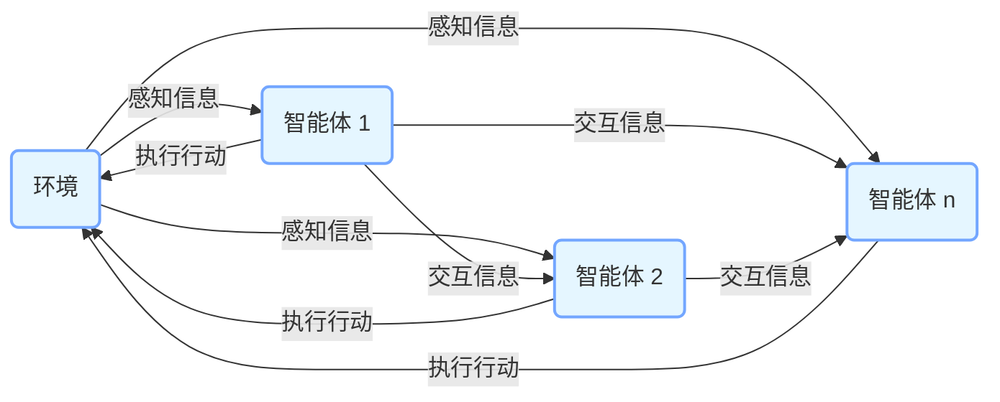
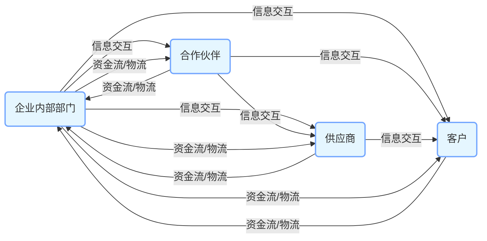

# 多智能体系统在公司创新生态系统健康度评估中的应用

> 关键词：多智能体系统、公司创新生态系统、健康度评估、复杂系统建模、智能决策

> 摘要：本文深入探讨了多智能体系统在公司创新生态系统健康度评估中的应用。首先介绍了研究的背景、目的、预期读者等信息，阐述了核心概念及其联系，包括多智能体系统和公司创新生态系统的原理与架构。详细讲解了核心算法原理，通过 Python 源代码进行说明，并给出了相关的数学模型和公式。结合项目实战，给出了开发环境搭建、源代码实现与解读。分析了多智能体系统在公司创新生态系统健康度评估中的实际应用场景，推荐了学习资源、开发工具框架和相关论文著作。最后总结了未来发展趋势与挑战，解答了常见问题，并提供了扩展阅读和参考资料，旨在为相关领域的研究和实践提供全面而深入的指导。

## 1. 背景介绍 
### 1.1 目的和范围
在当今竞争激烈的商业环境中，公司的创新能力已成为其生存和发展的关键因素。公司创新生态系统涵盖了众多相互关联的主体，如企业内部的不同部门、合作伙伴、供应商以及客户等。评估该生态系统的健康度有助于公司了解自身创新能力的强弱，发现潜在问题，从而制定针对性的策略来提升创新绩效。

本研究的目的在于探索如何利用多智能体系统对公司创新生态系统的健康度进行有效评估。具体范围包括多智能体系统的原理和架构、适用于健康度评估的核心算法、相关数学模型，以及在实际项目中的应用案例。通过研究，为公司提供一种科学、准确的创新生态系统健康度评估方法。

### 1.2 预期读者
本文预期读者主要包括企业管理人员、创新领域的研究人员、人工智能和计算机科学相关专业的学生和研究人员。企业管理人员可以通过本文了解如何利用多智能体系统评估公司创新生态系统的健康度，从而制定更有效的创新策略。研究人员可以在本文的基础上进行更深入的理论研究和方法改进。学生则可以将本文作为学习多智能体系统和创新生态系统评估的参考资料。

### 1.3 文档结构概述
本文首先介绍了研究的背景信息，包括目的、预期读者和文档结构。接着阐述了多智能体系统和公司创新生态系统的核心概念及其联系，给出了相应的原理和架构示意图。然后详细讲解了核心算法原理，并使用 Python 源代码进行说明，同时给出了相关的数学模型和公式。通过项目实战部分，展示了如何在实际中应用多智能体系统进行健康度评估，包括开发环境搭建、源代码实现和解读。分析了多智能体系统在公司创新生态系统健康度评估中的实际应用场景。推荐了学习资源、开发工具框架和相关论文著作。最后总结了未来发展趋势与挑战，解答了常见问题，并提供了扩展阅读和参考资料。

### 1.4 术语表
#### 1.4.1 核心术语定义
- **多智能体系统（Multi - Agent System, MAS）**：由多个自主的智能体组成的系统，这些智能体能够感知环境、进行决策并采取行动，通过相互之间的交互来完成复杂的任务。
- **公司创新生态系统**：指公司内部各部门、外部合作伙伴、供应商、客户等主体之间相互作用、相互影响所形成的一个有机整体，其目的是促进公司的创新活动。
- **健康度评估**：对公司创新生态系统的各项指标进行综合分析，以确定该生态系统的运行状态和创新能力的强弱。

#### 1.4.2 相关概念解释
- **智能体（Agent）**：具有自主性、反应性、社会性和主动性的实体，能够在一定的环境中独立地感知环境信息，并根据自身的目标和规则做出决策和行动。
- **创新生态系统的协同性**：指创新生态系统中各主体之间相互配合、相互促进的程度，协同性越高，创新生态系统的效率和创新能力越强。

#### 1.4.3 缩略词列表
- MAS：Multi - Agent System（多智能体系统）

## 2. 核心概念与联系 
### 多智能体系统原理和架构
多智能体系统由多个智能体组成，每个智能体都有自己的感知器、决策器和执行器。感知器用于感知环境信息，决策器根据感知到的信息和自身的目标、规则进行决策，执行器则根据决策结果采取相应的行动。智能体之间通过通信机制进行交互，以协调彼此的行动。

其架构可以分为集中式、分布式和混合式三种。集中式架构中，有一个中央控制单元负责协调所有智能体的行动；分布式架构中，智能体之间通过自主协商进行协调；混合式架构则结合了集中式和分布式的特点。

以下是多智能体系统架构的 Mermaid 流程图：


### 公司创新生态系统原理和架构
公司创新生态系统由多个主体组成，包括企业内部的研发部门、生产部门、营销部门等，以及外部的合作伙伴、供应商和客户等。这些主体之间通过信息流、资金流和物流相互连接，形成一个复杂的网络。

创新生态系统的运行原理是各主体之间通过合作和竞争，不断地进行知识共享、资源整合和价值创造。其架构可以看作是一个多层次的网络结构，不同层次的主体在创新过程中发挥着不同的作用。

以下是公司创新生态系统架构的 Mermaid 流程图：


### 多智能体系统与公司创新生态系统的联系
多智能体系统可以很好地模拟公司创新生态系统的运行机制。在公司创新生态系统中，每个主体都可以看作是一个智能体，它们具有自主性和决策能力，能够根据自身的利益和目标进行行动。智能体之间的交互可以模拟创新生态系统中各主体之间的信息共享、合作和竞争关系。通过多智能体系统，可以对公司创新生态系统的健康度进行动态评估，及时发现系统中存在的问题。

## 3. 核心算法原理 & 具体操作步骤 
### 核心算法原理
我们采用基于强化学习的多智能体算法来评估公司创新生态系统的健康度。强化学习是一种通过智能体与环境进行交互，不断尝试不同的行动以最大化累积奖励的学习方法。

在本算法中，每个智能体代表创新生态系统中的一个主体，智能体的状态由其自身的属性和与其他智能体的交互信息组成。智能体的行动包括与其他智能体进行合作、竞争等。奖励函数根据创新生态系统的健康度指标来设计，例如创新成果的数量、质量，协同性等。

### Python 源代码实现
```python
import numpy as np
import random

# 定义智能体类
class Agent:
    def __init__(self, id, state_size, action_size):
        self.id = id
        self.state_size = state_size
        self.action_size = action_size
        # 初始化 Q 表
        self.q_table = np.zeros((state_size, action_size))

    def act(self, state):
        # 采用 ε - 贪心策略选择行动
        epsilon = 0.1
        if random.uniform(0, 1) < epsilon:
            return random.randint(0, self.action_size - 1)
        else:
            return np.argmax(self.q_table[state, :])

    def update_q_table(self, state, action, reward, next_state, gamma=0.9, alpha=0.1):
        # 更新 Q 表
        q_value = self.q_table[state, action]
        max_q_next = np.max(self.q_table[next_state, :])
        new_q_value = q_value + alpha * (reward + gamma * max_q_next - q_value)
        self.q_table[state, action] = new_q_value

# 定义多智能体系统类
class MultiAgentSystem:
    def __init__(self, num_agents, state_size, action_size):
        self.num_agents = num_agents
        self.agents = [Agent(i, state_size, action_size) for i in range(num_agents)]

    def step(self, states):
        actions = []
        for i in range(self.num_agents):
            action = self.agents[i].act(states[i])
            actions.append(action)
        return actions

    def update(self, states, actions, rewards, next_states):
        for i in range(self.num_agents):
            self.agents[i].update_q_table(states[i], actions[i], rewards[i], next_states[i])

# 示例使用
if __name__ == "__main__":
    num_agents = 3
    state_size = 10
    action_size = 5
    mas = MultiAgentSystem(num_agents, state_size, action_size)
    states = [random.randint(0, state_size - 1) for _ in range(num_agents)]
    actions = mas.step(states)
    # 假设奖励和下一个状态
    rewards = [random.randint(-1, 1) for _ in range(num_agents)]
    next_states = [random.randint(0, state_size - 1) for _ in range(num_agents)]
    mas.update(states, actions, rewards, next_states)
```
### 具体操作步骤
1. **初始化**：初始化多智能体系统，包括智能体的数量、状态空间和行动空间。为每个智能体初始化 Q 表。
2. **状态获取**：每个智能体获取当前的状态信息，状态信息可以包括自身的属性和与其他智能体的交互信息。
3. **行动选择**：每个智能体根据当前状态和 Q 表，采用 ε - 贪心策略选择行动。
4. **环境交互**：智能体执行选择的行动，与环境进行交互，环境根据智能体的行动给出奖励和下一个状态。
5. **Q 表更新**：每个智能体根据奖励和下一个状态更新自己的 Q 表。
6. **循环迭代**：重复步骤 2 - 5，直到达到预设的迭代次数或满足终止条件。

## 4. 数学模型和公式 & 详细讲解 & 举例说明 
### 数学模型
我们使用马尔可夫决策过程（Markov Decision Process, MDP）来描述多智能体系统在公司创新生态系统健康度评估中的行为。一个 MDP 可以用一个五元组 $(S, A, P, R, \gamma)$ 表示，其中：
- $S$ 是状态空间，即所有可能的状态集合。在公司创新生态系统中，状态可以包括各主体的创新能力、资源状况、协同关系等。
- $A$ 是行动空间，即智能体可以采取的所有行动集合。例如，合作、竞争等。
- $P$ 是状态转移概率函数，$P(s'|s, a)$ 表示在状态 $s$ 下采取行动 $a$ 后转移到状态 $s'$ 的概率。
- $R$ 是奖励函数，$R(s, a, s')$ 表示在状态 $s$ 下采取行动 $a$ 转移到状态 $s'$ 时获得的奖励。
- $\gamma$ 是折扣因子，用于平衡短期奖励和长期奖励，$0 \leq \gamma \leq 1$。

### 公式讲解
#### Q 学习算法公式
Q 学习是一种基于价值的强化学习算法，用于更新智能体的 Q 表。Q 表存储了在每个状态下采取每个行动的预期累积奖励。Q 学习的更新公式为：
$$Q(s, a) \leftarrow Q(s, a) + \alpha[R(s, a, s') + \gamma \max_{a'} Q(s', a') - Q(s, a)]$$
其中：
- $Q(s, a)$ 是在状态 $s$ 下采取行动 $a$ 的 Q 值。
- $\alpha$ 是学习率，控制每次更新的步长，$0 < \alpha \leq 1$。
- $R(s, a, s')$ 是在状态 $s$ 下采取行动 $a$ 转移到状态 $s'$ 时获得的奖励。
- $\gamma$ 是折扣因子。
- $\max_{a'} Q(s', a')$ 是在状态 $s'$ 下采取最优行动的 Q 值。

#### 累积奖励公式
智能体的目标是最大化累积奖励，累积奖励可以表示为：
$$G_t = \sum_{k = 0}^{\infty} \gamma^k R_{t + k + 1}$$
其中 $G_t$ 是在时间步 $t$ 的累积奖励，$R_{t + k + 1}$ 是在时间步 $t + k + 1$ 获得的奖励。

### 举例说明
假设公司创新生态系统中有两个智能体：研发部门和营销部门。状态空间 $S$ 包括研发能力（高、中、低）和市场需求（大、中、小），共 $3 \times 3 = 9$ 种状态。行动空间 $A$ 包括合作、竞争两种行动。

初始时，研发部门处于状态 $s_1$（研发能力中，市场需求中），营销部门处于状态 $s_2$（研发能力中，市场需求中）。研发部门选择行动 $a_1$（合作），营销部门选择行动 $a_2$（合作）。经过一段时间后，研发部门转移到状态 $s_1'$（研发能力高，市场需求大），营销部门转移到状态 $s_2'$（研发能力高，市场需求大），并获得奖励 $R_1 = 10$ 和 $R_2 = 10$。

假设学习率 $\alpha = 0.1$，折扣因子 $\gamma = 0.9$。研发部门的 Q 表更新如下：
设 $Q(s_1, a_1) = 5$，$\max_{a'} Q(s_1', a') = 8$，则：
$$Q(s_1, a_1) \leftarrow 5 + 0.1[10 + 0.9 \times 8 - 5] = 5 + 0.1[10 + 7.2 - 5] = 5 + 1.22 = 6.22$$

## 5. 项目实战：代码实际案例和详细解释说明 
### 5.1  开发环境搭建
#### 安装 Python
首先需要安装 Python 编程语言，建议使用 Python 3.7 及以上版本。可以从 Python 官方网站（https://www.python.org/downloads/）下载并安装适合自己操作系统的版本。

#### 安装必要的库
本项目需要使用 NumPy 库进行数值计算，使用以下命令进行安装：
```sh
pip install numpy
```

### 5.2  源代码详细实现和代码解读
```python
import numpy as np
import random

# 定义智能体类
class Agent:
    def __init__(self, id, state_size, action_size):
        self.id = id
        self.state_size = state_size
        self.action_size = action_size
        # 初始化 Q 表
        self.q_table = np.zeros((state_size, action_size))

    def act(self, state):
        # 采用 ε - 贪心策略选择行动
        epsilon = 0.1
        if random.uniform(0, 1) < epsilon:
            return random.randint(0, self.action_size - 1)
        else:
            return np.argmax(self.q_table[state, :])

    def update_q_table(self, state, action, reward, next_state, gamma=0.9, alpha=0.1):
        # 更新 Q 表
        q_value = self.q_table[state, action]
        max_q_next = np.max(self.q_table[next_state, :])
        new_q_value = q_value + alpha * (reward + gamma * max_q_next - q_value)
        self.q_table[state, action] = new_q_value

# 定义多智能体系统类
class MultiAgentSystem:
    def __init__(self, num_agents, state_size, action_size):
        self.num_agents = num_agents
        self.agents = [Agent(i, state_size, action_size) for i in range(num_agents)]

    def step(self, states):
        actions = []
        for i in range(self.num_agents):
            action = self.agents[i].act(states[i])
            actions.append(action)
        return actions

    def update(self, states, actions, rewards, next_states):
        for i in range(self.num_agents):
            self.agents[i].update_q_table(states[i], actions[i], rewards[i], next_states[i])

# 模拟公司创新生态系统
def simulate_innovation_ecosystem(num_agents, state_size, action_size, num_episodes):
    mas = MultiAgentSystem(num_agents, state_size, action_size)
    for episode in range(num_episodes):
        # 初始化状态
        states = [random.randint(0, state_size - 1) for _ in range(num_agents)]
        for step in range(10):
            actions = mas.step(states)
            # 模拟奖励和下一个状态
            rewards = [random.randint(-1, 1) for _ in range(num_agents)]
            next_states = [random.randint(0, state_size - 1) for _ in range(num_agents)]
            mas.update(states, actions, rewards, next_states)
            states = next_states
    return mas

# 示例使用
if __name__ == "__main__":
    num_agents = 3
    state_size = 10
    action_size = 5
    num_episodes = 100
    mas = simulate_innovation_ecosystem(num_agents, state_size, action_size, num_episodes)
    print("训练完成")
```
### 代码解读与分析
#### 智能体类（Agent）
- `__init__` 方法：初始化智能体的 ID、状态空间大小、行动空间大小，并初始化 Q 表。
- `act` 方法：采用 ε - 贪心策略选择行动。以一定的概率（ε）随机选择行动，否则选择 Q 表中当前状态下 Q 值最大的行动。
- `update_q_table` 方法：根据 Q 学习算法更新 Q 表。

#### 多智能体系统类（MultiAgentSystem）
- `__init__` 方法：初始化多智能体系统，创建指定数量的智能体。
- `step` 方法：每个智能体根据当前状态选择行动。
- `update` 方法：每个智能体根据奖励和下一个状态更新自己的 Q 表。

#### 模拟函数（simulate_innovation_ecosystem）
该函数模拟公司创新生态系统的运行过程。在每个回合中，初始化状态，然后进行多个时间步的交互。每个时间步中，智能体选择行动，环境给出奖励和下一个状态，智能体更新 Q 表。

## 6. 实际应用场景 
### 创新策略制定
通过多智能体系统对公司创新生态系统的健康度进行评估，可以发现系统中存在的问题，如某些部门之间的协同性不足、创新资源分配不合理等。公司可以根据评估结果制定针对性的创新策略，例如加强部门之间的合作、调整资源分配等。

### 合作伙伴选择
在选择合作伙伴时，公司可以利用多智能体系统模拟与不同合作伙伴的合作效果，评估合作对创新生态系统健康度的影响。从而选择最适合的合作伙伴，提高创新绩效。

### 创新项目评估
对于公司内部的创新项目，多智能体系统可以模拟项目的实施过程，评估项目对创新生态系统健康度的贡献。在项目立项前，为公司提供决策依据，避免投资于可能对生态系统健康度产生负面影响的项目。

## 7. 工具和资源推荐
### 7.1 学习资源推荐
#### 7.1.1 书籍推荐
- 《多智能体系统：原理与编程》：本书系统地介绍了多智能体系统的基本原理、算法和编程实现，适合初学者和有一定基础的读者。
- 《强化学习：原理与Python实现》：详细讲解了强化学习的理论和算法，并提供了大量的 Python 代码示例，有助于读者深入理解强化学习在多智能体系统中的应用。
- 《创新生态系统：理论与实践》：深入探讨了公司创新生态系统的概念、理论和实践案例，为理解多智能体系统在创新生态系统评估中的应用提供了背景知识。

#### 7.1.2 在线课程
- Coursera 上的“Multi - Agent Systems”课程：由知名教授授课，涵盖了多智能体系统的各个方面，包括理论、算法和应用。
- edX 上的“Reinforcement Learning”课程：全面介绍了强化学习的基本概念、算法和应用，对于理解多智能体系统中的强化学习算法有很大帮助。

#### 7.1.3 技术博客和网站
- Medium 上的人工智能和多智能体系统相关博客：有许多研究人员和开发者分享的最新研究成果和实践经验。
- AI 社区网站如 Kaggle、Stack Overflow 等：可以在上面找到关于多智能体系统和强化学习的讨论和代码示例。

### 7.2 开发工具框架推荐
#### 7.2.1 IDE和编辑器
- PyCharm：一款专业的 Python 集成开发环境，提供了丰富的代码编辑、调试和项目管理功能。
- Visual Studio Code：一款轻量级的代码编辑器，支持多种编程语言，通过安装相关插件可以方便地进行 Python 开发。

#### 7.2.2 调试和性能分析工具
- PDB：Python 自带的调试器，可以帮助开发者定位代码中的问题。
- cProfile：Python 的性能分析工具，可以分析代码的运行时间和函数调用情况，帮助优化代码性能。

#### 7.2.3 相关框架和库
- OpenAI Gym：一个用于开发和比较强化学习算法的工具包，提供了丰富的环境和接口。
- Mesa：一个用于构建基于智能体的模型的 Python 库，适合开发多智能体系统。

### 7.3 相关论文著作推荐
#### 7.3.1 经典论文
- “Multi - Agent Reinforcement Learning: A Selective Overview”：对多智能体强化学习的发展历程、主要算法和应用进行了全面的综述。
- “The Ecology of Innovation”：提出了创新生态系统的概念，并探讨了其结构和运行机制。

#### 7.3.2 最新研究成果
- 近年来在 AAAI、IJCAI 等人工智能顶级会议上发表的关于多智能体系统在复杂系统评估中的应用的论文。
- 相关学术期刊如《Artificial Intelligence》《Journal of Artificial Intelligence Research》上的最新研究成果。

#### 7.3.3 应用案例分析
- 一些大型企业如谷歌、微软等在创新生态系统管理中应用多智能体系统的案例分析报告，可以从企业的官方网站或相关行业报告中获取。

## 8. 总结：未来发展趋势与挑战
### 未来发展趋势
#### 与大数据和人工智能技术的深度融合
随着大数据和人工智能技术的不断发展，多智能体系统可以结合更多的数据来源和先进的算法，提高对公司创新生态系统健康度评估的准确性和实时性。例如，利用自然语言处理技术分析创新生态系统中的文本信息，利用深度学习算法处理复杂的图像和视频数据。

#### 跨领域应用拓展
多智能体系统在公司创新生态系统健康度评估中的应用将拓展到更多的领域，如医疗、教育、能源等。不同领域的创新生态系统具有不同的特点和需求，多智能体系统需要进行相应的改进和优化。

#### 智能化决策支持
未来，多智能体系统不仅可以评估创新生态系统的健康度，还可以提供智能化的决策支持。通过对大量数据的分析和模拟，为公司制定创新策略、选择合作伙伴等提供更加科学、准确的建议。

### 挑战
#### 数据质量和隐私问题
多智能体系统的运行需要大量的数据支持，但数据的质量和隐私问题是一个挑战。数据可能存在噪声、缺失值等问题，影响评估结果的准确性。同时，创新生态系统中的数据涉及到企业的商业机密和用户的隐私，如何在保护数据隐私的前提下进行有效的数据分析是一个亟待解决的问题。

#### 模型复杂性和可解释性
随着多智能体系统的发展，模型的复杂性不断增加。复杂的模型虽然可以提高评估的准确性，但也降低了模型的可解释性。企业管理人员需要理解评估结果的含义，以便做出正确的决策。因此，如何在提高模型性能的同时保持模型的可解释性是一个重要的挑战。

#### 智能体间的协调和冲突解决
在多智能体系统中，智能体之间的协调和冲突解决是一个关键问题。不同的智能体可能具有不同的目标和利益，如何协调它们之间的行动，避免冲突，是提高创新生态系统健康度的关键。

## 9. 附录：常见问题与解答
### 问题 1：多智能体系统中的智能体是如何通信的？
解答：智能体之间的通信方式有多种，常见的包括消息传递、共享内存等。在本项目中，虽然没有详细实现通信机制，但可以通过定义特定的消息格式和通信协议来实现智能体之间的信息交换。例如，智能体可以通过发送和接收消息来告知其他智能体自己的状态、行动和需求。

### 问题 2：如何确定奖励函数？
解答：奖励函数的设计需要根据具体的应用场景和评估目标来确定。在公司创新生态系统健康度评估中，奖励函数可以考虑创新成果的数量、质量、协同性等因素。例如，如果智能体之间的合作导致创新成果的增加，可以给予正奖励；如果出现冲突或资源浪费，可以给予负奖励。

### 问题 3：多智能体系统的训练时间长怎么办？
解答：可以采取以下措施来缩短训练时间：
- 优化算法：选择更高效的算法或对现有算法进行改进。
- 并行计算：利用多核处理器或分布式计算平台进行并行训练。
- 减少状态空间和行动空间：合理简化问题的复杂度。

## 10. 扩展阅读 & 参考资料
### 扩展阅读
- 《复杂适应系统》：深入探讨了复杂系统的特性和运行机制，有助于理解公司创新生态系统的复杂性。
- 《人工智能：一种现代的方法》：全面介绍了人工智能的各个领域，包括多智能体系统、强化学习等。

### 参考资料
- [1] Wooldridge, M. (2009). An introduction to multi - agent systems. John Wiley & Sons.
- [2] Sutton, R. S., & Barto, A. G. (2018). Reinforcement learning: An introduction. MIT press.
- [3] Chesbrough, H. W. (2003). Open innovation: The new imperative for creating and profiting from technology. Harvard Business School Press.

作者：AI天才研究院/AI Genius Institute & 禅与计算机程序设计艺术 /Zen And The Art of Computer Programming