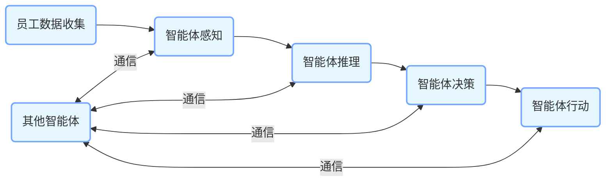

# 多智能体系统在公司员工满意度评估中的应用

> 关键词：多智能体系统、员工满意度评估、人工智能、数据分析、公司管理

> 摘要：本文聚焦于多智能体系统在公司员工满意度评估中的应用。首先介绍多智能体系统和员工满意度评估的背景知识，阐述其目的、预期读者和文档结构。接着深入探讨多智能体系统的核心概念与联系，包括原理和架构，并给出相应的文本示意图和 Mermaid 流程图。详细讲解核心算法原理，使用 Python 源代码进行具体阐述，同时介绍相关的数学模型和公式并举例说明。通过项目实战，展示多智能体系统在员工满意度评估中的代码实现和详细解读。分析多智能体系统在公司员工满意度评估中的实际应用场景，推荐相关的工具和资源，包括学习资源、开发工具框架以及论文著作等。最后总结多智能体系统在该领域的未来发展趋势与挑战，解答常见问题，并提供扩展阅读和参考资料。旨在为公司管理者和相关研究人员提供全面的多智能体系统在员工满意度评估中应用的知识和实践指导。

## 1. 背景介绍 
### 1.1 目的和范围
在当今竞争激烈的商业环境中，员工满意度对于公司的成功至关重要。员工满意度不仅影响员工的工作绩效和忠诚度，还与公司的整体运营效率和创新能力密切相关。传统的员工满意度评估方法往往存在数据收集不全面、分析不准确、反馈不及时等问题。多智能体系统作为一种新兴的人工智能技术，具有分布式、自治性、交互性等特点，能够有效地解决传统评估方法的不足。

本文的目的是深入探讨多智能体系统在公司员工满意度评估中的应用，包括其原理、算法、数学模型、实际应用场景等方面。范围涵盖了从多智能体系统的基本概念到具体的实现和应用，旨在为公司管理者和相关研究人员提供全面的理论和实践指导。

### 1.2 预期读者
本文的预期读者包括公司管理者、人力资源专家、数据分析人员、人工智能研究人员以及对员工满意度评估和多智能体系统感兴趣的人士。公司管理者可以通过本文了解如何利用多智能体系统提高员工满意度评估的准确性和效率，从而更好地管理员工和提升公司绩效。人力资源专家可以学习到多智能体系统在员工管理中的应用方法，为公司制定更加科学的人力资源策略。数据分析人员可以掌握多智能体系统的算法和模型，进行更深入的数据分析和挖掘。人工智能研究人员可以了解多智能体系统在实际应用中的挑战和机遇，推动相关技术的发展。

### 1.3 文档结构概述
本文共分为十个部分。第一部分为背景介绍，包括目的和范围、预期读者、文档结构概述和术语表。第二部分介绍多智能体系统的核心概念与联系，包括原理和架构，并给出文本示意图和 Mermaid 流程图。第三部分详细讲解多智能体系统的核心算法原理和具体操作步骤，使用 Python 源代码进行阐述。第四部分介绍相关的数学模型和公式，并进行详细讲解和举例说明。第五部分通过项目实战，展示多智能体系统在员工满意度评估中的代码实现和详细解读。第六部分分析多智能体系统在公司员工满意度评估中的实际应用场景。第七部分推荐相关的工具和资源，包括学习资源、开发工具框架以及论文著作等。第八部分总结多智能体系统在该领域的未来发展趋势与挑战。第九部分为附录，解答常见问题。第十部分提供扩展阅读和参考资料。

### 1.4 术语表
#### 1.4.1 核心术语定义
- **多智能体系统（Multi - Agent System, MAS）**：由多个智能体组成的系统，每个智能体具有自治性、交互性和协作性，能够在一定的环境中感知信息、做出决策并执行相应的行动，以实现共同的或各自的目标。
- **智能体（Agent）**：具有一定的感知、推理和行动能力的实体，能够根据自身的知识和环境信息自主地做出决策和执行任务。
- **员工满意度评估**：通过一定的方法和指标，对员工对工作环境、工作内容、薪酬福利、职业发展等方面的满意程度进行评价和分析的过程。

#### 1.4.2 相关概念解释
- **分布式系统**：多智能体系统通常是分布式的，即智能体分布在不同的物理位置或逻辑节点上，通过网络进行通信和协作。分布式系统具有可扩展性、容错性等优点。
- **自治性**：智能体能够独立地感知环境、做出决策和执行行动，不需要外部的直接控制。自治性是智能体的重要特征之一，使得智能体能够在复杂的环境中灵活地应对各种情况。
- **交互性**：智能体之间能够进行信息交流和协作，通过发送和接收消息来协调彼此的行动。交互性是多智能体系统实现协作和共同目标的基础。

#### 1.4.3 缩略词列表
- **MAS**：Multi - Agent System（多智能体系统）
- **AI**：Artificial Intelligence（人工智能）
- **ML**：Machine Learning（机器学习）

## 2. 核心概念与联系 
### 2.1 多智能体系统原理
多智能体系统的核心思想是将复杂的问题分解为多个相对简单的子问题，每个子问题由一个或多个智能体来解决。智能体之间通过通信和协作，实现信息的共享和任务的协调，从而完成整个系统的目标。

智能体通常由以下几个部分组成：
- **感知模块**：用于感知环境中的信息，如员工的工作行为、绩效数据、反馈意见等。
- **推理模块**：根据感知到的信息和自身的知识，进行推理和决策，确定下一步的行动。
- **行动模块**：根据推理模块的决策，执行相应的行动，如发送消息、执行任务等。
- **通信模块**：用于与其他智能体进行信息交流和协作。

### 2.2 多智能体系统架构
多智能体系统的架构可以分为集中式架构、分布式架构和混合式架构。

- **集中式架构**：存在一个中央控制节点，负责协调和管理所有智能体的行动。中央控制节点接收智能体的信息，进行决策，并向智能体发送指令。集中式架构的优点是易于管理和协调，缺点是存在单点故障风险，可扩展性较差。
- **分布式架构**：智能体之间通过网络进行平等的通信和协作，没有中央控制节点。每个智能体根据自身的知识和与其他智能体的交互，自主地做出决策和执行行动。分布式架构的优点是具有良好的可扩展性和容错性，缺点是协调和管理难度较大。
- **混合式架构**：结合了集中式架构和分布式架构的优点，既有中央控制节点进行宏观的协调和管理，又允许智能体之间进行分布式的通信和协作。

### 2.3 文本示意图
多智能体系统在员工满意度评估中的应用可以用以下文本示意图表示：

员工数据（工作行为、绩效、反馈等） -> 感知模块（智能体） -> 推理模块（智能体） -> 决策（智能体） -> 行动（如发送提醒、生成报告等）
多个智能体之间通过通信模块进行信息交流和协作，共同完成员工满意度评估任务。

### 2.4 Mermaid 流程图


## 3. 核心算法原理 & 具体操作步骤 
### 3.1 核心算法原理
在多智能体系统中，常用的算法包括基于规则的算法、基于机器学习的算法和基于博弈论的算法。

#### 3.1.1 基于规则的算法
基于规则的算法是一种简单而有效的方法，通过定义一系列的规则来指导智能体的决策和行动。例如，当员工的绩效连续三个月低于某个阈值时，智能体可以发送提醒消息给员工和其上级。

以下是一个简单的基于规则的算法的 Python 代码示例：
```python
# 员工绩效数据
employee_performance = {
    "employee1": [80, 70, 60],
    "employee2": [90, 85, 80]
}

# 绩效阈值
performance_threshold = 70

# 规则检查函数
def check_performance(performance_list):
    for performance in performance_list[-3:]:
        if performance < performance_threshold:
            return True
    return False

# 智能体行动函数
def agent_action(employee_id):
    print(f"提醒员工 {employee_id} 和其上级，绩效连续三个月低于阈值！")

# 遍历员工绩效数据
for employee_id, performance_list in employee_performance.items():
    if check_performance(performance_list):
        agent_action(employee_id)
```

#### 3.1.2 基于机器学习的算法
基于机器学习的算法可以通过对大量员工数据的学习，建立预测模型，预测员工的满意度和行为。常用的机器学习算法包括决策树、神经网络、支持向量机等。

以下是一个使用决策树算法进行员工满意度预测的 Python 代码示例：
```python
from sklearn.tree import DecisionTreeClassifier
from sklearn.model_selection import train_test_split
from sklearn.metrics import accuracy_score
import pandas as pd

# 读取员工数据
data = pd.read_csv('employee_data.csv')

# 划分特征和标签
X = data.drop('satisfaction', axis=1)
y = data['satisfaction']

# 划分训练集和测试集
X_train, X_test, y_train, y_test = train_test_split(X, y, test_size=0.2, random_state=42)

# 创建决策树分类器
clf = DecisionTreeClassifier()

# 训练模型
clf.fit(X_train, y_train)

# 预测
y_pred = clf.predict(X_test)

# 计算准确率
accuracy = accuracy_score(y_test, y_pred)
print(f"模型准确率: {accuracy}")
```

#### 3.1.3 基于博弈论的算法
基于博弈论的算法可以用于处理智能体之间的冲突和协作问题。在员工满意度评估中，不同的智能体可能有不同的目标和利益，通过博弈论的方法可以找到最优的协作策略。

### 3.2 具体操作步骤
1. **数据收集**：收集员工的相关数据，包括工作行为、绩效、反馈意见等。
2. **智能体设计**：根据任务需求，设计不同类型的智能体，如数据收集智能体、分析智能体、决策智能体等。
3. **算法选择和实现**：根据具体情况选择合适的算法，并在智能体中实现。
4. **智能体通信和协作**：实现智能体之间的通信机制，使智能体能够进行信息交流和协作。
5. **评估和优化**：对多智能体系统的性能进行评估，根据评估结果进行优化和改进。

## 4. 数学模型和公式 & 详细讲解 & 举例说明 
### 4.1 数学模型
在多智能体系统中，常用的数学模型包括马尔可夫决策过程（Markov Decision Process, MDP）、博弈论模型等。

#### 4.1.1 马尔可夫决策过程（MDP）
马尔可夫决策过程是一种用于描述智能体在随机环境中决策和行动的数学模型。MDP 由以下几个要素组成：
- **状态空间 $S$**：表示环境的所有可能状态。
- **动作空间 $A$**：表示智能体可以采取的所有动作。
- **状态转移概率 $P(s'|s,a)$**：表示在状态 $s$ 采取动作 $a$ 后转移到状态 $s'$ 的概率。
- **奖励函数 $R(s,a,s')$**：表示在状态 $s$ 采取动作 $a$ 转移到状态 $s'$ 时获得的奖励。
- **折扣因子 $\gamma$**：用于权衡当前奖励和未来奖励的重要性。

智能体的目标是找到一个最优策略 $\pi^*$，使得长期累积奖励最大化。最优策略可以通过求解贝尔曼方程得到：
$$V^*(s) = \max_{a \in A} \sum_{s' \in S} P(s'|s,a) [R(s,a,s') + \gamma V^*(s')]$$
其中 $V^*(s)$ 表示状态 $s$ 的最优值函数。

#### 4.1.2 博弈论模型
博弈论模型用于描述多个智能体之间的交互和决策问题。常见的博弈论模型包括囚徒困境、纳什均衡等。

### 4.2 详细讲解
#### 4.2.1 马尔可夫决策过程的应用
在员工满意度评估中，马尔可夫决策过程可以用于描述智能体根据员工的状态（如绩效、工作态度等）选择合适的行动（如发送提醒、提供培训等）。智能体的目标是通过选择最优的行动，提高员工的满意度和绩效。

#### 4.2.2 博弈论模型的应用
博弈论模型可以用于处理多个智能体之间的利益冲突和协作问题。例如，在员工满意度评估中，不同的智能体可能有不同的目标，如提高员工满意度、降低成本等。通过博弈论的方法，可以找到一个最优的协作策略，使得所有智能体的利益最大化。

### 4.3 举例说明
#### 4.3.1 马尔可夫决策过程举例
假设员工的状态空间 $S = \{s_1, s_2, s_3\}$，分别表示绩效高、绩效中、绩效低；动作空间 $A = \{a_1, a_2\}$，分别表示发送提醒和提供培训。状态转移概率和奖励函数如下表所示：

| 状态 $s$ | 动作 $a$ | 下一状态 $s'$ | 状态转移概率 $P(s'|s,a)$ | 奖励 $R(s,a,s')$ |
|---|---|---|---|---|
| $s_1$ | $a_1$ | $s_1$ | 0.8 | 10 |
| $s_1$ | $a_1$ | $s_2$ | 0.2 | 5 |
| $s_1$ | $a_2$ | $s_1$ | 0.9 | 8 |
| $s_1$ | $a_2$ | $s_2$ | 0.1 | 3 |
| $s_2$ | $a_1$ | $s_1$ | 0.3 | 6 |
| $s_2$ | $a_1$ | $s_2$ | 0.6 | 3 |
| $s_2$ | $a_1$ | $s_3$ | 0.1 | -2 |
| $s_2$ | $a_2$ | $s_1$ | 0.4 | 7 |
| $s_2$ | $a_2$ | $s_2$ | 0.5 | 4 |
| $s_2$ | $a_2$ | $s_3$ | 0.1 | -1 |
| $s_3$ | $a_1$ | $s_2$ | 0.5 | 2 |
| $s_3$ | $a_1$ | $s_3$ | 0.5 | -5 |
| $s_3$ | $a_2$ | $s_2$ | 0.6 | 3 |
| $s_3$ | $a_2$ | $s_3$ | 0.4 | -4 |

假设折扣因子 $\gamma = 0.9$，通过求解贝尔曼方程，可以得到最优策略。

#### 4.3.2 博弈论模型举例
考虑一个简单的囚徒困境博弈，两个智能体（员工）面临合作和背叛两种选择。如果两个智能体都合作，每个智能体获得 3 分；如果一个智能体合作，另一个智能体背叛，背叛的智能体获得 5 分，合作的智能体获得 0 分；如果两个智能体都背叛，每个智能体获得 1 分。博弈矩阵如下：

|  | 智能体 2 合作 | 智能体 2 背叛 |
|---|---|---|
| 智能体 1 合作 | (3, 3) | (0, 5) |
| 智能体 1 背叛 | (5, 0) | (1, 1) |

在这个博弈中，纳什均衡是两个智能体都背叛，因为无论对方选择什么，背叛都是自己的最优选择。

## 5. 项目实战：代码实际案例和详细解释说明 
### 5.1 开发环境搭建
1. **安装 Python**：确保系统中安装了 Python 3.x 版本。可以从 Python 官方网站（https://www.python.org/downloads/） 下载并安装。
2. **安装相关库**：使用以下命令安装项目所需的库：
```sh
pip install pandas scikit-learn
```
3. **准备数据**：收集员工的相关数据，并保存为 CSV 文件，如 `employee_data.csv`。

### 5.2 源代码详细实现和代码解读
以下是一个使用多智能体系统进行员工满意度评估的完整代码示例：
```python
import pandas as pd
from sklearn.tree import DecisionTreeClassifier
from sklearn.model_selection import train_test_split
from sklearn.metrics import accuracy_score

# 数据收集智能体
class DataCollectionAgent:
    def __init__(self, data_file):
        self.data_file = data_file

    def collect_data(self):
        data = pd.read_csv(self.data_file)
        return data

# 分析智能体
class AnalysisAgent:
    def __init__(self):
        self.model = DecisionTreeClassifier()

    def train_model(self, X_train, y_train):
        self.model.fit(X_train, y_train)

    def predict(self, X_test):
        y_pred = self.model.predict(X_test)
        return y_pred

# 决策智能体
class DecisionAgent:
    def __init__(self, accuracy_threshold):
        self.accuracy_threshold = accuracy_threshold

    def make_decision(self, accuracy):
        if accuracy >= self.accuracy_threshold:
            print("模型准确率达到要求，可以用于员工满意度评估。")
        else:
            print("模型准确率未达到要求，需要进一步优化。")

# 主程序
if __name__ == "__main__":
    # 数据收集
    data_collection_agent = DataCollectionAgent('employee_data.csv')
    data = data_collection_agent.collect_data()

    # 划分特征和标签
    X = data.drop('satisfaction', axis=1)
    y = data['satisfaction']

    # 划分训练集和测试集
    X_train, X_test, y_train, y_test = train_test_split(X, y, test_size=0.2, random_state=42)

    # 分析智能体训练模型并预测
    analysis_agent = AnalysisAgent()
    analysis_agent.train_model(X_train, y_train)
    y_pred = analysis_agent.predict(X_test)

    # 计算准确率
    accuracy = accuracy_score(y_test, y_pred)

    # 决策智能体做出决策
    decision_agent = DecisionAgent(0.8)
    decision_agent.make_decision(accuracy)
```

### 5.3 代码解读与分析
1. **数据收集智能体（`DataCollectionAgent`）**：负责从 CSV 文件中读取员工数据。`collect_data` 方法返回读取的数据。
2. **分析智能体（`AnalysisAgent`）**：使用决策树算法进行模型训练和预测。`train_model` 方法用于训练模型，`predict` 方法用于对测试数据进行预测。
3. **决策智能体（`DecisionAgent`）**：根据模型的准确率做出决策。`make_decision` 方法根据准确率是否达到阈值输出相应的信息。
4. **主程序**：依次调用数据收集智能体、分析智能体和决策智能体，完成员工满意度评估的整个流程。

## 6. 实际应用场景 
### 6.1 实时监控员工满意度
多智能体系统可以实时收集员工的工作行为、绩效、反馈等数据，通过分析这些数据，实时监控员工的满意度。当员工的满意度出现异常时，智能体可以及时发送提醒消息给相关人员，以便采取相应的措施。

### 6.2 个性化员工管理
多智能体系统可以根据员工的个人特点和需求，提供个性化的管理方案。例如，对于绩效较低的员工，智能体可以分析其原因，并提供针对性的培训建议；对于满意度较低的员工，智能体可以了解其需求，提供相应的福利和激励措施。

### 6.3 优化公司管理策略
通过对员工满意度数据的分析，多智能体系统可以发现公司管理中存在的问题和不足，为公司管理者提供决策支持。例如，智能体可以分析不同部门、不同岗位的员工满意度差异，为公司制定更加合理的组织结构和薪酬体系提供依据。

### 6.4 预测员工离职风险
多智能体系统可以通过对员工的工作行为、绩效、满意度等数据的分析，预测员工的离职风险。当员工的离职风险较高时，智能体可以及时采取措施，如与员工沟通、提供更好的职业发展机会等，降低员工的离职率。

## 7. 工具和资源推荐
### 7.1 学习资源推荐
#### 7.1.1 书籍推荐
- 《多智能体系统：原理与编程》：全面介绍多智能体系统的基本原理、算法和编程实现，是学习多智能体系统的经典教材。
- 《人工智能：一种现代的方法》：涵盖了人工智能的各个领域，包括多智能体系统，对多智能体系统的理论和应用有深入的讲解。
- 《员工满意度调查实用手册》：介绍了员工满意度调查的方法、技术和案例，对于了解员工满意度评估有很大的帮助。

#### 7.1.2 在线课程
- Coursera 上的“Multi - Agent Systems”课程：由知名高校的教授授课，系统地介绍多智能体系统的知识和技术。
- edX 上的“Artificial Intelligence”课程：涵盖了人工智能的多个方面，包括多智能体系统，课程内容丰富，讲解详细。

#### 7.1.3 技术博客和网站
- AI Stack Exchange：一个关于人工智能的问答社区，有很多关于多智能体系统的问题和解答。
- Medium 上的人工智能相关博客：有很多关于多智能体系统的最新研究成果和实践经验分享。

### 7.2 开发工具框架推荐
#### 7.2.1 IDE和编辑器
- PyCharm：一款专业的 Python 集成开发环境，提供了丰富的代码编辑、调试和分析功能，适合开发多智能体系统的 Python 代码。
- Visual Studio Code：一款轻量级的代码编辑器，支持多种编程语言和插件，具有良好的扩展性，可用于多智能体系统的开发。

#### 7.2.2 调试和性能分析工具
- PDB：Python 自带的调试工具，可以帮助开发者调试 Python 代码，定位问题。
- cProfile：Python 标准库中的性能分析工具，可以分析 Python 代码的性能瓶颈，帮助开发者优化代码。

#### 7.2.3 相关框架和库
- Mesa：一个用于构建基于代理的模型的 Python 框架，提供了丰富的工具和接口，方便开发者构建多智能体系统。
- JADE：一个用于开发多智能体系统的 Java 框架，具有良好的可扩展性和分布式性能。

### 7.3 相关论文著作推荐
#### 7.3.1 经典论文
- “Multi - Agent Systems: A Modern Approach to Distributed Artificial Intelligence”：介绍了多智能体系统的基本概念、理论和应用，是多智能体系统领域的经典论文。
- “The State of the Art in Multi - Agent Systems”：对多智能体系统的研究现状进行了全面的综述，分析了多智能体系统的发展趋势和挑战。

#### 7.3.2 最新研究成果
- 关注顶级学术会议，如 AAAI（Association for the Advancement of Artificial Intelligence）、IJCAI（International Joint Conference on Artificial Intelligence）等，这些会议上有很多关于多智能体系统的最新研究成果。
- 阅读相关学术期刊，如 Artificial Intelligence、Journal of Artificial Intelligence Research 等，了解多智能体系统的前沿研究动态。

#### 7.3.3 应用案例分析
- 一些知名企业的研究报告和案例分享，如 Google、Microsoft 等公司在多智能体系统应用方面的实践经验，可以为我们提供实际应用的参考。

## 8. 总结：未来发展趋势与挑战
### 8.1 未来发展趋势
- **与其他技术的融合**：多智能体系统将与大数据、云计算、物联网等技术深度融合，实现更强大的功能和更广泛的应用。例如，通过物联网技术收集更多的员工数据，利用大数据和云计算技术进行更高效的数据分析和处理。
- **智能化和自主化**：智能体将具有更高的智能化和自主化水平，能够更好地适应复杂多变的环境。例如，智能体可以自动学习和优化自己的决策策略，提高员工满意度评估的准确性和效率。
- **应用领域的拓展**：多智能体系统在员工满意度评估中的应用将不断拓展到其他领域，如医疗、教育、交通等。例如，在医疗领域，多智能体系统可以用于评估医护人员的工作满意度，提高医疗服务质量。

### 8.2 挑战
- **数据隐私和安全**：多智能体系统需要收集和处理大量的员工数据，数据隐私和安全是一个重要的问题。如何保护员工的数据不被泄露和滥用，是多智能体系统面临的挑战之一。
- **智能体之间的协作和协调**：多智能体系统中智能体之间的协作和协调是一个复杂的问题。如何确保智能体之间能够有效地通信和协作，避免冲突和矛盾，是提高多智能体系统性能的关键。
- **模型的可解释性**：一些基于机器学习的算法模型，如神经网络，具有较高的准确率，但模型的可解释性较差。在员工满意度评估中，需要解释模型的决策过程和结果，以便管理者和员工理解和接受。

## 9. 附录：常见问题与解答
### 9.1 多智能体系统与传统系统有什么区别？
多智能体系统具有分布式、自治性、交互性等特点，与传统的集中式系统相比，具有更好的可扩展性、容错性和灵活性。传统系统通常由一个中央控制节点进行统一管理和控制，而多智能体系统中的智能体可以独立地感知环境、做出决策和执行行动，通过通信和协作实现共同的目标。

### 9.2 如何选择合适的智能体算法？
选择合适的智能体算法需要考虑多个因素，如问题的复杂度、数据的特点、系统的性能要求等。如果问题比较简单，可以选择基于规则的算法；如果数据量较大且需要进行预测和分类，可以选择基于机器学习的算法；如果需要处理智能体之间的冲突和协作问题，可以选择基于博弈论的算法。

### 9.3 多智能体系统在员工满意度评估中会取代人力资源专家吗？
多智能体系统在员工满意度评估中可以提供更准确、更高效的数据分析和决策支持，但不会取代人力资源专家。人力资源专家具有丰富的经验和专业知识，能够对员工的情况进行综合分析和判断。多智能体系统和人力资源专家可以相互补充，共同提高员工满意度评估的质量和效果。

## 10. 扩展阅读 & 参考资料
- 《复杂系统理论与多智能体系统》
- 《员工满意度管理：理论、方法与实践》
- 相关学术论文和研究报告
- 多智能体系统相关的开源项目和代码库

作者：AI天才研究院/AI Genius Institute & 禅与计算机程序设计艺术 /Zen And The Art of Computer Programming