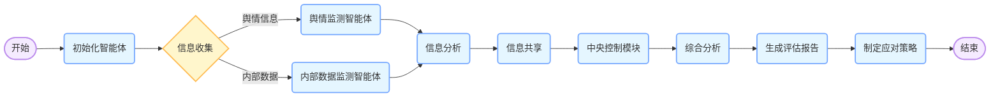

# 多智能体系统在公司声誉风险评估中的应用

> 关键词：多智能体系统、公司声誉风险评估、人工智能、风险模型、信息交互

> 摘要：本文深入探讨了多智能体系统在公司声誉风险评估中的应用。首先介绍了相关背景知识，包括目的、预期读者、文档结构和术语表。接着阐述了多智能体系统和公司声誉风险评估的核心概念及其联系，给出了原理和架构的文本示意图与 Mermaid 流程图。详细讲解了核心算法原理，并使用 Python 源代码进行阐述，同时给出了相关的数学模型和公式。通过项目实战展示了代码的实际案例和详细解释，分析了其在不同实际应用场景中的作用。还推荐了学习该领域所需的工具和资源，包括书籍、在线课程、开发工具等。最后总结了未来发展趋势与挑战，提供了常见问题解答和扩展阅读及参考资料，旨在为相关研究和实践提供全面且深入的指导。

## 1. 背景介绍 
### 1.1 目的和范围
在当今竞争激烈的商业环境中，公司的声誉是其最为宝贵的资产之一。声誉风险可能源于各种内外部因素，如产品质量问题、负面舆情、违规行为等，这些风险一旦爆发，可能会对公司的市场价值、客户信任和业务运营造成严重的影响。多智能体系统作为一种新兴的人工智能技术，具有分布式、自主性和协作性等特点，能够有效地处理复杂的信息和动态的环境。本研究的目的是探讨如何将多智能体系统应用于公司声誉风险评估中，以提高评估的准确性、及时性和全面性。

本研究的范围涵盖了多智能体系统的基本原理、公司声誉风险评估的相关理论和方法，以及两者结合的具体实现和应用。通过对多智能体系统的设计和优化，使其能够收集、分析和整合各种与公司声誉相关的信息，从而为公司提供准确的声誉风险评估结果和应对建议。

### 1.2 预期读者
本文的预期读者包括对人工智能、风险管理和公司治理等领域感兴趣的研究人员、学者和学生，以及从事公司声誉管理、风险评估和决策制定的企业管理人员和专业人士。对于研究人员和学者，本文可以为他们提供新的研究思路和方法；对于企业管理人员和专业人士，本文可以帮助他们更好地理解和应用多智能体系统进行公司声誉风险评估，提高企业的风险管理能力和竞争力。

### 1.3 文档结构概述
本文将按照以下结构进行组织：
1. **背景介绍**：介绍研究的目的、范围、预期读者和文档结构概述，以及相关术语的定义和解释。
2. **核心概念与联系**：阐述多智能体系统和公司声誉风险评估的核心概念，分析它们之间的联系，并给出原理和架构的文本示意图与 Mermaid 流程图。
3. **核心算法原理 & 具体操作步骤**：详细讲解多智能体系统在公司声誉风险评估中所使用的核心算法原理，并使用 Python 源代码进行阐述。
4. **数学模型和公式 & 详细讲解 & 举例说明**：给出相关的数学模型和公式，对其进行详细讲解，并通过具体的例子进行说明。
5. **项目实战：代码实际案例和详细解释说明**：通过一个实际的项目案例，展示多智能体系统在公司声誉风险评估中的具体实现和应用，包括开发环境搭建、源代码详细实现和代码解读。
6. **实际应用场景**：分析多智能体系统在公司声誉风险评估中的实际应用场景，如舆情监测、危机预警、声誉修复等。
7. **工具和资源推荐**：推荐学习该领域所需的工具和资源，包括书籍、在线课程、开发工具、相关框架和库等。
8. **总结：未来发展趋势与挑战**：总结多智能体系统在公司声誉风险评估中的应用现状和发展趋势，分析面临的挑战和问题，并提出相应的建议和对策。
9. **附录：常见问题与解答**：提供常见问题的解答，帮助读者更好地理解和应用本文的内容。
10. **扩展阅读 & 参考资料**：提供相关的扩展阅读和参考资料，供读者进一步深入研究和学习。

### 1.4 术语表
#### 1.4.1 核心术语定义
- **多智能体系统（Multi - Agent System, MAS）**：由多个自主的智能体组成的系统，这些智能体能够感知环境、进行决策和行动，并通过相互通信和协作来完成共同的任务。
- **公司声誉风险**：指由于公司的行为、决策或外部事件等因素导致公司声誉受损的可能性和潜在影响。
- **声誉风险评估**：对公司面临的声誉风险进行识别、分析和评价的过程，旨在确定风险的大小、可能性和影响程度，为公司的风险管理决策提供依据。
- **智能体（Agent）**：具有自主性、反应性、社会性和能动性的实体，能够在一定的环境中独立地感知、思考和行动。

#### 1.4.2 相关概念解释
- **自主性**：智能体能够独立地进行决策和行动，不受外部的直接控制。
- **反应性**：智能体能够感知环境的变化，并及时做出相应的反应。
- **社会性**：智能体能够与其他智能体进行通信和协作，共同完成任务。
- **能动性**：智能体能够主动地追求自己的目标和利益。

#### 1.4.3 缩略词列表
- **MAS**：Multi - Agent System，多智能体系统
- **AI**：Artificial Intelligence，人工智能
- **NLP**：Natural Language Processing，自然语言处理
- **ML**：Machine Learning，机器学习

## 2. 核心概念与联系 

### 2.1 多智能体系统核心概念
多智能体系统是一个由多个智能体组成的分布式系统。每个智能体都具有一定的自主性和智能，能够根据自身的知识和经验，对环境做出感知和决策。智能体之间可以通过通信机制进行信息交换和协作，以实现共同的目标。

智能体的结构通常包括感知模块、决策模块和行动模块。感知模块负责收集环境信息，决策模块根据感知到的信息和自身的目标进行决策，行动模块则根据决策结果执行相应的动作。

### 2.2 公司声誉风险评估核心概念
公司声誉风险评估是对公司声誉可能受到的威胁进行识别、分析和评价的过程。其目的是为了帮助公司及时发现潜在的声誉风险，采取有效的措施进行防范和应对。

声誉风险评估的过程通常包括风险识别、风险分析和风险评价三个阶段。风险识别是指通过各种方法和渠道，找出可能影响公司声誉的因素；风险分析是对识别出的风险因素进行定性和定量的分析，评估其发生的可能性和影响程度；风险评价是根据风险分析的结果，对公司的声誉风险进行综合评价，确定风险等级。

### 2.3 两者的联系
多智能体系统可以为公司声誉风险评估提供一种有效的解决方案。通过将多个智能体分布在不同的信息源和业务环节中，每个智能体可以独立地收集和分析相关信息，然后通过协作和信息共享，实现对公司声誉风险的全面、准确评估。

例如，一些智能体可以负责收集社交媒体上的舆情信息，分析公众对公司的评价和态度；另一些智能体可以负责监测公司的内部运营数据，如产品质量、客户投诉等，及时发现潜在的声誉风险因素。各个智能体之间通过通信和协作，将收集到的信息进行整合和分析，从而为公司提供更全面、准确的声誉风险评估结果。

### 2.4 原理和架构的文本示意图
多智能体系统在公司声誉风险评估中的原理和架构可以描述如下：

系统主要由多个智能体、通信网络和中央控制模块组成。智能体分布在不同的信息源和业务环节中，包括舆情监测智能体、内部数据监测智能体等。每个智能体都有自己的感知、决策和行动能力，能够独立地收集和分析相关信息。

通信网络用于智能体之间的信息交换和协作。智能体通过通信网络将自己收集到的信息发送给其他智能体或中央控制模块，同时也可以接收其他智能体发送的信息。

中央控制模块负责对整个系统进行协调和管理。它接收各个智能体发送的信息，进行综合分析和处理，生成公司声誉风险评估报告，并根据评估结果制定相应的应对策略。

### 2.5 Mermaid 流程图


## 3. 核心算法原理 & 具体操作步骤 

### 3.1 核心算法原理
在多智能体系统用于公司声誉风险评估中，核心算法主要涉及信息收集、信息分析和风险评估三个方面。

#### 3.1.1 信息收集算法
信息收集算法主要用于智能体从不同的信息源收集与公司声誉相关的信息。常见的信息源包括社交媒体、新闻网站、公司内部数据库等。

对于社交媒体信息的收集，可以使用网络爬虫算法。网络爬虫是一种自动程序，它可以按照一定的规则，自动访问网页并提取所需的信息。以下是一个简单的 Python 网络爬虫示例：

```python
import requests
from bs4 import BeautifulSoup

def get_social_media_info(url):
    try:
        response = requests.get(url)
        if response.status_code == 200:
            soup = BeautifulSoup(response.text, 'html.parser')
            # 这里可以根据具体的网页结构提取所需信息
            info = soup.find_all('p')
            return [p.text for p in info]
        else:
            return []
    except Exception as e:
        print(f"Error: {e}")
        return []

# 使用示例
url = 'https://example.com/social_media_page'
social_media_info = get_social_media_info(url)
print(social_media_info)
```

#### 3.1.2 信息分析算法
信息分析算法主要用于对收集到的信息进行处理和分析，提取有价值的信息和特征。常用的信息分析技术包括自然语言处理（NLP）和机器学习（ML）。

在自然语言处理方面，可以使用情感分析算法来判断文本信息的情感倾向，即积极、消极或中性。以下是一个使用 Python 的 `TextBlob` 库进行情感分析的示例：

```python
from textblob import TextBlob

def sentiment_analysis(text):
    blob = TextBlob(text)
    sentiment = blob.sentiment.polarity
    if sentiment > 0:
        return '积极'
    elif sentiment < 0:
        return '消极'
    else:
        return '中性'

# 使用示例
text = '这家公司的产品质量非常好，我很满意。'
result = sentiment_analysis(text)
print(result)
```

#### 3.1.3 风险评估算法
风险评估算法主要用于根据信息分析的结果，对公司的声誉风险进行评估。可以使用多因素评估模型，综合考虑多个因素，如舆情热度、负面信息比例、事件影响程度等，来确定公司的声誉风险等级。

以下是一个简单的风险评估函数示例：

```python
def risk_assessment(positive_ratio, negative_ratio, hotness):
    if negative_ratio > 0.3 and hotness > 50:
        return '高风险'
    elif negative_ratio > 0.1 and hotness > 30:
        return '中风险'
    else:
        return '低风险'

# 使用示例
positive_ratio = 0.7
negative_ratio = 0.3
hotness = 60
risk_level = risk_assessment(positive_ratio, negative_ratio, hotness)
print(risk_level)
```

### 3.2 具体操作步骤
#### 3.2.1 步骤一：智能体初始化
在系统启动时，需要对各个智能体进行初始化。包括设置智能体的参数、分配任务和初始化通信机制等。

```python
class Agent:
    def __init__(self, agent_id, task):
        self.agent_id = agent_id
        self.task = task
        self.information = []

    def collect_information(self):
        # 这里根据任务收集信息
        if self.task == 'social_media':
            url = 'https://example.com/social_media_page'
            self.information = get_social_media_info(url)
        elif self.task == 'internal_data':
            # 模拟从内部数据库获取信息
            self.information = ['data1', 'data2']

# 初始化智能体
agent1 = Agent(1, 'social_media')
agent2 = Agent(2, 'internal_data')
```

#### 3.2.2 步骤二：信息收集
各个智能体根据自己的任务，从相应的信息源收集信息。

```python
agent1.collect_information()
agent2.collect_information()
```

#### 3.2.3 步骤三：信息分析
智能体对收集到的信息进行分析，提取有价值的信息和特征。

```python
sentiments = []
for info in agent1.information:
    sentiment = sentiment_analysis(info)
    sentiments.append(sentiment)

# 计算积极和消极信息的比例
positive_count = sentiments.count('积极')
negative_count = sentiments.count('消极')
total_count = len(sentiments)
positive_ratio = positive_count / total_count
negative_ratio = negative_count / total_count

# 假设舆情热度为 60
hotness = 60
```

#### 3.2.4 步骤四：风险评估
根据信息分析的结果，使用风险评估算法对公司的声誉风险进行评估。

```python
risk_level = risk_assessment(positive_ratio, negative_ratio, hotness)
print(f"公司声誉风险等级: {risk_level}")
```

#### 3.2.5 步骤五：信息共享和协作
各个智能体将自己的分析结果和评估结果通过通信网络发送给中央控制模块，中央控制模块进行综合分析和处理。

```python
# 模拟信息共享
central_info = {
    'agent1': {
        'positive_ratio': positive_ratio,
        'negative_ratio': negative_ratio,
        'hotness': hotness
    },
    'agent2': {
        'internal_data': agent2.information
    }
}

# 中央控制模块进行综合分析
# 这里可以实现更复杂的综合分析算法
def central_analysis(info):
    # 简单示例：根据 agent1 的风险评估结果
    positive_ratio = info['agent1']['positive_ratio']
    negative_ratio = info['agent1']['negative_ratio']
    hotness = info['agent1']['hotness']
    return risk_assessment(positive_ratio, negative_ratio, hotness)

final_risk_level = central_analysis(central_info)
print(f"中央控制模块评估的公司声誉风险等级: {final_risk_level}")
```

## 4. 数学模型和公式 & 详细讲解 & 举例说明 

### 4.1 多因素评估模型
在公司声誉风险评估中，我们可以使用多因素评估模型来综合考虑多个因素对声誉风险的影响。假设我们考虑的因素有舆情热度 $H$、负面信息比例 $N$ 和事件影响程度 $E$，则公司声誉风险指数 $R$ 可以通过以下公式计算：

$$R = w_1H + w_2N + w_3E$$

其中，$w_1$、$w_2$ 和 $w_3$ 分别是舆情热度、负面信息比例和事件影响程度的权重，且满足 $w_1 + w_2 + w_3 = 1$。

### 4.2 权重的确定
权重的确定可以根据实际情况和专家经验来进行。例如，在某些情况下，舆情热度可能对声誉风险的影响更大，此时可以将 $w_1$ 设置得较大；而在另一些情况下，负面信息比例可能更为关键，此时可以将 $w_2$ 设置得较大。

一种常见的确定权重的方法是层次分析法（AHP）。层次分析法是一种将定性和定量分析相结合的决策方法，它通过建立层次结构模型，对各个因素进行两两比较，确定相对重要性，从而得到各个因素的权重。

### 4.3 举例说明
假设我们已经确定了权重 $w_1 = 0.4$，$w_2 = 0.3$，$w_3 = 0.3$。某公司的舆情热度 $H = 70$，负面信息比例 $N = 0.2$，事件影响程度 $E = 80$。则该公司的声誉风险指数 $R$ 为：

$$R = 0.4\times70 + 0.3\times0.2\times100 + 0.3\times80$$

$$R = 28 + 6 + 24$$

$$R = 58$$

根据预先设定的风险等级划分标准，例如：
- 当 $R < 30$ 时，为低风险；
- 当 $30\leq R < 60$ 时，为中风险；
- 当 $R\geq 60$ 时，为高风险。

则该公司的声誉风险等级为中风险。

### 4.4 风险等级的动态调整
在实际应用中，公司的声誉风险是动态变化的，因此风险等级也需要进行动态调整。可以根据不同时间段内的信息收集和分析结果，重新计算声誉风险指数，并更新风险等级。

例如，随着时间的推移，该公司的舆情热度下降到 $H = 50$，负面信息比例下降到 $N = 0.1$，事件影响程度下降到 $E = 60$。则重新计算声誉风险指数：

$$R = 0.4\times50 + 0.3\times0.1\times100 + 0.3\times60$$

$$R = 20 + 3 + 18$$

$$R = 41$$

此时，该公司的声誉风险等级仍然为中风险，但风险程度有所降低。

## 5. 项目实战：代码实际案例和详细解释说明 

### 5.1  开发环境搭建
#### 5.1.1 操作系统
可以选择 Windows、Linux 或 macOS 等常见的操作系统。本案例以 Linux 系统为例进行说明。

#### 5.1.2 Python 环境
安装 Python 3.7 或更高版本。可以通过以下命令检查 Python 版本：

```bash
python3 --version
```

如果未安装 Python，可以使用系统的包管理器进行安装。例如，在 Ubuntu 系统上，可以使用以下命令安装：

```bash
sudo apt-get update
sudo apt-get install python3 python3-pip
```

#### 5.1.3 安装依赖库
本项目需要使用一些 Python 库，如 `requests`、`beautifulsoup4`、`textblob` 等。可以使用 `pip` 进行安装：

```bash
pip3 install requests beautifulsoup4 textblob
```

### 5.2  源代码详细实现和代码解读
以下是一个完整的多智能体系统在公司声誉风险评估中的 Python 代码示例：

```python
import requests
from bs4 import BeautifulSoup
from textblob import TextBlob

# 信息收集函数
def get_social_media_info(url):
    try:
        response = requests.get(url)
        if response.status_code == 200:
            soup = BeautifulSoup(response.text, 'html.parser')
            # 这里可以根据具体的网页结构提取所需信息
            info = soup.find_all('p')
            return [p.text for p in info]
        else:
            return []
    except Exception as e:
        print(f"Error: {e}")
        return []

# 情感分析函数
def sentiment_analysis(text):
    blob = TextBlob(text)
    sentiment = blob.sentiment.polarity
    if sentiment > 0:
        return '积极'
    elif sentiment < 0:
        return '消极'
    else:
        return '中性'

# 风险评估函数
def risk_assessment(positive_ratio, negative_ratio, hotness):
    if negative_ratio > 0.3 and hotness > 50:
        return '高风险'
    elif negative_ratio > 0.1 and hotness > 30:
        return '中风险'
    else:
        return '低风险'

# 智能体类
class Agent:
    def __init__(self, agent_id, task):
        self.agent_id = agent_id
        self.task = task
        self.information = []

    def collect_information(self):
        # 这里根据任务收集信息
        if self.task == 'social_media':
            url = 'https://example.com/social_media_page'
            self.information = get_social_media_info(url)
        elif self.task == 'internal_data':
            # 模拟从内部数据库获取信息
            self.information = ['data1', 'data2']

# 主函数
def main():
    # 初始化智能体
    agent1 = Agent(1, 'social_media')
    agent2 = Agent(2, 'internal_data')

    # 信息收集
    agent1.collect_information()
    agent2.collect_information()

    # 信息分析
    sentiments = []
    for info in agent1.information:
        sentiment = sentiment_analysis(info)
        sentiments.append(sentiment)

    # 计算积极和消极信息的比例
    positive_count = sentiments.count('积极')
    negative_count = sentiments.count('消极')
    total_count = len(sentiments)
    positive_ratio = positive_count / total_count
    negative_ratio = negative_count / total_count

    # 假设舆情热度为 60
    hotness = 60

    # 风险评估
    risk_level = risk_assessment(positive_ratio, negative_ratio, hotness)
    print(f"公司声誉风险等级: {risk_level}")

    # 信息共享和协作
    central_info = {
        'agent1': {
            'positive_ratio': positive_ratio,
            'negative_ratio': negative_ratio,
            'hotness': hotness
        },
        'agent2': {
            'internal_data': agent2.information
        }
    }

    # 中央控制模块进行综合分析
    def central_analysis(info):
        # 简单示例：根据 agent1 的风险评估结果
        positive_ratio = info['agent1']['positive_ratio']
        negative_ratio = info['agent1']['negative_ratio']
        hotness = info['agent1']['hotness']
        return risk_assessment(positive_ratio, negative_ratio, hotness)

    final_risk_level = central_analysis(central_info)
    print(f"中央控制模块评估的公司声誉风险等级: {final_risk_level}")

if __name__ == "__main__":
    main()
```

### 5.3  代码解读与分析
#### 5.3.1 信息收集部分
`get_social_media_info` 函数使用 `requests` 库发送 HTTP 请求，获取社交媒体网页的内容，然后使用 `BeautifulSoup` 库解析 HTML 内容，提取所需的信息。

#### 5.3.2 信息分析部分
`sentiment_analysis` 函数使用 `TextBlob` 库对文本信息进行情感分析，判断其情感倾向。

#### 5.3.3 风险评估部分
`risk_assessment` 函数根据积极信息比例、消极信息比例和舆情热度，判断公司的声誉风险等级。

#### 5.3.4 智能体部分
`Agent` 类表示智能体，每个智能体有自己的 ID 和任务。`collect_information` 方法根据任务收集信息。

#### 5.3.5 主函数部分
`main` 函数是程序的入口，它初始化智能体，进行信息收集、分析和风险评估，最后进行信息共享和协作，通过中央控制模块进行综合分析，输出最终的声誉风险等级。

## 6. 实际应用场景 
### 6.1 舆情监测
多智能体系统可以用于实时监测社交媒体、新闻网站等平台上的舆情信息。通过分布在不同平台的智能体，收集与公司相关的各种言论和报道，然后进行情感分析和热点追踪。一旦发现负面舆情，能够及时发出预警，帮助公司采取措施进行应对。

例如，某公司的产品出现质量问题，舆情监测智能体可以迅速收集到社交媒体上用户的抱怨和批评信息，通过情感分析判断为负面舆情，并将信息及时传递给中央控制模块。中央控制模块根据舆情热度和影响程度，评估公司的声誉风险等级，并制定相应的应对策略，如发布声明、召回产品等。

### 6.2 危机预警
在公司面临潜在的声誉危机时，多智能体系统可以提前发出预警。智能体可以监测公司的内部运营数据、市场动态、政策法规变化等信息，通过分析这些信息，发现可能导致声誉风险的因素。

例如，某公司的财务数据出现异常波动，内部数据监测智能体可以及时发现这一情况，并将信息传递给中央控制模块。中央控制模块结合舆情信息和市场反应，评估这一情况对公司声誉的潜在影响。如果判断可能引发声誉危机，及时发出预警，提醒公司管理层采取措施进行防范。

### 6.3 声誉修复
当公司的声誉受到损害时，多智能体系统可以协助公司进行声誉修复。智能体可以收集公众对公司的反馈和期望，分析声誉受损的原因和程度。中央控制模块根据这些信息，制定声誉修复策略，并通过智能体将策略传达给相关部门和人员。

例如，某公司因环境污染问题受到公众谴责，声誉受损。多智能体系统可以收集公众对公司环保措施的要求和建议，分析公司在环保方面存在的问题。中央控制模块根据分析结果，制定包括加强环保投入、公开环保信息等在内的声誉修复策略，并通过智能体监督策略的执行情况，及时调整策略，逐步修复公司的声誉。

### 6.4 竞争对手分析
多智能体系统还可以用于分析竞争对手的声誉情况，为公司制定竞争策略提供参考。智能体可以收集竞争对手的舆情信息、产品评价、市场份额等数据，分析竞争对手的优势和劣势，以及其声誉对市场的影响。

例如，通过对竞争对手的舆情监测，发现竞争对手因产品质量问题导致声誉下降，公司可以利用这一机会，加强自身产品的宣传和推广，提高市场份额。同时，也可以从竞争对手的教训中吸取经验，加强自身的质量管理，避免类似问题的发生。

## 7. 工具和资源推荐
### 7.1 学习资源推荐
#### 7.1.1 书籍推荐
- 《多智能体系统：原理与编程》：本书全面介绍了多智能体系统的基本原理、设计方法和编程实现，是学习多智能体系统的经典教材。
- 《声誉管理：理论与实践》：该书系统阐述了公司声誉管理的相关理论和方法，结合实际案例进行分析，对公司声誉风险评估和管理具有重要的参考价值。
- 《自然语言处理入门》：对于多智能体系统中的信息分析部分，自然语言处理是关键技术之一。这本书适合初学者入门，介绍了自然语言处理的基本概念、算法和应用。

#### 7.1.2 在线课程
- Coursera 上的“人工智能基础”课程：该课程涵盖了人工智能的基本概念、算法和应用，包括多智能体系统的相关内容，由知名高校的教授授课，课程质量高。
- edX 上的“声誉风险管理”课程：专门针对公司声誉风险管理开设的课程，结合实际案例讲解声誉风险评估和应对策略，具有很强的实践性。
- 网易云课堂上的“自然语言处理实战”课程：通过实际项目案例，介绍自然语言处理的常用技术和工具，帮助学习者掌握自然语言处理的应用技能。

#### 7.1.3 技术博客和网站
- AI 科技评论：提供人工智能领域的最新技术动态、研究成果和应用案例，对多智能体系统和公司声誉风险评估等相关领域的报道较为深入。
- 机器之心：专注于人工智能和机器学习的技术博客，分享了大量的技术文章和研究论文解读，有助于了解行业前沿技术。
- 中国风险管理网：该网站提供风险管理领域的专业资讯、法规政策和案例分析，对于公司声誉风险管理具有重要的参考价值。

### 7.2 开发工具框架推荐
#### 7.2.1 IDE和编辑器
- PyCharm：一款专门为 Python 开发设计的集成开发环境（IDE），具有代码编辑、调试、代码分析等功能，支持多种 Python 库和框架，适合开发多智能体系统和相关应用。
- Visual Studio Code：一款轻量级的代码编辑器，支持多种编程语言，具有丰富的插件扩展功能。可以通过安装 Python 相关插件，实现 Python 代码的高效开发。

#### 7.2.2 调试和性能分析工具
- PDB：Python 自带的调试器，可以在代码中设置断点，逐步执行代码，查看变量的值和程序的执行流程，方便调试多智能体系统的代码。
- cProfile：Python 的性能分析工具，可以统计程序中各个函数的执行时间和调用次数，帮助开发者找出性能瓶颈，优化代码性能。

#### 7.2.3 相关框架和库
- JADE（Java Agent DEvelopment Framework）：一个基于 Java 的多智能体系统开发框架，提供了丰富的工具和接口，方便开发者快速开发多智能体系统。
- TensorFlow：一个开源的机器学习框架，支持多种深度学习算法，可用于多智能体系统中的信息分析和风险评估模型的训练。
- NLTK（Natural Language Toolkit）：一个 Python 自然语言处理库，提供了丰富的语料库和工具，可用于文本处理、情感分析等任务。

### 7.3 相关论文著作推荐
#### 7.3.1 经典论文
- “Multi - Agent Systems: A Modern Approach to Distributed Artificial Intelligence”：该论文介绍了多智能体系统的基本概念、理论和方法，是多智能体系统领域的经典之作。
- “Reputation Risk Management: A Conceptual Framework”：提出了公司声誉风险管理的概念框架，对声誉风险的识别、评估和应对进行了系统的阐述。

#### 7.3.2 最新研究成果
- 在 IEEE Transactions on Intelligent Systems、ACM Transactions on Autonomous and Adaptive Systems 等学术期刊上，经常发表多智能体系统和公司声誉风险评估领域的最新研究成果。可以关注这些期刊，了解行业前沿动态。

#### 7.3.3 应用案例分析
- 《企业声誉管理案例集》：收集了国内外多个企业的声誉管理案例，分析了不同企业在声誉风险评估、危机应对和声誉修复等方面的经验和教训，具有很强的借鉴意义。

## 8. 总结：未来发展趋势与挑战
### 8.1 未来发展趋势
#### 8.1.1 与大数据和云计算的深度融合
随着大数据和云计算技术的不断发展，多智能体系统在公司声誉风险评估中的应用将与大数据和云计算深度融合。通过大数据技术，可以收集和存储更全面、更丰富的与公司声誉相关的信息，为风险评估提供更准确的数据支持。云计算技术则可以提供强大的计算能力，支持多智能体系统进行大规模的数据处理和分析。

#### 8.1.2 智能化和自主化程度不断提高
未来，多智能体系统的智能化和自主化程度将不断提高。智能体将具备更强的学习能力和推理能力，能够自动适应环境的变化，自主调整决策和行动策略。例如，智能体可以通过机器学习算法不断优化信息收集和分析的方法，提高声誉风险评估的准确性和及时性。

#### 8.1.3 跨领域应用不断拓展
多智能体系统在公司声誉风险评估中的应用将不仅仅局限于商业领域，还将拓展到金融、医疗、教育等多个领域。不同领域的声誉风险具有不同的特点和影响因素，多智能体系统可以根据不同领域的需求进行定制化开发，为各领域的声誉风险管理提供有效的解决方案。

### 8.2 挑战
#### 8.2.1 数据质量和隐私问题
多智能体系统的有效运行依赖于高质量的数据。然而，在实际应用中，数据质量可能受到多种因素的影响，如数据缺失、数据错误、数据不一致等。此外，数据隐私也是一个重要问题。在收集和处理与公司声誉相关的信息时，需要确保数据的安全性和隐私性，遵守相关的法律法规。

#### 8.2.2 智能体之间的协作和协调问题
多智能体系统中，智能体之间的协作和协调是实现系统目标的关键。然而，由于智能体具有自主性和差异性，它们之间可能存在利益冲突、信息不一致等问题，导致协作和协调困难。如何设计有效的协作机制和协调算法，提高智能体之间的协作效率和效果，是一个亟待解决的问题。

#### 8.2.3 模型的可解释性和可靠性问题
在公司声誉风险评估中，使用的模型和算法往往具有较高的复杂性，其决策过程和结果可能难以解释。这给公司管理层的决策带来了一定的困难。此外，模型的可靠性也是一个重要问题。如果模型的预测结果不准确，可能会导致公司做出错误的决策，造成声誉损失。

## 9. 附录：常见问题与解答
### 9.1 多智能体系统在公司声誉风险评估中的优势是什么？
多智能体系统具有分布式、自主性和协作性等特点，能够有效地处理复杂的信息和动态的环境。在公司声誉风险评估中，多智能体系统可以通过分布在不同信息源和业务环节的智能体，收集和分析更全面、更及时的信息，提高评估的准确性和及时性。同时，智能体之间的协作和信息共享可以实现对声誉风险的综合评估，考虑更多的因素和影响。

### 9.2 如何确定多因素评估模型中的权重？
确定多因素评估模型中的权重可以根据实际情况和专家经验来进行。一种常见的方法是层次分析法（AHP），它通过建立层次结构模型，对各个因素进行两两比较，确定相对重要性，从而得到各个因素的权重。此外，还可以使用机器学习算法，如神经网络，根据历史数据自动学习各个因素的权重。

### 9.3 多智能体系统在实际应用中如何保证信息的安全性？
为了保证多智能体系统在实际应用中信息的安全性，可以采取以下措施：
- **数据加密**：对收集和传输的信息进行加密处理，防止信息在传输过程中被窃取或篡改。
- **访问控制**：设置严格的访问权限，只有授权的人员和智能体才能访问相关信息。
- **安全审计**：对系统的操作和信息访问进行审计，及时发现和处理安全问题。

### 9.4 智能体之间的通信机制有哪些？
智能体之间的通信机制主要有以下几种：
- **消息传递**：智能体通过发送和接收消息来进行通信。消息可以包含文本、数据、指令等信息。
- **黑板系统**：智能体通过一个共享的黑板进行信息交换。每个智能体可以在黑板上发布信息，也可以从黑板上读取信息。
- **多播和广播**：智能体可以将消息发送给多个或所有其他智能体，实现信息的快速传播。

## 10. 扩展阅读 & 参考资料
### 10.1 扩展阅读
- 《复杂系统理论与多智能体系统》：深入探讨了复杂系统理论和多智能体系统的关系，对于理解多智能体系统的本质和应用具有重要的帮助。
- 《风险管理：概念、方法与应用》：全面介绍了风险管理的基本概念、方法和应用，为公司声誉风险管理提供了更广泛的理论基础。

### 10.2 参考资料
- IEEE 相关会议论文集：IEEE 举办了多个与人工智能、多智能体系统相关的会议，会议论文集中包含了大量的最新研究成果和应用案例。
- ACM 数字图书馆：ACM 数字图书馆收录了计算机科学领域的大量学术文献，包括多智能体系统和公司声誉风险评估方面的研究论文。

作者：AI天才研究院/AI Genius Institute & 禅与计算机程序设计艺术 /Zen And The Art of Computer Programming