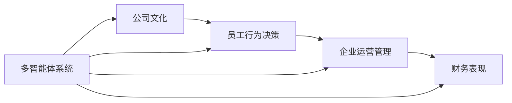

# 多智能体系统在公司文化与财务表现相关性分析中的应用

> 关键词：多智能体系统、公司文化、财务表现、相关性分析、复杂系统建模

> 摘要：本文深入探讨了多智能体系统在公司文化与财务表现相关性分析中的应用。首先介绍了研究的背景、目的、预期读者等内容，阐述了核心概念及其联系，详细讲解了核心算法原理与操作步骤，给出了相关数学模型和公式并举例说明。通过项目实战展示了如何运用多智能体系统进行分析，包括开发环境搭建、源代码实现与解读。接着探讨了实际应用场景，推荐了学习资源、开发工具框架以及相关论文著作。最后总结了未来发展趋势与挑战，并对常见问题进行了解答，为相关研究和实践提供了全面的参考。

## 1. 背景介绍 
### 1.1 目的和范围
在当今复杂多变的商业环境中，公司文化对企业的生存和发展起着至关重要的作用。公司文化涵盖了企业的价值观、信仰、行为准则等方面，它潜移默化地影响着员工的行为和决策，进而对公司的财务表现产生影响。然而，公司文化与财务表现之间的关系并非简单的线性关系，而是一个复杂的、动态的系统。传统的分析方法往往难以全面、深入地揭示这种复杂关系。

本研究的目的在于引入多智能体系统这一先进的建模和分析工具，来深入探究公司文化与财务表现之间的相关性。多智能体系统能够模拟多个自主的智能体之间的交互和行为，从而更好地反映现实世界中的复杂系统。通过运用多智能体系统，我们可以模拟不同公司文化下员工的行为、决策过程，以及这些行为对公司财务指标的影响，从而为企业管理者提供更有针对性的决策建议。

本研究的范围主要集中在运用多智能体系统对公司文化与财务表现的相关性进行理论分析和实证研究。具体包括构建多智能体模型、设计智能体的行为规则、分析模型的模拟结果等方面。

### 1.2 预期读者
本文的预期读者主要包括以下几类人群：
- **企业管理者**：他们可以通过本文了解如何运用多智能体系统来分析公司文化与财务表现的关系，从而制定更合理的企业文化战略和财务管理策略，提升企业的竞争力和盈利能力。
- **学术研究人员**：对于从事管理学、经济学、计算机科学等领域研究的学者来说，本文提供了一个跨学科研究的范例，为他们进一步深入研究公司文化、财务表现以及多智能体系统的应用提供了新的思路和方法。
- **计算机编程人员**：文中详细介绍了多智能体系统的算法原理和Python代码实现，对于对人工智能、复杂系统建模感兴趣的编程人员来说，是一个很好的学习和实践案例。

### 1.3 文档结构概述
本文的文档结构如下：
- **核心概念与联系**：介绍多智能体系统、公司文化和财务表现的核心概念，以及它们之间的相互关系，并通过文本示意图和Mermaid流程图进行直观展示。
- **核心算法原理 & 具体操作步骤**：详细讲解多智能体系统的核心算法原理，并给出具体的Python代码实现和操作步骤。
- **数学模型和公式 & 详细讲解 & 举例说明**：建立多智能体系统分析公司文化与财务表现相关性的数学模型，给出相关公式，并通过具体例子进行详细说明。
- **项目实战：代码实际案例和详细解释说明**：通过一个实际的项目案例，展示如何运用多智能体系统进行公司文化与财务表现相关性分析，包括开发环境搭建、源代码实现和代码解读。
- **实际应用场景**：探讨多智能体系统在公司文化与财务表现相关性分析中的实际应用场景，为企业管理者提供实践指导。
- **工具和资源推荐**：推荐学习多智能体系统和相关领域的书籍、在线课程、技术博客和网站，以及开发工具框架和相关论文著作。
- **总结：未来发展趋势与挑战**：总结多智能体系统在公司文化与财务表现相关性分析中的应用现状，展望未来的发展趋势，并分析可能面临的挑战。
- **附录：常见问题与解答**：对读者可能关心的常见问题进行解答，帮助读者更好地理解和应用本文的内容。
- **扩展阅读 & 参考资料**：提供相关的扩展阅读材料和参考资料，方便读者进一步深入研究。

### 1.4 术语表
#### 1.4.1 核心术语定义
- **多智能体系统（Multi - Agent System, MAS）**：由多个自主的智能体组成的系统，这些智能体能够感知环境、进行决策并采取行动，通过相互之间的交互来实现系统的整体目标。
- **公司文化（Corporate Culture）**：企业在长期的发展过程中形成的价值观、信仰、行为准则、传统习惯等精神和物质层面的总和，它影响着企业员工的行为和决策。
- **财务表现（Financial Performance）**：企业在一定时期内的财务状况和经营成果的综合体现，通常通过一系列财务指标来衡量，如净利润、资产回报率、销售增长率等。

#### 1.4.2 相关概念解释
- **智能体（Agent）**：在多智能体系统中，智能体是具有自主性、反应性、社会性和能动性的实体。自主性指智能体能够独立地进行决策和行动；反应性指智能体能够感知环境的变化并做出相应的反应；社会性指智能体能够与其他智能体进行交互；能动性指智能体能够主动地追求自己的目标。
- **环境（Environment）**：多智能体系统中智能体所处的外部世界，它提供了智能体感知和行动的场所。在公司文化与财务表现相关性分析中，环境可以包括市场环境、政策环境等。
- **交互（Interaction）**：智能体之间以及智能体与环境之间的相互作用。在多智能体系统中，交互是实现系统整体目标的关键。

#### 1.4.3 缩略词列表
- MAS：Multi - Agent System（多智能体系统）
- ROI：Return on Investment（投资回报率）
- ROA：Return on Assets（资产回报率）
- EPS：Earnings Per Share（每股收益）

## 2. 核心概念与联系 

### 核心概念原理
#### 多智能体系统原理
多智能体系统基于分布式人工智能的思想，通过多个智能体的协作来完成复杂的任务。每个智能体都有自己的目标、知识和能力，它们通过感知环境、与其他智能体进行通信和交互，不断调整自己的行为以适应环境的变化。在多智能体系统中，智能体的行为可以分为个体行为和群体行为。个体行为是指智能体根据自己的目标和感知到的环境信息做出的决策和行动；群体行为是指多个智能体通过协作和交互形成的整体行为模式。

#### 公司文化原理
公司文化是企业的灵魂和精神支柱，它对企业的各个方面都有着深远的影响。公司文化可以分为物质文化、行为文化、制度文化和精神文化四个层面。物质文化是公司文化的外在表现，包括企业的产品、设施、环境等；行为文化是企业员工的行为方式和习惯，它反映了企业的价值观和行为准则；制度文化是企业的规章制度和管理体系，它规范了员工的行为和企业的运营；精神文化是公司文化的核心，包括企业的价值观、使命、愿景等，它为企业的发展提供了方向和动力。

#### 财务表现原理
财务表现是企业经营成果的量化体现，它通过一系列财务指标来衡量。常见的财务指标包括盈利能力指标（如净利润、毛利率、净利率等）、偿债能力指标（如资产负债率、流动比率、速动比率等）、运营能力指标（如存货周转率、应收账款周转率、总资产周转率等）和发展能力指标（如销售增长率、净利润增长率、资产增长率等）。这些指标相互关联，共同反映了企业的财务状况和经营能力。

### 核心概念之间的联系
公司文化通过影响员工的行为和决策，进而影响企业的运营和管理，最终对财务表现产生影响。例如，一个具有创新文化的企业，员工更愿意尝试新的想法和方法，这可能会促进企业的产品创新和技术进步，从而提高企业的市场竞争力和盈利能力。多智能体系统可以用来模拟公司文化对员工行为的影响，以及员工行为对财务表现的影响。通过建立多智能体模型，我们可以将公司文化、员工行为和财务表现等因素纳入到一个统一的框架中进行分析，从而更深入地理解它们之间的关系。

### 文本示意图
```plaintext
         +-----------------+
         |   公司文化    |
         +-----------------+
                |
                v
         +-----------------+
         |  员工行为决策  |
         +-----------------+
                |
                v
         +-----------------+
         |   企业运营管理  |
         +-----------------+
                |
                v
         +-----------------+
         |   财务表现    |
         +-----------------+
                ^
                |
         +-----------------+
         |  多智能体系统  |
         +-----------------+
```

### Mermaid流程图


## 3. 核心算法原理 & 具体操作步骤 

### 核心算法原理
在多智能体系统中，常用的算法包括基于规则的算法、基于机器学习的算法和基于博弈论的算法等。在公司文化与财务表现相关性分析中，我们可以采用基于规则的算法来模拟智能体（员工）的行为。

基于规则的算法的基本思想是为每个智能体定义一组行为规则，智能体根据自己感知到的环境信息和这些规则来做出决策和行动。例如，我们可以定义以下规则：
- 如果员工感知到公司文化鼓励创新，并且当前有一个新的项目机会，那么员工有一定的概率选择参与该项目。
- 如果员工参与的项目成功，那么员工的绩效得分会增加，同时公司的财务收入也会相应增加。

### 具体操作步骤
#### 步骤1：定义智能体类
```python
class Agent:
    def __init__(self, id, culture_perception):
        self.id = id
        self.culture_perception = culture_perception
        self.performance_score = 0

    def make_decision(self, project_opportunity):
        if self.culture_perception == 'innovation_encouraged' and project_opportunity:
            import random
            if random.random() < 0.8:  # 80%的概率参与项目
                return True
        return False

    def update_performance(self, project_success):
        if project_success:
            self.performance_score += 1
```

#### 步骤2：定义环境类
```python
class Environment:
    def __init__(self, company_culture):
        self.company_culture = company_culture
        self.agents = []
        self.financial_income = 0

    def add_agent(self, agent):
        agent.culture_perception = self.company_culture
        self.agents.append(agent)

    def generate_project_opportunity(self):
        import random
        return random.random() < 0.5  # 50%的概率出现项目机会

    def run_project(self, agent):
        import random
        project_success = random.random() < 0.7  # 70%的概率项目成功
        agent.update_performance(project_success)
        if project_success:
            self.financial_income += 1000  # 项目成功，公司财务收入增加1000
```

#### 步骤3：模拟过程
```python
# 创建环境
env = Environment('innovation_encouraged')

# 创建智能体
for i in range(10):
    agent = Agent(i, '')
    env.add_agent(agent)

# 模拟多个时间步
for t in range(10):
    for agent in env.agents:
        project_opportunity = env.generate_project_opportunity()
        if agent.make_decision(project_opportunity):
            env.run_project(agent)

# 输出结果
print("公司财务收入:", env.financial_income)
for agent in env.agents:
    print(f"员工 {agent.id} 的绩效得分:", agent.performance_score)
```

### 代码解释
- **Agent类**：代表员工智能体，包含员工的ID、对公司文化的感知和绩效得分。`make_decision`方法根据公司文化感知和项目机会来决定是否参与项目；`update_performance`方法根据项目是否成功来更新员工的绩效得分。
- **Environment类**：代表企业环境，包含公司文化、智能体列表和财务收入。`add_agent`方法将智能体添加到环境中，并更新其对公司文化的感知；`generate_project_opportunity`方法随机生成项目机会；`run_project`方法模拟项目的执行过程，并根据项目是否成功更新员工的绩效得分和公司的财务收入。
- **模拟过程**：首先创建一个环境和多个智能体，然后模拟多个时间步，在每个时间步中，每个智能体根据项目机会做出决策，如果参与项目，则执行项目并更新绩效得分和财务收入。最后输出公司的财务收入和每个员工的绩效得分。

## 4. 数学模型和公式 & 详细讲解 & 举例说明 

### 数学模型
我们可以建立一个简单的数学模型来描述公司文化、员工行为和财务表现之间的关系。假设公司有 $n$ 个员工，每个员工 $i$ 有一个绩效得分 $p_i$，公司的财务收入 $F$ 可以表示为：

$$F = \sum_{i = 1}^{n} w_i p_i + \epsilon$$

其中，$w_i$ 是员工 $i$ 的绩效得分对公司财务收入的权重，$\epsilon$ 是一个随机误差项，代表其他未考虑到的因素对财务收入的影响。

员工的绩效得分 $p_i$ 可以受到公司文化 $C$ 和员工的行为决策 $d_i$ 的影响。假设员工的行为决策 $d_i$ 是一个二元变量，$d_i = 1$ 表示员工参与项目，$d_i = 0$ 表示员工不参与项目。则员工的绩效得分可以表示为：

$$p_i = f(C, d_i) + \delta_i$$

其中，$f(C, d_i)$ 是一个函数，描述了公司文化和员工行为决策对绩效得分的影响，$\delta_i$ 是一个随机误差项，代表其他未考虑到的因素对员工绩效得分的影响。

### 详细讲解
- **财务收入公式**：公司的财务收入是由所有员工的绩效得分加权求和得到的，每个员工的绩效得分对财务收入的贡献由权重 $w_i$ 决定。随机误差项 $\epsilon$ 考虑了市场波动、政策变化等外部因素对财务收入的影响。
- **绩效得分公式**：员工的绩效得分是由公司文化和员工的行为决策共同决定的。函数 $f(C, d_i)$ 可以根据具体的公司文化和行为决策规则来定义。例如，如果公司文化鼓励创新，员工参与创新项目的绩效得分可能会更高。随机误差项 $\delta_i$ 考虑了员工个人能力、运气等因素对绩效得分的影响。

### 举例说明
假设公司有 3 个员工，员工 1、员工 2 和员工 3 的绩效得分分别为 $p_1 = 8$，$p_2 = 6$，$p_3 = 7$，他们的绩效得分对公司财务收入的权重分别为 $w_1 = 0.3$，$w_2 = 0.3$，$w_3 = 0.4$，随机误差项 $\epsilon = 100$。则公司的财务收入为：

$$F = 0.3\times8 + 0.3\times6 + 0.4\times7 + 100 = 2.4 + 1.8 + 2.8 + 100 = 107$$

假设公司文化鼓励创新，员工 1 参与了一个创新项目（$d_1 = 1$），员工 2 没有参与项目（$d_2 = 0$），员工 3 参与了一个常规项目（$d_3 = 1$）。函数 $f(C, d_i)$ 定义如下：

- 当 $C$ 为鼓励创新，$d_i = 1$ 且项目为创新项目时，$f(C, d_i) = 8$
- 当 $C$ 为鼓励创新，$d_i = 1$ 且项目为常规项目时，$f(C, d_i) = 6$
- 当 $d_i = 0$ 时，$f(C, d_i) = 0$

随机误差项 $\delta_1 = 0$，$\delta_2 = 0$，$\delta_3 = 1$。则员工 1、员工 2 和员工 3 的绩效得分分别为：

$$p_1 = f(C, d_1) + \delta_1 = 8 + 0 = 8$$
$$p_2 = f(C, d_2) + \delta_2 = 0 + 0 = 0$$
$$p_3 = f(C, d_3) + \delta_3 = 6 + 1 = 7$$

## 5. 项目实战：代码实际案例和详细解释说明 

### 5.1  开发环境搭建
#### 操作系统
本项目可以在 Windows、Linux 或 macOS 操作系统上进行开发。建议使用较新的操作系统版本，以确保兼容性和性能。

#### Python 环境
安装 Python 3.6 及以上版本。可以从 Python 官方网站（https://www.python.org/downloads/）下载并安装适合你操作系统的 Python 版本。

#### 开发工具
推荐使用 PyCharm 作为开发工具，它是一款功能强大的 Python 集成开发环境（IDE），提供了代码编辑、调试、自动完成等丰富的功能。也可以使用其他轻量级的代码编辑器，如 Visual Studio Code。

#### 依赖库安装
本项目需要使用一些 Python 依赖库，如 `numpy`、`matplotlib` 等。可以使用以下命令来安装这些依赖库：
```sh
pip install numpy matplotlib
```

### 5.2  源代码详细实现和代码解读
```python
import numpy as np
import matplotlib.pyplot as plt

# 定义智能体类
class Agent:
    def __init__(self, id, culture_perception):
        self.id = id
        self.culture_perception = culture_perception
        self.performance_score = 0
        self.project_participation = 0

    def make_decision(self, project_opportunity):
        if self.culture_perception == 'innovation_encouraged' and project_opportunity:
            import random
            if random.random() < 0.8:  # 80%的概率参与项目
                self.project_participation = 1
                return True
        self.project_participation = 0
        return False

    def update_performance(self, project_success):
        if project_success:
            self.performance_score += 1

# 定义环境类
class Environment:
    def __init__(self, company_culture, num_agents):
        self.company_culture = company_culture
        self.agents = []
        self.financial_income = 0
        self.time_steps = []
        self.financial_incomes = []

        for i in range(num_agents):
            agent = Agent(i, '')
            self.add_agent(agent)

    def add_agent(self, agent):
        agent.culture_perception = self.company_culture
        self.agents.append(agent)

    def generate_project_opportunity(self):
        import random
        return random.random() < 0.5  # 50%的概率出现项目机会

    def run_project(self, agent):
        import random
        project_success = random.random() < 0.7  # 70%的概率项目成功
        agent.update_performance(project_success)
        if project_success:
            self.financial_income += 1000  # 项目成功，公司财务收入增加1000

    def simulate(self, num_steps):
        for t in range(num_steps):
            for agent in self.agents:
                project_opportunity = self.generate_project_opportunity()
                if agent.make_decision(project_opportunity):
                    self.run_project(agent)
            self.time_steps.append(t)
            self.financial_incomes.append(self.financial_income)

    def plot_financial_income(self):
        plt.plot(self.time_steps, self.financial_incomes)
        plt.xlabel('Time Steps')
        plt.ylabel('Financial Income')
        plt.title('Company Financial Income over Time')
        plt.show()

# 主程序
if __name__ == "__main__":
    company_culture = 'innovation_encouraged'
    num_agents = 20
    num_steps = 50

    env = Environment(company_culture, num_agents)
    env.simulate(num_steps)
    env.plot_financial_income()
```

### 代码解读与分析
- **Agent类**：
  - `__init__` 方法：初始化智能体的 ID、对公司文化的感知、绩效得分和项目参与情况。
  - `make_decision` 方法：根据公司文化感知和项目机会来决定是否参与项目，并更新项目参与情况。
  - `update_performance` 方法：根据项目是否成功来更新员工的绩效得分。

- **Environment类**：
  - `__init__` 方法：初始化公司文化、智能体列表、财务收入、时间步列表和财务收入列表，并创建指定数量的智能体。
  - `add_agent` 方法：将智能体添加到环境中，并更新其对公司文化的感知。
  - `generate_project_opportunity` 方法：随机生成项目机会。
  - `run_project` 方法：模拟项目的执行过程，并根据项目是否成功更新员工的绩效得分和公司的财务收入。
  - `simulate` 方法：模拟指定数量的时间步，在每个时间步中，每个智能体根据项目机会做出决策，如果参与项目，则执行项目并更新绩效得分和财务收入，同时记录时间步和财务收入。
  - `plot_financial_income` 方法：绘制公司财务收入随时间的变化曲线。

- **主程序**：
  - 定义公司文化、智能体数量和模拟时间步数。
  - 创建环境对象并调用 `simulate` 方法进行模拟。
  - 调用 `plot_financial_income` 方法绘制财务收入曲线。

通过这个项目实战，我们可以直观地看到公司文化对员工行为和公司财务表现的影响。在鼓励创新的公司文化下，员工更愿意参与项目，从而可能提高公司的财务收入。

## 6. 实际应用场景 
### 企业文化战略制定
企业管理者可以运用多智能体系统来分析不同企业文化对财务表现的影响，从而制定更合理的企业文化战略。例如，通过模拟不同的企业文化场景，如创新文化、团队合作文化等，观察员工的行为变化和公司财务指标的变化，选择最适合企业发展的文化方向。

### 员工激励机制设计
多智能体系统可以帮助企业管理者了解员工在不同激励机制下的行为和绩效表现。通过模拟不同的激励方案，如奖金激励、晋升激励等，分析员工的参与度、工作积极性和绩效得分的变化，从而设计出更有效的员工激励机制，提高企业的财务绩效。

### 风险评估与管理
在企业面临各种风险时，如市场风险、竞争风险等，多智能体系统可以模拟员工在不同风险情况下的行为和决策，以及这些行为对公司财务表现的影响。通过分析模拟结果，企业管理者可以提前制定应对策略，降低风险对企业财务的影响。

### 战略规划与决策
企业在制定战略规划时，需要考虑企业文化和财务表现之间的关系。多智能体系统可以为企业管理者提供一个决策支持工具，通过模拟不同的战略方案，分析其对企业文化和财务表现的影响，从而选择最优的战略方案。

## 7. 工具和资源推荐
### 7.1 学习资源推荐
#### 7.1.1 书籍推荐
- 《多智能体系统：原理、设计与应用》：本书全面介绍了多智能体系统的基本原理、设计方法和应用案例，是学习多智能体系统的经典教材。
- 《公司文化与领导力》：探讨了公司文化的形成、发展和变革，以及文化与领导力的关系，对理解公司文化有很大的帮助。
- 《财务管理学》：系统介绍了财务管理的基本理论、方法和技术，是学习财务表现分析的重要参考书。

#### 7.1.2 在线课程
- Coursera 上的“Multi - Agent Systems”课程：由知名高校的教授授课，详细讲解了多智能体系统的理论和实践。
- edX 上的“Corporate Finance”课程：提供了全面的公司财务知识，包括财务报表分析、资本预算、融资决策等内容。
- Udemy 上的“Python for Data Science and Machine Learning Bootcamp”课程：学习 Python 编程和数据分析的实用课程，对实现多智能体系统的代码有很大的帮助。

#### 7.1.3 技术博客和网站
- AI Time 论道：专注于人工智能领域的技术分享和交流，有很多关于多智能体系统的文章和视频。
- 开源中国：提供了丰富的开源项目和技术文章，包括多智能体系统的相关内容。
- 中国知网：可以搜索到大量关于公司文化、财务表现和多智能体系统的学术论文和研究报告。

### 7.2 开发工具框架推荐
#### 7.2.1 IDE和编辑器
- PyCharm：功能强大的 Python 集成开发环境，提供了代码编辑、调试、自动完成等丰富的功能。
- Visual Studio Code：轻量级的代码编辑器，支持多种编程语言，有丰富的插件可以扩展功能。

#### 7.2.2 调试和性能分析工具
- PySnooper：可以自动记录 Python 代码的执行过程，方便调试和分析代码。
- cProfile：Python 内置的性能分析工具，可以分析代码的运行时间和函数调用情况。

#### 7.2.3 相关框架和库
- Mesa：一个用于构建多智能体系统的 Python 框架，提供了丰富的工具和模型，方便快速开发多智能体系统。
- NumPy：Python 中用于科学计算的基础库，提供了高效的数组操作和数学函数。
- Matplotlib：Python 中用于数据可视化的库，可以绘制各种类型的图表，方便展示模拟结果。

### 7.3 相关论文著作推荐
#### 7.3.1 经典论文
- “Multi - Agent Systems: A Modern Approach to Distributed Artificial Intelligence”：这篇论文系统地介绍了多智能体系统的基本概念、理论和方法，是多智能体系统领域的经典之作。
- “Corporate Culture and Economic Performance”：研究了公司文化与经济绩效之间的关系，提出了一些重要的理论和观点。

#### 7.3.2 最新研究成果
- 在 IEEE Transactions on Systems, Man, and Cybernetics 等学术期刊上可以找到多智能体系统在各个领域的最新研究成果。
- 在管理学和经济学领域的顶级期刊上，如 Academy of Management Journal、Journal of Financial Economics 等，也有关于公司文化和财务表现相关性的最新研究。

#### 7.3.3 应用案例分析
- 一些知名企业的案例分析报告，如谷歌、苹果等公司的企业文化和财务表现分析，可以为我们提供实际应用的参考。
- 咨询公司发布的行业研究报告，也包含了很多关于公司文化和财务表现的应用案例。

## 8. 总结：未来发展趋势与挑战
### 未来发展趋势
- **与大数据和人工智能的深度融合**：随着大数据和人工智能技术的不断发展，多智能体系统可以结合更多的数据和先进的算法，提高模型的准确性和预测能力。例如，可以利用大数据分析员工的行为数据和市场数据，为多智能体系统提供更丰富的信息；利用深度学习算法优化智能体的决策模型，提高智能体的智能水平。
- **跨领域应用的拓展**：多智能体系统在公司文化与财务表现相关性分析中的应用只是一个开始，未来它将在更多的领域得到应用，如供应链管理、城市规划、医疗保健等。通过模拟不同领域中多个主体之间的交互和行为，可以更好地理解和解决复杂的实际问题。
- **实时模拟和动态调整**：未来的多智能体系统将具备实时模拟和动态调整的能力。企业可以根据实时的市场变化和内部情况，及时调整多智能体模型的参数和规则，实现对公司文化和财务表现的实时监测和优化。

### 挑战
- **模型的复杂性和可解释性**：多智能体系统的模型往往比较复杂，包含多个智能体和复杂的交互规则，这使得模型的理解和解释变得困难。如何在保证模型准确性的前提下，提高模型的可解释性，是一个需要解决的问题。
- **数据的获取和质量**：多智能体系统的建模和分析需要大量的数据支持，包括员工的行为数据、公司的财务数据等。然而，数据的获取往往面临着隐私保护、数据安全等问题，同时数据的质量也会影响模型的准确性。
- **计算资源的需求**：随着多智能体系统模型的规模和复杂度的增加，对计算资源的需求也会越来越大。如何在有限的计算资源下，实现高效的模拟和分析，是一个挑战。

## 9. 附录：常见问题与解答
### 问题1：多智能体系统在公司文化与财务表现相关性分析中的优势是什么？
答：多智能体系统能够模拟多个自主的智能体之间的交互和行为，更好地反映现实世界中的复杂系统。在公司文化与财务表现相关性分析中，它可以模拟不同公司文化下员工的行为、决策过程，以及这些行为对公司财务指标的影响，从而更深入地揭示两者之间的复杂关系，为企业管理者提供更有针对性的决策建议。

### 问题2：如何确定多智能体模型中的参数和规则？
答：多智能体模型中的参数和规则可以通过以下几种方式确定：
- **理论分析**：根据相关的管理学、经济学理论，确定参数和规则的取值范围和逻辑关系。
- **经验数据**：收集企业的历史数据，如员工的行为数据、财务数据等，通过数据分析来确定参数和规则。
- **实验和模拟**：通过多次实验和模拟，调整参数和规则，使模型的输出结果与实际情况相符。

### 问题3：多智能体系统的模拟结果是否可靠？
答：多智能体系统的模拟结果的可靠性受到多种因素的影响，如模型的准确性、参数的合理性、数据的质量等。为了提高模拟结果的可靠性，可以采取以下措施：
- **验证和校准模型**：使用实际数据对模型进行验证和校准，确保模型能够准确地反映现实情况。
- **敏感性分析**：对模型中的参数进行敏感性分析，了解参数的变化对模拟结果的影响，从而确定参数的取值范围。
- **多次模拟和统计分析**：进行多次模拟，并对模拟结果进行统计分析，以减少随机误差的影响。

### 问题4：多智能体系统在实际应用中面临哪些困难？
答：多智能体系统在实际应用中面临以下困难：
- **模型的复杂性**：多智能体系统的模型往往比较复杂，需要考虑多个智能体之间的交互和行为，这增加了模型的开发和维护难度。
- **数据的获取和处理**：多智能体系统的建模和分析需要大量的数据支持，数据的获取和处理面临着隐私保护、数据安全等问题。
- **计算资源的需求**：随着多智能体系统模型的规模和复杂度的增加，对计算资源的需求也会越来越大，需要具备强大的计算能力。

## 10. 扩展阅读 & 参考资料
### 扩展阅读
- 《复杂系统科学与管理》：介绍了复杂系统科学的基本理论和方法，以及在管理领域的应用，对理解多智能体系统在公司文化与财务表现相关性分析中的应用有很大的帮助。
- 《人工智能：现代方法》：全面介绍了人工智能的基本概念、理论和方法，包括多智能体系统、机器学习等内容，是学习人工智能的经典教材。

### 参考资料
- [1] Weiss G. Multiagent Systems: A Modern Approach to Distributed Artificial Intelligence[M]. MIT press, 1999.
- [2] Kotter J P, Heskett J L. Corporate Culture and Economic Performance[M]. Free Press, 1992.
- [3] Mesa: A Python framework for agent - based modeling. https://mesa.readthedocs.io/

作者：AI天才研究院/AI Genius Institute & 禅与计算机程序设计艺术 /Zen And The Art of Computer Programming