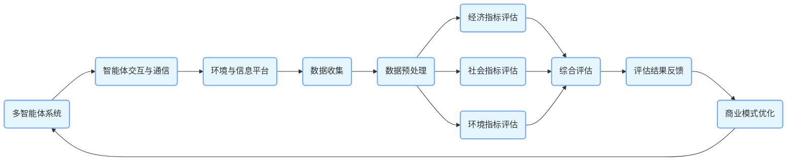

# 多智能体系统在商业模式可持续性评估中的应用

> 关键词：多智能体系统、商业模式可持续性评估、智能体交互、数学模型、项目实战

> 摘要：本文聚焦于多智能体系统在商业模式可持续性评估中的应用。首先介绍了相关背景，包括目的范围、预期读者等内容。接着阐述了多智能体系统及商业模式可持续性评估的核心概念与联系，并给出示意图和流程图。详细讲解了核心算法原理和具体操作步骤，结合Python代码进行说明。深入分析了数学模型和公式，并举例阐释。通过项目实战展示代码实现和解读。探讨了实际应用场景，推荐了学习、开发相关的工具和资源。最后总结了未来发展趋势与挑战，提供常见问题解答和扩展阅读参考资料，旨在为该领域的研究和实践提供全面且深入的指导。

## 1. 背景介绍 
### 1.1 目的和范围
随着全球经济的快速发展和市场竞争的日益激烈，商业模式的可持续性成为企业关注的核心问题之一。多智能体系统作为一种强大的建模和分析工具，能够模拟复杂的商业环境和主体间的交互行为，为商业模式可持续性评估提供了新的视角和方法。本文的目的在于深入探讨多智能体系统在商业模式可持续性评估中的应用，详细介绍其原理、方法和实践案例，为企业和研究人员提供全面的理论和实践指导。范围涵盖多智能体系统的基本概念、商业模式可持续性评估的指标体系、核心算法原理、数学模型以及实际应用场景等方面。

### 1.2 预期读者
本文的预期读者包括企业管理人员、市场营销人员、战略规划人员，他们可以通过本文了解如何利用多智能体系统评估商业模式的可持续性，为企业决策提供科学依据；计算机科学、管理学、经济学等相关专业的研究人员和学生，他们可以从本文中获取多智能体系统在商业模式评估领域的最新研究成果和应用案例，为进一步的学术研究和实践提供参考；以及对人工智能、商业分析等领域感兴趣的技术爱好者，他们可以通过本文了解多智能体系统的应用场景和实际价值。

### 1.3 文档结构概述
本文共分为十个部分。第一部分为背景介绍，阐述了文章的目的、范围、预期读者和文档结构概述，并给出了相关术语的定义和解释。第二部分介绍了多智能体系统和商业模式可持续性评估的核心概念与联系，通过文本示意图和Mermaid流程图展示其架构。第三部分详细讲解了核心算法原理和具体操作步骤，结合Python代码进行说明。第四部分分析了数学模型和公式，并通过具体例子进行解释。第五部分是项目实战，包括开发环境搭建、源代码详细实现和代码解读。第六部分探讨了多智能体系统在商业模式可持续性评估中的实际应用场景。第七部分推荐了学习、开发相关的工具和资源，包括书籍、在线课程、技术博客、IDE、调试工具、相关框架和库以及论文著作等。第八部分总结了未来发展趋势与挑战。第九部分为附录，提供常见问题与解答。第十部分列出了扩展阅读和参考资料。

### 1.4 术语表
#### 1.4.1 核心术语定义
- **多智能体系统（Multi - Agent System，MAS）**：由多个智能体组成的系统，每个智能体具有自主决策和行为能力，能够与其他智能体和环境进行交互，以实现系统的整体目标。
- **智能体（Agent）**：具有感知、决策和行动能力的实体，能够根据自身的知识和目标，对环境变化做出响应，并与其他智能体进行通信和协作。
- **商业模式可持续性**：指商业模式在经济、社会和环境三个维度上的长期稳定性和可行性，能够在满足企业经济利益的同时，兼顾社会和环境的可持续发展。
- **评估指标体系**：用于衡量商业模式可持续性的一系列指标的集合，包括经济指标（如利润率、市场份额等）、社会指标（如员工满意度、社会责任履行情况等）和环境指标（如能源消耗、废弃物排放等）。

#### 1.4.2 相关概念解释
- **自主决策**：智能体能够根据自身的内部状态和外部环境信息，独立地做出决策，而不需要外部的直接干预。
- **交互行为**：智能体之间通过通信、协作、竞争等方式进行信息交换和行为协调的过程。
- **系统涌现性**：多智能体系统中，由于智能体之间的交互和协作，系统整体表现出的一些无法通过单个智能体行为简单预测的特性和行为。

#### 1.4.3 缩略词列表
- **MAS**：Multi - Agent System（多智能体系统）
- **GDP**：Gross Domestic Product（国内生产总值）
- **CSR**：Corporate Social Responsibility（企业社会责任）

## 2. 核心概念与联系 

### 核心概念原理
#### 多智能体系统原理
多智能体系统的核心原理基于分布式人工智能的思想，将复杂的系统分解为多个相对独立的智能体。每个智能体具有一定的自主性和智能性，能够感知周围环境的信息，并根据自身的目标和规则进行决策和行动。智能体之间通过通信机制进行信息交换和协作，以实现系统的整体目标。例如，在一个商业模拟环境中，每个企业可以被看作一个智能体，它们根据市场需求、竞争对手的行为等信息，自主地决定生产、销售等策略，并与其他企业进行合作或竞争。

#### 商业模式可持续性评估原理
商业模式可持续性评估是一个综合考量经济、社会和环境三个维度的过程。通过建立一套科学合理的评估指标体系，收集和分析相关数据，对商业模式在各个维度上的表现进行量化评估。例如，经济维度可以通过利润率、资产回报率等指标来衡量；社会维度可以通过员工满意度、社区贡献等指标来衡量；环境维度可以通过能源消耗、碳排放等指标来衡量。最终，根据评估结果，对商业模式进行优化和改进，以提高其可持续性。

### 架构的文本示意图
```plaintext
多智能体系统在商业模式可持续性评估中的架构

                多智能体系统
                ┌─────────────┐
                │ 智能体集合  │
                │ ┌─────────┐ │
                │ │ 智能体 1 │ │
                │ ├─────────┤ │
                │ │ 智能体 2 │ │
                │ ├─────────┤ │
                │ │  ...   │ │
                │ ├─────────┤ │
                │ │ 智能体 n │ │
                │ └─────────┘ │
                └─────────────┘
                       │
                       │ 交互与通信
                       ▼
                环境与信息平台
                ┌─────────────┐
                │ 市场信息   │
                │ 社会信息   │
                │ 环境信息   │
                └─────────────┘
                       │
                       │ 数据收集与分析
                       ▼
         商业模式可持续性评估模块
         ┌─────────────────────┐
         │ 经济指标评估       │
         │ 社会指标评估       │
         │ 环境指标评估       │
         │ 综合评估与反馈     │
         └─────────────────────┘
```

### Mermaid 流程图


## 3. 核心算法原理 & 具体操作步骤 

### 核心算法原理
在多智能体系统用于商业模式可持续性评估中，常用的核心算法之一是基于强化学习的算法。强化学习是一种机器学习方法，智能体通过与环境进行交互，不断尝试不同的行动，并根据环境给予的奖励信号来学习最优的行动策略。

以Q - learning算法为例，其核心思想是通过维护一个Q表来记录每个状态 - 行动对的价值。智能体在每个时间步根据当前状态选择一个行动，执行该行动后进入下一个状态，并获得一个奖励。然后，根据奖励和下一个状态的最大Q值来更新当前状态 - 行动对的Q值。

### Python源代码详细阐述
```python
import numpy as np

# 定义Q - learning算法类
class QLearningAgent:
    def __init__(self, state_size, action_size, learning_rate=0.1, discount_factor=0.9, exploration_rate=1.0, exploration_decay=0.995):
        self.state_size = state_size
        self.action_size = action_size
        self.learning_rate = learning_rate
        self.discount_factor = discount_factor
        self.exploration_rate = exploration_rate
        self.exploration_decay = exploration_decay
        # 初始化Q表
        self.q_table = np.zeros((state_size, action_size))

    def act(self, state):
        # 以一定概率进行随机探索
        if np.random.rand() <= self.exploration_rate:
            return np.random.choice(self.action_size)
        # 选择Q值最大的行动
        q_values = self.q_table[state, :]
        action = np.argmax(q_values)
        return action

    def learn(self, state, action, reward, next_state):
        # 更新Q表
        predict = self.q_table[state, action]
        target = reward + self.discount_factor * np.max(self.q_table[next_state, :])
        self.q_table[state, action] = (1 - self.learning_rate) * predict + self.learning_rate * target
        # 衰减探索率
        self.exploration_rate *= self.exploration_decay


# 模拟商业模式评估环境
class BusinessModelEnv:
    def __init__(self, num_states, num_actions):
        self.num_states = num_states
        self.num_actions = num_actions
        self.current_state = np.random.randint(0, num_states)

    def step(self, action):
        # 简单模拟状态转移和奖励
        next_state = np.random.randint(0, self.num_states)
        reward = np.random.rand()
        done = False
        return next_state, reward, done


# 主函数
if __name__ == "__main__":
    num_states = 10
    num_actions = 4
    agent = QLearningAgent(num_states, num_actions)
    env = BusinessModelEnv(num_states, num_actions)

    num_episodes = 1000
    for episode in range(num_episodes):
        state = env.current_state
        done = False
        while not done:
            action = agent.act(state)
            next_state, reward, done = env.step(action)
            agent.learn(state, action, reward, next_state)
            state = next_state

    print("Final Q - table:")
    print(agent.q_table)


```

### 具体操作步骤
1. **初始化**：
    - 初始化Q表，将其所有元素初始化为0。
    - 设定学习率 $\alpha$、折扣因子 $\gamma$ 和探索率 $\epsilon$。
2. **智能体行动选择**：
    - 在每个时间步，智能体根据当前状态 $s$ 选择一个行动 $a$。以概率 $\epsilon$ 进行随机探索，选择一个随机行动；以概率 $1 - \epsilon$ 选择Q值最大的行动。
3. **环境交互**：
    - 智能体执行行动 $a$，环境返回下一个状态 $s'$ 和奖励 $r$。
4. **Q表更新**：
    - 根据Q - learning更新公式 $Q(s,a)=(1 - \alpha)Q(s,a)+\alpha[r+\gamma\max_{a'}Q(s',a')]$ 更新Q表。
5. **探索率衰减**：
    - 逐渐减小探索率 $\epsilon$，使得智能体在学习过程中逐渐从探索转向利用。
6. **重复步骤2 - 5**：
    - 直到达到预设的训练轮数或满足其他终止条件。

## 4. 数学模型和公式 & 详细讲解 & 举例说明 

### 数学模型
在多智能体系统用于商业模式可持续性评估中，我们可以将其抽象为一个马尔可夫决策过程（Markov Decision Process，MDP）。一个MDP可以用一个五元组 $(S,A,P,R,\gamma)$ 来表示，其中：
- $S$ 是状态集合，表示商业模式所处的不同状态，例如不同的市场份额、利润率等情况。
- $A$ 是行动集合，表示智能体可以采取的行动，例如调整产品价格、增加研发投入等。
- $P(s'|s,a)$ 是状态转移概率，表示在状态 $s$ 下采取行动 $a$ 后转移到状态 $s'$ 的概率。
- $R(s,a,s')$ 是奖励函数，表示在状态 $s$ 下采取行动 $a$ 转移到状态 $s'$ 时获得的奖励。
- $\gamma$ 是折扣因子，用于衡量未来奖励的重要性，取值范围为 $[0,1]$。

### 公式
#### Q - learning更新公式
$Q(s,a)=(1 - \alpha)Q(s,a)+\alpha[r+\gamma\max_{a'}Q(s',a')]$
其中：
- $Q(s,a)$ 是状态 $s$ 下采取行动 $a$ 的Q值。
- $\alpha$ 是学习率，控制Q值更新的步长。
- $r$ 是执行行动 $a$ 后获得的即时奖励。
- $\gamma$ 是折扣因子。
- $\max_{a'}Q(s',a')$ 是下一个状态 $s'$ 下所有可能行动的最大Q值。

#### 长期累积奖励公式
$G_t=\sum_{k = 0}^{\infty}\gamma^{k}r_{t + k + 1}$
其中 $G_t$ 是从时间步 $t$ 开始的长期累积奖励，$r_{t + k+1}$ 是时间步 $t + k + 1$ 获得的奖励。

### 详细讲解
#### Q - learning更新公式讲解
Q - learning算法的核心是不断更新Q表，以找到最优的行动策略。Q值表示在某个状态下采取某个行动的预期长期累积奖励。更新公式的含义是，新的Q值是旧的Q值和基于即时奖励与下一个状态最大Q值的目标值的加权平均。学习率 $\alpha$ 控制了新旧Q值的权重，当 $\alpha$ 接近1时，更倾向于使用新的信息更新Q值；当 $\alpha$ 接近0时，更倾向于保留旧的Q值。

#### 长期累积奖励公式讲解
长期累积奖励公式考虑了未来所有时间步的奖励，并通过折扣因子 $\gamma$ 对未来奖励进行折扣。这是因为在实际情况中，未来的奖励通常不如即时奖励重要。当 $\gamma$ 接近1时，更看重未来的奖励；当 $\gamma$ 接近0时，更看重即时奖励。

### 举例说明
假设一个商业模式处于状态 $s_1$，智能体选择行动 $a_1$，执行该行动后进入状态 $s_2$ 并获得奖励 $r = 10$。当前 $Q(s_1,a_1)=20$，$\alpha = 0.1$，$\gamma = 0.9$，$\max_{a'}Q(s_2,a') = 30$。

根据Q - learning更新公式：
\[
\begin{align*}
Q(s_1,a_1)&=(1 - 0.1)\times20+0.1\times(10 + 0.9\times30)\\
&=0.9\times20+0.1\times(10 + 27)\\
&=18+0.1\times37\\
&=18 + 3.7\\
&=21.7
\end{align*}
\]

这意味着在执行行动 $a_1$ 后，状态 $s_1$ 下采取行动 $a_1$ 的Q值从20更新为21.7。

## 5. 项目实战：代码实际案例和详细解释说明 

### 5.1  开发环境搭建
#### 操作系统
可以选择Windows、Linux或Mac OS等主流操作系统。本案例在Ubuntu 20.04系统上进行开发。

#### Python环境
安装Python 3.7及以上版本。可以通过以下命令检查Python版本：
```bash
python3 --version
```
如果未安装Python，可以使用以下命令进行安装：
```bash
sudo apt update
sudo apt install python3 python3-pip
```

#### 依赖库安装
本项目需要使用`numpy`库，可通过以下命令进行安装：
```bash
pip3 install numpy
```

### 5.2  源代码详细实现和代码解读
```python
import numpy as np

# 定义Q - learning算法类
class QLearningAgent:
    def __init__(self, state_size, action_size, learning_rate=0.1, discount_factor=0.9, exploration_rate=1.0, exploration_decay=0.995):
        self.state_size = state_size
        self.action_size = action_size
        self.learning_rate = learning_rate
        self.discount_factor = discount_factor
        self.exploration_rate = exploration_rate
        self.exploration_decay = exploration_decay
        # 初始化Q表
        self.q_table = np.zeros((state_size, action_size))

    def act(self, state):
        # 以一定概率进行随机探索
        if np.random.rand() <= self.exploration_rate:
            return np.random.choice(self.action_size)
        # 选择Q值最大的行动
        q_values = self.q_table[state, :]
        action = np.argmax(q_values)
        return action

    def learn(self, state, action, reward, next_state):
        # 更新Q表
        predict = self.q_table[state, action]
        target = reward + self.discount_factor * np.max(self.q_table[next_state, :])
        self.q_table[state, action] = (1 - self.learning_rate) * predict + self.learning_rate * target
        # 衰减探索率
        self.exploration_rate *= self.exploration_decay


# 模拟商业模式评估环境
class BusinessModelEnv:
    def __init__(self, num_states, num_actions):
        self.num_states = num_states
        self.num_actions = num_actions
        self.current_state = np.random.randint(0, num_states)

    def step(self, action):
        # 简单模拟状态转移和奖励
        next_state = np.random.randint(0, self.num_states)
        reward = np.random.rand()
        done = False
        return next_state, reward, done


# 主函数
if __name__ == "__main__":
    num_states = 10
    num_actions = 4
    agent = QLearningAgent(num_states, num_actions)
    env = BusinessModelEnv(num_states, num_actions)

    num_episodes = 1000
    for episode in range(num_episodes):
        state = env.current_state
        done = False
        while not done:
            action = agent.act(state)
            next_state, reward, done = env.step(action)
            agent.learn(state, action, reward, next_state)
            state = next_state

    print("Final Q - table:")
    print(agent.q_table)


```

#### 代码解读
1. **QLearningAgent类**：
    - `__init__`方法：初始化智能体的状态大小、行动大小、学习率、折扣因子、探索率和探索衰减率，并创建一个全零的Q表。
    - `act`方法：根据当前状态选择一个行动。以一定概率进行随机探索，否则选择Q值最大的行动。
    - `learn`方法：根据Q - learning更新公式更新Q表，并衰减探索率。
2. **BusinessModelEnv类**：
    - `__init__`方法：初始化环境的状态数量、行动数量，并随机选择一个初始状态。
    - `step`方法：模拟状态转移和奖励，随机生成下一个状态和奖励。
3. **主函数**：
    - 初始化智能体和环境。
    - 进行1000个训练回合，每个回合中智能体不断与环境交互，选择行动、获取奖励并更新Q表。
    - 最后打印出最终的Q表。

### 5.3  代码解读与分析
#### 优点
- **简单易懂**：代码结构清晰，使用了基本的Python和`numpy`库，易于理解和修改。
- **可扩展性**：可以很容易地扩展到更复杂的商业模式和环境中，例如增加状态数量、行动数量或改进奖励函数。
- **灵活性**：可以通过调整学习率、折扣因子和探索率等参数，优化智能体的学习效果。

#### 缺点
- **模拟环境简单**：`BusinessModelEnv`类只是简单地随机生成状态转移和奖励，与实际的商业模式环境相差较大。
- **缺乏评估指标**：代码中没有对商业模式的可持续性进行具体的评估，只是简单地模拟了智能体的学习过程。

#### 改进方向
- **构建真实环境**：根据实际的商业模式数据，构建更真实的环境模型，例如考虑市场需求、竞争对手行为等因素。
- **引入评估指标**：在奖励函数中引入商业模式可持续性的评估指标，如经济指标、社会指标和环境指标，使智能体的学习目标更加明确。

## 6. 实际应用场景 
### 企业战略规划
企业在制定战略规划时，可以使用多智能体系统模拟不同的商业模式和市场环境。通过设置不同的智能体代表企业自身、竞争对手、客户等，模拟它们之间的交互行为，评估不同商业模式在经济、社会和环境维度上的可持续性。例如，企业可以模拟推出新产品、进入新市场等战略决策，观察这些决策对商业模式可持续性的影响，从而做出更科学的战略选择。

### 供应链管理
在供应链管理中，多智能体系统可以用于评估不同供应链模式的可持续性。每个供应商、制造商、分销商等都可以看作一个智能体，它们之间通过交互进行货物和信息的传递。通过模拟不同的供应链配置和运营策略，评估其在成本控制、社会责任履行和环境影响等方面的表现。例如，评估采用绿色物流、可持续采购等策略对供应链可持续性的提升效果。

### 金融投资决策
金融机构在进行投资决策时，可以利用多智能体系统评估被投资企业的商业模式可持续性。通过分析企业所处的市场环境、竞争态势、社会和环境责任履行情况等因素，模拟企业未来的发展趋势和盈利能力。例如，评估一家新能源企业的商业模式在政策支持、技术创新和市场需求变化等情况下的可持续性，为投资决策提供参考。

### 政府政策制定
政府在制定产业政策时，可以使用多智能体系统模拟不同政策对商业模式可持续性的影响。例如，模拟税收优惠、补贴政策等对企业创新、节能减排等行为的激励效果，评估这些政策对整个产业可持续发展的推动作用。通过多智能体系统的模拟结果，政府可以制定更加科学合理的产业政策，促进经济、社会和环境的协调发展。

## 7. 工具和资源推荐
### 7.1 学习资源推荐
#### 7.1.1 书籍推荐
- 《多智能体系统：原理与编程》：本书全面介绍了多智能体系统的基本原理、设计方法和编程技术，是学习多智能体系统的经典教材。
- 《商业模式新生代》：详细介绍了商业模式的设计和创新方法，提供了丰富的案例和工具，有助于深入理解商业模式的概念和评估方法。
- 《强化学习：原理与Python实现》：深入讲解了强化学习的理论和算法，并通过Python代码进行实现，对于理解多智能体系统中常用的强化学习算法非常有帮助。

#### 7.1.2 在线课程
- Coursera上的“Multi - Agent Systems”课程：由知名高校的教授授课，系统地介绍了多智能体系统的理论和应用。
- edX上的“Business Model Innovation”课程：讲解了商业模式创新的方法和实践，结合实际案例进行分析，有助于提高商业模式评估的能力。
- Udemy上的“Reinforcement Learning A - Z™: Hands - On for Python & Unity”课程：通过实际项目，详细介绍了强化学习的应用和实现，适合初学者学习。

#### 7.1.3 技术博客和网站
- AI Stack Exchange：一个专业的人工智能问答社区，用户可以在这里提问、分享经验和获取最新的技术信息。
- Towards Data Science：提供了大量关于人工智能、机器学习等领域的技术文章和案例分析，对于了解多智能体系统在商业模式评估中的应用有很大帮助。
- OpenAI Blog：OpenAI官方博客，发布了许多关于人工智能前沿技术的研究成果和应用案例，是获取最新技术动态的重要渠道。

### 7.2 开发工具框架推荐
#### 7.2.1 IDE和编辑器
- PyCharm：一款专业的Python集成开发环境，具有代码自动补全、调试、版本控制等功能，适合开发基于Python的多智能体系统。
- Visual Studio Code：一款轻量级的代码编辑器，支持多种编程语言和插件扩展，可通过安装Python相关插件进行多智能体系统的开发。
- Jupyter Notebook：一种交互式的开发环境，适合进行数据探索、算法验证和代码演示，在多智能体系统的研究和开发中广泛使用。

#### 7.2.2 调试和性能分析工具
- PDB：Python自带的调试工具，可以在代码中设置断点，逐行调试代码，帮助定位和解决问题。
- cProfile：Python标准库中的性能分析工具，可以分析代码的运行时间和函数调用情况，找出性能瓶颈。
- TensorBoard：一个可视化工具，可用于监控和分析深度学习模型的训练过程，在使用强化学习算法时可以用于可视化训练指标。

#### 7.2.3 相关框架和库
- Mesa：一个用于构建基于智能体的模型的Python库，提供了丰富的智能体和环境类，方便快速开发多智能体系统。
- Stable - Baselines3：一个基于PyTorch的强化学习库，提供了多种强化学习算法的实现，可用于多智能体系统中的智能体学习。
- NetworkX：一个用于创建、操作和研究复杂网络的Python库，在多智能体系统中可以用于表示智能体之间的交互关系。

### 7.3 相关论文著作推荐
#### 7.3.1 经典论文
- “Multi - Agent Systems: A Modern Approach to Distributed Artificial Intelligence”：该论文系统地介绍了多智能体系统的基本概念、理论和应用，是多智能体系统领域的经典之作。
- “Business Model Innovation: Creating Value in Times of Change”：探讨了商业模式创新的重要性和方法，对商业模式可持续性评估具有重要的指导意义。
- “Reinforcement Learning: An Introduction”：是强化学习领域的经典教材，详细介绍了强化学习的基本原理和算法。

#### 7.3.2 最新研究成果
- 近年来，关于多智能体系统在可持续发展领域的研究不断涌现。例如，一些研究将多智能体系统与区块链技术相结合，用于构建更加可信和可持续的商业模式；另一些研究则关注多智能体系统在绿色供应链管理中的应用，提高供应链的环境可持续性。可以通过IEEE Xplore、ACM Digital Library等学术数据库搜索相关的最新研究论文。

#### 7.3.3 应用案例分析
- 许多企业和研究机构已经开展了多智能体系统在商业模式可持续性评估中的应用实践。例如，一些能源企业使用多智能体系统评估分布式能源商业模式的可持续性；一些金融机构利用多智能体系统评估绿色金融产品的风险和收益。可以通过查阅企业报告、行业研究和学术论文等获取这些应用案例的详细分析。

## 8. 总结：未来发展趋势与挑战
### 未来发展趋势
#### 与新兴技术融合
多智能体系统将与区块链、物联网、大数据等新兴技术深度融合。例如，区块链技术可以为多智能体系统提供可信的交互环境，确保智能体之间的信息安全和交易公平；物联网技术可以为多智能体系统提供丰富的实时数据，使智能体能够更准确地感知环境和做出决策；大数据技术可以用于分析多智能体系统产生的大量数据，挖掘潜在的商业模式和可持续发展机会。

#### 应用领域拓展
多智能体系统在商业模式可持续性评估中的应用将不断拓展到更多领域。除了企业战略规划、供应链管理、金融投资和政府政策制定等领域，还将应用于智慧城市建设、医疗健康、教育等领域。例如，在智慧城市建设中，多智能体系统可以用于优化城市交通、能源管理和公共服务等商业模式的可持续性。

#### 智能体智能化提升
未来的智能体将具有更高的智能化水平，能够进行更复杂的推理和决策。例如，智能体可以通过深度学习等技术自动学习和理解商业模式的特点和规律，预测市场变化和竞争对手行为，从而为商业模式可持续性评估提供更准确的建议。

### 挑战
#### 模型复杂度和计算资源需求
随着多智能体系统的规模和复杂度不断增加，模型的构建和训练需要大量的计算资源和时间。例如，在模拟大规模市场环境和复杂商业模式时，智能体之间的交互和状态转移会变得非常复杂，需要强大的计算能力来支持。如何在有限的计算资源下提高模型的效率和性能是一个亟待解决的问题。

#### 数据质量和隐私保护
多智能体系统的运行依赖于大量的数据，数据的质量和准确性直接影响到评估结果的可靠性。同时，在收集和使用数据的过程中，需要保护数据的隐私和安全。例如，在获取企业的商业数据和用户的个人信息时，需要遵守相关的法律法规和隐私政策，防止数据泄露和滥用。

#### 伦理和社会问题
多智能体系统的应用可能会带来一些伦理和社会问题。例如，智能体的决策可能会对人类的利益产生影响，如何确保智能体的行为符合伦理和社会价值观是一个重要的挑战。此外，多智能体系统的应用可能会导致一些工作岗位的流失，如何应对这些社会问题也是需要考虑的。

## 9. 附录：常见问题与解答
### 问题1：多智能体系统和传统的模拟方法有什么区别？
解答：传统的模拟方法通常是基于确定性的模型，对系统的行为进行预测和分析。而多智能体系统强调智能体的自主性和交互性，每个智能体可以根据自身的目标和规则进行决策和行动，并且能够与其他智能体和环境进行交互。因此，多智能体系统能够更好地模拟复杂系统中的不确定性和动态变化，更适合用于商业模式可持续性评估这样的复杂问题。

### 问题2：如何确定商业模式可持续性评估的指标体系？
解答：确定商业模式可持续性评估的指标体系需要综合考虑经济、社会和环境三个维度。可以参考相关的行业标准和最佳实践，结合企业的具体情况和战略目标，选择合适的指标。例如，经济维度可以选择利润率、资产回报率等指标；社会维度可以选择员工满意度、社会责任履行情况等指标；环境维度可以选择能源消耗、废弃物排放等指标。同时，需要确保指标的可量化和可获取性，以便进行数据收集和分析。

### 问题3：在多智能体系统中，如何处理智能体之间的冲突？
解答：处理智能体之间的冲突可以采用多种方法。一种方法是通过协商和合作机制，让智能体之间进行沟通和协调，达成共识。例如，在供应链管理中，供应商和制造商可以通过协商确定合理的价格和交货期。另一种方法是引入仲裁机制，当智能体之间无法协商解决冲突时，由第三方进行仲裁。此外，还可以通过设计合理的奖励机制，引导智能体采取合作行为，减少冲突的发生。

### 问题4：多智能体系统的训练时间通常需要多长？
解答：多智能体系统的训练时间取决于多个因素，如系统的规模、复杂度、算法的选择和计算资源的配置等。一般来说，简单的多智能体系统可能只需要几分钟到几小时的训练时间，而复杂的系统可能需要几天甚至几周的时间。可以通过优化算法、并行计算等方法来缩短训练时间。

## 10. 扩展阅读 & 参考资料
### 扩展阅读
- 《复杂系统科学与管理》：深入探讨了复杂系统的理论和方法，对于理解多智能体系统的复杂性和涌现性有很大帮助。
- 《可持续发展经济学》：介绍了可持续发展的经济理论和实践，为商业模式可持续性评估提供了经济理论基础。
- 《人工智能：现代方法》：全面介绍了人工智能的基本概念、算法和应用，是学习人工智能领域的经典教材。

### 参考资料
- 相关学术论文：可以通过IEEE Xplore、ACM Digital Library、ScienceDirect等学术数据库搜索多智能体系统、商业模式可持续性评估等相关的学术论文。
- 行业报告：如麦肯锡、波士顿咨询等咨询公司发布的关于商业模式创新和可持续发展的行业报告。
- 企业案例：可以参考一些知名企业的官方网站和年报，了解它们在商业模式可持续性评估和实践方面的经验和做法。

作者：AI天才研究院/AI Genius Institute & 禅与计算机程序设计艺术 /Zen And The Art of Computer Programming