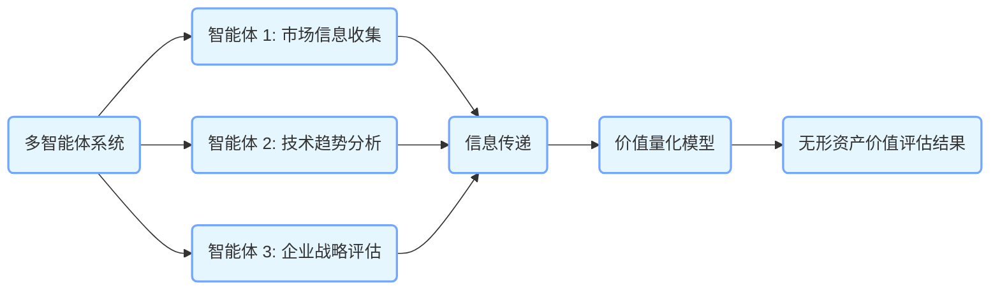

# 多智能体系统在无形资产价值量化中的应用

> 关键词：多智能体系统、无形资产、价值量化、人工智能、决策模型

> 摘要：本文聚焦于多智能体系统在无形资产价值量化中的应用。首先介绍了多智能体系统和无形资产价值量化的背景知识，阐述了相关核心概念及其联系。接着深入探讨了多智能体系统用于无形资产价值量化的核心算法原理，结合 Python 代码进行详细说明，并给出了相应的数学模型和公式。通过项目实战，展示了如何利用多智能体系统实现无形资产价值量化的具体步骤和代码实现。分析了该技术在实际中的应用场景，推荐了相关的学习资源、开发工具框架以及论文著作。最后对多智能体系统在无形资产价值量化领域的未来发展趋势与挑战进行了总结，同时提供了常见问题的解答和扩展阅读参考资料，旨在为该领域的研究和实践提供全面且深入的指导。

## 1. 背景介绍 
### 1.1 目的和范围
无形资产在现代企业和经济体系中的重要性日益凸显，如品牌价值、专利技术、商业秘密等。然而，由于其无形性和不确定性，准确量化其价值一直是一个具有挑战性的问题。本文章的目的在于探讨多智能体系统在无形资产价值量化中的应用，通过多智能体系统的分布式、智能决策等特性，提供一种更科学、准确的无形资产价值量化方法。

本文的范围涵盖了多智能体系统和无形资产价值量化的基本概念、核心算法原理、数学模型、项目实战、实际应用场景以及相关的工具和资源推荐等方面，旨在全面深入地阐述多智能体系统在无形资产价值量化中的应用。

### 1.2 预期读者
本文预期读者包括从事人工智能、计算机科学、经济学、会计学等领域的研究人员和学者，以及企业中负责资产管理、财务分析、战略决策的专业人士。同时，对多智能体系统和无形资产价值量化感兴趣的技术爱好者和学生也可以从本文中获取有价值的信息。

### 1.3 文档结构概述
本文将按照以下结构进行阐述：首先介绍多智能体系统和无形资产价值量化的背景知识，包括目的、预期读者和文档结构概述等；接着详细讲解核心概念及其联系，通过文本示意图和 Mermaid 流程图进行直观展示；然后深入探讨核心算法原理，结合 Python 代码进行具体说明，并给出相应的数学模型和公式；通过项目实战展示如何利用多智能体系统实现无形资产价值量化的具体步骤和代码实现；分析该技术在实际中的应用场景；推荐相关的学习资源、开发工具框架以及论文著作；最后对多智能体系统在无形资产价值量化领域的未来发展趋势与挑战进行总结，同时提供常见问题的解答和扩展阅读参考资料。

### 1.4 术语表
#### 1.4.1 核心术语定义
- **多智能体系统（Multi - Agent System，MAS）**：由多个智能体组成的系统，每个智能体具有一定的自主性、智能性和交互能力，它们通过相互协作来完成共同的任务。
- **无形资产**：企业拥有或者控制的没有实物形态的可辨认非货币性资产，如专利权、商标权、著作权、土地使用权、非专利技术等。
- **价值量化**：将事物的价值用具体的数值或指标来表示的过程。

#### 1.4.2 相关概念解释
- **智能体（Agent）**：是一个能够感知环境，并根据环境信息进行决策和行动的实体。在多智能体系统中，智能体可以是软件程序、机器人等。
- **分布式系统**：由多个独立的计算单元组成的系统，这些计算单元通过网络进行通信和协作，共同完成一个任务。多智能体系统通常具有分布式的特点。
- **决策模型**：用于描述和分析决策过程的数学模型或逻辑模型，多智能体系统中的智能体通常基于决策模型进行决策。

#### 1.4.3 缩略词列表
- MAS：Multi - Agent System（多智能体系统）
- AI：Artificial Intelligence（人工智能）

## 2. 核心概念与联系 

### 2.1 多智能体系统的原理和架构
多智能体系统是由多个智能体组成的分布式系统。每个智能体具有一定的自主性、智能性和交互能力，它们可以感知环境、处理信息、做出决策并采取行动。智能体之间通过通信机制进行信息交流和协作，共同完成系统的目标。

多智能体系统的架构通常包括以下几个部分：
- **智能体层**：包含多个智能体，每个智能体负责完成特定的任务。
- **通信层**：提供智能体之间的通信机制，确保智能体能够交换信息。
- **协调层**：负责协调智能体之间的行为，避免冲突，提高系统的效率。
- **环境层**：智能体所处的外部环境，智能体通过感知环境信息来做出决策。

以下是多智能体系统架构的文本示意图：

```plaintext
多智能体系统
├── 智能体层
│   ├── 智能体 1
│   ├── 智能体 2
│   └── ...
├── 通信层
│   └── 通信协议
├── 协调层
│   └── 协调算法
└── 环境层
    └── 环境信息
```

### 2.2 无形资产价值量化的原理和方法
无形资产价值量化是一个复杂的过程，需要综合考虑多种因素。常见的无形资产价值量化方法包括成本法、市场法和收益法。

- **成本法**：基于无形资产的开发成本或取得成本来确定其价值。这种方法适用于无形资产的开发成本能够准确计量的情况。
- **市场法**：通过比较类似无形资产的市场交易价格来确定目标无形资产的价值。这种方法需要有活跃的市场和可比的交易案例。
- **收益法**：基于无形资产未来预期收益的现值来确定其价值。这种方法考虑了无形资产的盈利能力，是目前应用较为广泛的方法。

### 2.3 多智能体系统与无形资产价值量化的联系
多智能体系统可以为无形资产价值量化提供一种新的方法和思路。通过多个智能体的协作，可以更全面地考虑影响无形资产价值的各种因素，提高价值量化的准确性和可靠性。

例如，不同的智能体可以分别负责收集市场信息、分析技术趋势、评估企业战略等，然后通过智能体之间的通信和协作，综合各种信息，得出更准确的无形资产价值评估结果。

### 2.4 Mermaid 流程图


## 3. 核心算法原理 & 具体操作步骤 

### 3.1 核心算法原理
多智能体系统在无形资产价值量化中主要采用的算法包括智能体决策算法和信息融合算法。

#### 3.1.1 智能体决策算法
智能体决策算法用于智能体根据自身的感知信息和目标来做出决策。常见的智能体决策算法包括基于规则的决策算法、基于效用的决策算法和基于机器学习的决策算法。

- **基于规则的决策算法**：智能体根据预先定义的规则来做出决策。例如，如果市场需求增加，则增加对无形资产的投资。
- **基于效用的决策算法**：智能体通过计算不同行动的效用值，选择效用值最大的行动。效用值可以根据智能体的目标和环境信息来计算。
- **基于机器学习的决策算法**：智能体通过学习历史数据来建立决策模型，然后根据当前的环境信息进行决策。例如，使用神经网络来预测无形资产的未来收益。

#### 3.1.2 信息融合算法
信息融合算法用于将多个智能体收集到的信息进行融合，得到更全面、准确的信息。常见的信息融合算法包括加权平均法、贝叶斯融合法和模糊融合法。

- **加权平均法**：根据不同信息的重要性，为每个信息分配一个权重，然后将所有信息进行加权平均。
- **贝叶斯融合法**：基于贝叶斯定理，通过更新先验概率来得到后验概率，从而实现信息的融合。
- **模糊融合法**：用于处理模糊信息，通过模糊推理来实现信息的融合。

### 3.2 具体操作步骤
#### 3.2.1 智能体设计
- 确定智能体的类型和功能，例如市场信息收集智能体、技术趋势分析智能体等。
- 设计智能体的决策算法和通信协议。

#### 3.2.2 信息收集
- 各个智能体根据自身的功能，收集相关的信息，例如市场需求、技术创新、企业战略等。

#### 3.2.3 信息融合
- 使用信息融合算法将各个智能体收集到的信息进行融合，得到更全面、准确的信息。

#### 3.2.4 价值量化
- 根据融合后的信息，使用无形资产价值量化方法（如收益法）计算无形资产的价值。

### 3.3 Python 源代码详细阐述
以下是一个简单的多智能体系统在无形资产价值量化中的 Python 示例代码：

```python
import random

# 定义智能体类
class Agent:
    def __init__(self, name, function):
        self.name = name
        self.function = function

    def collect_info(self):
        # 模拟信息收集
        if self.function == "market_info":
            return random.randint(100, 200)  # 市场需求信息
        elif self.function == "technology_trend":
            return random.randint(50, 150)  # 技术趋势信息
        elif self.function == "enterprise_strategy":
            return random.randint(80, 180)  # 企业战略信息

# 定义信息融合函数（加权平均法）
def information_fusion(info_list, weights):
    weighted_sum = 0
    total_weight = sum(weights)
    for i in range(len(info_list)):
        weighted_sum += info_list[i] * weights[i]
    return weighted_sum / total_weight

# 定义价值量化函数（简单示例）
def value_quantification(fused_info):
    # 简单的线性模型
    return fused_info * 2

# 创建智能体
market_agent = Agent("Market Agent", "market_info")
technology_agent = Agent("Technology Agent", "technology_trend")
strategy_agent = Agent("Strategy Agent", "enterprise_strategy")

# 信息收集
market_info = market_agent.collect_info()
technology_info = technology_agent.collect_info()
strategy_info = strategy_agent.collect_info()

# 信息融合
info_list = [market_info, technology_info, strategy_info]
weights = [0.4, 0.3, 0.3]
fused_info = information_fusion(info_list, weights)

# 价值量化
value = value_quantification(fused_info)

print("市场信息:", market_info)
print("技术趋势信息:", technology_info)
print("企业战略信息:", strategy_info)
print("融合后的信息:", fused_info)
print("无形资产价值:", value)
```

在这个示例代码中，我们定义了一个智能体类 `Agent`，每个智能体可以模拟信息收集。然后使用加权平均法进行信息融合，最后使用一个简单的线性模型进行价值量化。

## 4. 数学模型和公式 & 详细讲解 & 举例说明 

### 4.1 智能体决策模型
#### 4.1.1 基于效用的决策模型
基于效用的决策模型中，智能体通过计算不同行动的效用值 $U(a)$ 来选择最优行动。效用值的计算公式为：

$$U(a) = \sum_{s} P(s|a) R(s, a)$$

其中，$a$ 表示行动，$s$ 表示状态，$P(s|a)$ 表示在采取行动 $a$ 后处于状态 $s$ 的概率，$R(s, a)$ 表示在状态 $s$ 下采取行动 $a$ 的奖励。

**详细讲解**：这个公式的含义是，智能体在选择行动时，会考虑每个行动可能导致的不同状态，以及在这些状态下获得的奖励。通过对所有可能状态的奖励进行加权求和（权重为状态发生的概率），得到每个行动的效用值，然后选择效用值最大的行动。

**举例说明**：假设智能体有两个行动 $a_1$ 和 $a_2$，有两个状态 $s_1$ 和 $s_2$。$P(s_1|a_1) = 0.6$，$P(s_2|a_1) = 0.4$，$R(s_1, a_1) = 10$，$R(s_2, a_1) = 5$；$P(s_1|a_2) = 0.3$，$P(s_2|a_2) = 0.7$，$R(s_1, a_2) = 15$，$R(s_2, a_2) = 3$。

则 $U(a_1) = 0.6\times10 + 0.4\times5 = 6 + 2 = 8$

$U(a_2) = 0.3\times15 + 0.7\times3 = 4.5 + 2.1 = 6.6$

因为 $U(a_1) > U(a_2)$，所以智能体选择行动 $a_1$。

### 4.2 信息融合模型
#### 4.2.1 加权平均法
加权平均法的信息融合公式为：

$$\hat{x} = \frac{\sum_{i = 1}^{n} w_i x_i}{\sum_{i = 1}^{n} w_i}$$

其中，$\hat{x}$ 表示融合后的信息，$x_i$ 表示第 $i$ 个智能体收集到的信息，$w_i$ 表示第 $i$ 个信息的权重，$n$ 表示智能体的数量。

**详细讲解**：加权平均法通过为每个信息分配一个权重，来反映该信息的重要性。权重越大，该信息对融合结果的影响越大。通过对所有信息进行加权求和，再除以权重总和，得到融合后的信息。

**举例说明**：假设有三个智能体，收集到的信息分别为 $x_1 = 10$，$x_2 = 15$，$x_3 = 20$，权重分别为 $w_1 = 0.3$，$w_2 = 0.4$，$w_3 = 0.3$。

则 $\hat{x} = \frac{0.3\times10 + 0.4\times15 + 0.3\times20}{0.3 + 0.4 + 0.3} = \frac{3 + 6 + 6}{1} = 15$

### 4.3 无形资产价值量化模型
#### 4.3.1 收益法
收益法的无形资产价值量化公式为：

$$V = \sum_{t = 1}^{n} \frac{CF_t}{(1 + r)^t}$$

其中，$V$ 表示无形资产的价值，$CF_t$ 表示第 $t$ 期的预期现金流量，$r$ 表示折现率，$n$ 表示预期收益期限。

**详细讲解**：收益法基于无形资产未来预期收益的现值来确定其价值。将未来各期的预期现金流量按照折现率进行折现，然后求和，得到无形资产的价值。折现率反映了资金的时间价值和风险。

**举例说明**：假设某无形资产预计未来三年的现金流量分别为 $CF_1 = 100$，$CF_2 = 120$，$CF_3 = 150$，折现率 $r = 0.1$。

则 $V = \frac{100}{(1 + 0.1)^1} + \frac{120}{(1 + 0.1)^2} + \frac{150}{(1 + 0.1)^3}$

$V = \frac{100}{1.1} + \frac{120}{1.21} + \frac{150}{1.331}$

$V \approx 90.91 + 99.17 + 112.69 = 302.77$

## 5. 项目实战：代码实际案例和详细解释说明 

### 5.1 开发环境搭建
#### 5.1.1 安装 Python
首先需要安装 Python 开发环境。可以从 Python 官方网站（https://www.python.org/downloads/） 下载适合自己操作系统的 Python 版本，并按照安装向导进行安装。

#### 5.1.2 安装必要的库
在本项目中，我们主要使用 Python 的内置库，不需要额外安装其他库。如果需要进行更复杂的数据分析和机器学习任务，可以安装 `numpy`、`pandas`、`scikit - learn` 等库。可以使用以下命令进行安装：

```sh
pip install numpy pandas scikit-learn
```

### 5.2 源代码详细实现和代码解读
以下是一个更完整的多智能体系统在无形资产价值量化中的 Python 代码示例：

```python
import random
import numpy as np

# 定义智能体类
class Agent:
    def __init__(self, name, function, weight):
        self.name