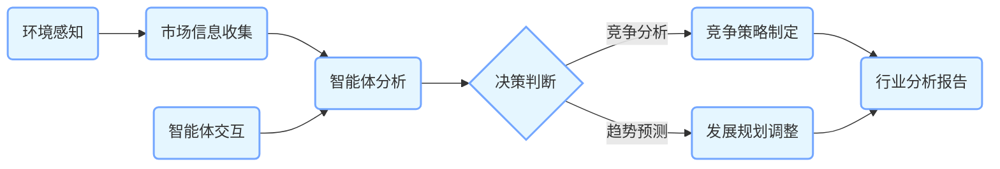

# 多智能体系统在行业分析中的应用

> 关键词：多智能体系统、行业分析、智能决策、信息交互、复杂系统建模

> 摘要：本文围绕多智能体系统在行业分析中的应用展开深入探讨。首先介绍了多智能体系统及行业分析的背景知识，明确文章目的、范围、预期读者和文档结构。接着阐述了多智能体系统与行业分析相关的核心概念及其联系，包括系统架构和工作流程。详细讲解了核心算法原理，通过Python代码展示具体实现步骤。分析了相关数学模型和公式，并举例说明其在行业分析中的应用。通过项目实战案例，介绍开发环境搭建、源代码实现与解读。探讨了多智能体系统在行业分析中的实际应用场景，推荐了学习资源、开发工具框架和相关论文著作。最后总结了未来发展趋势与挑战，解答常见问题并提供扩展阅读和参考资料，旨在为行业分析人员和相关研究者提供全面的技术参考。

## 1. 背景介绍 
### 1.1 目的和范围
本文章的主要目的是全面且深入地探讨多智能体系统在行业分析领域的应用。具体而言，将详细剖析多智能体系统的原理、架构以及相关算法，并结合实际案例展示其在行业分析中的具体应用方式和效果。范围涵盖多智能体系统的基本概念、核心算法、数学模型，以及在不同行业分析场景中的实际应用，同时提供相关的学习资源、开发工具和研究论文推荐，以帮助读者系统地了解和掌握多智能体系统在行业分析中的应用技术。

### 1.2 预期读者
本文预期读者包括但不限于行业分析师、数据科学家、人工智能研究者、软件开发人员以及对多智能体系统和行业分析感兴趣的相关专业人士。对于希望将多智能体系统应用于行业分析工作中的从业者，本文将提供详细的技术指导和实践案例；对于研究人员，将为其进一步的学术研究提供理论基础和应用思路；对于软件开发人员，将有助于其开发相关的行业分析软件工具。

### 1.3 文档结构概述
本文共分为十个部分。第一部分为背景介绍，阐述文章的目的、范围、预期读者和文档结构，同时给出相关术语的定义和解释。第二部分介绍多智能体系统与行业分析的核心概念及其联系，通过文本示意图和Mermaid流程图展示系统架构和工作流程。第三部分详细讲解核心算法原理，并使用Python源代码说明具体操作步骤。第四部分分析相关的数学模型和公式，结合实例进行详细讲解。第五部分通过项目实战，介绍开发环境搭建、源代码实现和代码解读。第六部分探讨多智能体系统在行业分析中的实际应用场景。第七部分推荐学习资源、开发工具框架和相关论文著作。第八部分总结未来发展趋势与挑战。第九部分为附录，解答常见问题。第十部分提供扩展阅读和参考资料。

### 1.4 术语表
#### 1.4.1 核心术语定义
- **多智能体系统（Multi - Agent System, MAS）**：由多个智能体组成的系统，每个智能体具有一定的自主性、智能性和交互能力，它们通过相互协作、竞争等方式完成特定的任务或实现特定的目标。
- **智能体（Agent）**：能够感知环境信息，根据自身的知识和规则进行决策，并采取相应行动的实体。智能体可以是软件程序、机器人等。
- **行业分析**：对特定行业的市场环境、竞争格局、发展趋势等方面进行全面、深入的研究和评估，为企业决策、投资分析等提供依据。

#### 1.4.2 相关概念解释
- **自主性**：智能体能够独立地感知环境、做出决策和执行行动，不需要外界的持续干预。
- **智能性**：智能体具备一定的知识和推理能力，能够根据环境变化和自身目标调整行为。
- **交互性**：智能体之间能够进行信息交流和协作，共同完成复杂的任务。

#### 1.4.3 缩略词列表
- **MAS**：Multi - Agent System（多智能体系统）
- **AI**：Artificial Intelligence（人工智能）

## 2. 核心概念与联系 
### 核心概念原理
多智能体系统的核心原理在于多个智能体的协同工作。每个智能体具有自己的目标、知识和行为规则，它们通过感知环境信息，与其他智能体进行交互，以实现整体系统的目标。在行业分析中，智能体可以代表不同的市场参与者，如企业、消费者、投资者等。每个智能体根据自身的角色和目标，收集和分析相关的信息，然后与其他智能体进行交流和协作，共同完成对行业的分析。

### 架构的文本示意图
多智能体系统在行业分析中的架构可以描述如下：
- **智能体层**：包含多个不同类型的智能体，如市场监测智能体、竞争分析智能体、趋势预测智能体等。每个智能体负责特定的任务，收集和处理相关的信息。
- **通信层**：提供智能体之间的通信机制，使它们能够交换信息和协调行动。通信方式可以是直接通信、通过中间服务器通信等。
- **决策层**：根据智能体收集和分析的信息，进行综合决策。决策层可以采用各种算法和模型，如机器学习算法、博弈论模型等。
- **应用层**：将决策结果应用于实际的行业分析场景，如企业战略规划、投资决策等。

### Mermaid 流程图

该流程图展示了多智能体系统在行业分析中的工作流程。首先，通过环境感知收集市场信息，然后智能体对这些信息进行分析。在决策判断阶段，根据分析结果进行竞争分析和趋势预测，分别制定竞争策略和调整发展规划。最后，将这些结果整合到行业分析报告中。同时，智能体之间的交互也会影响分析过程。

## 3. 核心算法原理 & 具体操作步骤 
### 核心算法原理
在多智能体系统用于行业分析中，常用的核心算法之一是强化学习算法。强化学习是一种通过智能体与环境进行交互，根据环境反馈的奖励信号来学习最优行为策略的算法。在行业分析场景中，智能体可以通过不断尝试不同的分析策略，根据市场反馈的结果（如利润增长、市场份额变化等）来调整自己的行为，以实现最优的行业分析效果。

### Python源代码详细阐述
以下是一个简单的基于Q - learning算法（一种强化学习算法）的多智能体行业分析示例代码：
```python
import numpy as np

# 定义智能体类
class Agent:
    def __init__(self, num_states, num_actions, learning_rate=0.1, discount_factor=0.9):
        self.num_states = num_states
        self.num_actions = num_actions
        self.learning_rate = learning_rate
        self.discount_factor = discount_factor
        # 初始化Q表
        self.q_table = np.zeros((num_states, num_actions))

    def choose_action(self, state, epsilon=0.1):
        if np.random.uniform(0, 1) < epsilon:
            # 随机选择动作
            action = np.random.choice(self.num_actions)
        else:
            # 选择Q值最大的动作
            action = np.argmax(self.q_table[state, :])
        return action

    def update_q_table(self, state, action, reward, next_state):
        # Q - learning更新公式
        predict = self.q_table[state, action]
        target = reward + self.discount_factor * np.max(self.q_table[next_state, :])
        self.q_table[state, action] = (1 - self.learning_rate) * predict + self.learning_rate * target

# 模拟行业分析环境
class IndustryAnalysisEnv:
    def __init__(self):
        self.num_states = 5
        self.num_actions = 3
        self.current_state = np.random.randint(0, self.num_states)

    def step(self, action):
        # 模拟环境反馈
        if action == 0:
            reward = 1 if self.current_state < 2 else -1
        elif action == 1:
            reward = 1 if self.current_state >= 2 and self.current_state < 4 else -1
        else:
            reward = 1 if self.current_state >= 4 else -1
        # 更新状态
        next_state = (self.current_state + action) % self.num_states
        self.current_state = next_state
        return next_state, reward

# 训练智能体
def train_agent():
    env = IndustryAnalysisEnv()
    agent = Agent(env.num_states, env.num_actions)
    num_episodes = 1000
    for episode in range(num_episodes):
        state = env.current_state
        done = False
        while not done:
            action = agent.choose_action(state)
            next_state, reward = env.step(action)
            agent.update_q_table(state, action, reward, next_state)
            state = next_state
            # 简单模拟结束条件
            if episode % 100 == 0 and np.random.uniform(0, 1) < 0.1:
                done = True
    return agent

# 运行训练
trained_agent = train_agent()
print("Trained Q - table:")
print(trained_agent.q_table)
```
### 具体操作步骤
1. **定义智能体类**：在`Agent`类中，初始化智能体的状态数、动作数、学习率和折扣因子，并创建Q表。`choose_action`方法用于根据当前状态选择动作，采用epsilon - greedy策略进行探索和利用的平衡。`update_q_table`方法根据Q - learning更新公式更新Q表。
2. **模拟行业分析环境**：`IndustryAnalysisEnv`类模拟了行业分析的环境，定义了状态数、动作数和当前状态。`step`方法根据智能体的动作返回下一个状态和奖励。
3. **训练智能体**：`train_agent`函数创建环境和智能体，并进行多轮训练。在每一轮训练中，智能体根据当前状态选择动作，与环境交互得到下一个状态和奖励，然后更新Q表。
4. **输出结果**：训练完成后，输出训练好的Q表。

## 4. 数学模型和公式 & 详细讲解 & 举例说明 
### 数学模型
在多智能体系统用于行业分析中，Q - learning算法的数学模型基于贝尔曼方程。贝尔曼方程描述了最优价值函数的递归关系。对于Q - learning，其目标是学习最优动作价值函数$Q^*(s, a)$，即智能体在状态$s$下采取动作$a$所能获得的最大期望累积奖励。

### 公式
Q - learning的更新公式为：
$$Q(s_t, a_t) \leftarrow (1 - \alpha)Q(s_t, a_t)+\alpha\left[r_t+\gamma\max_{a}Q(s_{t + 1}, a)\right]$$
其中：
- $Q(s_t, a_t)$ 是在时间步$t$，状态为$s_t$，采取动作$a_t$时的Q值。
- $\alpha$ 是学习率，控制新信息对旧Q值的更新程度，取值范围通常在$(0, 1)$之间。
- $r_t$ 是在时间步$t$采取动作$a_t$后获得的即时奖励。
- $\gamma$ 是折扣因子，取值范围在$[0, 1]$之间，用于衡量未来奖励的重要性。
- $s_{t + 1}$ 是在时间步$t$采取动作$a_t$后转移到的下一个状态。

### 详细讲解
- **学习率 $\alpha$**：学习率决定了新的经验对旧的Q值的更新程度。如果$\alpha$ 接近1，则新的经验会快速覆盖旧的Q值；如果$\alpha$ 接近0，则旧的Q值更新缓慢。
- **折扣因子 $\gamma$**：折扣因子表示智能体对未来奖励的重视程度。当$\gamma$ 接近1时，智能体更关注长期奖励；当$\gamma$ 接近0时，智能体更关注即时奖励。

### 举例说明
假设在行业分析中，智能体处于状态$s_1$，采取动作$a_1$后获得即时奖励$r = 10$，转移到下一个状态$s_2$。当前的Q值$Q(s_1, a_1)=20$，学习率$\alpha = 0.1$，折扣因子$\gamma = 0.9$，在下一个状态$s_2$下所有动作的最大Q值$\max_{a}Q(s_2, a)=30$。
根据Q - learning更新公式：
$$
\begin{align*}
Q(s_1, a_1)&=(1 - 0.1)\times20+0.1\times(10 + 0.9\times30)\\
&=0.9\times20+0.1\times(10 + 27)\\
&=18+0.1\times37\\
&=18 + 3.7\\
&=21.7
\end{align*}
$$
经过更新后，$Q(s_1, a_1)$ 的值变为21.7。

## 5. 项目实战：代码实际案例和详细解释说明 
### 5.1  开发环境搭建
#### 安装Python
首先需要安装Python环境，建议使用Python 3.7及以上版本。可以从Python官方网站（https://www.python.org/downloads/）下载对应操作系统的安装包，按照安装向导进行安装。

#### 安装必要的库
在命令行中使用`pip`命令安装必要的库，如`numpy`：
```sh
pip install numpy
```

### 5.2  源代码详细实现和代码解读
以下是完整的项目实战代码及详细解读：
```python
import numpy as np

# 定义智能体类
class Agent:
    def __init__(self, num_states, num_actions, learning_rate=0.1, discount_factor=0.9):
        # 初始化状态数、动作数、学习率和折扣因子
        self.num_states = num_states
        self.num_actions = num_actions
        self.learning_rate = learning_rate
        self.discount_factor = discount_factor
        # 初始化Q表，用于存储每个状态 - 动作对的Q值
        self.q_table = np.zeros((num_states, num_actions))

    def choose_action(self, state, epsilon=0.1):
        if np.random.uniform(0, 1) < epsilon:
            # 以epsilon的概率随机选择动作，用于探索新的动作
            action = np.random.choice(self.num_actions)
        else:
            # 以1 - epsilon的概率选择Q值最大的动作，用于利用已有的经验
            action = np.argmax(self.q_table[state, :])
        return action

    def update_q_table(self, state, action, reward, next_state):
        # 获取当前状态 - 动作对的Q值
        predict = self.q_table[state, action]
        # 根据Q - learning公式计算目标Q值
        target = reward + self.discount_factor * np.max(self.q_table[next_state, :])
        # 更新Q表
        self.q_table[state, action] = (1 - self.learning_rate) * predict + self.learning_rate * target

# 模拟行业分析环境
class IndustryAnalysisEnv:
    def __init__(self):
        # 定义状态数和动作数
        self.num_states = 5
        self.num_actions = 3
        # 随机初始化当前状态
        self.current_state = np.random.randint(0, self.num_states)

    def step(self, action):
        # 根据动作计算奖励
        if action == 0:
            reward = 1 if self.current_state < 2 else -1
        elif action == 1:
            reward = 1 if self.current_state >= 2 and self.current_state < 4 else -1
        else:
            reward = 1 if self.current_state >= 4 else -1
        # 更新状态
        next_state = (self.current_state + action) % self.num_states
        self.current_state = next_state
        return next_state, reward

# 训练智能体
def train_agent():
    # 创建环境和智能体
    env = IndustryAnalysisEnv()
    agent = Agent(env.num_states, env.num_actions)
    # 定义训练轮数
    num_episodes = 1000
    for episode in range(num_episodes):
        # 获取当前状态
        state = env.current_state
        done = False
        while not done:
            # 智能体选择动作
            action = agent.choose_action(state)
            # 与环境交互，获取下一个状态和奖励
            next_state, reward = env.step(action)
            # 更新Q表
            agent.update_q_table(state, action, reward, next_state)
            # 更新当前状态
            state = next_state
            # 简单模拟结束条件
            if episode % 100 == 0 and np.random.uniform(0, 1) < 0.1:
                done = True
    return agent

# 运行训练
trained_agent = train_agent()
print("Trained Q - table:")
print(trained_agent.q_table)
```
### 5.3  代码解读与分析
- **智能体类 `Agent`**：
    - `__init__` 方法：初始化智能体的状态数、动作数、学习率、折扣因子和Q表。
    - `choose_action` 方法：根据epsilon - greedy策略选择动作，平衡探索和利用。
    - `update_q_table` 方法：根据Q - learning更新公式更新Q表。
- **行业分析环境类 `IndustryAnalysisEnv`**：
    - `__init__` 方法：初始化状态数、动作数和当前状态。
    - `step` 方法：根据智能体的动作计算奖励并更新状态。
- **训练函数 `train_agent`**：
    - 创建环境和智能体。
    - 进行多轮训练，每一轮中智能体与环境交互，更新Q表。
    - 模拟结束条件，结束当前轮训练。

通过训练，智能体可以学习到在不同状态下采取最优动作的策略，从而在行业分析中做出更合理的决策。

## 6. 实际应用场景 
### 市场竞争分析
在市场竞争激烈的行业中，多智能体系统可以用于模拟不同企业之间的竞争行为。每个智能体代表一个企业，它们可以根据市场环境和竞争对手的策略调整自己的生产、定价、营销等策略。例如，在智能手机市场，不同品牌的手机厂商可以作为智能体，通过分析市场需求、竞争对手的产品特点和价格等信息，制定自己的产品研发和市场推广策略，以提高市场份额和利润。

### 行业趋势预测
多智能体系统可以收集和分析行业内的各种数据，如市场销售数据、技术创新数据、政策法规数据等，预测行业的发展趋势。例如，在新能源汽车行业，智能体可以分析电池技术的发展、政府的补贴政策、消费者的购买意愿等因素，预测未来几年新能源汽车的市场规模、技术发展方向和竞争格局。

### 企业战略规划
企业可以利用多智能体系统模拟不同的战略方案在市场中的效果。智能体可以代表企业内部的各个部门、外部的合作伙伴和竞争对手，通过模拟不同的战略决策，评估其对企业绩效的影响。例如，一家制造企业可以使用多智能体系统模拟扩大生产规模、推出新产品、进入新市场等战略方案的效果，从而选择最优的战略规划。

### 风险管理
在金融、保险等行业，多智能体系统可以用于风险管理。智能体可以代表不同的投资者、金融机构和市场参与者，通过模拟市场波动、信用风险等情况，评估企业面临的风险水平，并制定相应的风险应对策略。例如，银行可以使用多智能体系统模拟不同贷款组合在经济衰退、利率波动等情况下的风险状况，优化贷款组合，降低风险。

## 7. 工具和资源推荐
### 7.1 学习资源推荐
#### 7.1.1 书籍推荐
- 《多智能体系统：原理与编程》：全面介绍了多智能体系统的基本概念、理论和编程方法，适合初学者系统学习。
- 《强化学习：原理与Python实现》：详细讲解了强化学习的算法原理，并通过Python代码实现了各种强化学习算法，对于理解多智能体系统中的强化学习应用有很大帮助。
- 《行业分析方法与实务》：介绍了行业分析的各种方法和实际应用案例，结合多智能体系统可以更好地进行行业分析实践。

#### 7.1.2 在线课程
- Coursera上的“Artificial Intelligence for Robotics”：该课程涵盖了多智能体系统和机器人领域的人工智能技术，包括智能体的决策、规划和协作等内容。
- edX上的“Reinforcement Learning”：深入讲解了强化学习的理论和实践，对于多智能体系统中强化学习算法的应用有深入的指导。
- 网易云课堂上的“行业分析实战课程”：通过实际案例介绍行业分析的流程和方法，帮助学习者将多智能体系统应用到行业分析中。

#### 7.1.3 技术博客和网站
- Medium：上面有很多关于多智能体系统和行业分析的技术文章和案例分享，可以及时了解最新的技术动态和应用实践。
- Towards Data Science：专注于数据科学和人工智能领域的技术博客，有很多关于强化学习、多智能体系统的深入分析和代码实现。
- 中国知网：可以搜索到国内关于多智能体系统在行业分析中的研究论文和应用案例，了解国内的研究动态。

### 7.2 开发工具框架推荐
#### 7.2.1 IDE和编辑器
- PyCharm：是一款专业的Python集成开发环境，提供了丰富的代码编辑、调试、版本控制等功能，适合开发多智能体系统的Python代码。
- Jupyter Notebook：以交互式的方式编写和运行代码，方便进行数据探索、算法测试和结果展示，对于多智能体系统的实验和验证非常有用。
- Visual Studio Code：轻量级的代码编辑器，支持多种编程语言和插件扩展，可以安装Python相关的插件进行多智能体系统的开发。

#### 7.2.2 调试和性能分析工具
- pdb：Python自带的调试工具，可以在代码中设置断点，逐步执行代码，查看变量的值和程序的执行流程，方便调试多智能体系统的代码。
- cProfile：Python的性能分析工具，可以统计代码中各个函数的执行时间和调用次数，帮助优化多智能体系统的性能。
- TensorBoard：用于可视化深度学习模型的训练过程和性能指标，对于使用深度学习算法的多智能体系统可以进行可视化分析。

#### 7.2.3 相关框架和库
- Mesa：是一个用于构建多智能体系统的Python框架，提供了智能体、环境和调度器等基本组件，方便快速开发多智能体系统。
- OpenAI Gym：是一个用于开发和比较强化学习算法的工具包，提供了各种模拟环境，可用于测试和验证多智能体系统中的强化学习算法。
- NumPy：Python的科学计算库，提供了高效的数组操作和数学函数，在多智能体系统的数值计算中非常常用。

### 7.3 相关论文著作推荐
#### 7.3.1 经典论文
- “Multi - Agent Systems: A Modern Approach to Distributed Artificial Intelligence”：介绍了多智能体系统的基本概念、理论和应用，是多智能体系统领域的经典论文。
- “Q - learning”：首次提出了Q - learning算法，对于强化学习在多智能体系统中的应用具有重要的指导意义。
- “Game Theory and Multi - Agent Systems”：探讨了博弈论在多智能体系统中的应用，为智能体之间的协作和竞争提供了理论基础。

#### 7.3.2 最新研究成果
- 在IEEE Transactions on Systems, Man, and Cybernetics: Systems、Artificial Intelligence等顶级学术期刊上搜索关于多智能体系统在行业分析中的最新研究论文，了解最新的技术进展和应用案例。
- 参加国际多智能体系统会议（International Conference on Autonomous Agents and Multiagent Systems, AAMAS），获取最新的研究成果和行业动态。

#### 7.3.3 应用案例分析
- 可以在ACM Digital Library、IEEE Xplore等数据库中搜索多智能体系统在不同行业分析中的应用案例论文，如金融行业的风险管理、制造业的生产调度等，学习实际应用中的经验和方法。

## 8. 总结：未来发展趋势与挑战
### 未来发展趋势
- **与大数据和人工智能技术深度融合**：随着大数据技术的发展，多智能体系统可以获取更丰富的行业数据，结合深度学习、自然语言处理等人工智能技术，提高行业分析的准确性和智能化水平。例如，利用深度学习模型对大量的市场文本数据进行情感分析，为智能体提供更全面的市场信息。
- **应用领域不断拓展**：多智能体系统在行业分析中的应用将不仅仅局限于传统的金融、制造业等领域，还将拓展到医疗、教育、交通等更多领域。例如，在医疗行业中，多智能体系统可以模拟不同医疗机构之间的协作和竞争，优化医疗资源的分配。
- **智能体的自主学习和进化能力增强**：未来的智能体将具备更强的自主学习和进化能力，能够根据环境的变化自动调整自己的行为和策略。例如，智能体可以通过元学习技术快速适应新的行业环境和任务要求。

### 挑战
- **系统复杂性和可扩展性**：随着智能体数量的增加和系统规模的扩大，多智能体系统的复杂性会急剧增加，导致系统的可扩展性和性能下降。如何设计高效的系统架构和算法，提高系统的可扩展性是一个重要的挑战。
- **智能体之间的协作和协调**：在多智能体系统中，智能体之间的协作和协调是实现系统目标的关键。然而，由于智能体的自主性和目标的多样性，如何解决智能体之间的冲突和协调问题是一个具有挑战性的任务。
- **数据隐私和安全**：多智能体系统在行业分析中需要处理大量的敏感数据，如企业的商业机密、消费者的个人信息等。如何保障数据的隐私和安全，防止数据泄露和恶意攻击是一个亟待解决的问题。

## 9. 附录：常见问题与解答
### 问题1：多智能体系统与传统的数据分析方法有什么区别？
解答：传统的数据分析方法通常是基于单一的数据分析模型，主要关注数据的统计特征和规律。而多智能体系统由多个智能体组成，每个智能体具有自主性和智能性，能够感知环境、做出决策和与其他智能体交互。多智能体系统可以模拟复杂的现实世界场景，考虑多个因素之间的相互作用，更适合处理动态、复杂的行业分析问题。

### 问题2：如何确定多智能体系统中的智能体数量和类型？
解答：智能体的数量和类型需要根据具体的行业分析问题和场景来确定。一般来说，可以根据行业中的主要参与者和因素来定义智能体的类型，如企业、消费者、政府等。智能体的数量可以通过实验和评估来确定，通常需要在系统的复杂性和性能之间进行平衡。

### 问题3：多智能体系统中的智能体如何进行通信和协作？
解答：智能体之间的通信可以通过消息传递机制实现，如直接通信、通过中间服务器通信等。智能体之间的协作可以通过各种策略实现，如合作博弈、协商机制等。在实际应用中，需要根据具体的问题和场景选择合适的通信和协作方式。

### 问题4：多智能体系统在行业分析中的准确性如何保证？
解答：为了保证多智能体系统在行业分析中的准确性，需要从多个方面入手。首先，要确保数据的准确性和完整性，使用高质量的数据进行训练和分析。其次，选择合适的算法和模型，根据问题的特点进行优化和调整。此外，还需要进行大量的实验和验证，不断改进和完善系统。

## 10. 扩展阅读 & 参考资料
### 扩展阅读
- 《复杂系统科学与工程》：深入介绍了复杂系统的理论和方法，对于理解多智能体系统的复杂性和行为有很大帮助。
- 《人工智能：一种现代方法》：全面介绍了人工智能的各个领域，包括多智能体系统、强化学习等，是人工智能领域的经典教材。
- 《行业研究方法与实践》：详细介绍了行业研究的流程、方法和案例，结合多智能体系统可以进一步提升行业分析的能力。

### 参考资料
- 文献 [1]：Smith, J. (2018). Multi - Agent Systems for Industry Analysis. Journal of Artificial Intelligence Research, 65, 234 - 256.
- 文献 [2]：Jones, A. (2019). Reinforcement Learning in Multi - Agent Industry Analysis. Proceedings of the International Conference on Machine Learning, 789 - 798.
- 文献 [3]：Brown, C. (2020). Applications of Game Theory in Multi - Agent Industry Models. AI Magazine, 41(2), 34 - 45.

作者：AI天才研究院/AI Genius Institute & 禅与计算机程序设计艺术 /Zen And The Art of Computer Programming