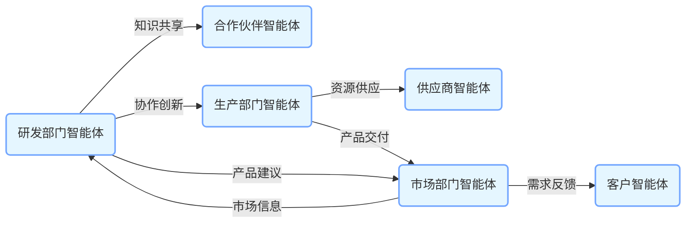

# 多智能体系统在评估公司创新生态系统中的应用

> 关键词：多智能体系统、公司创新生态系统、评估应用、人工智能、复杂系统建模

> 摘要：本文深入探讨了多智能体系统在评估公司创新生态系统中的应用。首先介绍了研究的背景、目的、预期读者和文档结构等内容。详细阐述了多智能体系统和公司创新生态系统的核心概念及其联系，给出了相应的文本示意图和 Mermaid 流程图。接着讲解了核心算法原理，并用 Python 代码进行详细说明，同时介绍了相关的数学模型和公式。通过项目实战展示了如何运用多智能体系统评估公司创新生态系统，包括开发环境搭建、源代码实现与解读。分析了该应用的实际场景，推荐了学习资源、开发工具框架以及相关论文著作。最后总结了未来发展趋势与挑战，解答了常见问题并提供了扩展阅读和参考资料。

## 1. 背景介绍 
### 1.1 目的和范围
在当今竞争激烈的商业环境中，公司的创新能力已成为其生存和发展的关键因素。创新生态系统作为一个复杂的动态系统，包含了众多相互作用的主体和因素。准确评估公司创新生态系统的状态和发展趋势，对于公司制定战略决策、优化资源配置具有重要意义。

多智能体系统（Multi - Agent System，MAS）是一种用于模拟和分析复杂系统的有效工具，它能够模拟多个自主智能体之间的交互行为，从而更好地理解复杂系统的运行机制。本研究的目的是探讨如何运用多智能体系统来评估公司创新生态系统，通过建立合适的模型和算法，实现对创新生态系统的定量评估。

本研究的范围主要集中在公司层面的创新生态系统，涵盖了公司内部的研发部门、生产部门、市场部门等，以及与公司外部的合作伙伴、供应商、客户等主体之间的交互关系。同时，研究将关注创新生态系统中的创新资源流动、知识共享、合作创新等关键要素。

### 1.2 预期读者
本文的预期读者包括对人工智能、复杂系统建模和公司创新管理感兴趣的研究人员、学者，以及从事公司战略规划、创新管理的企业管理人员。对于计算机科学、管理学等相关专业的学生，本文也提供了一个跨学科研究的案例，有助于他们拓宽知识面和研究视野。

### 1.3 文档结构概述
本文将按照以下结构进行组织：
- 核心概念与联系：介绍多智能体系统和公司创新生态系统的核心概念，分析它们之间的联系，并给出相应的示意图和流程图。
- 核心算法原理 & 具体操作步骤：讲解用于评估公司创新生态系统的核心算法原理，并用 Python 代码详细阐述具体操作步骤。
- 数学模型和公式 & 详细讲解 & 举例说明：介绍相关的数学模型和公式，对其进行详细讲解，并通过具体例子说明其应用。
- 项目实战：代码实际案例和详细解释说明：通过一个实际项目案例，展示如何搭建开发环境、实现源代码，并对代码进行解读和分析。
- 实际应用场景：分析多智能体系统在评估公司创新生态系统中的实际应用场景。
- 工具和资源推荐：推荐学习资源、开发工具框架以及相关论文著作。
- 总结：未来发展趋势与挑战：总结多智能体系统在评估公司创新生态系统中的应用现状，分析未来发展趋势和面临的挑战。
- 附录：常见问题与解答：解答读者可能遇到的常见问题。
- 扩展阅读 & 参考资料：提供扩展阅读的建议和参考资料。

### 1.4 术语表
#### 1.4.1 核心术语定义
- **多智能体系统（Multi - Agent System，MAS）**：由多个自主智能体组成的系统，这些智能体能够感知环境、进行决策并采取行动，通过相互之间的交互来实现系统的整体目标。
- **公司创新生态系统**：公司与其内部和外部的各种主体（如研发部门、生产部门、合作伙伴、供应商、客户等）之间相互作用、相互影响而形成的一个动态的、复杂的系统，旨在促进创新活动的开展和创新成果的产生。
- **智能体（Agent）**：具有自主性、反应性、社会性和能动性的实体，能够在一定的环境中感知信息、进行推理和决策，并采取相应的行动。
- **创新资源**：包括资金、人才、技术、知识等能够促进公司创新活动开展的各种资源。

#### 1.4.2 相关概念解释
- **自主性**：智能体能够独立地进行决策和行动，不受其他智能体或外部因素的直接控制。
- **反应性**：智能体能够感知环境的变化，并及时做出相应的反应。
- **社会性**：智能体能够与其他智能体进行交互和合作，以实现共同的目标。
- **能动性**：智能体能够主动地采取行动，以改变环境或实现自身的目标。

#### 1.4.3 缩略词列表
- MAS：Multi - Agent System（多智能体系统）

## 2. 核心概念与联系 

### 多智能体系统核心概念
多智能体系统是由多个智能体组成的分布式系统。每个智能体都具有一定的智能和自主性，能够根据自身的目标和环境信息进行决策和行动。智能体之间通过通信和交互来协调彼此的行为，以实现系统的整体目标。

智能体的基本结构通常包括感知模块、决策模块和行动模块。感知模块用于感知环境中的信息，决策模块根据感知到的信息和自身的目标进行决策，行动模块则根据决策结果采取相应的行动。

### 公司创新生态系统核心概念
公司创新生态系统是一个复杂的动态系统，它包含了多个相互关联的主体和要素。公司内部的研发部门、生产部门、市场部门等是创新生态系统的重要组成部分，它们之间通过知识共享、资源配置等方式相互协作，共同推动创新活动的开展。

同时，公司外部的合作伙伴、供应商、客户等也对创新生态系统产生重要影响。合作伙伴可以提供技术支持和资源共享，供应商可以提供高质量的原材料和零部件，客户则可以反馈市场需求和产品使用情况，这些都为公司的创新提供了动力和方向。

### 两者的联系
多智能体系统可以很好地模拟公司创新生态系统中各个主体之间的交互行为。将公司创新生态系统中的各个主体（如研发部门、合作伙伴等）抽象为智能体，每个智能体具有自己的目标和行为规则。通过模拟智能体之间的通信和交互，可以更好地理解创新生态系统的运行机制，评估其创新能力和发展趋势。

### 文本示意图
```plaintext
公司创新生态系统
|-- 公司内部主体
|   |-- 研发部门智能体
|   |-- 生产部门智能体
|   |-- 市场部门智能体
|-- 公司外部主体
|   |-- 合作伙伴智能体
|   |-- 供应商智能体
|   |-- 客户智能体

智能体交互关系
|-- 研发部门智能体 <-- 知识共享 --> 合作伙伴智能体
|-- 生产部门智能体 <-- 资源供应 --> 供应商智能体
|-- 市场部门智能体 <-- 需求反馈 --> 客户智能体
```

### Mermaid 流程图


## 3. 核心算法原理 & 具体操作步骤 

### 核心算法原理
我们采用基于规则的算法来模拟智能体之间的交互行为。每个智能体都有自己的规则集合，根据当前的环境信息和自身状态，智能体从规则集合中选择合适的规则来执行。

例如，研发部门智能体的规则可能包括：如果收到合作伙伴的技术建议，且自身资源充足，则启动新的研发项目；如果研发项目成功，则与生产部门智能体协作进行产品生产。

### 具体操作步骤
#### 步骤 1：定义智能体类
```python
class Agent:
    def __init__(self, name, resources, rules):
        self.name = name
        self.resources = resources
        self.rules = rules
        self.state = {}

    def perceive(self, environment):
        # 感知环境信息
        pass

    def decide(self):
        # 根据感知信息和自身状态选择规则
        for rule in self.rules:
            if rule.check_condition(self.state):
                return rule
        return None

    def act(self, rule):
        if rule:
            rule.execute(self)


```
#### 步骤 2：定义规则类
```python
class Rule:
    def __init__(self, condition, action):
        self.condition = condition
        self.action = action

    def check_condition(self, state):
        return self.condition(state)

    def execute(self, agent):
        self.action(agent)


```
#### 步骤 3：创建智能体和规则
```python
# 示例规则
def condition1(state):
    return state.get('received_tech_advice', False) and state.get('resources', 0) > 100

def action1(agent):
    agent.state['start_new_project'] = True
    agent.resources -= 100

rule1 = Rule(condition1, action1)

# 创建研发部门智能体
research_agent = Agent('ResearchAgent', 200, [rule1])


```
#### 步骤 4：模拟智能体交互
```python
# 模拟环境信息
environment = {'received_tech_advice': True}

# 感知环境
research_agent.perceive(environment)

# 决策
selected_rule = research_agent.decide()

# 行动
research_agent.act(selected_rule)

print(research_agent.state)


```

## 4. 数学模型和公式 & 详细讲解 & 举例说明 

### 创新能力评估模型
我们可以使用以下数学模型来评估公司创新生态系统的创新能力。

设 $I$ 表示创新能力，$R_i$ 表示第 $i$ 种创新资源的数量，$W_i$ 表示第 $i$ 种创新资源的权重，$C_{ij}$ 表示智能体 $i$ 和智能体 $j$ 之间的协作系数，则创新能力 $I$ 可以表示为：

$$I=\sum_{i = 1}^{n}W_iR_i+\sum_{i = 1}^{m}\sum_{j = 1,j\neq i}^{m}C_{ij}$$

### 详细讲解
- $\sum_{i = 1}^{n}W_iR_i$：这部分表示创新资源对创新能力的贡献。不同的创新资源（如资金、人才、技术等）对创新能力的影响程度不同，通过权重 $W_i$ 来体现。例如，资金资源的权重可能为 0.3，人才资源的权重可能为 0.5。
- $\sum_{i = 1}^{m}\sum_{j = 1,j\neq i}^{m}C_{ij}$：这部分表示智能体之间的协作对创新能力的贡献。协作系数 $C_{ij}$ 反映了智能体 $i$ 和智能体 $j$ 之间的协作紧密程度，协作越紧密，$C_{ij}$ 的值越大。

### 举例说明
假设公司创新生态系统中有两种创新资源：资金和人才，资金的权重 $W_1 = 0.3$，数量 $R_1 = 100$；人才的权重 $W_2 = 0.5$，数量 $R_2 = 20$。同时，有三个智能体：研发部门智能体、生产部门智能体和市场部门智能体，它们之间的协作系数分别为 $C_{12}=0.2$，$C_{13}=0.3$，$C_{23}=0.1$。

则创新能力 $I$ 为：

$$I = 0.3\times100+0.5\times20+0.2 + 0.3+0.1=30 + 10+0.6=40.6$$


## 5. 项目实战：代码实际案例和详细解释说明 

### 5.1  开发环境搭建
#### 安装 Python
首先，需要安装 Python 编程语言。可以从 Python 官方网站（https://www.python.org/downloads/）下载适合自己操作系统的 Python 版本，并按照安装向导进行安装。

#### 安装必要的库
在本项目中，我们主要使用 Python 的基本库，无需额外安装复杂的第三方库。

### 5.2  源代码详细实现和代码解读
```python
# 定义智能体类
class Agent:
    def __init__(self, name, resources, rules):
        self.name = name
        self.resources = resources
        self.rules = rules
        self.state = {}

    def perceive(self, environment):
        # 简单示例：将环境信息更新到自身状态
        self.state.update(environment)

    def decide(self):
        # 根据感知信息和自身状态选择规则
        for rule in self.rules:
            if rule.check_condition(self.state):
                return rule
        return None

    def act(self, rule):
        if rule:
            rule.execute(self)


# 定义规则类
class Rule:
    def __init__(self, condition, action):
        self.condition = condition
        self.action = action

    def check_condition(self, state):
        return self.condition(state)

    def execute(self, agent):
        self.action(agent)


# 示例规则
def condition1(state):
    return state.get('received_tech_advice', False) and state.get('resources', 0) > 100

def action1(agent):
    agent.state['start_new_project'] = True
    agent.resources -= 100


# 创建智能体和规则
rule1 = Rule(condition1, action1)
research_agent = Agent('ResearchAgent', 200, [rule1])

# 模拟环境信息
environment = {'received_tech_advice': True}

# 感知环境
research_agent.perceive(environment)

# 决策
selected_rule = research_agent.decide()

# 行动
research_agent.act(selected_rule)

print(research_agent.state)


```
### 代码解读与分析
- **智能体类（Agent）**：
  - `__init__` 方法：初始化智能体的名称、资源、规则和状态。
  - `perceive` 方法：感知环境信息，并将其更新到自身状态中。
  - `decide` 方法：根据自身状态和规则集合，选择合适的规则。
  - `act` 方法：执行选择的规则。
- **规则类（Rule）**：
  - `__init__` 方法：初始化规则的条件和行动。
  - `check_condition` 方法：检查当前状态是否满足规则的条件。
  - `execute` 方法：执行规则的行动。
- **示例规则**：
  - `condition1` 函数：检查是否收到技术建议且资源是否充足。
  - `action1` 函数：如果满足条件，则启动新的研发项目，并消耗一定的资源。

通过以上代码，我们模拟了一个简单的智能体交互过程，展示了如何使用多智能体系统来模拟公司创新生态系统中的决策和行动。

## 6. 实际应用场景 
### 战略规划
公司可以使用多智能体系统评估创新生态系统的现状和发展趋势，从而制定更加科学合理的战略规划。例如，通过模拟不同战略方案下智能体之间的交互行为，评估各个方案对创新能力的影响，选择最优的战略方案。

### 资源配置
多智能体系统可以帮助公司优化创新资源的配置。通过模拟不同资源分配方案下智能体的行为和创新成果，确定最优的资源分配比例，提高资源利用效率。

### 合作伙伴选择
在选择合作伙伴时，公司可以使用多智能体系统评估潜在合作伙伴与自身创新生态系统的兼容性和协作效果。通过模拟与不同合作伙伴的交互过程，预测合作可能带来的创新收益，从而选择最合适的合作伙伴。

### 风险评估
多智能体系统可以对公司创新生态系统中的风险进行评估。例如，模拟市场需求变化、技术突破等外部因素对智能体行为和创新成果的影响，识别可能存在的风险，并制定相应的风险应对策略。

## 7. 工具和资源推荐
### 7.1 学习资源推荐
#### 7.1.1 书籍推荐
- 《多智能体系统》：全面介绍了多智能体系统的基本概念、理论和方法，是学习多智能体系统的经典教材。
- 《创新管理：赢得持续竞争优势》：深入探讨了公司创新管理的理论和实践，对于理解公司创新生态系统具有重要参考价值。

#### 7.1.2 在线课程
- Coursera 上的“Multi - Agent Systems”课程：由知名高校的教授授课，系统讲解了多智能体系统的相关知识。
- edX 上的“Innovation Management”课程：介绍了创新管理的前沿理论和实践案例。

#### 7.1.3 技术博客和网站
- AI 社区（https://ai - community.com）：提供了多智能体系统和人工智能领域的最新技术文章和案例分析。
- 创新管理论坛（https://innovation - management - forum.com）：汇集了创新管理领域的专家和从业者，分享了大量的创新管理经验和研究成果。

### 7.2 开发工具框架推荐
#### 7.2.1 IDE和编辑器
- PyCharm：是一款专门为 Python 开发设计的集成开发环境，具有强大的代码编辑、调试和自动补全功能。
- Visual Studio Code：是一款轻量级的代码编辑器，支持多种编程语言，通过安装 Python 扩展可以实现 Python 开发的高效支持。

#### 7.2.2 调试和性能分析工具
- PDB：Python 自带的调试工具，可以帮助开发者定位代码中的错误。
- cProfile：Python 的性能分析工具，可以分析代码的运行时间和资源消耗情况。

#### 7.2.3 相关框架和库
- Mesa：是一个用于构建基于代理的模型的 Python 框架，提供了丰富的工具和接口，方便开发者快速搭建多智能体系统模型。

### 7.3 相关论文著作推荐
#### 7.3.1 经典论文
- “Multi - Agent Systems: A Modern Approach to Distributed Artificial Intelligence”：该论文系统地介绍了多智能体系统的基本概念和理论，是多智能体系统领域的经典之作。
- “The Innovation Ecosystem: A Conceptual Framework”：提出了创新生态系统的概念框架，为后续的研究奠定了基础。

#### 7.3.2 最新研究成果
- 近年来，关于多智能体系统在复杂系统建模和评估方面的研究成果不断涌现。可以通过 IEEE Xplore、ACM Digital Library 等学术数据库搜索相关的最新研究论文。

#### 7.3.3 应用案例分析
- 一些商业杂志和研究报告中会发布多智能体系统在实际应用中的案例分析，如《哈佛商业评论》《麻省理工斯隆管理评论》等。

## 8. 总结：未来发展趋势与挑战
### 未来发展趋势
- **与大数据和人工智能的深度融合**：随着大数据技术的发展，多智能体系统可以获取更多的环境信息，从而更加准确地模拟和评估公司创新生态系统。同时，人工智能技术的应用可以提高智能体的决策能力和学习能力，使多智能体系统更加智能化。
- **跨学科研究的加强**：多智能体系统在评估公司创新生态系统中的应用涉及计算机科学、管理学、经济学等多个学科。未来，跨学科研究将不断加强，为该领域的发展提供更加丰富的理论和方法。
- **应用领域的拓展**：除了公司创新生态系统评估，多智能体系统还可以应用于其他领域，如城市规划、交通管理、医疗保健等。未来，其应用领域将不断拓展。

### 挑战
- **模型的准确性和复杂性**：构建准确的多智能体系统模型需要考虑众多因素，模型的复杂性会随着因素的增加而迅速上升。如何在保证模型准确性的前提下，控制模型的复杂性是一个挑战。
- **数据的获取和处理**：多智能体系统的运行需要大量的环境数据和智能体状态数据。如何获取高质量的数据，并对其进行有效的处理和分析，是一个亟待解决的问题。
- **智能体的自主性和协作性**：在多智能体系统中，智能体的自主性和协作性是相互矛盾的。如何平衡智能体的自主性和协作性，使系统既能发挥每个智能体的优势，又能实现整体的最优目标，是一个挑战。

## 9. 附录：常见问题与解答
### 问题 1：多智能体系统与传统的系统建模方法有什么区别？
答：传统的系统建模方法通常将系统视为一个整体，忽略了系统中各个主体的自主性和交互行为。而多智能体系统将系统中的各个主体抽象为智能体，每个智能体具有自己的目标和行为规则，通过模拟智能体之间的交互来研究系统的整体行为。因此，多智能体系统能够更好地模拟复杂系统的动态特性和不确定性。

### 问题 2：如何确定智能体的规则集合？
答：确定智能体的规则集合需要结合具体的应用场景和研究目的。可以通过对实际系统的观察和分析，总结出智能体在不同情况下的行为模式，然后将这些行为模式转化为规则。同时，也可以参考相关的领域知识和专家经验，对规则集合进行优化和完善。

### 问题 3：多智能体系统的计算复杂度如何？
答：多智能体系统的计算复杂度与智能体的数量、规则的复杂度以及交互的频率等因素有关。一般来说，随着智能体数量的增加和规则复杂度的提高，计算复杂度会呈指数级增长。因此，在实际应用中，需要根据具体情况对模型进行简化和优化，以降低计算复杂度。

## 10. 扩展阅读 & 参考资料
### 扩展阅读
- 《复杂系统科学与工程》：深入介绍了复杂系统的基本概念、理论和方法，对于理解多智能体系统和公司创新生态系统的复杂性具有重要帮助。
- 《人工智能：一种现代的方法》：全面介绍了人工智能的各个领域，包括多智能体系统、机器学习、自然语言处理等，是人工智能领域的经典教材。

### 参考资料
- 相关学术论文和研究报告，可通过学术数据库（如 IEEE Xplore、ACM Digital Library 等）进行搜索。
- 商业杂志和行业报告，如《哈佛商业评论》《麻省理工斯隆管理评论》等。

作者：AI天才研究院/AI Genius Institute & 禅与计算机程序设计艺术 /Zen And The Art of Computer Programming