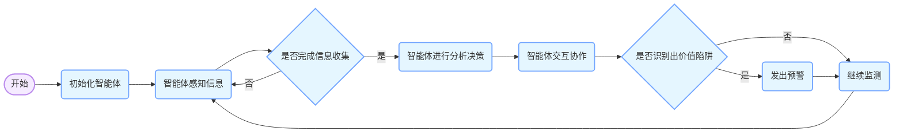

# 多智能体系统在识别价值陷阱中的应用：防范投资风险

> 关键词：多智能体系统、价值陷阱、投资风险、风险识别、金融投资

> 摘要：本文深入探讨了多智能体系统在识别价值陷阱、防范投资风险方面的应用。首先介绍了相关背景知识，包括目的、预期读者、文档结构和术语表。接着阐述了多智能体系统和价值陷阱的核心概念及其联系，详细讲解了核心算法原理和具体操作步骤，并给出了相应的 Python 代码示例。通过数学模型和公式进一步分析了多智能体系统在识别价值陷阱中的作用，同时结合项目实战展示了代码的实际应用和解读。还探讨了多智能体系统在金融投资领域的实际应用场景，推荐了相关的学习资源、开发工具框架和论文著作。最后总结了多智能体系统在该领域的未来发展趋势与挑战，并提供了常见问题解答和扩展阅读参考资料，旨在为投资者和相关研究人员提供全面、深入的技术支持和理论指导。

## 1. 背景介绍 
### 1.1 目的和范围
在金融投资领域，价值陷阱是投资者面临的重大挑战之一。价值陷阱指的是那些看似具有投资价值，但实际上由于各种潜在因素而无法实现预期回报，甚至可能导致投资者遭受重大损失的投资机会。传统的投资分析方法在识别价值陷阱方面存在一定的局限性，而多智能体系统作为一种新兴的计算智能技术，具有分布式、自主性、交互性等特点，能够从多个角度对投资目标进行综合分析，有望为识别价值陷阱提供更有效的手段。

本文的目的是详细介绍多智能体系统在识别价值陷阱、防范投资风险中的应用，包括核心概念、算法原理、实际案例等内容。范围涵盖了多智能体系统的基本原理、与价值陷阱识别的结合方式、在不同金融市场中的应用场景等方面。

### 1.2 预期读者
本文的预期读者包括金融投资者、金融分析师、人工智能研究人员、计算机科学家以及对金融科技和风险管理感兴趣的专业人士。对于投资者来说，了解多智能体系统在识别价值陷阱中的应用可以帮助他们做出更明智的投资决策；对于研究人员和开发者来说，本文提供了一个跨学科的研究思路和技术实现方法。

### 1.3 文档结构概述
本文共分为十个部分。第一部分为背景介绍，阐述了文章的目的、预期读者、文档结构和术语表；第二部分介绍多智能体系统和价值陷阱的核心概念及其联系，并给出相应的示意图和流程图；第三部分详细讲解核心算法原理和具体操作步骤，并用 Python 代码进行说明；第四部分通过数学模型和公式分析多智能体系统在识别价值陷阱中的作用，并举例说明；第五部分是项目实战，包括开发环境搭建、源代码实现和代码解读；第六部分探讨多智能体系统在实际金融投资中的应用场景；第七部分推荐相关的学习资源、开发工具框架和论文著作；第八部分总结多智能体系统在该领域的未来发展趋势与挑战；第九部分为附录，提供常见问题解答；第十部分列出扩展阅读和参考资料。

### 1.4 术语表
#### 1.4.1 核心术语定义
- **多智能体系统（Multi - Agent System，MAS）**：由多个智能体组成的系统，每个智能体具有一定的自主性和智能，能够在环境中感知信息、做出决策并与其他智能体进行交互，以实现系统的整体目标。
- **价值陷阱（Value Trap）**：指那些表面上看起来具有较低的估值（如低市盈率、低市净率等），但实际上由于公司基本面存在问题（如行业衰退、管理不善、财务造假等），导致股价难以提升甚至持续下跌的投资标的。
- **投资风险（Investment Risk）**：指投资者在投资过程中面临的各种不确定性，可能导致投资收益低于预期甚至本金损失的可能性。

#### 1.4.2 相关概念解释
- **智能体（Agent）**：是一个具有自主性、反应性、社会性和主动性的实体，能够感知环境并根据自身的目标和知识采取行动。在多智能体系统中，智能体可以是软件程序、机器人等。
- **分布式计算（Distributed Computing）**：将一个大型的计算任务分解为多个小任务，分配给多个计算节点同时进行处理，以提高计算效率和系统的可靠性。多智能体系统通常采用分布式计算的方式进行信息处理和决策。
- **金融基本面分析（Fundamental Analysis）**：通过研究公司的财务报表、行业前景、宏观经济环境等因素，评估公司的内在价值和投资潜力的一种分析方法。

#### 1.4.3 缩略词列表
- MAS：Multi - Agent System（多智能体系统）
- AI：Artificial Intelligence（人工智能）
- ML：Machine Learning（机器学习）

## 2. 核心概念与联系 
### 2.1 多智能体系统的原理和架构
多智能体系统由多个智能体组成，每个智能体具有自己的感知器、决策器和执行器。感知器用于感知环境中的信息，决策器根据感知到的信息和自身的目标进行决策，执行器将决策结果转化为具体的行动。智能体之间通过通信机制进行信息交互和协作，以实现系统的整体目标。

多智能体系统的架构可以分为集中式、分布式和混合式三种。集中式架构中，有一个中央控制节点负责协调所有智能体的行为；分布式架构中，智能体之间的地位平等，通过自主协商和协作来完成任务；混合式架构则结合了集中式和分布式的特点。

以下是多智能体系统的原理和架构的文本示意图：

```plaintext
           环境
            |
  +----------------------+
  |  多智能体系统       |
  |  +----------------+  |
  |  |  智能体 1      |  |
  |  |  +----------+  |  |
  |  |  | 感知器  |  |  |
  |  |  +----------+  |  |
  |  |  | 决策器  |  |  |
  |  |  +----------+  |  |
  |  |  | 执行器  |  |  |
  |  |  +----------+  |  |
  |  +----------------+  |
  |  +----------------+  |
  |  |  智能体 2      |  |
  |  |  +----------+  |  |
  |  |  | 感知器  |  |  |
  |  |  +----------+  |  |
  |  |  | 决策器  |  |  |
  |  |  +----------+  |  |
  |  |  | 执行器  |  |  |
  |  |  +----------+  |  |
  |  +----------------+  |
  | ...                |
  |  +----------------+  |
  |  |  智能体 n      |  |
  |  |  +----------+  |  |
  |  |  | 感知器  |  |  |
  |  |  +----------+  |  |
  |  |  | 决策器  |  |  |
  |  |  +----------+  |  |
  |  |  | 执行器  |  |  |
  |  |  +----------+  |  |
  |  +----------------+  |
  +----------------------+
```

### 2.2 价值陷阱的形成机制
价值陷阱的形成通常与公司的基本面、行业环境和市场情绪等因素有关。从公司基本面来看，可能存在财务造假、管理不善、产品竞争力下降等问题；从行业环境来看，行业可能处于衰退期，市场需求减少，竞争加剧；从市场情绪来看，投资者可能对某些股票过度乐观或悲观，导致股价偏离其内在价值。

### 2.3 多智能体系统与价值陷阱识别的联系
多智能体系统可以通过多个智能体从不同角度对投资目标进行分析，从而更全面地识别价值陷阱。例如，一些智能体可以负责收集公司的财务数据和行业信息，进行基本面分析；另一些智能体可以监测市场情绪和投资者行为，分析市场的非理性因素；还有一些智能体可以与其他智能体进行交互和协作，综合各种信息做出决策。

以下是多智能体系统在识别价值陷阱中的 Mermaid 流程图：



## 3. 核心算法原理 & 具体操作步骤 
### 3.1 核心算法原理
多智能体系统在识别价值陷阱中常用的算法包括基于规则的推理算法、机器学习算法和博弈论算法等。

#### 3.1.1 基于规则的推理算法
基于规则的推理算法是根据预先定义的规则对投资目标进行分析和判断。例如，可以定义一些规则来判断公司的财务指标是否健康，如市盈率是否过高、资产负债率是否过高等。如果某个投资目标违反了这些规则，则可能存在价值陷阱。

以下是一个简单的基于规则的推理算法的 Python 代码示例：

```python
def rule_based_analysis(financial_data):
    # 定义规则
    pe_ratio_threshold = 30  # 市盈率阈值
    debt_ratio_threshold = 0.7  # 资产负债率阈值

    pe_ratio = financial_data['pe_ratio']
    debt_ratio = financial_data['debt_ratio']

    if pe_ratio > pe_ratio_threshold or debt_ratio > debt_ratio_threshold:
        return True  # 可能存在价值陷阱
    else:
        return False  # 不太可能存在价值陷阱

# 示例财务数据
financial_data = {
    'pe_ratio': 35,
    'debt_ratio': 0.8
}

result = rule_based_analysis(financial_data)
print(f"是否可能存在价值陷阱: {result}")
```

#### 3.1.2 机器学习算法
机器学习算法可以通过对历史数据的学习，自动发现数据中的模式和规律，从而对投资目标进行预测和分类。常用的机器学习算法包括决策树、支持向量机、神经网络等。

以下是一个使用决策树算法进行价值陷阱识别的 Python 代码示例：

```python
import pandas as pd
from sklearn.model_selection import train_test_split
from sklearn.tree import DecisionTreeClassifier
from sklearn.metrics import accuracy_score

# 读取数据
data = pd.read_csv('financial_data.csv')

# 划分特征和标签
X = data.drop('is_value_trap', axis=1)
y = data['is_value_trap']

# 划分训练集和测试集
X_train, X_test, y_train, y_test = train_test_split(X, y, test_size=0.2, random_state=42)

# 创建决策树分类器
clf = DecisionTreeClassifier()

# 训练模型
clf.fit(X_train, y_train)

# 预测
y_pred = clf.predict(X_test)

# 计算准确率
accuracy = accuracy_score(y_test, y_pred)
print(f"模型准确率: {accuracy}")
```

#### 3.1.3 博弈论算法
博弈论算法可以用于分析智能体之间的交互和竞争关系，从而优化多智能体系统的决策。在价值陷阱识别中，博弈论算法可以用于分析投资者之间的博弈行为，以及投资者与市场之间的博弈关系。

### 3.2 具体操作步骤
#### 3.2.1 数据收集
首先需要收集与投资目标相关的数据，包括公司的财务数据、行业数据、市场数据等。可以通过金融数据库、财经网站等渠道获取这些数据。

#### 3.2.2 数据预处理
对收集到的数据进行预处理，包括数据清洗、特征选择、数据标准化等操作，以提高数据的质量和可用性。

#### 3.2.3 智能体设计与初始化
根据识别价值陷阱的任务需求，设计不同类型的智能体，并对其进行初始化。每个智能体可以有不同的功能和任务，如数据收集智能体、数据分析智能体、决策智能体等。

#### 3.2.4 智能体交互与协作
智能体之间通过通信机制进行信息交互和协作，共同完成价值陷阱的识别任务。例如，数据收集智能体将收集到的数据发送给数据分析智能体，数据分析智能体对数据进行分析后将结果发送给决策智能体，决策智能体根据分析结果做出决策。

#### 3.2.5 结果评估与反馈
对识别结果进行评估，判断识别的准确性和可靠性。如果识别结果不理想，可以对智能体的参数和算法进行调整，以提高识别效果。

## 4. 数学模型和公式 & 详细讲解 & 举例说明 
### 4.1 基于风险评估的数学模型
在识别价值陷阱时，可以建立基于风险评估的数学模型。假设投资目标的风险可以用多个指标来衡量，如市盈率（$PE$）、市净率（$PB$）、资产负债率（$DR$）等。可以定义一个综合风险指标 $R$ 来评估投资目标的风险程度：

$$R = w_1 \times f_1(PE) + w_2 \times f_2(PB) + w_3 \times f_3(DR)$$

其中，$w_1$、$w_2$、$w_3$ 是各个指标的权重，满足 $w_1 + w_2 + w_3 = 1$；$f_1(PE)$、$f_2(PB)$、$f_3(DR)$ 是各个指标的风险评估函数。

例如，对于市盈率指标，可以定义风险评估函数为：

$$f_1(PE) = \begin{cases}
0, & PE \leq PE_{threshold} \\
\frac{PE - PE_{threshold}}{PE_{max} - PE_{threshold}}, & PE_{threshold} < PE < PE_{max} \\
1, & PE \geq PE_{max}
\end{cases}$$

其中，$PE_{threshold}$ 是市盈率的阈值，$PE_{max}$ 是市盈率的最大值。

### 4.2 举例说明
假设某公司的市盈率 $PE = 35$，市净率 $PB = 2$，资产负债率 $DR = 0.8$，各个指标的权重分别为 $w_1 = 0.4$，$w_2 = 0.3$，$w_3 = 0.3$，市盈率的阈值 $PE_{threshold} = 30$，最大值 $PE_{max} = 50$，市净率的阈值 $PB_{threshold} = 1.5$，最大值 $PB_{max} = 3$，资产负债率的阈值 $DR_{threshold} = 0.6$，最大值 $DR_{max} = 1$。

首先计算各个指标的风险评估值：

对于市盈率：

$$f_1(35) = \frac{35 - 30}{50 - 30} = 0.25$$

对于市净率：

$$f_2(2) = \frac{2 - 1.5}{3 - 1.5} = 0.33$$

对于资产负债率：

$$f_3(0.8) = \frac{0.8 - 0.6}{1 - 0.6} = 0.5$$

然后计算综合风险指标：

$$R = 0.4 \times 0.25 + 0.3 \times 0.33 + 0.3 \times 0.5 = 0.349$$

根据综合风险指标 $R$ 的值，可以判断该公司的投资风险程度。如果 $R$ 的值超过某个阈值，则认为该公司可能存在价值陷阱。

## 5. 项目实战：代码实际案例和详细解释说明 
### 5.1  开发环境搭建
#### 5.1.1 安装 Python
首先需要安装 Python 编程语言。可以从 Python 官方网站（https://www.python.org/downloads/）下载适合自己操作系统的 Python 版本，并按照安装向导进行安装。

#### 5.1.2 安装必要的库
在项目中需要使用一些 Python 库，如 Pandas、NumPy、Scikit - learn 等。可以使用以下命令来安装这些库：

```bash
pip install pandas numpy scikit-learn
```

### 5.2  源代码详细实现和代码解读
以下是一个完整的多智能体系统在识别价值陷阱中的 Python 代码示例：

```python
import pandas as pd
import numpy as np
from sklearn.model_selection import train_test_split
from sklearn.tree import DecisionTreeClassifier
from sklearn.metrics import accuracy_score

# 定义数据收集智能体
class DataCollectorAgent:
    def __init__(self, data_file):
        self.data_file = data_file

    def collect_data(self):
        data = pd.read_csv(self.data_file)
        return data

# 定义数据分析智能体
class DataAnalyzerAgent:
    def __init__(self):
        pass

    def preprocess_data(self, data):
        # 划分特征和标签
        X = data.drop('is_value_trap', axis=1)
        y = data['is_value_trap']
        return X, y

    def split_data(self, X, y):
        # 划分训练集和测试集
        X_train, X_test, y_train, y_test = train_test_split(X, y, test_size=0.2, random_state=42)
        return X_train, X_test, y_train, y_test

    def train_model(self, X_train, y_train):
        # 创建决策树分类器
        clf = DecisionTreeClassifier()
        # 训练模型
        clf.fit(X_train, y_train)
        return clf

    def predict(self, clf, X_test):
        # 预测
        y_pred = clf.predict(X_test)
        return y_pred

# 定义决策智能体
class DecisionAgent:
    def __init__(self):
        pass

    def evaluate_result(self, y_test, y_pred):
        # 计算准确率
        accuracy = accuracy_score(y_test, y_pred)
        return accuracy

# 主程序
if __name__ == "__main__":
    # 初始化数据收集智能体
    data_collector = DataCollectorAgent('financial_data.csv')
    # 收集数据
    data = data_collector.collect_data()

    # 初始化数据分析智能体
    data_analyzer = DataAnalyzerAgent()
    # 数据预处理
    X, y = data_analyzer.preprocess_data(data)
    # 划分数据集
    X_train, X_test, y_train, y_test = data_analyzer.split_data(X, y)
    # 训练模型
    clf = data_analyzer.train_model(X_train, y_train)
    # 预测
    y_pred = data_analyzer.predict(clf, X_test)

    # 初始化决策智能体
    decision_agent = DecisionAgent()
    # 评估结果
    accuracy = decision_agent.evaluate_result(y_test, y_pred)
    print(f"模型准确率: {accuracy}")
```

### 5.3  代码解读与分析
#### 5.3.1 数据收集智能体（DataCollectorAgent）
该智能体负责从 CSV 文件中读取数据。通过 `collect_data` 方法，使用 Pandas 库的 `read_csv` 函数读取数据文件，并返回数据。

#### 5.3.2 数据分析智能体（DataAnalyzerAgent）
该智能体负责数据预处理、数据集划分、模型训练和预测。
- `preprocess_data` 方法：将数据划分为特征矩阵 $X$ 和标签向量 $y$。
- `split_data` 方法：使用 `train_test_split` 函数将数据集划分为训练集和测试集。
- `train_model` 方法：创建决策树分类器，并使用训练集数据对模型进行训练。
- `predict` 方法：使用训练好的模型对测试集数据进行预测。

#### 5.3.3 决策智能体（DecisionAgent）
该智能体负责评估模型的预测结果。通过 `evaluate_result` 方法，使用 `accuracy_score` 函数计算模型的准确率。

#### 5.3.4 主程序
在主程序中，依次初始化数据收集智能体、数据分析智能体和决策智能体，并调用它们的方法完成数据收集、数据分析和结果评估的任务。

## 6. 实际应用场景 
### 6.1 股票投资
在股票投资中，多智能体系统可以帮助投资者识别价值陷阱。通过收集上市公司的财务数据、行业数据和市场数据，多个智能体可以从不同角度对股票进行分析。例如，一些智能体可以分析公司的盈利能力、偿债能力和成长能力等基本面指标；另一些智能体可以监测市场情绪和投资者行为，分析股票的估值是否合理。通过综合分析，多智能体系统可以及时发现那些看似便宜但实际上存在价值陷阱的股票，帮助投资者避免投资损失。

### 6.2 基金投资
在基金投资中，多智能体系统可以用于评估基金的投资价值和风险。智能体可以收集基金的历史业绩、投资组合、基金经理的背景等信息，对基金进行全面的分析。例如，一些智能体可以分析基金的业绩稳定性和风险调整后收益；另一些智能体可以评估基金的投资组合是否合理，是否存在集中投资于某个行业或股票的风险。通过多智能体系统的分析，投资者可以更好地选择适合自己的基金产品，避免投资那些可能存在价值陷阱的基金。

### 6.3 债券投资
在债券投资中，多智能体系统可以帮助投资者识别债券的信用风险和市场风险。智能体可以收集债券发行人的财务状况、信用评级、行业前景等信息，对债券的信用质量进行评估。同时，智能体还可以监测市场利率的变化和债券的流动性，分析债券的市场风险。通过多智能体系统的综合分析，投资者可以避免投资那些信用质量较差、存在价值陷阱的债券。

## 7. 工具和资源推荐
### 7.1 学习资源推荐
#### 7.1.1 书籍推荐
- 《多智能体系统导论》：全面介绍了多智能体系统的基本概念、理论和方法，是学习多智能体系统的经典教材。
- 《金融数据分析与挖掘》：介绍了金融数据的分析和挖掘方法，包括机器学习、深度学习等技术在金融领域的应用。
- 《聪明的投资者》：价值投资领域的经典著作，对投资者识别价值陷阱、做出明智的投资决策具有重要的指导意义。

#### 7.1.2 在线课程
- Coursera 上的“Artificial Intelligence for Robotics”：该课程介绍了人工智能在机器人领域的应用，其中涉及到多智能体系统的相关知识。
- edX 上的“Financial Markets”：由耶鲁大学教授罗伯特·席勒（Robert Shiller）授课，讲解了金融市场的基本原理和投资策略。
- 中国大学 MOOC 上的“金融大数据分析”：介绍了金融大数据的处理和分析方法，包括数据挖掘、机器学习等技术在金融领域的应用。

#### 7.1.3 技术博客和网站
- Towards Data Science：一个专注于数据科学和机器学习的技术博客，上面有很多关于多智能体系统和金融数据分析的文章。
- arXiv：一个预印本平台，上面可以找到很多关于人工智能、金融科技等领域的最新研究成果。
- 东方财富网、雪球网等财经网站：可以获取最新的金融市场数据和资讯，同时也有很多投资者分享的投资经验和分析报告。

### 7.2 开发工具框架推荐
#### 7.2.1 IDE和编辑器
- PyCharm：一款专门为 Python 开发设计的集成开发环境，具有代码自动补全、调试、版本控制等功能，非常适合开发多智能体系统和金融数据分析项目。
- Jupyter Notebook：一个交互式的开发环境，可以方便地进行数据探索、模型训练和结果展示，是数据科学家和分析师常用的工具之一。

#### 7.2.2 调试和性能分析工具
- PDB：Python 自带的调试工具，可以帮助开发者定位代码中的错误和问题。
- cProfile：Python 自带的性能分析工具，可以分析代码的运行时间和内存使用情况，帮助开发者优化代码性能。

#### 7.2.3 相关框架和库
- Mesa：一个用于构建多智能体系统的 Python 框架，提供了丰富的智能体模型和可视化工具。
- TensorFlow、PyTorch：深度学习框架，可以用于构建和训练复杂的机器学习模型，如神经网络。
- Pandas、NumPy：用于数据处理和分析的 Python 库，提供了高效的数据结构和数据操作方法。

### 7.3 相关论文著作推荐
#### 7.3.1 经典论文
- “Multi-Agent Systems: A Modern Approach to Distributed Artificial Intelligence”：该论文系统地介绍了多智能体系统的基本概念、理论和方法，是多智能体系统领域的经典论文之一。
- “The Efficient Market Hypothesis and Its Critics”：对有效市场假说进行了深入的探讨和批判，对于理解金融市场的运行机制和投资风险具有重要的意义。

#### 7.3.2 最新研究成果
- 可以通过 arXiv、IEEE Xplore、ACM Digital Library 等学术数据库搜索关于多智能体系统在金融领域应用的最新研究成果。

#### 7.3.3 应用案例分析
- 《金融科技前沿：应用与趋势》：介绍了金融科技在各个领域的应用案例和发展趋势，其中包括多智能体系统在金融风险管理中的应用案例。

## 8. 总结：未来发展趋势与挑战
### 8.1 未来发展趋势
#### 8.1.1 与深度学习的融合
多智能体系统与深度学习的融合将是未来的一个重要发展趋势。深度学习可以帮助智能体更好地处理复杂的非结构化数据，如文本、图像和视频等，从而提高多智能体系统在识别价值陷阱中的准确性和效率。

#### 8.1.2 应用领域的拓展
多智能体系统在识别价值陷阱中的应用将不仅仅局限于金融投资领域，还将拓展到其他领域，如供应链管理、医疗保健、能源管理等。在这些领域中，多智能体系统可以帮助企业识别潜在的风险和问题，做出更明智的决策。

#### 8.1.3 智能化和自主化程度的提高
未来的多智能体系统将具有更高的智能化和自主化程度。智能体可以自动学习和适应环境的变化，自主调整决策策略，从而更好地应对复杂多变的投资环境。

### 8.2 挑战
#### 8.2.1 数据质量和隐私问题
多智能体系统在识别价值陷阱中需要大量的高质量数据。然而，数据的质量和隐私问题是一个亟待解决的挑战。数据可能存在缺失、错误和不一致等问题，同时，数据的隐私保护也是一个重要的问题。

#### 8.2.2 算法的可解释性
深度学习等复杂算法在提高多智能体系统性能的同时，也带来了算法的可解释性问题。投资者和监管机构需要了解算法的决策过程和依据，以便做出合理的决策和监管。

#### 8.2.3 智能体之间的协作和协调
多智能体系统中智能体之间的协作和协调是一个复杂的问题。智能体之间可能存在利益冲突和信息不对称等问题，需要设计有效的协作机制和协调策略，以确保系统的整体性能和稳定性。

## 9. 附录：常见问题与解答
### 9.1 多智能体系统在识别价值陷阱中的准确率如何保证？
多智能体系统的准确率可以通过以下几个方面来保证：
- 数据质量：收集高质量、准确的数据，并进行有效的数据预处理。
- 算法选择：选择合适的算法，并进行调优和优化。
- 模型评估：使用多种评估指标对模型进行评估，并进行交叉验证。
- 智能体协作：设计有效的智能体协作机制，充分发挥各个智能体的优势。

### 9.2 多智能体系统与传统投资分析方法相比有哪些优势？
多智能体系统与传统投资分析方法相比，具有以下优势：
- 分布式处理：可以从多个角度对投资目标进行分析，提高分析的全面性和准确性。
- 自主性和交互性：智能体可以自主感知环境、做出决策，并与其他智能体进行交互和协作，适应复杂多变的投资环境。
- 实时性：可以实时监测市场变化，及时发现价值陷阱和投资机会。

### 9.3 如何选择适合的智能体算法？
选择适合的智能体算法需要考虑以下几个因素：
- 问题的性质：根据识别价值陷阱的具体问题，选择合适的算法，如基于规则的推理算法、机器学习算法或博弈论算法。
- 数据特点：根据数据的类型、规模和分布等特点，选择适合的算法。
- 计算资源：考虑计算资源的限制，选择计算复杂度合适的算法。

## 10. 扩展阅读 & 参考资料
### 10.1 扩展阅读
- 《人工智能：一种现代的方法》：全面介绍了人工智能的基本概念、理论和方法，是学习人工智能的经典教材。
- 《金融炼金术》：乔治·索罗斯（George Soros）的著作，阐述了他的投资哲学和反射理论，对于理解金融市场的运行机制和投资风险具有重要的启示。

### 10.2 参考资料
- 相关学术论文和研究报告。
- 金融数据库和财经网站提供的数据和资讯。
- 开源代码库和技术论坛上的相关代码和讨论。

作者：AI天才研究院/AI Genius Institute & 禅与计算机程序设计艺术 /Zen And The Art of Computer Programming