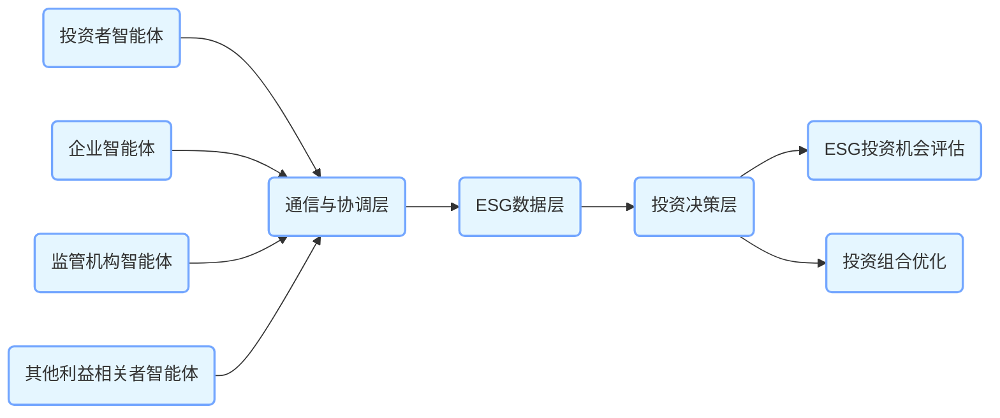

# 多智能体系统在识别和评估ESG投资机会中的作用

> 关键词：多智能体系统、ESG投资机会、识别与评估、人工智能、金融科技

> 摘要：本文深入探讨了多智能体系统在识别和评估ESG投资机会中的作用。首先介绍了研究的背景、目的、预期读者和文档结构，明确了相关术语。接着阐述了多智能体系统和ESG投资的核心概念及其联系，给出了相应的原理和架构示意图。详细讲解了核心算法原理和具体操作步骤，并结合Python代码进行说明。同时，介绍了相关的数学模型和公式，并举例说明。通过项目实战，展示了开发环境搭建、源代码实现和代码解读。分析了多智能体系统在识别和评估ESG投资机会中的实际应用场景，推荐了相关的学习资源、开发工具框架和论文著作。最后总结了未来发展趋势与挑战，解答了常见问题，并提供了扩展阅读和参考资料。

## 1. 背景介绍 
### 1.1 目的和范围
近年来，ESG（环境、社会和治理）投资受到了越来越多投资者的关注。ESG投资强调在投资决策过程中不仅要考虑财务因素，还要综合考虑环境、社会和治理等非财务因素。然而，识别和评估ESG投资机会是一个复杂的过程，需要处理大量的数据和信息，并且要考虑多个利益相关者的观点和偏好。

多智能体系统（Multi - Agent System，MAS）是一种由多个智能体组成的系统，每个智能体都具有一定的自主性、学习能力和交互能力。多智能体系统可以模拟多个利益相关者的行为和决策过程，通过智能体之间的交互和协作，实现对ESG投资机会的有效识别和评估。

本文的目的是深入研究多智能体系统在识别和评估ESG投资机会中的作用，探讨其核心概念、算法原理、数学模型，并通过项目实战展示其应用。研究范围涵盖了多智能体系统的基本原理、ESG投资的相关概念、以及两者在投资机会识别和评估中的结合应用。

### 1.2 预期读者
本文预期读者包括金融行业从业者，如投资经理、分析师、基金经理等，他们可以通过本文了解多智能体系统在ESG投资中的应用，为投资决策提供新的思路和方法。同时，计算机科学领域的研究人员和开发者也可以从中获取关于多智能体系统在金融领域应用的案例和技术细节，为进一步的研究和开发提供参考。此外，对ESG投资和人工智能技术感兴趣的学生和爱好者也能从本文中获得有价值的知识。

### 1.3 文档结构概述
本文将按照以下结构进行组织：
1. 背景介绍：阐述研究的目的、范围、预期读者和文档结构，明确相关术语。
2. 核心概念与联系：介绍多智能体系统和ESG投资的核心概念，分析它们之间的联系，并给出相应的原理和架构示意图。
3. 核心算法原理 & 具体操作步骤：详细讲解多智能体系统在识别和评估ESG投资机会中所使用的核心算法原理，并给出具体的操作步骤，同时结合Python代码进行说明。
4. 数学模型和公式 & 详细讲解 & 举例说明：介绍相关的数学模型和公式，对其进行详细讲解，并通过具体例子说明其应用。
5. 项目实战：代码实际案例和详细解释说明：通过一个具体的项目实战，展示开发环境搭建、源代码实现和代码解读。
6. 实际应用场景：分析多智能体系统在识别和评估ESG投资机会中的实际应用场景。
7. 工具和资源推荐：推荐相关的学习资源、开发工具框架和论文著作。
8. 总结：未来发展趋势与挑战：总结多智能体系统在ESG投资中的应用现状，分析未来发展趋势和面临的挑战。
9. 附录：常见问题与解答：解答读者可能遇到的常见问题。
10. 扩展阅读 & 参考资料：提供相关的扩展阅读材料和参考资料。

### 1.4 术语表
#### 1.4.1 核心术语定义
- **多智能体系统（Multi - Agent System，MAS）**：由多个智能体组成的系统，每个智能体能够感知环境、自主决策并与其他智能体进行交互，以实现共同的或各自的目标。
- **ESG投资**：在投资决策过程中，综合考虑环境（Environmental）、社会（Social）和治理（Governance）因素的投资策略。
- **智能体（Agent）**：具有自主性、反应性、社会性和主动性的实体，能够感知环境并采取行动以实现其目标。
- **ESG指标**：用于衡量企业在环境、社会和治理方面表现的一系列指标，如碳排放、员工福利、董事会独立性等。

#### 1.4.2 相关概念解释
- **环境因素**：指企业在生产经营过程中对自然环境产生的影响，如能源消耗、污染排放、资源利用效率等。
- **社会因素**：涉及企业与员工、客户、社区等社会群体之间的关系，包括员工权益、产品质量与安全、社区参与等方面。
- **治理因素**：关注企业的内部管理和决策机制，如董事会结构、高管薪酬、信息披露等。

#### 1.4.3 缩略词列表
- **MAS**：Multi - Agent System（多智能体系统）
- **ESG**：Environmental, Social and Governance（环境、社会和治理）

## 2. 核心概念与联系 

### 2.1 多智能体系统的核心概念
多智能体系统是一种分布式人工智能系统，由多个智能体组成。每个智能体都具有一定的知识、能力和目标，能够在一定的环境中自主地感知和行动。智能体之间可以通过通信和协作来实现共同的目标或解决复杂的问题。

智能体的基本特性包括：
- **自主性**：智能体能够在没有外部干预的情况下自主地做出决策和行动。
- **反应性**：智能体能够感知环境的变化，并及时做出相应的反应。
- **社会性**：智能体能够与其他智能体进行交互和协作，以实现共同的目标。
- **主动性**：智能体能够主动地采取行动，以追求自己的目标。

多智能体系统的架构通常包括智能体层、通信层和协调层。智能体层包含多个智能体，每个智能体负责完成特定的任务。通信层负责智能体之间的信息传递和交互。协调层负责协调智能体之间的行动，以实现系统的整体目标。

### 2.2 ESG投资的核心概念
ESG投资是一种可持续投资策略，它强调在投资决策过程中不仅要考虑财务因素，还要综合考虑环境、社会和治理等非财务因素。ESG投资的目标是在实现财务回报的同时，促进企业的可持续发展和社会的整体利益。

ESG投资的评估通常基于一系列的ESG指标。这些指标可以分为环境指标、社会指标和治理指标。环境指标包括碳排放、能源效率、水资源管理等；社会指标包括员工福利、劳动权益、社区关系等；治理指标包括董事会结构、高管薪酬、信息披露等。

### 2.3 多智能体系统与ESG投资的联系
多智能体系统可以为ESG投资的识别和评估提供有效的支持。在ESG投资中，涉及到多个利益相关者，如投资者、企业、监管机构等，每个利益相关者都有自己的目标和偏好。多智能体系统可以模拟这些利益相关者的行为和决策过程，通过智能体之间的交互和协作，实现对ESG投资机会的全面评估。

例如，投资者智能体可以根据自己的投资目标和风险偏好，对不同的ESG投资机会进行筛选和评估。企业智能体可以提供自身的ESG信息，如环境绩效、社会贡献等。监管机构智能体可以对企业的ESG行为进行监督和管理。通过智能体之间的信息交互和协作，可以更准确地识别和评估ESG投资机会。

### 2.4 核心概念原理和架构的文本示意图
```plaintext
多智能体系统在ESG投资中的应用架构

|---------------------|
|  多智能体系统层     |
|---------------------|
| 投资者智能体        |
| 企业智能体          |
| 监管机构智能体      |
| 其他利益相关者智能体|
|---------------------|
|  通信与协调层       |
|---------------------|
| 信息交互与共享      |
| 智能体协作机制      |
|---------------------|
|  ESG数据层          |
|---------------------|
| 环境数据            |
| 社会数据            |
| 治理数据            |
|---------------------|
|  投资决策层         |
|---------------------|
| ESG投资机会评估     |
| 投资组合优化        |
|---------------------|
```

### 2.5 Mermaid流程图


## 3. 核心算法原理 & 具体操作步骤 

### 3.1 核心算法原理
在多智能体系统中，常用的算法包括强化学习算法、博弈论算法等。下面以强化学习算法为例，介绍其在识别和评估ESG投资机会中的应用原理。

强化学习是一种机器学习方法，它通过智能体与环境的交互来学习最优的行为策略。在ESG投资中，智能体可以看作是投资者，环境可以看作是市场和企业的ESG信息。智能体的目标是通过不断地与环境交互，选择最优的投资策略，以实现最大的投资回报。

强化学习算法的基本要素包括：
- **状态（State）**：表示智能体所处的环境状态，在ESG投资中，状态可以包括企业的ESG指标、市场行情等。
- **动作（Action）**：表示智能体可以采取的行动，在ESG投资中，动作可以包括买入、卖出、持有等投资决策。
- **奖励（Reward）**：表示智能体采取某个动作后获得的即时反馈，在ESG投资中，奖励可以是投资回报、ESG绩效提升等。

智能体通过不断地尝试不同的动作，并根据获得的奖励来更新自己的策略，以逐渐找到最优的投资策略。

### 3.2 具体操作步骤
以下是使用强化学习算法识别和评估ESG投资机会的具体操作步骤：
1. **定义状态空间**：确定智能体所处的环境状态，包括企业的ESG指标、市场行情等。可以将这些指标进行量化和归一化处理，以便于智能体进行处理。
2. **定义动作空间**：确定智能体可以采取的行动，如买入、卖出、持有等。可以根据投资策略的不同，定义不同的动作空间。
3. **定义奖励函数**：根据投资目标和ESG绩效，定义奖励函数。例如，可以将投资回报和ESG绩效的加权和作为奖励。
4. **初始化智能体的策略**：可以使用随机策略或基于经验的策略初始化智能体的策略。
5. **智能体与环境交互**：智能体根据当前的状态选择一个动作，并执行该动作。环境根据智能体的动作给出相应的奖励和下一个状态。
6. **更新智能体的策略**：根据获得的奖励和下一个状态，更新智能体的策略。可以使用Q - learning、深度Q网络（DQN）等算法进行策略更新。
7. **重复步骤5和6**：不断地重复智能体与环境的交互和策略更新过程，直到智能体找到最优的投资策略。

### 3.3 Python源代码实现
```python
import numpy as np

# 定义状态空间、动作空间和奖励函数
state_space = 10  # 假设状态空间有10个状态
action_space = 3  # 假设动作空间有3个动作（买入、卖出、持有）

# 初始化Q表
Q = np.zeros((state_space, action_space))

# 定义超参数
alpha = 0.1  # 学习率
gamma = 0.9  # 折扣因子
epsilon = 0.1  # 探索率

# 定义奖励函数
def reward_function(state, action):
    # 这里简单假设奖励是随机的，实际应用中需要根据ESG投资的具体情况定义
    return np.random.randint(0, 10)

# 定义智能体的动作选择策略（epsilon - greedy）
def choose_action(state):
    if np.random.uniform(0, 1) < epsilon:
        # 探索：随机选择一个动作
        action = np.random.choice(action_space)
    else:
        # 利用：选择Q值最大的动作
        action = np.argmax(Q[state, :])
    return action

# 训练智能体
num_episodes = 1000
for episode in range(num_episodes):
    state = np.random.randint(0, state_space)  # 随机初始化状态
    done = False
    while not done:
        action = choose_action(state)
        reward = reward_function(state, action)
        next_state = np.random.randint(0, state_space)  # 假设下一个状态是随机的
        # 更新Q表
        Q[state, action] = Q[state, action] + alpha * (reward + gamma * np.max(Q[next_state, :]) - Q[state, action])
        state = next_state
        # 可以根据具体情况定义终止条件
        if np.random.uniform(0, 1) < 0.1:
            done = True

# 输出训练后的Q表
print("训练后的Q表：")
print(Q)
```

### 3.4 代码解释
1. **状态空间和动作空间的定义**：`state_space`和`action_space`分别定义了状态空间和动作空间的大小。
2. **Q表的初始化**：`Q`是一个二维数组，用于存储每个状态和动作对应的Q值。
3. **超参数的定义**：`alpha`是学习率，`gamma`是折扣因子，`epsilon`是探索率。
4. **奖励函数的定义**：`reward_function`根据状态和动作返回一个随机的奖励值，实际应用中需要根据ESG投资的具体情况定义。
5. **动作选择策略**：`choose_action`函数使用epsilon - greedy策略选择动作，以平衡探索和利用。
6. **训练过程**：通过循环不断地进行智能体与环境的交互和Q表的更新，直到达到终止条件。
7. **输出结果**：训练结束后，输出训练后的Q表。

## 4. 数学模型和公式 & 详细讲解 & 举例说明 

### 4.1 Q - learning算法的数学模型和公式
Q - learning是一种无模型的强化学习算法，它通过迭代更新Q值来学习最优的行为策略。Q值表示在某个状态下采取某个动作的预期累积奖励。

Q - learning算法的更新公式为：
$$Q(s_t, a_t) \leftarrow Q(s_t, a_t) + \alpha \left[ r_{t+1} + \gamma \max_{a} Q(s_{t+1}, a) - Q(s_t, a_t) \right]$$

其中：
- $s_t$ 表示当前状态
- $a_t$ 表示当前动作
- $r_{t+1}$ 表示执行动作 $a_t$ 后获得的即时奖励
- $s_{t+1}$ 表示执行动作 $a_t$ 后转移到的下一个状态
- $\alpha$ 是学习率，控制每次更新的步长
- $\gamma$ 是折扣因子，用于权衡即时奖励和未来奖励的重要性

### 4.2 详细讲解
Q - learning算法的核心思想是通过不断地尝试不同的动作，并根据获得的奖励来更新Q值，以逐渐逼近最优的Q值。具体步骤如下：
1. **初始化Q表**：将Q表中的所有元素初始化为0。
2. **选择动作**：根据当前状态 $s_t$ 和Q表，使用epsilon - greedy策略选择一个动作 $a_t$。
3. **执行动作**：执行动作 $a_t$，并获得即时奖励 $r_{t+1}$ 和下一个状态 $s_{t+1}$。
4. **更新Q值**：根据Q - learning更新公式，更新当前状态和动作对应的Q值。
5. **重复步骤2 - 4**：不断地重复上述步骤，直到达到终止条件。

### 4.3 举例说明
假设我们有一个简单的ESG投资场景，状态空间 $S = \{s_1, s_2\}$，动作空间 $A = \{a_1, a_2\}$。初始时，Q表如下：
$$Q = \begin{bmatrix}
0 & 0 \\
0 & 0
\end{bmatrix}$$

学习率 $\alpha = 0.1$，折扣因子 $\gamma = 0.9$。

假设当前状态 $s_t = s_1$，根据epsilon - greedy策略选择动作 $a_t = a_1$。执行动作 $a_1$ 后，获得即时奖励 $r_{t+1} = 5$，转移到下一个状态 $s_{t+1} = s_2$。

此时，我们可以计算更新后的Q值：
$$Q(s_1, a_1) \leftarrow Q(s_1, a_1) + \alpha \left[ r_{t+1} + \gamma \max_{a} Q(s_2, a) - Q(s_1, a_1) \right]$$
由于 $Q(s_2, a_1) = 0$，$Q(s_2, a_2) = 0$，$\max_{a} Q(s_2, a) = 0$，则：
$$Q(s_1, a_1) \leftarrow 0 + 0.1 \times (5 + 0.9 \times 0 - 0) = 0.5$$

更新后的Q表为：
$$Q = \begin{bmatrix}
0.5 & 0 \\
0 & 0
\end{bmatrix}$$

通过不断地重复上述过程，Q表会逐渐收敛到最优的Q值，从而得到最优的投资策略。

## 5. 项目实战：代码实际案例和详细解释说明 

### 5.1  开发环境搭建
在进行多智能体系统在识别和评估ESG投资机会的项目实战之前，需要搭建相应的开发环境。以下是具体的步骤：

#### 5.1.1 安装Python
首先，需要安装Python。可以从Python官方网站（https://www.python.org/downloads/）下载适合自己操作系统的Python版本。建议安装Python 3.7及以上版本。

#### 5.1.2 安装必要的库
在Python环境中，需要安装一些必要的库来支持项目的开发。可以使用pip命令来安装这些库，具体如下：
```bash
pip install numpy
pip install pandas
pip install matplotlib
```
- `numpy`：用于进行数值计算和数组操作。
- `pandas`：用于数据处理和分析。
- `matplotlib`：用于数据可视化。

### 5.2  源代码详细实现和代码解读
以下是一个基于多智能体系统的ESG投资机会识别和评估的完整代码示例：

```python
import numpy as np
import pandas as pd
import matplotlib.pyplot as plt

# 定义智能体类
class Agent:
    def __init__(self, state_space, action_space, alpha, gamma, epsilon):
        self.state_space = state_space
        self.action_space = action_space
        self.alpha = alpha
        self.gamma = gamma
        self.epsilon = epsilon
        self.Q = np.zeros((state_space, action_space))

    def choose_action(self, state):
        if np.random.uniform(0, 1) < self.epsilon:
            action = np.random.choice(self.action_space)
        else:
            action = np.argmax(self.Q[state, :])
        return action

    def update_Q(self, state, action, reward, next_state):
        self.Q[state, action] = self.Q[state, action] + self.alpha * (reward + self.gamma * np.max(self.Q[next_state, :]) - self.Q[state, action])

# 定义环境类
class ESGEnvironment:
    def __init__(self, data):
        self.data = data
        self.num_states = len(data)
        self.current_state = 0

    def get_state(self):
        return self.current_state

    def step(self, action):
        reward = self.calculate_reward(action)
        self.current_state = (self.current_state + 1) % self.num_states
        next_state = self.current_state
        done = self.current_state == self.num_states - 1
        return next_state, reward, done

    def calculate_reward(self, action):
        # 这里简单假设奖励与ESG数据和动作有关，实际应用中需要根据具体情况定义
        esg_score = self.data[self.current_state]
        if action == 0:  # 买入
            reward = esg_score * 0.5
        elif action == 1:  # 卖出
            reward = -esg_score * 0.5
        else:  # 持有
            reward = 0
        return reward

# 加载ESG数据
def load_esg_data():
    # 这里简单生成一些随机的ESG数据，实际应用中需要从真实数据源加载
    data = np.random.rand(100)
    return data

# 训练智能体
def train_agent(agent, env, num_episodes):
    rewards = []
    for episode in range(num_episodes):
        state = env.get_state()
        total_reward = 0
        done = False
        while not done:
            action = agent.choose_action(state)
            next_state, reward, done = env.step(action)
            agent.update_Q(state, action, reward, next_state)
            state = next_state
            total_reward += reward
        rewards.append(total_reward)
    return rewards

# 主函数
def main():
    # 加载ESG数据
    esg_data = load_esg_data()

    # 定义环境和智能体
    state_space = len(esg_data)
    action_space = 3
    alpha = 0.1
    gamma = 0.9
    epsilon = 0.1
    env = ESGEnvironment(esg_data)
    agent = Agent(state_space, action_space, alpha, gamma, epsilon)

    # 训练智能体
    num_episodes = 100
    rewards = train_agent(agent, env, num_episodes)

    # 绘制奖励曲线
    plt.plot(rewards)
    plt.xlabel('Episode')
    plt.ylabel('Total Reward')
    plt.title('Training Rewards')
    plt.show()

if __name__ == "__main__":
    main()
```

### 5.3  代码解读与分析
#### 5.3.1 智能体类（Agent）
- `__init__` 方法：初始化智能体的状态空间、动作空间、学习率、折扣因子、探索率和Q表。
- `choose_action` 方法：使用epsilon - greedy策略选择动作。
- `update_Q` 方法：根据Q - learning更新公式更新Q值。

#### 5.3.2 环境类（ESGEnvironment）
- `__init__` 方法：初始化环境的ESG数据、状态数量和当前状态。
- `get_state` 方法：返回当前状态。
- `step` 方法：执行动作，返回下一个状态、奖励和是否终止的标志。
- `calculate_reward` 方法：根据动作和当前状态的ESG分数计算奖励。

#### 5.3.3 加载ESG数据函数（load_esg_data）
该函数用于加载ESG数据，这里简单生成一些随机的ESG数据，实际应用中需要从真实数据源加载。

#### 5.3.4 训练智能体函数（train_agent）
该函数用于训练智能体，通过循环不断地进行智能体与环境的交互和Q表的更新，并记录每个回合的总奖励。

#### 5.3.5 主函数（main）
- 加载ESG数据。
- 定义环境和智能体。
- 训练智能体。
- 绘制奖励曲线，展示训练过程中总奖励的变化情况。

通过这个项目实战，我们可以看到多智能体系统在识别和评估ESG投资机会中的具体应用，以及如何使用强化学习算法来训练智能体，以实现最优的投资策略。

## 6. 实际应用场景 
多智能体系统在识别和评估ESG投资机会中有以下几种实际应用场景：

### 6.1 投资组合优化
投资者可以使用多智能体系统来优化投资组合，以实现ESG目标和财务目标的平衡。不同的智能体可以代表不同的投资者、资产类别或投资策略。通过智能体之间的交互和协作，可以综合考虑ESG因素和财务因素，选择最优的投资组合。

例如，一个投资者智能体可以根据自己的风险偏好和ESG目标，与其他智能体进行信息交流，了解不同资产的ESG绩效和财务回报。然后，通过优化算法，选择合适的资产进行投资，以实现投资组合的优化。

### 6.2 企业ESG绩效评估
企业可以使用多智能体系统来评估自身的ESG绩效，并与同行业的其他企业进行比较。不同的智能体可以代表企业内部的不同部门、利益相关者或外部的评估机构。通过智能体之间的信息共享和协作，可以全面、客观地评估企业的ESG绩效。

例如，一个企业智能体可以收集企业内部的环境、社会和治理数据，并与同行业的其他企业智能体进行比较。同时，外部的评估机构智能体可以提供专业的评估意见和建议，帮助企业改进ESG绩效。

### 6.3 监管和政策制定
监管机构可以使用多智能体系统来监测企业的ESG行为，制定相应的监管政策。不同的智能体可以代表监管机构、企业和投资者。通过智能体之间的交互和信息共享，监管机构可以及时了解企业的ESG动态，制定合理的监管政策，促进企业的可持续发展。

例如，监管机构智能体可以收集企业的ESG信息，对企业的ESG行为进行评估和监测。如果发现企业存在ESG违规行为，可以及时采取措施进行处罚和整改。同时，监管机构可以根据市场的反馈和投资者的需求，制定相应的ESG投资政策和标准。

### 6.4 风险管理
投资者可以使用多智能体系统来管理ESG投资风险。不同的智能体可以代表不同的风险因素、投资策略或风险评估模型。通过智能体之间的交互和协作，可以识别和评估ESG投资中的各种风险，并采取相应的措施进行风险管理。

例如，一个风险评估智能体可以根据企业的ESG指标和市场数据，评估ESG投资的风险水平。然后，投资策略智能体可以根据风险评估结果，调整投资组合，降低风险。同时，风险管理智能体可以实时监测市场动态和企业的ESG变化，及时发出风险预警。

## 7. 工具和资源推荐
### 7.1 学习资源推荐
#### 7.1.1 书籍推荐
- 《多智能体系统导论》：这本书全面介绍了多智能体系统的基本概念、理论和方法，是学习多智能体系统的经典教材。
- 《ESG投资：从理论到实践》：该书详细阐述了ESG投资的理论基础、评估方法和实践案例，对理解ESG投资有很大的帮助。
- 《强化学习：原理与Python实现》：强化学习是多智能体系统中常用的算法之一，这本书结合Python代码，详细讲解了强化学习的原理和实现方法。

#### 7.1.2 在线课程
- Coursera上的“Multi - Agent Systems”课程：由知名教授授课，系统地介绍了多智能体系统的相关知识。
- edX上的“ESG Investing: A Strategic Approach”课程：该课程从战略角度介绍了ESG投资的相关内容。
- 吴恩达的“Deep Reinforcement Learning Specialization”课程：深入讲解了深度强化学习的理论和实践。

#### 7.1.3 技术博客和网站
- AI Stack Exchange：一个关于人工智能的问答社区，其中有很多关于多智能体系统和强化学习的讨论。
- ESG Investor：专注于ESG投资领域的新闻和分析，提供最新的ESG投资动态和研究报告。
- Towards Data Science：一个数据科学和人工智能领域的技术博客，上面有很多关于多智能体系统和强化学习的技术文章。

### 7.2 开发工具框架推荐
#### 7.2.1 IDE和编辑器
- PyCharm：一款专业的Python集成开发环境，提供了丰富的代码编辑、调试和分析功能。
- Jupyter Notebook：一种交互式的开发环境，适合进行数据分析和模型开发。
- Visual Studio Code：一款轻量级的代码编辑器，支持多种编程语言，并且有丰富的扩展插件。

#### 7.2.2 调试和性能分析工具
- pdb：Python自带的调试工具，可以帮助开发者定位代码中的问题。
- cProfile：Python的性能分析工具，可以分析代码的运行时间和内存使用情况。
- TensorBoard：一个用于可视化深度学习模型训练过程的工具，可以帮助开发者监控模型的性能。

#### 7.2.3 相关框架和库
- Mesa：一个用于构建基于智能体的模型的Python框架，提供了丰富的智能体和环境类。
- OpenAI Gym：一个用于开发和比较强化学习算法的工具包，提供了多种环境和基准测试。
- Stable - Baselines3：一个基于PyTorch的强化学习库，提供了多种预训练的强化学习算法。

### 7.3 相关论文著作推荐
#### 7.3.1 经典论文
- “Multi - Agent Systems: A Modern Approach to Distributed Artificial Intelligence”：这篇论文是多智能体系统领域的经典之作，介绍了多智能体系统的基本概念和理论。
- “ESG and Financial Performance: Aggregated Evidence from More Than 2000 Empirical Studies”：该论文对ESG和财务绩效之间的关系进行了全面的综述和分析。
- “Reinforcement Learning: An Introduction”：这是强化学习领域的经典教材，对强化学习的基本原理和算法进行了详细的介绍。

#### 7.3.2 最新研究成果
- 关注顶级学术会议如AAAI、IJCAI、NeurIPS等，这些会议上会有关于多智能体系统和ESG投资的最新研究成果。
- 查阅学术期刊如《Artificial Intelligence》、《Journal of Financial Economics》等，这些期刊会发表相关领域的高质量研究论文。

#### 7.3.3 应用案例分析
- 一些知名金融机构如贝莱德、富达等会发布关于ESG投资的应用案例分析报告，可以从中了解多智能体系统在实际ESG投资中的应用情况。
- 一些企业的社会责任报告中也会包含ESG投资的相关案例，可以作为参考。

## 8. 总结：未来发展趋势与挑战
### 8.1 未来发展趋势
#### 8.1.1 技术融合
多智能体系统将与其他人工智能技术如深度学习、自然语言处理等深度融合，以更全面、准确地识别和评估ESG投资机会。例如，通过深度学习模型对大量的文本数据进行分析，提取企业的ESG信息；利用自然语言处理技术与投资者进行交互，了解他们的需求和偏好。

#### 8.1.2 数据共享与标准化
随着ESG投资的发展，数据共享和标准化将变得越来越重要。多智能体系统可以促进不同利益相关者之间的数据共享和交流，建立统一的ESG数据标准，提高数据的质量和可用性。

#### 8.1.3 应用场景拓展
多智能体系统在ESG投资中的应用场景将不断拓展，除了投资组合优化、企业ESG绩效评估、监管和政策制定、风险管理等领域，还可能应用于ESG保险、绿色债券等新兴领域。

#### 8.1.4 可持续发展导向
未来的多智能体系统将更加注重可持续发展目标的实现，不仅关注企业的ESG绩效和财务回报，还将考虑对社会和环境的长期影响，推动ESG投资向更加可持续的方向发展。

### 8.2 挑战
#### 8.2.1 数据质量和可用性
ESG数据的质量和可用性是多智能体系统在ESG投资中应用的关键挑战之一。目前，ESG数据存在着数据缺失、数据不一致、数据标准不统一等问题，影响了多智能体系统的准确性和可靠性。

#### 8.2.2 算法复杂度和计算资源
多智能体系统中的算法复杂度较高，需要大量的计算资源和时间。特别是在处理大规模的ESG数据和复杂的投资场景时，算法的效率和可扩展性成为了一个挑战。

#### 8.2.3 伦理和法律问题
多智能体系统在ESG投资中的应用涉及到一些伦理和法律问题，如数据隐私保护、算法公平性、责任归属等。需要建立相应的伦理和法律框架，规范多智能体系统的应用。

#### 8.2.4 人才短缺
多智能体系统和ESG投资领域都需要具备跨学科知识和技能的人才，目前这类人才相对短缺，限制了多智能体系统在ESG投资中的推广和应用。

## 9. 附录：常见问题与解答
### 9.1 多智能体系统在ESG投资中的应用与传统投资方法有什么区别？
传统投资方法主要关注财务因素，如企业的盈利能力、资产负债状况等。而多智能体系统在ESG投资中的应用不仅考虑财务因素，还综合考虑环境、社会和治理等非财务因素。通过模拟多个利益相关者的行为和决策过程，多智能体系统可以更全面、客观地评估ESG投资机会，实现财务回报和可持续发展目标的平衡。

### 9.2 如何选择合适的多智能体算法用于ESG投资？
选择合适的多智能体算法需要考虑多个因素，如问题的复杂度、数据的特点、投资目标等。常见的多智能体算法包括强化学习算法、博弈论算法等。如果问题具有较强的动态性和不确定性，可以选择强化学习算法；如果需要考虑多个智能体之间的竞争和合作关系，可以选择博弈论算法。此外，还可以根据实际情况对算法进行改进和优化。

### 9.3 多智能体系统在ESG投资中的应用需要大量的数据，这些数据从哪里获取？
ESG数据可以从多个渠道获取，包括企业的年报、社会责任报告、政府部门发布的统计数据、专业的ESG数据提供商等。此外，还可以通过网络爬虫技术从互联网上收集相关的ESG信息。在获取数据时，需要注意数据的质量和可靠性，对数据进行清洗和预处理。

### 9.4 多智能体系统在ESG投资中的应用是否会增加投资风险？
多智能体系统在ESG投资中的应用本身不会增加投资风险，反而可以通过更全面、准确地评估ESG投资机会，帮助投资者降低风险。然而，由于多智能体系统中的算法和模型存在一定的不确定性，以及ESG数据的质量和可用性问题，可能会对投资决策产生一定的影响。因此，在应用多智能体系统进行ESG投资时，需要对算法和模型进行充分的测试和验证，同时加强对ESG数据的管理和分析。

## 10. 扩展阅读 & 参考资料
### 10.1 扩展阅读
- 《人工智能：现代方法》：这本书全面介绍了人工智能的基本概念、算法和应用，对深入理解多智能体系统有很大的帮助。
- 《可持续金融与投资》：该书从金融和投资的角度，探讨了可持续发展的相关问题，为ESG投资提供了更广阔的视野。
- 《复杂系统与复杂性科学》：多智能体系统是复杂系统的一个重要分支，这本书介绍了复杂系统的基本理论和方法，有助于理解多智能体系统的本质。

### 10.2 参考资料
- 相关的学术论文和研究报告：可以通过学术数据库如IEEE Xplore、ACM Digital Library等查阅多智能体系统和ESG投资领域的最新研究成果。
- 行业报告和白皮书：金融机构、咨询公司等会发布关于ESG投资的行业报告和白皮书，可以从中了解行业动态和实践经验。
- 官方网站和政策文件：政府部门和监管机构的官方网站会发布相关的政策文件和法规，对ESG投资的发展有重要的指导作用。

作者：AI天才研究院/AI Genius Institute & 禅与计算机程序设计艺术 /Zen And The Art of Computer Programming