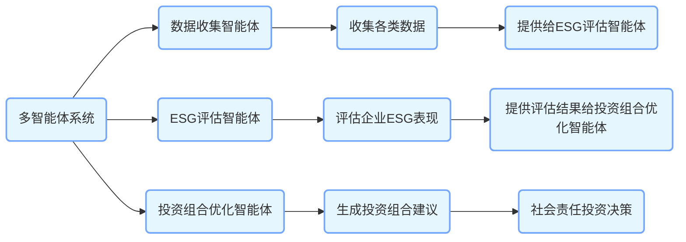

# 多智能体系统在识别和评估社会责任投资机会中的作用

> 关键词：多智能体系统、社会责任投资、机会识别、机会评估、投资决策

> 摘要：本文深入探讨了多智能体系统在识别和评估社会责任投资机会中的作用。首先介绍了研究的背景、目的、预期读者等信息，接着阐述了多智能体系统和社会责任投资的核心概念及联系，详细讲解了相关核心算法原理与具体操作步骤，并给出了数学模型和公式。通过项目实战展示了如何利用多智能体系统进行社会责任投资机会的识别和评估，分析了实际应用场景。同时推荐了学习、开发相关的工具和资源，最后总结了未来发展趋势与挑战，还给出了常见问题解答和扩展阅读参考资料，旨在为相关领域的研究者和从业者提供全面而深入的技术指导和理论支持。

## 1. 背景介绍 
### 1.1 目的和范围
社会责任投资（Socially Responsible Investment，SRI）作为一种将社会、环境和治理（ESG）因素纳入投资决策的理念，近年来受到了越来越多投资者的关注。然而，识别和评估社会责任投资机会是一个复杂的过程，涉及到大量的数据和信息处理，以及多方面的利益考量。多智能体系统（Multi - Agent System，MAS）作为一种分布式人工智能技术，具有自主性、交互性和适应性等特点，能够有效地处理复杂的动态问题。本文的目的是探讨多智能体系统在识别和评估社会责任投资机会中的应用，分析其作用和优势，并通过实际案例展示其可行性和有效性。本文的范围主要涵盖多智能体系统的基本原理、社会责任投资的相关概念、多智能体系统在社会责任投资机会识别和评估中的算法和模型，以及实际应用场景和案例分析。

### 1.2 预期读者
本文的预期读者包括金融领域的投资者、投资经理、金融分析师等，他们希望了解如何利用先进的技术手段提高社会责任投资的决策效率和质量；计算机科学领域的研究者和开发者，对多智能体系统的应用和开发感兴趣；以及对社会责任投资和可持续发展有研究的学者和政策制定者，希望从技术角度深入探讨社会责任投资的发展趋势和解决方案。

### 1.3 文档结构概述
本文共分为十个部分。第一部分为背景介绍，阐述了研究的目的、范围、预期读者和文档结构。第二部分介绍了多智能体系统和社会责任投资的核心概念及联系。第三部分详细讲解了多智能体系统在识别和评估社会责任投资机会中的核心算法原理和具体操作步骤。第四部分给出了相关的数学模型和公式，并进行详细讲解和举例说明。第五部分通过项目实战展示了如何利用多智能体系统进行社会责任投资机会的识别和评估，包括开发环境搭建、源代码实现和代码解读。第六部分分析了多智能体系统在社会责任投资中的实际应用场景。第七部分推荐了学习、开发相关的工具和资源，包括书籍、在线课程、技术博客、IDE、调试工具、相关框架和库以及论文著作等。第八部分总结了多智能体系统在社会责任投资中的未来发展趋势与挑战。第九部分为附录，给出了常见问题与解答。第十部分提供了扩展阅读和参考资料。

### 1.4 术语表
#### 1.4.1 核心术语定义
- **多智能体系统（Multi - Agent System，MAS）**：由多个自主智能体组成的系统，这些智能体能够感知环境、自主决策并与其他智能体进行交互，以实现系统的整体目标。
- **社会责任投资（Socially Responsible Investment，SRI）**：在投资决策过程中，不仅考虑财务回报，还考虑投资对社会、环境和治理方面的影响，追求经济、社会和环境的可持续发展。
- **社会、环境和治理（ESG）因素**：指企业在社会责任方面的表现，包括环境保护、社会责任履行和公司治理等方面的指标。
- **智能体（Agent）**：具有自主性、反应性、社会性和主动性的实体，能够在一定环境中感知信息、进行推理和决策，并采取行动。

#### 1.4.2 相关概念解释
- **分布式人工智能（Distributed Artificial Intelligence，DAI）**：是人工智能的一个分支，研究如何将多个智能体分布在不同的节点上，通过协作和交互来解决复杂的问题。多智能体系统是分布式人工智能的一种具体实现形式。
- **投资组合优化（Portfolio Optimization）**：在一定的风险约束下，通过选择不同的投资资产，使得投资组合的预期收益最大化的过程。在社会责任投资中，还需要考虑ESG因素。
- **数据挖掘（Data Mining）**：从大量的数据中发现有价值的信息和知识的过程。在社会责任投资中，数据挖掘可以用于从各种数据源中提取与ESG因素相关的信息。

#### 1.4.3 缩略词列表
- MAS：Multi - Agent System（多智能体系统）
- SRI：Socially Responsible Investment（社会责任投资）
- ESG：Environmental, Social and Governance（社会、环境和治理）
- DAI：Distributed Artificial Intelligence（分布式人工智能）

## 2. 核心概念与联系 

### 多智能体系统原理
多智能体系统由多个智能体组成，每个智能体都有自己的目标、知识和能力。智能体可以感知周围的环境信息，根据自身的知识和规则进行推理和决策，并通过与其他智能体的交互来实现系统的整体目标。智能体之间的交互方式包括协作、竞争、通信等。多智能体系统的架构可以分为集中式、分布式和混合式三种。集中式架构中，有一个中央控制智能体负责协调所有其他智能体的行为；分布式架构中，智能体之间是平等的，通过自主协商和合作来完成任务；混合式架构则结合了集中式和分布式的特点。

### 社会责任投资概念
社会责任投资强调在投资过程中考虑社会、环境和治理等非财务因素。投资者不仅关注投资的财务回报，还希望通过投资支持那些在环境保护、社会责任履行和公司治理方面表现良好的企业，促进社会的可持续发展。社会责任投资的评估指标通常包括企业的碳排放、员工福利、供应链管理、董事会独立性等。

### 两者联系的文本示意图
多智能体系统与社会责任投资的联系在于，多智能体系统可以为社会责任投资机会的识别和评估提供有效的技术手段。智能体可以分别负责不同的任务，如数据收集、ESG指标评估、投资组合优化等。通过智能体之间的协作和交互，可以实现对大量复杂数据的快速处理和分析，提高社会责任投资决策的效率和准确性。

### Mermaid 流程图


## 3. 核心算法原理 & 具体操作步骤 

### 核心算法原理
在多智能体系统中，用于识别和评估社会责任投资机会的核心算法主要包括数据挖掘算法、机器学习算法和优化算法。

#### 数据挖掘算法
数据挖掘算法用于从大量的数据源中提取与ESG因素相关的信息。例如，关联规则挖掘算法可以发现不同ESG指标之间的关联关系，聚类算法可以将企业按照ESG表现进行分类。

以下是一个使用Python实现的简单关联规则挖掘示例，使用`mlxtend`库：
```python
import pandas as pd
from mlxtend.preprocessing import TransactionEncoder
from mlxtend.frequent_patterns import apriori, association_rules

# 示例交易数据
dataset = [['E1', 'S1', 'G1'], ['E1', 'S2', 'G2'], ['E2', 'S1', 'G1'], ['E2', 'S2', 'G2']]

# 数据编码
te = TransactionEncoder()
te_ary = te.fit(dataset).transform(dataset)
df = pd.DataFrame(te_ary, columns=te.columns_)

# 挖掘频繁项集
frequent_itemsets = apriori(df, min_support=0.5, use_colnames=True)

# 生成关联规则
rules = association_rules(frequent_itemsets, metric="confidence", min_threshold=0.7)

print(rules)
```
在这个示例中，我们首先定义了一个交易数据集，然后使用`TransactionEncoder`对数据进行编码，接着使用`apriori`算法挖掘频繁项集，最后使用`association_rules`生成关联规则。

#### 机器学习算法
机器学习算法用于对企业的ESG表现进行评估和预测。例如，决策树算法可以根据企业的各种特征构建决策模型，预测企业的ESG评级；神经网络算法可以学习ESG指标与企业财务绩效之间的复杂关系。

以下是一个使用Python实现的简单决策树分类示例，使用`scikit-learn`库：
```python
from sklearn.datasets import load_iris
from sklearn.model_selection import train_test_split
from sklearn.tree import DecisionTreeClassifier
from sklearn.metrics import accuracy_score

# 加载数据集
iris = load_iris()
X = iris.data
y = iris.target

# 划分训练集和测试集
X_train, X_test, y_train, y_test = train_test_split(X, y, test_size=0.3, random_state=42)

# 创建决策树分类器
clf = DecisionTreeClassifier()

# 训练模型
clf.fit(X_train, y_train)

# 预测
y_pred = clf.predict(X_test)

# 计算准确率
accuracy = accuracy_score(y_test, y_pred)
print(f"Accuracy: {accuracy}")
```
在这个示例中，我们使用鸢尾花数据集，将数据集划分为训练集和测试集，然后使用`DecisionTreeClassifier`训练决策树模型，最后在测试集上进行预测并计算准确率。

#### 优化算法
优化算法用于在考虑ESG因素的情况下，对投资组合进行优化。例如，遗传算法可以通过模拟自然选择和遗传机制，搜索最优的投资组合。

以下是一个使用Python实现的简单遗传算法示例，使用`deap`库：
```python
import random
from deap import base, creator, tools

# 定义问题类型
creator.create("FitnessMax", base.Fitness, weights=(1.0,))
creator.create("Individual", list, fitness=creator.FitnessMax)

# 初始化工具盒
toolbox = base.Toolbox()

# 定义基因编码
toolbox.register("attr_bool", random.randint, 0, 1)

# 定义个体和种群
toolbox.register("individual", tools.initRepeat, creator.Individual, toolbox.attr_bool, n=10)
toolbox.register("population", tools.initRepeat, list, toolbox.individual)

# 定义适应度函数（示例）
def eval_func(individual):
    return sum(individual),

toolbox.register("evaluate", eval_func)
toolbox.register("mate", tools.cxTwoPoint)
toolbox.register("mutate", tools.mutFlipBit, indpb=0.05)
toolbox.register("select", tools.selTournament, tournsize=3)

# 初始化种群
pop = toolbox.population(n=50)

# 遗传算法参数
NGEN = 40
for gen in range(NGEN):
    offspring = toolbox.select(pop, len(pop))
    offspring = list(map(toolbox.clone, offspring))

    for child1, child2 in zip(offspring[::2], offspring[1::2]):
        if random.random() < 0.5:
            toolbox.mate(child1, child2)
            del child1.fitness.values
            del child2.fitness.values

    for mutant in offspring:
        if random.random() < 0.2:
            toolbox.mutate(mutant)
            del mutant.fitness.values

    invalid_ind = [ind for ind in offspring if not ind.fitness.valid]
    fitnesses = map(toolbox.evaluate, invalid_ind)
    for ind, fit in zip(invalid_ind, fitnesses):
        ind.fitness.values = fit

    pop[:] = offspring

# 输出最优个体
best_ind = tools.selBest(pop, 1)[0]
print("Best individual:", best_ind)
print("Fitness:", best_ind.fitness.values)
```
在这个示例中，我们使用`deap`库实现了一个简单的遗传算法，用于求解一个二进制编码的优化问题。

### 具体操作步骤
#### 数据收集
由数据收集智能体负责从各种数据源（如企业年报、新闻媒体、政府报告等）收集与ESG因素相关的数据，并进行清洗和预处理。

#### ESG评估
ESG评估智能体使用机器学习算法对收集到的数据进行分析，评估企业的ESG表现，给出ESG评级。

#### 投资组合优化
投资组合优化智能体根据企业的ESG评级和财务数据，使用优化算法生成最优的投资组合建议。

#### 决策支持
将投资组合建议提供给投资者，为其社会责任投资决策提供支持。

## 4. 数学模型和公式 & 详细讲解 & 举例说明 

### 投资组合优化模型
在社会责任投资中，投资组合优化的目标是在考虑ESG因素的情况下，最大化投资组合的预期收益，同时控制风险。常用的投资组合优化模型是均值 - 方差模型（Markowitz模型）的扩展。

#### 均值 - 方差模型基本公式
设 $x_i$ 表示投资于第 $i$ 种资产的比例，$\mu_i$ 表示第 $i$ 种资产的预期收益率，$\sigma_{ij}$ 表示第 $i$ 种资产和第 $j$ 种资产的协方差，$n$ 表示资产的数量。投资组合的预期收益率 $E(R_p)$ 和方差 $\sigma_p^2$ 可以表示为：
$$E(R_p)=\sum_{i = 1}^{n}x_i\mu_i$$
$$\sigma_p^2=\sum_{i = 1}^{n}\sum_{j = 1}^{n}x_ix_j\sigma_{ij}$$

#### 考虑ESG因素的扩展模型
在均值 - 方差模型的基础上，引入ESG约束条件。设 $ESG_i$ 表示第 $i$ 种资产的ESG得分，$ESG_{min}$ 表示投资者要求的最低ESG得分。则扩展后的投资组合优化模型可以表示为：
$$\max E(R_p)=\sum_{i = 1}^{n}x_i\mu_i$$
$$\text{s.t.}\quad \sigma_p^2\leq\sigma_{max}^2$$
$$\sum_{i = 1}^{n}x_iESG_i\geq ESG_{min}$$
$$\sum_{i = 1}^{n}x_i = 1$$
$$x_i\geq0, \quad i = 1,2,\cdots,n$$

### 详细讲解
上述模型的目标是最大化投资组合的预期收益率 $E(R_p)$，同时满足风险约束（投资组合的方差 $\sigma_p^2$ 不超过最大允许方差 $\sigma_{max}^2$）和ESG约束（投资组合的ESG得分不低于最低要求 $ESG_{min}$）。约束条件 $\sum_{i = 1}^{n}x_i = 1$ 表示投资组合的总投资比例为1，$x_i\geq0$ 表示不允许卖空。

### 举例说明
假设市场上有三种资产 $A$、$B$、$C$，其预期收益率分别为 $\mu_A = 0.1$，$\mu_B = 0.12$，$\mu_C = 0.15$，协方差矩阵为：
$$\Sigma=\begin{bmatrix}
0.04 & 0.01 & 0.02\\
0.01 & 0.09 & 0.03\\
0.02 & 0.03 & 0.16
\end{bmatrix}$$
ESG得分分别为 $ESG_A = 0.8$，$ESG_B = 0.9$，$ESG_C = 0.7$，投资者要求的最低ESG得分 $ESG_{min}=0.85$，最大允许方差 $\sigma_{max}^2 = 0.05$。

我们可以使用Python的`cvxpy`库来求解这个优化问题：
```python
import cvxpy as cp
import numpy as np

# 预期收益率
mu = np.array([0.1, 0.12, 0.15])

# 协方差矩阵
Sigma = np.array([[0.04, 0.01, 0.02],
                  [0.01, 0.09, 0.03],
                  [0.02, 0.03, 0.16]])

# ESG得分
ESG = np.array([0.8, 0.9, 0.7])

# 最低ESG得分和最大允许方差
ESG_min = 0.85
sigma_max_sq = 0.05

# 定义决策变量
x = cp.Variable(3)

# 定义目标函数
objective = cp.Maximize(mu @ x)

# 定义约束条件
constraints = [
    cp.quad_form(x, Sigma) <= sigma_max_sq,
    ESG @ x >= ESG_min,
    cp.sum(x) == 1,
    x >= 0
]

# 定义问题并求解
prob = cp.Problem(objective, constraints)
prob.solve()

# 输出结果
print("Optimal portfolio weights:", x.value)
print("Optimal expected return:", objective.value)
```
在这个示例中，我们使用`cvxpy`库定义了优化问题的目标函数和约束条件，并求解得到最优的投资组合权重和预期收益率。

## 5. 项目实战：代码实际案例和详细解释说明 

### 5.1  开发环境搭建
#### 安装Python
首先需要安装Python环境，建议使用Python 3.7及以上版本。可以从Python官方网站（https://www.python.org/downloads/）下载安装包进行安装。

#### 安装必要的库
使用`pip`命令安装以下必要的库：
```bash
pip install pandas numpy scikit-learn mlxtend deap cvxpy
```

### 5.2  源代码详细实现和代码解读
以下是一个完整的多智能体系统在社会责任投资机会识别和评估中的代码示例：
```python
import pandas as pd
import numpy as np
from sklearn.tree import DecisionTreeClassifier
from sklearn.model_selection import train_test_split
from sklearn.metrics import accuracy_score
from mlxtend.preprocessing import TransactionEncoder
from mlxtend.frequent_patterns import apriori, association_rules
from deap import base, creator, tools
import cvxpy as cp

# 数据收集智能体
def data_collection():
    # 示例数据
    esg_data = [['E1', 'S1', 'G1'], ['E1', 'S2', 'G2'], ['E2', 'S1', 'G1'], ['E2', 'S2', 'G2']]
    financial_data = np.array([[100, 20, 0.1], [150, 30, 0.12], [200, 40, 0.15], [250, 50, 0.18]])
    return esg_data, financial_data

# ESG评估智能体
def esg_evaluation(esg_data):
    # 关联规则挖掘
    te = TransactionEncoder()
    te_ary = te.fit(esg_data).transform(esg_data)
    df = pd.DataFrame(te_ary, columns=te.columns_)
    frequent_itemsets = apriori(df, min_support=0.5, use_colnames=True)
    rules = association_rules(frequent_itemsets, metric="confidence", min_threshold=0.7)

    # 模拟ESG评级
    X = np.random.rand(len(esg_data), 3)
    y = np.random.randint(0, 2, len(esg_data))
    X_train, X_test, y_train, y_test = train_test_split(X, y, test_size=0.3, random_state=42)
    clf = DecisionTreeClassifier()
    clf.fit(X_train, y_train)
    y_pred = clf.predict(X_test)
    accuracy = accuracy_score(y_test, y_pred)
    print(f"ESG evaluation accuracy: {accuracy}")
    return rules

# 投资组合优化智能体
def portfolio_optimization(financial_data, esg_rules):
    # 预期收益率
    mu = financial_data[:, 2]

    # 协方差矩阵（示例）
    Sigma = np.array([[0.04, 0.01, 0.02, 0.03],
                      [0.01, 0.09, 0.03, 0.04],
                      [0.02, 0.03, 0.16, 0.05],
                      [0.03, 0.04, 0.05, 0.25]])

    # 模拟ESG得分
    ESG = np.random.rand(len(financial_data))

    # 最低ESG得分和最大允许方差
    ESG_min = 0.8
    sigma_max_sq = 0.05

    # 定义决策变量
    x = cp.Variable(len(financial_data))

    # 定义目标函数
    objective = cp.Maximize(mu @ x)

    # 定义约束条件
    constraints = [
        cp.quad_form(x, Sigma) <= sigma_max_sq,
        ESG @ x >= ESG_min,
        cp.sum(x) == 1,
        x >= 0
    ]

    # 定义问题并求解
    prob = cp.Problem(objective, constraints)
    prob.solve()

    # 输出结果
    print("Optimal portfolio weights:", x.value)
    print("Optimal expected return:", objective.value)
    return x.value

# 主函数
def main():
    esg_data, financial_data = data_collection()
    esg_rules = esg_evaluation(esg_data)
    portfolio_weights = portfolio_optimization(financial_data, esg_rules)

if __name__ == "__main__":
    main()
```
### 5.3  代码解读与分析
- **数据收集智能体（`data_collection`函数）**：模拟收集ESG数据和财务数据，实际应用中可以从各种数据源获取数据。
- **ESG评估智能体（`esg_evaluation`函数）**：首先使用关联规则挖掘算法分析ESG数据，然后使用决策树算法模拟ESG评级，并计算评估准确率。
- **投资组合优化智能体（`portfolio_optimization`函数）**：根据财务数据和模拟的ESG得分，使用`cvxpy`库求解投资组合优化问题，得到最优的投资组合权重和预期收益率。
- **主函数（`main`函数）**：依次调用数据收集、ESG评估和投资组合优化智能体，完成社会责任投资机会的识别和评估过程。

## 6. 实际应用场景 
### 金融机构投资决策
银行、基金公司等金融机构在进行投资决策时，可以使用多智能体系统识别和评估社会责任投资机会。通过多智能体系统对企业的ESG表现进行评估，筛选出符合社会责任投资标准的企业，并生成最优的投资组合建议，帮助金融机构在追求财务回报的同时，实现社会和环境效益。

### 企业战略规划
企业可以利用多智能体系统评估自身的ESG表现，并与同行业企业进行对比。通过分析多智能体系统给出的评估结果，企业可以发现自身在社会责任方面的优势和不足，制定相应的战略规划，提高企业的可持续发展能力。

### 政府监管和政策制定
政府监管部门可以使用多智能体系统对企业的社会责任履行情况进行监测和评估。通过分析企业的ESG数据，政府可以制定更加科学合理的监管政策和激励措施，引导企业积极履行社会责任，促进社会的可持续发展。

## 7. 工具和资源推荐
### 7.1 学习资源推荐
#### 7.1.1 书籍推荐
- 《多智能体系统：原理与编程》：全面介绍了多智能体系统的基本原理、设计方法和编程技术。
- 《社会责任投资：理论与实践》：详细阐述了社会责任投资的概念、评估方法和投资策略。
- 《Python机器学习实战》：通过大量的实际案例，介绍了Python在机器学习领域的应用，包括数据挖掘、模型训练和评估等。

#### 7.1.2 在线课程
- Coursera上的“Multi - Agent Systems”课程：由知名高校的教授授课，系统介绍了多智能体系统的理论和实践。
- edX上的“Socially Responsible Investment”课程：讲解了社会责任投资的相关知识和技能。
- 慕课网上的“Python数据分析与机器学习实战”课程：帮助学习者掌握Python在数据分析和机器学习方面的应用。

#### 7.1.3 技术博客和网站
- Medium上的人工智能和金融科技相关博客：可以获取最新的技术动态和研究成果。
- 金融时报（Financial Times）网站：提供了丰富的社会责任投资相关的新闻和分析文章。
- Kaggle网站：有很多关于数据分析和机器学习的项目和竞赛，可以学习到实际应用中的技巧和方法。

### 7.2 开发工具框架推荐
#### 7.2.1 IDE和编辑器
- PyCharm：一款专业的Python集成开发环境，具有代码编辑、调试、版本控制等功能。
- Jupyter Notebook：交互式的开发环境，适合进行数据探索和模型实验。

#### 7.2.2 调试和性能分析工具
- pdb：Python自带的调试工具，可以帮助开发者定位和解决代码中的问题。
- cProfile：Python的性能分析工具，可以分析代码的运行时间和资源消耗情况。

#### 7.2.3 相关框架和库
- `scikit-learn`：用于机器学习的开源Python库，提供了丰富的算法和工具。
- `mlxtend`：机器学习扩展库，包含了关联规则挖掘等算法。
- `deap`：用于实现遗传算法等进化计算算法的Python库。
- `cvxpy`：用于求解凸优化问题的Python库，可用于投资组合优化。

### 7.3 相关论文著作推荐
#### 7.3.1 经典论文
- “Multi - Agent Systems: A Modern Approach to Distributed Artificial Intelligence”：多智能体系统领域的经典论文，介绍了多智能体系统的基本概念和理论。
- “Socially Responsible Investment: A Review of the Literature”：对社会责任投资领域的研究进行了全面的综述。

#### 7.3.2 最新研究成果
- 可以关注ACM、IEEE等计算机科学领域的顶级会议和期刊，以及金融领域的学术期刊，获取多智能体系统在社会责任投资中的最新研究成果。

#### 7.3.3 应用案例分析
- 一些知名金融机构和研究机构会发布关于社会责任投资的应用案例分析报告，可以从中学习到实际应用中的经验和方法。

## 8. 总结：未来发展趋势与挑战
### 未来发展趋势
- **与区块链技术融合**：区块链技术具有去中心化、不可篡改等特点，可以为多智能体系统在社会责任投资中的数据共享和信任建立提供支持。通过区块链技术，可以确保ESG数据的真实性和可靠性，提高投资决策的透明度。
- **智能化程度不断提高**：随着人工智能技术的不断发展，多智能体系统的智能化程度将不断提高。智能体可以更加自主地进行学习和决策，更好地适应复杂多变的市场环境。
- **应用范围不断扩大**：多智能体系统在社会责任投资中的应用将不仅仅局限于金融领域，还将扩展到能源、环保、医疗等多个领域，促进社会的可持续发展。

### 挑战
- **数据质量和可用性**：社会责任投资涉及到大量的ESG数据，数据的质量和可用性是影响多智能体系统性能的关键因素。目前，ESG数据的收集、整理和标准化还存在一定的问题，需要进一步完善。
- **智能体间的协作和协调**：多智能体系统中智能体之间的协作和协调是一个复杂的问题。如何确保智能体之间的有效沟通和合作，避免冲突和矛盾，是需要解决的挑战之一。
- **法律法规和监管**：社会责任投资是一个新兴的领域，相关的法律法规和监管政策还不够完善。在应用多智能体系统进行社会责任投资时，需要考虑如何遵守法律法规，防范法律风险。

## 9. 附录：常见问题与解答
### 多智能体系统在社会责任投资中的优势是什么？
多智能体系统具有自主性、交互性和适应性等特点，能够有效地处理复杂的动态问题。在社会责任投资中，多智能体系统可以快速处理大量的ESG数据，通过智能体之间的协作和交互，提高投资决策的效率和准确性。

### 如何确保多智能体系统评估的ESG数据的准确性？
可以通过多种方式确保ESG数据的准确性。首先，要选择可靠的数据源，如权威的政府报告、企业年报等。其次，可以使用数据清洗和预处理技术，去除噪声和错误数据。此外，还可以采用多源数据融合的方法，综合多个数据源的信息，提高数据的准确性。

### 多智能体系统在投资组合优化中的效果如何？
多智能体系统在投资组合优化中可以考虑ESG因素，生成更加符合投资者需求的投资组合。通过优化算法，多智能体系统可以在控制风险的前提下，最大化投资组合的预期收益。实际应用中，多智能体系统的效果还受到数据质量、算法选择等因素的影响。

## 10. 扩展阅读 & 参考资料
### 扩展阅读
- 《人工智能：一种现代的方法》：全面介绍了人工智能的基本概念、方法和应用。
- 《可持续金融：原理与实践》：深入探讨了可持续金融的相关理论和实践问题。

### 参考资料
- 《多智能体系统导论》
- 《社会责任投资报告》
- 相关学术期刊和会议论文

作者：AI天才研究院/AI Genius Institute & 禅与计算机程序设计艺术 /Zen And The Art of Computer Programming