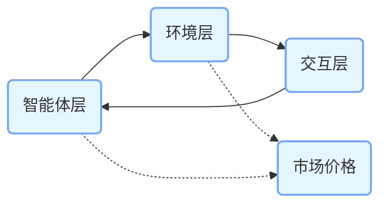

# 多智能体系统在识别市场定价效率中的应用

> 关键词：多智能体系统、市场定价效率、人工智能、经济建模、市场分析

> 摘要：本文深入探讨了多智能体系统在识别市场定价效率方面的应用。首先介绍了多智能体系统和市场定价效率的相关背景知识，包括目的、预期读者、文档结构和术语表。接着详细阐述了核心概念及其联系，给出了原理和架构的文本示意图以及Mermaid流程图。然后讲解了核心算法原理和具体操作步骤，并使用Python源代码进行说明。同时分析了相关的数学模型和公式，通过举例加深理解。通过项目实战，展示了开发环境搭建、源代码实现和代码解读。最后探讨了实际应用场景，推荐了学习资源、开发工具框架和相关论文著作，总结了未来发展趋势与挑战，还提供了常见问题解答和扩展阅读参考资料。旨在为读者全面呈现多智能体系统在市场定价效率识别领域的应用。

## 1. 背景介绍 
### 1.1 目的和范围
在当今复杂多变的市场环境中，准确识别市场定价效率对于投资者、企业和政策制定者都具有至关重要的意义。市场定价效率反映了市场价格对信息的反映程度，高效的市场定价能够促进资源的合理配置，提高市场的整体运行效率。多智能体系统作为一种强大的建模和分析工具，能够模拟市场中多个主体的行为及其相互作用，为深入研究市场定价效率提供了新的视角和方法。

本文的目的在于系统地介绍多智能体系统在识别市场定价效率中的应用，详细阐述相关的原理、算法和实际操作步骤。范围涵盖了多智能体系统的基本概念、核心算法原理、数学模型，以及通过项目实战展示其在实际市场分析中的应用。同时，还会探讨多智能体系统在不同市场环境下的应用场景，并推荐相关的学习资源、开发工具和研究论文。

### 1.2 预期读者
本文预期读者包括但不限于以下几类人群：
- **金融从业者**：如投资经理、交易员、分析师等，他们可以通过本文了解多智能体系统如何帮助识别市场定价效率，为投资决策提供更科学的依据。
- **经济研究人员**：包括经济学家、金融学者等，本文提供的多智能体建模方法和分析思路可以为他们的研究工作提供新的方向和工具。
- **计算机科学专业人员**：尤其是对人工智能、复杂系统建模感兴趣的程序员和软件架构师，他们可以从本文中学习到多智能体系统在经济领域的具体应用，拓宽技术应用场景。
- **政策制定者**：政府部门和监管机构的工作人员可以通过了解市场定价效率的识别方法，制定更加合理有效的市场政策和监管措施。

### 1.3 文档结构概述
本文的结构如下：
- 核心概念与联系：介绍多智能体系统和市场定价效率的核心概念，以及它们之间的联系，同时给出原理和架构的文本示意图和Mermaid流程图。
- 核心算法原理 & 具体操作步骤：详细讲解多智能体系统在识别市场定价效率中所使用的核心算法原理，并给出具体的操作步骤，使用Python源代码进行说明。
- 数学模型和公式 & 详细讲解 & 举例说明：分析相关的数学模型和公式，通过具体例子加深对这些模型和公式的理解。
- 项目实战：代码实际案例和详细解释说明：通过一个实际的项目案例，展示如何搭建开发环境、实现源代码，并对代码进行解读和分析。
- 实际应用场景：探讨多智能体系统在不同市场环境下识别市场定价效率的实际应用场景。
- 工具和资源推荐：推荐相关的学习资源、开发工具框架和研究论文。
- 总结：未来发展趋势与挑战：总结多智能体系统在识别市场定价效率中的应用现状，分析未来的发展趋势和面临的挑战。
- 附录：常见问题与解答：提供常见问题的解答，帮助读者更好地理解本文的内容。
- 扩展阅读 & 参考资料：列出相关的扩展阅读材料和参考资料，方便读者进一步深入研究。

### 1.4 术语表
#### 1.4.1 核心术语定义
- **多智能体系统（Multi - Agent System，MAS）**：由多个自主的智能体组成的系统，这些智能体能够感知环境、进行决策并采取行动，通过相互之间的交互和协作来完成特定的任务。
- **市场定价效率（Market Pricing Efficiency）**：指市场价格能够及时、准确地反映所有相关信息的程度。在有效市场中，价格能够迅速调整以反映新的信息，从而使投资者无法通过利用已有的信息获得超额利润。
- **智能体（Agent）**：具有自主性、反应性、社会性和主动性的实体，能够根据自身的目标和感知到的环境信息做出决策并执行相应的行动。
- **市场微观结构（Market Microstructure）**：研究市场交易机制、交易规则、信息传递等因素如何影响市场价格形成和交易行为的理论。

#### 1.4.2 相关概念解释
- **信息不对称（Information Asymmetry）**：指市场参与者之间掌握的信息存在差异，一方比另一方拥有更多或更准确的信息。信息不对称会影响市场定价效率，导致价格偏离其真实价值。
- **套利（Arbitrage）**：指利用不同市场或不同资产之间的价格差异，通过同时买入和卖出相关资产来获取无风险利润的行为。套利活动可以促进市场价格的均衡，提高市场定价效率。
- **市场有效性假说（Efficient Market Hypothesis，EMH）**：认为市场价格已经反映了所有可用的信息，投资者无法通过分析历史价格或其他公开信息来获得超额利润。市场有效性假说分为弱式有效、半强式有效和强式有效三种形式。

#### 1.4.3 缩略词列表
- MAS：Multi - Agent System（多智能体系统）
- EMH：Efficient Market Hypothesis（市场有效性假说）

## 2. 核心概念与联系 

### 多智能体系统的原理和架构
多智能体系统的核心思想是模拟多个自主智能体在环境中的行为和交互。每个智能体都有自己的目标、感知能力和决策机制，它们通过与环境和其他智能体的交互来不断调整自己的行为。

其架构一般包括以下几个部分：
- **智能体层**：包含多个智能体，每个智能体具有独立的属性和行为规则。例如，在金融市场模拟中，智能体可以代表不同类型的投资者，如散户、机构投资者等。
- **环境层**：提供智能体活动的环境，包括市场信息、交易规则等。智能体通过感知环境获取信息，并根据这些信息做出决策。
- **交互层**：负责智能体之间的通信和交互。智能体可以通过消息传递、合作、竞争等方式与其他智能体进行交互，从而影响整个系统的行为。

以下是多智能体系统原理和架构的文本示意图：

智能体层：多个智能体（投资者智能体、做市商智能体等）
    |
    | 感知
    v
环境层：市场环境（价格信息、交易规则、宏观经济信息等）
    |
    | 交互
    v
交互层：智能体之间的交互（消息传递、合作、竞争）

### Mermaid流程图


### 市场定价效率的概念
市场定价效率反映了市场价格对信息的反映速度和准确性。在一个高效的市场中，新的信息能够迅速被反映到价格中，使得价格能够准确地反映资产的真实价值。市场定价效率的高低受到多种因素的影响，包括市场参与者的行为、信息传递机制、交易成本等。

### 多智能体系统与市场定价效率的联系
多智能体系统可以通过模拟市场中多个参与者的行为和交互，来研究市场定价效率。具体来说，多智能体系统可以：
- **模拟市场参与者的行为**：不同类型的智能体可以代表不同的市场参与者，如投资者、做市商等。通过设置智能体的行为规则，可以模拟他们在市场中的决策过程，从而研究这些行为对市场定价效率的影响。
- **研究信息传递机制**：多智能体系统可以模拟信息在市场中的传播过程，研究信息不对称和信息传递速度对市场定价效率的影响。
- **分析市场微观结构**：通过模拟市场交易机制、交易规则等微观结构因素，多智能体系统可以研究这些因素如何影响市场价格的形成和市场定价效率。

## 3. 核心算法原理 & 具体操作步骤 

### 核心算法原理
在多智能体系统中，常用的算法来模拟市场参与者的行为和识别市场定价效率包括基于规则的算法和基于学习的算法。

#### 基于规则的算法
基于规则的算法通过为智能体设定一系列的行为规则来模拟其决策过程。例如，一个简单的投资者智能体可以根据以下规则进行决策：
- 如果市场价格低于资产的内在价值，则买入该资产。
- 如果市场价格高于资产的内在价值，则卖出该资产。

以下是一个基于规则的投资者智能体的Python代码示例：

```python
class InvestorAgent:
    def __init__(self, intrinsic_value):
        self.intrinsic_value = intrinsic_value

    def decision(self, market_price):
        if market_price < self.intrinsic_value:
            return "buy"
        elif market_price > self.intrinsic_value:
            return "sell"
        else:
            return "hold"


# 示例使用
intrinsic_value = 100
investor = InvestorAgent(intrinsic_value)
market_price = 90
decision = investor.decision(market_price)
print(f"决策: {decision}")
```

#### 基于学习的算法
基于学习的算法允许智能体通过与环境的交互来学习最优的决策策略。常用的基于学习的算法包括强化学习和遗传算法。

以强化学习为例，智能体在每个时间步根据当前的状态选择一个动作，然后根据环境反馈的奖励来更新自己的策略。以下是一个简单的强化学习智能体的Python代码示例：

```python
import numpy as np

class QLearningAgent:
    def __init__(self, num_states, num_actions, learning_rate=0.1, discount_factor=0.9):
        self.q_table = np.zeros((num_states, num_actions))
        self.learning_rate = learning_rate
        self.discount_factor = discount_factor

    def choose_action(self, state):
        if np.random.uniform(0, 1) < 0.1:  # 探索率
            action = np.random.choice(range(self.q_table.shape[1]))
        else:
            action = np.argmax(self.q_table[state, :])
        return action

    def update_q_table(self, state, action, reward, next_state):
        predict = self.q_table[state, action]
        target = reward + self.discount_factor * np.max(self.q_table[next_state, :])
        self.q_table[state, action] = (1 - self.learning_rate) * predict + self.learning_rate * target


# 示例使用
num_states = 5
num_actions = 3
agent = QLearningAgent(num_states, num_actions)
state = 0
action = agent.choose_action(state)
reward = 1
next_state = 1
agent.update_q_table(state, action, reward, next_state)
```

### 具体操作步骤
#### 步骤1：定义智能体和环境
首先，需要定义不同类型的智能体，如投资者智能体、做市商智能体等，并设置它们的初始属性和行为规则。同时，需要定义市场环境，包括市场价格、交易规则等。

#### 步骤2：模拟智能体的交互
在每个时间步，智能体根据自己的感知和决策机制选择一个动作，并与环境和其他智能体进行交互。交互的结果会影响市场价格和智能体的状态。

#### 步骤3：更新市场状态
根据智能体的交互结果，更新市场价格和其他相关的市场状态。

#### 步骤4：评估市场定价效率
在模拟过程中，需要定期评估市场定价效率。可以使用一些指标，如价格偏离度、信息传递速度等，来衡量市场定价效率。

#### 步骤5：重复步骤2 - 4
重复步骤2 - 4，直到达到预定的模拟时间或满足其他终止条件。

以下是一个简单的多智能体市场模拟的Python代码示例：

```python
import random

# 定义投资者智能体
class InvestorAgent:
    def __init__(self, initial_money, initial_shares):
        self.money = initial_money
        self.shares = initial_shares

    def decision(self, market_price):
        if random.random() < 0.5:
            return "buy"
        else:
            return "sell"

    def execute_action(self, action, market_price):
        if action == "buy":
            if self.money >= market_price:
                self.money -= market_price
                self.shares += 1
        elif action == "sell":
            if self.shares > 0:
                self.money += market_price
                self.shares -= 1


# 定义市场环境
class Market:
    def __init__(self, initial_price):
        self.price = initial_price

    def update_price(self, actions):
        buy_count = actions.count("buy")
        sell_count = actions.count("sell")
        if buy_count > sell_count:
            self.price *= 1.01
        elif sell_count > buy_count:
            self.price *= 0.99


# 模拟过程
initial_price = 100
market = Market(initial_price)
agents = [InvestorAgent(1000, 0) for _ in range(10)]

for _ in range(100):
    actions = []
    for agent in agents:
        action = agent.decision(market.price)
        agent.execute_action(action, market.price)
        actions.append(action)
    market.update_price(actions)
    print(f"当前价格: {market.price}")
```

## 4. 数学模型和公式 & 详细讲解 & 举例说明 

### 价格形成模型
在多智能体系统中，市场价格的形成是多个智能体交互的结果。一个简单的价格形成模型可以表示为：

$$P_{t + 1}=P_t\times(1 + \alpha\times(\frac{B_t - S_t}{B_t+S_t}))$$

其中，$P_t$ 是时间 $t$ 的市场价格，$P_{t + 1}$ 是时间 $t + 1$ 的市场价格，$B_t$ 是时间 $t$ 的买入订单数量，$S_t$ 是时间 $t$ 的卖出订单数量，$\alpha$ 是价格调整系数。

#### 详细讲解
这个公式的含义是，市场价格的变化取决于买入订单和卖出订单的数量差。如果买入订单数量大于卖出订单数量，市场价格会上涨；反之，市场价格会下跌。价格调整系数 $\alpha$ 控制了价格变化的幅度。

#### 举例说明
假设当前市场价格 $P_t = 100$，买入订单数量 $B_t = 60$，卖出订单数量 $S_t = 40$，价格调整系数 $\alpha=0.01$。则下一个时间步的市场价格为：

$$P_{t + 1}=100\times(1 + 0.01\times(\frac{60 - 40}{60 + 40}))=100\times(1 + 0.01\times0.2)=100.2$$

### 信息传递模型
信息在市场中的传递可以用一个简单的扩散模型来表示。假设信息的初始传播者数量为 $I_0$，信息的传播率为 $\beta$，每个时间步新感染（获得信息）的智能体数量为：

$$\Delta I_t=\beta\times I_t\times(S_t/N)$$

其中，$I_t$ 是时间 $t$ 已经获得信息的智能体数量，$S_t$ 是时间 $t$ 尚未获得信息的智能体数量，$N$ 是智能体的总数。

#### 详细讲解
这个公式的含义是，信息的传播速度与已经获得信息的智能体数量和尚未获得信息的智能体数量成正比。传播率 $\beta$ 控制了信息传播的速度。

#### 举例说明
假设智能体总数 $N = 100$，初始获得信息的智能体数量 $I_0 = 10$，传播率 $\beta = 0.1$。则在第一个时间步，新感染的智能体数量为：

$$\Delta I_1=0.1\times10\times(\frac{100 - 10}{100})=0.1\times10\times0.9 = 0.9\approx1$$

此时，获得信息的智能体数量变为 $I_1=I_0+\Delta I_1 = 10 + 1 = 11$。

### 市场定价效率评估模型
市场定价效率可以用价格偏离度来评估。价格偏离度定义为市场价格与资产内在价值的差值的绝对值与资产内在价值的比值：

$$D=\frac{|P - V|}{V}$$

其中，$P$ 是市场价格，$V$ 是资产的内在价值。

#### 详细讲解
价格偏离度越小，说明市场价格越接近资产的内在价值，市场定价效率越高。反之，价格偏离度越大，市场定价效率越低。

#### 举例说明
假设资产的内在价值 $V = 100$，市场价格 $P = 105$。则价格偏离度为：

$$D=\frac{|105 - 100|}{100}=0.05$$

## 5. 项目实战：代码实际案例和详细解释说明 

### 5.1  开发环境搭建
#### 编程语言和库
本项目使用Python作为开发语言，需要安装以下常用的库：
- **NumPy**：用于数值计算和数组操作。
- **Matplotlib**：用于数据可视化。
- **Pandas**：用于数据处理和分析。

可以使用以下命令来安装这些库：

```sh
pip install numpy matplotlib pandas
```

#### 开发工具
推荐使用Jupyter Notebook作为开发工具，它可以方便地进行代码编写、调试和结果展示。可以通过以下命令安装Jupyter Notebook：

```sh
pip install jupyter notebook
```

安装完成后，在命令行中输入以下命令启动Jupyter Notebook：

```sh
jupyter notebook
```

### 5.2  源代码详细实现和代码解读
以下是一个完整的多智能体市场模拟项目的Python代码示例：

```python
import numpy as np
import matplotlib.pyplot as plt
import pandas as pd


# 定义投资者智能体
class InvestorAgent:
    def __init__(self, initial_money, initial_shares, intrinsic_value):
        self.money = initial_money
        self.shares = initial_shares
        self.intrinsic_value = intrinsic_value

    def decision(self, market_price):
        if market_price < self.intrinsic_value:
            return "buy"
        elif market_price > self.intrinsic_value:
            return "sell"
        else:
            return "hold"

    def execute_action(self, action, market_price):
        if action == "buy":
            if self.money >= market_price:
                self.money -= market_price
                self.shares += 1
        elif action == "sell":
            if self.shares > 0:
                self.money += market_price
                self.shares -= 1


# 定义市场环境
class Market:
    def __init__(self, initial_price, alpha):
        self.price = initial_price
        self.alpha = alpha

    def update_price(self, actions):
        buy_count = actions.count("buy")
        sell_count = actions.count("sell")
        price_change = self.alpha * ((buy_count - sell_count) / (buy_count + sell_count + 1e-6))
        self.price *= (1 + price_change)


# 模拟过程
initial_price = 100
alpha = 0.01
num_agents = 100
intrinsic_value = 100
initial_money = 1000
initial_shares = 0
num_steps = 200

market = Market(initial_price, alpha)
agents = [InvestorAgent(initial_money, initial_shares, intrinsic_value) for _ in range(num_agents)]

prices = []
for _ in range(num_steps):
    actions = []
    for agent in agents:
        action = agent.decision(market.price)
        agent.execute_action(action, market.price)
        actions.append(action)
    market.update_price(actions)
    prices.append(market.price)


# 数据可视化
plt.plot(prices)
plt.xlabel('时间步')
plt.ylabel('市场价格')
plt.title('多智能体市场模拟')
plt.show()


# 计算价格偏离度
deviations = [abs(price - intrinsic_value) / intrinsic_value for price in prices]
df = pd.DataFrame({'价格': prices, '价格偏离度': deviations})
print(df)
```

### 5.3  代码解读与分析
#### 智能体类 `InvestorAgent`
- `__init__` 方法：初始化智能体的初始资金、初始股票数量和资产的内在价值。
- `decision` 方法：根据市场价格和资产的内在价值做出决策，决定是买入、卖出还是持有。
- `execute_action` 方法：根据决策执行相应的操作，更新智能体的资金和股票数量。

#### 市场类 `Market`
- `__init__` 方法：初始化市场的初始价格和价格调整系数 $\alpha$。
- `update_price` 方法：根据买入和卖出订单的数量更新市场价格，使用前面介绍的价格形成模型。

#### 模拟过程
- 初始化市场和智能体。
- 在每个时间步，每个智能体做出决策并执行相应的操作，然后市场根据智能体的决策更新价格。
- 记录每个时间步的市场价格。

#### 数据可视化和分析
- 使用 `Matplotlib` 绘制市场价格随时间的变化曲线。
- 计算每个时间步的价格偏离度，并使用 `Pandas` 数据框进行存储和展示。

通过这个项目实战，我们可以直观地观察到多智能体系统中市场价格的动态变化，以及市场定价效率的变化情况。

## 6. 实际应用场景 
### 金融市场分析
在股票市场、债券市场、期货市场等金融市场中，多智能体系统可以用于分析市场定价效率。通过模拟不同类型投资者的行为和交互，研究信息传递、市场微观结构等因素对市场价格形成的影响，帮助投资者更好地理解市场动态，制定更合理的投资策略。

例如，在股票市场中，多智能体系统可以模拟机构投资者和散户投资者的不同投资行为，分析他们的交易决策如何影响股票价格的波动。同时，还可以研究信息披露政策、交易规则等因素对市场定价效率的影响，为监管机构制定政策提供参考。

### 电力市场定价
在电力市场中，多智能体系统可以用于模拟发电企业、供电企业和用户的行为，研究电力市场的定价效率。通过设置不同智能体的成本函数、需求函数和决策规则，模拟电力市场的交易过程，分析市场价格的形成机制和影响因素。

例如，发电企业可以根据自身的成本和市场价格决定发电功率，供电企业可以根据市场需求和价格进行购电和售电决策，用户可以根据电价调整自己的用电行为。多智能体系统可以模拟这些行为的交互，评估电力市场的定价效率，为电力市场的改革和优化提供支持。

### 房地产市场研究
在房地产市场中，多智能体系统可以用于研究房地产市场的定价效率。通过模拟开发商、购房者和投资者的行为，分析土地供应、政策调控、市场预期等因素对房地产价格的影响。

例如，开发商可以根据土地成本、市场需求和预期利润决定房屋的开发规模和价格，购房者可以根据自己的收入、购房需求和房价进行购房决策，投资者可以根据房地产市场的走势进行投资决策。多智能体系统可以模拟这些行为的交互，评估房地产市场的定价效率，为政府制定房地产政策提供参考。

## 7. 工具和资源推荐
### 7.1 学习资源推荐
#### 7.1.1 书籍推荐
- 《多智能体系统：原理与编程》：全面介绍了多智能体系统的基本概念、理论和编程方法，适合初学者入门。
- 《金融市场微观结构理论》：深入探讨了金融市场的微观结构和价格形成机制，对于理解市场定价效率有很大帮助。
- 《Python数据分析实战》：介绍了使用Python进行数据分析的方法和技巧，对于多智能体系统的开发和数据分析有很好的指导作用。

#### 7.1.2 在线课程
- Coursera上的“Multi - Agent Systems”课程：由知名教授授课，系统地介绍了多智能体系统的理论和应用。
- edX上的“Financial Markets”课程：讲解了金融市场的基本原理和分析方法，对于多智能体系统在金融市场中的应用有很好的参考价值。
- 中国大学MOOC上的“Python语言程序设计”课程：适合初学者学习Python编程语言，为多智能体系统的开发打下基础。

#### 7.1.3 技术博客和网站
- Medium：上面有很多关于多智能体系统、人工智能和金融科技的技术博客文章，可以及时了解最新的研究动态和应用案例。
- arXiv：一个开放的学术论文预印本平台，提供了大量关于多智能体系统、经济建模等领域的最新研究成果。
- 开源中国：提供了丰富的开源项目和技术文章，对于多智能体系统的开发和学习有很大帮助。

### 7.2 开发工具框架推荐
#### 7.2.1 IDE和编辑器
- PyCharm：一款专业的Python集成开发环境，提供了丰富的代码编辑、调试和分析功能，适合开发大型的多智能体系统项目。
- Jupyter Notebook：一个交互式的开发环境，方便进行代码编写、调试和结果展示，适合快速原型开发和数据分析。
- Visual Studio Code：一款轻量级的代码编辑器，支持多种编程语言和插件扩展，适合初学者和快速开发。

#### 7.2.2 调试和性能分析工具
- PDB：Python自带的调试器，可以帮助开发者定位和解决代码中的问题。
- cProfile：Python的性能分析工具，可以分析代码的运行时间和函数调用情况，帮助优化代码性能。
- Memory Profiler：一个Python内存分析工具，可以帮助开发者检测代码中的内存泄漏问题。

#### 7.2.3 相关框架和库
- Mesa：一个用于构建多智能体系统的Python框架，提供了丰富的智能体和环境模型，方便快速开发多智能体系统。
- OpenAI Gym：一个用于开发和比较强化学习算法的工具包，可以用于多智能体系统中智能体的学习和训练。
- NumPy、Pandas和Matplotlib：常用的Python科学计算和数据可视化库，在多智能体系统的开发和数据分析中经常使用。

### 7.3 相关论文著作推荐
#### 7.3.1 经典论文
- "The Efficient Market Hypothesis and Its Critics"：对市场有效性假说进行了全面的综述和批判，是研究市场定价效率的经典文献。
- "Multi - Agent Systems: A Modern Approach to Distributed Artificial Intelligence"：系统地介绍了多智能体系统的理论和方法，是多智能体系统领域的经典著作。
- "Agent - Based Computational Economics: A Constructive Approach to Economic Theory"：提出了基于智能体的计算经济学方法，为使用多智能体系统研究经济问题提供了理论基础。

#### 7.3.2 最新研究成果
- 关注顶级学术期刊，如《Journal of Financial Economics》、《Artificial Intelligence》、《Journal of Economic Dynamics and Control》等，这些期刊上经常发表关于市场定价效率、多智能体系统等领域的最新研究成果。
- 参加相关的学术会议，如国际多智能体系统会议（AAMAS）、金融计量经济学会议（CEF）等，与领域内的专家和学者交流，了解最新的研究动态。

#### 7.3.3 应用案例分析
- 一些知名的研究机构和企业会发布多智能体系统在市场定价效率分析中的应用案例，如麻省理工学院的计算机科学与人工智能实验室（CSAIL）、谷歌的人工智能研究部门等。可以通过他们的官方网站和研究报告了解相关的应用案例。

## 8. 总结：未来发展趋势与挑战
### 未来发展趋势
#### 与其他技术的融合
多智能体系统将与人工智能的其他技术，如深度学习、强化学习等进行更深入的融合。通过结合深度学习的强大特征提取能力和强化学习的智能决策能力，多智能体系统可以更准确地模拟市场参与者的行为，提高市场定价效率识别的准确性。

#### 应用领域的拓展
除了金融市场、电力市场和房地产市场等传统领域，多智能体系统在供应链管理、医疗保健、交通管理等领域的应用也将逐渐增多。通过模拟这些领域中多个主体的行为和交互，可以优化资源配置，提高系统的运行效率。

#### 实时性和大规模模拟
随着计算机性能的不断提高，多智能体系统将能够进行更实时、更大规模的模拟。这将使得我们能够更及时地捕捉市场动态，对市场定价效率进行更准确的评估。

### 面临的挑战
#### 模型的准确性和可靠性
多智能体系统的模型需要准确地反映市场参与者的行为和市场的运行机制。然而，市场行为具有复杂性和不确定性，很难建立一个完全准确的模型。因此，如何提高模型的准确性和可靠性是一个重要的挑战。

#### 数据的获取和处理
多智能体系统的模拟需要大量的市场数据，包括价格数据、交易数据、宏观经济数据等。然而，数据的获取和处理存在一定的困难，如数据的质量问题、数据的隐私保护问题等。如何有效地获取和处理这些数据是一个亟待解决的问题。

#### 计算资源的需求
大规模的多智能体系统模拟需要大量的计算资源，包括CPU、内存等。随着模拟规模的不断增大，计算资源的需求也将不断增加。如何优化算法，降低计算资源的需求，是一个需要解决的问题。

## 9. 附录：常见问题与解答
### 问题1：多智能体系统与传统的经济模型有什么区别？
传统的经济模型通常基于一些简化的假设，如理性人假设、完全信息假设等，来描述市场参与者的行为和市场的运行机制。而多智能体系统则更加注重模拟市场参与者的真实行为和交互，允许智能体具有不同的决策规则和学习能力，能够更真实地反映市场的复杂性和不确定性。

### 问题2：如何评估多智能体系统模拟结果的有效性？
可以通过以下几种方法评估多智能体系统模拟结果的有效性：
- **与实际数据对比**：将模拟结果与实际市场数据进行对比，分析模拟结果与实际情况的吻合程度。
- **敏感性分析**：改变模型的参数和假设，观察模拟结果的变化情况，分析模型的稳定性和可靠性。
- **专家评估**：邀请领域内的专家对模拟结果进行评估，听取他们的意见和建议。

### 问题3：多智能体系统在实际应用中存在哪些局限性？
多智能体系统在实际应用中存在以下局限性：
- **模型的复杂性**：多智能体系统的模型通常比较复杂，需要考虑多个因素和智能体之间的交互，增加了模型的开发和调试难度。
- **数据的依赖性**：多智能体系统的模拟需要大量的市场数据，数据的质量和完整性会影响模拟结果的准确性。
- **计算资源的需求**：大规模的多智能体系统模拟需要大量的计算资源，对计算机性能要求较高。

## 10. 扩展阅读 & 参考资料
### 扩展阅读
- 《复杂经济学：经济思想的新框架》：探讨了复杂经济学的理论和方法，为理解多智能体系统在经济领域的应用提供了新的视角。
- 《人工智能时代的金融风险管理》：介绍了人工智能技术在金融风险管理中的应用，包括多智能体系统在识别市场定价效率中的应用。
- 《多智能体系统中的合作与竞争》：深入研究了多智能体系统中智能体之间的合作与竞争关系，对于理解市场参与者的行为有很大帮助。

### 参考资料
- Wooldridge, M. (2009). An Introduction to Multi - Agent Systems. John Wiley & Sons.
- Fama, E. F. (1970). Efficient capital markets: A review of theory and empirical work. The Journal of Finance, 25(2), 383 - 417.
- Tesfatsion, L., & Judd, K. L. (Eds.). (2006). Handbook of computational economics: Agent - based computational economics. Elsevier.

作者：AI天才研究院/AI Genius Institute & 禅与计算机程序设计艺术 /Zen And The Art of Computer Programming